<style>
/* ============================================================
   CHAPTER 9 — PAGE + COLLAPSIBLE TABLE OF CONTENTS
   ============================================================ */

:root {
  --toc-width: 300px;
  --toc-collapsed-gutter: 72px;
  --chapter-width: 1100px;

  --ink: #23364a;
  --accent: #2c3e50;
  --line: #d8dee4;
  --soft: #f6f8fa;
  --toc-background: #f7f9fb;
}


/* ============================================================
   GENERAL PAGE
   ============================================================ */

html {
  scroll-behavior: smooth;
}

body {
  font-size: 17px;
  line-height: 1.65;
  color: var(--ink);
}

.main-container {
  max-width: var(--chapter-width) !important;
}


/* ============================================================
   HIDE DUMMY CHAPTER CONTENT
   ============================================================ */

/*
   Chapter 9 is used as the numbering root.

   Hide the visible "Chapter 9" H1 because the document title
   already says Chapter 9, but KEEP the section itself so that
   H2 headings are numbered 9.1, 9.2, 9.3, ...
*/
.section.chapter-root > h1 {
  display: none !important;
}


/* ============================================================
   HIDE CHAPTERS 1–8 FROM THE TABLE OF CONTENTS
   ============================================================ */

/*
   R Markdown/tocify does not reliably expose the chapter names
   through data-unique, so select them through their generated
   href values instead.
*/

#TOC li:has(a[href="#chapter-1-dummy"]),
#TOC li:has(a[href="#chapter-2-dummy"]),
#TOC li:has(a[href="#chapter-3-dummy"]),
#TOC li:has(a[href="#chapter-4-dummy"]),
#TOC li:has(a[href="#chapter-5-dummy"]),
#TOC li:has(a[href="#chapter-6-dummy"]),
#TOC li:has(a[href="#chapter-7-dummy"]),
#TOC li:has(a[href="#chapter-8-dummy"]) {
  display: none !important;
}


/*
   Also hide the Chapter 9 parent entry itself.

   Its children — 9.1, 9.2, 9.3, ... — remain visible.
*/
#TOC li:has(> a[href="#chapter-9"]) > a[href="#chapter-9"] {
  display: none !important;
}


/*
   tocify may place the Chapter 9 subsections inside the same
   list item. Remove spacing belonging to the hidden parent.
*/
#TOC li:has(> a[href="#chapter-9"]) {
  margin-top: 0 !important;
}


/* ============================================================
   ACCESSIBILITY
   ============================================================ */

.sr-only {
  position: absolute;
  width: 1px;
  height: 1px;
  padding: 0;
  margin: -1px;
  overflow: hidden;
  clip: rect(0, 0, 0, 0);
  white-space: nowrap;
  border: 0;
}


/* ============================================================
   SIDEBAR TOGGLE BUTTON
   ============================================================ */

#toc-toggle {
  position: fixed;

  top: 16px;
  left: calc(var(--toc-width) + 14px);

  width: 42px;
  height: 42px;

  display: flex;
  align-items: center;
  justify-content: center;

  padding: 0;

  border: 1px solid #c7d0d9;
  border-radius: 8px;

  background: #ffffff;
  color: var(--ink);

  box-shadow: 0 2px 8px rgba(24, 39, 55, 0.13);

  cursor: pointer;

  font-size: 24px;
  line-height: 1;

  z-index: 1200;

  transition:
    left 0.25s ease,
    background-color 0.2s ease,
    box-shadow 0.2s ease,
    transform 0.2s ease;
}

#toc-toggle:hover {
  background: #eef3f7;
  box-shadow: 0 3px 10px rgba(24, 39, 55, 0.18);
}

#toc-toggle:focus-visible {
  outline: 3px solid rgba(44, 62, 80, 0.28);
  outline-offset: 2px;
}


/* Open/close icons */

#toc-toggle .menu-icon {
  display: none;
}

#toc-toggle .close-icon {
  display: inline;
}


/* Button position when sidebar is collapsed */

body.toc-collapsed #toc-toggle {
  left: 14px;
}

body.toc-collapsed #toc-toggle .menu-icon {
  display: inline;
}

body.toc-collapsed #toc-toggle .close-icon {
  display: none;
}


/* ============================================================
   DESKTOP LAYOUT
   ============================================================ */

@media screen and (min-width: 992px) {

  /*
     Make room for fixed sidebar.
  */
  .main-container {
    width: 100% !important;
    max-width: none !important;

    padding-left: calc(var(--toc-width) + 30px) !important;
    padding-right: 35px !important;

    box-sizing: border-box !important;

    transition: padding-left 0.25s ease;
  }


  /*
     When sidebar is collapsed, reclaim almost all of the space.
  */
  body.toc-collapsed .main-container {
    padding-left: var(--toc-collapsed-gutter) !important;
  }


  /*
     Bootstrap normally reserves a column for the TOC.
     The TOC is fixed now, so remove that reserved column.
  */
  .main-container > .row-fluid > .col-xs-12.col-sm-4.col-md-3,
  .main-container > .row > .col-xs-12.col-sm-4.col-md-3 {
    width: 0 !important;
    min-height: 0 !important;
    padding: 0 !important;
    margin: 0 !important;
  }


  /* ----------------------------------------------------------
     FLOATING TOC
     ---------------------------------------------------------- */

  #TOC,
  #TOC.tocify {
    position: fixed !important;

    top: 0 !important;
    bottom: 0 !important;
    left: 0 !important;

    width: var(--toc-width) !important;
    max-height: 100vh !important;

    box-sizing: border-box !important;

    overflow-y: auto !important;
    overflow-x: hidden !important;

    margin: 0 !important;
    padding: 72px 16px 28px 18px !important;

    background: var(--toc-background) !important;

    border: 0 !important;
    border-right: 1px solid var(--line) !important;
    border-radius: 0 !important;

    box-shadow: none !important;

    z-index: 1100 !important;

    transform: translateX(0);

    transition: transform 0.25s ease;
  }


  /*
     Completely slide sidebar off screen when collapsed.
  */
  body.toc-collapsed #TOC,
  body.toc-collapsed #TOC.tocify {
    transform: translateX(calc(-1 * var(--toc-width)));
  }


  /*
     Allow long section headings to wrap rather than getting
     clipped.
  */
  #TOC a {
    white-space: normal !important;
    overflow-wrap: break-word !important;
    word-break: normal !important;
  }


  /* ----------------------------------------------------------
     TOC TYPOGRAPHY
     ---------------------------------------------------------- */

  #TOC .tocify-item {
    border-radius: 4px;
  }

  #TOC .tocify-item a {
    color: var(--ink);
    text-decoration: none;
  }

  #TOC .tocify-item:hover {
    background: #e9eef3;
  }

  #TOC .tocify-item.active {
    background: var(--accent) !important;
  }

  #TOC .tocify-item.active a {
    color: #ffffff !important;
  }


  /* ----------------------------------------------------------
     MAIN CHAPTER CONTENT
     ---------------------------------------------------------- */

  .toc-content,
  .toc-content.col-xs-12.col-sm-8.col-md-9 {
    width: 100% !important;
    max-width: var(--chapter-width) !important;

    float: none !important;

    margin-left: auto !important;
    margin-right: auto !important;

    padding-left: 15px !important;
    padding-right: 15px !important;

    box-sizing: border-box !important;
  }


  /*
     Fallback for Pandoc output that does not use Bootstrap's
     normal R Markdown container structure.
  */
  body.standalone-pandoc {
    width: calc(100% - var(--toc-width)) !important;
    max-width: none !important;

    box-sizing: border-box !important;

    margin: 0 0 0 var(--toc-width) !important;
    padding: 50px 45px !important;

    transition:
      width 0.25s ease,
      margin-left 0.25s ease,
      padding-left 0.25s ease;
  }

  body.standalone-pandoc.toc-collapsed {
    width: 100% !important;

    margin-left: 0 !important;
    padding-left: var(--toc-collapsed-gutter) !important;
  }

  body.standalone-pandoc > header,
  body.standalone-pandoc > section {
    max-width: var(--chapter-width);

    margin-left: auto;
    margin-right: auto;
  }
}


/* ============================================================
   MOBILE / TABLET
   ============================================================ */

@media screen and (max-width: 991px) {

  .main-container {
    width: auto !important;
    max-width: var(--chapter-width) !important;

    margin-left: auto !important;
    margin-right: auto !important;

    padding: 70px 18px 24px !important;

    box-sizing: border-box !important;
  }


  /*
     Toggle remains at upper-left on mobile.
  */
  #toc-toggle,
  body.toc-collapsed #toc-toggle {
    left: 12px;
  }


  /*
     Mobile starts with menu icon.
  */
  #toc-toggle .menu-icon,
  body.toc-collapsed #toc-toggle .menu-icon {
    display: inline;
  }

  #toc-toggle .close-icon,
  body.toc-collapsed #toc-toggle .close-icon {
    display: none;
  }


  /*
     Show X while the mobile TOC is open.
  */
  body.toc-mobile-open #toc-toggle .menu-icon {
    display: none;
  }

  body.toc-mobile-open #toc-toggle .close-icon {
    display: inline;
  }


  /* ----------------------------------------------------------
     MOBILE TOC DRAWER
     ---------------------------------------------------------- */

  #TOC,
  #TOC.tocify {
    position: fixed !important;

    top: 0 !important;
    bottom: 0 !important;
    left: 0 !important;

    width: min(84vw, 320px) !important;
    max-height: 100vh !important;

    box-sizing: border-box !important;

    overflow-y: auto !important;
    overflow-x: hidden !important;

    margin: 0 !important;
    padding: 72px 18px 28px !important;

    background: var(--toc-background) !important;

    border: 0 !important;
    border-right: 1px solid var(--line) !important;
    border-radius: 0 !important;

    z-index: 1100 !important;

    transform: translateX(-105%);

    transition: transform 0.25s ease;
  }

  body.toc-mobile-open #TOC,
  body.toc-mobile-open #TOC.tocify {
    transform: translateX(0);

    box-shadow: 6px 0 18px rgba(24, 39, 55, 0.16);
  }


  /*
     Prevent long headings from being clipped.
  */
  #TOC a {
    white-space: normal !important;
    overflow-wrap: break-word !important;
    word-break: normal !important;
  }


  body.standalone-pandoc {
    width: auto !important;
    max-width: var(--chapter-width) !important;

    margin: 0 auto !important;
    padding: 70px 18px 24px !important;

    box-sizing: border-box !important;
  }
}


/* ============================================================
   SECTION HEADINGS
   ============================================================ */

h1,
h2,
h3,
h4,
h5 {
  margin-top: 1.6em;
}

h2 {
  border-bottom: 3px solid var(--accent);
  padding-bottom: 0.25em;
}

h3 {
  border-bottom: 1px solid var(--line);
  padding-bottom: 0.2em;
}


/* ============================================================
   BLOCKQUOTES / DEFINITION BOXES
   ============================================================ */

blockquote {
  border-left: 4px solid var(--accent);

  background: #f7f9fa;

  padding: 0.7em 1em;
  margin-top: 1.2em;
  margin-bottom: 1.2em;
}


/* ============================================================
   TABLES
   ============================================================ */

table {
  width: 100%;

  margin: 1.35em auto;

  border-collapse: separate !important;
  border-spacing: 0;

  background: #ffffff;

  border: 1px solid #d6dde5;
  border-radius: 8px;

  overflow: hidden;

  box-shadow: 0 2px 8px rgba(24, 39, 55, 0.06);
}

table thead th {
  padding: 0.72em 0.9em !important;

  background: var(--accent);
  color: #ffffff;

  border: 0 !important;
  border-bottom: 1px solid #1e2d3b !important;

  font-weight: 700;

  vertical-align: middle !important;
}

table tbody td {
  padding: 0.65em 0.9em !important;

  border: 0 !important;
  border-bottom: 1px solid #e5e9ee !important;

  vertical-align: middle !important;
}

table tbody tr:nth-child(even) td {
  background: #f7f9fb;
}

table tbody tr:hover td {
  background: #eef4f8;
}

table tbody tr:last-child td {
  border-bottom: 0 !important;
}


/* ============================================================
   IMAGES
   ============================================================ */

img {
  display: block;

  max-width: 100%;
  height: auto;

  margin: 1.4em auto;

  border: 1px solid #e1e4e8;
  border-radius: 7px;
}


/* ============================================================
   MATHEMATICS
   ============================================================ */

.math.display {
  overflow-x: auto;
}


/* ============================================================
   HIDE R MARKDOWN CODE-FOLDING UI
   ============================================================ */

.btn-code,
.code-folding-btn,
div.btn-group.pull-right {
  display: none !important;
}
</style>

<button id="toc-toggle"
        type="button"
        aria-label="Toggle table of contents"
        aria-expanded="true">
  <span class="menu-icon" aria-hidden="true">&#9776;</span>
  <span class="close-icon" aria-hidden="true">&times;</span>
  <span class="sr-only">Toggle table of contents</span>
</button>

<script>
document.addEventListener("DOMContentLoaded", function () {
  const button = document.getElementById("toc-toggle");

  if (!button) return;

  button.addEventListener("click", function () {
    if (window.innerWidth <= 991) {
      document.body.classList.toggle("toc-mobile-open");

      const isOpen =
        document.body.classList.contains("toc-mobile-open");

      button.setAttribute("aria-expanded", isOpen);
    } else {
      document.body.classList.toggle("toc-collapsed");

      const isOpen =
        !document.body.classList.contains("toc-collapsed");

      button.setAttribute("aria-expanded", isOpen);
    }
  });
});
</script>


```{r setup, include=FALSE}
knitr::opts_chunk$set(
  echo = FALSE,
  warning = FALSE,
  message = FALSE,
  error = FALSE
)

required_packages <- c("ggplot2", "gridExtra")
missing_packages <- required_packages[
  !vapply(required_packages, requireNamespace, logical(1), quietly = TRUE)
]

if (length(missing_packages) > 0) {
  stop(
    "Install the following R packages before knitting: ",
    paste(missing_packages, collapse = ", ")
  )
}

suppressPackageStartupMessages({
  library(ggplot2)
  library(gridExtra)
})
```


```{r generate_all_lecture_figures, include=FALSE, echo=FALSE, warning=FALSE, message=FALSE}
set.seed(42)

# Shared lecture theme and colour palette.
lecture_theme <- theme_minimal(base_size = 11) +
  theme(
    plot.title = element_text(size = 13, face = "bold", hjust = 0.5),
    plot.subtitle = element_text(size = 10.5, hjust = 0.5),
    axis.title = element_text(size = 12),
    axis.text = element_text(size = 10, colour = "#333333"),
    panel.grid.minor = element_blank(),
    plot.background = element_rect(fill = "white", colour = NA),
    panel.background = element_rect(fill = "white", colour = NA),
    plot.margin = margin(8, 10, 8, 10)
  )

palette_main <- c("#4C72B0", "#55A868", "#C44E52", "#8172B2")

save_plot <- function(filename, plot, width, height) {
  ggsave(
    filename = filename,
    plot = plot,
    width = width,
    height = height,
    units = "in",
    dpi = 300,
    bg = "white"
  )
}

# =============================================================
# 1. Same mean, different distributions
# =============================================================
plant_a <- c(18, 19, 19, 20, 20, 21, 23)
plant_b <- c(10, 15, 18, 20, 22, 25, 30)

same_mean_df <- rbind(
  data.frame(group = "Sample A: tightly clustered", value = plant_a),
  data.frame(group = "Sample B: much more spread out", value = plant_b)
)
same_mean_df$stack <- ave(
  same_mean_df$value,
  same_mean_df$group,
  same_mean_df$value,
  FUN = seq_along
)

p_same_mean <- ggplot(same_mean_df, aes(x = value, y = stack)) +
  geom_point(size = 3.4, shape = 21, fill = palette_main[1], colour = "black") +
  geom_vline(xintercept = 20, linetype = "dashed", linewidth = 0.7) +
  facet_wrap(~group, ncol = 1) +
  scale_y_continuous(breaks = NULL) +
  scale_x_continuous(limits = c(8, 32), breaks = seq(10, 30, 5)) +
  labs(
    title = "Same Mean, Very Different Data",
    subtitle = "Both samples have mean plant height = 20 cm",
    x = "Plant Height (cm)",
    y = NULL
  ) +
  lecture_theme +
  theme(panel.grid.horizontal = element_blank())

save_plot("fig_same_mean_different_data.png", p_same_mean, width = 7, height = 4.5)

# =============================================================
# 2. Bar graph vs. pie chart (blood types)
# =============================================================
blood_df <- data.frame(
  blood_type = factor(c("O", "A", "B", "AB"), levels = c("O", "A", "B", "AB")),
  percentage = c(45, 40, 11, 4),
  colour = palette_main
)

p_bar_blood <- ggplot(blood_df, aes(x = blood_type, y = percentage, fill = colour)) +
  geom_col(width = 0.6, colour = "black") +
  geom_text(aes(label = paste0(percentage, "%")), vjust = -0.45, fontface = "bold", size = 3.6) +
  scale_fill_identity() +
  scale_y_continuous(limits = c(0, 50), expand = expansion(mult = c(0, 0.03))) +
  labs(
    title = "Bar Graph",
    subtitle = "Best for comparing category sizes",
    x = "Blood Type",
    y = "Percentage (%)"
  ) +
  lecture_theme

blood_pie_df <- transform(
  blood_df,
  label = paste0(blood_type, "\n", percentage, "%")
)

p_pie_blood <- ggplot(blood_pie_df, aes(x = "", y = percentage, fill = colour)) +
  geom_col(width = 1, colour = "white", linewidth = 0.6) +
  coord_polar(theta = "y") +
  geom_text(
    aes(label = label),
    position = position_stack(vjust = 0.5),
    size = 3.3
  ) +
  scale_fill_identity() +
  labs(
    title = "Pie Chart",
    subtitle = "Useful for a simple part-to-whole message"
  ) +
  theme_void(base_size = 11) +
  theme(
    plot.title = element_text(size = 13, face = "bold", hjust = 0.5),
    plot.subtitle = element_text(size = 10.5, hjust = 0.5)
  )

save_plot(
  "fig_bar_vs_pie.png",
  arrangeGrob(p_bar_blood, p_pie_blood, ncol = 2),
  width = 8.5,
  height = 3.8
)

# =============================================================
# 3. Misleading truncated bar-chart axis
# =============================================================
yield_df <- data.frame(
  catalyst = factor(c("Catalyst A", "Catalyst B"), levels = c("Catalyst A", "Catalyst B")),
  yield = c(78, 82)
)

p_axis_good <- ggplot(yield_df, aes(x = catalyst, y = yield)) +
  geom_col(width = 0.58, fill = palette_main[1], colour = "black") +
  geom_text(aes(label = paste0(yield, "%")), vjust = -0.45, fontface = "bold", size = 3.5) +
  scale_y_continuous(limits = c(0, 100), expand = expansion(mult = c(0, 0.02))) +
  labs(
    title = "Better Display",
    subtitle = "Bar axis begins at 0%",
    x = NULL,
    y = "Average Reaction Yield (%)"
  ) +
  lecture_theme

p_axis_bad <- ggplot(yield_df, aes(x = catalyst, y = yield)) +
  geom_col(width = 0.58, fill = palette_main[3], colour = "black") +
  geom_text(aes(label = paste0(yield, "%")), vjust = -0.45, fontface = "bold", size = 3.5) +
  coord_cartesian(ylim = c(75, 85)) +
  labs(
    title = "Misleading Display",
    subtitle = "Starting near 75% exaggerates a 4-point difference",
    x = NULL,
    y = "Average Reaction Yield (%)"
  ) +
  lecture_theme

save_plot(
  "fig_truncated_bar_axis.png",
  arrangeGrob(p_axis_good, p_axis_bad, ncol = 2),
  width = 9,
  height = 3.8
)

# =============================================================
# 4. Wrong line graph for nominal categories
# =============================================================
p_nominal_bar <- ggplot(blood_df, aes(x = blood_type, y = percentage)) +
  geom_col(width = 0.6, fill = palette_main[2], colour = "black") +
  geom_text(aes(label = paste0(percentage, "%")), vjust = -0.4, fontface = "bold", size = 3.4) +
  scale_y_continuous(limits = c(0, 50), expand = expansion(mult = c(0, 0.03))) +
  labs(
    title = "Correct: Bar Graph",
    subtitle = "Blood type is nominal categorical",
    x = "Blood Type",
    y = "Percentage (%)"
  ) +
  lecture_theme

p_nominal_line <- ggplot(blood_df, aes(x = blood_type, y = percentage, group = 1)) +
  geom_line(linewidth = 1, colour = palette_main[3]) +
  geom_point(size = 3, colour = palette_main[3]) +
  scale_y_continuous(limits = c(0, 50)) +
  labs(
    title = "Poor Choice: Line Graph",
    subtitle = "The connecting line suggests a meaningful path/order",
    x = "Blood Type",
    y = "Percentage (%)"
  ) +
  lecture_theme

save_plot(
  "fig_wrong_line_categorical.png",
  arrangeGrob(p_nominal_bar, p_nominal_line, ncol = 2),
  width = 9,
  height = 3.8
)

# =============================================================
# 5. Invalid pie chart for percentages with different denominators
# =============================================================
sleep_rate_df <- data.frame(
  year = factor(c("Year 1", "Year 2", "Year 3", "Year 4"), levels = c("Year 1", "Year 2", "Year 3", "Year 4")),
  percent = c(72, 65, 61, 58),
  colour = palette_main
)

p_sleep_bar <- ggplot(sleep_rate_df, aes(x = year, y = percent, fill = colour)) +
  geom_col(width = 0.6, colour = "black") +
  geom_text(aes(label = paste0(percent, "%")), vjust = -0.45, fontface = "bold", size = 3.5) +
  scale_fill_identity() +
  scale_y_continuous(limits = c(0, 80), expand = expansion(mult = c(0, 0.03))) +
  labs(
    title = "Correct: Compare Rates with Bars",
    subtitle = "Each year has its own denominator",
    x = "Year of Study",
    y = "Students Reporting 7+ Hours of Sleep (%)"
  ) +
  lecture_theme

p_sleep_wrong_pie <- ggplot(sleep_rate_df, aes(x = "", y = percent, fill = year)) +
  geom_col(width = 1, colour = "white", linewidth = 0.6) +
  coord_polar(theta = "y") +
  labs(
    title = "Wrong: A Pie Chart Creates a Fake Whole",
    subtitle = "72%, 65%, 61%, and 58% are separate group rates",
    fill = "Year"
  ) +
  theme_void(base_size = 11) +
  theme(
    plot.title = element_text(size = 12, face = "bold", hjust = 0.5),
    plot.subtitle = element_text(size = 10, hjust = 0.5),
    legend.position = "right"
  )

save_plot(
  "fig_wrong_pie_denominators.png",
  arrangeGrob(p_sleep_bar, p_sleep_wrong_pie, ncol = 2),
  width = 9.5,
  height = 4
)

# =============================================================
# 6. Histogram bin-width comparison
# =============================================================
plant_heights <- rnorm(150, mean = 20, sd = 2.6)
plant_height_df <- data.frame(height = plant_heights)

p_hist_wide <- ggplot(plant_height_df, aes(x = height)) +
  geom_histogram(bins = 4, fill = palette_main[1], colour = "black") +
  labs(
    title = "Too Few Bins",
    subtitle = "Important shape is hidden",
    x = "Plant Height (cm)",
    y = "Frequency"
  ) +
  lecture_theme

p_hist_reasonable <- ggplot(plant_height_df, aes(x = height)) +
  geom_histogram(bins = 12, fill = palette_main[2], colour = "black") +
  labs(
    title = "Reasonable Choice",
    subtitle = "Overall shape is easy to see",
    x = "Plant Height (cm)",
    y = NULL
  ) +
  lecture_theme

p_hist_narrow <- ggplot(plant_height_df, aes(x = height)) +
  geom_histogram(bins = 35, fill = palette_main[3], colour = "black") +
  labs(
    title = "Too Many Bins",
    subtitle = "Random noise looks important",
    x = "Plant Height (cm)",
    y = NULL
  ) +
  lecture_theme

save_plot(
  "fig_hist_binwidth.png",
  arrangeGrob(p_hist_wide, p_hist_reasonable, p_hist_narrow, ncol = 3),
  width = 11,
  height = 3.7
)

# =============================================================
# 7. Right-skewed distribution for SOCS
# =============================================================
germination_time <- rgamma(180, shape = 2.2, scale = 1.7) + 1
seed_df <- data.frame(days = germination_time)
seed_median <- median(germination_time)

p_hist_socs <- ggplot(seed_df, aes(x = days)) +
  geom_histogram(bins = 18, fill = palette_main[3], colour = "black", alpha = 0.88) +
  geom_vline(xintercept = seed_median, linetype = "dashed", linewidth = 0.8) +
  annotate(
    "text",
    x = seed_median + 0.3,
    y = Inf,
    label = sprintf("Median = %.1f days", seed_median),
    vjust = 1.5,
    hjust = 0,
    fontface = "bold",
    size = 3.4
  ) +
  labs(
    title = "Right-Skewed Distribution: Seed Germination Time",
    x = "Days Until Germination",
    y = "Number of Seeds"
  ) +
  lecture_theme

save_plot("fig_hist_socs.png", p_hist_socs, width = 6.5, height = 4)

# =============================================================
# 8. Great white shark histograms
# =============================================================
sharks <- c(
  18.7, 12.3, 18.6, 16.4, 15.7, 18.3, 14.6, 15.8, 14.9, 17.6, 12.1,
  16.4, 16.7, 17.8, 16.2, 12.6, 17.8, 13.8, 12.2, 15.2, 14.7, 12.4,
  13.2, 15.8, 14.3, 16.6, 9.4, 18.2, 13.2, 13.6, 15.3, 16.1, 13.5,
  19.1, 16.2, 22.8, 16.8, 13.6, 13.2, 15.7, 19.7, 18.7, 13.2, 16.8
)
shark_df <- data.frame(length = sharks)

p_sharks_7 <- ggplot(shark_df, aes(x = length)) +
  geom_histogram(
    breaks = seq(9, 23, by = 2),
    fill = palette_main[1],
    colour = "black"
  ) +
  labs(
    title = "7 Classes (Width = 2.0 ft)",
    x = "Shark Body Length (feet)",
    y = "Count"
  ) +
  lecture_theme

p_sharks_10 <- ggplot(shark_df, aes(x = length)) +
  geom_histogram(
    breaks = seq(9, 24, by = 1.5),
    fill = palette_main[2],
    colour = "black"
  ) +
  labs(
    title = "10 Classes (Width = 1.5 ft)",
    x = "Shark Body Length (feet)",
    y = NULL
  ) +
  lecture_theme

save_plot(
  "fig_sharks_hist.png",
  arrangeGrob(p_sharks_7, p_sharks_10, ncol = 2),
  width = 9,
  height = 3.8
)

# =============================================================
# 9. Dotplots comparing plant growth groups
# =============================================================
control_height <- c(10, 11, 12, 12, 13, 13, 14, 15, 15, 16)
fertilizer_height <- c(12, 13, 14, 14, 15, 16, 16, 17, 18, 19)

plant_dot_df <- rbind(
  data.frame(value = control_height, group = "No Fertilizer", base = 1, colour = palette_main[1]),
  data.frame(value = fertilizer_height, group = "Fertilizer", base = 2, colour = palette_main[2])
)
plant_dot_df$stack <- ave(
  plant_dot_df$value,
  plant_dot_df$group,
  plant_dot_df$value,
  FUN = seq_along
)
plant_dot_df$y <- plant_dot_df$base + (plant_dot_df$stack - 1) * 0.12

p_plant_dot <- ggplot(plant_dot_df, aes(x = value, y = y, fill = colour)) +
  geom_point(size = 3.4, colour = "black", shape = 21) +
  scale_fill_identity() +
  scale_x_continuous(limits = c(9, 20), breaks = 10:19) +
  scale_y_continuous(
    limits = c(0.6, 2.7),
    breaks = c(1.1, 2.1),
    labels = c("No Fertilizer\n(n = 10)", "Fertilizer\n(n = 10)")
  ) +
  labs(
    title = "Dotplot: Plant Height After Two Weeks",
    x = "Plant Height (cm)",
    y = NULL
  ) +
  lecture_theme +
  theme(panel.grid.horizontal = element_blank())

save_plot("fig_plant_dotplot.png", p_plant_dot, width = 6.5, height = 3.6)

# =============================================================
# 10. Time plot showing a repeating cycle
# =============================================================
hours <- seq(0, 48, by = 1)
temp <- 36.8 + 0.45 * sin(2 * pi * (hours - 8) / 24) + rnorm(length(hours), 0, 0.07)
temp_df <- data.frame(hours = hours, temperature = temp)

p_timeplot <- ggplot(temp_df, aes(x = hours, y = temperature)) +
  geom_line(colour = palette_main[2], linewidth = 0.8) +
  geom_point(colour = palette_main[2], size = 1.5) +
  labs(
    title = "Time Plot: A Repeating Daily Pattern",
    subtitle = "Illustrative body-temperature measurements over 48 hours",
    x = "Time Elapsed (Hours)",
    y = "Temperature (°C)"
  ) +
  lecture_theme

save_plot("fig_timeplot.png", p_timeplot, width = 6.5, height = 3.7)

# =============================================================
# 11. Histogram vs. time plot: instrument drift
# =============================================================
days <- 1:60
standard_concentration <- 100 + 0.12 * days + rnorm(length(days), 0, 0.8)
drift_df <- data.frame(day = days, concentration = standard_concentration)

p_drift_hist <- ggplot(drift_df, aes(x = concentration)) +
  geom_histogram(bins = 10, fill = palette_main[4], colour = "black") +
  labs(
    title = "Histogram",
    subtitle = "Shows the distribution, but loses time order",
    x = "Measured Concentration (mg/L)",
    y = "Frequency"
  ) +
  lecture_theme

p_drift_time <- ggplot(drift_df, aes(x = day, y = concentration)) +
  geom_line(colour = palette_main[3], linewidth = 0.7) +
  geom_point(colour = palette_main[3], size = 1.3) +
  geom_hline(yintercept = 100, linetype = "dashed", linewidth = 0.7) +
  labs(
    title = "Time Plot",
    subtitle = "Reveals gradual instrument drift",
    x = "Day",
    y = "Measured Concentration (mg/L)"
  ) +
  lecture_theme

save_plot(
  "fig_time_order_drift.png",
  arrangeGrob(p_drift_hist, p_drift_time, ncol = 2),
  width = 9.5,
  height = 3.8
)

# =============================================================
# 12. Data-entry error example
# =============================================================
sample_idx <- 1:20
body_temp <- rnorm(20, mean = 37.0, sd = 0.2)
body_temp[14] <- 370.0
body_temp_df <- data.frame(sample = sample_idx, temperature = body_temp)

p_data_entry <- ggplot(body_temp_df, aes(x = sample, y = temperature)) +
  geom_line(colour = palette_main[3], linewidth = 0.7) +
  geom_point(colour = palette_main[3], size = 2) +
  annotate(
    "segment",
    x = 7,
    xend = 14,
    y = 275,
    yend = 365,
    arrow = grid::arrow(length = grid::unit(0.18, "cm")),
    linewidth = 0.6
  ) +
  annotate(
    "text",
    x = 7,
    y = 275,
    label = "Likely data-entry error\n370°C instead of 37.0°C",
    fontface = "bold",
    hjust = 0.5,
    vjust = 1.1,
    size = 3.5
  ) +
  labs(
    title = "Why We Plot Before We Calculate",
    x = "Sample Number",
    y = "Recorded Temperature (°C)"
  ) +
  lecture_theme

save_plot("fig_data_entry.png", p_data_entry, width = 6.5, height = 3.7)

# =============================================================
# Practice: Find the problem with the graph
# =============================================================

# -------------------------------------------------------------
# Practice 1 (Easy): line graph used for nominal categories
# -------------------------------------------------------------
practice_easy_df <- data.frame(
  drink = factor(
    c("Coffee", "Tea", "Water", "Juice"),
    levels = c("Coffee", "Tea", "Water", "Juice")
  ),
  students = c(18, 12, 22, 8)
)

p_practice_easy <- ggplot(
  practice_easy_df,
  aes(x = drink, y = students, group = 1)
) +
  geom_line(linewidth = 1, colour = palette_main[3]) +
  geom_point(size = 3.2, colour = palette_main[3]) +
  labs(
    title = "Favourite Study Drink",
    subtitle = "A line graph was used for four nominal categories",
    x = "Drink",
    y = "Number of Students"
  ) +
  lecture_theme

save_plot(
  "fig_practice_easy_wrong_line.png",
  p_practice_easy,
  width = 6.5,
  height = 3.8
)

# -------------------------------------------------------------
# Practice 2 (Medium): truncated vertical axis on a bar graph
# -------------------------------------------------------------
practice_medium_df <- data.frame(
  group = factor(
    c("Treatment A", "Treatment B"),
    levels = c("Treatment A", "Treatment B")
  ),
  success = c(78, 82)
)

p_practice_medium <- ggplot(
  practice_medium_df,
  aes(x = group, y = success)
) +
  geom_col(width = 0.58, fill = palette_main[1], colour = "black") +
  geom_text(
    aes(label = paste0(success, "%")),
    vjust = -0.45,
    fontface = "bold",
    size = 4
  ) +
  coord_cartesian(ylim = c(75, 84), clip = "off") +
  scale_y_continuous(breaks = 75:84) +
  labs(
    title = "Treatment Success Rates",
    subtitle = "The two rates differ by only 4 percentage points",
    x = NULL,
    y = "Success Rate (%)"
  ) +
  lecture_theme

save_plot(
  "fig_practice_medium_truncated_bar.png",
  p_practice_medium,
  width = 6.5,
  height = 3.8
)

# -------------------------------------------------------------
# Practice 3 (Hard): histogram used when time order is essential
# -------------------------------------------------------------
set.seed(411)
practice_time <- 1:24
practice_temperature <- 36.7 + 0.032 * practice_time + rnorm(24, 0, 0.045)
practice_hard_df <- data.frame(
  hour = practice_time,
  temperature = practice_temperature
)

p_practice_hard <- ggplot(
  practice_hard_df,
  aes(x = temperature)
) +
  geom_histogram(
    bins = 7,
    fill = palette_main[2],
    colour = "black"
  ) +
  labs(
    title = "Reaction Vessel Temperature Measurements",
    subtitle = "One temperature was recorded every hour for 24 hours",
    x = "Temperature (°C)",
    y = "Frequency"
  ) +
  lecture_theme

save_plot(
  "fig_practice_hard_histogram_time.png",
  p_practice_hard,
  width = 6.5,
  height = 3.8
)


# =============================================================
# 13. Anatomy of a bar graph
# =============================================================
bar_anatomy_df <- data.frame(
  category = factor(c("Control", "Treatment A", "Treatment B"),
                    levels = c("Control", "Treatment A", "Treatment B")),
  percent = c(42, 58, 71)
)

p_bar_anatomy <- ggplot(bar_anatomy_df, aes(x = category, y = percent)) +
  geom_col(width = 0.58, fill = palette_main[1], colour = "black") +
  geom_text(aes(label = paste0(percent, "%")), vjust = -0.4,
            fontface = "bold", size = 3.5) +
  annotate("text", x = 2, y = 77, label = "Bar height represents\ncount or percentage",
           fontface = "bold", size = 3.4) +
  annotate("segment", x = 2, xend = 2, y = 73, yend = 60,
           arrow = grid::arrow(length = grid::unit(0.16, "cm"))) +
  annotate("text", x = 1, y = 7, label = "Zero baseline", hjust = 0,
           fontface = "bold", size = 3.2) +
  annotate("segment", x = 1, xend = 1, y = 10, yend = 0.5,
           arrow = grid::arrow(length = grid::unit(0.16, "cm"))) +
  scale_y_continuous(limits = c(0, 82), expand = expansion(mult = c(0, 0.01))) +
  labs(
    title = "Anatomy of a Bar Graph",
    subtitle = "Separate bars compare distinct categories",
    x = "Treatment Group (categorical variable)",
    y = "Success Rate (%)"
  ) +
  lecture_theme

save_plot("fig_bar_anatomy.png", p_bar_anatomy, width = 7, height = 4.2)

# =============================================================
# 14. Anatomy of a pie chart
# =============================================================
p_pie_anatomy <- ggplot(blood_pie_df, aes(x = "", y = percentage, fill = blood_type)) +
  geom_col(width = 1, colour = "white", linewidth = 0.7) +
  coord_polar(theta = "y") +
  geom_text(aes(label = paste0(blood_type, "\n", percentage, "%")),
            position = position_stack(vjust = 0.5), size = 3.5) +
  labs(
    title = "Anatomy of a Pie Chart",
    subtitle = "Every slice is part of the same 100% whole",
    fill = "Blood Type"
  ) +
  theme_void(base_size = 11) +
  theme(
    plot.title = element_text(size = 13, face = "bold", hjust = 0.5),
    plot.subtitle = element_text(size = 10.5, hjust = 0.5),
    legend.position = "none"
  )

save_plot("fig_pie_anatomy.png", p_pie_anatomy, width = 6.5, height = 4.2)

# =============================================================
# 15. Anatomy of a histogram
# =============================================================
p_hist_anatomy <- ggplot(plant_height_df, aes(x = height)) +
  geom_histogram(bins = 10, fill = palette_main[2], colour = "black") +
  annotate("text", x = 20, y = Inf, label = "Bars touch because the x-axis\nis a numerical scale",
           vjust = 1.5, fontface = "bold", size = 3.3) +
  labs(
    title = "Anatomy of a Histogram",
    subtitle = "Nearby quantitative values are grouped into bins",
    x = "Plant Height (cm) — numerical intervals (bins)",
    y = "Frequency (number of plants)"
  ) +
  lecture_theme

save_plot("fig_hist_anatomy.png", p_hist_anatomy, width = 7, height = 4.2)

# =============================================================
# 16. Anatomy of a dotplot
# =============================================================
dot_anatomy_vals <- c(10, 11, 12, 12, 12, 13, 14, 14, 16)
dot_anatomy_df <- data.frame(
  value = dot_anatomy_vals,
  stack = ave(dot_anatomy_vals, dot_anatomy_vals, FUN = seq_along)
)

p_dot_anatomy <- ggplot(dot_anatomy_df, aes(x = value, y = stack)) +
  geom_point(size = 4, shape = 21, fill = palette_main[1], colour = "black") +
  annotate("text", x = 12, y = 4.3, label = "Repeated values\nstack vertically",
           fontface = "bold", size = 3.3) +
  annotate("segment", x = 12, xend = 12, y = 3.9, yend = 3.15,
           arrow = grid::arrow(length = grid::unit(0.15, "cm"))) +
  annotate("text", x = 15.6, y = 1.8, label = "Each dot =\none observation",
           fontface = "bold", size = 3.2) +
  annotate("segment", x = 15.3, xend = 16, y = 1.55, yend = 1.05,
           arrow = grid::arrow(length = grid::unit(0.15, "cm"))) +
  scale_x_continuous(limits = c(9.5, 16.8), breaks = 10:16) +
  scale_y_continuous(limits = c(0.5, 4.8), breaks = NULL) +
  labs(
    title = "Anatomy of a Dotplot",
    subtitle = "Exact observations remain visible",
    x = "Measured Value",
    y = NULL
  ) +
  lecture_theme +
  theme(panel.grid.horizontal = element_blank())

save_plot("fig_dotplot_anatomy.png", p_dot_anatomy, width = 7, height = 4.0)

# =============================================================
# 17. Anatomy of a time plot
# =============================================================
p_time_anatomy <- ggplot(temp_df, aes(x = hours, y = temperature)) +
  geom_line(colour = palette_main[2], linewidth = 0.9) +
  geom_point(colour = palette_main[2], size = 1.7) +
  annotate("text", x = 36, y = max(temp_df$temperature) + 0.08,
           label = "Points are connected in\nchronological order",
           fontface = "bold", size = 3.2) +
  labs(
    title = "Anatomy of a Time Plot",
    subtitle = "Time always appears on the horizontal axis",
    x = "Time Elapsed (Hours)",
    y = "Temperature (°C)"
  ) +
  lecture_theme

save_plot("fig_timeplot_anatomy.png", p_time_anatomy, width = 7, height = 4.2)

```


# Chapter 1: Picturing Distributions with Graphs {.chapter-root .unlisted}

## What Is Statistics, and Why Should We Study It?

Statistics is the science of **learning from data**. It gives us a systematic way to collect information, organize it, display it, summarize it, and use it to answer questions.

Statistics is not only a collection of formulas. It is a way of thinking:

> **What does the data show, what does it not show, and how confident should we be in the conclusion?**

This way of thinking is important in the life sciences, but it also appears in chemistry, psychology, economics, business, sports, and modern artificial intelligence.

### Statistics Is Everywhere

Consider a few ordinary questions:

- **Biology:** Do plants given a fertilizer grow taller than plants that do not receive it?
- **Chemistry:** Does changing the catalyst increase the percentage yield of a reaction?
- **Psychology:** Do students who sleep longer tend to report better concentration?
- **Economics:** Are grocery prices increasing over time, or did one unusually expensive month distort our impression?
- **Artificial Intelligence:** If an AI system is trained on a large dataset, does that dataset fairly represent the population where the system will be used?

In every case, the first step is the same: **look carefully at the data before trying to make a conclusion.**

### Why Statistics Still Matters in the Age of AI

Modern AI systems can process enormous amounts of data and generate tables and graphs almost instantly. But speed does not guarantee that a graph is appropriate or that a conclusion is reasonable.

Statistics helps us ask:

- Was the right type of graph used?
- Are there unusual observations or possible recording errors?
- Is an apparent difference actually large or small?
- Could the way a graph is drawn exaggerate a pattern?
- Does the graph answer the scientific question we care about?

An AI tool can create a histogram in seconds. **You still need statistical reasoning to know whether a histogram is the right graph and how to interpret it.**

### A First Lesson: Averages Do Not Tell the Whole Story

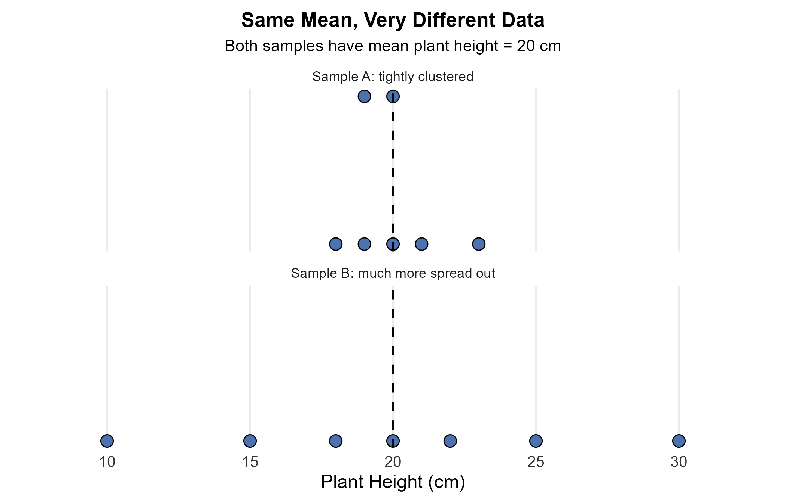

Both samples have an average plant height of **20 cm**. If we reported only the mean, they would appear identical.

The graphs reveal something the average hides:

- **Sample A** is tightly clustered around 20 cm.
- **Sample B** has much more variation, with observations farther from 20 cm.

> **Numerical summaries are useful, but graphs often reveal structure that a single number cannot.**

---

## Individuals, Variables, and the Structure of Data

### Anatomy of a Dataset

Most datasets can be pictured as a table:

- **Rows** represent the individuals or cases being studied.
- **Columns** represent the variables recorded for those individuals.

Consider a simple plant-growth experiment:

| **Plant ID** | **Fertilizer Group** | **Germinated?** | **Number of Leaves** | **Height (cm)** |
|:---|:---|:---:|---:|---:|
| P01 | None | Yes | 5 | 12.4 |
| P02 | None | Yes | 6 | 13.1 |
| P03 | Fertilizer A | Yes | 8 | 16.7 |
| P04 | Fertilizer A | No | 0 | 0.0 |
| P05 | Fertilizer B | Yes | 7 | 15.9 |

In this table:

- the **individuals** are the plants;
- `Fertilizer Group`, `Germinated?`, `Number of Leaves`, and `Height` are variables;
- `Plant ID` is mainly an **identifier** used to keep track of each plant.

> **First question to ask about any dataset:** What does one row represent?

### Two Fundamental Types of Variables

Once we know the individuals, we classify the variables. The most important distinction is between **categorical** and **quantitative** variables.

#### Categorical Variables

A **categorical variable** places an individual into a group or category.

Examples include blood type, fertilizer group, reaction outcome, and university program.

Categorical variables can be:

- **Nominal:** categories have no natural order, such as blood type or treatment group.
- **Ordinal:** categories have a meaningful order, such as low, medium, high.

#### Quantitative Variables

A **quantitative variable** records a numerical amount for which arithmetic is meaningful.

Examples include plant height, reaction time, temperature, mass, concentration, and price.

A useful check is:

> **Would taking an average of these numbers have a meaningful interpretation?**

If yes, the variable is usually quantitative. If the numbers are only labels, the variable is categorical.

### The Coding Trap: Numbers Can Still Be Categories

Suppose a spreadsheet uses `1 = Control`, `2 = Fertilizer A`, and `3 = Fertilizer B`. The variable is still **categorical**. The numbers are only codes.

An average treatment code of 1.8 would not have a useful scientific meaning.

### Quantitative Variables: Discrete vs. Continuous

#### Discrete Quantitative Variables

A **discrete** variable usually comes from **counting**.

Examples:

- number of leaves on a plant;
- number of bacterial colonies on a plate;
- number of customers entering a store;
- number of incorrect answers on a quiz.

There are gaps between possible values. A plant can have 7 or 8 leaves, but not 7.42 leaves.

#### Continuous Quantitative Variables

A **continuous** variable usually comes from **measuring**.

Examples:

- plant height;
- body mass;
- reaction time;
- temperature;
- pH;
- concentration.

A measurement can, in principle, take many values between two recorded values.

### Count, Measure, or Category?

| **Question** | **Usually Produces** | **Example** |
|:---|:---|:---|
| How many? | Discrete quantitative | Number of leaves |
| How much? | Continuous quantitative | Plant mass |
| Which group? | Categorical | Fertilizer type |
| What level or rating? | Ordinal categorical | Low / Medium / High |

---

## Meet the Main Graph Types

Before studying each graph in detail, it helps to see the overall map.

| **Graph** | **Data Situation** | **Main Purpose** |
|:---|:---|:---|
| **Bar graph** | Categorical variable | Compare category sizes |
| **Pie chart** | Categories forming one whole | Emphasize parts of 100% |
| **Histogram** | Quantitative variable | Show the shape of a distribution |
| **Dotplot** | Small or moderate quantitative sample | Show individual observations |
| **Time plot** | Measurements recorded over time | Show change, trends, or cycles |

We will now study each graph using the same sequence:

1. **What does the graph show?**
2. **What are its important parts?**
3. **How should we read it?**
4. **When should we use it?**
5. **How can it go wrong?**

---

## Bar Graphs: Comparing Categories

### What Is a Bar Graph?

A **bar graph** displays a categorical variable using one separate bar for each category. The bar height represents a **count, proportion, or percentage**.

Bar graphs are usually the best starting point when the goal is to compare categories.

### Anatomy of a Bar Graph

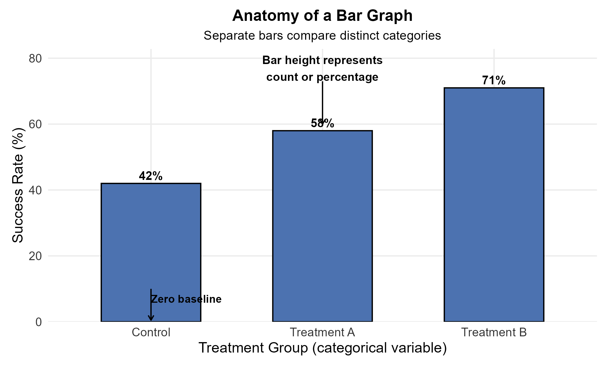

A well-designed bar graph has several important parts:

- **Horizontal axis:** category names.
- **Vertical axis:** counts, proportions, or percentages.
- **Separate bars:** categories are distinct, so bars do not touch.
- **Bar height:** represents the magnitude for each category.
- **Zero baseline:** because bar length represents magnitude, ordinary bar graphs should usually begin at zero.
- **Clear title and units:** tell the reader what is being compared.

### How to Read a Bar Graph

Ask:

1. Which category is largest?
2. Which category is smallest?
3. Which categories are similar?
4. Are the values counts or percentages?
5. What population or sample do the percentages refer to?

### Frequency Tables Before Bar Graphs

For categorical data, we often begin with a frequency table.

Suppose 50 chemistry reaction trials are classified as follows:

| **Reaction Outcome** | **Count** | **Percentage** |
|:---|---:|---:|
| Complete reaction | 28 | 56% |
| Partial reaction | 15 | 30% |
| No visible reaction | 7 | 14% |
| **Total** | **50** | **100%** |

The frequency table gives exact numbers. A bar graph makes the differences visible immediately.

If a category has frequency $f$ in a sample of size $n$, then

$$
\text{Relative Frequency}=\frac{f}{n}
$$

and

$$
\text{Percentage}=\frac{f}{n}\times 100\%.
$$

### When Should You Use a Bar Graph?

Use a bar graph when:

- the variable is categorical;
- you want to compare category sizes;
- you want to compare rates or percentages across groups;
- you want small differences to be easy to see.

For a **nominal** variable, categories can often be rearranged to improve comparison. For an **ordinal** variable, preserve the natural order.

### How Bar Graphs Can Go Wrong: Connecting Categories

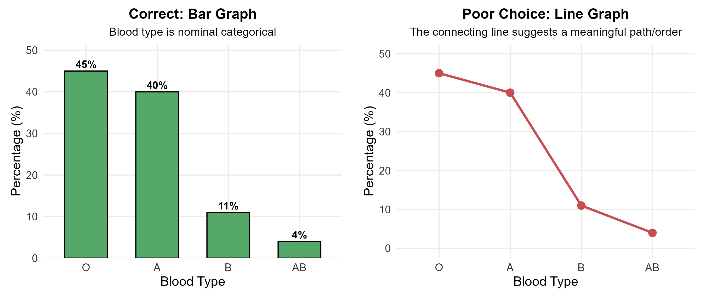

Blood type is nominal categorical. There is no meaningful continuous path from O to A to B to AB.

The line graph suggests a progression between categories that does not exist.

> **Rule:** Do not connect nominal categories with a line simply because software allows it.

### How Bar Graphs Can Go Wrong: Truncated Axes

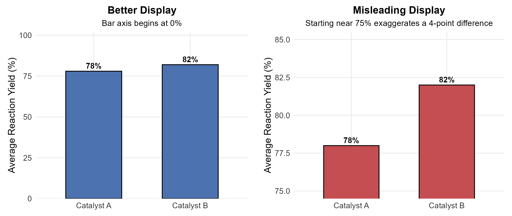

Catalyst A has an average reaction yield of 78%, while Catalyst B has an average yield of 82%. The real difference is **4 percentage points**.

When the bar-chart axis starts near 75%, the difference looks much larger because the visible bar lengths are compared from a false baseline.

> **For ordinary bar graphs, the vertical axis should usually begin at zero.**

---

## Pie Charts: Showing Parts of One Whole

### What Is a Pie Chart?

A **pie chart** divides a single whole into slices. Each slice represents the proportion or percentage belonging to one category.

The entire circle represents **100%**.

### Anatomy of a Pie Chart

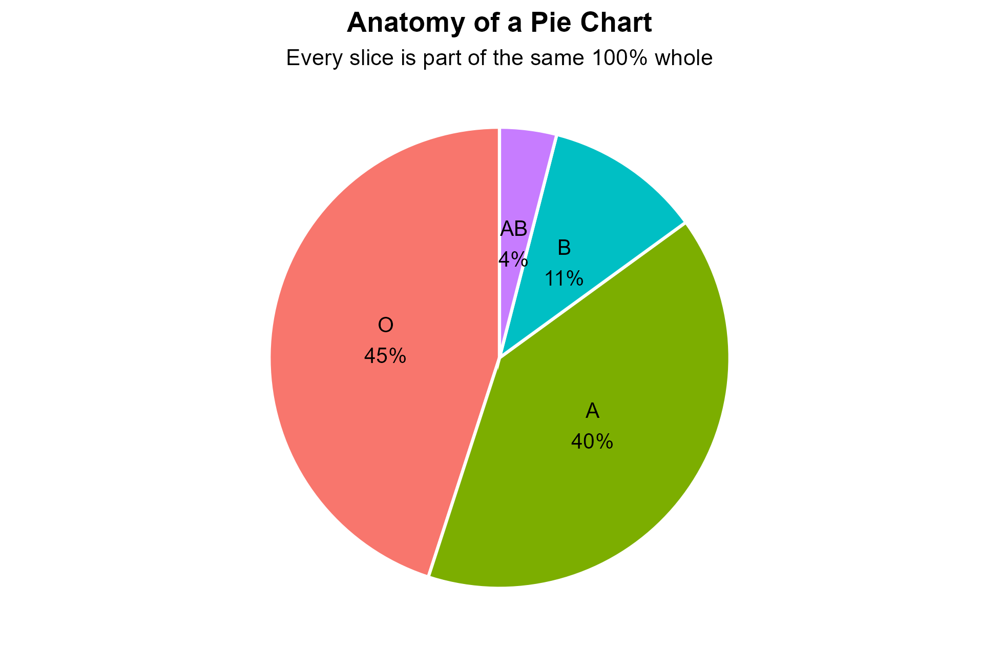

A valid pie chart requires:

- one population or sample forming the whole;
- mutually exclusive categories;
- categories that collectively account for the whole;
- percentages that therefore total approximately 100%.

### When Should You Use a Pie Chart?

A pie chart can be useful when:

- the number of categories is small;
- the categories form one complete whole;
- the main message is about **part-to-whole composition**.

It is usually not the best choice when exact comparisons between categories are important.

### Bar Graph or Pie Chart?

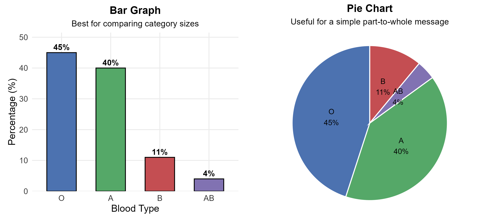

Both graphs show the same blood-type distribution.

- The **pie chart** makes the part-to-whole relationship visually obvious.
- The **bar graph** makes it easier to compare category sizes precisely.

For most scientific displays, a **bar graph is the safer default** because lengths on a common scale are easier to compare than angles or areas.

### How Pie Charts Can Go Wrong: Different Denominators

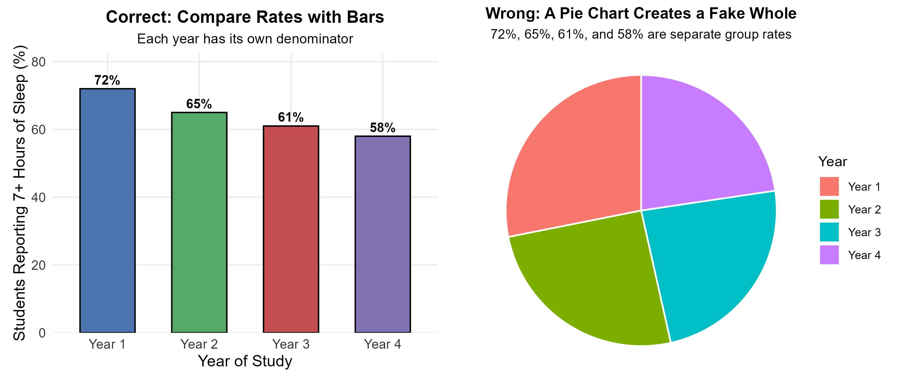

Suppose 72% of first-year students, 65% of second-year students, 61% of third-year students, and 58% of fourth-year students report sleeping at least seven hours per night.

These percentages come from **four different groups**. They are not four pieces of one whole.

A pie chart would create an artificial total with no meaningful interpretation.

> **Before making a pie chart, always ask: “Percent of what?”**

When percentages come from different denominators, compare them using a **bar graph**.

---

## Histograms: Seeing the Shape of Quantitative Data

### What Is a Histogram?

A **histogram** displays the distribution of a quantitative variable by grouping nearby numerical values into intervals called **bins** or **classes**.

It is especially useful when there are too many observations to inspect one at a time.

### Anatomy of a Histogram

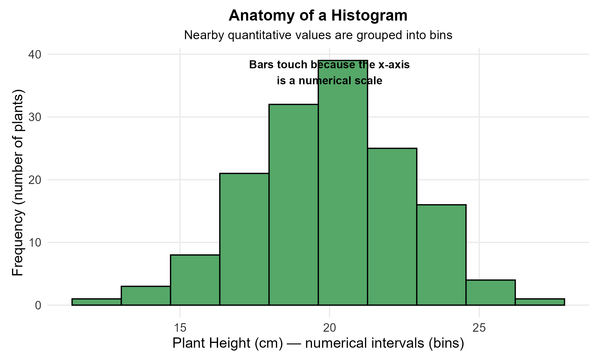

A histogram has several important features:

- **Horizontal axis:** a numerical measurement scale.
- **Bins:** intervals containing nearby values.
- **Vertical axis:** frequency, relative frequency, or percentage.
- **Touching bars:** adjacent bins touch because the horizontal axis is continuous and ordered.
- **Fixed numerical order:** bins cannot be rearranged like nominal categories.

### Bar Graph vs. Histogram

| **Feature** | **Bar Graph** | **Histogram** |
|:---|:---|:---|
| Variable type | Categorical | Quantitative |
| Horizontal axis | Categories | Numerical intervals |
| Bars | Separated | Touching |
| Order | Can sometimes be rearranged | Must remain numerical |
| Main purpose | Compare categories | Show distribution shape |

### How to Read a Histogram

At first, ask simple visual questions:

1. Where are most observations concentrated?
2. Is there one main peak or several?
3. Does one side have a longer tail?
4. Are there gaps?
5. Are there observations far from the rest?
6. How widely spread are the values?

We will formalize these questions shortly using **SOCS**.

### Example: Body Lengths of 44 Great White Sharks

Marine biologists measured the body lengths of 44 great white sharks, in feet.

A possible frequency table using 2-foot classes is:

| **Length Class (feet)** | **Count** | **Approx. Percentage** |
|:---|---:|---:|
| 9.1 to 11.0 | 1 | 2% |
| 11.1 to 13.0 | 5 | 11% |
| 13.1 to 15.0 | 12 | 27% |
| 15.1 to 17.0 | 15 | 34% |
| 17.1 to 19.0 | 8 | 18% |
| 19.1 to 21.0 | 2 | 5% |
| 21.1 to 23.0 | 1 | 2% |
| **Total** | **44** | **99%*** |

*The percentages total 99% because of rounding.*

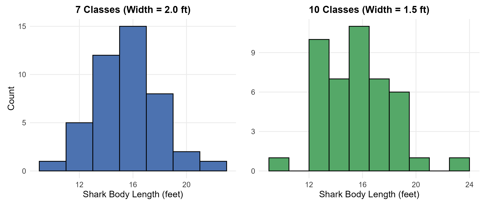

Both histograms contain the same 44 observations. Their overall message is similar, but the amount of detail changes with the bins.

### How Histograms Can Go Wrong: Poor Bin Width

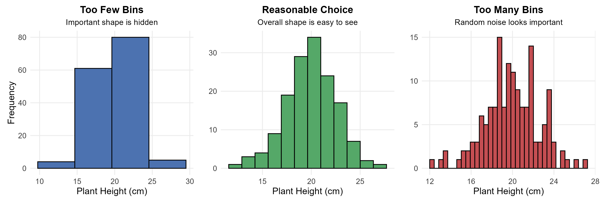

- **Too few bins:** important structure can be smoothed away.
- **Too many bins:** random sampling noise can look important.
- **Reasonable bin width:** shows the overall structure without hiding or exaggerating detail.

There is no single perfect number of bins for every dataset. Inspect more than one reasonable choice.

> **A histogram should help reveal the data—not manufacture a story.**

---

## Dotplots: Showing Every Observation

### What Is a Dotplot?

A **dotplot** displays individual quantitative observations directly above a numerical scale.

Dotplots are especially useful when the sample is small enough that individual values remain readable.

### Anatomy of a Dotplot

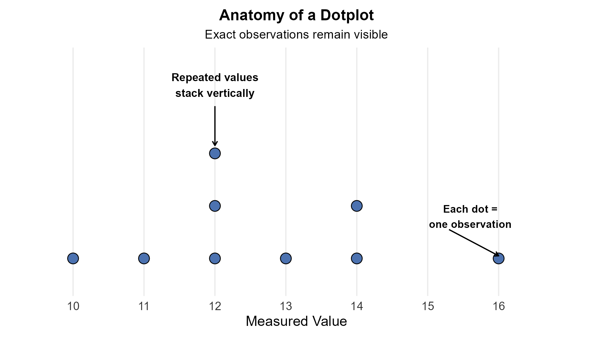

Important parts include:

- **Horizontal axis:** the numerical variable.
- **One dot per observation:** individual values remain visible.
- **Vertical stacking:** repeated values are stacked so they do not hide each other.
- **No meaningful vertical measurement:** the vertical position usually exists only to separate repeated observations.

### How to Read a Dotplot

Look for the same distribution features as in a histogram:

- clusters;
- gaps;
- center;
- spread;
- unusual observations.

Because the raw values are visible, you can often count the sample size directly.

### When Should You Use a Dotplot?

Use a dotplot when:

- the sample is small or moderate;
- individual observations matter;
- repeated values are useful to see;
- you want a simple side-by-side comparison of small groups.

### Example: Plant Height With and Without Fertilizer

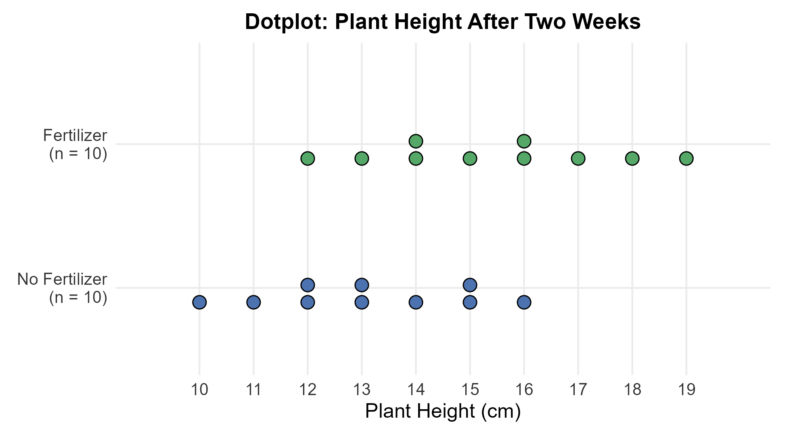

Each dot represents one plant.

From the graph:

- the fertilizer group tends to have larger observed heights;
- the groups still overlap;
- the fertilizer group appears shifted to the right;
- no observation is extremely separated from the rest.

### Dotplot vs. Histogram

| **Dotplot** | **Histogram** |
|:---|:---|
| Shows individual observations | Groups observations into bins |
| Excellent for small samples | Excellent when data are dense |
| Repeated values are visible | Overall shape is compact |
| Exact values can be read | Exact values are hidden |

### How Dotplots Can Go Wrong

Dotplots become difficult to read when there are hundreds or thousands of observations. Points can overlap and produce a dense wall of ink.

In that situation, a histogram is usually more useful because the goal has changed from seeing **every observation** to seeing the **overall distribution**.

> The graph choice depends not only on variable type, but also on how much detail the reader needs to see.

---


## Describing Quantitative Distributions: SOCS

Once we have a quantitative graph such as a histogram or dotplot, we need a consistent language for describing it.

Use **SOCS**:

- **S — Shape**
- **O — Outliers**
- **C — Center**
- **S — Spread**

### Shape

Common shapes include:

- **symmetric:** both sides are roughly mirror images;
- **skewed right:** the longer tail extends toward larger values;
- **skewed left:** the longer tail extends toward smaller values;
- **unimodal:** one main peak;
- **bimodal:** two main peaks.

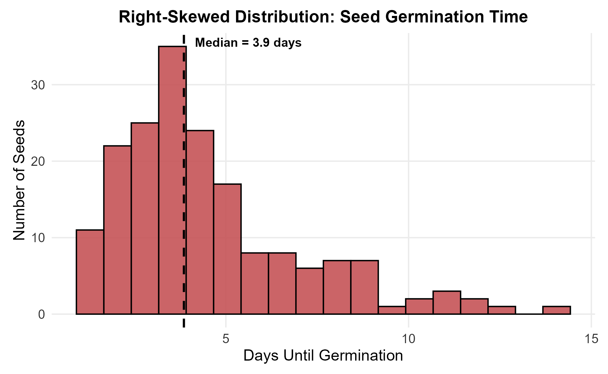

The seed-germination distribution is **right-skewed**: many seeds germinate relatively early, while a smaller number take much longer.

> **Skewness is named for the direction of the long tail, not the location of the tallest bar.**

### Outliers

An **outlier** is an observation that falls far from the overall pattern.

An unusual value could be:

- a genuine extreme observation;
- a data-entry mistake;
- a measurement problem;
- an observation from a different population.

Do not remove an observation simply because it looks unusual. Investigate it first.

### Center

The **center** describes a typical or middle value in the distribution.

In this chapter, estimate the center visually. In Chapter 2, we will calculate measures such as the **mean** and **median**.

### Spread

The **spread** describes how variable the data are.

A tightly packed distribution has small spread. A distribution extending over a wider range has larger spread.

### Writing a Good SOCS Description

A strong description uses the variable and units.

Instead of:

> Right-skewed with one outlier.

write:

> The distribution of seed germination times is unimodal and right-skewed. Most seeds germinated within the first several days, while a smaller number took much longer. The distribution is centered around a few days and has a long right tail.

### Example: SOCS for Shark Lengths

Using the shark histogram:

- **Shape:** roughly unimodal and fairly symmetric through the center;
- **Outliers:** the smallest shark at 9.4 ft and largest at 22.8 ft appear separated from much of the data;
- **Center:** approximately 15–16 ft;
- **Spread:** from 9.4 ft to 22.8 ft.

---


## Time Plots: Showing Change in Order

### What Is a Time Plot?

A **time plot** displays a quantitative variable in chronological order.

Time appears on the horizontal axis, and the measured variable appears on the vertical axis.

### Anatomy of a Time Plot

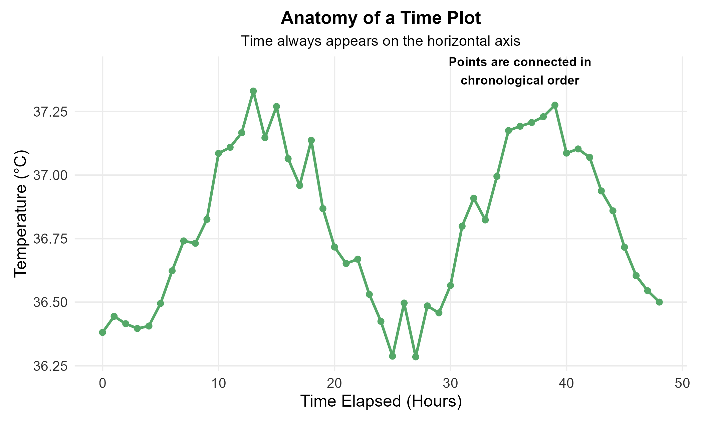

Important parts include:

- **Horizontal axis:** time.
- **Vertical axis:** the variable being measured.
- **Points:** observations taken at particular times.
- **Connecting lines:** emphasize chronological order and change between neighboring observations.

### What to Look for in a Time Plot

Look for:

- **trend:** long-term upward or downward movement;
- **cycle:** a repeating pattern;
- **sudden change:** abrupt jump or drop;
- **unusual observation:** a point that does not fit nearby values.

### When Should You Use a Time Plot?

Use a time plot whenever **when the observation occurred is important to the question**.

Examples include:

- temperature measured every hour;
- bacterial growth recorded every 30 minutes;
- monthly unemployment rates;
- daily chemical calibration measurements;
- annual rainfall.

### Example: A Repeating Daily Pattern

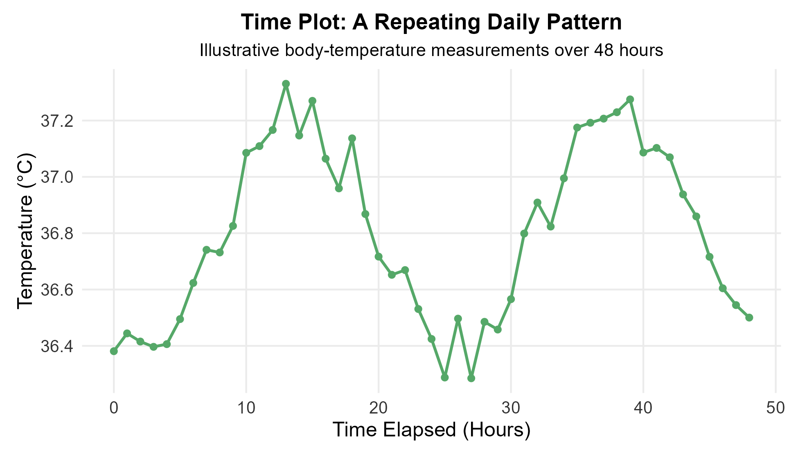

The measurements rise and fall in a repeating pattern over approximately 24 hours.

A histogram could show the range and distribution of temperatures, but it would hide the repeating order.

### How Time Plots Can Go Wrong: Ignoring Time Order

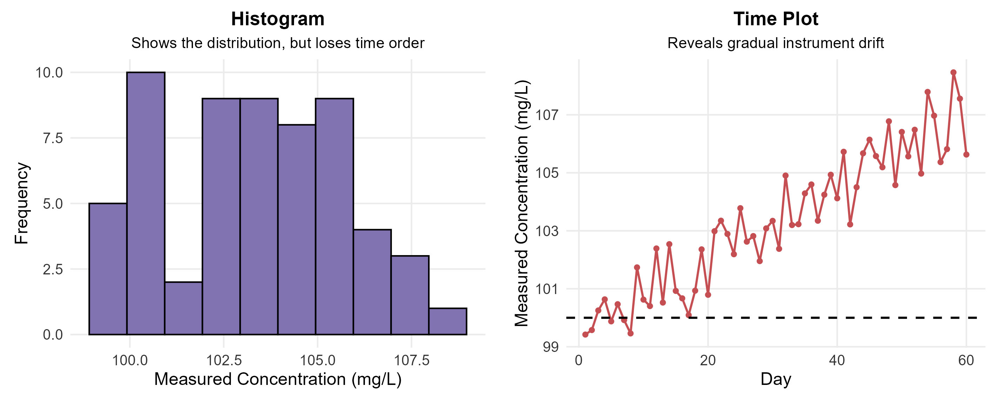

The two panels contain the **same measurements**.

- The histogram answers: **What values occurred most often?**
- The time plot answers: **How did the measurement change over the 60 days?**

If a 100 mg/L calibration standard is supposed to remain constant, the time plot reveals gradual drift that the histogram hides.

> **When time order is meaningful, plot against time before ignoring the order.**

---

## Data Quality and Outliers

Graphs are not only presentation tools. They are also tools for checking whether the data make sense.

### Always Investigate Unusual Values

When you see an outlier or sudden spike, ask:

1. Was the value entered correctly?
2. Are the units correct?
3. Was the instrument working correctly?
4. Is the value scientifically plausible?
5. Could it be a genuine but unusual observation?

### Example: A Data-Entry Error

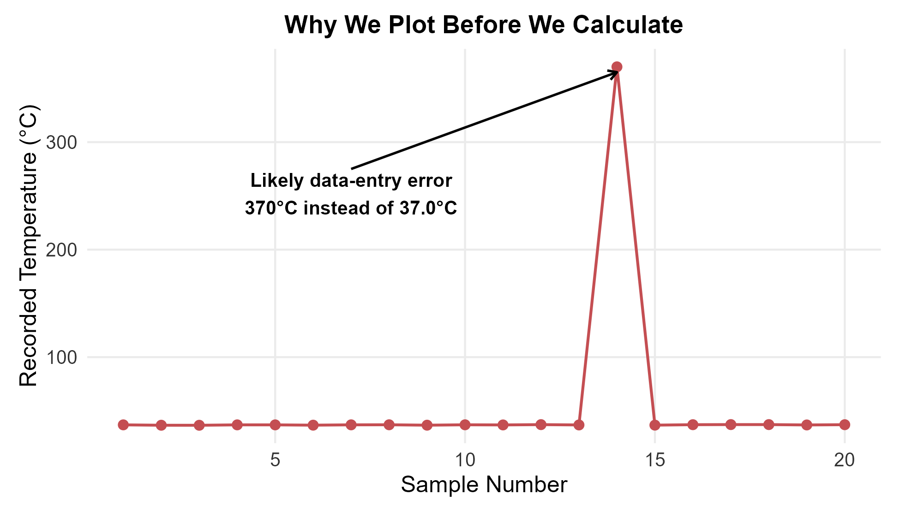

Most recorded temperatures are near 37°C, but one value is 370°C. The graph makes the problem obvious immediately.

Without plotting first, that value could strongly distort later numerical summaries.

### Common Data Problems That Graphs Can Reveal

| **Problem** | **Example** | **What You Might See** |
|:---|:---|:---|
| Typing error | 19.4 entered as 194 | One extreme observation |
| Wrong unit | Some masses entered in mg instead of g | Two separated groups or an extreme gap |
| Missing-value code | Missing recorded as -99 | A strange stack at -99 |
| Instrument drift | Calibration slowly changes | Gradual trend in a time plot |
| Duplicated record | Same row copied twice | Repeated or unusually stacked points |

> **Do not automatically delete unusual observations. First determine why they are unusual.**

---

## Practice: Matching Questions to Graphs

### Apply Your Knowledge 1.1: Breakfast Cereals

Consider a dataset describing 77 breakfast cereals:

| **Brand** | **Manufacturer** | **Type** | **Calories** | **Sugar (g)** |
|:---|:---|:---:|---:|---:|
| All Bran | K | C | 70 | 5 |
| All Bran Fiber | K | C | 50 | 0 |
| Almond Delight | R | C | 110 | 8 |
| Apple Cheerios | G | C | 110 | 10 |
| Apple Jacks | K | C | 110 | 14 |

**Questions**

1. What are the individuals?
2. Which variables are categorical?
3. Which variables are quantitative?
4. Which graph would you use for `Manufacturer`?
5. Which graph would you use for `Sugar` across all 77 cereals?

**Answers**

1. The individuals are the 77 cereal brands.
2. `Manufacturer` and `Type` are categorical.
3. `Calories` and `Sugar` are quantitative.
4. Use a bar graph for `Manufacturer`.
5. A histogram is a good starting graph for `Sugar`.

### Apply Your Knowledge 1.2: Choosing the Graph

| **Question** | **Structure** | **Best Starting Graph** |
|:---|:---|:---|
| Which blood type is most common? | Categorical | Bar graph |
| How is one group divided into four categories? | Part-to-whole | Pie chart or bar graph |
| What is the distribution of 150 plant heights? | Quantitative | Histogram |
| What are the exact reaction times of 12 participants? | Small quantitative sample | Dotplot |
| Is river temperature changing throughout the day? | Quantitative over time | Time plot |

### Find the Problem: Easy

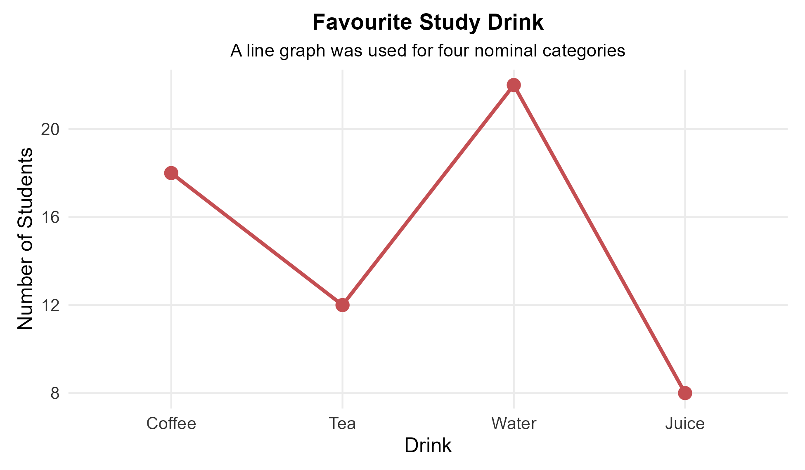

**Question:** What is wrong with this display, and what graph should replace it?

**Answer:** Favourite drink is a nominal categorical variable. Connecting the categories with a line suggests an order or continuous progression. A **bar graph** is more appropriate.

### Find the Problem: Medium

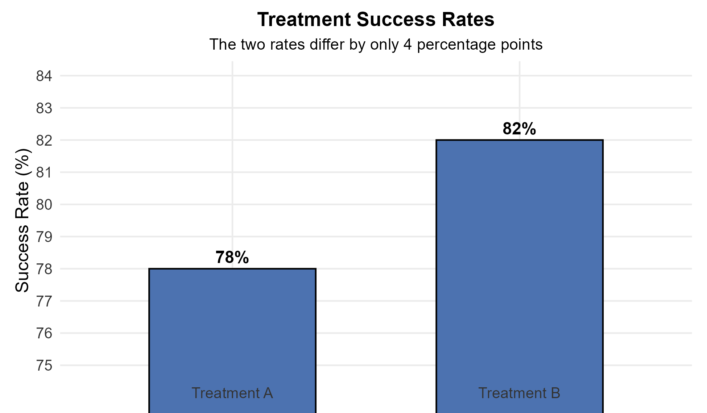

**Question:** Why does the difference between the treatments look much larger than it really is?

**Answer:** The bar-chart axis begins at 75% rather than zero. Because bar length represents magnitude, the truncated baseline exaggerates the 4-percentage-point difference.

### Find the Problem: Hard

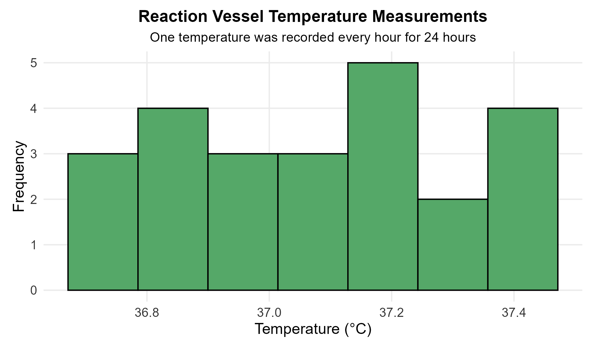

**Question:** The histogram itself is not mathematically incorrect. Why might it still be the wrong first graph?

**Answer:** The measurements were collected every hour. The histogram removes chronological order, so it cannot reveal whether temperature increased, decreased, cycled, or suddenly changed. A **time plot** should be examined first.

---

## Master Guide: Which Graph Should You Use?

| **Data Situation** | **Recommended Graph** | **What to Describe** | **Common Mistake** |
|:---|:---|:---|:---|
| Categorical counts or percentages | Bar graph | Largest/smallest categories, comparisons | Connecting categories with a line; truncated baseline |
| Parts of one whole | Pie chart | Dominant slices, part-to-whole structure | Using percentages with different denominators |
| Small quantitative sample | Dotplot | Individual values, clusters, gaps, SOCS | Using so many points that the graph becomes unreadable |
| Larger quantitative sample | Histogram | SOCS and overall shape | Choosing bins that hide or exaggerate patterns |
| Data recorded over time | Time plot | Trend, cycles, sudden changes | Ignoring chronological order |

### A Five-Step Approach for Exam Questions

1. **Identify the individual:** What does one row represent?
2. **Identify the variable:** What characteristic was recorded?
3. **Classify the variable:** Categorical or quantitative? If quantitative, discrete or continuous?
4. **Ask whether time order matters.**
5. **Choose the graph that answers the question most clearly.**

### A Fair-Graph Checklist

Before trusting a graph, ask:

- Does the graph type match the variable type?
- Are the axes clearly labeled?
- Are units shown?
- Does a bar graph use a sensible zero baseline?
- If it is a pie chart, do all slices come from the same whole?
- Could bin width hide or exaggerate a pattern?
- If time matters, has chronological order been preserved?
- Does the title describe the data without exaggerating the conclusion?

---

## Key Terminology Review

- **Statistics:** The science of learning from data.
- **Individual (Case):** The object or person represented by one observational unit.
- **Variable:** A characteristic recorded for an individual.
- **Categorical Variable:** Places observations into groups or categories.
- **Quantitative Variable:** Records a numerical amount.
- **Discrete Variable:** A quantitative variable that usually results from counting.
- **Continuous Variable:** A quantitative variable that usually results from measuring.
- **Distribution:** The values a variable takes and how often they occur.
- **Bar Graph:** A graph for categorical data with separated bars.
- **Pie Chart:** A part-to-whole display for one categorical variable.
- **Histogram:** A graph for quantitative data using touching bins.
- **Dotplot:** A graph showing individual quantitative observations as dots.
- **Time Plot:** A graph of a variable against chronological time.
- **SOCS:** Shape, Outliers, Center, Spread.
- **Outlier:** An observation that lies far from the overall pattern.
- **Trend:** Long-term upward or downward movement over time.
- **Cycle:** A pattern that repeats over time.

---

## Chapter 1 Summary

The main goal of this chapter is not to memorize graph names. It is to learn to **match the graph to the data and the question, understand how the graph works, and recognize when a display can mislead you.**

### The Core Rules

1. **Know what one row represents.** Identify individuals before analyzing variables.
2. **Classify the variable.** Categorical and quantitative variables require different displays.
3. **Understand the anatomy of the graph before interpreting it.** Know what each axis, bar, bin, slice, dot, or line represents.
4. **Use bar graphs for categorical comparisons.** Use pie charts only for simple parts of one whole.
5. **Use histograms to see the shape of quantitative distributions.** Check whether bin width changes the story.
6. **Use dotplots when individual values remain readable.**
7. **Use time plots when order matters.** A histogram can hide a trend or cycle.
8. **Describe quantitative distributions using SOCS.**
9. **Do not trust a graph automatically.** Check axes, scales, denominators, labels, ordering, and design choices.
10. **Plot before calculating.** Graphs can reveal errors and unusual observations immediately.

### Final Graph Checklist

Before interpreting or presenting a graph, ask:

- What are the individuals?
- What variable is being displayed?
- Is the variable categorical or quantitative?
- Does time order matter?
- Is this the right graph for the question?
- What does each visual element represent?
- Are the title, axes, units, and denominator clear?
- Could the scale, binning, or ordering exaggerate or hide a pattern?
- What is the main pattern visible in the data?

### What’s Next? Chapter 2 — Describing Distributions with Numbers

In Chapter 1, we learned to **see** center and spread. In Chapter 2, we will learn to calculate them.

We will introduce numerical summaries such as

$$
\text{Mean} \qquad \text{Median}
$$

and measures of variability such as

$$
\text{Range} \qquad \text{Interquartile Range} \qquad \text{Standard Deviation}.
$$

The key idea will remain the same: **numbers and graphs should support each other.**
