<style>
/* ============================================================
   CHAPTER 9 — PAGE + COLLAPSIBLE TABLE OF CONTENTS
   ============================================================ */

:root {
  --toc-width: 300px;
  --toc-collapsed-gutter: 72px;
  --chapter-width: 1100px;

  --ink: #23364a;
  --accent: #2c3e50;
  --line: #d8dee4;
  --soft: #f6f8fa;
  --toc-background: #f7f9fb;
}


/* ============================================================
   GENERAL PAGE
   ============================================================ */

html {
  scroll-behavior: smooth;
}

body {
  font-size: 17px;
  line-height: 1.65;
  color: var(--ink);
}

.main-container {
  max-width: var(--chapter-width) !important;
}


/* ============================================================
   CHAPTER 1 ROOT HEADING
   ============================================================ */

/*
   The document title already identifies Chapter 1. Keep the H1
   as the numbering root for section numbers, but hide the repeated
   visible chapter heading. The {.unlisted} class keeps the chapter
   root itself out of the table of contents while leaving H2
   subsections available in the TOC.
*/
.section.chapter-root > h1 {
  display: none !important;
}


/* ============================================================
   ACCESSIBILITY
   ============================================================ */

.sr-only {
  position: absolute;
  width: 1px;
  height: 1px;
  padding: 0;
  margin: -1px;
  overflow: hidden;
  clip: rect(0, 0, 0, 0);
  white-space: nowrap;
  border: 0;
}


/* ============================================================
   SIDEBAR TOGGLE BUTTON
   ============================================================ */

#toc-toggle {
  position: fixed;

  top: 16px;
  left: calc(var(--toc-width) + 14px);

  width: 42px;
  height: 42px;

  display: flex;
  align-items: center;
  justify-content: center;

  padding: 0;

  border: 1px solid #c7d0d9;
  border-radius: 8px;

  background: #ffffff;
  color: var(--ink);

  box-shadow: 0 2px 8px rgba(24, 39, 55, 0.13);

  cursor: pointer;

  font-size: 24px;
  line-height: 1;

  z-index: 1200;

  transition:
    left 0.25s ease,
    background-color 0.2s ease,
    box-shadow 0.2s ease,
    transform 0.2s ease;
}

#toc-toggle:hover {
  background: #eef3f7;
  box-shadow: 0 3px 10px rgba(24, 39, 55, 0.18);
}

#toc-toggle:focus-visible {
  outline: 3px solid rgba(44, 62, 80, 0.28);
  outline-offset: 2px;
}


/* Open/close icons */

#toc-toggle .menu-icon {
  display: none;
}

#toc-toggle .close-icon {
  display: inline;
}


/* Button position when sidebar is collapsed */

body.toc-collapsed #toc-toggle {
  left: 14px;
}

body.toc-collapsed #toc-toggle .menu-icon {
  display: inline;
}

body.toc-collapsed #toc-toggle .close-icon {
  display: none;
}


/* ============================================================
   DESKTOP LAYOUT
   ============================================================ */

@media screen and (min-width: 992px) {

  /*
     Make room for fixed sidebar.
  */
  .main-container {
    width: 100% !important;
    max-width: none !important;

    padding-left: calc(var(--toc-width) + 30px) !important;
    padding-right: 35px !important;

    box-sizing: border-box !important;

    transition: padding-left 0.25s ease;
  }


  /*
     When sidebar is collapsed, reclaim almost all of the space.
  */
  body.toc-collapsed .main-container {
    padding-left: var(--toc-collapsed-gutter) !important;
  }


  /*
     Bootstrap normally reserves a column for the TOC.
     The TOC is fixed now, so remove that reserved column.
  */
  .main-container > .row-fluid > .col-xs-12.col-sm-4.col-md-3,
  .main-container > .row > .col-xs-12.col-sm-4.col-md-3 {
    width: 0 !important;
    min-height: 0 !important;
    padding: 0 !important;
    margin: 0 !important;
  }


  /* ----------------------------------------------------------
     FLOATING TOC
     ---------------------------------------------------------- */

  #TOC,
  #TOC.tocify {
    position: fixed !important;

    top: 0 !important;
    bottom: 0 !important;
    left: 0 !important;

    width: var(--toc-width) !important;
    max-height: 100vh !important;

    box-sizing: border-box !important;

    overflow-y: auto !important;
    overflow-x: hidden !important;

    margin: 0 !important;
    padding: 72px 16px 28px 18px !important;

    background: var(--toc-background) !important;

    border: 0 !important;
    border-right: 1px solid var(--line) !important;
    border-radius: 0 !important;

    box-shadow: none !important;

    z-index: 1100 !important;

    transform: translateX(0);

    transition: transform 0.25s ease;
  }


  /*
     Completely slide sidebar off screen when collapsed.
  */
  body.toc-collapsed #TOC,
  body.toc-collapsed #TOC.tocify {
    transform: translateX(calc(-1 * var(--toc-width)));
  }


  /*
     Allow long section headings to wrap rather than getting
     clipped.
  */
  #TOC a {
    white-space: normal !important;
    overflow-wrap: break-word !important;
    word-break: normal !important;
  }


  /* ----------------------------------------------------------
     TOC TYPOGRAPHY
     ---------------------------------------------------------- */

  #TOC .tocify-item {
    border-radius: 4px;
  }

  #TOC .tocify-item a {
    color: var(--ink);
    text-decoration: none;
  }

  #TOC .tocify-item:hover {
    background: #e9eef3;
  }

  #TOC .tocify-item.active {
    background: var(--accent) !important;
  }

  #TOC .tocify-item.active a {
    color: #ffffff !important;
  }


  /* ----------------------------------------------------------
     MAIN CHAPTER CONTENT
     ---------------------------------------------------------- */

  .toc-content,
  .toc-content.col-xs-12.col-sm-8.col-md-9 {
    width: 100% !important;
    max-width: var(--chapter-width) !important;

    float: none !important;

    margin-left: auto !important;
    margin-right: auto !important;

    padding-left: 15px !important;
    padding-right: 15px !important;

    box-sizing: border-box !important;
  }


  /*
     Fallback for Pandoc output that does not use Bootstrap's
     normal R Markdown container structure.
  */
  body.standalone-pandoc {
    width: calc(100% - var(--toc-width)) !important;
    max-width: none !important;

    box-sizing: border-box !important;

    margin: 0 0 0 var(--toc-width) !important;
    padding: 50px 45px !important;

    transition:
      width 0.25s ease,
      margin-left 0.25s ease,
      padding-left 0.25s ease;
  }

  body.standalone-pandoc.toc-collapsed {
    width: 100% !important;

    margin-left: 0 !important;
    padding-left: var(--toc-collapsed-gutter) !important;
  }

  body.standalone-pandoc > header,
  body.standalone-pandoc > section {
    max-width: var(--chapter-width);

    margin-left: auto;
    margin-right: auto;
  }
}


/* ============================================================
   MOBILE / TABLET
   ============================================================ */

@media screen and (max-width: 991px) {

  .main-container {
    width: auto !important;
    max-width: var(--chapter-width) !important;

    margin-left: auto !important;
    margin-right: auto !important;

    padding: 70px 18px 24px !important;

    box-sizing: border-box !important;
  }


  /*
     Toggle remains at upper-left on mobile.
  */
  #toc-toggle,
  body.toc-collapsed #toc-toggle {
    left: 12px;
  }


  /*
     Mobile starts with menu icon.
  */
  #toc-toggle .menu-icon,
  body.toc-collapsed #toc-toggle .menu-icon {
    display: inline;
  }

  #toc-toggle .close-icon,
  body.toc-collapsed #toc-toggle .close-icon {
    display: none;
  }


  /*
     Show X while the mobile TOC is open.
  */
  body.toc-mobile-open #toc-toggle .menu-icon {
    display: none;
  }

  body.toc-mobile-open #toc-toggle .close-icon {
    display: inline;
  }


  /* ----------------------------------------------------------
     MOBILE TOC DRAWER
     ---------------------------------------------------------- */

  #TOC,
  #TOC.tocify {
    position: fixed !important;

    top: 0 !important;
    bottom: 0 !important;
    left: 0 !important;

    width: min(84vw, 320px) !important;
    max-height: 100vh !important;

    box-sizing: border-box !important;

    overflow-y: auto !important;
    overflow-x: hidden !important;

    margin: 0 !important;
    padding: 72px 18px 28px !important;

    background: var(--toc-background) !important;

    border: 0 !important;
    border-right: 1px solid var(--line) !important;
    border-radius: 0 !important;

    z-index: 1100 !important;

    transform: translateX(-105%);

    transition: transform 0.25s ease;
  }

  body.toc-mobile-open #TOC,
  body.toc-mobile-open #TOC.tocify {
    transform: translateX(0);

    box-shadow: 6px 0 18px rgba(24, 39, 55, 0.16);
  }


  /*
     Prevent long headings from being clipped.
  */
  #TOC a {
    white-space: normal !important;
    overflow-wrap: break-word !important;
    word-break: normal !important;
  }


  body.standalone-pandoc {
    width: auto !important;
    max-width: var(--chapter-width) !important;

    margin: 0 auto !important;
    padding: 70px 18px 24px !important;

    box-sizing: border-box !important;
  }
}


/* ============================================================
   SECTION HEADINGS
   ============================================================ */

h1,
h2,
h3,
h4,
h5 {
  margin-top: 1.6em;
}

h2 {
  border-bottom: 3px solid var(--accent);
  padding-bottom: 0.25em;
}

h3 {
  border-bottom: 1px solid var(--line);
  padding-bottom: 0.2em;
}


/* ============================================================
   BLOCKQUOTES / DEFINITION BOXES
   ============================================================ */

blockquote {
  border-left: 4px solid var(--accent);

  background: #f7f9fa;

  padding: 0.7em 1em;
  margin-top: 1.2em;
  margin-bottom: 1.2em;
}


/* ============================================================
   TABLES
   ============================================================ */

table {
  width: 100%;

  margin: 1.35em auto;

  border-collapse: separate !important;
  border-spacing: 0;

  background: #ffffff;

  border: 1px solid #d6dde5;
  border-radius: 8px;

  overflow: hidden;

  box-shadow: 0 2px 8px rgba(24, 39, 55, 0.06);
}

table thead th {
  padding: 0.72em 0.9em !important;

  background: var(--accent);
  color: #ffffff;

  border: 0 !important;
  border-bottom: 1px solid #1e2d3b !important;

  font-weight: 700;

  vertical-align: middle !important;
}

table tbody td {
  padding: 0.65em 0.9em !important;

  border: 0 !important;
  border-bottom: 1px solid #e5e9ee !important;

  vertical-align: middle !important;
}

table tbody tr:nth-child(even) td {
  background: #f7f9fb;
}

table tbody tr:hover td {
  background: #eef4f8;
}

table tbody tr:last-child td {
  border-bottom: 0 !important;
}


/* ============================================================
   IMAGES
   ============================================================ */

img {
  display: block;

  max-width: 100%;
  height: auto;

  margin: 1.4em auto;

  border: 1px solid #e1e4e8;
  border-radius: 7px;
}


/* ============================================================
   MATHEMATICS
   ============================================================ */

.math.display {
  overflow-x: auto;
}


/* ============================================================
   HIDE R MARKDOWN CODE-FOLDING UI
   ============================================================ */

.btn-code,
.code-folding-btn,
div.btn-group.pull-right {
  display: none !important;
}
</style>

<button id="toc-toggle"
        type="button"
        aria-label="Toggle table of contents"
        aria-expanded="true">
  <span class="menu-icon" aria-hidden="true">&#9776;</span>
  <span class="close-icon" aria-hidden="true">&times;</span>
  <span class="sr-only">Toggle table of contents</span>
</button>

<script>
document.addEventListener("DOMContentLoaded", function () {
  const button = document.getElementById("toc-toggle");

  if (!button) return;

  button.addEventListener("click", function () {
    if (window.innerWidth <= 991) {
      document.body.classList.toggle("toc-mobile-open");

      const isOpen =
        document.body.classList.contains("toc-mobile-open");

      button.setAttribute("aria-expanded", isOpen);
    } else {
      document.body.classList.toggle("toc-collapsed");

      const isOpen =
        !document.body.classList.contains("toc-collapsed");

      button.setAttribute("aria-expanded", isOpen);
    }
  });
});
</script>


```{r setup, include=FALSE}
knitr::opts_chunk$set(
  echo = FALSE,
  warning = FALSE,
  message = FALSE,
  error = FALSE
)

required_packages <- c("ggplot2", "gridExtra")
missing_packages <- required_packages[
  !vapply(required_packages, requireNamespace, logical(1), quietly = TRUE)
]

if (length(missing_packages) > 0) {
  stop(
    "Install the following R packages before knitting: ",
    paste(missing_packages, collapse = ", ")
  )
}

suppressPackageStartupMessages({
  library(ggplot2)
  library(gridExtra)
})
```


```{r generate_all_lecture_figures, include=FALSE, echo=FALSE, warning=FALSE, message=FALSE}
set.seed(42)

# Shared lecture theme and colour palette.
lecture_theme <- theme_minimal(base_size = 11) +
  theme(
    plot.title = element_text(size = 13, face = "bold", hjust = 0.5),
    plot.subtitle = element_text(size = 10.5, hjust = 0.5),
    axis.title = element_text(size = 12),
    axis.text = element_text(size = 10, colour = "#333333"),
    panel.grid.minor = element_blank(),
    plot.background = element_rect(fill = "white", colour = NA),
    panel.background = element_rect(fill = "white", colour = NA),
    plot.margin = margin(8, 10, 8, 10)
  )

palette_main <- c("#4C72B0", "#55A868", "#C44E52", "#8172B2")

save_plot <- function(filename, plot, width, height) {
  ggsave(
    filename = filename,
    plot = plot,
    width = width,
    height = height,
    units = "in",
    dpi = 300,
    bg = "white"
  )
}

# =============================================================
# 1. Same mean, different distributions
# =============================================================
plant_a <- c(18, 19, 19, 20, 20, 21, 23)
plant_b <- c(10, 15, 18, 20, 22, 25, 30)

same_mean_df <- rbind(
  data.frame(group = "Sample A: tightly clustered", value = plant_a),
  data.frame(group = "Sample B: much more spread out", value = plant_b)
)
same_mean_df$stack <- ave(
  same_mean_df$value,
  same_mean_df$group,
  same_mean_df$value,
  FUN = seq_along
)

p_same_mean <- ggplot(same_mean_df, aes(x = value, y = stack)) +
  geom_point(size = 3.4, shape = 21, fill = palette_main[1], colour = "black") +
  geom_vline(xintercept = 20, linetype = "dashed", linewidth = 0.7) +
  facet_wrap(~group, ncol = 1) +
  scale_y_continuous(breaks = NULL) +
  scale_x_continuous(limits = c(8, 32), breaks = seq(10, 30, 5)) +
  labs(
    title = "Same Mean, Very Different Data",
    subtitle = "Both samples have mean plant height = 20 cm",
    x = "Plant Height (cm)",
    y = NULL
  ) +
  lecture_theme +
  theme(panel.grid.horizontal = element_blank())

save_plot("fig_same_mean_different_data.png", p_same_mean, width = 7, height = 4.5)

# =============================================================
# 2. Bar graph vs. pie chart (blood types)
# =============================================================
blood_df <- data.frame(
  blood_type = factor(c("O", "A", "B", "AB"), levels = c("O", "A", "B", "AB")),
  percentage = c(45, 40, 11, 4),
  colour = palette_main
)

p_bar_blood <- ggplot(blood_df, aes(x = blood_type, y = percentage, fill = colour)) +
  geom_col(width = 0.6, colour = "black") +
  geom_text(aes(label = paste0(percentage, "%")), vjust = -0.45, fontface = "bold", size = 3.6) +
  scale_fill_identity() +
  scale_y_continuous(limits = c(0, 50), expand = expansion(mult = c(0, 0.03))) +
  labs(
    title = "Bar Graph",
    subtitle = "Best for comparing category sizes",
    x = "Blood Type",
    y = "Percentage (%)"
  ) +
  lecture_theme

blood_pie_df <- transform(
  blood_df,
  label = paste0(blood_type, "\n", percentage, "%")
)

p_pie_blood <- ggplot(blood_pie_df, aes(x = "", y = percentage, fill = colour)) +
  geom_col(width = 1, colour = "white", linewidth = 0.6) +
  coord_polar(theta = "y") +
  geom_text(
    aes(label = label),
    position = position_stack(vjust = 0.5),
    size = 3.3
  ) +
  scale_fill_identity() +
  labs(
    title = "Pie Chart",
    subtitle = "Useful for a simple part-to-whole message"
  ) +
  theme_void(base_size = 11) +
  theme(
    plot.title = element_text(size = 13, face = "bold", hjust = 0.5),
    plot.subtitle = element_text(size = 10.5, hjust = 0.5)
  )

save_plot(
  "fig_bar_vs_pie.png",
  arrangeGrob(p_bar_blood, p_pie_blood, ncol = 2),
  width = 8.5,
  height = 3.8
)

# =============================================================
# 3. Misleading truncated bar-chart axis
# =============================================================
yield_df <- data.frame(
  catalyst = factor(c("Catalyst A", "Catalyst B"), levels = c("Catalyst A", "Catalyst B")),
  yield = c(78, 82)
)

p_axis_good <- ggplot(yield_df, aes(x = catalyst, y = yield)) +
  geom_col(width = 0.58, fill = palette_main[1], colour = "black") +
  geom_text(aes(label = paste0(yield, "%")), vjust = -0.45, fontface = "bold", size = 3.5) +
  scale_y_continuous(limits = c(0, 100), expand = expansion(mult = c(0, 0.02))) +
  labs(
    title = "Better Display",
    subtitle = "Bar axis begins at 0%",
    x = NULL,
    y = "Average Reaction Yield (%)"
  ) +
  lecture_theme

p_axis_bad <- ggplot(yield_df, aes(x = catalyst, y = yield)) +
  geom_col(width = 0.58, fill = palette_main[3], colour = "black") +
  geom_text(aes(label = paste0(yield, "%")), vjust = -0.45, fontface = "bold", size = 3.5) +
  coord_cartesian(ylim = c(75, 85)) +
  labs(
    title = "Misleading Display",
    subtitle = "Starting near 75% exaggerates a 4-point difference",
    x = NULL,
    y = "Average Reaction Yield (%)"
  ) +
  lecture_theme

save_plot(
  "fig_truncated_bar_axis.png",
  arrangeGrob(p_axis_good, p_axis_bad, ncol = 2),
  width = 9,
  height = 3.8
)

# =============================================================
# 4. Wrong line graph for nominal categories
# =============================================================
p_nominal_bar <- ggplot(blood_df, aes(x = blood_type, y = percentage)) +
  geom_col(width = 0.6, fill = palette_main[2], colour = "black") +
  geom_text(aes(label = paste0(percentage, "%")), vjust = -0.4, fontface = "bold", size = 3.4) +
  scale_y_continuous(limits = c(0, 50), expand = expansion(mult = c(0, 0.03))) +
  labs(
    title = "Correct: Bar Graph",
    subtitle = "Blood type is nominal categorical",
    x = "Blood Type",
    y = "Percentage (%)"
  ) +
  lecture_theme

p_nominal_line <- ggplot(blood_df, aes(x = blood_type, y = percentage, group = 1)) +
  geom_line(linewidth = 1, colour = palette_main[3]) +
  geom_point(size = 3, colour = palette_main[3]) +
  scale_y_continuous(limits = c(0, 50)) +
  labs(
    title = "Poor Choice: Line Graph",
    subtitle = "The connecting line suggests a meaningful path/order",
    x = "Blood Type",
    y = "Percentage (%)"
  ) +
  lecture_theme

save_plot(
  "fig_wrong_line_categorical.png",
  arrangeGrob(p_nominal_bar, p_nominal_line, ncol = 2),
  width = 9,
  height = 3.8
)

# =============================================================
# 5. Invalid pie chart for percentages with different denominators
# =============================================================
sleep_rate_df <- data.frame(
  year = factor(c("Year 1", "Year 2", "Year 3", "Year 4"), levels = c("Year 1", "Year 2", "Year 3", "Year 4")),
  percent = c(72, 65, 61, 58),
  colour = palette_main
)

p_sleep_bar <- ggplot(sleep_rate_df, aes(x = year, y = percent, fill = colour)) +
  geom_col(width = 0.6, colour = "black") +
  geom_text(aes(label = paste0(percent, "%")), vjust = -0.45, fontface = "bold", size = 3.5) +
  scale_fill_identity() +
  scale_y_continuous(limits = c(0, 80), expand = expansion(mult = c(0, 0.03))) +
  labs(
    title = "Correct: Compare Rates with Bars",
    subtitle = "Each year has its own denominator",
    x = "Year of Study",
    y = "Students Reporting 7+ Hours of Sleep (%)"
  ) +
  lecture_theme

p_sleep_wrong_pie <- ggplot(sleep_rate_df, aes(x = "", y = percent, fill = year)) +
  geom_col(width = 1, colour = "white", linewidth = 0.6) +
  coord_polar(theta = "y") +
  labs(
    title = "Wrong: A Pie Chart Creates a Fake Whole",
    subtitle = "72%, 65%, 61%, and 58% are separate group rates",
    fill = "Year"
  ) +
  theme_void(base_size = 11) +
  theme(
    plot.title = element_text(size = 12, face = "bold", hjust = 0.5),
    plot.subtitle = element_text(size = 10, hjust = 0.5),
    legend.position = "right"
  )

save_plot(
  "fig_wrong_pie_denominators.png",
  arrangeGrob(p_sleep_bar, p_sleep_wrong_pie, ncol = 2),
  width = 9.5,
  height = 4
)

# =============================================================
# 6. Histogram bin-width comparison
# =============================================================
plant_heights <- rnorm(150, mean = 20, sd = 2.6)
plant_height_df <- data.frame(height = plant_heights)

p_hist_wide <- ggplot(plant_height_df, aes(x = height)) +
  geom_histogram(bins = 4, fill = palette_main[1], colour = "black") +
  labs(
    title = "Too Few Bins",
    subtitle = "Important shape is hidden",
    x = "Plant Height (cm)",
    y = "Frequency"
  ) +
  lecture_theme

p_hist_reasonable <- ggplot(plant_height_df, aes(x = height)) +
  geom_histogram(bins = 12, fill = palette_main[2], colour = "black") +
  labs(
    title = "Reasonable Choice",
    subtitle = "Overall shape is easy to see",
    x = "Plant Height (cm)",
    y = NULL
  ) +
  lecture_theme

p_hist_narrow <- ggplot(plant_height_df, aes(x = height)) +
  geom_histogram(bins = 35, fill = palette_main[3], colour = "black") +
  labs(
    title = "Too Many Bins",
    subtitle = "Random noise looks important",
    x = "Plant Height (cm)",
    y = NULL
  ) +
  lecture_theme

save_plot(
  "fig_hist_binwidth.png",
  arrangeGrob(p_hist_wide, p_hist_reasonable, p_hist_narrow, ncol = 3),
  width = 11,
  height = 3.7
)

# =============================================================
# 7. Right-skewed distribution for SOCS
# =============================================================
germination_time <- rgamma(180, shape = 2.2, scale = 1.7) + 1
seed_df <- data.frame(days = germination_time)
seed_median <- median(germination_time)

p_hist_socs <- ggplot(seed_df, aes(x = days)) +
  geom_histogram(bins = 18, fill = palette_main[3], colour = "black", alpha = 0.88) +
  geom_vline(xintercept = seed_median, linetype = "dashed", linewidth = 0.8) +
  annotate(
    "text",
    x = seed_median + 0.3,
    y = Inf,
    label = sprintf("Median = %.1f days", seed_median),
    vjust = 1.5,
    hjust = 0,
    fontface = "bold",
    size = 3.4
  ) +
  labs(
    title = "Right-Skewed Distribution: Seed Germination Time",
    x = "Days Until Germination",
    y = "Number of Seeds"
  ) +
  lecture_theme

save_plot("fig_hist_socs.png", p_hist_socs, width = 6.5, height = 4)

# =============================================================
# 8. Great white shark histograms
# =============================================================
sharks <- c(
  18.7, 12.3, 18.6, 16.4, 15.7, 18.3, 14.6, 15.8, 14.9, 17.6, 12.1,
  16.4, 16.7, 17.8, 16.2, 12.6, 17.8, 13.8, 12.2, 15.2, 14.7, 12.4,
  13.2, 15.8, 14.3, 16.6, 9.4, 18.2, 13.2, 13.6, 15.3, 16.1, 13.5,
  19.1, 16.2, 22.8, 16.8, 13.6, 13.2, 15.7, 19.7, 18.7, 13.2, 16.8
)
shark_df <- data.frame(length = sharks)

p_sharks_7 <- ggplot(shark_df, aes(x = length)) +
  geom_histogram(
    breaks = seq(9, 23, by = 2),
    fill = palette_main[1],
    colour = "black"
  ) +
  labs(
    title = "7 Classes (Width = 2.0 ft)",
    x = "Shark Body Length (feet)",
    y = "Count"
  ) +
  lecture_theme

p_sharks_10 <- ggplot(shark_df, aes(x = length)) +
  geom_histogram(
    breaks = seq(9, 24, by = 1.5),
    fill = palette_main[2],
    colour = "black"
  ) +
  labs(
    title = "10 Classes (Width = 1.5 ft)",
    x = "Shark Body Length (feet)",
    y = NULL
  ) +
  lecture_theme

save_plot(
  "fig_sharks_hist.png",
  arrangeGrob(p_sharks_7, p_sharks_10, ncol = 2),
  width = 9,
  height = 3.8
)

# =============================================================
# 9. Dotplots comparing plant growth groups
# =============================================================
control_height <- c(10, 11, 12, 12, 13, 13, 14, 15, 15, 16)
fertilizer_height <- c(12, 13, 14, 14, 15, 16, 16, 17, 18, 19)

plant_dot_df <- rbind(
  data.frame(value = control_height, group = "No Fertilizer", base = 1, colour = palette_main[1]),
  data.frame(value = fertilizer_height, group = "Fertilizer", base = 2, colour = palette_main[2])
)
plant_dot_df$stack <- ave(
  plant_dot_df$value,
  plant_dot_df$group,
  plant_dot_df$value,
  FUN = seq_along
)
plant_dot_df$y <- plant_dot_df$base + (plant_dot_df$stack - 1) * 0.12

p_plant_dot <- ggplot(plant_dot_df, aes(x = value, y = y, fill = colour)) +
  geom_point(size = 3.4, colour = "black", shape = 21) +
  scale_fill_identity() +
  scale_x_continuous(limits = c(9, 20), breaks = 10:19) +
  scale_y_continuous(
    limits = c(0.6, 2.7),
    breaks = c(1.1, 2.1),
    labels = c("No Fertilizer\n(n = 10)", "Fertilizer\n(n = 10)")
  ) +
  labs(
    title = "Dotplot: Plant Height After Two Weeks",
    x = "Plant Height (cm)",
    y = NULL
  ) +
  lecture_theme +
  theme(panel.grid.horizontal = element_blank())

save_plot("fig_plant_dotplot.png", p_plant_dot, width = 6.5, height = 3.6)

# =============================================================
# 10. Time plot showing a repeating cycle
# =============================================================
hours <- seq(0, 48, by = 1)
temp <- 36.8 + 0.45 * sin(2 * pi * (hours - 8) / 24) + rnorm(length(hours), 0, 0.07)
temp_df <- data.frame(hours = hours, temperature = temp)

p_timeplot <- ggplot(temp_df, aes(x = hours, y = temperature)) +
  geom_line(colour = palette_main[2], linewidth = 0.8) +
  geom_point(colour = palette_main[2], size = 1.5) +
  labs(
    title = "Time Plot: A Repeating Daily Pattern",
    subtitle = "Illustrative body-temperature measurements over 48 hours",
    x = "Time Elapsed (Hours)",
    y = "Temperature (°C)"
  ) +
  lecture_theme

save_plot("fig_timeplot.png", p_timeplot, width = 6.5, height = 3.7)

# =============================================================
# 11. Histogram vs. time plot: instrument drift
# =============================================================
days <- 1:60
standard_concentration <- 100 + 0.12 * days + rnorm(length(days), 0, 0.8)
drift_df <- data.frame(day = days, concentration = standard_concentration)

p_drift_hist <- ggplot(drift_df, aes(x = concentration)) +
  geom_histogram(bins = 10, fill = palette_main[4], colour = "black") +
  labs(
    title = "Histogram",
    subtitle = "Shows the distribution, but loses time order",
    x = "Measured Concentration (mg/L)",
    y = "Frequency"
  ) +
  lecture_theme

p_drift_time <- ggplot(drift_df, aes(x = day, y = concentration)) +
  geom_line(colour = palette_main[3], linewidth = 0.7) +
  geom_point(colour = palette_main[3], size = 1.3) +
  geom_hline(yintercept = 100, linetype = "dashed", linewidth = 0.7) +
  labs(
    title = "Time Plot",
    subtitle = "Reveals gradual instrument drift",
    x = "Day",
    y = "Measured Concentration (mg/L)"
  ) +
  lecture_theme

save_plot(
  "fig_time_order_drift.png",
  arrangeGrob(p_drift_hist, p_drift_time, ncol = 2),
  width = 9.5,
  height = 3.8
)

# =============================================================
# 12. Data-entry error example
# =============================================================
sample_idx <- 1:20
body_temp <- rnorm(20, mean = 37.0, sd = 0.2)
body_temp[14] <- 370.0
body_temp_df <- data.frame(sample = sample_idx, temperature = body_temp)

p_data_entry <- ggplot(body_temp_df, aes(x = sample, y = temperature)) +
  geom_line(colour = palette_main[3], linewidth = 0.7) +
  geom_point(colour = palette_main[3], size = 2) +
  annotate(
    "segment",
    x = 7,
    xend = 14,
    y = 275,
    yend = 365,
    arrow = grid::arrow(length = grid::unit(0.18, "cm")),
    linewidth = 0.6
  ) +
  annotate(
    "text",
    x = 7,
    y = 275,
    label = "Likely data-entry error\n370°C instead of 37.0°C",
    fontface = "bold",
    hjust = 0.5,
    vjust = 1.1,
    size = 3.5
  ) +
  labs(
    title = "Why We Plot Before We Calculate",
    x = "Sample Number",
    y = "Recorded Temperature (°C)"
  ) +
  lecture_theme

save_plot("fig_data_entry.png", p_data_entry, width = 6.5, height = 3.7)

# =============================================================
# Practice: Find the problem with the graph
# =============================================================

# -------------------------------------------------------------
# Practice 1 (Easy): line graph used for nominal categories
# -------------------------------------------------------------
practice_easy_df <- data.frame(
  drink = factor(
    c("Coffee", "Tea", "Water", "Juice"),
    levels = c("Coffee", "Tea", "Water", "Juice")
  ),
  students = c(18, 12, 22, 8)
)

p_practice_easy <- ggplot(
  practice_easy_df,
  aes(x = drink, y = students, group = 1)
) +
  geom_line(linewidth = 1, colour = palette_main[3]) +
  geom_point(size = 3.2, colour = palette_main[3]) +
  labs(
    title = "Favourite Study Drink",
    subtitle = "A line graph was used for four nominal categories",
    x = "Drink",
    y = "Number of Students"
  ) +
  lecture_theme

save_plot(
  "fig_practice_easy_wrong_line.png",
  p_practice_easy,
  width = 6.5,
  height = 3.8
)

# -------------------------------------------------------------
# Practice 2 (Medium): truncated vertical axis on a bar graph
# -------------------------------------------------------------
practice_medium_df <- data.frame(
  group = factor(
    c("Treatment A", "Treatment B"),
    levels = c("Treatment A", "Treatment B")
  ),
  success = c(78, 82)
)

p_practice_medium <- ggplot(
  practice_medium_df,
  aes(x = group, y = success)
) +
  geom_col(width = 0.58, fill = palette_main[1], colour = "black") +
  geom_text(
    aes(label = paste0(success, "%")),
    vjust = -0.45,
    fontface = "bold",
    size = 4
  ) +
  coord_cartesian(ylim = c(75, 84), clip = "off") +
  scale_y_continuous(breaks = 75:84) +
  labs(
    title = "Treatment Success Rates",
    subtitle = "The two rates differ by only 4 percentage points",
    x = NULL,
    y = "Success Rate (%)"
  ) +
  lecture_theme

save_plot(
  "fig_practice_medium_truncated_bar.png",
  p_practice_medium,
  width = 6.5,
  height = 3.8
)

# -------------------------------------------------------------
# Practice 3 (Hard): histogram used when time order is essential
# -------------------------------------------------------------
set.seed(411)
practice_time <- 1:24
practice_temperature <- 36.7 + 0.032 * practice_time + rnorm(24, 0, 0.045)
practice_hard_df <- data.frame(
  hour = practice_time,
  temperature = practice_temperature
)

p_practice_hard <- ggplot(
  practice_hard_df,
  aes(x = temperature)
) +
  geom_histogram(
    bins = 7,
    fill = palette_main[2],
    colour = "black"
  ) +
  labs(
    title = "Reaction Vessel Temperature Measurements",
    subtitle = "One temperature was recorded every hour for 24 hours",
    x = "Temperature (°C)",
    y = "Frequency"
  ) +
  lecture_theme

save_plot(
  "fig_practice_hard_histogram_time.png",
  p_practice_hard,
  width = 6.5,
  height = 3.8
)


# =============================================================
# 13. Anatomy of a bar graph
# =============================================================
bar_anatomy_df <- data.frame(
  category = factor(c("Control", "Treatment A", "Treatment B"),
                    levels = c("Control", "Treatment A", "Treatment B")),
  percent = c(42, 58, 71)
)

p_bar_anatomy <- ggplot(bar_anatomy_df, aes(x = category, y = percent)) +
  geom_col(width = 0.58, fill = palette_main[1], colour = "black") +
  geom_text(aes(label = paste0(percent, "%")), vjust = -0.4,
            fontface = "bold", size = 3.5) +
  annotate("text", x = 2, y = 77, label = "Bar height represents\ncount or percentage",
           fontface = "bold", size = 3.4) +
  annotate("segment", x = 2, xend = 2, y = 73, yend = 60,
           arrow = grid::arrow(length = grid::unit(0.16, "cm"))) +
  annotate("text", x = 1, y = 7, label = "Zero baseline", hjust = 0,
           fontface = "bold", size = 3.2) +
  annotate("segment", x = 1, xend = 1, y = 10, yend = 0.5,
           arrow = grid::arrow(length = grid::unit(0.16, "cm"))) +
  scale_y_continuous(limits = c(0, 82), expand = expansion(mult = c(0, 0.01))) +
  labs(
    title = "Anatomy of a Bar Graph",
    subtitle = "Separate bars compare distinct categories",
    x = "Treatment Group (categorical variable)",
    y = "Success Rate (%)"
  ) +
  lecture_theme

save_plot("fig_bar_anatomy.png", p_bar_anatomy, width = 7, height = 4.2)

# =============================================================
# 14. Anatomy of a pie chart
# =============================================================
p_pie_anatomy <- ggplot(blood_pie_df, aes(x = "", y = percentage, fill = blood_type)) +
  geom_col(width = 1, colour = "white", linewidth = 0.7) +
  coord_polar(theta = "y") +
  geom_text(aes(label = paste0(blood_type, "\n", percentage, "%")),
            position = position_stack(vjust = 0.5), size = 3.5) +
  labs(
    title = "Anatomy of a Pie Chart",
    subtitle = "Every slice is part of the same 100% whole",
    fill = "Blood Type"
  ) +
  theme_void(base_size = 11) +
  theme(
    plot.title = element_text(size = 13, face = "bold", hjust = 0.5),
    plot.subtitle = element_text(size = 10.5, hjust = 0.5),
    legend.position = "none"
  )

save_plot("fig_pie_anatomy.png", p_pie_anatomy, width = 6.5, height = 4.2)

# =============================================================
# 15. Anatomy of a histogram
# =============================================================
p_hist_anatomy <- ggplot(plant_height_df, aes(x = height)) +
  geom_histogram(bins = 10, fill = palette_main[2], colour = "black") +
  annotate("text", x = 20, y = Inf, label = "Bars touch because the x-axis\nis a numerical scale",
           vjust = 1.5, fontface = "bold", size = 3.3) +
  labs(
    title = "Anatomy of a Histogram",
    subtitle = "Nearby quantitative values are grouped into bins",
    x = "Plant Height (cm) — numerical intervals (bins)",
    y = "Frequency (number of plants)"
  ) +
  lecture_theme

save_plot("fig_hist_anatomy.png", p_hist_anatomy, width = 7, height = 4.2)

# =============================================================
# 16. Anatomy of a dotplot
# =============================================================
dot_anatomy_vals <- c(10, 11, 12, 12, 12, 13, 14, 14, 16)
dot_anatomy_df <- data.frame(
  value = dot_anatomy_vals,
  stack = ave(dot_anatomy_vals, dot_anatomy_vals, FUN = seq_along)
)

p_dot_anatomy <- ggplot(dot_anatomy_df, aes(x = value, y = stack)) +
  geom_point(size = 4, shape = 21, fill = palette_main[1], colour = "black") +
  annotate("text", x = 12, y = 4.3, label = "Repeated values\nstack vertically",
           fontface = "bold", size = 3.3) +
  annotate("segment", x = 12, xend = 12, y = 3.9, yend = 3.15,
           arrow = grid::arrow(length = grid::unit(0.15, "cm"))) +
  annotate("text", x = 15.6, y = 1.8, label = "Each dot =\none observation",
           fontface = "bold", size = 3.2) +
  annotate("segment", x = 15.3, xend = 16, y = 1.55, yend = 1.05,
           arrow = grid::arrow(length = grid::unit(0.15, "cm"))) +
  scale_x_continuous(limits = c(9.5, 16.8), breaks = 10:16) +
  scale_y_continuous(limits = c(0.5, 4.8), breaks = NULL) +
  labs(
    title = "Anatomy of a Dotplot",
    subtitle = "Exact observations remain visible",
    x = "Measured Value",
    y = NULL
  ) +
  lecture_theme +
  theme(panel.grid.horizontal = element_blank())

save_plot("fig_dotplot_anatomy.png", p_dot_anatomy, width = 7, height = 4.0)

# =============================================================
# 17. Anatomy of a time plot
# =============================================================
p_time_anatomy <- ggplot(temp_df, aes(x = hours, y = temperature)) +
  geom_line(colour = palette_main[2], linewidth = 0.9) +
  geom_point(colour = palette_main[2], size = 1.7) +
  annotate("text", x = 36, y = max(temp_df$temperature) + 0.08,
           label = "Points are connected in\nchronological order",
           fontface = "bold", size = 3.2) +
  labs(
    title = "Anatomy of a Time Plot",
    subtitle = "Time always appears on the horizontal axis",
    x = "Time Elapsed (Hours)",
    y = "Temperature (°C)"
  ) +
  lecture_theme

save_plot("fig_timeplot_anatomy.png", p_time_anatomy, width = 7, height = 4.2)

```


# Chapter 1: Picturing Distributions with Graphs {.chapter-root .unlisted}

## The Course Roadmap

STAT 1210 begins by learning how to **explore and describe data**, then develops probability and sampling ideas, and finally uses those ideas for statistical inference.

| **Part** | **Topics** |
|:---|:---|
| **I: Exploring Data** | Chapters 1–2: distributions and numerical summaries; Chapter 3: scatterplots and correlation; Chapter 4: regression |
| **II: Probability and Distributions** | Chapters 9–10: probability rules; Chapter 11: Normal distributions; Chapter 12: Binomial and Poisson distributions |
| **III: Foundations of Inference** | Chapter 6: samples and observational studies; Chapter 13: sampling distributions; Chapter 14: confidence intervals and $p$-values; Chapter 15: inference in practice |
| **IV: Specific Inference Procedures** | Chapter 17: inference about a population mean; Chapter 19: inference about a population proportion |

Chapter 1 focuses on a foundational skill that will be used throughout the course: **choosing, reading, and evaluating graphical displays of data**.

---

## What Is Statistics?

> **Statistics is the science of learning from data.**

Statistics gives us tools to:

- collect information;
- organize and display data;
- summarize patterns;
- compare groups; and
- use data to answer questions.

The lecture slide also includes a remark attributed to Ernest Rutherford:

> **“All science is either physics or stamp collecting.”**

Whether a scientific question concerns biology, chemistry, psychology, economics, or another field, data become useful only when they are collected and interpreted carefully. Statistics provides the tools needed to move from observations to evidence-based conclusions.

Statistics is therefore more than a collection of formulas. A statistical thinker asks:

> **What does the data show, what does it not show, and how confident should we be in the conclusion?**

### Statistics Is Everywhere

Consider a few ordinary questions:

- **Biology:** Do plants given fertilizer grow taller than plants that do not receive it?
- **Chemistry:** Does changing the catalyst increase reaction yield?
- **Psychology:** Do students who sleep longer tend to report better concentration?
- **Economics:** Are grocery prices increasing over time, or did the COVID-19 period temporarily distort our impression?
- **Artificial Intelligence:** Does the training dataset fairly represent the population where the AI system will be used?

These questions come from different disciplines, but they all require the same basic process: collect relevant data, display and summarize the data appropriately, and decide what conclusions the data can reasonably support.

For example, the economics question is fundamentally a **time-order question**. Looking at prices over time can help distinguish a temporary shock from a persistent trend. Later in this chapter, time plots will show why chronological order can contain information that a histogram cannot display.

### Why Statistics Still Matters in the Age of AI

Large language models and other AI tools can help us:

- organize data quickly;
- calculate summaries;
- generate visualizations; and
- identify possible patterns.

However, software does not remove the need for statistical reasoning. We still need to ask:

- Is this the right graph for the variable and question?
- Is the scale fair?
- Are there errors or unusual observations?
- Does the conclusion actually follow from the data?

A computer can generate a polished graph very quickly. The important statistical task is deciding whether the graph is appropriate and interpreting it correctly.

---

## Individuals, Variables, and the Structure of Data

### Anatomy of a Dataset

In a typical rectangular dataset:

- **rows** represent individuals or cases; and
- **columns** represent variables.

Consider a simple plant-growth experiment:

| **Plant ID** | **Fertilizer** | **Germinated?** | **Leaves** | **Height (cm)** |
|:---|:---|:---:|---:|---:|
| P01 | None | Yes | 5 | 12.4 |
| P02 | None | Yes | 6 | 13.1 |
| P03 | Fertilizer A | Yes | 8 | 16.7 |
| P04 | Fertilizer A | No | 0 | 0.0 |
| P05 | Fertilizer B | Yes | 7 | 15.9 |

In this table:

- the **individuals** are the individual plants;
- `Fertilizer`, `Germinated?`, `Leaves`, and `Height` are variables; and
- `Plant ID` is mainly an **identifier** used to keep track of each plant.

> **First question to ask about any dataset:** What does one row represent?

### Individuals, Variables, and Identifiers

A **variable** is a characteristic recorded for each individual that can take different values.

An identifier is different from an ordinary variable used for analysis. For example, `Plant ID` distinguishes P01 from P02, but averaging plant identification codes would not answer a scientific question.

### Two Fundamental Types of Variables

The first important classification is whether a variable is **categorical** or **quantitative**.

#### Categorical Variables

A **categorical variable** places an individual into a group or category.

Examples include:

- blood type: A, B, AB, or O;
- fertilizer group: None, A, or B;
- reaction outcome: Complete, Partial, or None; and
- university program.

Categorical variables can also be divided into two common types:

- **Nominal:** the categories have no natural order. Examples include blood type, treatment group, reaction outcome type, and academic program.
- **Ordinal:** the categories have a meaningful order. Examples include Low/Medium/High, Poor/Fair/Good/Excellent, and Mild/Moderate/Severe.

The important idea is that **category labels describe groups; they are not measurements**.

#### Quantitative Variables

A **quantitative variable** records a numerical amount for which arithmetic is meaningful.

Examples include:

- plant height in centimetres;
- reaction time in milliseconds;
- temperature in degrees Celsius;
- mass in grams; and
- price in dollars.

A useful diagnostic question is:

> **Would taking an average of the recorded numbers have a meaningful interpretation?**

If the answer is yes, the variable is usually quantitative. If numbers are being used only as labels, the variable is still categorical.

### Quantitative Variables: Discrete vs. Continuous

#### Discrete Quantitative Variables

A **discrete** quantitative variable usually results from **counting**.

Examples include:

- number of leaves;
- number of bacterial colonies;
- number of customers; and
- number of incorrect answers.

There are gaps between possible values. A plant can have 7 or 8 leaves, but not 7.42 leaves.

#### Continuous Quantitative Variables

A **continuous** quantitative variable usually results from **measuring**.

Examples include:

- plant height;
- body mass;
- reaction time;
- temperature; and
- concentration.

A measurement can, in principle, take many possible values between two recorded values. The number of decimal places shown often reflects the precision of the measuring instrument rather than a truly discrete process.

### Count or Measure?

| **Question** | **Usually Produces** | **Example** |
|:---|:---|:---|
| How many? | Discrete quantitative | Number of leaves |
| How much? | Continuous quantitative | Plant mass |
| Which group? | Categorical | Fertilizer type |
| What level or rating? | Ordinal categorical | Low / Medium / High |

This is a useful introductory rule rather than a universal rule for every advanced application.

### From Variable Type to Graph Type

| **Situation** | **Good Starting Graph** | **Main Question** |
|:---|:---|:---|
| One categorical variable | Bar graph | Which categories are most or least common? |
| Parts of one whole | Pie chart | How is one whole divided? |
| Small quantitative sample | Dotplot | What are the individual values and overall pattern? |
| Larger quantitative sample | Histogram | What is the shape of the distribution? |
| Measurements over time | Time plot | Is there a trend, cycle, or sudden change? |

> **The best graph depends on both the variable type and the question being asked.**

---

## Categorical Data

### The Distribution of a Categorical Variable

The **distribution** of a variable tells us what values the variable takes and how often those values occur.

For a categorical variable, we commonly summarize the distribution using:

- **Frequency (count):** the number of observations in each category.
- **Relative frequency (proportion):**

$$
\text{Proportion}=\frac{\text{Count}}{n}.
$$

- **Percentage:**

$$
\text{Percentage}=\text{Proportion}\times 100\%.
$$

For example, if 18 of 40 students choose biology as their preferred science elective, then

$$
\frac{18}{40}=0.45=45\%.
$$

The count is 18, the relative frequency is 0.45, and the percentage is 45%.

### Example 1.1: Reaction Outcomes in a Chemistry Lab

Suppose 50 reaction trials are classified as follows:

| **Reaction Outcome** | **Count** | **Percentage** |
|:---|---:|---:|
| Complete reaction | 28 | 56% |
| Partial reaction | 15 | 30% |
| No visible reaction | 7 | 14% |
| **Total** | **50** | **100%** |

The percentages can be checked from the counts. For example,

$$
\frac{28}{50}\times 100\%=56\%.
$$

A **table** is useful when exact values matter. A **graph** is useful when we want the overall pattern to be visible quickly.

---

## Bar Graphs: The Default Choice for Categorical Data

### What Is a Bar Graph?

A **bar graph** displays a categorical variable using a separate bar for each category.

The height of each bar can represent a:

- count;
- proportion; or
- percentage.

Bars are separated because the categories are distinct.

For a **nominal** variable, categories can often be rearranged to make comparison easier. For an **ordinal** variable, the natural category order should usually be preserved.

### Anatomy of a Bar Graph

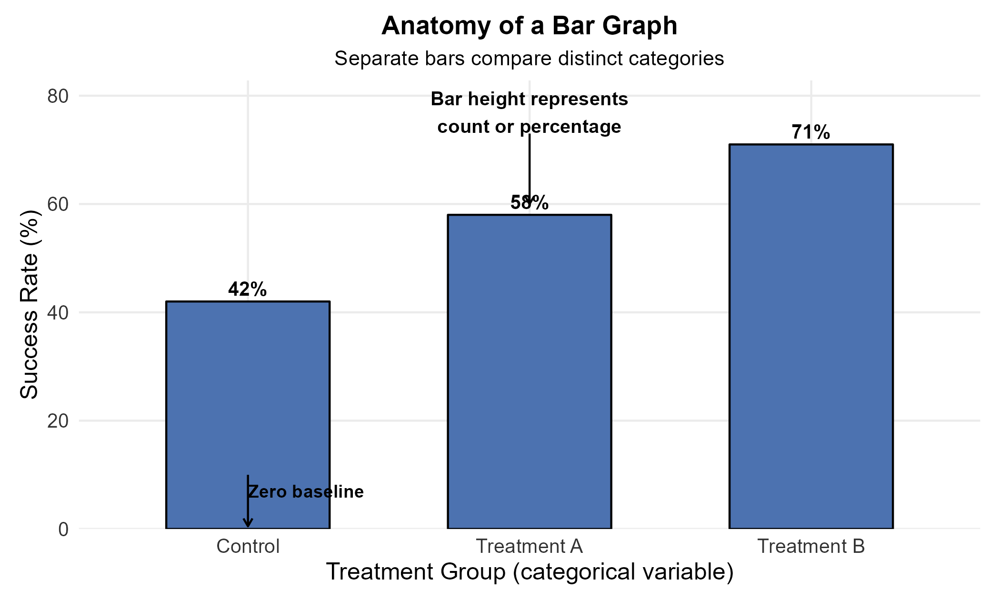

A well-designed bar graph has several important parts:

- **Horizontal axis:** category names.
- **Vertical axis:** counts, proportions, or percentages.
- **Separate bars:** categories are distinct, so bars do not touch.
- **Bar height:** represents the magnitude for each category.
- **Zero baseline:** because bar length represents magnitude, ordinary bar graphs should usually begin at zero.
- **Clear title and units:** tell the reader what is being compared.

### How to Read a Bar Graph

Ask:

1. Which category is largest?
2. Which category is smallest?
3. Which categories are similar?
4. Are the values counts, proportions, or percentages?
5. What sample or population do the values describe?
6. Does the vertical axis begin at zero?

### Using a Line Graph for Nominal Categories

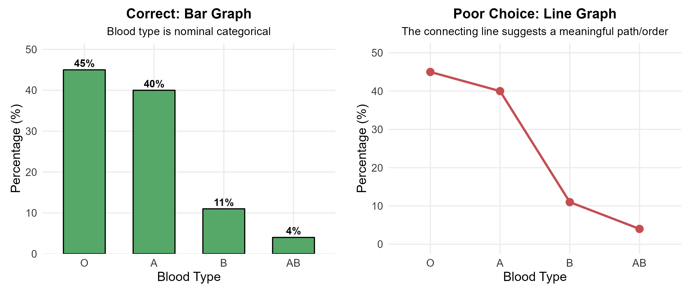

Blood type is a **nominal categorical variable**. There is no meaningful continuous path from O to A to B to AB.

Connecting the categories with a line suggests a progression or relationship that does not exist.

> **Rule:** Use connecting lines when order or continuity matters, especially when the horizontal axis represents time. Do not connect nominal categories simply because software allows it.

### Truncating the Axis of a Bar Graph

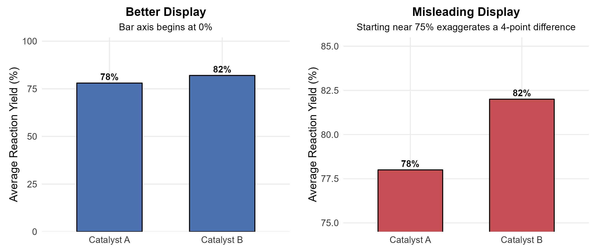

Catalyst A has a reaction yield of 78%, while Catalyst B has a reaction yield of 82%.

The actual difference is

$$
82\%-78\%=4 \text{ percentage points}.
$$

When the vertical axis begins near 75%, the visible bar lengths make the difference appear much larger than it really is.

> **For ordinary bar graphs, the vertical axis should usually begin at zero because bar length represents magnitude.**

---

## Pie Charts: Parts of One Whole

### What Is a Pie Chart?

A **pie chart** divides one whole into categorical slices. Each slice represents the proportion or percentage belonging to one category.

The entire circle represents 100%.

### Anatomy of a Pie Chart

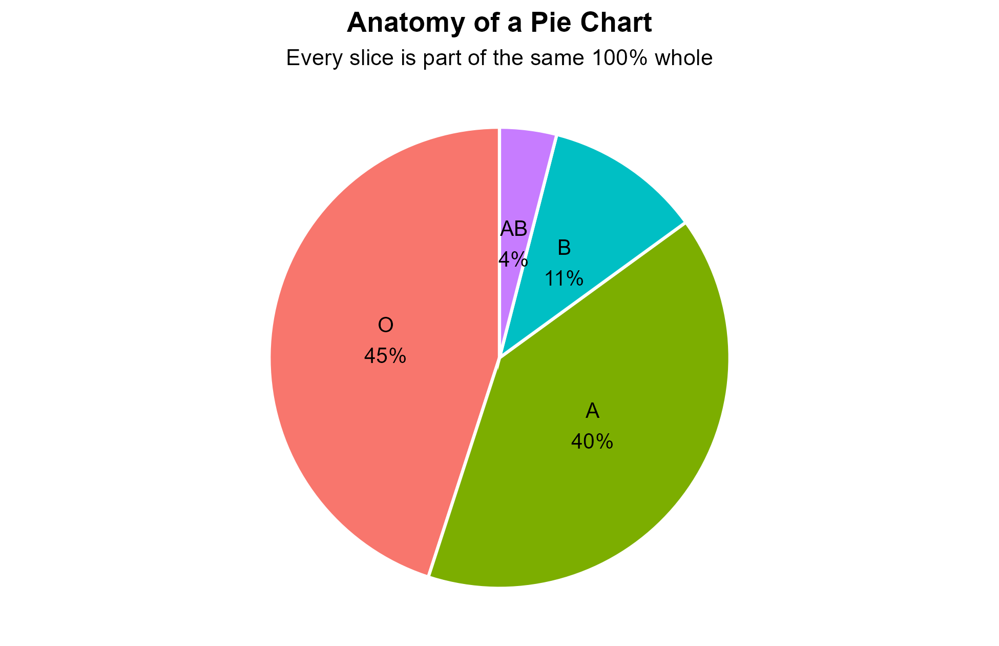

A pie chart is appropriate only when:

1. all categories belong to the same group;
2. the categories are mutually exclusive;
3. the categories collectively represent the entire sample or population being divided; and
4. there are only a few categories.

### Bar Graph vs. Pie Chart

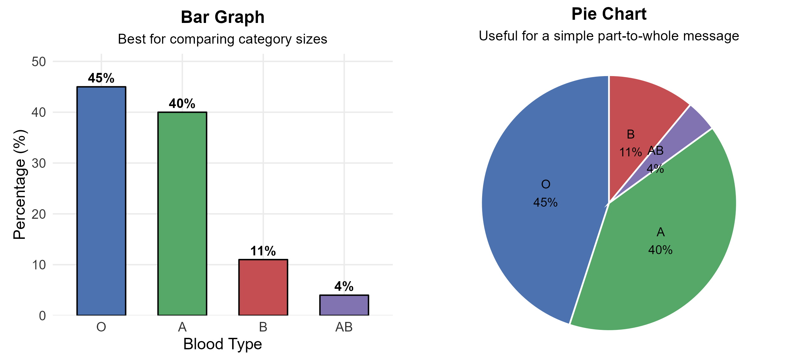

Both displays show the same blood-type percentages.

- The **pie chart** emphasizes the part-to-whole structure.
- The **bar graph** makes small differences easier to compare because lengths on a common scale are easier to judge than angles and areas.

> **Practical recommendation:** Use a pie chart when the part-to-whole relationship is the main message. A bar graph is usually the safer default for comparison.

### A Pie Chart with Different Denominators

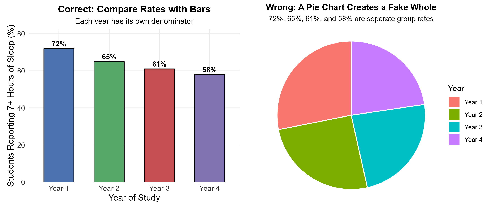

Suppose the percentages of students reporting at least seven hours of sleep are:

- Year 1: 72%;
- Year 2: 65%;
- Year 3: 61%; and
- Year 4: 58%.

Each percentage is calculated from a **different group of students**. These four percentages are not four parts of one common whole.

A pie chart would therefore create an artificial whole with no meaningful interpretation.

> **Before making a pie chart, ask: “Percent of what?”**

When percentages come from different denominators, compare the rates using a **bar graph**, not a pie chart.

---

## A Quick Fair-Graph Checklist

Before trusting a graph, ask:

- Does the graph type match the **variable type**?
- Are the **axes** clearly labeled?
- Are the **units** shown?
- Does a bar graph begin at **zero**?
- Is anything important hidden by the **scale, bin width, or ordering**?
- Does the title describe the data without exaggerating the conclusion?

> A graph communicates an argument about the data. Design choices can make that argument clearer and fairer, or they can exaggerate and hide important features.

---

## Histograms: Seeing the Shape of Quantitative Data

### From Numerical Measurements to a Distribution

A quantitative dataset can contain many distinct measurements, for example,

$$
17.8,\;18.1,\;18.3,\;18.4,\;18.7,\ldots
$$

A separate bar for every exact value would quickly become difficult to read.

A **histogram** solves this problem by grouping nearby numerical values into intervals called **bins** or **classes** and counting how many observations fall in each interval.

### How a Histogram Works

A histogram:

1. divides the numerical scale into intervals;
2. counts how many observations fall in each interval; and
3. draws bars whose heights show those frequencies.

Histogram bars are adjacent because the horizontal axis represents a continuous, ordered numerical scale.

### Anatomy of a Histogram

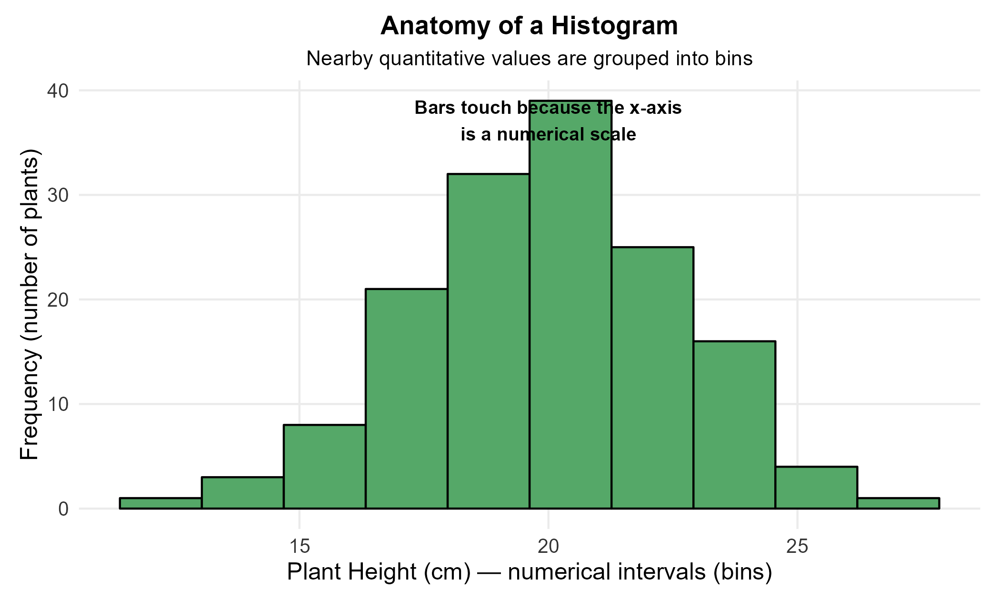

A histogram has several important features:

- **Horizontal axis:** a numerical measurement scale.
- **Bins:** intervals containing nearby values.
- **Vertical axis:** frequency, relative frequency, or percentage.
- **Adjacent bars:** neighboring bins touch because the numerical scale is continuous and ordered.
- **Fixed numerical order:** bins cannot be rearranged like nominal categories.

### Bar Graph vs. Histogram

| **Feature** | **Bar Graph** | **Histogram** |
|:---|:---|:---|
| Variable type | Categorical | Quantitative |
| Horizontal axis | Category labels | Numerical intervals |
| Bars | Separated | Adjacent |
| Order | May sometimes be rearranged | Must follow numerical order |
| Main purpose | Compare categories | Show distribution shape |

Do not choose between a bar graph and a histogram only by how the graph looks. **Start with the variable type.**

### How to Read a Histogram

At first, ask simple visual questions:

1. Where are most observations concentrated?
2. Is there one main peak or several?
3. Does one side have a longer tail?
4. Are there gaps?
5. Are any observations far from the rest?
6. How widely spread are the values?

We will formalize these questions using **SOCS**.

### Example 1.2: Body Lengths of 44 Great White Sharks

Marine biologists measured the body lengths of $n=44$ great white sharks, in feet.

The first several measurements are

$$
18.7,\;12.3,\;18.6,\;16.4,\;15.7,\;18.3,\;14.6,\;15.8,\;14.9,\;17.6,\ldots
$$

Rather than draw a separate bar for each of the 44 exact measurements, nearby lengths can be grouped into classes.

For example, the class from 13.1 ft to 15.0 ft contains 12 sharks. Its approximate percentage is

$$
\frac{12}{44}\times 100\%\approx 27\%.
$$

The complete frequency table is:

| **Length Class (feet)** | **Count** | **Approx. Percentage** |
|:---|---:|---:|
| 9.1 to 11.0 | 1 | 2% |
| 11.1 to 13.0 | 5 | 11% |
| 13.1 to 15.0 | 12 | 27% |
| 15.1 to 17.0 | 15 | 34% |
| 17.1 to 19.0 | 8 | 18% |
| 19.1 to 21.0 | 2 | 5% |
| 21.1 to 23.0 | 1 | 2% |
| **Total** | **44** | **99%*** |

*The percentages total 99% because of rounding.*

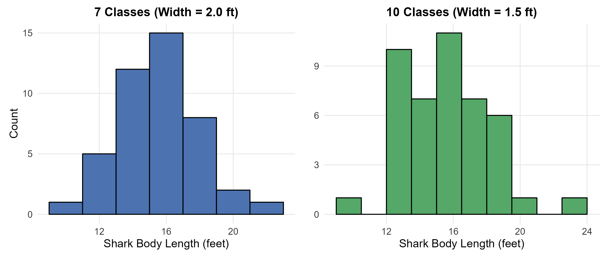

Both histograms contain the same 44 observations.

- The main cluster remains around the middle lengths.
- Changing the bin width changes the amount of visible detail.
- The smallest and largest observations may become more or less visually obvious.

### The Bin Width Problem

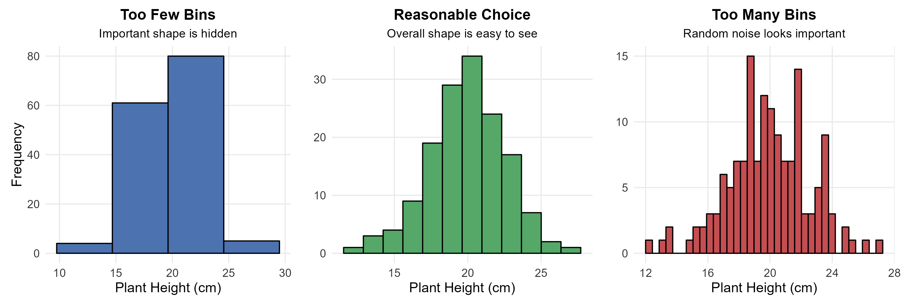

- **Too few bins:** important structure can be smoothed away.
- **Too many bins:** random sampling noise can look important.
- **Reasonable bin width:** the overall structure is visible without manufacturing a story.

There is no single perfect number of bins for every dataset. Inspect several reasonable choices and check whether the main interpretation remains similar.

> **A histogram should help reveal the data, not manufacture a story.**

---

## Describing Quantitative Distributions: SOCS

When asked to describe a histogram or another quantitative distribution, use **SOCS**:

- **S — Shape**
- **O — Outliers**
- **C — Center**
- **S — Spread**

### Shape: Symmetry, Skewness, and Peaks

Common descriptions of shape include:

- **symmetric:** the two sides are roughly mirror images;
- **skewed right:** the longer tail extends toward larger values;
- **skewed left:** the longer tail extends toward smaller values;
- **unimodal:** one main peak; and
- **bimodal:** two main peaks.

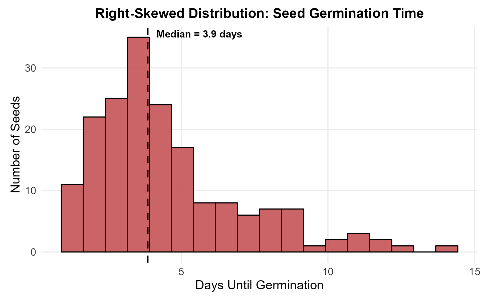

The seed-germination distribution is **right-skewed**: many seeds germinate relatively early, while a smaller number take much longer.

> **Skewness is named for the direction of the long tail, not the location of the tallest bar.**

### Outliers

An **outlier** is an observation that falls far from the overall pattern.

An unusual value might be:

- a genuine extreme observation;
- a data-entry mistake;
- a measurement problem; or
- an observation from a different population.

An outlier is not automatically an error. Investigate the observation, its units, and how it was recorded before deciding what to do with it.

### Center

The **center** describes a typical or middle value in the distribution.

In Chapter 1, the center is estimated visually. Chapter 2 introduces numerical measures such as the **mean** and **median**.

### Spread

The **spread** describes how variable the observations are.

A tightly packed distribution has less spread than a distribution extending over a much wider range. At this stage, the approximate range is often useful for describing spread visually.

### Writing a Good SOCS Description

A good SOCS description uses the **variable name and units** rather than giving only labels.

Instead of writing:

> Right-skewed with one outlier.

write something like:

> The distribution of seed germination times is unimodal and right-skewed. Most seeds germinated within the first several days, while a smaller number took much longer. The distribution is centered around a few days and has a long right tail.

### Example 1.3: SOCS for Shark Lengths

Using the shark histogram:

- **Shape:** roughly unimodal and fairly symmetric through the center.
- **Outliers:** 9.4 ft and 22.8 ft appear separated from much of the data.
- **Center:** approximately 15–16 ft.
- **Spread:** approximately 9.4 ft to 22.8 ft.

At this stage, the goal is to **read the distribution**. Exact numerical summaries are introduced in Chapter 2.

---

## Dotplots: Showing Individual Values

A histogram groups observations into bins. For a smaller dataset, we may instead want to see every observed value.

A **dotplot** places one dot for each observation above a numerical scale.

Dotplots are useful because:

- individual values remain visible;
- repeated values can be stacked;
- clusters, gaps, center, spread, and outliers are easy to inspect; and
- small groups can be compared directly.

They work best when the sample is small or moderate and individual observations remain readable.

### Anatomy of a Dotplot

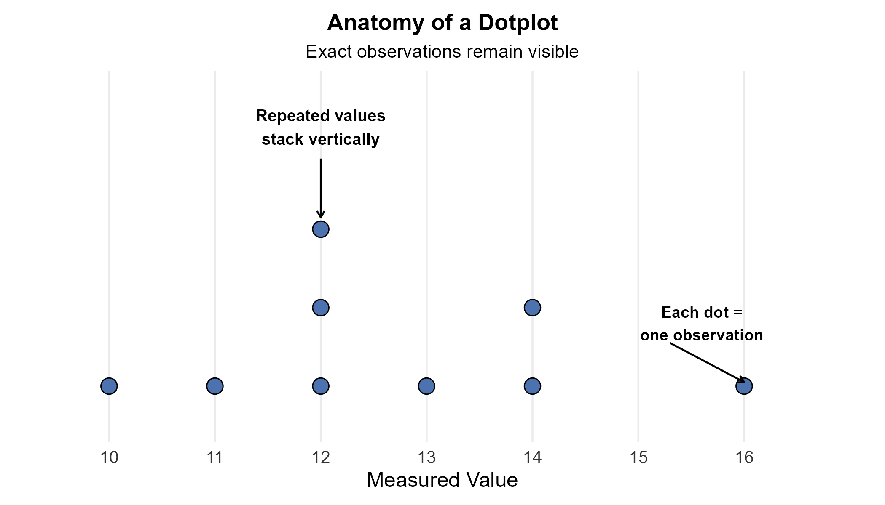

Important parts include:

- **Horizontal axis:** the numerical variable.
- **One dot per observation:** individual values remain visible.
- **Vertical stacking:** repeated values are stacked so that they do not hide one another.
- **No substantive vertical measurement:** the vertical position usually exists only to separate repeated observations.

### Example 1.4: Plant Height With and Without Fertilizer

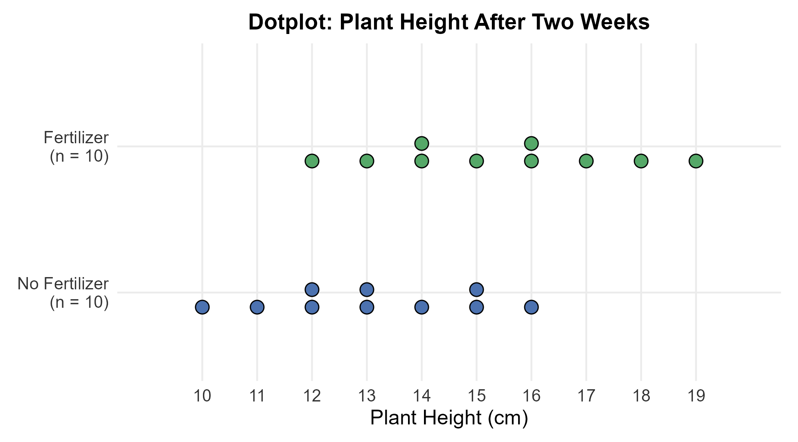

Each dot represents one plant.

From the observed samples:

- plants in the fertilizer group tend to be taller;
- the two groups still overlap;
- the fertilizer group appears shifted to the right; and
- no single point is extremely separated from the rest.

The wording **“from the observed samples”** is important. The dotplot describes the data that were collected. By itself, it does not prove what will happen for every future plant or establish a population-level causal conclusion. Later chapters develop the tools needed to make broader statistical inferences.

### Dotplot vs. Histogram

| **Dotplot** | **Histogram** |
|:---|:---|
| Shows individual observations | Groups observations into bins |
| Excellent for smaller samples | Excellent for larger or denser samples |
| Repeated values remain visible | Overall shape is easier to see with dense data |
| Sample size can often be counted | Exact individual values are not visible |

There is no universal rule such as “use a histogram whenever $n\ge 30$.” Choose the display that communicates the data most clearly for the question being asked.

A dotplot can become difficult to read when there are hundreds or thousands of observations. In that situation, a histogram is often more useful because the goal shifts from seeing every observation to seeing the overall distribution.

---

## Time Plots: When Order Matters

A histogram or dotplot tells us **what values occurred**, but it does not tell us **when they occurred**.

When chronological order matters, use a **time plot**:

- the horizontal axis shows time;
- the vertical axis shows the measured variable; and
- observations are commonly connected in chronological order.

### Anatomy of a Time Plot

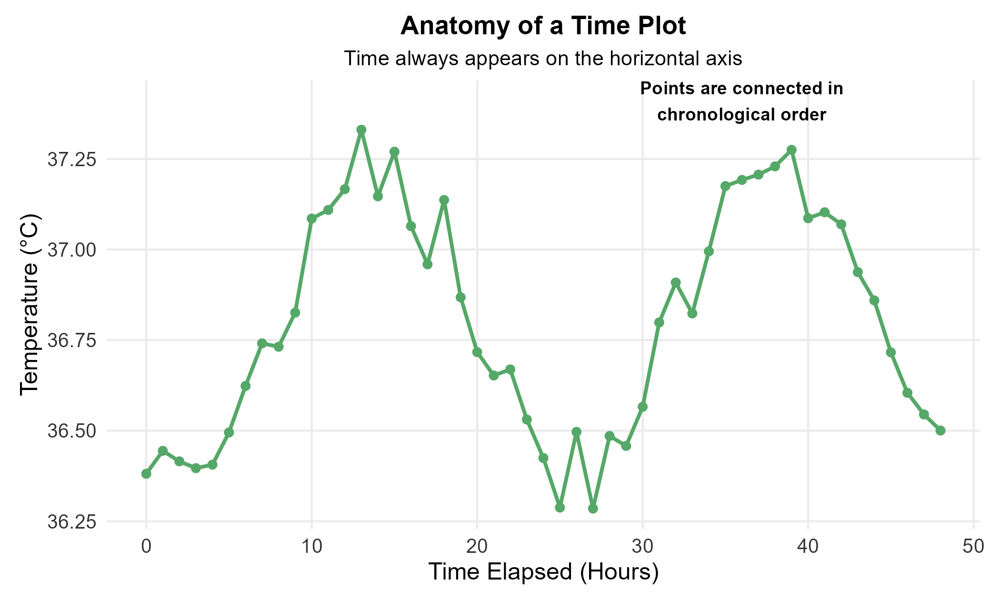

Look for:

- **trend:** long-term upward or downward movement;
- **cycle:** a repeating pattern;
- **sudden change:** an abrupt jump or drop; and
- **unusual observation:** a point that does not fit nearby values.

Use a time plot whenever **when the observation occurred is important to the question**.

Examples include hourly temperature, bacterial growth measured every 30 minutes, monthly unemployment rates, daily calibration measurements, and annual rainfall.

### Example 1.5: A Repeating Daily Pattern

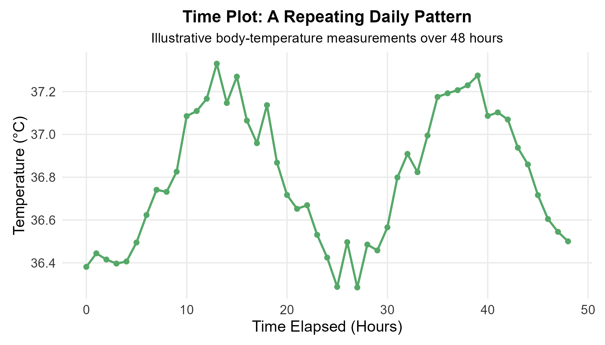

The measurements rise and fall in a repeating pattern over approximately 24 hours.

A histogram could summarize the temperatures and show their overall distribution. However, it would hide **when** the high and low values occurred.

Time order makes cycles and trends visible.

### Example 1.6: A Histogram Can Hide Instrument Drift

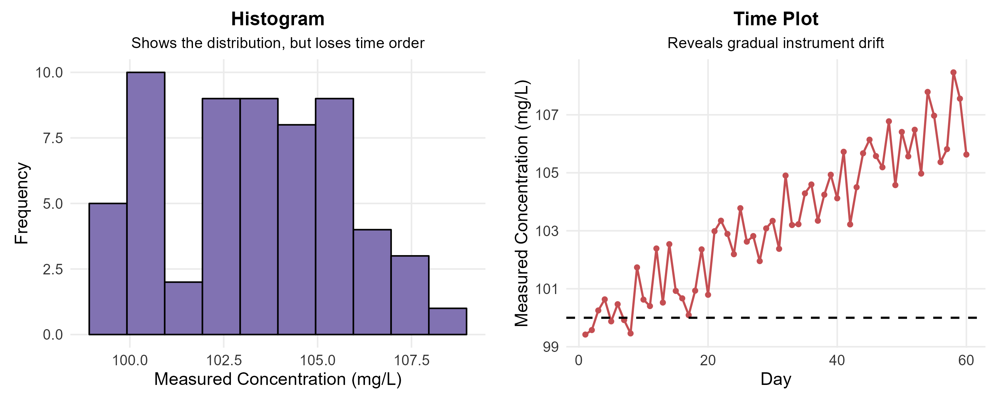

The two panels contain the **same measurements**.

- The histogram answers: **What concentration values occurred?**
- The time plot answers: **When did they occur, and how did they change?**

Suppose a calibration standard is intended to remain at 100 mg/L. The histogram may look like a compact distribution around 100 mg/L, but the time plot reveals a gradual upward drift across the 60 days.

> **When time order is meaningful, plot against time before ignoring the order.**

---

## Outliers and Data Quality

Graphs are not only presentation tools. They also help us check whether the data make sense.

### Always Investigate Unusual Values

When you see an unusual value, ask:

1. Was the value entered correctly?
2. Are the units correct?
3. Was the instrument working correctly?
4. Is the value scientifically plausible?
5. Could it be a genuine but unusual observation?

> **An outlier is not automatically an error. Do not remove data simply because it looks unusual.**

### Example 1.7: A Data-Entry Error

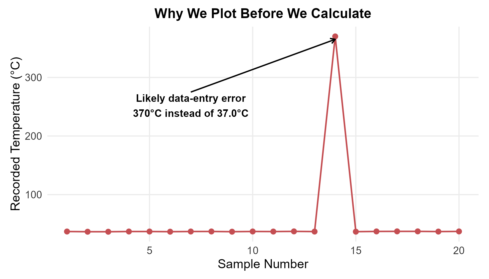

Most recorded body temperatures are near 37°C, but one value is recorded as 370°C.

The graph makes the likely data-entry problem immediately visible. Without plotting first, the typo could strongly distort later numerical summaries such as the mean and standard deviation.

### Common Data Problems That Graphs Can Reveal

| **Problem** | **Example** | **Possible Visual Signature** |
|:---|:---|:---|
| Typing error | 19.4 entered as 194 | One extreme observation |
| Wrong unit | Some masses entered in mg instead of g | Two separated groups or a very large gap |
| Missing-value code | Missing recorded as $-99$ | A strange stack at $-99$ |
| Instrument drift | Calibration changes over days | Gradual trend in a time plot |
| Duplicated record | Same row copied twice | Unusually repeated points |

Graphs are therefore tools for **checking data quality**, not only for presenting finished results.

---

## Apply Your Knowledge

### Apply Your Knowledge 1.1: Breakfast Cereals

Consider a dataset describing 77 breakfast cereals:

| **Brand** | **Manufacturer** | **Type** | **Calories** | **Sugar (g)** |
|:---|:---|:---:|---:|---:|
| All Bran | K | C | 70 | 5 |
| All Bran Fiber | K | C | 50 | 0 |
| Almond Delight | R | C | 110 | 8 |
| Apple Cheerios | G | C | 110 | 10 |
| Apple Jacks | K | C | 110 | 14 |

**Questions**

1. What are the individuals?
2. Which variables are categorical?
3. Which variables are quantitative?
4. Which graph would you use for `Manufacturer`?
5. Which graph would you use for `Sugar` across all 77 cereals?

**Answers**

1. The individuals are the 77 cereal brands.
2. `Manufacturer` and `Type` are categorical.
3. `Calories` and `Sugar` are quantitative.
4. A bar graph is appropriate for `Manufacturer`.
5. A histogram is a good starting graph for `Sugar`.

The important sequence is:

> **Identify the individual $\rightarrow$ identify the variable $\rightarrow$ classify the variable $\rightarrow$ choose the graph based on the question.**

### Apply Your Knowledge 1.2: Choose the Graph

| **Question** | **Structure** | **Best Starting Graph** |
|:---|:---|:---|
| Which blood type is most common? | Categorical | Bar graph |
| How are four categories divided within one whole? | Categorical, part-to-whole | Pie chart or bar graph |
| What is the distribution of 150 plant heights? | Quantitative | Histogram |
| What are the exact reaction times of 12 participants? | Quantitative, small sample | Dotplot |
| Is river temperature changing throughout the day? | Quantitative over time | Time plot |

---

## Master Guide: Which Graph Should You Use?

| **Data Situation** | **Graph** | **What to Describe** | **Common Mistake** |
|:---|:---|:---|:---|
| Categorical counts or percentages | Bar graph | Largest/smallest categories; comparisons | Connecting nominal categories with a line |
| Parts of one whole | Pie chart | Dominant slices; part-to-whole structure | Using separate group rates as slices |
| Small quantitative sample | Dotplot | Individual values; SOCS | Hiding a small sample unnecessarily in bins |
| Larger quantitative sample | Histogram | SOCS; overall shape | Choosing bins that hide or exaggerate patterns |
| Data recorded over time | Time plot | Trend; cycles; sudden changes | Ignoring chronological order |

### A Five-Step Approach for Graph-Selection Questions

1. **Identify the individual:** What does one row represent?
2. **Identify the variable:** What characteristic was recorded?
3. **Classify the variable:** Is it categorical or quantitative? If quantitative, is it discrete or continuous?
4. **Ask whether time order matters.**
5. **Choose the graph that answers the question most clearly.**

---

## Practice: Find the Problem

### Practice 1 (Easy): What Is Wrong with This Graph?

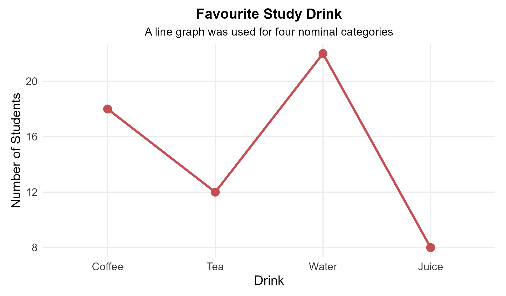

The graph shows students' favourite study drink.

**Question:** What is wrong with this display, and what graph should replace it?

**Answer:** Favourite drink is a nominal categorical variable. Connecting the categories suggests an order or continuous progression that does not exist. A **bar graph** is more appropriate.

### Practice 2 (Medium): Is the Difference Really That Large?

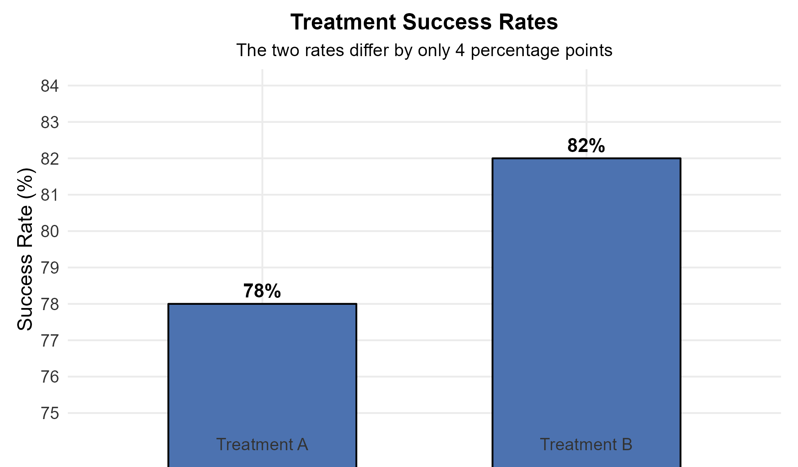

Treatment A has a success rate of 78%, and Treatment B has a success rate of 82%.

**Question:** Why does the visual difference look much larger than the numerical difference?

**Answer:** The vertical axis begins near 75% rather than zero. Because bar length represents magnitude, the truncated baseline exaggerates the 4-percentage-point difference. Ordinary bar graphs should generally begin at zero.

### Practice 3 (Hard): What Important Information Is Missing?

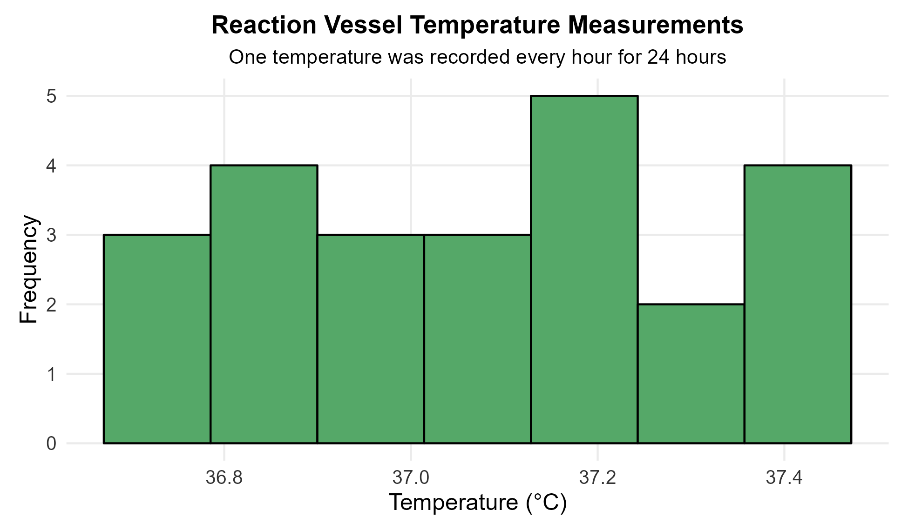

A temperature was recorded every hour for 24 hours. The researcher wants to know whether the reaction-vessel temperature drifted during the experiment.

**Question:** What important information has the histogram discarded?

**Answer:** The histogram shows the distribution of temperatures but removes chronological order. It cannot reveal drift, cycles, or sudden changes. A **time plot** of temperature against time should be examined first.

---

## Key Terminology Review

- **Statistics:** The science of learning from data.
- **Individual (case):** The object, person, organism, or other observational unit represented by one row.
- **Identifier:** A label used to distinguish individuals, such as a plant ID.
- **Variable:** A characteristic recorded for each individual that can take different values.
- **Categorical variable:** Places observations into groups or categories.
- **Nominal variable:** A categorical variable whose categories have no natural order.
- **Ordinal variable:** A categorical variable whose categories have a meaningful order.
- **Quantitative variable:** Records a numerical amount for which arithmetic is meaningful.
- **Discrete variable:** A quantitative variable that usually results from counting.
- **Continuous variable:** A quantitative variable that usually results from measuring.
- **Distribution:** The values a variable takes and how often they occur.
- **Frequency:** The number of observations in a category or class.
- **Relative frequency:** The proportion of observations in a category or class.
- **Bar graph:** A graph for categorical data with separated bars.
- **Pie chart:** A part-to-whole display for categories that form one whole.
- **Histogram:** A graph for quantitative data using adjacent numerical bins.
- **Dotplot:** A graph that displays individual quantitative observations as dots.
- **Time plot:** A graph of a quantitative variable against chronological time.
- **SOCS:** Shape, Outliers, Center, Spread.
- **Outlier:** An observation that lies far from the overall pattern.
- **Trend:** Long-term upward or downward movement over time.
- **Cycle:** A pattern that repeats over time.

---

## Chapter 1 Summary

The main goal of this chapter is not to memorize graph names. It is to learn to **match a graph to the data and the question, interpret the graph correctly, and recognize when a display can hide or exaggerate information**.

### The Core Rules

1. **Know what one row represents.** Identify the individuals before analyzing variables.
2. **Classify the variable.** Categorical and quantitative variables require different displays.
3. **Use bar graphs for categorical comparisons.** Use pie charts only when categories form parts of one whole.
4. **Use histograms to see the overall shape of quantitative distributions.** Check whether bin width changes the story.
5. **Describe quantitative distributions using SOCS.**
6. **Use dotplots when individual values remain readable.**
7. **Use time plots when order matters.** A histogram can hide a trend, cycle, or drift.
8. **Investigate unusual observations rather than automatically deleting them.**
9. **Check axes, scales, labels, units, binning, and ordering before trusting a graph.**
10. **Plot before relying only on numerical summaries.** Graphs can reveal errors and patterns that a single number may hide.

### Final Graph Checklist

Before interpreting or presenting a graph, ask:

- What are the individuals?
- What variable is being displayed?
- Is the variable categorical or quantitative?
- If it is categorical, are the categories nominal or ordinal?
- If it is quantitative, is it discrete or continuous?
- Does time order matter?
- Is this the right graph for the question?
- What does each visual element represent?
- Are the title, axes, units, and denominator clear?
- Could the scale, binning, or ordering exaggerate or hide a pattern?
- What is the main pattern visible in the data?

### Looking Ahead: Chapter 2

In Chapter 1, we learned to **see** center and spread. In Chapter 2, we will learn to calculate them.

We will introduce numerical measures of center such as

$$
\text{Mean} \qquad \text{Median}
$$

and measures of variability such as

$$
\text{Range} \qquad \text{Interquartile Range} \qquad \text{Standard Deviation}.
$$

The key idea remains the same:

> **Numbers and graphs should support each other.**
