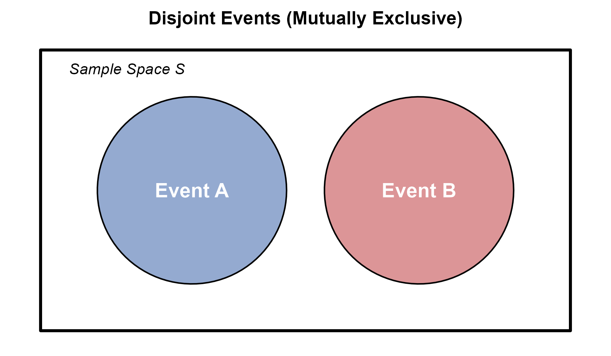
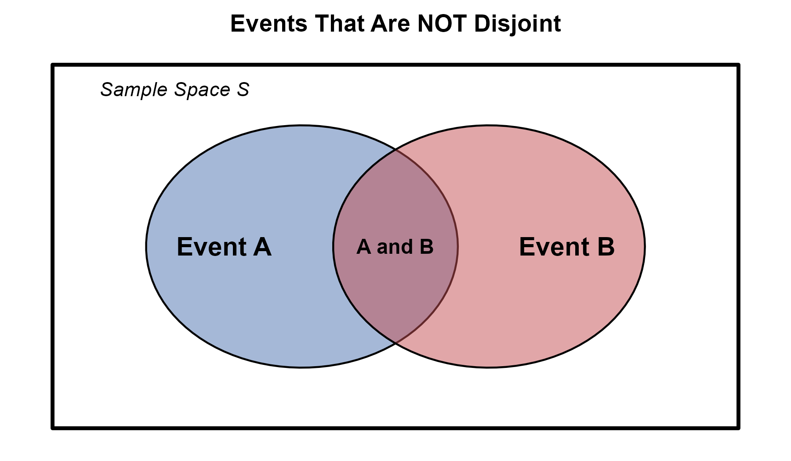
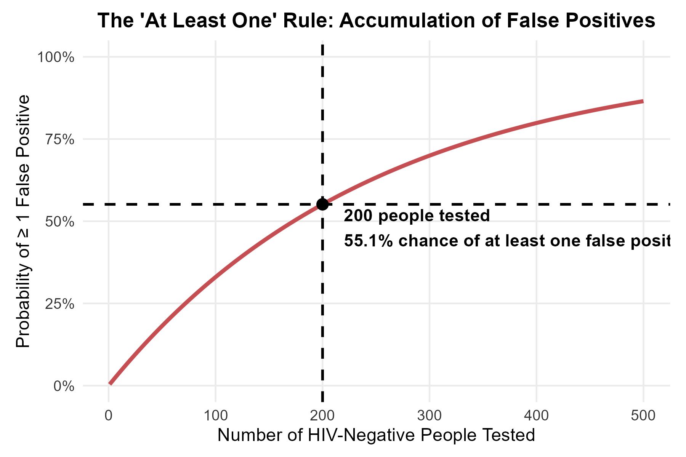
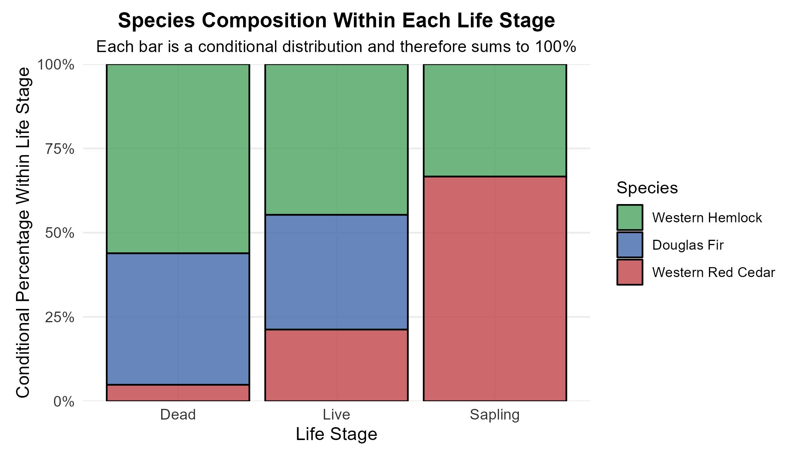
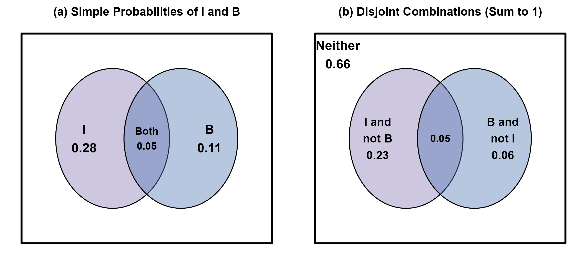
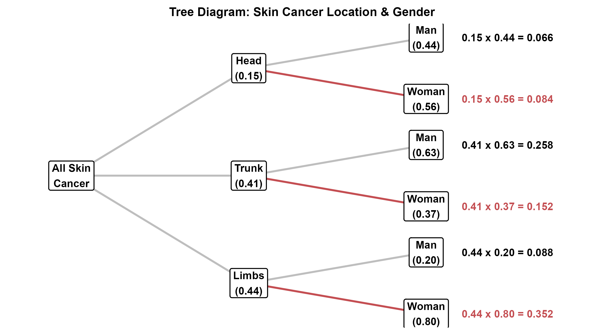
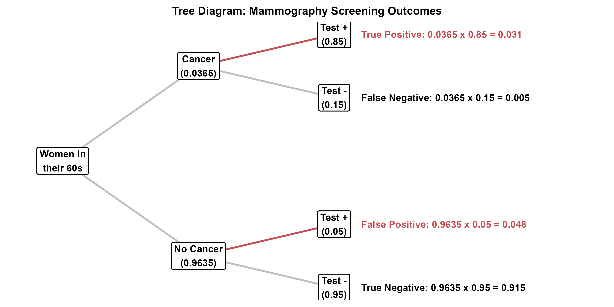

<style>
/* ============================================================
   CHAPTER 10 — PAGE + COLLAPSIBLE TABLE OF CONTENTS
   ============================================================ */

:root {
  --toc-width: 300px;
  --toc-collapsed-gutter: 72px;
  --chapter-width: 1100px;

  --ink: #23364a;
  --accent: #2c3e50;
  --line: #d8dee4;
  --soft: #f6f8fa;
  --toc-background: #f7f9fb;
}


/* ============================================================
   GENERAL PAGE
   ============================================================ */

html {
  scroll-behavior: smooth;
}

body {
  font-size: 17px;
  line-height: 1.65;
  color: var(--ink);
}

.main-container {
  max-width: var(--chapter-width) !important;
}


/* ============================================================
   HIDE DUMMY CHAPTER CONTENT
   ============================================================ */

/*
   Chapter 10 is the visible chapter heading; Pandoc applies a section-number offset of 9 so that its subsections begin at 10.1.

   Hide the visible "Chapter 10" H1 because the document title
   already says Chapter 10, but KEEP the section itself so that
   H2 headings are numbered 10.1, 10.2, 10.3, ...
*/
.section.chapter-root > h1 {
  display: none !important;
}


/* ============================================================
   HIDE CHAPTERS 1–8 FROM THE TABLE OF CONTENTS
   ============================================================ */

/*
   R Markdown/tocify does not reliably expose the chapter names
   through data-unique, so select them through their generated
   href values instead.
*/

#TOC li:has(a[href="#chapter-1-dummy"]),
#TOC li:has(a[href="#chapter-2-dummy"]),
#TOC li:has(a[href="#chapter-3-dummy"]),
#TOC li:has(a[href="#chapter-4-dummy"]),
#TOC li:has(a[href="#chapter-5-dummy"]),
#TOC li:has(a[href="#chapter-6-dummy"]),
#TOC li:has(a[href="#chapter-7-dummy"]),
#TOC li:has(a[href="#chapter-8-dummy"]) {
  display: none !important;
}


/*
   Also hide the Chapter 10 parent entry itself.

   Its children — 10.1, 10.2, 10.3, ... — remain visible.
*/
#TOC li:has(> a[href="#chapter-10"]) > a[href="#chapter-10"] {
  display: none !important;
}


/*
   tocify may place the Chapter 10 subsections inside the same
   list item. Remove spacing belonging to the hidden parent.
*/
#TOC li:has(> a[href="#chapter-10"]) {
  margin-top: 0 !important;
}


/* ============================================================
   ACCESSIBILITY
   ============================================================ */

.sr-only {
  position: absolute;
  width: 1px;
  height: 1px;
  padding: 0;
  margin: -1px;
  overflow: hidden;
  clip: rect(0, 0, 0, 0);
  white-space: nowrap;
  border: 0;
}


/* ============================================================
   SIDEBAR TOGGLE BUTTON
   ============================================================ */

#toc-toggle {
  position: fixed;

  top: 16px;
  left: calc(var(--toc-width) + 14px);

  width: 42px;
  height: 42px;

  display: flex;
  align-items: center;
  justify-content: center;

  padding: 0;

  border: 1px solid #c7d0d9;
  border-radius: 8px;

  background: #ffffff;
  color: var(--ink);

  box-shadow: 0 2px 8px rgba(24, 39, 55, 0.13);

  cursor: pointer;

  font-size: 24px;
  line-height: 1;

  z-index: 1200;

  transition:
    left 0.25s ease,
    background-color 0.2s ease,
    box-shadow 0.2s ease,
    transform 0.2s ease;
}

#toc-toggle:hover {
  background: #eef3f7;
  box-shadow: 0 3px 10px rgba(24, 39, 55, 0.18);
}

#toc-toggle:focus-visible {
  outline: 3px solid rgba(44, 62, 80, 0.28);
  outline-offset: 2px;
}


/* Open/close icons */

#toc-toggle .menu-icon {
  display: none;
}

#toc-toggle .close-icon {
  display: inline;
}


/* Button position when sidebar is collapsed */

body.toc-collapsed #toc-toggle {
  left: 14px;
}

body.toc-collapsed #toc-toggle .menu-icon {
  display: inline;
}

body.toc-collapsed #toc-toggle .close-icon {
  display: none;
}


/* ============================================================
   DESKTOP LAYOUT
   ============================================================ */

@media screen and (min-width: 992px) {

  /*
     Make room for fixed sidebar.
  */
  .main-container {
    width: 100% !important;
    max-width: none !important;

    padding-left: calc(var(--toc-width) + 30px) !important;
    padding-right: 35px !important;

    box-sizing: border-box !important;

    transition: padding-left 0.25s ease;
  }


  /*
     When sidebar is collapsed, reclaim almost all of the space.
  */
  body.toc-collapsed .main-container {
    padding-left: var(--toc-collapsed-gutter) !important;
  }


  /*
     Bootstrap normally reserves a column for the TOC.
     The TOC is fixed now, so remove that reserved column.
  */
  .main-container > .row-fluid > .col-xs-12.col-sm-4.col-md-3,
  .main-container > .row > .col-xs-12.col-sm-4.col-md-3 {
    width: 0 !important;
    min-height: 0 !important;
    padding: 0 !important;
    margin: 0 !important;
  }


  /* ----------------------------------------------------------
     FLOATING TOC
     ---------------------------------------------------------- */

  #TOC,
  #TOC.tocify {
    position: fixed !important;

    top: 0 !important;
    bottom: 0 !important;
    left: 0 !important;

    width: var(--toc-width) !important;
    max-height: 100vh !important;

    box-sizing: border-box !important;

    overflow-y: auto !important;
    overflow-x: hidden !important;

    margin: 0 !important;
    padding: 72px 16px 28px 18px !important;

    background: var(--toc-background) !important;

    border: 0 !important;
    border-right: 1px solid var(--line) !important;
    border-radius: 0 !important;

    box-shadow: none !important;

    z-index: 1100 !important;

    transform: translateX(0);

    transition: transform 0.25s ease;
  }


  /*
     Completely slide sidebar off screen when collapsed.
  */
  body.toc-collapsed #TOC,
  body.toc-collapsed #TOC.tocify {
    transform: translateX(calc(-1 * var(--toc-width)));
  }


  /*
     Allow long section headings to wrap rather than getting
     clipped.
  */
  #TOC a {
    white-space: normal !important;
    overflow-wrap: break-word !important;
    word-break: normal !important;
  }


  /* ----------------------------------------------------------
     TOC TYPOGRAPHY
     ---------------------------------------------------------- */

  #TOC .tocify-item {
    border-radius: 4px;
  }

  #TOC .tocify-item a {
    color: var(--ink);
    text-decoration: none;
  }

  #TOC .tocify-item:hover {
    background: #e9eef3;
  }

  #TOC .tocify-item.active {
    background: var(--accent) !important;
  }

  #TOC .tocify-item.active a {
    color: #ffffff !important;
  }


  /* ----------------------------------------------------------
     MAIN CHAPTER CONTENT
     ---------------------------------------------------------- */

  .toc-content,
  .toc-content.col-xs-12.col-sm-8.col-md-9 {
    width: 100% !important;
    max-width: var(--chapter-width) !important;

    float: none !important;

    margin-left: auto !important;
    margin-right: auto !important;

    padding-left: 15px !important;
    padding-right: 15px !important;

    box-sizing: border-box !important;
  }


  /*
     Fallback for Pandoc output that does not use Bootstrap's
     normal R Markdown container structure.
  */
  body.standalone-pandoc {
    width: calc(100% - var(--toc-width)) !important;
    max-width: none !important;

    box-sizing: border-box !important;

    margin: 0 0 0 var(--toc-width) !important;
    padding: 50px 45px !important;

    transition:
      width 0.25s ease,
      margin-left 0.25s ease,
      padding-left 0.25s ease;
  }

  body.standalone-pandoc.toc-collapsed {
    width: 100% !important;

    margin-left: 0 !important;
    padding-left: var(--toc-collapsed-gutter) !important;
  }

  body.standalone-pandoc > header,
  body.standalone-pandoc > section {
    max-width: var(--chapter-width);

    margin-left: auto;
    margin-right: auto;
  }
}


/* ============================================================
   MOBILE / TABLET
   ============================================================ */

@media screen and (max-width: 991px) {

  .main-container {
    width: auto !important;
    max-width: var(--chapter-width) !important;

    margin-left: auto !important;
    margin-right: auto !important;

    padding: 70px 18px 24px !important;

    box-sizing: border-box !important;
  }


  /*
     Toggle remains at upper-left on mobile.
  */
  #toc-toggle,
  body.toc-collapsed #toc-toggle {
    left: 12px;
  }


  /*
     Mobile starts with menu icon.
  */
  #toc-toggle .menu-icon,
  body.toc-collapsed #toc-toggle .menu-icon {
    display: inline;
  }

  #toc-toggle .close-icon,
  body.toc-collapsed #toc-toggle .close-icon {
    display: none;
  }


  /*
     Show X while the mobile TOC is open.
  */
  body.toc-mobile-open #toc-toggle .menu-icon {
    display: none;
  }

  body.toc-mobile-open #toc-toggle .close-icon {
    display: inline;
  }


  /* ----------------------------------------------------------
     MOBILE TOC DRAWER
     ---------------------------------------------------------- */

  #TOC,
  #TOC.tocify {
    position: fixed !important;

    top: 0 !important;
    bottom: 0 !important;
    left: 0 !important;

    width: min(84vw, 320px) !important;
    max-height: 100vh !important;

    box-sizing: border-box !important;

    overflow-y: auto !important;
    overflow-x: hidden !important;

    margin: 0 !important;
    padding: 72px 18px 28px !important;

    background: var(--toc-background) !important;

    border: 0 !important;
    border-right: 1px solid var(--line) !important;
    border-radius: 0 !important;

    z-index: 1100 !important;

    transform: translateX(-105%);

    transition: transform 0.25s ease;
  }

  body.toc-mobile-open #TOC,
  body.toc-mobile-open #TOC.tocify {
    transform: translateX(0);

    box-shadow: 6px 0 18px rgba(24, 39, 55, 0.16);
  }


  /*
     Prevent long headings from being clipped.
  */
  #TOC a {
    white-space: normal !important;
    overflow-wrap: break-word !important;
    word-break: normal !important;
  }


  body.standalone-pandoc {
    width: auto !important;
    max-width: var(--chapter-width) !important;

    margin: 0 auto !important;
    padding: 70px 18px 24px !important;

    box-sizing: border-box !important;
  }
}


/* ============================================================
   SECTION HEADINGS
   ============================================================ */

h1,
h2,
h3,
h4,
h5 {
  margin-top: 1.6em;
}

h2 {
  border-bottom: 3px solid var(--accent);
  padding-bottom: 0.25em;
}

h3 {
  border-bottom: 1px solid var(--line);
  padding-bottom: 0.2em;
}


/* ============================================================
   BLOCKQUOTES / DEFINITION BOXES
   ============================================================ */

blockquote {
  border-left: 4px solid var(--accent);

  background: #f7f9fa;

  padding: 0.7em 1em;
  margin-top: 1.2em;
  margin-bottom: 1.2em;
}


/* ============================================================
   TABLES
   ============================================================ */

table {
  width: 100%;

  margin: 1.35em auto;

  border-collapse: separate !important;
  border-spacing: 0;

  background: #ffffff;

  border: 1px solid #d6dde5;
  border-radius: 8px;

  overflow: hidden;

  box-shadow: 0 2px 8px rgba(24, 39, 55, 0.06);
}

table thead th {
  padding: 0.72em 0.9em !important;

  background: var(--accent);
  color: #ffffff;

  border: 0 !important;
  border-bottom: 1px solid #1e2d3b !important;

  font-weight: 700;

  vertical-align: middle !important;
}

table tbody td {
  padding: 0.65em 0.9em !important;

  border: 0 !important;
  border-bottom: 1px solid #e5e9ee !important;

  vertical-align: middle !important;
}

table tbody tr:nth-child(even) td {
  background: #f7f9fb;
}

table tbody tr:hover td {
  background: #eef4f8;
}

table tbody tr:last-child td {
  border-bottom: 0 !important;
}


/* ============================================================
   IMAGES
   ============================================================ */

img {
  display: block;

  max-width: 100%;
  height: auto;

  margin: 1.4em auto;

  border: 1px solid #e1e4e8;
  border-radius: 7px;
}


/* ============================================================
   MATHEMATICS
   ============================================================ */

.math.display {
  overflow-x: auto;
}


/* ============================================================
   HIDE R MARKDOWN CODE-FOLDING UI
   ============================================================ */

.btn-code,
.code-folding-btn,
div.btn-group.pull-right {
  display: none !important;
}
</style>

<button id="toc-toggle"
        type="button"
        aria-label="Toggle table of contents"
        aria-expanded="true">
  <span class="menu-icon" aria-hidden="true">&#9776;</span>
  <span class="close-icon" aria-hidden="true">&times;</span>
  <span class="sr-only">Toggle table of contents</span>
</button>

<script>
document.addEventListener("DOMContentLoaded", function () {
  const button = document.getElementById("toc-toggle");

  if (!button) return;

  button.addEventListener("click", function () {
    if (window.innerWidth <= 991) {
      document.body.classList.toggle("toc-mobile-open");

      const isOpen =
        document.body.classList.contains("toc-mobile-open");

      button.setAttribute("aria-expanded", isOpen);
    } else {
      document.body.classList.toggle("toc-collapsed");

      const isOpen =
        !document.body.classList.contains("toc-collapsed");

      button.setAttribute("aria-expanded", isOpen);
    }
  });
});
</script>

```{r setup, include=FALSE, echo=FALSE, warning=FALSE, message=FALSE}
knitr::opts_chunk$set(
  echo = TRUE,
  warning = FALSE,
  message = FALSE,
  error = FALSE,
  fig.align = "center", 
  fig.width = 6, 
  fig.height = 4
)

library(ggplot2)
library(dplyr)
library(tidyr)
library(gridExtra)

set.seed(123)

lecture_theme <- theme_minimal(base_size = 11) +
  theme(
    plot.title = element_text(size = 13, face = "bold", hjust = 0.5),
    axis.title = element_blank(),
    axis.text = element_blank(),
    panel.grid = element_blank(),
    plot.background = element_rect(fill = "white", colour = NA),
    panel.background = element_rect(fill = "white", colour = NA),
    plot.margin = margin(8, 10, 8, 10)
  )

# A second theme for ordinary statistical charts. Unlike the diagram theme
# above, this keeps axis labels, tick marks, and a light major grid visible.
lecture_chart_theme <- theme_minimal(base_size = 11) +
  theme(
    plot.title = element_text(size = 13, face = "bold", hjust = 0.5),
    plot.subtitle = element_text(size = 10.5, hjust = 0.5),
    axis.title = element_text(size = 11.5),
    axis.text = element_text(size = 9.5, colour = "#333333"),
    panel.grid.minor = element_blank(),
    plot.background = element_rect(fill = "white", colour = NA),
    panel.background = element_rect(fill = "white", colour = NA),
    plot.margin = margin(8, 10, 8, 10)
  )

save_plot <- function(filename, plot, width, height) {
  ggsave(filename = filename, plot = plot, width = width, height = height, units = "in", dpi = 300, bg = "white")
}

# Helper function to generate mathematically perfect circles for Venn Diagrams
circle_data <- function(center_x, center_y, radius, n_points = 100) {
  theta <- seq(0, 2 * pi, length.out = n_points)
  data.frame(x = center_x + radius * cos(theta), y = center_y + radius * sin(theta))
}

# =============================================================
# 1. Venn Diagram: Disjoint Events
# =============================================================
circle_A_disj <- circle_data(-1.2, 0, 1)
circle_B_disj <- circle_data(1.2, 0, 1)

p_venn_disjoint <- ggplot() +
  geom_rect(aes(xmin = -2.8, xmax = 2.8, ymin = -1.5, ymax = 1.5), fill = "white", color = "black", size = 1) +
  geom_polygon(data = circle_A_disj, aes(x, y), fill = "#4C72B0", alpha = 0.6, color = "black") +
  geom_polygon(data = circle_B_disj, aes(x, y), fill = "#C44E52", alpha = 0.6, color = "black") +
  annotate("text", x = -1.2, y = 0, label = "Event A", size = 5, fontface = "bold", color="white") +
  annotate("text", x = 1.2, y = 0, label = "Event B", size = 5, fontface = "bold", color="white") +
  annotate("text", x = -2.5, y = 1.3, label = "Sample Space S", fontface = "italic", hjust = 0) +
  labs(title = "Disjoint Events (Mutually Exclusive)") +
  lecture_theme

save_plot("fig_ch10_venn_disjoint.png", p_venn_disjoint, width = 6, height = 3.5)

# =============================================================
# 2. Venn Diagram: Overlapping Events
# =============================================================
circle_A_over <- circle_data(-0.6, 0, 1)
circle_B_over <- circle_data(0.6, 0, 1)

p_venn_overlap <- ggplot() +
  geom_rect(aes(xmin = -2.2, xmax = 2.2, ymin = -1.5, ymax = 1.5), fill = "white", color = "black", size = 1) +
  geom_polygon(data = circle_A_over, aes(x, y), fill = "#4C72B0", alpha = 0.5, color = "black") +
  geom_polygon(data = circle_B_over, aes(x, y), fill = "#C44E52", alpha = 0.5, color = "black") +
  annotate("text", x = -1.1, y = 0, label = "Event A", size = 5, fontface = "bold") +
  annotate("text", x = 1.1, y = 0, label = "Event B", size = 5, fontface = "bold") +
  annotate("text", x = 0, y = 0, label = "A and B", size = 4, fontface = "bold") +
  annotate("text", x = -1.9, y = 1.3, label = "Sample Space S", fontface = "italic", hjust = 0) +
  labs(title = "Events That Are NOT Disjoint") +
  lecture_theme

save_plot("fig_ch10_venn_overlap.png", p_venn_overlap, width = 6, height = 3.5)

# =============================================================
# 3. Probability of At Least One False Positive (HIV Test)
# =============================================================
# False positive rate is 0.004. 
# We calculate 1 - P(no false positives) for 1 to 500 people.
n_people <- 1:500
prob_at_least_one <- 1 - (0.996)^n_people

hiv_data <- data.frame(Tested = n_people, Probability = prob_at_least_one)

p_hiv <- ggplot(hiv_data, aes(x = Tested, y = Probability)) +
  geom_line(color = "#C44E52", size = 1.2) +
  geom_hline(yintercept = 0.5514, linetype = "dashed", color = "black", size = 0.8) +
  geom_vline(xintercept = 200, linetype = "dashed", color = "black", size = 0.8) +
  annotate("point", x = 200, y = 0.5514, color = "black", size = 3) +
  annotate("text", x = 220, y = 0.48, label = "200 people tested\n55.1% chance of at least one false positive", hjust = 0, fontface = "bold") +
  scale_y_continuous(labels = scales::percent_format(), limits = c(0, 1)) +
  labs(
    title = "The 'At Least One' Rule: Accumulation of False Positives",
    x = "Number of HIV-Negative People Tested",
    y = "Probability of ≥ 1 False Positive"
  ) +
  lecture_chart_theme

save_plot("fig_ch10_hiv_falsepos.png", p_hiv, width = 6, height = 4)

# =============================================================
# 4. Conditional Probability: Forest Ecosystem
# =============================================================
# Create the dataset based on the textbook table
forest_data <- data.frame(
  Species = rep(c("Western Red Cedar", "Douglas Fir", "Western Hemlock"), each = 3),
  Stage = rep(c("Dead", "Live", "Sapling"), 3),
  Probability = c(0.02, 0.10, 0.08,  # RC
                  0.16, 0.16, 0.00,  # DF
                  0.23, 0.21, 0.04)  # WH
)

# Convert to factor to control plotting order
forest_data$Stage <- factor(forest_data$Stage, levels = c("Dead", "Live", "Sapling"))
forest_data$Species <- factor(forest_data$Species, levels = c("Western Hemlock", "Douglas Fir", "Western Red Cedar"))

# Convert the joint probabilities to conditional probabilities within each
# life stage. This makes the graph directly answer questions such as
# P(Species | Stage). Each bar therefore represents 100% of one life stage.
forest_conditional <- forest_data %>%
  group_by(Stage) %>%
  mutate(ConditionalProbability = Probability / sum(Probability)) %>%
  ungroup()

p_forest <- ggplot(
  forest_conditional,
  aes(x = Stage, y = ConditionalProbability, fill = Species)
) +
  geom_col(color = "black", alpha = 0.85) +
  scale_fill_manual(values = c("Western Hemlock" = "#55A868", 
                               "Douglas Fir" = "#4C72B0", 
                               "Western Red Cedar" = "#C44E52")) +
  scale_y_continuous(
    labels = scales::percent_format(accuracy = 1),
    limits = c(0, 1),
    expand = expansion(mult = c(0, 0))
  ) +
  labs(
    title = "Species Composition Within Each Life Stage",
    subtitle = "Each bar is a conditional distribution and therefore sums to 100%",
    x = "Life Stage",
    y = "Conditional Percentage Within Life Stage"
  ) +
  lecture_chart_theme +
  theme(legend.position = "right")

save_plot("fig_ch10_forest_conditional.png", p_forest, width = 7, height = 4)

# =============================================================
# 5. General Addition Rule Venn Diagrams (Dalmatians)
# =============================================================
# We create two side-by-side plots to replicate Fig 10.4
circle_I <- circle_data(-0.6, 0, 1)
circle_B <- circle_data(0.6, 0, 1)

# Plot A: Simple probabilities
p_venn_A <- ggplot() +
  geom_rect(aes(xmin = -2.2, xmax = 2.2, ymin = -1.5, ymax = 1.5), fill = "white", color = "black", size = 1) +
  geom_polygon(data = circle_I, aes(x, y), fill = "#8172B2", alpha = 0.4, color = "black") +
  geom_polygon(data = circle_B, aes(x, y), fill = "#4C72B0", alpha = 0.4, color = "black") +
  annotate("text", x = -1.1, y = 0, label = "I\n0.28", size = 5, fontface = "bold") +
  annotate("text", x = 1.1, y = 0, label = "B\n0.11", size = 5, fontface = "bold") +
  annotate("text", x = 0, y = 0, label = "Both\n0.05", size = 4, fontface = "bold") +
  labs(title = "(a) Simple Probabilities of I and B") +
  lecture_theme + theme(axis.line = element_blank())

# Plot B: Disjoint probabilities (Total sums to 1)
p_venn_B <- ggplot() +
  geom_rect(aes(xmin = -2.2, xmax = 2.2, ymin = -1.5, ymax = 1.5), fill = "white", color = "black", size = 1) +
  geom_polygon(data = circle_I, aes(x, y), fill = "#8172B2", alpha = 0.4, color = "black") +
  geom_polygon(data = circle_B, aes(x, y), fill = "#4C72B0", alpha = 0.4, color = "black") +
  # I only (0.28 - 0.05 = 0.23)
  annotate("text", x = -1.1, y = 0, label = "I and\nnot B\n0.23", size = 4.5, fontface = "bold") +
  # B only (0.11 - 0.05 = 0.06)
  annotate("text", x = 1.1, y = 0, label = "B and\nnot I\n0.06", size = 4.5, fontface = "bold") +
  # Intersection (0.05)
  annotate("text", x = 0, y = 0, label = "0.05", size = 4, fontface = "bold") +
  # Outside (Neither: 1 - (0.23+0.06+0.05) = 0.66)
  annotate("text", x = -1.8, y = 1.2, label = "Neither\n0.66", size = 5, fontface = "bold") +
  labs(title = "(b) Disjoint Combinations (Sum to 1)") +
  lecture_theme + theme(axis.line = element_blank())

p_dalmatian_venn <- grid.arrange(p_venn_A, p_venn_B, ncol = 2)
save_plot("fig_ch10_dalmatian_venn.png", p_dalmatian_venn, width = 9, height = 4)

# =============================================================
# 6. Tree Diagram: Skin Cancer (Example 10.10)
# =============================================================
# Define coordinates for the tree nodes
nodes <- data.frame(
  x = c(0, 1, 1, 1, 2, 2, 2, 2, 2, 2),
  y = c(0.5, 0.85, 0.5, 0.15, 0.95, 0.75, 0.60, 0.40, 0.25, 0.05),
  label = c("All Skin\nCancer", "Head\n(0.15)", "Trunk\n(0.41)", "Limbs\n(0.44)", 
            "Man\n(0.44)", "Woman\n(0.56)", "Man\n(0.63)", "Woman\n(0.37)", "Man\n(0.20)", "Woman\n(0.80)")
)

# Define the paths (segments) connecting the nodes
edges <- data.frame(
  x = c(0, 0, 0, 1, 1, 1, 1, 1, 1),
  y = c(0.5, 0.5, 0.5, 0.85, 0.85, 0.5, 0.5, 0.15, 0.15),
  xend = c(1, 1, 1, 2, 2, 2, 2, 2, 2),
  yend = c(0.85, 0.5, 0.15, 0.95, 0.75, 0.60, 0.40, 0.25, 0.05),
  color = c("gray", "gray", "gray", "gray", "#C44E52", "gray", "#C44E52", "gray", "#C44E52")
)

# Joint probabilities at the end of the branches
end_labels <- data.frame(
  x = rep(2.2, 6),
  y = c(0.95, 0.75, 0.60, 0.40, 0.25, 0.05),
  label = c("0.15 x 0.44 = 0.066", "0.15 x 0.56 = 0.084", 
            "0.41 x 0.63 = 0.258", "0.41 x 0.37 = 0.152", 
            "0.44 x 0.20 = 0.088", "0.44 x 0.80 = 0.352"),
  color = c("black", "#C44E52", "black", "#C44E52", "black", "#C44E52")
)

p_tree <- ggplot() +
  geom_segment(data = edges, aes(x=x, y=y, xend=xend, yend=yend, color=color), size = 1) +
  geom_label(data = nodes, aes(x=x, y=y, label=label), size = 4, fontface = "bold", fill = "white", label.size = 0.5) +
  geom_text(data = end_labels, aes(x=x, y=y, label=label, color=color), size = 4, fontface = "bold", hjust = 0) +
  scale_color_identity() +
  scale_x_continuous(limits = c(-0.2, 2.8)) +
  labs(title = "Tree Diagram: Skin Cancer Location & Gender") +
  lecture_theme +
  theme(axis.line = element_blank(), axis.text = element_blank(), axis.title = element_blank(), panel.grid = element_blank())

save_plot("fig_ch10_tree_cancer.png", p_tree, width = 9, height = 5)

# =============================================================
# 7. Tree Diagram: Mammography Screening (Bayes' Theorem)
# =============================================================
nodes_bayes <- data.frame(
  x = c(0, 1, 1, 2, 2, 2, 2),
  y = c(0.5, 0.8, 0.2, 0.9, 0.7, 0.3, 0.1),
  label = c("Women in\ntheir 60s", 
            "Cancer\n(0.0365)", "No Cancer\n(0.9635)", 
            "Test +\n(0.85)", "Test -\n(0.15)", 
            "Test +\n(0.05)", "Test -\n(0.95)")
)

edges_bayes <- data.frame(
  x = c(0, 0, 1, 1, 1, 1),
  y = c(0.5, 0.5, 0.8, 0.8, 0.2, 0.2),
  xend = c(1, 1, 2, 2, 2, 2),
  yend = c(0.8, 0.2, 0.9, 0.7, 0.3, 0.1),
  color = c("gray", "gray", "#C44E52", "gray", "#C44E52", "gray")
)

end_labels_bayes <- data.frame(
  x = rep(2.2, 4),
  y = c(0.9, 0.7, 0.3, 0.1),
  label = c("True Positive: 0.0365 x 0.85 = 0.031", 
            "False Negative: 0.0365 x 0.15 = 0.005", 
            "False Positive: 0.9635 x 0.05 = 0.048", 
            "True Negative: 0.9635 x 0.95 = 0.915"),
  color = c("#C44E52", "black", "#C44E52", "black")
)

p_tree_bayes <- ggplot() +
  geom_segment(data = edges_bayes, aes(x=x, y=y, xend=xend, yend=yend, color=color), size = 1) +
  geom_label(data = nodes_bayes, aes(x=x, y=y, label=label), size = 4, fontface = "bold", fill = "white", label.size = 0.5) +
  geom_text(data = end_labels_bayes, aes(x=x, y=y, label=label, color=color), size = 4, fontface = "bold", hjust = 0) +
  scale_color_identity() +
  scale_x_continuous(limits = c(-0.2, 3.8)) +
  labs(title = "Tree Diagram: Mammography Screening Outcomes") +
  lecture_theme +
  theme(axis.line = element_blank(), axis.text = element_blank(), axis.title = element_blank(), panel.grid = element_blank())

save_plot("fig_ch10_tree_mammogram.png", p_tree_bayes, width = 10, height = 5)

```


# Chapter 10 {.chapter-root .unlisted}

## Relationships Among Several Events

### Introduction: The Real World is Interconnected

In Chapter 9, our probability models were fairly simple because we only looked at **one random phenomenon at a time**. But biological systems are rarely isolated! 

As scientists, we need to know how different random variables relate to one another. Does having a specific gene alter the probability of developing a disease? If a patient tests positive for a virus, what is the actual chance they are truly infected? To answer these questions, we have to expand our mathematical toolkit to handle multiple interacting events.

### Chapter Roadmap: Four Questions to Keep Separate

The ideas in this chapter become much easier if we attach each probability rule to a specific question:

1. **Can two events happen together?** This leads to intersections, disjoint events, and Venn diagrams.
2. **Does knowing one event occurred change the probability of another?** This is the question of independence.
3. **What is the probability of an event after we are given new information?** This is conditional probability.
4. **How do we reverse a conditional probability?** This leads to tree diagrams, the Law of Total Probability, and Bayes's Theorem.

The words **and**, **or**, and **given** are especially important. They describe different events and therefore lead to different calculations.

| **Language** | **Notation** | **Meaning** |
|:---|:---:|:---|
| $A$ **and** $B$ | $A \cap B$ | Both events occur |
| $A$ **or** $B$ | $A \cup B$ | At least one of the events occurs; this is the inclusive ``or'' |
| **not** $A$ | $A^c$ | Event $A$ does not occur |
| $B$ **given** $A$ | $P(B \mid A)$ | Probability of $B$ after restricting attention to cases where $A$ occurred |

> **A useful habit:** Before choosing a formula, translate the question into words: *and*, *or*, *not*, or *given*. This prevents many probability errors.

---

### Visualizing Multiple Events

In the last chapter, we briefly discussed what happens when two events ($A$ and $B$) cannot possibly occur together. We called these **disjoint** (or mutually exclusive) events, meaning their joint probability is zero: $P(A \text{ and } B) = 0$.

#### Venn Diagrams
The best way to understand how multiple events interact is to draw a picture. We use **Venn diagrams**, where the large rectangular box represents the entire Sample Space ($S$), and shapes (like circles) represent specific events.



Notice how the circles for Event $A$ and Event $B$ in the figure above do not touch. Because they do not overlap, there is no shared area, which visually proves that $P(A \text{ and } B) = 0$.

However, in biology, most interesting events are **not disjoint**. A patient can certainly have high blood pressure and high cholesterol simultaneously!



In this second diagram, the events intersect. The shared overlapping area represents the event $\{A \text{ and } B\}$, indicating it has a nonzero probability.

---

**Example 10.1: Mapping the Sample Space (Two-Way Tables)**

Suppose we are tracking the next two single births at a local hospital. We define two events of interest:
*   **$A$:** The first baby is a girl.
*   **$B$:** The second baby is a girl.

Are these events disjoint? **No.** A hospital can definitely deliver two girls in a row. To find the exact probability of this intersection ($P(A \text{ and } B)$), a **two-way table** is a great tool to map every possible combination:

| | Second baby is a girl $\{B\}$ | Second baby is not a girl $\{\text{not } B\}$ |
| :--- | :--- | :--- |
| **First baby is a girl $\{A\}$** | $P(A \text{ and } B)$ | $P(A \text{ and not } B)$ |
| **First baby is not a girl $\{\text{not } A\}$** | $P(\text{not } A \text{ and } B)$ | $P(\text{not } A \text{ and not } B)$ |

For this introductory example, we use the **simplified probability model** that each birth has probability $0.5$ of being a girl and that the two births are independent. Real birth-sex probabilities are not exactly $0.5$, so the numbers here are a teaching model rather than a biological claim.

Under that model, $P(A)=0.5$ and $P(B)=0.5$. The first baby is a girl with probability $0.5$. *Given that outcome*, the model still assigns probability $0.5$ that the second baby is a girl. Therefore,

$$P(A \text{ and } B)=0.5 \times 0.5=0.25.$$

The important idea is not the specific value $0.25$; it is that the second probability remains unchanged after we learn the outcome of the first birth. That is the idea of **independence**, which we define next.

---

#### The Gambler's Fallacy and Independence

> **"WE WANT A BOY!"**  
> A famous advice column once featured a mother who had just delivered her seventh girl in a row. Her doctor assured her that the "law of averages" was heavily in her favour, estimating her odds of having a boy next at 100 to 1. She tried again, and had an eighth girl. 

**Why was the doctor so wrong?** 
The doctor incorrectly assumed that the universe "remembers" the past and actively tries to balance out the sequence. In reality, having children is just like tossing a coin. Coins have no memory! Getting eight girls in a row from scratch is incredibly rare, but **once you already have seven girls**, the probability assigned by our simplified model to the next child being a girl is still $0.5$.

Within this simplified model, the outcome of the first birth is assumed not to alter the probability distribution for the second birth. The statistical point is that the model treats the two birth events as independent. 

> **INDEPENDENCE**
> We say that two events are **independent** if the outcome of the first event does not alter or influence the probability of the second event occurring.

## The Multiplication Rule for Independent Events

How do we actually determine if two events are mathematically independent? Consider these everyday examples.

**Quick Check: Independent or Not?**

*   **Tossing a coin:** *Independent.* A coin has no memory. If you toss a heads, the probability of heads on the second toss is still exactly $1/2$.
*   **Dealing playing cards:** *Dependent.* A standard deck has 26 red and 26 black cards. The probability that the first card is red is $26/52 = 0.50$. But if you actually draw a red card and keep it, there are only 25 red cards left in a 51-card deck! The probability that the second card is red drops to $25/51 = 0.49$. Knowing the outcome of the first event changed the probability of the second.
*   **Taking an IQ test twice:** *Generally dependent.* The same person's underlying ability affects both scores, and practice or familiarity from the first attempt may also influence the second score.
*   **Repeated measurement errors under controlled conditions:** *May reasonably be modelled as independent* if the instrument is reset, there is no persistent calibration drift, and one random measurement error does not affect the next. Notice that the **measurements themselves** can still be similar because they share the same true height; independence depends on exactly which events or random errors we define.

When events are truly independent, we unlock a powerful mathematical shortcut.

> **MULTIPLICATION RULE FOR INDEPENDENT EVENTS**  
> Two events $A$ and $B$ are independent if knowing that one occurs does not change the probability that the other occurs.  
> 
> If $A$ and $B$ are independent, their joint probability is simply their product:
> $$P(A \text{ and } B) = P(A) \times P(B)$$
> 
> If $A$, $B$, and $C$ are **mutually independent** (independent in the joint sense), then
> $$P(A \text{ and } B \text{ and } C)=P(A)P(B)P(C).$$
> Pairwise independence alone is not enough to guarantee this three-event product rule.

**Warning:** Do NOT assume independence by default! Assuming independence when events actually share a connection is a very common mistake in biology. Use the special multiplication rule when independence is part of the probability model, is justified by the data-generating process, or has been established mathematically. The absence of an obvious connection is not, by itself, a proof of independence.

At this point, we are using independence conceptually. Later in the chapter, after conditional probability has been introduced, we will have two precise mathematical checks:

$$P(A \text{ and } B)=P(A)P(B)$$

or, when $P(A)>0$,

$$P(B \mid A)=P(B).$$

---

**Example 10.2: Rapid HIV Testing and the "At Least One" Trick**

Many people who visit clinics for HIV testing do not return to learn their results. To solve this, clinics now use "rapid tests" that give results in minutes. The trade-off? Rapid tests are slightly less accurate. 

When applied to healthy people who do not have HIV, one specific rapid test has a probability of $0.004$ of producing a **false positive**. 

Suppose a clinic tests 200 people who are completely free of HIV. For this calculation, we **assume** the test outcomes are independent from patient to patient—for example, there is no shared batch failure or systematic laboratory error affecting many tests at once. What is the chance that **at least one** false positive will occur today?

**The "At Least One" Trick:**
"At least one" is a nightmare to calculate directly because it includes the probability of exactly 1 false positive, OR exactly 2, OR exactly 3... all the way up to 200! 
Instead, we use the Complement Rule. The opposite of "at least one" is "none at all".
$$P(\text{at least one false positive}) = 1 - P(\text{no false positives})$$

**The Math:**
1.  If the false positive rate is $0.004$, the probability of a *correct negative* for one person is:
    $$1 - 0.004 = 0.996$$
2.  What is the probability that *all 200 people* get a correct negative? We use the Multiplication Rule for independent events:
    $$P(\text{all 200 negative}) = 0.996 \times 0.996 \times \dots \times 0.996$$
    $$P(\text{all 200 negative}) = (0.996)^{200} = \mathbf{0.4486}$$
3.  Finally, we use the complement to find our answer:
    $$P(\text{at least one false positive}) = 1 - 0.4486 = \mathbf{0.5514}$$

For HIV-negative people, this test has a **99.6% true-negative rate (specificity in this simplified example)**. Even with such a small false-positive probability for one test, testing 200 independent HIV-negative people produces a **greater than 50% chance of at least one false-positive result**.

This does **not** mean that any one person's probability of a false positive has increased; it remains $0.004$. What increases is the chance that at least one false positive appears somewhere in a large collection of tests.



---

### Key Concept: Disjoint vs. Independent

Students often confuse these two terms. They are very different!

*   **Disjoint Events:** Cannot happen at the same time. ($P(A \text{ and } B) = 0$). We use the **Addition Rule** ($P(A \text{ or } B) = P(A) + P(B)$).
*   **Independent Events:** Do not influence each other. We use the **Multiplication Rule** ($P(A \text{ and } B) = P(A)P(B)$).

For two events with **positive probability**, disjointness actually implies dependence. If $A$ and $B$ are disjoint and I tell you that $A$ occurred, then $B$ cannot have occurred, so

$$P(B \mid A)=0.$$

If $P(B)>0$, then $P(B \mid A)\neq P(B)$, so the events are not independent. The only technical exception occurs when one of the events has probability 0. Therefore, for the ordinary nonzero-probability events encountered in this course, **disjoint events are not independent**.

## Conditional Probability

When two events are completely independent (like coin tosses), the outcome of the first event gives us zero information about the second event. 

However, in the real world, events are often linked. Sometimes the probability we assign to an event changes *drastically* if we know that some other event has already occurred. Updating our mathematical predictions based on new information is the key to many advanced applications in statistics.

---

**Example 10.3: Characteristics of a Forest (Inside Information)**

Forests are complex, evolving ecosystems. Ecologists mapped a large Canadian forest plot to track how pioneer tree species (like Douglas fir) are displaced by invading successional species (like western hemlock and western red cedar). 

They recorded the distribution of all 2,050 trees in the plot by species and by life stage. Here is the joint probability table for the entire forest:

| | Dead | Live | Sapling | **TOTAL** |
| :--- | :---: | :---: | :---: | :---: |
| **Western red cedar (RC)** | 0.02 | 0.10 | 0.08 | **0.20** |
| **Douglas fir (DF)** | 0.16 | 0.16 | 0.00 | **0.32** |
| **Western hemlock (WH)** | 0.23 | 0.21 | 0.04 | **0.48** |
| **TOTAL** | **0.41** | **0.47** | **0.12** | **1.00** |

By looking at the "Total" column, we can easily find the overall probability that a randomly selected tree is a western hemlock (WH):
$$P(WH) = 0.23 + 0.21 + 0.04 = \mathbf{0.48}$$

**Adding New Information:**
Now, suppose you are blindfolded, and a researcher places your hand on a randomly selected tree. You feel the tree and realize it is very small. You are given **new information**: the tree is a *sapling*.

Does this change the probability that the tree is a western hemlock? Yes! 
We are no longer looking at the entire forest. We are *only* looking at the 12% of trees that fall into the "Sapling" column. The probability that a tree is a western hemlock, *given the information* that it is a sapling, is simply the proportion of western hemlocks *inside* the sapling column:

$$P(WH \mid sapling) = \frac{0.04}{0.12} = \mathbf{0.33}$$

This is called a **conditional probability**. The vertical bar " $\mid$ " is read out loud as *"given the information that"* or simply *"given"*.

Even though 48% of the trees in the entire forest are western hemlocks, only 33% of the *sapling* trees are western hemlocks. Knowing one event occurred influenced the probability of the other.



The graph deliberately rescales each life-stage column to **100%**. That is exactly what conditioning does: once we know the tree is a sapling, the sapling column becomes the new sample space. Within that restricted sample space, western hemlocks make up $0.04/0.12=1/3$ of the saplings.

> **CONDITIONAL PROBABILITY FORMULA**  
> When $P(A) > 0$, the conditional probability of $B$, given $A$, is:
> $$P(B \mid A) = \frac{P(A \text{ and } B)}{P(A)}$$

Keep in mind the distinct roles of the events in $P(B \mid A)$:
*   **Event $A$** (after the bar) is the *condition*. It is the information we are given. It becomes our new "total" denominator.
*   **Event $B$** (before the bar) is the event whose probability we are actively calculating.

A reliable verbal translation is:

$$P(B \mid A)=\frac{\text{probability of being in both }A\text{ and }B}{\text{probability of being in the condition }A}.$$

The denominator must match the event **after** the conditioning bar. This is why reversing the order usually changes the answer.

---

**Example 10.4: Reversing the Condition**

Order matters! What is the conditional probability that a randomly chosen tree is a sapling, *given* the information that it is a western hemlock? 

Now, "Western Hemlock" is our given information. We only look at the WH row (which totals 0.48):

$$P(sapling \mid WH) = \frac{P(sapling \text{ and } WH)}{P(WH)} = \frac{0.04}{0.48} = 0.0833\ldots \approx \mathbf{0.08}$$

Approximately 8% of western hemlock trees are saplings. 

**Warning: Three completely different probabilities!**
Do not confuse these three different questions on an exam:

1.  **$P(WH \mid sapling) = 0.33$**  
    *(Answers: "What proportion of all sapling trees are western hemlocks?")*
2.  **$P(sapling \mid WH) \approx 0.08$**  
    *(Answers: "What proportion of all western hemlock trees are saplings?")*
3.  **$P(sapling \text{ and } WH) = 0.04$**  
    *(Answers: "What proportion of the ENTIRE forest are both saplings and western hemlocks?")*

If you recall our unit on two-way tables, conditional probabilities are exactly the same concept as conditional distributions! 

*(Note: Personal or subjective probability can also be updated when new information becomes available. Conditional probability gives us a formal mathematical language for describing how probabilities change after information is supplied. In formal statistical inference, the assumptions behind that update must be stated clearly.)*

## From Special Rules to General Probability Rules

We now have three distinct ideas in place: **disjointness**, **independence**, and **conditioning**. This is the right moment to connect them to the general probability rules.

So far, we have learned the "special" rules of probability:
*   The Addition Rule $P(A \text{ or } B) = P(A) + P(B)$ **(Only works if disjoint)**
*   The Multiplication Rule $P(A \text{ and } B) = P(A)P(B)$ **(Only works if independent)**

But what do we do when events are *not* disjoint, or *not* independent? We use the general rules. The general rules are not separate tricks: the special rules appear automatically when the overlap is zero or when conditioning does not change a probability.

### The General Addition Rule

If events $A$ and $B$ are not disjoint, they overlap. The probability that one *or* the other occurs is actually **less** than the sum of their individual probabilities. Why? Because if you simply add $P(A)$ and $P(B)$, you are counting the overlapping area twice! We must mathematically subtract that overlap.

> **GENERAL ADDITION RULE FOR ANY TWO EVENTS**  
> For *any* two events $A$ and $B$:  
> $$P(A \text{ or } B) = P(A) + P(B) - P(A \text{ and } B)$$
> 
> *(Notice that if A and B are disjoint, the intersection is 0, making this formula identical to the special rule we learned earlier).*

**Example 10.5: Hearing Impairment in Dalmatians**

Congenital deafness in dogs is often associated with pigmentation deficiencies. A study examined thousands of Dalmatians for both hearing impairment (Event $I$) and blue iris colour (Event $B$).

The study found:
*   $P(I) = 0.28$ (28% were hearing-impaired)
*   $P(B) = 0.11$ (11% were blue-eyed)
*   $P(I \text{ and } B) = 0.05$ (5% were both)

What is the probability that a randomly chosen Dalmatian is either blue-eyed **or** hearing-impaired?
$$P(I \text{ or } B) = P(I) + P(B) - P(I \text{ and } B)$$
$$P(I \text{ or } B) = 0.28 + 0.11 - 0.05 = \mathbf{0.34}$$

What is the probability that a Dalmatian is **neither**? We use the complement rule:
$$P(\text{neither}) = 1 - 0.34 = \mathbf{0.66}$$

**Visualizing with Venn Diagrams**
Venn diagrams are fantastic for visualizing the General Addition Rule because you can simply think about adding and subtracting geometric areas.



*   **Diagram A** displays the marginal probabilities $P(I)=0.28$ and $P(B)=0.11$ together with their overlap $P(I\cap B)=0.05$. These three numbers are **not a partition of the sample space**, so they are not supposed to add to 1. In particular, $P(I)$ and $P(B)$ both already include the overlap, and the probability of neither event is not shown as a separate number in this panel.
*   **Diagram B** breaks the sample space into four completely disjoint (non-overlapping) pieces. If you add these four distinct areas together ($0.23 + 0.05 + 0.06 + 0.66$), they perfectly sum to 1.0!

---

### The General Multiplication Rule

By rearranging the definition of Conditional Probability, we unlock a formula to find the probability that two events happen together, regardless of whether they are independent. 

> **GENERAL MULTIPLICATION RULE FOR ANY TWO EVENTS**  
> If $P(A)>0$, then
> $$P(A \text{ and } B)=P(A)P(B \mid A).$$
> Similarly, if $P(B)>0$,
> $$P(A \text{ and } B)=P(B)P(A \mid B).$$
> 
> *Think of it logically: first restrict attention to one event, then multiply by the appropriate conditional probability for the second event.*

**Example 10.6: Soda Consumption and Weight**

In a Gallup survey, **52%** of American adults said they do not drink soda on a typical day. Of those who drink no soda, **39%** described themselves as overweight. 

Let’s define our probabilities:
*   $P(\text{no soda}) = 0.52$
*   $P(\text{overweight} \mid \text{no soda}) = 0.39$

What percent of *all* American adults drink no soda **and** are overweight? We use the General Multiplication Rule:
$$P(\text{no soda and overweight}) = 0.52 \times 0.39 = \mathbf{0.2028}$$
Approximately 20% of all American adults fit both criteria. 

*(This works just like regular math: If 39% of a specific 52% chunk of the population are overweight, then you simply multiply them to find the total!)*

---

### How to Mathematically Prove Independence

The precise definition of independence can be expressed using either a product condition or a conditional-probability condition. If knowing that event $A$ occurred gives no probabilistic information about event $B$, then conditioning on $A$ leaves the probability of $B$ unchanged.

> **MATHEMATICAL DEFINITION OF INDEPENDENCE**  
> Two events $A$ and $B$ are independent exactly when
> $$P(A \text{ and } B)=P(A)P(B).$$
> If $P(A)>0$, this is equivalent to
> $$P(B \mid A)=P(B).$$
> If $P(B)>0$, it is also equivalent to
> $$P(A \mid B)=P(A).$$
> *(The product criterion is especially convenient because it does not require us to divide by a probability that might be zero.)*

**Example 10.9: Proving Dependence (Dalmatians again)**

Let's look back at our Dalmatian data from Example 10.5. 
*   $P(\text{impaired}) = 0.28$
*   $P(\text{blue-eyed}) = 0.11$

We were *given* that the true joint probability is **$P(\text{impaired and blue}) = 0.05$**.
Are these two traits independent, or are they genetically linked? 

Let's test the independent formula:
$$P(\text{impaired}) \times P(\text{blue}) = 0.28 \times 0.11 = \mathbf{0.0308}$$

Because $0.05 \neq 0.0308$, the two traits are **not independent** in this probability model. The observed joint probability is larger than the value predicted under independence.

This establishes an **association** between the two traits; it does not, by itself, prove the biological cause of that association. A shared genetic mechanism is one possible scientific explanation, but establishing causation requires additional biological evidence and study design.

---

### The Danger of Assuming Independence

The special multiplication rule ($P(A \text{ and } B) = P(A)P(B)$) applies **only** to independent events. Example 10.8 is a tragic example of misusing this mathematical rule in the real world.

> **SUDDEN INFANT DEATH SYNDROME (A Tragic Miscalculation)**  
> Sudden infant death syndrome (SIDS) causes babies to die suddenly with no explanation. When more than one SIDS death occurs in a single family, the parents are sometimes accused of murder. 
> 
> In England, a paediatrician serving as an "expert witness" told juries that the rate of SIDS in a non-smoking family is 1 in 8,500. He claimed that the probability of *two* children in the same family dying naturally of SIDS was:
> $$\frac{1}{8500} \times \frac{1}{8500} = \frac{1}{72,250,000}$$
> 
> Based on this incredibly tiny probability, several mothers were convicted of murder without any direct evidence. The Royal Statistical Society later stepped in, describing his math as "nonsense." 
> 
> **Why?** The multiplication $1/8500 \times 1/8500$ assumes the two events are independent and that the same unconditional rate applies to both children. Shared genetic and environmental factors can make outcomes within one family dependent, so that assumption is not justified.
>
> There is also a second probability error to notice: a very small value of $P(\text{two deaths} \mid \text{natural causes})$ is **not** the same as a very small value of $P(\text{natural causes} \mid \text{two deaths})$. Reversing those conditional probabilities is a form of the **prosecutor's fallacy**. Bayes's Theorem later in this chapter explains why those are different quantities.
>
> The central statistical lesson is that a small probability for observed evidence under one model is not automatically the probability that the model itself is false.

---

### Real-World Applications of Conditional Probability

Conditional probability isn't just for ecologists counting trees or geneticists tracking traits. It is the mathematical engine behind decision-making in almost every scientific and professional field. Here are three examples showing how updating our information changes our mathematical reality.

---

#### Chemistry: Predicting Reactivity in Alloys

**The Scenario:** A materials science lab is testing 500 different experimental metal alloys for use in aerospace engineering. They are tracking two factors: whether the alloy contains titanium (Event $Ti$) and whether the alloy passes a high-heat stress test (Event $Pass$).

Here is the two-way table for the 500 alloys:

| | Passes Stress Test ($Pass$) | Fails Stress Test ($Fail$) | **TOTAL** |
| :--- | :---: | :---: | :---: |
| **Contains Titanium ($Ti$)** | 120 | 30 | **150** |
| **No Titanium (not $Ti$)** | 70 | 280 | **350** |
| **TOTAL** | **190** | **310** | **500** |

**The Question:** If a chemist randomly selects an alloy and discovers it **contains titanium**, what is the probability that it will pass the stress test?

**The Math:** We are given the condition that the alloy contains titanium. We are no longer looking at all 500 alloys; our universe has shrunk to only the 150 alloys in the Titanium row.

$$P(Pass \mid Ti) = \frac{\text{Alloys that are BOTH Titanium and Pass}}{\text{Total Titanium Alloys}}$$
$$P(Pass \mid Ti) = \frac{120}{150} = \mathbf{0.80}$$

> **Key Insight:** The overall probability of a randomly selected alloy passing the test is $190/500=0.38$ (38%), whereas the conditional probability of passing given titanium is 80%. This is strong **evidence of association in this dataset**. It does not by itself prove that titanium caused the higher pass rate; a causal claim would require an appropriate experimental design or control of other alloy differences.

---

### Insurance & Business: Why Young Drivers Pay More

**The Scenario:** An auto insurance company is reviewing the profiles of 10,000 policyholders. They want to understand the relationship between a driver's age and whether they filed an accident claim last year. 

*   **20%** of their customers are under 25 years old. So, $P(\text{Under 25}) = 0.20$.
*   **8%** of their customers are BOTH under 25 AND filed an accident claim. So, $P(\text{Under 25 and Claim}) = 0.08$.

**The Question:** An agent pulls a random file from the "Claims" cabinet (meaning we *know* an accident claim was filed). What is the probability that this driver is under 25?

**The Math:** Wait, we don't have a two-way table! That's okay—we can use the strict conditional probability formula: $P(B \mid A) = \frac{P(A \text{ and } B)}{P(A)}$.

Let's find the probability a driver is Under 25, *given* that they filed a claim.
*Wait, we need the total probability of a claim! Let's say the total percentage of people who filed a claim is **16%** ($P(\text{Claim}) = 0.16$).*

$$P(\text{Under 25} \mid \text{Claim}) = \frac{P(\text{Under 25 and Claim})}{P(\text{Claim})}$$
$$P(\text{Under 25} \mid \text{Claim}) = \frac{0.08}{0.16} = \mathbf{0.50}$$

We can also reverse the conditioning to ask a different question: *What proportion of under-25 customers filed a claim?*

$$P(\text{Claim} \mid \text{Under 25})=\frac{0.08}{0.20}=\mathbf{0.40}.$$

For customers 25 or older,

$$P(\text{Claim} \mid \text{25 or older})=\frac{0.16-0.08}{1-0.20}=\frac{0.08}{0.80}=\mathbf{0.10}.$$

> **Key Insight:** In this hypothetical dataset, under-25 customers make up 20% of customers but 50% of claims, and their observed claim rate is 40% compared with 10% for older customers. These calculations illustrate how conditional probabilities can inform risk classification. Actual insurance pricing uses many variables, regulatory requirements, and actuarial models; the age comparison alone is not a complete pricing rule.

---

### Psychology: Clinical Screening

**The Scenario:** A clinical psychologist is reviewing data from a large mental health diagnostic survey. In the general adult population, the survey finds:

*   The probability of a patient reporting chronic insomnia is $P(\text{Insomnia}) = 0.25$.
*   The joint probability of a patient suffering from *both* major depression and chronic insomnia is $P(\text{Depression and Insomnia}) = 0.15$.

**The Question:** A new patient walks into the clinic and reports that they are suffering from chronic insomnia. Given this information, what is the probability that the patient is also experiencing major depression?

**The Math:** We use the conditional probability formula to update our diagnosis based on the patient's self-reported symptom.

$$P(\text{Depression} \mid \text{Insomnia}) = \frac{P(\text{Depression and Insomnia})}{P(\text{Insomnia})}$$
$$P(\text{Depression} \mid \text{Insomnia}) = \frac{0.15}{0.25} = \mathbf{0.60}$$

> **Key Insight:** Within this hypothetical survey population, 60% of people reporting chronic insomnia also meet the stated depression condition. This is a conditional association, not a diagnosis for an individual patient and not evidence that insomnia causes depression. In clinical practice, screening and diagnosis require validated instruments and professional assessment.

## Tree Diagrams

Two-way tables and Venn diagrams are excellent for displaying joint probabilities and can also be used to calculate conditional probabilities. Their limitation is mainly practical: once a problem has several **sequential stages**, a table can become difficult to organize.

When a problem gives conditional probabilities stage by stage—or asks us to follow Step 1, then Step 2, then Step 3—a **tree diagram** often makes the structure much clearer.

A tree diagram follows three rules:

1. **Branches leaving the same node must sum to 1.** They represent all possible outcomes at that stage.
2. **Multiply along a path** to find the joint probability of all events on that path.
3. **Add separate paths** when several disjoint paths lead to the event you want.

These three rules combine conditional probability, the General Multiplication Rule, and the Addition Rule in one picture.

---

**Example 10.10: Skin Cancer in Men and Women (Multi-Stage Probability)**

Intense or repetitive sun exposure can lead to skin cancer. However, because men and women have different clothing styles and sun-exposure patterns, the locations of skin cancers differ by gender. 

An Italian medical study broke down the presence of melanoma into sequential stages. 
**Stage 1: Where is the cancer located?**
If we randomly select an individual with skin cancer, the location probabilities are:

*   $P(\text{head}) = 0.15$
*   $P(\text{trunk}) = 0.41$
*   $P(\text{limbs}) = 0.44$
*(Notice these add up to 1.0, representing 100% of the patients).*

**Stage 2: Given the location, what is the patient's gender?**
The study provided these *conditional* probabilities:

*   $P(\text{man} \mid \text{head}) = 0.44$
*   $P(\text{man} \mid \text{trunk}) = 0.63$
*   $P(\text{man} \mid \text{limbs}) = 0.20$

**The Question:** What is the overall, unconditional probability that a randomly selected skin cancer patient is a woman, $P(\text{woman})$?

To solve this, we map the information onto a tree diagram. 



**How to Read a Tree Diagram:**

*   Each segment represents one stage. 
*   The number written on each branch is the conditional probability of traveling down that specific path, *given* you have reached the node before it.
*   To find the joint probability of any complete branch (e.g., the person has cancer on their limbs AND is a woman), you simply **multiply along the branches**:
    $$P(\text{limbs and woman}) = 0.44 \times 0.80 = \mathbf{0.352}$$

To find the overall probability that a patient is a woman, we look at all three distinct paths that end in "Woman" (highlighted in red on the diagram). Because these three paths are completely disjoint, we can just add them up:
Using the rounded branch values shown on the diagram,

$$P(\text{woman}) \approx 0.084 + 0.152 + 0.352 = \mathbf{0.588}.$$

Using the unrounded products gives $0.5877$, which also rounds to $0.588$. Approximately 59% of all individuals in this study with skin cancer were women. 

---

**Example 10.11: The "Reverse" Conditional Probability**

Once you have drawn a tree diagram, finding complex reverse probabilities becomes easy. 

**The Question:** What percent of *women* with skin cancer have the cancer on their limbs? 
Notice that the condition has flipped! We want to find $P(\text{limbs} \mid \text{woman})$. 

We use the strict mathematical definition of conditional probability:
$$P(\text{limbs} \mid \text{woman}) = \frac{P(\text{limbs and woman})}{P(\text{woman})}$$

We already calculated both of these numbers using our tree diagram!

*   The joint probability at the end of the bottom branch is $0.352$.
*   The total overall probability of being a woman is $0.588$.

Using the unrounded total $P(\text{woman})=0.5877$,

$$P(\text{limbs} \mid \text{woman}) = \frac{0.352}{0.5877} = \mathbf{0.599}.$$

**Conclusion:** Approximately 60% of skin cancers in women are located on the limbs. 

> **Instructor's Note: Order Matters!**  
> Notice how $P(\text{limbs} \mid \text{woman})$ and $P(\text{woman} \mid \text{limbs})$ are two entirely different mathematical realities!  
> $P(\text{woman} \mid \text{limbs}) = \mathbf{0.80}$ (This was a raw fact given to us on the tree).  
> $P(\text{limbs} \mid \text{woman}) = \mathbf{0.599}$ (We had to calculate this backward using the whole tree).

## Bayes's Theorem

Confusing $P(B \mid A)$ with $P(A \mid B)$ is one of the most common mistakes in probability. These two numbers carry entirely different information and can have drastically different values!

Nowhere is this more critical than in medicine. 

### Diagnostic Tests in Medicine

When medical researchers design a new diagnostic test, they measure its performance using two specific conditional probabilities:

1.  **Sensitivity:** The test’s ability to correctly give a positive result when a person actually has the disease. 
    *   $P(\text{Positive Test} \mid \text{Disease})$
2.  **Specificity:** The test’s ability to correctly give a negative result when a person is healthy. 
    *   $P(\text{Negative Test} \mid \text{No Disease})$

Sensitivity and specificity describe how the test behaves **conditional on the true disease status**. Once a patient has a test result, a different question becomes important: **"Given that my test is positive, what is the probability that I actually have the disease?"**

That reverse probability also depends on the **base rate** (or prevalence) of the disease in the population being tested. A highly sensitive and specific test can still have a modest positive predictive value when the disease is rare.

This is called the **Positive Predictive Value (PPV)**:
$$P(\text{Disease} \mid \text{Positive Test})$$

Many patients—and unfortunately, even some physicians—incorrectly assume that if you get a positive test result, you must have the disease. That’s simply not true. No test is completely perfect, and human error occurs.

---

**Example 10.12 & 10.13: Mammography Screening**

The National Cancer Institute estimates that the base rate for breast cancer among women in their 60s is **3.65%**. 

Mammograms are X-ray images used to detect breast cancer. A typical mammogram has:

*   **Sensitivity:** $85\%$ (It correctly identifies $85\%$ of true cancer cases).
*   **Specificity:** $95\%$ (It correctly identifies $95\%$ of healthy cases, meaning it has a $5\%$ false-positive rate).

If a woman in her 60s gets a **positive** mammogram result, what is the probability that she *really* has breast cancer?

**Step 1: Map it out!**
We can use a tree diagram to map out all the "True Positives" and "False Positives".



**Step 2: Find all the Positives**
To find the probability that she actually has cancer given a positive test, we need to know what proportion of *all positive tests* are actually real. 

*   **True Positives:** $P(\text{Cancer and Test}^+) = 0.0365 \times 0.85 = 0.031025 \approx \mathbf{0.031}$
*   **False Positives:** $P(\text{No Cancer and Test}^+) = 0.9635 \times 0.05 = 0.048175 \approx \mathbf{0.048}$

**Step 3: Calculate the PPV**
The Positive Predictive Value is simply the True Positives divided by *all* Positives (True + False).
$$PPV = \frac{\text{True Positives}}{\text{True Positives} + \text{False Positives}}$$
Using the unrounded branch probabilities,

$$PPV=\frac{0.031025}{0.031025+0.048175}=\mathbf{0.3917}\approx \mathbf{0.392}.$$

**Conclusion:** Under this simplified model, if a randomly selected woman in her 60s receives a positive mammogram result, the probability that she has breast cancer is about **39%**. The complementary probability, about 61%, means **no breast cancer under this model**; it does not mean that the person is necessarily healthy in every other respect. A positive screening result generally leads to further diagnostic assessment rather than being treated as a final diagnosis.

#### The Same Calculation Using Natural Frequencies

Bayesian calculations are often easier to understand if we imagine a large group instead of working only with decimals. Suppose we start with **10,000 women** from the population described by the model:

- about $10{,}000(0.0365)=365$ would have breast cancer;
- about $365(0.85)\approx310$ of those would test positive;
- about $9{,}635$ would not have breast cancer;
- about $9{,}635(0.05)\approx482$ of those would nevertheless test positive.

So among roughly $310+482=792$ positive tests, only about 310 are true positives:

$$\frac{310}{792}\approx0.391.$$

This natural-frequency view and the probability calculation are two ways of expressing the same Bayes reasoning.

---

### The Formal Formula: Bayes's Theorem

What we just did using logic and a tree diagram can be summarized in a famous, highly powerful mathematical equation known as **Bayes's Theorem**. 

It allows us to express a reverse probability as a function of our prior knowledge.

Before writing Bayes's Theorem, notice one more rule. If $A_1,\ldots,A_k$ form a **partition** of the sample space—meaning they are mutually disjoint and together cover every possibility—then the probability of $B$ can be found by adding all disjoint paths leading to $B$:

> **LAW OF TOTAL PROBABILITY**  
> If $A_1,\ldots,A_k$ form a partition and the conditional probabilities are defined, then
> $$P(B)=\sum_{j=1}^{k}P(B\mid A_j)P(A_j).$$

Bayes's Theorem uses that total as its denominator.

> **BAYES'S THEOREM**  
> Suppose that $A_1,A_2,\dots,A_k$ form a partition of the sample space and that $P(B)>0$. Then
> $$P(A_i \mid B)=\frac{P(B \mid A_i)P(A_i)}{\sum_{j=1}^{k}P(B \mid A_j)P(A_j)}.$$
> 
> *(In a diagnostic-testing example, the numerator is one path that produces a positive test, while the denominator is the probability of all mutually exclusive paths that produce a positive test.)*

**Example 10.14: Mammograms using the Formula**

If we plug our mammography data directly into Bayes's Theorem rather than drawing the tree:

*   $A_1$ = Cancer
*   $A_2$ = No Cancer
*   $B$ = Positive Test

$$P(\text{Cancer} \mid \text{Test}^+) = \frac{P(\text{Test}^+ \mid \text{Cancer})P(\text{Cancer})}{P(\text{Test}^+ \mid \text{Cancer})P(\text{Cancer}) + P(\text{Test}^+ \mid \text{No Cancer})P(\text{No Cancer})}$$

$$P(\text{Cancer} \mid \text{Test}^+) = \frac{(0.85)(0.0365)}{(0.85)(0.0365) + (0.05)(0.9635)}$$

$$=\frac{0.031025}{0.031025+0.048175}=\mathbf{0.3917}\approx\mathbf{0.392}.$$

> **Instructor's Note: Logic over Memorization**  
> Bayes's theorem is heavily used in advanced statistics and machine learning (it is how spam filters work!). However, for this class, you may find the formal equation challenging to memorize. It is far better to draw the tree diagram and logically divide the *True Positives* by *All Positives*!

### More Real-World Applications of Bayes's Theorem

Because the human brain struggles to intuitively grasp Bayes's Theorem (a cognitive bias known as the *Base Rate Fallacy*), it is one of the most critical mathematical concepts you will learn. To prove that this isn't just a quirk of breast cancer screening, let's apply Bayes's logic to four completely different professional fields.

In diagnostic or classification examples with a positive/flagged outcome, a useful special case is

$$P(\text{condition} \mid \text{positive})
=\frac{\text{true-positive branch}}{\text{true-positive branch}+\text{false-positive branch}}.$$

This is a special two-group version of Bayes's Theorem, not a replacement for the general formula.

---

### The Lyme Disease Epidemic

**The Scenario:** A new rapid test for Lyme disease is rolled out in a region where the disease is relatively rare. 

*   **Base Rate:** Only **2%** of the local population actually has Lyme disease.
*   **Sensitivity:** The test correctly identifies **90%** of true Lyme cases. 
*   **Specificity:** The test correctly clears **80%** of healthy patients (meaning it has a **20%** false-positive rate).

**The Question:** A patient walks into a clinic, takes the rapid test, and gets a positive result. What is the actual probability that they have Lyme disease?

**The Math:** 
*   **True Positives:** $0.02 \times 0.90 = \mathbf{0.018}$
*   **False Positives:** $0.98 \times 0.20 = \mathbf{0.196}$

$$P(\text{Lyme} \mid \text{Test}^+) = \frac{0.018}{0.018 + 0.196} = \frac{0.018}{0.214} = \mathbf{0.084}$$

> **The Takeaway:** Under this hypothetical model, a positive test corresponds to an **8.4%** posterior probability of Lyme disease. The example demonstrates the **base-rate effect**: when prevalence is low, false positives among the much larger disease-free group can outnumber true positives even when sensitivity is high.

---

### Environmental Lead Screening

**The Scenario:** An environmental chemistry lab is using a chemical reagent to screen thousands of municipal water samples for lead contamination.

*   **Base Rate:** Historically, **5%** of water samples contain dangerous levels of lead.
*   **Sensitivity:** The reagent correctly turns red **95%** of the time when lead is present.
*   **Specificity:** The reagent correctly stays clear **90%** of the time when the water is safe (a **10%** false-positive rate due to other harmless minerals).

**The Question:** A water sample turns red. What is the probability it is actually contaminated with lead?

**The Math:**
*   **True Positives:** $0.05 \times 0.95 = \mathbf{0.0475}$
*   **False Positives:** $0.95 \times 0.10 = \mathbf{0.0950}$

$$P(\text{Lead} \mid \text{Red}) = \frac{0.0475}{0.0475 + 0.0950} = \frac{0.0475}{0.1425} = \mathbf{0.333}$$

> **The Takeaway:** Under this hypothetical screening model, a red result corresponds to a **33.3%** probability that the sample is truly lead-contaminated. A screening result therefore needs appropriate confirmatory testing before a final conclusion is made.

---

### Automated Fraud Detection

**The Scenario:** An insurance company uses an AI algorithm to automatically flag fraudulent claims.

*   **Base Rate:** Fortunately, only **1%** of submitted claims are actually fraudulent.
*   **Sensitivity:** The AI correctly flags **85%** of actual fraudulent claims.
*   **Specificity:** The AI correctly ignores **95%** of legitimate claims (a **5%** false-positive rate).

**The Question:** An adjuster receives a file that was flagged by the AI for fraud. What is the probability the customer is actually committing fraud?

**The Math:**

*   **True Positives:** $0.01 \times 0.85 = \mathbf{0.0085}$
*   **False Positives:** $0.99 \times 0.05 = \mathbf{0.0495}$

$$P(\text{Fraud} \mid \text{Flagged}) = \frac{0.0085}{0.0085 + 0.0495} = \frac{0.0085}{0.0580} = \mathbf{0.147}$$

> **The Takeaway:** Under this hypothetical model, a flagged claim has a **14.7%** probability of actually being fraudulent. Equivalently, about 85% of flagged claims would be false positives. A flag should therefore be treated as information for further review, not as proof of fraud.

---

### The Flaw of the Polygraph (Lie Detector)

**The Scenario:** A police department gives a polygraph test to a pool of suspects.

*   **Base Rate:** Only **10%** of the suspects brought in for this specific crime are actually lying.
*   **Sensitivity:** The polygraph correctly detects a lie **80%** of the time.
*   **Specificity:** The polygraph correctly identifies a truth-teller **85%** of the time (a **15%** false-positive rate caused by nervous, innocent people).

**The Question:** A suspect "fails" the polygraph (the machine indicates deception). What is the probability they are actually lying?

**The Math:**

*   **True Positives:** $0.10 \times 0.80 = \mathbf{0.08}$
*   **False Positives:** $0.90 \times 0.15 = \mathbf{0.135}$

$$P(\text{Lying} \mid \text{Failed Test}) = \frac{0.08}{0.08 + 0.135} = \frac{0.08}{0.215} = \mathbf{0.372}$$

> **The Takeaway:** Under this hypothetical model, a positive indication corresponds to a **37.2%** probability of lying. The calculation illustrates why a positive classification from an imperfect test is not, by itself, conclusive evidence about the underlying condition.

### Blackjack, Martingales and "Memory?"

**The Scenario:** Card games provide a useful mathematical contrast between sampling **with replacement** and sampling **without replacement**. Historically, Edward Thorp used probability theory to study blackjack and later worked in quantitative finance.

For independent repeated trials, earlier outcomes do not change the probability of the next trial. For example, on an **American roulette wheel** with 18 red slots out of 38 total slots, each idealized spin has

$$P(\text{red})=\frac{18}{38},$$

regardless of the colours observed on previous spins. This is **independence**. It should not be confused with the more general **Markov property**: a Markov process may depend on its current state, whereas independent trials do not depend on previous outcomes at all.

Some betting systems attempt to change wager size after losses. Changing the wager does not change the underlying probability of the next independent spin, and no finite-bankroll strategy can guarantee a profit from a game with an unfavourable expected return.

**The Card-Removal Contrast (Dependence Without Replacement):**
In blackjack and other card games dealt without replacement, the composition of the remaining cards changes as cards are removed. Therefore, probabilities for future card values can change after earlier cards are observed. The mathematical point here is **dependence created by sampling without replacement**.

**The Math:** 
In a standard 52-card deck, there are 16 cards with a value of 10 (Tens, Jacks, Queens, Kings).

*   **Base Rate:** On the very first hand, the probability of drawing a 10-value card is $P(10) = \frac{16}{52} = \mathbf{0.307}$ (or 30.7%).

Now, suppose you are sitting at the table, and you watch the dealer deal out 10 "small" cards (2s, 3s, 4s, etc.) to the other players. 

**The Question:** What is the conditional probability that the *next* card dealt will be a 10?

**The Conditional Probability:** 
The deck now only has 42 cards left. But because no 10s have been played, all 16 of the 10-value cards are still in the deck!
$$P(\text{10} \mid \text{10 small cards dealt}) = \frac{16}{42} = \mathbf{0.381}$$

> **The Takeaway:** In this simplified one-deck example, after ten known non-10-valued cards have been removed, the conditional probability of the next card being 10-valued rises from **30.7% to 38.1%**. This demonstrates that sampling without replacement creates dependence. The change in one card probability alone does **not** establish the overall expected advantage of a complete blackjack strategy; that would require the full set of game rules, remaining-card composition, and payoffs.
>
> **The Finance Connection:** The broader mathematical connection is the study of **conditional dependence**: whether the distribution of a future outcome changes after information about the past is observed. Quantitative finance uses conditional models extensively, but financial returns are not simply equivalent to a deck of cards, and evidence of dependence does not guarantee profitable prediction.
>
> **Learning purpose:** This example is included to illustrate conditional probability and sampling without replacement, not as gambling advice.

---

## Chapter 10 Synthesis: Choosing the Right Probability Tool

The chapter began with several rules that can look similar algebraically. Their meanings are different, so the safest approach is to start from the **question** rather than from the formula.

| **Question being asked** | **Key idea** | **Useful rule** |
|:---|:---|:---|
| Can $A$ and $B$ occur together? | Disjointness / intersection | Check whether $P(A\cap B)=0$ |
| What is the chance of $A$ or $B$? | Union | $P(A\cup B)=P(A)+P(B)-P(A\cap B)$ |
| Does knowing $A$ change the chance of $B$? | Independence | Compare $P(B\mid A)$ with $P(B)$, or test $P(A\cap B)=P(A)P(B)$ |
| What is the chance of $B$ given $A$? | Conditional probability | $P(B\mid A)=P(A\cap B)/P(A)$ |
| What is the chance of both $A$ and $B$? | General multiplication | $P(A\cap B)=P(A)P(B\mid A)$ |
| Several stages occur in sequence | Tree diagram | Multiply along paths; add disjoint paths |
| We know $P(B\mid A)$ but want $P(A\mid B)$ | Bayes's Theorem | Reverse the conditioning using priors and all paths leading to $B$ |

### A Reliable Problem-Solving Workflow

1. **Define the events clearly.** Write down what $A$, $B$, and any complements mean.
2. **Translate the wording.** Identify *and*, *or*, *not*, or *given*.
3. **Write down known probabilities before calculating.** This reduces denominator mistakes.
4. **Ask whether independence is stated or justified.** Never insert $P(A)P(B)$ automatically.
5. **For conditional probability, identify the condition first.** The event after the bar determines the restricted sample space.
6. **For a tree, check each node.** Outgoing branch probabilities should sum to 1.
7. **Keep extra digits during intermediate steps.** Round only at the end so that rounding does not noticeably change the result.
8. **Interpret the answer in context.** A conditional association is not automatically a causal effect or an individual diagnosis.

> **Final connection:** Independence is a statement that conditioning does **not** change a probability. Bayes's Theorem is a method for reversing a conditional probability when conditioning **does** matter. Those two ideas are the conceptual backbone of this chapter.
