<style>
/* ============================================================
   CHAPTER 11 — PAGE + COLLAPSIBLE TABLE OF CONTENTS
   ============================================================ */

:root {
  --toc-width: 300px;
  --toc-collapsed-gutter: 72px;
  --chapter-width: 1100px;

  --ink: #23364a;
  --accent: #2c3e50;
  --line: #d8dee4;
  --soft: #f6f8fa;
  --toc-background: #f7f9fb;
}


/* ============================================================
   GENERAL PAGE
   ============================================================ */

html {
  scroll-behavior: smooth;
}

body {
  font-size: 17px;
  line-height: 1.65;
  color: var(--ink);
}

.main-container {
  max-width: var(--chapter-width) !important;
}


/* ============================================================
   HIDE DUMMY CHAPTER CONTENT
   ============================================================ */

/*
   Chapter 11 is the visible chapter heading; Pandoc applies a section-number offset of 10 so that its subsections begin at 11.1.

   Hide the visible "Chapter 11" H1 because the document title
   already says Chapter 11, but KEEP the section itself so that
   H2 headings are numbered 11.1, 11.2, 11.3, ...
*/
.section.chapter-root > h1 {
  display: none !important;
}


/* ============================================================
   HIDE EARLIER DUMMY CHAPTERS FROM THE TABLE OF CONTENTS
   ============================================================ */

/*
   R Markdown/tocify does not reliably expose the chapter names
   through data-unique, so select them through their generated
   href values instead.
*/

#TOC li:has(a[href="#chapter-1-dummy"]),
#TOC li:has(a[href="#chapter-2-dummy"]),
#TOC li:has(a[href="#chapter-3-dummy"]),
#TOC li:has(a[href="#chapter-4-dummy"]),
#TOC li:has(a[href="#chapter-5-dummy"]),
#TOC li:has(a[href="#chapter-6-dummy"]),
#TOC li:has(a[href="#chapter-7-dummy"]),
#TOC li:has(a[href="#chapter-8-dummy"]),
#TOC li:has(a[href="#chapter-9-dummy"]),
#TOC li:has(a[href="#chapter-10-dummy"]) {
  display: none !important;
}


/*
   Also hide the Chapter 11 parent entry itself.

   Its children — 11.1, 11.2, 11.3, ... — remain visible.
*/
#TOC li:has(> a[href="#chapter-11"]) > a[href="#chapter-11"] {
  display: none !important;
}


/*
   tocify may place the Chapter 11 subsections inside the same
   list item. Remove spacing belonging to the hidden parent.
*/
#TOC li:has(> a[href="#chapter-11"]) {
  margin-top: 0 !important;
}


/* ============================================================
   ACCESSIBILITY
   ============================================================ */

.sr-only {
  position: absolute;
  width: 1px;
  height: 1px;
  padding: 0;
  margin: -1px;
  overflow: hidden;
  clip: rect(0, 0, 0, 0);
  white-space: nowrap;
  border: 0;
}


/* ============================================================
   SIDEBAR TOGGLE BUTTON
   ============================================================ */

#toc-toggle {
  position: fixed;

  top: 16px;
  left: calc(var(--toc-width) + 14px);

  width: 42px;
  height: 42px;

  display: flex;
  align-items: center;
  justify-content: center;

  padding: 0;

  border: 1px solid #c7d0d9;
  border-radius: 8px;

  background: #ffffff;
  color: var(--ink);

  box-shadow: 0 2px 8px rgba(24, 39, 55, 0.13);

  cursor: pointer;

  font-size: 24px;
  line-height: 1;

  z-index: 1200;

  transition:
    left 0.25s ease,
    background-color 0.2s ease,
    box-shadow 0.2s ease,
    transform 0.2s ease;
}

#toc-toggle:hover {
  background: #eef3f7;
  box-shadow: 0 3px 10px rgba(24, 39, 55, 0.18);
}

#toc-toggle:focus-visible {
  outline: 3px solid rgba(44, 62, 80, 0.28);
  outline-offset: 2px;
}


/* Open/close icons */

#toc-toggle .menu-icon {
  display: none;
}

#toc-toggle .close-icon {
  display: inline;
}


/* Button position when sidebar is collapsed */

body.toc-collapsed #toc-toggle {
  left: 14px;
}

body.toc-collapsed #toc-toggle .menu-icon {
  display: inline;
}

body.toc-collapsed #toc-toggle .close-icon {
  display: none;
}


/* ============================================================
   DESKTOP LAYOUT
   ============================================================ */

@media screen and (min-width: 992px) {

  /*
     Make room for fixed sidebar.
  */
  .main-container {
    width: 100% !important;
    max-width: none !important;

    padding-left: calc(var(--toc-width) + 30px) !important;
    padding-right: 35px !important;

    box-sizing: border-box !important;

    transition: padding-left 0.25s ease;
  }


  /*
     When sidebar is collapsed, reclaim almost all of the space.
  */
  body.toc-collapsed .main-container {
    padding-left: var(--toc-collapsed-gutter) !important;
  }


  /*
     Bootstrap normally reserves a column for the TOC.
     The TOC is fixed now, so remove that reserved column.
  */
  .main-container > .row-fluid > .col-xs-12.col-sm-4.col-md-3,
  .main-container > .row > .col-xs-12.col-sm-4.col-md-3 {
    width: 0 !important;
    min-height: 0 !important;
    padding: 0 !important;
    margin: 0 !important;
  }


  /* ----------------------------------------------------------
     FLOATING TOC
     ---------------------------------------------------------- */

  #TOC,
  #TOC.tocify {
    position: fixed !important;

    top: 0 !important;
    bottom: 0 !important;
    left: 0 !important;

    width: var(--toc-width) !important;
    max-height: 100vh !important;

    box-sizing: border-box !important;

    overflow-y: auto !important;
    overflow-x: hidden !important;

    margin: 0 !important;
    padding: 72px 16px 28px 18px !important;

    background: var(--toc-background) !important;

    border: 0 !important;
    border-right: 1px solid var(--line) !important;
    border-radius: 0 !important;

    box-shadow: none !important;

    z-index: 1100 !important;

    transform: translateX(0);

    transition: transform 0.25s ease;
  }


  /*
     Completely slide sidebar off screen when collapsed.
  */
  body.toc-collapsed #TOC,
  body.toc-collapsed #TOC.tocify {
    transform: translateX(calc(-1 * var(--toc-width)));
  }


  /*
     Allow long section headings to wrap rather than getting
     clipped.
  */
  #TOC a {
    white-space: normal !important;
    overflow-wrap: break-word !important;
    word-break: normal !important;
  }


  /* ----------------------------------------------------------
     TOC TYPOGRAPHY
     ---------------------------------------------------------- */

  #TOC .tocify-item {
    border-radius: 4px;
  }

  #TOC .tocify-item a {
    color: var(--ink);
    text-decoration: none;
  }

  #TOC .tocify-item:hover {
    background: #e9eef3;
  }

  #TOC .tocify-item.active {
    background: var(--accent) !important;
  }

  #TOC .tocify-item.active a {
    color: #ffffff !important;
  }


  /* ----------------------------------------------------------
     MAIN CHAPTER CONTENT
     ---------------------------------------------------------- */

  .toc-content,
  .toc-content.col-xs-12.col-sm-8.col-md-9 {
    width: 100% !important;
    max-width: var(--chapter-width) !important;

    float: none !important;

    margin-left: auto !important;
    margin-right: auto !important;

    padding-left: 15px !important;
    padding-right: 15px !important;

    box-sizing: border-box !important;
  }


  /*
     Fallback for Pandoc output that does not use Bootstrap's
     normal R Markdown container structure.
  */
  body.standalone-pandoc {
    width: calc(100% - var(--toc-width)) !important;
    max-width: none !important;

    box-sizing: border-box !important;

    margin: 0 0 0 var(--toc-width) !important;
    padding: 50px 45px !important;

    transition:
      width 0.25s ease,
      margin-left 0.25s ease,
      padding-left 0.25s ease;
  }

  body.standalone-pandoc.toc-collapsed {
    width: 100% !important;

    margin-left: 0 !important;
    padding-left: var(--toc-collapsed-gutter) !important;
  }

  body.standalone-pandoc > header,
  body.standalone-pandoc > section {
    max-width: var(--chapter-width);

    margin-left: auto;
    margin-right: auto;
  }
}


/* ============================================================
   MOBILE / TABLET
   ============================================================ */

@media screen and (max-width: 991px) {

  .main-container {
    width: auto !important;
    max-width: var(--chapter-width) !important;

    margin-left: auto !important;
    margin-right: auto !important;

    padding: 70px 18px 24px !important;

    box-sizing: border-box !important;
  }


  /*
     Toggle remains at upper-left on mobile.
  */
  #toc-toggle,
  body.toc-collapsed #toc-toggle {
    left: 12px;
  }


  /*
     Mobile starts with menu icon.
  */
  #toc-toggle .menu-icon,
  body.toc-collapsed #toc-toggle .menu-icon {
    display: inline;
  }

  #toc-toggle .close-icon,
  body.toc-collapsed #toc-toggle .close-icon {
    display: none;
  }


  /*
     Show X while the mobile TOC is open.
  */
  body.toc-mobile-open #toc-toggle .menu-icon {
    display: none;
  }

  body.toc-mobile-open #toc-toggle .close-icon {
    display: inline;
  }


  /* ----------------------------------------------------------
     MOBILE TOC DRAWER
     ---------------------------------------------------------- */

  #TOC,
  #TOC.tocify {
    position: fixed !important;

    top: 0 !important;
    bottom: 0 !important;
    left: 0 !important;

    width: min(84vw, 320px) !important;
    max-height: 100vh !important;

    box-sizing: border-box !important;

    overflow-y: auto !important;
    overflow-x: hidden !important;

    margin: 0 !important;
    padding: 72px 18px 28px !important;

    background: var(--toc-background) !important;

    border: 0 !important;
    border-right: 1px solid var(--line) !important;
    border-radius: 0 !important;

    z-index: 1100 !important;

    transform: translateX(-105%);

    transition: transform 0.25s ease;
  }

  body.toc-mobile-open #TOC,
  body.toc-mobile-open #TOC.tocify {
    transform: translateX(0);

    box-shadow: 6px 0 18px rgba(24, 39, 55, 0.16);
  }


  /*
     Prevent long headings from being clipped.
  */
  #TOC a {
    white-space: normal !important;
    overflow-wrap: break-word !important;
    word-break: normal !important;
  }


  body.standalone-pandoc {
    width: auto !important;
    max-width: var(--chapter-width) !important;

    margin: 0 auto !important;
    padding: 70px 18px 24px !important;

    box-sizing: border-box !important;
  }
}


/* ============================================================
   SECTION HEADINGS
   ============================================================ */

h1,
h2,
h3,
h4,
h5 {
  margin-top: 1.6em;
}

h2 {
  border-bottom: 3px solid var(--accent);
  padding-bottom: 0.25em;
}

h3 {
  border-bottom: 1px solid var(--line);
  padding-bottom: 0.2em;
}


/* ============================================================
   BLOCKQUOTES / DEFINITION BOXES
   ============================================================ */

blockquote {
  border-left: 4px solid var(--accent);

  background: #f7f9fa;

  padding: 0.7em 1em;
  margin-top: 1.2em;
  margin-bottom: 1.2em;
}


/* ============================================================
   TABLES
   ============================================================ */

table {
  width: 100%;

  margin: 1.35em auto;

  border-collapse: separate !important;
  border-spacing: 0;

  background: #ffffff;

  border: 1px solid #d6dde5;
  border-radius: 8px;

  overflow: hidden;

  box-shadow: 0 2px 8px rgba(24, 39, 55, 0.06);
}

table thead th {
  padding: 0.72em 0.9em !important;

  background: var(--accent);
  color: #ffffff;

  border: 0 !important;
  border-bottom: 1px solid #1e2d3b !important;

  font-weight: 700;

  vertical-align: middle !important;
}

table tbody td {
  padding: 0.65em 0.9em !important;

  border: 0 !important;
  border-bottom: 1px solid #e5e9ee !important;

  vertical-align: middle !important;
}

table tbody tr:nth-child(even) td {
  background: #f7f9fb;
}

table tbody tr:hover td {
  background: #eef4f8;
}

table tbody tr:last-child td {
  border-bottom: 0 !important;
}


/* ============================================================
   IMAGES
   ============================================================ */

img {
  display: block;

  max-width: 100%;
  height: auto;

  margin: 1.4em auto;

  border: 1px solid #e1e4e8;
  border-radius: 7px;
}


/* ============================================================
   MATHEMATICS
   ============================================================ */

.math.display {
  overflow-x: auto;
}


/* ============================================================
   HIDE R MARKDOWN CODE-FOLDING UI
   ============================================================ */

.btn-code,
.code-folding-btn,
div.btn-group.pull-right {
  display: none !important;
}
</style>

<button id="toc-toggle"
        type="button"
        aria-label="Toggle table of contents"
        aria-expanded="true">
  <span class="menu-icon" aria-hidden="true">&#9776;</span>
  <span class="close-icon" aria-hidden="true">&times;</span>
  <span class="sr-only">Toggle table of contents</span>
</button>

<script>
document.addEventListener("DOMContentLoaded", function () {
  const button = document.getElementById("toc-toggle");

  if (!button) return;

  button.addEventListener("click", function () {
    if (window.innerWidth <= 991) {
      document.body.classList.toggle("toc-mobile-open");

      const isOpen =
        document.body.classList.contains("toc-mobile-open");

      button.setAttribute("aria-expanded", isOpen);
    } else {
      document.body.classList.toggle("toc-collapsed");

      const isOpen =
        !document.body.classList.contains("toc-collapsed");

      button.setAttribute("aria-expanded", isOpen);
    }
  });
});
</script>

```{r setup, include=FALSE, echo=FALSE, warning=FALSE, message=FALSE}
knitr::opts_chunk$set(
  echo = TRUE,
  warning = FALSE,
  message = FALSE,
  error = FALSE,
  fig.align = "center", 
  fig.width = 6, 
  fig.height = 4
)

library(ggplot2)
library(dplyr)
library(tidyr)
library(gridExtra)

set.seed(123)

lecture_theme <- theme_minimal(base_size = 11) +
  theme(
    plot.title = element_text(size = 13, face = "bold", hjust = 0.5),
    axis.title = element_blank(),
    axis.text = element_blank(),
    panel.grid = element_blank(),
    plot.background = element_rect(fill = "white", colour = NA),
    panel.background = element_rect(fill = "white", colour = NA),
    plot.margin = margin(8, 10, 8, 10)
  )

# A second theme for ordinary statistical charts. Unlike the diagram theme
# above, this keeps axis labels, tick marks and a light major grid visible.
lecture_chart_theme <- theme_minimal(base_size = 11) +
  theme(
    plot.title = element_text(size = 13, face = "bold", hjust = 0.5),
    plot.subtitle = element_text(size = 10.5, hjust = 0.5),
    axis.title = element_text(size = 11.5),
    axis.text = element_text(size = 9.5, colour = "#333333"),
    panel.grid.minor = element_blank(),
    plot.background = element_rect(fill = "white", colour = NA),
    panel.background = element_rect(fill = "white", colour = NA),
    plot.margin = margin(8, 10, 8, 10)
  )

save_plot <- function(filename, plot, width, height) {
  ggsave(filename = filename, plot = plot, width = width, height = height, units = "in", dpi = 300, bg = "white")
}

# =============================================================
# 1. Anatomy of a Normal Curve
# =============================================================
x_anatomy <- seq(-4, 4, length.out = 1000)
normal_anatomy_df <- data.frame(
  x = x_anatomy,
  density = dnorm(x_anatomy)
)

p_normal_anatomy <- ggplot(normal_anatomy_df, aes(x = x, y = density)) +
  geom_line(linewidth = 1.2, colour = "#2c3e50") +
  geom_vline(xintercept = 0, linetype = "dashed", linewidth = 0.7) +
  geom_vline(xintercept = c(-1, 1), linetype = "dotted", linewidth = 0.7) +
  annotate("point", x = c(-1, 1), y = dnorm(c(-1, 1)), size = 2.8) +
  annotate("text", x = 0, y = 0.43, label = "Mean = median = centre",
           fontface = "bold", size = 3.6) +
  annotate("text", x = -1.15, y = 0.28, label = expression(mu - sigma),
           hjust = 1, fontface = "bold", size = 4) +
  annotate("text", x = 1.15, y = 0.28, label = expression(mu + sigma),
           hjust = 0, fontface = "bold", size = 4) +
  annotate("text", x = 0, y = 0.10,
           label = "Total area under the density curve = 1",
           fontface = "bold", size = 3.5) +
  scale_x_continuous(
    breaks = -3:3,
    labels = c(expression(mu - 3*sigma), expression(mu - 2*sigma),
               expression(mu - sigma), expression(mu),
               expression(mu + sigma), expression(mu + 2*sigma),
               expression(mu + 3*sigma))
  ) +
  labs(
    title = "Anatomy of a Normal Curve",
    subtitle = "The mean controls location while the standard deviation controls spread",
    x = "Values of the variable",
    y = "Density"
  ) +
  lecture_chart_theme

save_plot("fig_ch11_normal_anatomy.png", p_normal_anatomy, width = 7, height = 4.2)

# =============================================================
# 2. Normal Distributions: Comparing Mu and Sigma
# =============================================================
# Generate a sequence of x values
x_vals <- seq(-6, 8, length.out = 1000)

# Create data for two different normal curves
norm_data <- data.frame(
  x = rep(x_vals, 2),
  Density = c(dnorm(x_vals, mean = 0, sd = 1.5), dnorm(x_vals, mean = 3, sd = 0.8)),
  Curve = rep(c("Curve A (Mean = 0, SD = 1.5)", "Curve B (Mean = 3, SD = 0.8)"), each = length(x_vals))
)

p_two_normals <- ggplot(norm_data, aes(x = x, y = Density, fill = Curve, color = Curve)) +
  geom_area(alpha = 0.4, position = "identity") +
  scale_fill_manual(values = c("#4C72B0", "#C44E52")) +
  scale_color_manual(values = c("#2c3e50", "#8b0000")) +
  geom_vline(xintercept = 0, linetype = "dashed", color = "#2c3e50", size = 0.7) +
  geom_vline(xintercept = 3, linetype = "dashed", color = "#8b0000", size = 0.7) +
  labs(
    title = "Comparing Normal Curves: Location and Spread",
    x = "Values of variable X",
    y = "Density"
  ) +
  lecture_chart_theme +
  theme(legend.position = "bottom", legend.title = element_blank())

save_plot("fig_ch11_two_normals.png", p_two_normals, width = 7, height = 4)

# =============================================================
# 3. Normal Distributions: The Inflection Point
# =============================================================
inflection_data <- data.frame(
  x = x_vals,
  Density = dnorm(x_vals, mean = 0, sd = 1)
)

p_inflection <- ggplot(inflection_data, aes(x = x, y = Density)) +
  geom_line(color = "#2c3e50", size = 1.2) +
  # Shade the area between -1 and 1 SD
  stat_function(fun = dnorm, args = list(mean = 0, sd = 1), xlim = c(-1, 1), geom = "area", fill = "#55A868", alpha = 0.3) +
  # Add points at the exact inflection change
  annotate("point", x = -1, y = dnorm(-1), color = "black", size = 3) +
  annotate("point", x = 1, y = dnorm(1), color = "black", size = 3) +
  annotate("text", x = -1.2, y = dnorm(-1) + 0.03, label = "-1 standard deviation", fontface = "bold", hjust = 1) +
  annotate("text", x = 1.2, y = dnorm(1) + 0.03, label = "+1 standard deviation", fontface = "bold", hjust = 0) +
  geom_vline(xintercept = 0, linetype = "dashed", alpha = 0.5) +
  labs(
    title = "Inflection Points on a Normal Curve",
    x = "Distance from the mean",
    y = "Density"
  ) +
  lecture_chart_theme

save_plot("fig_ch11_inflection.png", p_inflection, width = 6, height = 4)

# =============================================================
# 4. The 68-95-99.7 Rule (Empirical Rule)
# =============================================================
# Generate data for a standard normal curve
x_emp <- seq(-3.5, 3.5, length.out = 1000)
df_emp <- data.frame(x = x_emp, y = dnorm(x_emp))

p_empirical <- ggplot(df_emp, aes(x = x, y = y)) +
  geom_line(size = 1.2, color = "#2c3e50") +
  # 68% band (center)
  stat_function(fun = dnorm, xlim = c(-1, 1), geom = "area", fill = "#4C72B0", alpha = 0.5) +
  # 95% bands (outer 13.5% each)
  stat_function(fun = dnorm, xlim = c(-2, -1), geom = "area", fill = "#55A868", alpha = 0.5) +
  stat_function(fun = dnorm, xlim = c(1, 2), geom = "area", fill = "#55A868", alpha = 0.5) +
  # 99.7% bands (outer 2.35% each)
  stat_function(fun = dnorm, xlim = c(-3, -2), geom = "area", fill = "#C44E52", alpha = 0.5) +
  stat_function(fun = dnorm, xlim = c(2, 3), geom = "area", fill = "#C44E52", alpha = 0.5) +
  scale_x_continuous(breaks = -3:3, 
                     labels = c(expression(mu - 3*sigma), expression(mu - 2*sigma), 
                                expression(mu - sigma), expression(mu), 
                                expression(mu + sigma), expression(mu + 2*sigma), 
                                expression(mu + 3*sigma))) +
  annotate("text", x = 0, y = 0.20, label = "68%", fontface = "bold", size = 6) +
  annotate("text", x = -1.5, y = 0.05, label = "13.5%", fontface = "bold", size = 4) +
  annotate("text", x = 1.5, y = 0.05, label = "13.5%", fontface = "bold", size = 4) +
  annotate("text", x = -2.5, y = 0.012, label = "2.35%", fontface = "bold", size = 3.2) +
  annotate("text", x = 2.5, y = 0.012, label = "2.35%", fontface = "bold", size = 3.2) +
  labs(title = "The 68–95–99.7 Rule", x = "Values of variable X", y = "Density") +
  lecture_chart_theme

save_plot("fig_ch11_empirical_rule.png", p_empirical, width = 7, height = 4)

# =============================================================
# 5. Example 11.2: Heights of Young Women (Area > 62)
# =============================================================
mu_h <- 64.5
sd_h <- 2.5
x_h <- seq(55, 74, length.out = 1000)
df_h <- data.frame(x = x_h, y = dnorm(x_h, mean = mu_h, sd = sd_h))

p_heights_62 <- ggplot(df_h, aes(x = x, y = y)) +
  geom_line(size = 1, color = "#2c3e50") +
  # Shade area greater than 62
  stat_function(fun = dnorm, args = list(mean = mu_h, sd = sd_h), 
                xlim = c(62, 74), geom = "area", fill = "#4C72B0", alpha = 0.6) +
  # Vertical lines for specific standard deviations
  geom_vline(xintercept = c(62, 64.5, 67), linetype = "dashed", color = "#333333") +
  scale_x_continuous(breaks = seq(57, 72, by = 2.5)) +
  annotate("text", x = 64.5, y = 0.06, label = "68%\n(Between -1 and +1 SD)", fontface = "bold", color = "white") +
  annotate("text", x = 69, y = 0.02, label = "16%\n(Above +1 SD)", fontface = "bold") +
  labs(
    title = "Heights of Young Women: Probability > 62 inches",
    x = "Height (inches)",
    y = "Density"
  ) +
  lecture_chart_theme

save_plot("fig_ch11_heights_62.png", p_heights_62, width = 7, height = 4)

# =============================================================
# 6. Standardizing Normal Distributions (Z-Scores)
# =============================================================
mu_h <- 64.5
sd_h <- 2.5

# Original Distribution Data
x_orig <- seq(55, 74, length.out = 500)
df_orig <- data.frame(x = x_orig, y = dnorm(x_orig, mean = mu_h, sd = sd_h))

# Standard Normal Data
x_std <- seq(-3.8, 3.8, length.out = 500)
df_std <- data.frame(x = x_std, y = dnorm(x_std, mean = 0, sd = 1))

# Plot A: Original Heights
p_orig <- ggplot(df_orig, aes(x = x, y = y)) +
  geom_line(color = "#4C72B0", size = 1.2) +
  geom_vline(xintercept = mu_h, linetype = "dashed", color = "#333333", alpha = 0.5) +
  # 70 inch woman
  annotate("point", x = 70, y = dnorm(70, mu_h, sd_h), color = "#C44E52", size = 4) +
  annotate("text", x = 70, y = dnorm(70, mu_h, sd_h) + 0.02, label = "70 inches", fontface="bold", hjust=0) +
  # 60 inch woman
  annotate("point", x = 60, y = dnorm(60, mu_h, sd_h), color = "#C44E52", size = 4) +
  annotate("text", x = 60, y = dnorm(60, mu_h, sd_h) + 0.02, label = "60 inches", fontface="bold", hjust=1) +
  labs(title = "Raw Heights: N(64.5, 2.5)", x = "Height (inches)", y = "Density") +
  lecture_chart_theme

# Plot B: Standardized Z-Scores
p_std <- ggplot(df_std, aes(x = x, y = y)) +
  geom_line(color = "#55A868", size = 1.2) +
  geom_vline(xintercept = 0, linetype = "dashed", color = "#333333", alpha = 0.5) +
  # z = +2.2
  annotate("point", x = 2.2, y = dnorm(2.2), color = "#C44E52", size = 4) +
  annotate("text", x = 2.2, y = dnorm(2.2) + 0.05, label = "z = +2.2", fontface="bold", hjust=0) +
  # z = -1.8
  annotate("point", x = -1.8, y = dnorm(-1.8), color = "#C44E52", size = 4) +
  annotate("text", x = -1.8, y = dnorm(-1.8) + 0.05, label = "z = -1.8", fontface="bold", hjust=1) +
  labs(title = "Standardized Scale: N(0, 1)", x = "Z-Score (Standard Deviations)", y = "") +
  lecture_chart_theme

p_zscores <- arrangeGrob(p_orig, p_std, ncol = 2)
save_plot("fig_ch11_zscores.png", p_zscores, width = 9, height = 4)

# =============================================================
# 7. Bone Mineral Density T-Score Reference Scale
# =============================================================
t_score_regions <- data.frame(
  xmin = c(-4.0, -2.5, -1.0),
  xmax = c(-2.5, -1.0, 2.0),
  ymin = c(0, 0, 0),
  ymax = c(1, 1, 1),
  region = factor(
    c("Osteoporosis", "Low Bone Mass", "Normal Range"),
    levels = c("Osteoporosis", "Low Bone Mass", "Normal Range")
  )
)

p_dexa <- ggplot(t_score_regions) +
  geom_rect(
    aes(xmin = xmin, xmax = xmax, ymin = ymin, ymax = ymax, fill = region),
    colour = "white",
    linewidth = 0.8
  ) +
  geom_vline(xintercept = c(-2.5, -1.0), linetype = "dashed", colour = "black") +
  annotate("text", x = -3.25, y = 0.52, label = "Osteoporosis\nT-score ≤ -2.5", fontface = "bold", size = 3.6) +
  annotate("text", x = -1.75, y = 0.52, label = "Low Bone Mass\n-2.5 < T-score < -1", fontface = "bold", size = 3.4) +
  annotate("text", x = 0.50, y = 0.52, label = "Normal Range\nT-score ≥ -1", fontface = "bold", size = 3.6) +
  scale_x_continuous(breaks = c(-4, -3, -2.5, -2, -1, 0, 1, 2)) +
  scale_y_continuous(NULL, breaks = NULL, limits = c(0, 1)) +
  scale_fill_manual(
    values = c(
      "Osteoporosis" = "#C44E52",
      "Low Bone Mass" = "#CCB974",
      "Normal Range" = "#55A868"
    )
  ) +
  labs(
    title = "Bone Mineral Density T-Score Reference Scale",
    subtitle = "The thresholds are classification boundaries, not areas under a probability distribution",
    x = "T-score relative to the young-adult reference population"
  ) +
  lecture_chart_theme +
  theme(
    legend.position = "none",
    panel.grid.major.y = element_blank(),
    panel.grid.minor = element_blank()
  )

save_plot("fig_ch11_dexa.png", p_dexa, width = 7, height = 3.6)

# =============================================================
# 8. Visualizing Standardized Scores: Manufacturing Warranties
# =============================================================
mu_w <- 5.0
sd_w <- 1.2
x_w <- seq(1, 9, length.out = 1000)
df_warranty <- data.frame(x = x_w, y = dnorm(x_w, mean = mu_w, sd = sd_w))

p_warranty <- ggplot(df_warranty, aes(x = x, y = y)) +
  geom_line(size = 1, color = "#2c3e50") +
  # Shade the bottom 16% (below -1 SD)
  stat_function(fun = dnorm, args = list(mean = mu_w, sd = sd_w), 
                xlim = c(1, 3.8), geom = "area", fill = "#4C72B0", alpha = 0.6) +
  geom_vline(xintercept = 3.8, linetype = "dashed", color = "black") +
  geom_vline(xintercept = 5.0, linetype = "dotted", color = "black") +
  annotate("text", x = 2.5, y = 0.05, label = "Bottom 16%\n(Fails before 3.8 yrs)", fontface = "bold") +
  annotate("text", x = 5, y = 0.15, label = "Average Lifespan\n(5.0 yrs)", fontface = "bold", hjust = -0.1) +
  scale_x_continuous(breaks = seq(1.4, 8.6, by = 1.2)) +
  labs(
    title = "Appliance Lifespan and Warranty Threshold",
    x = "Lifespan of Appliance (Years)",
    y = "Density"
  ) +
  lecture_chart_theme

save_plot("fig_ch11_warranty.png", p_warranty, width = 7, height = 4)

# =============================================================
# 9. Finding Normal Probabilities: Cumulative (Osteoporosis)
# =============================================================
mu_bmd <- -2
sd_bmd <- 1
x_bmd <- seq(-5.5, 1.5, length.out = 1000)
df_bmd <- data.frame(x = x_bmd, y = dnorm(x_bmd, mean = mu_bmd, sd = sd_bmd))

p_osteo <- ggplot(df_bmd, aes(x = x, y = y)) +
  geom_line(size = 1, color = "#2c3e50") +
  # Shade cumulative area to the left of -2.5
  stat_function(fun = dnorm, args = list(mean = mu_bmd, sd = sd_bmd), 
                xlim = c(-5.5, -2.5), geom = "area", fill = "#C44E52", alpha = 0.7) +
  geom_vline(xintercept = -2.5, linetype = "dashed", color = "black") +
  annotate("text", x = -3.2, y = 0.05, label = "Area = 0.3085\n(Osteoporosis)", fontface = "bold", color = "black", size = 3.5) +
  scale_x_continuous(breaks = seq(-5, 1, by = 1)) +
  labs(
    title = "Illustrative T-Score Model: Probability Below -2.5",
    x = "T-score (illustrative model for women in their 70s)",
    y = "Density"
  ) +
  lecture_chart_theme

save_plot("fig_ch11_osteoporosis.png", p_osteo, width = 6, height = 4)

# =============================================================
# 10. Finding Normal Probabilities: Intervals (Osteopenia)
# =============================================================
p_osteopenia <- ggplot(df_bmd, aes(x = x, y = y)) +
  geom_line(size = 1, color = "#2c3e50") +
  # Shade area between -2.5 and -1
  stat_function(fun = dnorm, args = list(mean = mu_bmd, sd = sd_bmd), 
                xlim = c(-2.5, -1), geom = "area", fill = "#CCB974", alpha = 0.7) +
  geom_vline(xintercept = -2.5, linetype = "dashed", color = "black") +
  geom_vline(xintercept = -1, linetype = "dashed", color = "black") +
  annotate("text", x = -1.75, y = 0.15, label = "Area = 0.5328\n(Osteopenia)", fontface = "bold", color = "black", size = 4) +
  scale_x_continuous(breaks = seq(-5, 1, by = 1)) +
  labs(
    title = "Illustrative T-Score Model: Probability Between -2.5 and -1",
    x = "T-score (illustrative model for women in their 70s)",
    y = "Density"
  ) +
  lecture_chart_theme

save_plot("fig_ch11_osteopenia.png", p_osteopenia, width = 6, height = 4)

# =============================================================
# 11. Standard Normal Table: Interval (Example 11.9)
# =============================================================
z_vals <- seq(-4, 4, length.out = 1000)
df_z <- data.frame(z = z_vals, y = dnorm(z_vals))

p_table_interval <- ggplot(df_z, aes(x = z, y = y)) +
  geom_line(size = 1, color = "#2c3e50") +
  # Shade area between -1.8 and 1.4
  stat_function(fun = dnorm, xlim = c(-1.8, 1.4), geom = "area", fill = "#4C72B0", alpha = 0.6) +
  geom_vline(xintercept = -1.8, linetype = "dashed", color = "black") +
  geom_vline(xintercept = 1.4, linetype = "dashed", color = "black") +
  annotate("text", x = -0.2, y = 0.15, label = "Area = 0.8833", fontface = "bold", size = 5) +
  scale_x_continuous(breaks = seq(-4, 4, by = 1)) +
  labs(
    title = "Standard Normal Curve: Area between z = -1.8 and z = 1.4",
    x = "Z-Score",
    y = "Density"
  ) +
  lecture_chart_theme

save_plot("fig_ch11_table_interval.png", p_table_interval, width = 7, height = 4)

# =============================================================
# 12. Finding Percentiles: Top 10% with the Z-Table (Example 11.10)
# =============================================================
mu_preg <- 266
sd_preg <- 16
x_preg <- seq(210, 320, length.out = 1000)
df_preg <- data.frame(x = x_preg, y = dnorm(x_preg, mean = mu_preg, sd = sd_preg))

# Find the critical value for top 10% (90th percentile)
x_crit <- qnorm(0.90, mean = mu_preg, sd = sd_preg)

p_percentile <- ggplot(df_preg, aes(x = x, y = y)) +
  geom_line(size = 1, color = "#2c3e50") +
  # Shade the bottom 90%
  stat_function(fun = dnorm, args = list(mean = mu_preg, sd = sd_preg), 
                xlim = c(210, x_crit), geom = "area", fill = "#EAEAEA", alpha = 0.8) +
  # Shade the top 10%
  stat_function(fun = dnorm, args = list(mean = mu_preg, sd = sd_preg), 
                xlim = c(x_crit, 320), geom = "area", fill = "#C44E52", alpha = 0.7) +
  geom_vline(xintercept = x_crit, linetype = "dashed", color = "black") +
  annotate("text", x = 250, y = 0.01, label = "Bottom 90%\n(Area = 0.90)", fontface = "bold") +
  annotate("text", x = 300, y = 0.005, label = "Top 10%", fontface = "bold", color = "black") +
  scale_x_continuous(breaks = c(218, 234, 250, 266, 282, 298, 314)) +
  labs(
    title = "Pregnancy Lengths: Finding the 90th Percentile",
    x = "Days",
    y = "Density"
  ) +
  lecture_chart_theme

save_plot("fig_ch11_percentile.png", p_percentile, width = 7, height = 4)

# =============================================================
# Generate Standard Normal Z-Table (Positive and Negative)
# =============================================================
library(gridExtra)
library(grid)

# Function to create a Z-table
create_z_table <- function(z_seq) {
  cols <- seq(0, 0.09, by = 0.01)
  z_mat <- matrix(NA, nrow = length(z_seq), ncol = length(cols))
  
  for(i in 1:length(z_seq)) {
    for(j in 1:length(cols)) {
      # For negative z, we subtract the column addition; for positive, we add it.
      val <- if(z_seq[1] < 0) z_seq[i] - cols[j] else z_seq[i] + cols[j]
      z_mat[i, j] <- pnorm(val)
    }
  }
  
  z_mat <- round(z_mat, 4)
  # Format with exact decimal places
  z_df <- as.data.frame(apply(z_mat, 2, function(x) sprintf("%.4f", x)))
  rownames(z_df) <- sprintf("%.1f", z_seq)
  colnames(z_df) <- sprintf("%.2f", cols)
  return(z_df)
}

# Create Negative and Positive Z-Tables
neg_z <- seq(-3.4, 0.0, by = 0.1)
pos_z <- seq(0.0, 3.4, by = 0.1)

neg_table <- create_z_table(neg_z)
pos_table <- create_z_table(pos_z)

# Save to PDF
pdf("z_table.pdf", height = 11, width = 8.5)
grid.arrange(
  top = textGrob("Standard Normal Cumulative Probabilities (Negative Z)", gp = gpar(fontsize = 14, fontface = "bold")),
  tableGrob(neg_table, theme = ttheme_default(base_size = 9))
)
grid.arrange(
  top = textGrob("Standard Normal Cumulative Probabilities (Positive Z)", gp = gpar(fontsize = 14, fontface = "bold")),
  tableGrob(pos_table, theme = ttheme_default(base_size = 9))
)
dev.off()

# =============================================================
# 13. Finding Percentiles with R: Third Quartile (Example 11.6)
# =============================================================
mu_hatch <- 45
sd_hatch <- 4
x_hatch <- seq(30, 60, length.out = 1000)
df_hatch <- data.frame(x = x_hatch, y = dnorm(x_hatch, mean = mu_hatch, sd = sd_hatch))

# Find the 75th percentile
q3_val <- qnorm(0.75, mean = mu_hatch, sd = sd_hatch)

p_hatching <- ggplot(df_hatch, aes(x = x, y = y)) +
  geom_line(size = 1, color = "#2c3e50") +
  # Shade the bottom 75%
  stat_function(fun = dnorm, args = list(mean = mu_hatch, sd = sd_hatch), 
                xlim = c(30, q3_val), geom = "area", fill = "#4C72B0", alpha = 0.6) +
  geom_vline(xintercept = q3_val, linetype = "dashed", color = "black") +
  annotate("text", x = 42, y = 0.04, label = "Bottom 75%\n(Area = 0.75)", fontface = "bold") +
  annotate("text", x = 52, y = 0.04, label = "Top 25%", fontface = "bold") +
  annotate("text", x = q3_val, y = 0.09, label = paste("x =", round(q3_val, 1)), fontface = "bold", vjust = -0.5) +
  scale_x_continuous(breaks = seq(33, 57, by = 4)) +
  labs(
    title = "Hatching Weights: 3rd Quartile (75th Percentile)",
    x = "Weight (grams)",
    y = "Density"
  ) +
  lecture_chart_theme

save_plot("fig_ch11_hatching_q3.png", p_hatching, width = 7, height = 4)

# =============================================================
# 14. Finding Percentiles with R: Top 10% (Example 11.7)
# =============================================================
mu_preg <- 266
sd_preg <- 16
x_preg <- seq(210, 320, length.out = 1000)
df_preg <- data.frame(x = x_preg, y = dnorm(x_preg, mean = mu_preg, sd = sd_preg))

# Find the 90th percentile
p90_val <- qnorm(0.90, mean = mu_preg, sd = sd_preg)

p_pregnancy_top10 <- ggplot(df_preg, aes(x = x, y = y)) +
  geom_line(size = 1, color = "#2c3e50") +
  # Shade the bottom 90%
  stat_function(fun = dnorm, args = list(mean = mu_preg, sd = sd_preg), 
                xlim = c(210, p90_val), geom = "area", fill = "#EAEAEA", alpha = 0.8) +
  # Shade the top 10%
  stat_function(fun = dnorm, args = list(mean = mu_preg, sd = sd_preg), 
                xlim = c(p90_val, 320), geom = "area", fill = "#C44E52", alpha = 0.7) +
  geom_vline(xintercept = p90_val, linetype = "dashed", color = "black") +
  annotate("text", x = 250, y = 0.01, label = "Bottom 90%\n(Area = 0.90)", fontface = "bold") +
  annotate("text", x = 295, y = 0.005, label = "Top 10%", fontface = "bold", color = "black") +
  annotate("text", x = p90_val, y = 0.02, label = paste("x =", round(p90_val, 1)), fontface = "bold", vjust = -0.5, hjust = -0.1) +
  scale_x_continuous(breaks = seq(218, 314, by = 16)) +
  labs(
    title = "Pregnancy Lengths: The Top 10%",
    x = "Length of Pregnancy (Days)",
    y = "Density"
  ) +
  lecture_chart_theme

save_plot("fig_ch11_pregnancy_top10.png", p_pregnancy_top10, width = 7, height = 4)
```

# Chapter 11 {.chapter-root .unlisted}

## Normal Distributions

### Introduction

Normal distributions are among the most important continuous probability models in introductory statistics. They appear throughout the life sciences because many measurements can be described reasonably well by a symmetric distribution with most observations near a central value and progressively fewer observations farther from that centre. Examples can include adult height within a relatively homogeneous population, some physiological measurements, some laboratory measurement errors and some carefully controlled manufacturing measurements.

Normal distributions also become important later in statistical inference. Under suitable conditions, many sampling distributions are approximately Normal even when the original observations are not exactly Normal. Chapter 11 therefore develops both a probability model and a set of tools that will reappear later in the course.

The chapter begins with the geometry of a Normal curve. The 68–95–99.7 rule then provides a quick way to estimate areas under that curve. Standardization introduces z-scores and places different Normal distributions on a common scale. Exact probabilities are then found with R or a Standard Normal table. The final part of the chapter reverses the process by starting with a probability and finding the corresponding percentile.

> **A Normal distribution is a model**
>
> Real data do not need to follow a mathematically perfect Normal curve. A histogram or density plot should be examined before a Normal model is treated as a reasonable description of observed data. The appropriateness of the model depends on the shape of the data and the purpose of the analysis.

### The Anatomy of a Normal Curve

Chapter 9 introduced **density curves** as models for continuous random variables. A Normal curve is a particular density curve that is symmetric, single-peaked and bell-shaped. Its symmetry is important because equal distances to the left and right of the mean have equal areas under the curve.

> **Capital N matters**
>
> The word **Normal** is capitalized when it refers to this specific mathematical family. In this context, Normal does not mean ordinary or typical.

Every Normal distribution is determined by two population parameters. The mean $\mu$ determines the location of the centre. The standard deviation $\sigma$ determines the spread of the distribution. The symbols $\mu$ and $\sigma$ describe a population model, while $\bar{x}$ and $s$ are statistics calculated from a sample.

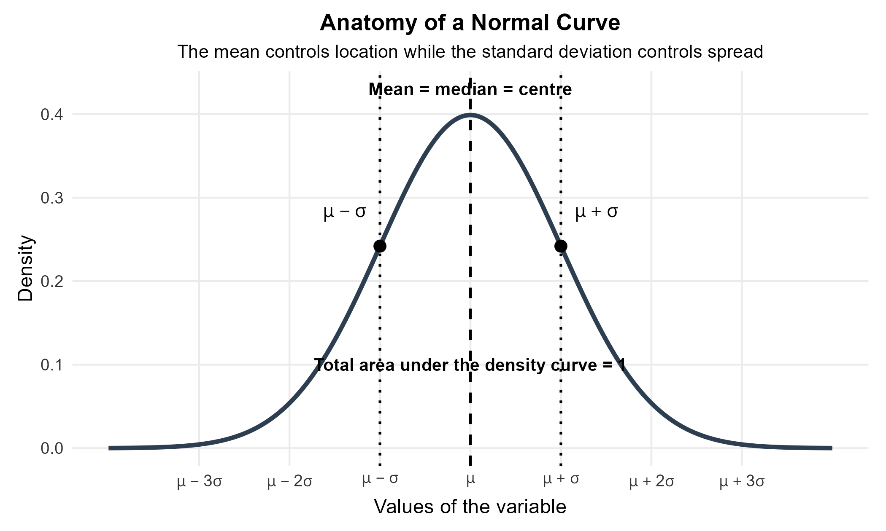

Several geometric features are important. A Normal curve is symmetric around $\mu$, so its mean and median are equal. The total area under the curve is 1, which allows area to represent probability. The two tails approach the horizontal axis without reaching it. The points one standard deviation below and above the mean are also the inflection points of the curve.

The shape of a Normal curve is therefore completely determined once $\mu$ and $\sigma$ are known. A change in $\mu$ moves the curve along the horizontal axis. A change in $\sigma$ changes how widely the probability is spread around the mean.

#### Location and Spread

The mean $\mu$ moves the Normal curve left or right without changing its general bell shape. A larger mean places the centre farther to the right while a smaller mean places the centre farther to the left.

The standard deviation $\sigma$ changes the width of the curve. A larger standard deviation produces a wider distribution because observations are more dispersed around the mean. A smaller standard deviation produces a narrower distribution because observations are more concentrated near the mean.

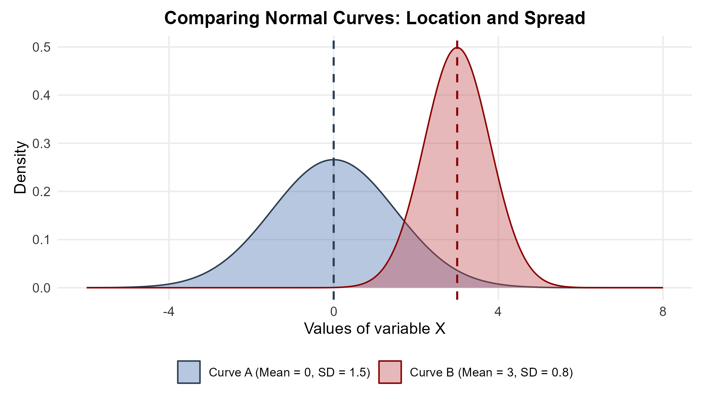

**Why is Curve B taller?**

The total area under every density curve must equal 1. Curve A has the larger standard deviation, so the same total area is spread across a wider range of values. Its height must therefore decrease. Curve B has the smaller standard deviation, so the area is concentrated over a narrower range. Its peak is therefore higher.

This relationship between width and height is a consequence of the area requirement. A taller Normal curve does not represent more probability than a shorter Normal curve because both curves have total area 1.

### Inflection Points and the Standard Deviation

The standard deviation also has a geometric interpretation on a Normal curve. An **inflection point** is a point where the direction of curvature changes. For every Normal curve, the two inflection points occur exactly one standard deviation from the mean.

$$
\mu-\sigma
$$

$$
\mu+\sigma
$$

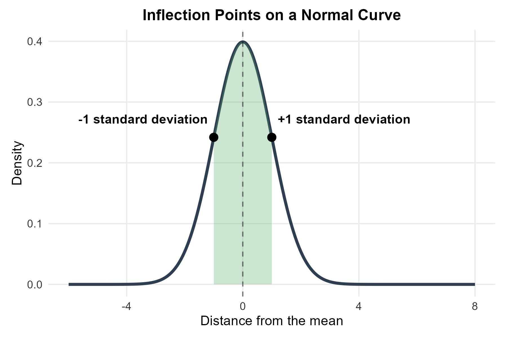

Near the centre, the curve bends downward as it moves away from the peak. Farther into either tail, the curve begins bending upward as it approaches the horizontal axis. The transition between those two types of curvature occurs at $\mu-\sigma$ and $\mu+\sigma$.

> **Important**
>
> The relationship between the inflection points and the standard deviation is a special property of the Normal family. The same visual rule should not be applied to an arbitrary distribution.

### Why Normal Distributions Matter

Normal distributions are useful for several connected reasons. Many continuous measurements can be approximated by a Normal model within an appropriately defined population. Repeated measurement error and the combined effect of many small sources of variation can also lead to approximately Normal patterns. Later in the course, Normal distributions will support statistical inference because many sampling distributions become approximately Normal under suitable conditions.

A Normal model also provides a common scale for comparing observations. Once an observation is expressed in standard-deviation units, its relative position can be compared with observations measured in completely different units. This idea leads directly to z-scores later in the chapter.

> **The model should be checked before it is used**
>
> Many life-science variables are not approximately Normal. Body mass, survival time, waiting time and infection counts can be skewed or otherwise non-Normal. A histogram or density plot should be examined before a Normal model is used as a description of observed data.

The geometry of a Normal model gives us our first practical probability tool. If a distribution is approximately Normal, the 68–95–99.7 rule provides quick estimates of how much probability lies near the mean.

---

## The 68–95–99.7 Rule

Every Normal distribution has the same approximate area pattern when distances are measured in standard-deviation units. Approximately 68% of the distribution lies within one standard deviation of the mean. Approximately 95% lies within two standard deviations. Approximately 99.7% lies within three standard deviations.

In probability notation, these statements are written as follows.

$$
P(\mu-\sigma<X<\mu+\sigma)\approx 0.68
$$

$$
P(\mu-2\sigma<X<\mu+2\sigma)\approx 0.95
$$

$$
P(\mu-3\sigma<X<\mu+3\sigma)\approx 0.997
$$

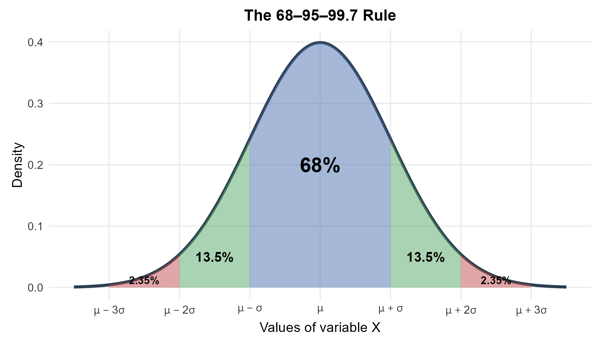

The symmetry of the Normal curve lets us infer several additional areas. The middle 68% leaves approximately 32% outside the interval from $\mu-\sigma$ to $\mu+\sigma$. Symmetry divides that remaining area equally, so approximately 16% lies in each tail beyond one standard deviation. Similarly, the middle 95% leaves approximately 5% outside two standard deviations, so approximately 2.5% lies in each tail beyond two standard deviations.

The 68–95–99.7 rule is an approximation. It is especially useful when a question asks for a quick estimate or when a boundary is exactly one, two or three standard deviations from the mean. Later sections use `pnorm()` or a Standard Normal table when a more precise probability is required.

**Example 11.1: Heights of Young Women**

**Question**

A model for the heights of young women aged 18 to 24 is approximately Normal with mean 64.5 inches and standard deviation 2.5 inches. What interval contains approximately the middle 95% of heights? What proportion lies above the upper end of that interval?

**Explanation**

The 68–95–99.7 rule states that approximately 95% of a Normal distribution lies within two standard deviations of the mean. The lower boundary is therefore two standard deviations below the mean while the upper boundary is two standard deviations above the mean. The remaining 5% is divided equally between the two tails because the Normal curve is symmetric.

**Solution**

The lower boundary is found with the following calculation.

$$
64.5-2(2.5)=59.5\text{ inches}
$$

The upper boundary is found with the following calculation.

$$
64.5+2(2.5)=69.5\text{ inches}
$$

Approximately 95% of heights lie between 59.5 inches and 69.5 inches under this model. Approximately 5% lies outside this interval. The upper tail therefore contains approximately

$$
\frac{0.05}{2}=0.025
$$

Under the Normal model, approximately 2.5% of young women are taller than 69.5 inches.

**Example 11.2: Adding Areas Together**

**Question**

The same height model has mean 64.5 inches and standard deviation 2.5 inches. What is the approximate probability that a randomly selected young woman is taller than 62 inches?

**Explanation**

A height of 62 inches is exactly one standard deviation below the mean because $64.5-2.5=62$. The desired probability is the entire area to the right of that point. The middle region from one standard deviation below the mean to one standard deviation above the mean contains approximately 68%. The upper tail beyond one standard deviation above the mean contains approximately 16%. These two regions do not overlap, so their probabilities can be added.

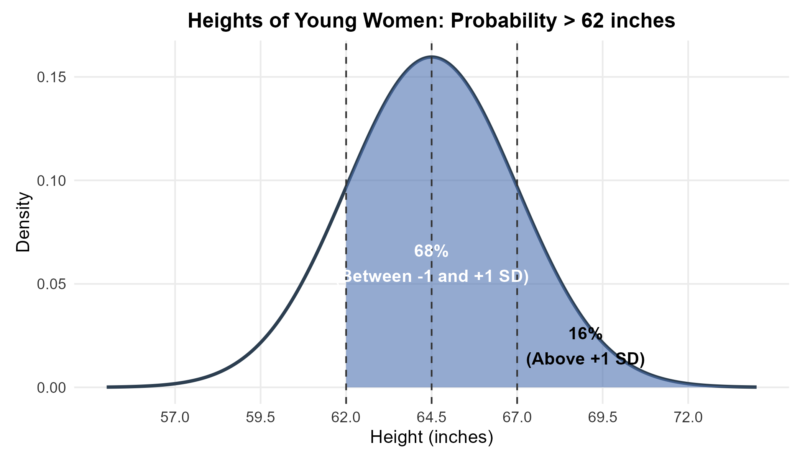

**Solution**

The approximate probability is found by adding the two non-overlapping areas.

$$
0.68+0.16=0.84
$$

The empirical-rule estimate is therefore 0.84. Under the stated Normal model, about 84% of young women are taller than 62 inches. The exact Normal probability is slightly different because the 68–95–99.7 rule uses rounded percentages.

### Notation for a Normal Distribution

These notes use the following notation for a Normal distribution.

$$
X\sim N(\mu,\sigma)
$$

The first parameter is the mean. The second parameter is the standard deviation. For the height model, the notation takes the following form.

$$
X\sim N(64.5,2.5)
$$

> **Notation conventions can differ**
>
> Some books and software use the variance $\sigma^2$ as the second parameter of a Normal distribution. In these notes, the second parameter in $N(\mu,\sigma)$ always represents the standard deviation.

### A Normal Distribution Is an Approximation

The 68–95–99.7 rule describes the geometry of an exactly Normal distribution. Real measurements are rarely mathematically perfect. Values may be rounded, populations may contain subgroups and distributions may contain mild skewness or unusual observations.

A Normal distribution remains useful when it provides a reasonable approximation to the main pattern in the data. The quality of that approximation matters because every probability calculation in the rest of the chapter assumes that the chosen Normal model is appropriate.

The next step is to place every Normal distribution onto one common measurement scale. Standardization makes that possible.

---

## The Standard Normal Distribution

### Standardizing and Z-Scores

Raw measurements can use very different units. Height may be measured in inches, concentration may be measured in molarity and wavelength may be measured in nanometres. A direct numerical comparison between those measurements is not meaningful because the units and typical amounts of variation are different.

Standardization replaces the original units with standard-deviation units. The resulting number is called a **z-score**. For an observation $x$ from a distribution with mean $\mu$ and standard deviation $\sigma$, the z-score is

$$
z=\frac{x-\mu}{\sigma}
$$

A z-score describes both direction and distance. A positive z-score indicates that the observation lies above the mean. A negative z-score indicates that the observation lies below the mean. A z-score of zero indicates that the observation equals the mean. The absolute size of the z-score tells us how many standard deviations separate the observation from the mean.

**Example 11.3: Standardizing Women's Heights**

**Question**

The height model has mean 64.5 inches and standard deviation 2.5 inches. What are the z-scores for heights of 70 inches and 60 inches? What do those z-scores mean?

**Explanation**

The z-score measures signed distance from the mean in standard-deviation units. The mean is subtracted from the observation first. The difference is then divided by the standard deviation. A positive result represents a value above the mean while a negative result represents a value below the mean.

**Solution**

For a height of 70 inches, the standardized value is shown below.

$$
z=\frac{70-64.5}{2.5}=2.2
$$

A height of 70 inches is 2.2 standard deviations above the mean.

For a height of 60 inches, the standardized value is shown below.

$$
z=\frac{60-64.5}{2.5}=-1.8
$$

A height of 60 inches is 1.8 standard deviations below the mean.

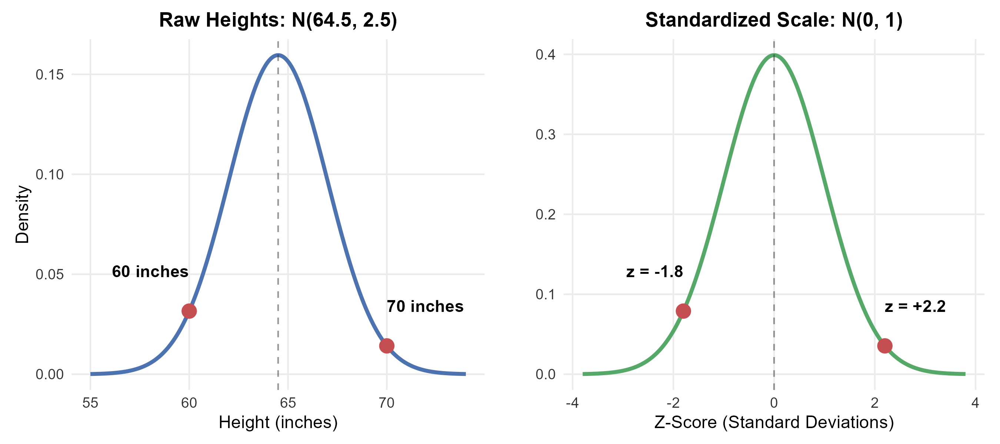

### Why Standardize

Standardization creates a common scale. This common scale allows relative positions to be compared even when the original variables have different units or different standard deviations.

A paediatric growth assessment provides one example. A child's height can be compared with an age-specific reference distribution while the child's weight can be compared with a different age-specific reference distribution. The two raw measurements use different units, but their standardized scores describe relative positions in standard-deviation units.

A z-score does not by itself indicate whether an observation is desirable or undesirable. It only describes the location of the observation relative to a specified reference distribution. Scientific or practical interpretation still requires context.

### The Standard Normal Distribution

A Normally distributed random variable remains Normal after standardization. The standardized distribution has mean 0 and standard deviation 1. This special distribution is called the **standard Normal distribution**.

$$
Z\sim N(0,1)
$$

The original variable can be written in the following Normal form.

$$
X\sim N(\mu,\sigma)
$$

The corresponding standardized variable then has the standard Normal form.

$$
Z=\frac{X-\mu}{\sigma}\sim N(0,1)
$$

> **Standardization does not make non-Normal data Normal**
>
> Subtracting the mean and dividing by the standard deviation changes the centre and scale. It does not change the underlying shape. A strongly skewed distribution remains strongly skewed after standardization.

The standard Normal distribution connects the approximate 68–95–99.7 rule with the more precise probability methods introduced later. Before moving to exact calculations, several applications show how z-scores and the empirical rule can already answer useful questions.

### Applications of Z-Scores and the 68–95–99.7 Rule

#### Assessing Patient Health

**Question**

A reference model for hemoglobin levels in healthy adult males is approximately Normal with mean 15.0 g/dL and standard deviation 1.0 g/dL. A patient's measured level is 13.0 g/dL. What is the z-score? Using the 68–95–99.7 rule, approximately what percentage of the reference population has a lower value?

**Explanation**

The z-score shows how far 13.0 g/dL lies below the reference mean. A z-score of $-2$ places the observation two standard deviations below the mean. The empirical rule places approximately 95% of the distribution between $-2$ and $+2$ standard deviations. The remaining 5% is split equally between the two tails.

**Solution**

The z-score is calculated as follows.

$$
z=\frac{13.0-15.0}{1.0}=-2.0
$$

The lower-tail estimate is calculated as follows.

$$
\frac{5\%}{2}=2.5\%
$$

Approximately 2.5% of the reference population lies below 13.0 g/dL according to the empirical rule. The exact Normal probability at $z=-2$ is slightly smaller. A clinical interpretation would require appropriate medical context rather than the z-score alone.

#### Quality Control of Solutions

**Question**

A chemical manufacturing process produces saline concentrations that are approximately Normal with mean 0.900 M and standard deviation 0.005 M. A tested vat has concentration 0.912 M. What is its z-score? Does the value appear unusual relative to the process model?

**Explanation**

The z-score compares the observed concentration with the process mean in standard-deviation units. The empirical rule places approximately 95% of a Normal distribution within two standard deviations of the mean. A value beyond that region is relatively unusual under the model, although an unusual value is not automatically an error.

**Solution**

The z-score is calculated as follows.

$$
z=\frac{0.912-0.900}{0.005}=2.4
$$

The vat is 2.4 standard deviations above the process mean. Its value lies outside the approximate middle 95% region, so a closer examination of the process or instrument calibration would be reasonable.

#### Comparing Different Scales

**Question**

A student's SAT score is 1250 from a reference distribution with mean 1050 and standard deviation 100. The same student's ACT score is 28 from a reference distribution with mean 21 and standard deviation 5. Under these illustrative models, which result represents the higher relative position within its own reference distribution?

**Explanation**

The raw scores cannot be compared directly because the tests use different numerical scales. Standardization expresses both results as distances from their respective means. The larger z-score represents the higher relative position under the stated reference models.

**Solution**

For the SAT score, the standardized value is shown below.

$$
z=\frac{1250-1050}{100}=2.0
$$

For the ACT score, the standardized value is shown below.

$$
z=\frac{28-21}{5}=1.4
$$

The SAT result is 2 standard deviations above its reference mean while the ACT result is 1.4 standard deviations above its reference mean. Under the assumptions of this example, the SAT result has the higher relative standing.

#### Setting a Review Threshold for Claims

**Question**

Minor auto-repair claims are modelled as approximately Normal with mean 1500 dollars and standard deviation 200 dollars. A review system is intended to flag approximately the highest 2.5% of claims. What approximate dollar threshold does the 68–95–99.7 rule suggest?

**Explanation**

The empirical rule places approximately 95% of observations within two standard deviations of the mean. The remaining 5% is split equally between the lower and upper tails. The upper 2.5% therefore begins approximately two standard deviations above the mean. This boundary is an empirical-rule approximation rather than the exact 97.5th percentile.

**Solution**

The approximate boundary corresponds to $z=2$. The raw claim value follows from the unstandardizing relationship shown below.

$$
x=\mu+z\sigma
$$

The resulting value is shown below.

$$
x=1500+2(200)=1900
$$

A threshold of about 1900 dollars corresponds to the approximate upper 2.5% boundary. A claim above this threshold would be selected for review. The statistical flag alone does not establish fraud.

#### Laser Manufacturing Tolerances

**Question**

A laboratory manufactures lasers with wavelengths that are approximately Normal with mean 650 nm and standard deviation 2 nm. A sensor operates safely between 644 nm and 656 nm. What are the z-scores of the two limits? Approximately what percentage of lasers fall inside this range?

**Explanation**

The lower and upper physical limits are equally far from the mean. Standardizing both boundaries shows where the operating interval falls on the empirical-rule diagram.

**Solution**

The lower limit has the following z-score.

$$
z=\frac{644-650}{2}=-3
$$

The upper limit has the following z-score.

$$
z=\frac{656-650}{2}=3
$$

The operating range extends from three standard deviations below the mean to three standard deviations above the mean. The 68–95–99.7 rule therefore gives an approximate in-range proportion of 99.7%.

#### Bone Mineral Density and T-Scores

Bone mineral density measurements are often converted to a **T-score**. A T-score expresses a person's bone mineral density in standard-deviation units relative to a young-adult reference population. The score is therefore similar in interpretation to a z-score, although the reference population used for a T-score is specific to bone-density assessment.

The commonly used diagnostic categories place a T-score of $-1$ or higher in the normal range, a T-score between $-1$ and $-2.5$ in the low-bone-mass range and a T-score of $-2.5$ or lower in the osteoporosis range. These values are classification thresholds. They do not imply that the distribution of T-scores in every patient population is the standard Normal distribution.

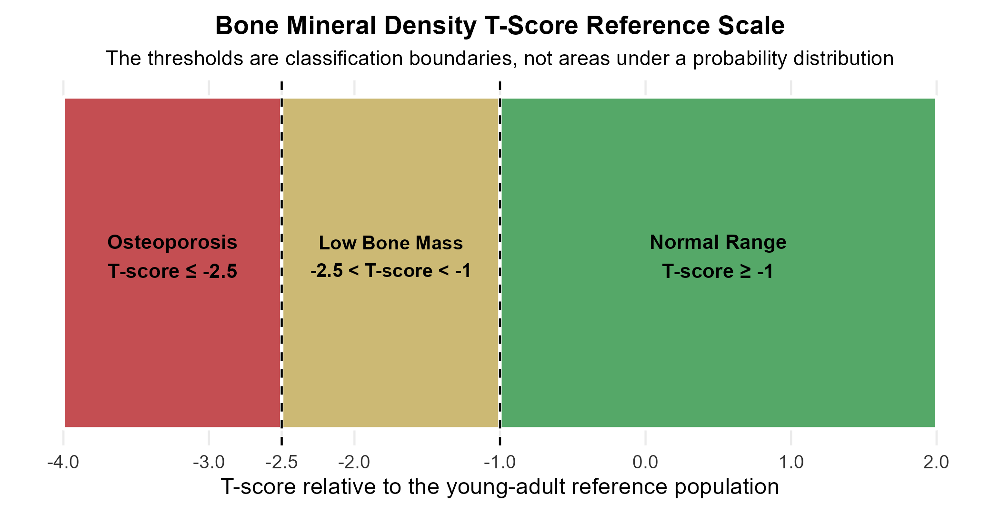

A value such as $-2.5$ indicates that the measured bone mineral density is 2.5 reference standard deviations below the young-adult reference mean. The practical meaning of that score comes from the medical classification system rather than from assuming that all patient T-scores follow $N(0,1)$.

This distinction is important because standardization provides a scale. Standardization does not automatically provide a probability model for the population being studied.

#### Setting a Warranty Threshold

**Question**

A refrigerator compressor lifespan is modelled as approximately Normal with mean 5.0 years and standard deviation 1.2 years. A company wants a warranty period for which approximately 16% of compressors would fail before the warranty ends. What warranty length does the 68–95–99.7 rule suggest?

**Explanation**

The empirical rule places approximately 68% of a Normal distribution within one standard deviation of the mean. Approximately 32% remains outside that interval. Symmetry places approximately 16% in the lower tail and approximately 16% in the upper tail. The boundary for the lower 16% is therefore approximately one standard deviation below the mean.

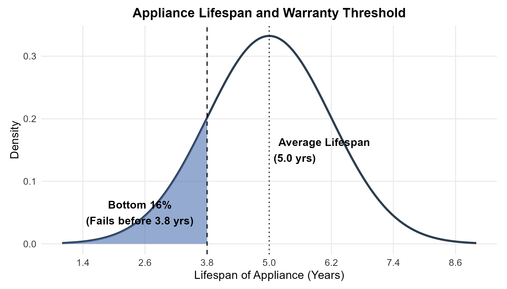

**Solution**

The approximate warranty boundary is calculated as follows.

$$
5.0-1.2=3.8\text{ years}
$$

A warranty length of about 3.8 years corresponds to the lower-tail approximation from the 68–95–99.7 rule. The exact Normal lower-tail probability at one standard deviation below the mean is about 15.9%, which is close to the 16% empirical-rule estimate.

The examples so far have used geometry and the empirical rule. Many useful probability questions involve boundaries that are not exactly one, two or three standard deviations from the mean. Those questions require a more precise method.

---

## Finding Normal Probabilities

Areas under a Normal density curve represent proportions of the distribution. They can therefore be interpreted as probabilities for a randomly selected observation from the model.

For a continuous random variable, a single exact value has probability zero. This property means that strict and non-strict inequalities give the same probability.

$$
P(X<x)=P(X\le x)
$$

The same principle applies to right-tail and interval probabilities. A boundary point does not contribute any area by itself.

R calculates Normal probabilities with the `pnorm()` function. The function returns the cumulative area to the left of a specified value. For a Normal variable $X$, `pnorm(q, mean, sd)` gives the model probability that $X$ is at or below `q`.

A cumulative probability is therefore a left-tail area. Right-tail probabilities can be found with the complement rule while middle areas can be found by subtracting two cumulative probabilities.

**Example 11.4: Defining Osteoporosis as a Left-Tail Probability**

**Question**

An illustrative model assumes that T-scores for a particular older population are approximately Normal with mean $-2$ and standard deviation 1. What proportion of this model lies at or below the osteoporosis threshold of $-2.5$?

**Explanation**

The threshold is a single boundary and the desired region lies to its left. This is exactly the type of cumulative probability returned by `pnorm()`. The Normal model used here is an instructional model for practising probability calculations. The medical threshold itself does not imply that real T-scores for all older adults follow this particular Normal distribution.

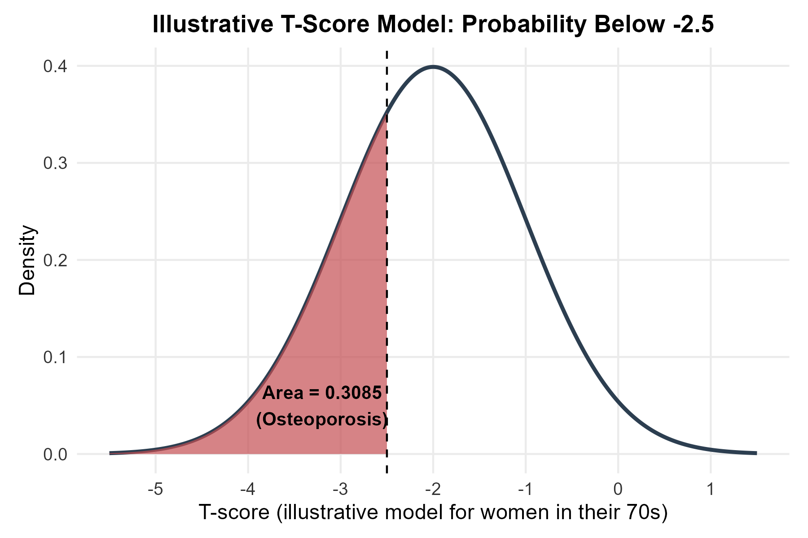

**Solution**

```{r pnorm_left}
# Probability of a T-score at or below -2.5 under the illustrative model
p_osteoporosis <- pnorm(q = -2.5, mean = -2, sd = 1)
print(p_osteoporosis)
```

The result is approximately 0.3085. Under this illustrative model, about 30.85% of the distribution lies at or below $-2.5$.

The complement gives the proportion above that threshold.

$$
1-0.3085=0.6915
$$

Approximately 69.15% of the distribution lies above the threshold under this model.

**Osteopenia: An Interval Probability**

**Question**

The same illustrative T-score model has mean $-2$ and standard deviation 1. What proportion of the model lies between $-2.5$ and $-1$?

**Explanation**

The desired region lies between two boundaries. The `pnorm()` function gives cumulative area to the left, so the interval probability can be obtained by subtracting the cumulative area to the left of the lower boundary from the cumulative area to the left of the upper boundary.

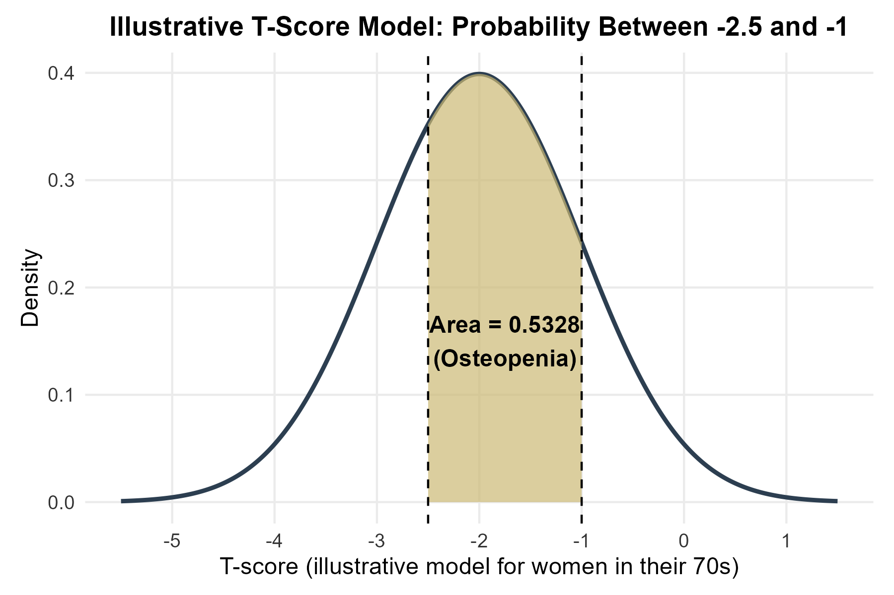

**Solution**

The interval probability can be written in the following form.

$$
P(-2.5<X<-1)=P(X<-1)-P(X<-2.5)
$$

The cumulative area to the left of $-1$ is approximately 0.8413. The cumulative area to the left of $-2.5$ is approximately 0.3085. Their difference is

$$
0.8413-0.3085=0.5328
$$

The same calculation can be completed in R with the following code.

```{r pnorm_center}
# Interval probability from -2.5 to -1 under the illustrative model
p_osteopenia <- pnorm(q = -1, mean = -2, sd = 1) -
  pnorm(q = -2.5, mean = -2, sd = 1)
print(p_osteopenia)
```

Under this model, approximately 53.28% of T-scores lie between $-2.5$ and $-1$.

The first two probability examples start with one or more raw values and find an area. Percentile problems reverse that direction. They start with an area and ask for the raw value that creates the requested boundary.

---

## Finding Percentiles with R

A **percentile** is a boundary with a specified proportion of the distribution below it. For a continuous distribution, the $p$th percentile is the value that has proportion $p$ of the distribution to its left.

The R functions `pnorm()` and `qnorm()` solve opposite types of problems. The `pnorm()` function starts with a raw value and returns a cumulative probability. The `qnorm()` function starts with a cumulative probability and returns the corresponding raw value.

This distinction is useful because many probability questions can be classified before any calculation begins. A value-to-probability question calls for `pnorm()`. A probability-to-value question calls for `qnorm()`.

**Example 11.6: The Third Quartile of Hatching Weights**

**Question**

Commercial chicken hatching weights are modelled as approximately Normal with mean 45 g and standard deviation 4 g. What is the third quartile of the distribution?

**Explanation**

The third quartile $Q_3$ is the 75th percentile. The required boundary therefore has 75% of the distribution below it. Because the problem starts with a probability and asks for a value, `qnorm()` is the appropriate function.

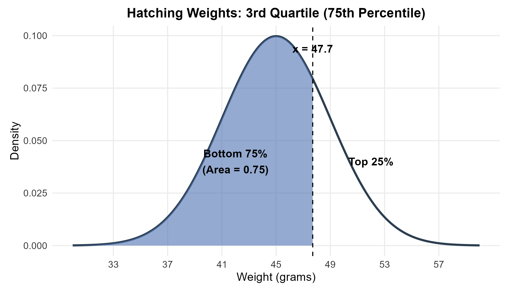

**Solution**

```{r qnorm_q3}
# The 75th percentile of the hatching-weight model
q3_weight <- qnorm(p = 0.75, mean = 45, sd = 4)
print(q3_weight)
```

The result is approximately 47.7 g. Under this model, about 75% of hatching weights lie below 47.7 g while about 25% lie above it.

**Example 11.7: The Longest 10% of Pregnancy Lengths**

**Question**

Pregnancy lengths from conception to birth are modelled as approximately Normal with mean 266 days and standard deviation 16 days. What pregnancy length marks the beginning of the longest 10%?

**Explanation**

The longest 10% occupies the upper 10% of the distribution. The `qnorm()` function uses cumulative area to the left. A boundary with 10% above it must therefore have 90% below it. The required value is the 90th percentile.

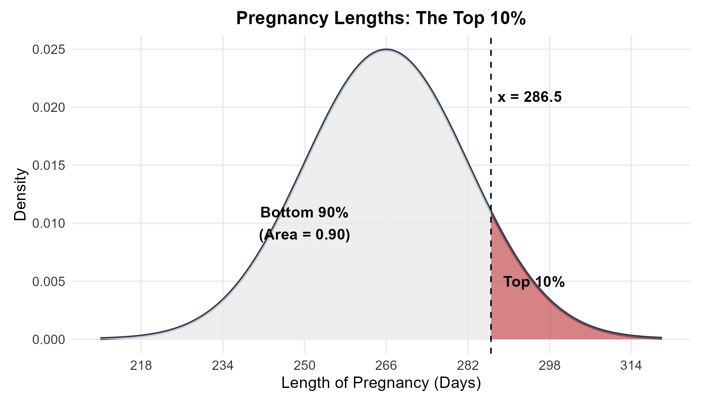

**Solution**

```{r pregnancy_top10}
# The 90th percentile leaves 10% of the model above the boundary
pregnancy_90 <- qnorm(p = 0.90, mean = 266, sd = 16)
print(pregnancy_90)
```

The result is approximately 286.5 days. The continuous-model boundary is therefore about 286.5 days. If pregnancy length is reported to the nearest whole day, values of about 287 days or longer fall in the upper 10% region.

> **The wording of the final answer should match the question**
>
> Example 11.6 asks for a single percentile value, so the answer is the boundary of approximately 47.7 g. Example 11.7 asks which pregnancy lengths occupy an upper region, so the interpretation describes values at or beyond the boundary.

Software is convenient, but the probability reasoning does not depend on software. The Standard Normal table provides another way to find the same kinds of probabilities after values have been converted to z-scores.

---

## Using the Standard Normal Table

The Standard Normal table reports cumulative probabilities for the standard Normal distribution.

$$
Z\sim N(0,1)
$$

The [Standard Normal Z-Table](z_table.pdf) used in these notes gives the area to the **left** of a specified z-score. This is the same type of cumulative area returned by `pnorm()`.

### Reading the Z-Table

**Question**

What proportion of a standard Normal distribution lies below $z=1.47$?

**Explanation**

A z-score with two decimal places is located by combining a row and a column. The left-hand column contains the ones and tenths digits. The top row contains the hundredths digit. The value $z=1.47$ therefore uses row 1.4 and column 0.07.

**Solution**

The table entry at row 1.4 and column 0.07 is 0.9292. The probability statement is shown below.

$$
P(Z<1.47)=0.9292
$$

Approximately 92.92% of the standard Normal distribution lies below $z=1.47$.

### A Three-Step Process for Normal Probabilities

A consistent method makes Z-Table questions easier to organize. The first step is a statement of the probability in the original units together with a sketch of the desired region. The second step is the conversion of each raw boundary to a z-score. The third step is the use of cumulative left-tail probabilities from the Z-Table, followed by subtraction or the complement rule when the desired region is not a simple left tail.

This process separates the statistical reasoning from the table lookup. The sketch identifies the desired area before any arithmetic begins, which helps prevent mistakes with left tails, right tails and intervals.

**Example 11.9: Heights of Young Women**

**Question**

Young women's heights are modelled as approximately Normal with mean 64.5 inches and standard deviation 2.5 inches. What is the probability that a randomly selected young woman measures between 60 and 68 inches?

**Explanation**

The Standard Normal table works with z-scores rather than raw heights. Both boundaries must therefore be standardized. The desired interval probability equals the cumulative area to the left of the upper z-score minus the cumulative area to the left of the lower z-score.

**Solution**

The lower boundary becomes the following z-score.

$$
z_1=\frac{60-64.5}{2.5}=-1.8
$$

The upper boundary becomes the following z-score.

$$
z_2=\frac{68-64.5}{2.5}=1.4
$$

The Z-Table gives 0.9192 as the area to the left of 1.4 and 0.0359 as the area to the left of $-1.8$. Their difference gives the desired probability.

$$
0.9192-0.0359=0.8833
$$

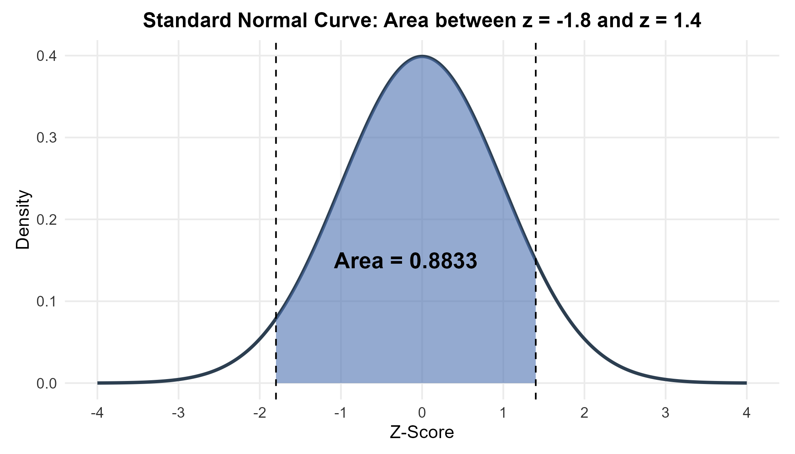

Approximately 88.33% of young women fall between 60 and 68 inches under this model.

The same probability can be checked directly in R.

```{r check_height_interval}
# Probability that height lies between 60 and 68 inches
p_height_interval <- pnorm(68, mean = 64.5, sd = 2.5) -
  pnorm(60, mean = 64.5, sd = 2.5)
print(p_height_interval)
```

Both methods calculate the same area under the Normal curve. Small differences can occur only when a printed Z-Table requires rounded z-scores.

### Finding Percentiles with the Z-Table

The Z-Table can also be used in reverse. A percentile problem starts with a cumulative area. The closest probability is located in the body of the table, which identifies the corresponding z-score. The z-score is then converted back to the original measurement scale.

The conversion back to the original scale comes from rearranging the z-score formula.

$$
x=\mu+z\sigma
$$

This formula is sometimes called the **unstandardizing formula** because it converts a z-score back to the original units.

**Example 11.10: The Longest Pregnancies Using the Z-Table**

This example returns to the pregnancy question from Example 11.7 so that the same problem can be solved without `qnorm()`.

**Question**

Pregnancy lengths are modelled as approximately Normal with mean 266 days and standard deviation 16 days. What boundary marks the longest 10% of pregnancies?

**Explanation**

The upper 10% begins at the 90th percentile, so the cumulative area to the left is 0.9000. The closest probability in the Standard Normal table is 0.8997, which corresponds to approximately $z=1.28$. The final step converts this standardized boundary back to days.

**Solution**

The raw boundary is calculated from the unstandardizing formula.

$$
x=266+(1.28)(16)
$$

The resulting value is shown below.

$$
x=286.48\text{ days}
$$

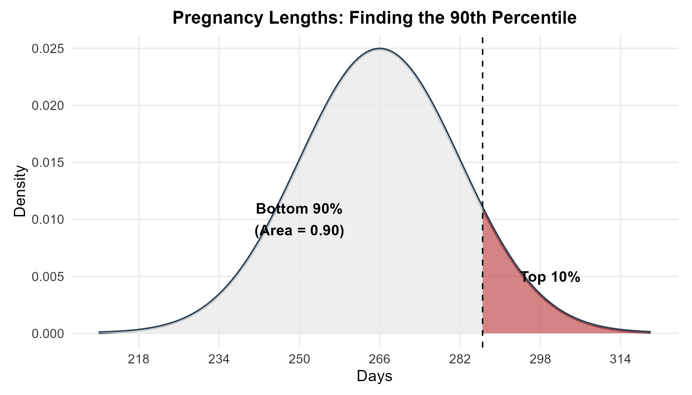

The table method gives a boundary of approximately 286.5 days. With whole-day reporting, this corresponds to about 287 days or longer. The small difference between the table result and the `qnorm()` result comes from rounding the z-score to the precision available in the printed table.

---

## Chapter Summary

### Core Ideas

A Normal distribution is a symmetric, single-peaked density model whose location is controlled by the mean $\mu$ and whose spread is controlled by the standard deviation $\sigma$. The total area under the curve is 1, so areas under the curve can be interpreted as probabilities. The inflection points occur one standard deviation on either side of the mean.

The 68–95–99.7 rule gives quick approximate probabilities for regions within one, two or three standard deviations of the mean. A z-score expresses an observation's distance from the mean in standard-deviation units. Standardizing a Normal random variable produces the standard Normal distribution with mean 0 and standard deviation 1.

Exact Normal probabilities can be calculated with `pnorm()` when a boundary value is known. Percentile boundaries can be calculated with `qnorm()` when a cumulative probability is known. A Standard Normal table provides cumulative left-tail probabilities for z-scores when software is unavailable.

A Normal model should always be treated as a model rather than an automatic description of real data. The shape of the observed data should support the use of a Normal approximation before Normal probabilities are interpreted in context.

### A Consistent Problem-Solving Process

A Normal-distribution problem becomes easier when the question is translated into a picture before a formula is selected. The mean and standard deviation identify the model. The wording of the question identifies whether the desired quantity is an area or a boundary. A sketch shows whether the region is a left tail, a right tail or an interval.

The 68–95–99.7 rule is appropriate when an approximate answer is sufficient and the boundaries align naturally with one, two or three standard deviations. A z-score is useful when relative position is the focus or when a Standard Normal table will be used. The `pnorm()` function is appropriate for value-to-probability questions while `qnorm()` is appropriate for probability-to-value questions.

The final numerical result should always be interpreted in the original units and context. The central goal of the chapter is therefore not the memorization of isolated formulas. The goal is to connect the **shape of the Normal curve**, the **area under the curve**, the **standardized scale** and the **meaning of probability** within one coherent framework.
