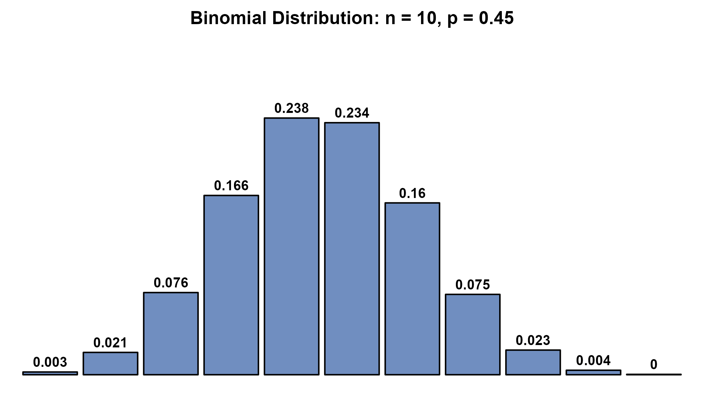
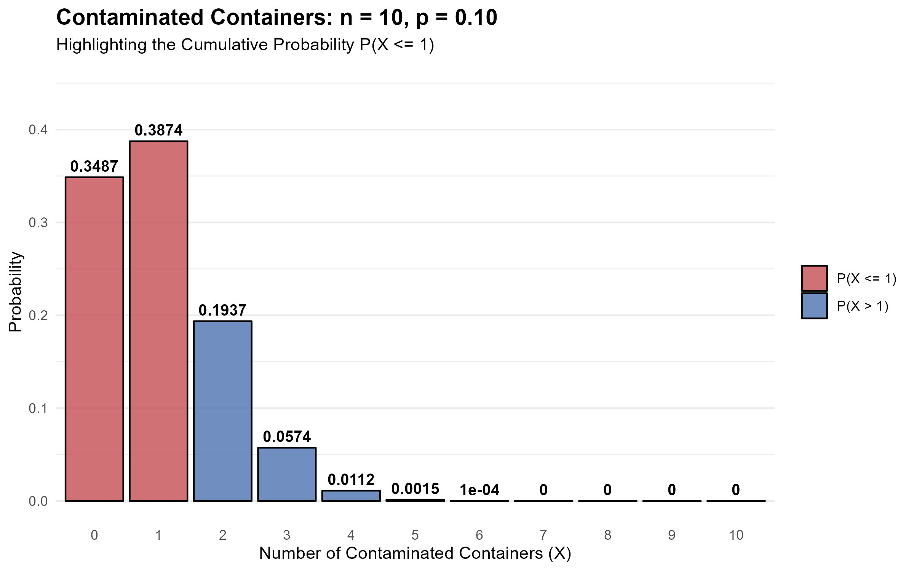
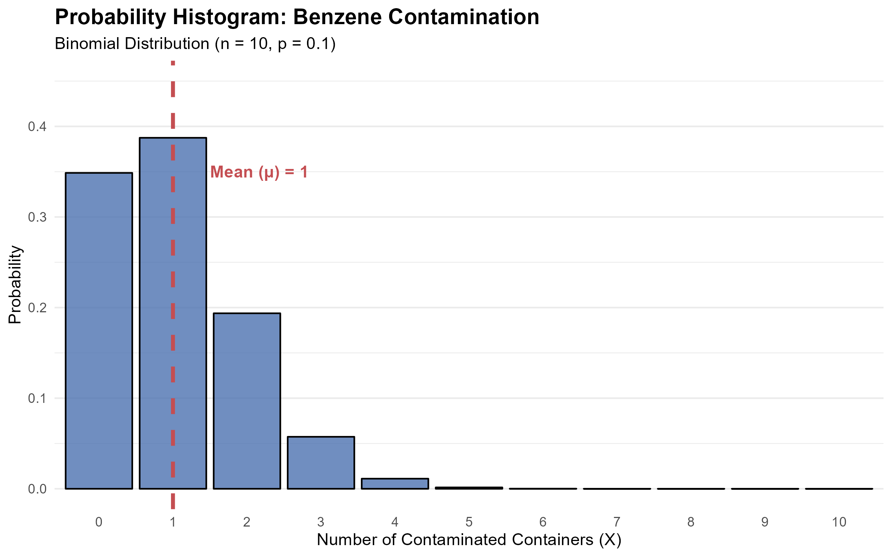
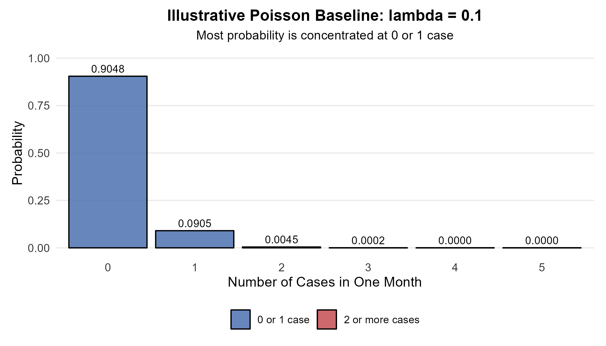

<style>
/* ============================================================
   CHAPTER 12 — PAGE + COLLAPSIBLE TABLE OF CONTENTS
   ============================================================ */

:root {
  --toc-width: 300px;
  --toc-collapsed-gutter: 72px;
  --chapter-width: 1100px;

  --ink: #23364a;
  --accent: #2c3e50;
  --line: #d8dee4;
  --soft: #f6f8fa;
  --toc-background: #f7f9fb;
}


/* ============================================================
   GENERAL PAGE
   ============================================================ */

html {
  scroll-behavior: smooth;
}

body {
  font-size: 17px;
  line-height: 1.65;
  color: var(--ink);
}

.main-container {
  max-width: var(--chapter-width) !important;
}


/* ============================================================
   HIDE DUMMY CHAPTER CONTENT
   ============================================================ */

/*
   Chapter 12 is the visible chapter heading; Pandoc applies a section-number offset of 11 so that its subsections begin at 12.1.

   Hide the visible "Chapter 12" H1 because the document title
   already says Chapter 12, but KEEP the section itself so that
   H2 headings are numbered 12.1, 12.2, 12.3, ...
*/
.section.chapter-root > h1 {
  display: none !important;
}


/* ============================================================
   HIDE EARLIER DUMMY CHAPTERS FROM THE TABLE OF CONTENTS
   ============================================================ */

/*
   R Markdown/tocify does not reliably expose the chapter names
   through data-unique, so select them through their generated
   href values instead.
*/

#TOC li:has(a[href="#chapter-1-dummy"]),
#TOC li:has(a[href="#chapter-2-dummy"]),
#TOC li:has(a[href="#chapter-3-dummy"]),
#TOC li:has(a[href="#chapter-4-dummy"]),
#TOC li:has(a[href="#chapter-5-dummy"]),
#TOC li:has(a[href="#chapter-6-dummy"]),
#TOC li:has(a[href="#chapter-7-dummy"]),
#TOC li:has(a[href="#chapter-8-dummy"]),
#TOC li:has(a[href="#chapter-9-dummy"]),
#TOC li:has(a[href="#chapter-10-dummy"]),
#TOC li:has(a[href="#chapter-11-dummy"]) {
  display: none !important;
}


/*
   Also hide the Chapter 12 parent entry itself.

   Its children — 12.1, 12.2, 12.3, ... — remain visible.
*/
#TOC li:has(> a[href="#chapter-12"]) > a[href="#chapter-12"] {
  display: none !important;
}


/*
   tocify may place the Chapter 12 subsections inside the same
   list item. Remove spacing belonging to the hidden parent.
*/
#TOC li:has(> a[href="#chapter-12"]) {
  margin-top: 0 !important;
}


/* ============================================================
   ACCESSIBILITY
   ============================================================ */

.sr-only {
  position: absolute;
  width: 1px;
  height: 1px;
  padding: 0;
  margin: -1px;
  overflow: hidden;
  clip: rect(0, 0, 0, 0);
  white-space: nowrap;
  border: 0;
}


/* ============================================================
   SIDEBAR TOGGLE BUTTON
   ============================================================ */

#toc-toggle {
  position: fixed;

  top: 16px;
  left: calc(var(--toc-width) + 14px);

  width: 42px;
  height: 42px;

  display: flex;
  align-items: center;
  justify-content: center;

  padding: 0;

  border: 1px solid #c7d0d9;
  border-radius: 8px;

  background: #ffffff;
  color: var(--ink);

  box-shadow: 0 2px 8px rgba(24, 39, 55, 0.13);

  cursor: pointer;

  font-size: 24px;
  line-height: 1;

  z-index: 1200;

  transition:
    left 0.25s ease,
    background-color 0.2s ease,
    box-shadow 0.2s ease,
    transform 0.2s ease;
}

#toc-toggle:hover {
  background: #eef3f7;
  box-shadow: 0 3px 10px rgba(24, 39, 55, 0.18);
}

#toc-toggle:focus-visible {
  outline: 3px solid rgba(44, 62, 80, 0.28);
  outline-offset: 2px;
}


/* Open/close icons */

#toc-toggle .menu-icon {
  display: none;
}

#toc-toggle .close-icon {
  display: inline;
}


/* Button position when sidebar is collapsed */

body.toc-collapsed #toc-toggle {
  left: 14px;
}

body.toc-collapsed #toc-toggle .menu-icon {
  display: inline;
}

body.toc-collapsed #toc-toggle .close-icon {
  display: none;
}


/* ============================================================
   DESKTOP LAYOUT
   ============================================================ */

@media screen and (min-width: 992px) {

  /*
     Make room for fixed sidebar.
  */
  .main-container {
    width: 100% !important;
    max-width: none !important;

    padding-left: calc(var(--toc-width) + 30px) !important;
    padding-right: 35px !important;

    box-sizing: border-box !important;

    transition: padding-left 0.25s ease;
  }


  /*
     When sidebar is collapsed, reclaim almost all of the space.
  */
  body.toc-collapsed .main-container {
    padding-left: var(--toc-collapsed-gutter) !important;
  }


  /*
     Bootstrap normally reserves a column for the TOC.
     The TOC is fixed now, so remove that reserved column.
  */
  .main-container > .row-fluid > .col-xs-12.col-sm-4.col-md-3,
  .main-container > .row > .col-xs-12.col-sm-4.col-md-3 {
    width: 0 !important;
    min-height: 0 !important;
    padding: 0 !important;
    margin: 0 !important;
  }


  /* ----------------------------------------------------------
     FLOATING TOC
     ---------------------------------------------------------- */

  #TOC,
  #TOC.tocify {
    position: fixed !important;

    top: 0 !important;
    bottom: 0 !important;
    left: 0 !important;

    width: var(--toc-width) !important;
    max-height: 100vh !important;

    box-sizing: border-box !important;

    overflow-y: auto !important;
    overflow-x: hidden !important;

    margin: 0 !important;
    padding: 72px 16px 28px 18px !important;

    background: var(--toc-background) !important;

    border: 0 !important;
    border-right: 1px solid var(--line) !important;
    border-radius: 0 !important;

    box-shadow: none !important;

    z-index: 1100 !important;

    transform: translateX(0);

    transition: transform 0.25s ease;
  }


  /*
     Completely slide sidebar off screen when collapsed.
  */
  body.toc-collapsed #TOC,
  body.toc-collapsed #TOC.tocify {
    transform: translateX(calc(-1 * var(--toc-width)));
  }


  /*
     Allow long section headings to wrap rather than getting
     clipped.
  */
  #TOC a {
    white-space: normal !important;
    overflow-wrap: break-word !important;
    word-break: normal !important;
  }


  /* ----------------------------------------------------------
     TOC TYPOGRAPHY
     ---------------------------------------------------------- */

  #TOC .tocify-item {
    border-radius: 4px;
  }

  #TOC .tocify-item a {
    color: var(--ink);
    text-decoration: none;
  }

  #TOC .tocify-item:hover {
    background: #e9eef3;
  }

  #TOC .tocify-item.active {
    background: var(--accent) !important;
  }

  #TOC .tocify-item.active a {
    color: #ffffff !important;
  }


  /* ----------------------------------------------------------
     MAIN CHAPTER CONTENT
     ---------------------------------------------------------- */

  .toc-content,
  .toc-content.col-xs-12.col-sm-8.col-md-9 {
    width: 100% !important;
    max-width: var(--chapter-width) !important;

    float: none !important;

    margin-left: auto !important;
    margin-right: auto !important;

    padding-left: 15px !important;
    padding-right: 15px !important;

    box-sizing: border-box !important;
  }


  /*
     Fallback for Pandoc output that does not use Bootstrap's
     normal R Markdown container structure.
  */
  body.standalone-pandoc {
    width: calc(100% - var(--toc-width)) !important;
    max-width: none !important;

    box-sizing: border-box !important;

    margin: 0 0 0 var(--toc-width) !important;
    padding: 50px 45px !important;

    transition:
      width 0.25s ease,
      margin-left 0.25s ease,
      padding-left 0.25s ease;
  }

  body.standalone-pandoc.toc-collapsed {
    width: 100% !important;

    margin-left: 0 !important;
    padding-left: var(--toc-collapsed-gutter) !important;
  }

  body.standalone-pandoc > header,
  body.standalone-pandoc > section {
    max-width: var(--chapter-width);

    margin-left: auto;
    margin-right: auto;
  }
}


/* ============================================================
   MOBILE / TABLET
   ============================================================ */

@media screen and (max-width: 991px) {

  .main-container {
    width: auto !important;
    max-width: var(--chapter-width) !important;

    margin-left: auto !important;
    margin-right: auto !important;

    padding: 70px 18px 24px !important;

    box-sizing: border-box !important;
  }


  /*
     Toggle remains at upper-left on mobile.
  */
  #toc-toggle,
  body.toc-collapsed #toc-toggle {
    left: 12px;
  }


  /*
     Mobile starts with menu icon.
  */
  #toc-toggle .menu-icon,
  body.toc-collapsed #toc-toggle .menu-icon {
    display: inline;
  }

  #toc-toggle .close-icon,
  body.toc-collapsed #toc-toggle .close-icon {
    display: none;
  }


  /*
     Show X while the mobile TOC is open.
  */
  body.toc-mobile-open #toc-toggle .menu-icon {
    display: none;
  }

  body.toc-mobile-open #toc-toggle .close-icon {
    display: inline;
  }


  /* ----------------------------------------------------------
     MOBILE TOC DRAWER
     ---------------------------------------------------------- */

  #TOC,
  #TOC.tocify {
    position: fixed !important;

    top: 0 !important;
    bottom: 0 !important;
    left: 0 !important;

    width: min(84vw, 320px) !important;
    max-height: 100vh !important;

    box-sizing: border-box !important;

    overflow-y: auto !important;
    overflow-x: hidden !important;

    margin: 0 !important;
    padding: 72px 18px 28px !important;

    background: var(--toc-background) !important;

    border: 0 !important;
    border-right: 1px solid var(--line) !important;
    border-radius: 0 !important;

    z-index: 1100 !important;

    transform: translateX(-105%);

    transition: transform 0.25s ease;
  }

  body.toc-mobile-open #TOC,
  body.toc-mobile-open #TOC.tocify {
    transform: translateX(0);

    box-shadow: 6px 0 18px rgba(24, 39, 55, 0.16);
  }


  /*
     Prevent long headings from being clipped.
  */
  #TOC a {
    white-space: normal !important;
    overflow-wrap: break-word !important;
    word-break: normal !important;
  }


  body.standalone-pandoc {
    width: auto !important;
    max-width: var(--chapter-width) !important;

    margin: 0 auto !important;
    padding: 70px 18px 24px !important;

    box-sizing: border-box !important;
  }
}


/* ============================================================
   SECTION HEADINGS
   ============================================================ */

h1,
h2,
h3,
h4,
h5 {
  margin-top: 1.6em;
}

h2 {
  border-bottom: 3px solid var(--accent);
  padding-bottom: 0.25em;
}

h3 {
  border-bottom: 1px solid var(--line);
  padding-bottom: 0.2em;
}


/* ============================================================
   BLOCKQUOTES / DEFINITION BOXES
   ============================================================ */

blockquote {
  border-left: 4px solid var(--accent);

  background: #f7f9fa;

  padding: 0.7em 1em;
  margin-top: 1.2em;
  margin-bottom: 1.2em;
}


/* ============================================================
   TABLES
   ============================================================ */

table {
  width: 100%;

  margin: 1.35em auto;

  border-collapse: separate !important;
  border-spacing: 0;

  background: #ffffff;

  border: 1px solid #d6dde5;
  border-radius: 8px;

  overflow: hidden;

  box-shadow: 0 2px 8px rgba(24, 39, 55, 0.06);
}

table thead th {
  padding: 0.72em 0.9em !important;

  background: var(--accent);
  color: #ffffff;

  border: 0 !important;
  border-bottom: 1px solid #1e2d3b !important;

  font-weight: 700;

  vertical-align: middle !important;
}

table tbody td {
  padding: 0.65em 0.9em !important;

  border: 0 !important;
  border-bottom: 1px solid #e5e9ee !important;

  vertical-align: middle !important;
}

table tbody tr:nth-child(even) td {
  background: #f7f9fb;
}

table tbody tr:hover td {
  background: #eef4f8;
}

table tbody tr:last-child td {
  border-bottom: 0 !important;
}


/* ============================================================
   IMAGES
   ============================================================ */

img {
  display: block;

  max-width: 100%;
  height: auto;

  margin: 1.4em auto;

  border: 1px solid #e1e4e8;
  border-radius: 7px;
}


/* ============================================================
   MATHEMATICS
   ============================================================ */

.math.display {
  overflow-x: auto;
}


/* ============================================================
   HIDE R MARKDOWN CODE-FOLDING UI
   ============================================================ */

.btn-code,
.code-folding-btn,
div.btn-group.pull-right {
  display: none !important;
}
</style>

<button id="toc-toggle"
        type="button"
        aria-label="Toggle table of contents"
        aria-expanded="true">
  <span class="menu-icon" aria-hidden="true">&#9776;</span>
  <span class="close-icon" aria-hidden="true">&times;</span>
  <span class="sr-only">Toggle table of contents</span>
</button>

<script>
document.addEventListener("DOMContentLoaded", function () {
  const button = document.getElementById("toc-toggle");

  if (!button) return;

  button.addEventListener("click", function () {
    if (window.innerWidth <= 991) {
      document.body.classList.toggle("toc-mobile-open");

      const isOpen =
        document.body.classList.contains("toc-mobile-open");

      button.setAttribute("aria-expanded", isOpen);
    } else {
      document.body.classList.toggle("toc-collapsed");

      const isOpen =
        !document.body.classList.contains("toc-collapsed");

      button.setAttribute("aria-expanded", isOpen);
    }
  });
});
</script>

```{r setup, include=FALSE, echo=FALSE, warning=FALSE, message=FALSE}
knitr::opts_chunk$set(
  echo = TRUE,
  warning = FALSE,
  message = FALSE,
  error = FALSE,
  fig.align = "center", 
  fig.width = 6, 
  fig.height = 4
)

library(ggplot2)
library(dplyr)
library(tidyr)
library(gridExtra)

set.seed(123)

lecture_theme <- theme_minimal(base_size = 11) +
  theme(
    plot.title = element_text(size = 13, face = "bold", hjust = 0.5),
    axis.title = element_blank(),
    axis.text = element_blank(),
    panel.grid = element_blank(),
    plot.background = element_rect(fill = "white", colour = NA),
    panel.background = element_rect(fill = "white", colour = NA),
    plot.margin = margin(8, 10, 8, 10)
  )

# A second theme for ordinary statistical charts. Unlike the diagram theme
# above, this keeps axis labels, tick marks and a light major grid visible.
lecture_chart_theme <- theme_minimal(base_size = 11) +
  theme(
    plot.title = element_text(size = 13, face = "bold", hjust = 0.5),
    plot.subtitle = element_text(size = 10.5, hjust = 0.5),
    axis.title = element_text(size = 11.5),
    axis.text = element_text(size = 9.5, colour = "#333333"),
    panel.grid.minor = element_blank(),
    plot.background = element_rect(fill = "white", colour = NA),
    panel.background = element_rect(fill = "white", colour = NA),
    plot.margin = margin(8, 10, 8, 10)
  )

save_plot <- function(filename, plot, width, height) {
  ggsave(filename = filename, plot = plot, width = width, height = height, units = "in", dpi = 300, bg = "white")
}

# =============================================================
# 1. Introduction to Binomial Distributions (Discrete Bars)
# =============================================================
n_trials <- 10
p_success <- 0.45
x_vals <- 0:n_trials
df_binom <- data.frame(
  Successes = x_vals,
  Probability = dbinom(x_vals, size = n_trials, prob = p_success)
)

p_binom_intro <- ggplot(df_binom, aes(x = factor(Successes), y = Probability)) +
  geom_bar(stat = "identity", fill = "#4C72B0", color = "black", alpha = 0.8) +
  geom_text(aes(label = round(Probability, 3)), vjust = -0.5, size = 3.5, fontface = "bold") +
  scale_y_continuous(limits = c(0, 0.3)) +
  labs(
    title = "Binomial Distribution: n = 10, p = 0.45",
    x = "Number of Successes (X)",
    y = "Probability"
  ) +
  lecture_theme +
  theme(panel.grid.major.x = element_blank())

save_plot("fig_ch12_binomial_intro.png", p_binom_intro, width = 7, height = 4)

# =============================================================
# 2. Visualization for Example 12.5 (Pharmaceutical Containers)
# =============================================================
n_pharma <- 10
p_pharma <- 0.1
x_pharma <- 0:n_pharma

df_pharma <- data.frame(
  Successes = x_pharma,
  Probability = dbinom(x_pharma, size = n_pharma, prob = p_pharma),
  # Create a category to color-code the cumulative area P(X <= 1)
  Category = ifelse(x_pharma <= 1, "P(X <= 1)", "P(X > 1)")
)

p_pharma_plot <- ggplot(df_pharma, aes(x = factor(Successes), y = Probability, fill = Category)) +
  geom_bar(stat = "identity", color = "black", alpha = 0.8) +
  scale_fill_manual(values = c("P(X <= 1)" = "#C44E52", "P(X > 1)" = "#4C72B0")) +
  geom_text(aes(label = round(Probability, 4)), vjust = -0.5, size = 3.5, fontface = "bold") +
  scale_y_continuous(limits = c(0, 0.45)) +
  labs(
    title = "Contaminated Containers: n = 10, p = 0.10",
    subtitle = "Highlighting the Cumulative Probability P(X <= 1)",
    x = "Number of Contaminated Containers (X)",
    y = "Probability"
  ) +
  theme_minimal() +
  theme(
    legend.title = element_blank(),
    panel.grid.major.x = element_blank(),
    plot.title = element_text(face = "bold", size = 14)
  )

ggsave("fig_ch12_pharma_binom.png", p_pharma_plot, width = 8, height = 5)

# =============================================================
# 3. Binomial Mean and Standard Deviation (Example 12.6)
# =============================================================
library(ggplot2)

n_contam <- 10
p_contam <- 0.1
x_contam <- 0:n_contam

# Calculate mean and sd
mu_contam <- n_contam * p_contam

df_contam <- data.frame(
  Successes = x_contam,
  Probability = dbinom(x_contam, size = n_contam, prob = p_contam)
)

p_binom_mean <- ggplot(df_contam, aes(x = factor(Successes), y = Probability)) +
  geom_bar(stat = "identity", fill = "#4C72B0", color = "black", alpha = 0.8) +
  # Add a vertical dashed line to represent the mean
  geom_vline(xintercept = which(x_contam == mu_contam), linetype = "dashed", color = "#C44E52", size = 1.2) +
  annotate("text", x = which(x_contam == mu_contam) + 0.5, y = 0.35, 
           label = paste("Mean (μ) =", mu_contam), color = "#C44E52", fontface = "bold", hjust = 0) +
  scale_y_continuous(limits = c(0, 0.45)) +
  labs(
    title = "Probability Histogram: Benzene Contamination",
    subtitle = "Binomial Distribution (n = 10, p = 0.1)",
    x = "Number of Contaminated Containers (X)",
    y = "Probability"
  ) +
  theme_minimal() +
  theme(
    panel.grid.major.x = element_blank(),
    plot.title = element_text(face = "bold", size = 14)
  )

ggsave("fig_ch12_binom_mean.png", p_binom_mean, width = 8, height = 5)

# =============================================================
# 4. Poisson illustration for the surveillance examples
# =============================================================
lambda_mumps <- 0.1
x_pois <- 0:5
df_pois <- data.frame(
  Cases = x_pois,
  Probability = dpois(x_pois, lambda = lambda_mumps),
  Category = ifelse(x_pois <= 1, "0 or 1 case", "2 or more cases")
)

p_poisson_mumps <- ggplot(
  df_pois,
  aes(x = factor(Cases), y = Probability, fill = Category)
) +
  geom_col(color = "black", alpha = 0.85) +
  geom_text(
    aes(label = sprintf("%.4f", Probability)),
    vjust = -0.45,
    size = 3.2
  ) +
  scale_fill_manual(values = c("0 or 1 case" = "#4C72B0", "2 or more cases" = "#C44E52")) +
  scale_y_continuous(limits = c(0, 1)) +
  labs(
    title = "Illustrative Poisson Baseline: lambda = 0.1",
    subtitle = "Most probability is concentrated at 0 or 1 case",
    x = "Number of Cases in One Month",
    y = "Probability"
  ) +
  lecture_chart_theme +
  theme(
    legend.title = element_blank(),
    legend.position = "bottom",
    panel.grid.major.x = element_blank()
  )

save_plot("fig_ch12_poisson_mumps.png", p_poisson_mumps, width = 7, height = 4)
```

# Chapter 12 {.chapter-root .unlisted}

## The Binomial Setting and Binomial Distributions

### Introduction: Counting Successes

The previous chapter focused on continuous measurements such as height and bone mineral density. This chapter shifts attention to **counts**. A count records how many times a specified outcome occurs.

An elementary school might administer eye examinations to 800 students and record how many students have perfect vision. A clinical study might treat 250 patients and record how many meet a specified five-year outcome. A horticulture experiment might plant 10 dogwood trees and record how many survive the winter. In each case, the variable of interest is a whole-number count.

The binomial distribution provides an important probability model for counts of this type. The model is appropriate only when the way the data are produced satisfies a specific set of conditions. The first task is therefore not to calculate a probability. The first task is to decide whether the setting is binomial.

### The Binomial Setting

A binomial setting has four conditions. These conditions describe the data-generating process rather than the appearance of the final count.

> **The four conditions of a binomial setting**
>
> 1. **Fixed number of trials:** The number of observations or trials is fixed in advance and is denoted by $n$
> 2. **Independent trials:** The outcome of one trial does not change the probability distribution for another trial
> 3. **Two outcome categories:** Each trial is classified into one of two categories, which are labelled success and failure for mathematical convenience
> 4. **Same success probability:** The probability of success is the same on every trial and is denoted by $p$

The word **success** is only a label. A success does not need to represent a desirable outcome. For example, a contaminated container can be labelled a success if contamination is the event being counted.

The acronym **BINS** can be used as a memory aid: **B**inary outcomes, **I**ndependent trials, fixed **N**umber of trials and **S**ame probability of success.

A birth-count example illustrates the structure. A fixed number of single births can be considered under a probability model that treats the outcomes as independent and assigns the same probability to the chosen outcome on each birth. If the chosen outcome is labelled a success, the number of successes among the births is binomial under those assumptions. The example is about the mathematical structure of repeated trials rather than a claim that real biological probabilities are exactly equal across all populations or settings.

> **Binomial distribution**
>
> If the four binomial conditions are satisfied, the count $X$ of successes has a binomial distribution with parameters $n$ and $p$. The possible values of $X$ are the whole numbers from 0 through $n$

A common notation is

$$
X\sim\operatorname{Bin}(n,p)
$$

The plot below shows a binomial distribution with $n=10$ and $p=0.45$. The separated bars are important because a binomial random variable is discrete.



### Checking the Binomial Conditions

Not every count has a binomial distribution. The four conditions should be checked before a binomial formula or R function is used.

**Example 12.1: Blood Donations**

**Question**

Blood type O has probability 0.45 in the population used for this example. The next five donations come from unrelated individuals. Does the number of type O donations have a binomial distribution?

**Explanation**

The number of donations is fixed at five. Each donation is classified as type O or not type O. The probability of type O is modelled as 0.45 for each donor. The outcomes are modelled as independent because the donors are unrelated and one donor's blood type does not change another donor's probability under this sampling model.

**Solution**

All four binomial conditions are satisfied under the stated model. If $X$ is the number of type O donations, then

$$
X\sim\operatorname{Bin}(5,0.45)
$$

**Example 12.2: Selecting Volunteer Subjects**

**Question**

A researcher has a pool of 40 volunteers consisting of 20 men and 20 women. Ten volunteers are selected without replacement. Does the number of men selected have a binomial distribution?

**Explanation**

The sample size is fixed at 10 and each selection can be classified as man or woman. The difficulty is the sampling without replacement. If the first selected volunteer is a man, only 19 men remain among 39 volunteers. The probability of selecting a man on the next draw is therefore different from the probability on the first draw. The trials are not independent and the success probability is not constant.

**Solution**

The exact count is not binomial. Sampling without replacement from this relatively small finite population produces dependence between draws. A hypergeometric model is the exact distribution for this type of count, although that distribution is not developed in this chapter.

**Example 12.3: A Large-Population Approximation**

**Question**

A pharmaceutical company inspects 10 plastic containers selected without replacement from a shipment of 10,000 containers. Suppose 10% of the shipment is contaminated. Can the number of contaminated containers be approximated by a binomial distribution?

**Explanation**

Sampling without replacement is not exactly independent because the population changes after every selection. In this example, however, the sample represents only 0.1% of the population. Removing one container has a negligible effect on the contamination probability for the next draw.

A common introductory rule of thumb is the **10% condition**. When a simple random sample contains no more than about 10% of a finite population, the dependence created by sampling without replacement is often small enough to justify an independence approximation. The sample of 10 from 10,000 easily satisfies this condition.

**Solution**

The count is not exactly binomial, but a binomial approximation is very accurate. The model used in the remainder of the chapter is

$$
X\approx\operatorname{Bin}(10,0.10)
$$

The distinction between an exact model and an approximation is important. Once the binomial model is justified, exact probabilities for that model can be calculated.

---

## Binomial Probabilities

A binomial probability answers a question about the number of successes among a fixed number of trials. The probability of exactly $k$ successes can be understood by first considering one particular arrangement of successes and failures, then counting how many arrangements produce the same total number of successes.

**Example 12.4: Blood Donations and the Binomial Formula**

**Question**

Each donor in the blood-donation model has probability 0.45 of having type O blood. Among the next five unrelated donors, what is the probability that exactly two have type O blood?

**Explanation**

The count $X$ is binomial with $n=5$ and $p=0.45$. Exactly two successes means two type O donations and three non-type O donations.

One particular arrangement is SFSFF, where S represents type O and F represents not type O. Independence allows the probabilities along this arrangement to be multiplied.

$$
P(\text{SFSFF})=(0.45)(0.55)(0.45)(0.55)(0.55)
$$

The expression simplifies to

$$
P(\text{SFSFF})=(0.45)^2(0.55)^3
$$

Every arrangement containing two successes and three failures has the same probability. There are 10 different positions in which the two successes can occur among five trials.

**Solution**

The probability of exactly two type O donations is

$$
P(X=2)=10(0.45)^2(0.55)^3
$$

$$
P(X=2)=0.3369
$$

The R function `dbinom()` produces the same probability.

```{r blood_exact}
# Exact binomial probability for two type O donations
prob_blood <- dbinom(x = 2, size = 5, prob = 0.45)
print(round(prob_blood, 4))
```

### The Binomial Formula

Listing every arrangement becomes impractical when $n$ is large. The **binomial coefficient** counts how many arrangements contain exactly $k$ successes among $n$ trials.

$$
\binom{n}{k}=\frac{n!}{k!(n-k)!}
$$

The notation is read as "$n$ choose $k$". Factorial notation is defined by

$$
n!=n(n-1)(n-2)\cdots 1
$$

By definition,

$$
0!=1
$$

The binomial coefficient counts the possible locations of the $k$ successes. The probability of any one such arrangement is $p^k(1-p)^{n-k}$. Combining these two pieces gives the binomial probability formula.

> **Binomial probability formula**
>
> If $X\sim\operatorname{Bin}(n,p)$, then the probability of exactly $k$ successes is
>
> $$
> P(X=k)=\binom{n}{k}p^k(1-p)^{n-k}
> $$
>
> where $k=0,1,2,\ldots,n$

The coefficient accounts for the number of arrangements. The power $p^k$ accounts for the $k$ successes. The power $(1-p)^{n-k}$ accounts for the remaining failures.

### Calculating Binomial Probabilities with R

The formula explains the mathematics, while R provides an efficient way to carry out the calculations. Two functions are especially important.

| Probability question | R function | Meaning |
|:--|:--|:--|
| Exactly $x$ successes | `dbinom(x, size, prob)` | Probability mass at one count |
| At most $q$ successes | `pbinom(q, size, prob)` | Cumulative probability from 0 through $q$ |

For a discrete random variable, `dbinom()` gives a **probability mass function**, usually abbreviated PMF. The letter `d` is part of R's naming convention, but the mathematical object is a probability mass rather than a continuous density.

The wording of a question should be translated before R is used. "Exactly 2" means $P(X=2)$. "At most 2" or "no more than 2" means $P(X\le 2)$. "More than 2" means $P(X>2)$. "At least 2" means $P(X\ge 2)$.

**Example 12.5: Inspecting Pharmaceutical Containers**

**Question**

The number of contaminated containers in a sample is modelled by $X\sim\operatorname{Bin}(10,0.10)$. What is the probability that a sample contains no more than one contaminated container?

**Explanation**

The phrase "no more than one" means that the count can be either zero or one. These outcomes are disjoint, so their probabilities can be added.

$$
P(X\le1)=P(X=0)+P(X=1)
$$

The binomial formula gives

$$
P(X\le1)=\binom{10}{0}(0.1)^0(0.9)^{10}+\binom{10}{1}(0.1)^1(0.9)^9
$$

The two exact probabilities are approximately 0.3487 and 0.3874.

**Solution**

The cumulative probability is

$$
P(X\le1)=0.3487+0.3874
$$

$$
P(X\le1)=0.7361
$$

The same answer can be obtained directly with `pbinom()` or by adding two `dbinom()` results.

```{r pharma_cumulative}
# Cumulative probability P(X <= 1) for n = 10 and p = 0.10
prob_pharma_cum <- pbinom(q = 1, size = 10, prob = 0.10)

# The same probability from two exact binomial masses
prob_pharma_manual <-
  dbinom(x = 0, size = 10, prob = 0.10) +
  dbinom(x = 1, size = 10, prob = 0.10)

print(round(prob_pharma_cum, 4))
print(round(prob_pharma_manual, 4))
```

Under this model, about 73.61% of samples contain no more than one contaminated container. The relatively large probability of observing zero or one contaminated container also shows why a small sample may provide limited information about an underlying contamination rate. Whether a sample size is adequate depends on the monitoring objective and the level of risk that can be tolerated.



The probability distribution describes not only individual probabilities but also the long-run centre and spread of the count. Those quantities are especially simple for a binomial random variable.

---

## Binomial Mean and Standard Deviation

### Expected Count and Spread

Chapter 9 introduced the mean and standard deviation of a discrete random variable using general formulas. A binomial distribution has simpler formulas because its structure is determined by $n$ and $p$.

The mean of a binomial random variable is the expected count of successes across many repetitions of the same binomial setting. If each of 10 trials has success probability 0.60, the long-run average number of successes is 60% of 10, which is 6.

> **Binomial mean, variance and standard deviation**
>
> If $X\sim\operatorname{Bin}(n,p)$, then
>
> $$
> \mu=np
> $$
>
> $$
> \sigma^2=np(1-p)
> $$
>
> $$
> \sigma=\sqrt{np(1-p)}
> $$

These formulas are specific to the binomial distribution. They should not be applied to an arbitrary discrete random variable unless the binomial model is appropriate.

The mean does not need to be a possible observed count. For example, a mean of 13.5 does not imply that 13.5 successes can occur in one sample. It represents a long-run average across repeated samples.

**Example 12.6: Inspecting Pharmaceutical Containers**

**Question**

For $X\sim\operatorname{Bin}(10,0.10)$, what are the mean and standard deviation of the number of contaminated containers?

**Explanation**

The binomial model is already established. The parameters $n=10$ and $p=0.10$ can therefore be substituted directly into the binomial mean and standard-deviation formulas.

**Solution**

The mean is

$$
\mu=np=(10)(0.10)=1
$$

The variance is

$$
\sigma^2=np(1-p)=(10)(0.10)(0.90)=0.9
$$

The standard deviation is

$$
\sigma=\sqrt{0.9}=0.9487
$$

Across many samples of 10 containers, the long-run average number contaminated is 1. The standard deviation of about 0.95 containers describes the typical scale of sample-to-sample variation around that mean.



The distribution is strongly right-skewed because the success probability is small. Counts of five or more contaminated containers are possible, but their probabilities are very small under this model.

### Practice: Binomial Probability, Mean and Variance

The following examples apply the same ideas in several settings. Each example begins by identifying the binomial model, then uses the appropriate formulas or R functions.

> **Quick reference**
>
> The mean is $\mu=np$, the variance is $\sigma^2=np(1-p)$, the standard deviation is $\sigma=\sqrt{np(1-p)}$ and the exact probability is $P(X=k)=\binom{n}{k}p^k(1-p)^{n-k}$

#### Genetics

**Question**

A Mendelian genetics model gives probability 0.25 that a particular pea-seed cross produces a yellow seed. Four seeds are considered under a model with independent outcomes and the same success probability. What are the expected number of yellow seeds, the variance and the probability of exactly one yellow seed?

**Explanation**

The number of seeds is fixed at four. Each seed is classified as yellow or not yellow. Under the stated independence and constant-probability assumptions, the count of yellow seeds is binomial with $n=4$ and $p=0.25$.

**Solution**

The mean is

$$
\mu=(4)(0.25)=1
$$

The variance is

$$
\sigma^2=(4)(0.25)(0.75)=0.75
$$

The exact probability of one yellow seed is

$$
P(X=1)=\binom{4}{1}(0.25)(0.75)^3
$$

$$
P(X=1)=0.4219
$$

```{r genetics_exact}
# Probability of exactly one yellow seed
prob_lvl1 <- dbinom(x = 1, size = 4, prob = 0.25)
print(round(prob_lvl1, 4))
```

#### Clinical Medicine

**Question**

A treatment model assigns probability 0.80 that an infected patient is cured. Ten patients are treated under the assumption that outcomes are independent and the success probability is the same for each patient. What are the mean and standard deviation of the number cured? What is the probability that exactly eight patients are cured?

**Explanation**

The count of cured patients is modelled as $X\sim\operatorname{Bin}(10,0.80)$. The mean and standard deviation describe the long-run centre and spread of this count. The exact probability is found with the binomial formula or `dbinom()`.

**Solution**

The mean is

$$
\mu=(10)(0.80)=8
$$

The standard deviation is

$$
\sigma=\sqrt{(10)(0.80)(0.20)}=1.2649
$$

The probability of exactly eight cures is

$$
P(X=8)=\binom{10}{8}(0.80)^8(0.20)^2
$$

$$
P(X=8)=0.3020
$$

```{r clinical_exact}
# Probability of exactly eight cured patients
prob_lvl2 <- dbinom(x = 8, size = 10, prob = 0.80)
print(round(prob_lvl2, 4))
```

#### Ecological Sampling

**Question**

Marine biologists estimate that 30% of a large fish population is tagged. A fisher catches 15 fish. Under a model that treats the catches as approximately independent with constant tag probability 0.30, what is the variance of the number of tagged fish caught? What is the probability of exactly five tagged fish?

**Explanation**

The binomial approximation is reasonable only when the catches represent a small fraction of the relevant fish population and the tag probability remains approximately constant. Under those assumptions, $X\sim\operatorname{Bin}(15,0.30)$.

**Solution**

The variance is

$$
\sigma^2=(15)(0.30)(0.70)=3.15
$$

The exact probability of five tagged fish is

$$
P(X=5)=\binom{15}{5}(0.30)^5(0.70)^{10}
$$

$$
P(X=5)=0.2061
$$

```{r ecology_exact}
# Probability of exactly five tagged fish
prob_lvl3 <- dbinom(x = 5, size = 15, prob = 0.30)
print(round(prob_lvl3, 4))
```

#### The Expected Count and an Exact Count

**Question**

A medical supply company has a 5% defect rate for glass micropipettes. A laboratory buys a box of 20 micropipettes. Under a binomial model, what is the expected number of defective micropipettes? What is the probability that the observed count is exactly equal to that expected value?

**Explanation**

The defect count is modelled as $X\sim\operatorname{Bin}(20,0.05)$. The mean is a long-run average. Even when the mean is an integer, the observed count does not have to equal the mean in a particular box.

**Solution**

The expected count is

$$
\mu=(20)(0.05)=1
$$

The probability of exactly one defect is

$$
P(X=1)=\binom{20}{1}(0.05)(0.95)^{19}
$$

$$
P(X=1)=0.3774
$$

The long-run mean is one defective micropipette per box, but the probability of observing exactly one defect in a particular box is only about 37.74%.

```{r micropipette_exact}
# Probability that the observed count equals the mean of one
prob_lvl4 <- dbinom(x = 1, size = 20, prob = 0.05)
print(round(prob_lvl4, 4))
```

#### The Reverse Engineer

**Question**

A vaccine study models the number of volunteers who experience a mild side effect as binomial with $n=100$. The success probability $p$ is unknown, but $p<0.50$. The variance of the count is 16. What is $p$? What is the mean count? What is the probability that exactly 20 volunteers experience the side effect?

**Explanation**

The binomial variance formula contains the unknown probability. Substituting the known variance produces a quadratic equation. The condition $p<0.50$ identifies which mathematical solution is relevant.

**Solution**

The variance equation is

$$
100p(1-p)=16
$$

Rearranging gives

$$
25p^2-25p+4=0
$$

The quadratic factors as

$$
(5p-1)(5p-4)=0
$$

The two mathematical solutions are

$$
p=0.20\quad\text{or}\quad p=0.80
$$

The condition $p<0.50$ gives

$$
p=0.20
$$

The mean is

$$
\mu=(100)(0.20)=20
$$

The probability of exactly 20 side effects is

$$
P(X=20)=\binom{100}{20}(0.20)^{20}(0.80)^{80}
$$

$$
P(X=20)=0.0993
$$

```{r reverse_exact}
# Probability of exactly 20 side effects after solving for p
prob_lvl5 <- dbinom(x = 20, size = 100, prob = 0.20)
print(round(prob_lvl5, 4))
```

#### Vaccine Efficacy

**Question**

A seasonal flu vaccine is modelled as effective with probability 0.85 for each of 25 patients. Under a binomial model, what are the mean, variance and standard deviation of the number protected? What is the probability that exactly 22 patients are protected?

**Explanation**

The model uses $n=25$ and $p=0.85$. The mean can be non-integer because it represents a long-run average across repeated groups of 25 patients. The standard deviation describes the typical scale of variation in the count from group to group.

**Solution**

The mean is

$$
\mu=(25)(0.85)=21.25
$$

The variance is

$$
\sigma^2=(25)(0.85)(0.15)=3.1875
$$

The standard deviation is

$$
\sigma=\sqrt{3.1875}=1.7854
$$

The probability of exactly 22 protected patients is

$$
P(X=22)=\binom{25}{22}(0.85)^{22}(0.15)^3
$$

$$
P(X=22)=0.2174
$$

The expected count is 21.25 across repeated groups. An individual group still contains a whole-number count of protected patients.

```{r vaccine_exact}
n <- 25
p <- 0.85
mean_calc <- n * p
var_calc <- n * p * (1 - p)
sd_calc <- sqrt(var_calc)
prob <- dbinom(x = 22, size = n, prob = p)

print(round(mean_calc, 4))
print(round(var_calc, 4))
print(round(sd_calc, 4))
print(round(prob, 4))
```

#### Seed Germination

**Question**

A wheat-seed model gives probability 0.75 of successful germination under heat stress. A scientist plants 40 seeds under conditions where the outcomes are modelled as independent with the same germination probability. What are the mean, variance and standard deviation of the number that germinate? What is the probability that exactly 30 seeds germinate?

**Explanation**

The germination count is modelled as $X\sim\operatorname{Bin}(40,0.75)$. The mean happens to be 30, so the final part asks for the probability that the observed count is exactly equal to the long-run expected count.

**Solution**

The mean is

$$
\mu=(40)(0.75)=30
$$

The variance is

$$
\sigma^2=(40)(0.75)(0.25)=7.5
$$

The standard deviation is

$$
\sigma=\sqrt{7.5}=2.7386
$$

The probability of exactly 30 successful germinations is

$$
P(X=30)=\binom{40}{30}(0.75)^{30}(0.25)^{10}
$$

$$
P(X=30)=0.1444
$$

The expected count is 30, but the probability of observing exactly 30 in a particular batch is about 14.44%.

```{r germination_exact}
n <- 40
p <- 0.75
mean_calc <- n * p
var_calc <- n * p * (1 - p)
sd_calc <- sqrt(var_calc)
prob <- dbinom(x = 30, size = n, prob = p)

print(round(mean_calc, 4))
print(round(var_calc, 4))
print(round(sd_calc, 4))
print(round(prob, 4))
```

#### Policy Renewals

**Question**

An insurance agent models each of 15 expiring policies as renewing with probability 0.90. Under a binomial model, what are the mean, variance and standard deviation of the number of renewals? What is the probability that exactly 14 clients renew?

**Explanation**

The renewal count is modelled as $X\sim\operatorname{Bin}(15,0.90)$. The relatively high success probability produces a count concentrated near the upper end of its possible range. The model describes renewal-count variation, but it does not by itself determine overall business revenue because revenue can depend on other factors.

**Solution**

The mean is

$$
\mu=(15)(0.90)=13.5
$$

The variance is

$$
\sigma^2=(15)(0.90)(0.10)=1.35
$$

The standard deviation is

$$
\sigma=\sqrt{1.35}=1.1619
$$

The probability of exactly 14 renewals is

$$
P(X=14)=\binom{15}{14}(0.90)^{14}(0.10)
$$

$$
P(X=14)=0.3432
$$

```{r renewals_exact}
n <- 15
p <- 0.90
mean_calc <- n * p
var_calc <- n * p * (1 - p)
sd_calc <- sqrt(var_calc)
prob <- dbinom(x = 14, size = n, prob = p)

print(round(mean_calc, 4))
print(round(var_calc, 4))
print(round(sd_calc, 4))
print(round(prob, 4))
```

The binomial model describes a count from a fixed number of trials. A different count model is needed when there is no fixed number of trials and the variable records how many events occur within a specified amount of time or space.

---

## The Poisson Distributions

### From Fixed Trials to Events in an Interval

The Poisson distribution is another important model for whole-number counts. Its structure is different from the binomial distribution. A binomial random variable counts successes among a fixed number of trials, while a Poisson random variable counts occurrences within a fixed interval of time, area, length, volume or another exposure measure.

Examples can include the number of particles detected during a fixed time period, the number of defects per metre of material, the number of organisms observed within equal quadrats or the number of calls received by a service during a fixed time interval.

A Poisson count has no fixed upper value analogous to the binomial parameter $n$. The possible values are

$$
0,1,2,3,\ldots
$$

### The Poisson Setting

A Poisson model is based on assumptions about how events occur within the chosen interval.

> **The Poisson setting**
>
> 1. **Fixed interval or exposure:** The count refers to a clearly defined amount of time, space or exposure
> 2. **Constant average rate:** The expected rate of occurrence is constant across comparable parts of the interval
> 3. **Independent increments:** Counts in non-overlapping parts of the interval are modelled as independent
> 4. **Events occur individually at a sufficiently small scale:** Over a very small subinterval, the probability of more than one event is negligible relative to the probability of one event

The dandelion example from the original notes can be viewed in this way. A field is divided into equal one-square-metre quadrats. If seeds land independently at a roughly constant average rate across the field, the number of dandelions in a quadrat can be modelled with a Poisson distribution.

The assumptions should be treated as modelling conditions rather than automatic facts. Clustering, seasonality, contagion or changes in exposure can cause observed counts to depart from a Poisson model.

### The Poisson Probability Model

The Poisson distribution is determined by one positive parameter, usually written as $\lambda$. The parameter $\lambda$ is the mean number of occurrences in the specified interval. Some texts use $\mu$ for the same mean. R uses the argument name `lambda`.

A common notation is

$$
X\sim\operatorname{Pois}(\lambda)
$$

> **Poisson probability formula**
>
> If $X\sim\operatorname{Pois}(\lambda)$, then
>
> $$
> P(X=k)=\frac{e^{-\lambda}\lambda^k}{k!}
> $$
>
> for $k=0,1,2,\ldots$

The constant $e$ is approximately 2.71828. The Poisson distribution also has the special property that its mean and variance are equal.

$$
\mu=\lambda
$$

$$
\sigma^2=\lambda
$$

$$
\sigma=\sqrt{\lambda}
$$

Poisson models are often associated with rare events, but rarity is not a mathematical requirement. The model can be used whenever the Poisson assumptions are reasonable. As $\lambda$ becomes larger, both the mean and variance increase because they are equal to the same parameter.

### Poisson Probabilities and Surveillance

Poisson models are useful in settings where event counts are monitored over time. A baseline model can describe what counts would look like if events occurred independently at a stable rate. An unusually large count may then provide evidence that the baseline model no longer describes the process well.

An unusually large observation does not by itself prove a particular cause. It indicates that the observation is difficult to reconcile with the assumed model. In epidemiological surveillance, that type of result can motivate further investigation.

**Example 12.10: Monitoring Mumps Cases**

**Question**

For an illustrative surveillance model, suppose the baseline number of mumps cases in a month follows a Poisson distribution with mean $\lambda=0.1$. What is the probability of observing no more than one case in a month?

**Explanation**

The phrase "no more than one" includes zero cases and one case. These outcomes are disjoint, so their probabilities can be added.

$$
P(X\le1)=P(X=0)+P(X=1)
$$

The Poisson formula gives

$$
P(X\le1)=\frac{e^{-0.1}(0.1)^0}{0!}+\frac{e^{-0.1}(0.1)^1}{1!}
$$

**Solution**

The two probabilities are approximately 0.9048 and 0.0905.

$$
P(X\le1)=0.9048+0.0905
$$

$$
P(X\le1)=0.9953
$$

Under this illustrative baseline model, a month with zero or one case occurs about 99.53% of the time.



```{r mumps_cumulative}
# P(X <= 1) for a Poisson model with lambda = 0.1
prob_mumps_1_cum <- ppois(q = 1, lambda = 0.1)

# The same probability from two exact Poisson masses
prob_mumps_1_manual <-
  dpois(x = 0, lambda = 0.1) +
  dpois(x = 1, lambda = 0.1)

print(round(prob_mumps_1_cum, 4))
print(round(prob_mumps_1_manual, 4))
```

**Example 12.11: A Count Far Above the Baseline**

**Question**

The same illustrative baseline model has $\lambda=0.1$ case per month. What is the probability of observing four or more cases in one month if the Poisson baseline model remains valid?

**Explanation**

The desired probability is an upper tail extending from four to infinity. Adding every value individually would be inefficient. The complement rule turns the calculation into a cumulative probability through three cases.

$$
P(X\ge4)=1-P(X\le3)
$$

**Solution**

R gives

$$
P(X\ge4)\approx0.00000385
$$

This probability is extremely small under the baseline model. An observed count of four would therefore provide strong evidence that the baseline Poisson model is not describing that month well. The calculation does not identify the cause by itself.

```{r outbreak_upper_tail}
# Upper-tail probability P(X >= 4)
prob_outbreak <- 1 - ppois(q = 3, lambda = 0.1)

# The same calculation using R's upper-tail option
prob_outbreak_alt <- ppois(
  q = 3,
  lambda = 0.1,
  lower.tail = FALSE
)

print(prob_outbreak)
print(prob_outbreak_alt)
```

The original example connects this calculation with the large 2006 mumps outbreak that began in Iowa. The historical outbreak is useful context for the idea of surveillance counts departing from a baseline. The value $\lambda=0.1$ in these notes is treated as an illustrative baseline for the probability calculation rather than as a claim about Iowa's documented historical monthly average.

### Calculating Poisson Probabilities with R

The R functions for the Poisson distribution follow the same naming pattern as the binomial functions.

| Probability question | R function | Meaning |
|:--|:--|:--|
| Exactly $x$ occurrences | `dpois(x, lambda)` | Probability mass at one count |
| At most $q$ occurrences | `ppois(q, lambda)` | Cumulative probability from 0 through $q$ |

The function `dpois()` gives an exact probability mass. The function `ppois()` gives a cumulative left-tail probability. The argument `lower.tail = FALSE` is useful for upper-tail calculations.

A direct comparison helps organize the four functions used in this chapter.

| Distribution | Exact probability | Cumulative probability |
|:--|:--|:--|
| Binomial | `dbinom()` | `pbinom()` |
| Poisson | `dpois()` | `ppois()` |

The letters `d` and `p` follow R's general distribution-function naming convention. In these discrete settings, the `d` functions return probability masses while the `p` functions return cumulative probabilities.

---

## Binomial and Poisson Models: Choosing the Right Count Model

The binomial and Poisson distributions both model discrete counts, but they answer different types of questions.

| Feature | Binomial model | Poisson model |
|:--|:--|:--|
| What is counted | Successes among trials | Occurrences in an interval |
| Upper limit | Fixed at $n$ | No fixed upper limit |
| Main parameters | $n$ and $p$ | $\lambda$ |
| Mean | $np$ | $\lambda$ |
| Variance | $np(1-p)$ | $\lambda$ |
| Exact R function | `dbinom()` | `dpois()` |
| Cumulative R function | `pbinom()` | `ppois()` |

A question about a fixed number of patients, seeds, products or policy renewals naturally suggests checking the binomial conditions. A question about the number of events during a month, within a quadrat or over another fixed exposure naturally suggests checking the Poisson assumptions.

The model should be selected from the data-generating process. A count being a whole number is not enough to determine which distribution should be used.

## Chapter Summary

### Core Ideas

A binomial random variable counts successes among a fixed number of trials. The binomial model requires a fixed number of trials, two outcome categories, independent trials and a constant success probability. When sampling occurs without replacement from a large finite population, the binomial distribution can sometimes provide an accurate approximation if the sampling fraction is small.

The binomial probability formula combines the number of arrangements with the probability of each arrangement. In R, `dbinom()` calculates an exact probability mass while `pbinom()` calculates a cumulative probability. The binomial mean is $np$, the variance is $np(1-p)$ and the standard deviation is $\sqrt{np(1-p)}$.

A Poisson random variable counts occurrences in a fixed interval of time, space or exposure. The model assumes a stable average rate together with an appropriate form of independence across non-overlapping intervals. Its parameter $\lambda$ is both the mean and the variance. In R, `dpois()` calculates an exact probability mass while `ppois()` calculates a cumulative probability.

The central skill is not formula memorization. The central skill is matching the probability model to the way the count is generated, translating the wording of the question into a probability statement and interpreting the numerical result in context.

### A Consistent Problem-Solving Process

A count-probability problem becomes easier when the model is identified before any calculation is attempted. The setting should first be checked for the assumptions of a binomial or Poisson model. The random variable should then be defined clearly in words. The question should be translated into notation such as $P(X=k)$, $P(X\le k)$ or an upper-tail probability. The appropriate formula or R function can then be selected. The final result should be interpreted in the original context and should not be given more certainty than the model assumptions justify.
