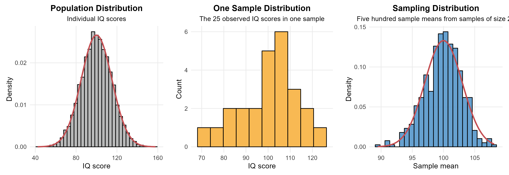
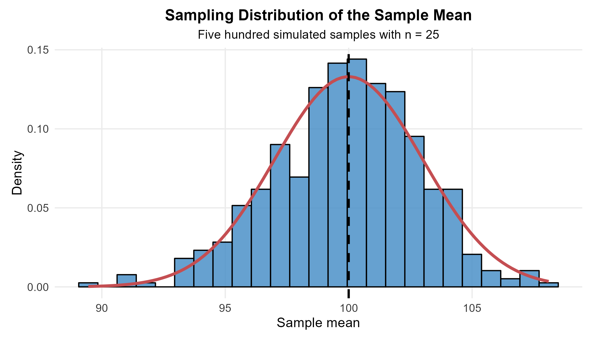
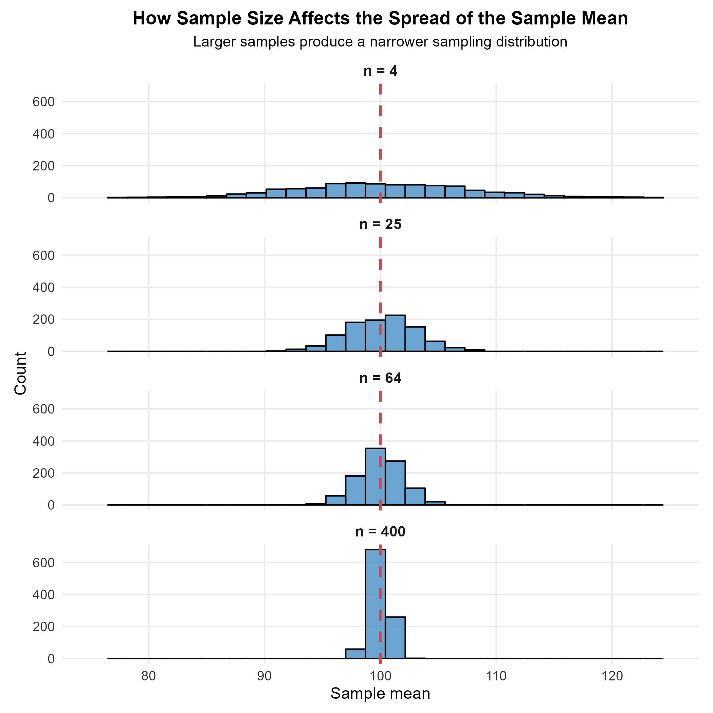
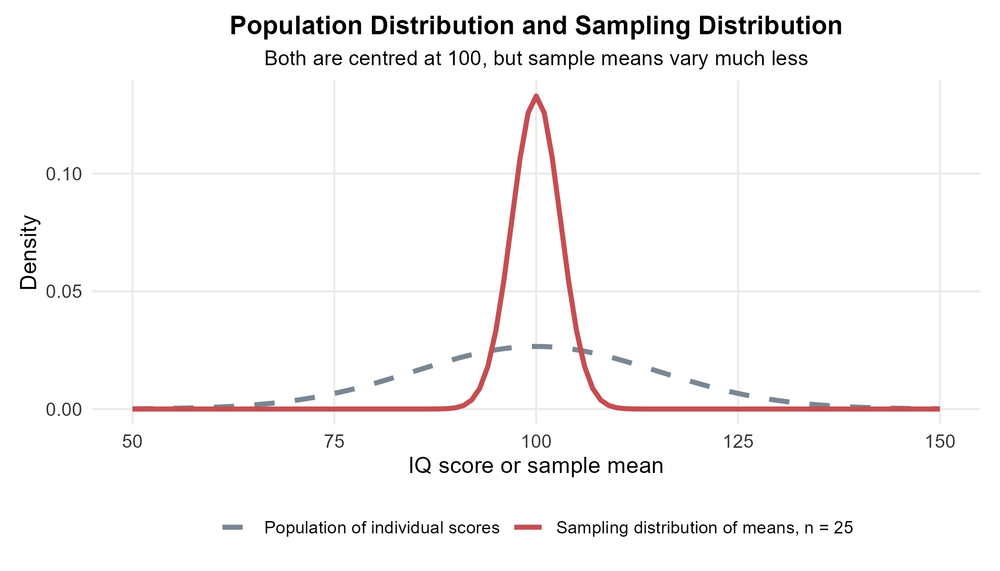
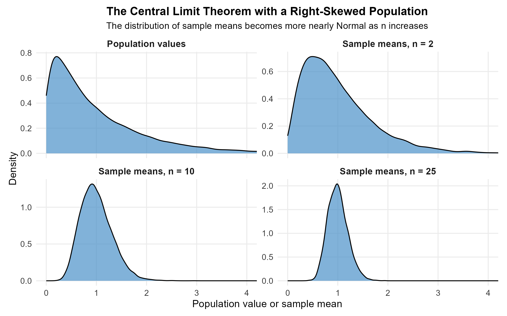
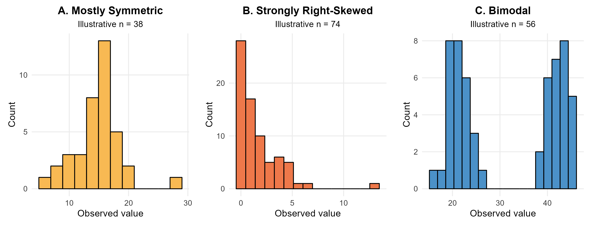
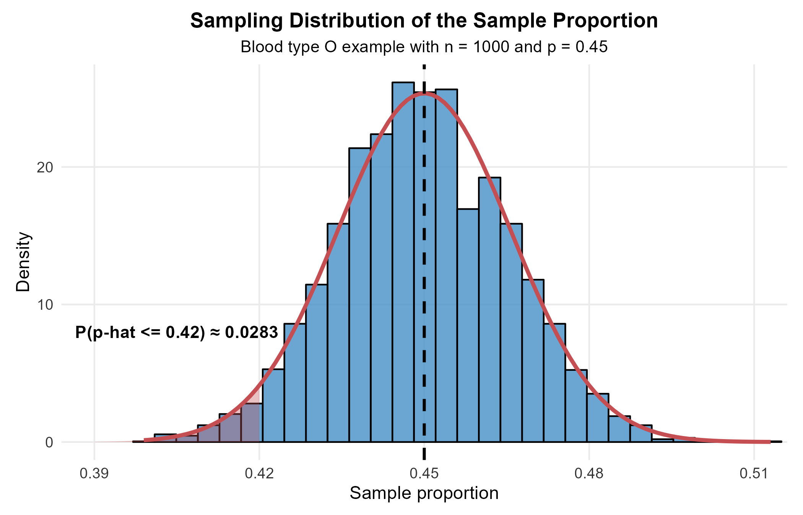
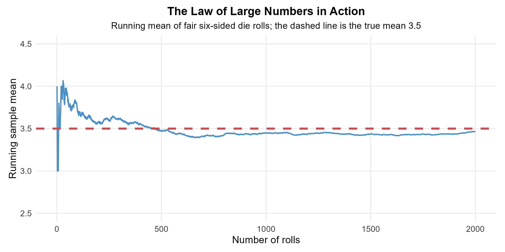

<style>
/* ============================================================
   CHAPTER 13 — PAGE + COLLAPSIBLE TABLE OF CONTENTS
   ============================================================ */

:root {
  --toc-width: 300px;
  --toc-collapsed-gutter: 72px;
  --chapter-width: 1100px;

  --ink: #23364a;
  --accent: #2c3e50;
  --line: #d8dee4;
  --soft: #f6f8fa;
  --toc-background: #f7f9fb;
}


/* ============================================================
   GENERAL PAGE
   ============================================================ */

html {
  scroll-behavior: smooth;
}

body {
  font-size: 17px;
  line-height: 1.65;
  color: var(--ink);
}

.main-container {
  max-width: var(--chapter-width) !important;
}


/* ============================================================
   HIDE DUMMY CHAPTER CONTENT
   ============================================================ */

/*
   Chapter 13 is the visible chapter heading; Pandoc applies a section-number offset of 12 so that its subsections begin at 13.1.

   Hide the visible "Chapter 13" H1 because the document title
   already says Chapter 13, but KEEP the section itself so that
   H2 headings are numbered 13.1, 13.2, 13.3, ...
*/
.section.chapter-root > h1 {
  display: none !important;
}


/* ============================================================
   HIDE EARLIER DUMMY CHAPTERS FROM THE TABLE OF CONTENTS
   ============================================================ */

/*
   R Markdown/tocify does not reliably expose the chapter names
   through data-unique, so select them through their generated
   href values instead.
*/

#TOC li:has(a[href="#chapter-1-dummy"]),
#TOC li:has(a[href="#chapter-2-dummy"]),
#TOC li:has(a[href="#chapter-3-dummy"]),
#TOC li:has(a[href="#chapter-4-dummy"]),
#TOC li:has(a[href="#chapter-5-dummy"]),
#TOC li:has(a[href="#chapter-6-dummy"]),
#TOC li:has(a[href="#chapter-7-dummy"]),
#TOC li:has(a[href="#chapter-8-dummy"]),
#TOC li:has(a[href="#chapter-9-dummy"]),
#TOC li:has(a[href="#chapter-10-dummy"]),
#TOC li:has(a[href="#chapter-11-dummy"]),
#TOC li:has(a[href="#chapter-12-dummy"]) {
  display: none !important;
}


/*
   Also hide the Chapter 13 parent entry itself.

   Its children — 13.1, 13.2, 13.3, ... — remain visible.
*/
#TOC li:has(> a[href="#chapter-13"]) > a[href="#chapter-13"] {
  display: none !important;
}


/*
   tocify may place the Chapter 13 subsections inside the same
   list item. Remove spacing belonging to the hidden parent.
*/
#TOC li:has(> a[href="#chapter-13"]) {
  margin-top: 0 !important;
}


/* ============================================================
   ACCESSIBILITY
   ============================================================ */

.sr-only {
  position: absolute;
  width: 1px;
  height: 1px;
  padding: 0;
  margin: -1px;
  overflow: hidden;
  clip: rect(0, 0, 0, 0);
  white-space: nowrap;
  border: 0;
}


/* ============================================================
   SIDEBAR TOGGLE BUTTON
   ============================================================ */

#toc-toggle {
  position: fixed;

  top: 16px;
  left: calc(var(--toc-width) + 14px);

  width: 42px;
  height: 42px;

  display: flex;
  align-items: center;
  justify-content: center;

  padding: 0;

  border: 1px solid #c7d0d9;
  border-radius: 8px;

  background: #ffffff;
  color: var(--ink);

  box-shadow: 0 2px 8px rgba(24, 39, 55, 0.13);

  cursor: pointer;

  font-size: 24px;
  line-height: 1;

  z-index: 1200;

  transition:
    left 0.25s ease,
    background-color 0.2s ease,
    box-shadow 0.2s ease,
    transform 0.2s ease;
}

#toc-toggle:hover {
  background: #eef3f7;
  box-shadow: 0 3px 10px rgba(24, 39, 55, 0.18);
}

#toc-toggle:focus-visible {
  outline: 3px solid rgba(44, 62, 80, 0.28);
  outline-offset: 2px;
}


/* Open/close icons */

#toc-toggle .menu-icon {
  display: none;
}

#toc-toggle .close-icon {
  display: inline;
}


/* Button position when sidebar is collapsed */

body.toc-collapsed #toc-toggle {
  left: 14px;
}

body.toc-collapsed #toc-toggle .menu-icon {
  display: inline;
}

body.toc-collapsed #toc-toggle .close-icon {
  display: none;
}


/* ============================================================
   DESKTOP LAYOUT
   ============================================================ */

@media screen and (min-width: 992px) {

  /*
     Make room for fixed sidebar.
  */
  .main-container {
    width: 100% !important;
    max-width: none !important;

    padding-left: calc(var(--toc-width) + 30px) !important;
    padding-right: 35px !important;

    box-sizing: border-box !important;

    transition: padding-left 0.25s ease;
  }


  /*
     When sidebar is collapsed, reclaim almost all of the space.
  */
  body.toc-collapsed .main-container {
    padding-left: var(--toc-collapsed-gutter) !important;
  }


  /*
     Bootstrap normally reserves a column for the TOC.
     The TOC is fixed now, so remove that reserved column.
  */
  .main-container > .row-fluid > .col-xs-12.col-sm-4.col-md-3,
  .main-container > .row > .col-xs-12.col-sm-4.col-md-3 {
    width: 0 !important;
    min-height: 0 !important;
    padding: 0 !important;
    margin: 0 !important;
  }


  /* ----------------------------------------------------------
     FLOATING TOC
     ---------------------------------------------------------- */

  #TOC,
  #TOC.tocify {
    position: fixed !important;

    top: 0 !important;
    bottom: 0 !important;
    left: 0 !important;

    width: var(--toc-width) !important;
    max-height: 100vh !important;

    box-sizing: border-box !important;

    overflow-y: auto !important;
    overflow-x: hidden !important;

    margin: 0 !important;
    padding: 72px 16px 28px 18px !important;

    background: var(--toc-background) !important;

    border: 0 !important;
    border-right: 1px solid var(--line) !important;
    border-radius: 0 !important;

    box-shadow: none !important;

    z-index: 1100 !important;

    transform: translateX(0);

    transition: transform 0.25s ease;
  }


  /*
     Completely slide sidebar off screen when collapsed.
  */
  body.toc-collapsed #TOC,
  body.toc-collapsed #TOC.tocify {
    transform: translateX(calc(-1 * var(--toc-width)));
  }


  /*
     Allow long section headings to wrap rather than getting
     clipped.
  */
  #TOC a {
    white-space: normal !important;
    overflow-wrap: break-word !important;
    word-break: normal !important;
  }


  /* ----------------------------------------------------------
     TOC TYPOGRAPHY
     ---------------------------------------------------------- */

  #TOC .tocify-item {
    border-radius: 4px;
  }

  #TOC .tocify-item a {
    color: var(--ink);
    text-decoration: none;
  }

  #TOC .tocify-item:hover {
    background: #e9eef3;
  }

  #TOC .tocify-item.active {
    background: var(--accent) !important;
  }

  #TOC .tocify-item.active a {
    color: #ffffff !important;
  }


  /* ----------------------------------------------------------
     MAIN CHAPTER CONTENT
     ---------------------------------------------------------- */

  .toc-content,
  .toc-content.col-xs-12.col-sm-8.col-md-9 {
    width: 100% !important;
    max-width: var(--chapter-width) !important;

    float: none !important;

    margin-left: auto !important;
    margin-right: auto !important;

    padding-left: 15px !important;
    padding-right: 15px !important;

    box-sizing: border-box !important;
  }


  /*
     Fallback for Pandoc output that does not use Bootstrap's
     normal R Markdown container structure.
  */
  body.standalone-pandoc {
    width: calc(100% - var(--toc-width)) !important;
    max-width: none !important;

    box-sizing: border-box !important;

    margin: 0 0 0 var(--toc-width) !important;
    padding: 50px 45px !important;

    transition:
      width 0.25s ease,
      margin-left 0.25s ease,
      padding-left 0.25s ease;
  }

  body.standalone-pandoc.toc-collapsed {
    width: 100% !important;

    margin-left: 0 !important;
    padding-left: var(--toc-collapsed-gutter) !important;
  }

  body.standalone-pandoc > header,
  body.standalone-pandoc > section {
    max-width: var(--chapter-width);

    margin-left: auto;
    margin-right: auto;
  }
}


/* ============================================================
   MOBILE / TABLET
   ============================================================ */

@media screen and (max-width: 991px) {

  .main-container {
    width: auto !important;
    max-width: var(--chapter-width) !important;

    margin-left: auto !important;
    margin-right: auto !important;

    padding: 70px 18px 24px !important;

    box-sizing: border-box !important;
  }


  /*
     Toggle remains at upper-left on mobile.
  */
  #toc-toggle,
  body.toc-collapsed #toc-toggle {
    left: 12px;
  }


  /*
     Mobile starts with menu icon.
  */
  #toc-toggle .menu-icon,
  body.toc-collapsed #toc-toggle .menu-icon {
    display: inline;
  }

  #toc-toggle .close-icon,
  body.toc-collapsed #toc-toggle .close-icon {
    display: none;
  }


  /*
     Show X while the mobile TOC is open.
  */
  body.toc-mobile-open #toc-toggle .menu-icon {
    display: none;
  }

  body.toc-mobile-open #toc-toggle .close-icon {
    display: inline;
  }


  /* ----------------------------------------------------------
     MOBILE TOC DRAWER
     ---------------------------------------------------------- */

  #TOC,
  #TOC.tocify {
    position: fixed !important;

    top: 0 !important;
    bottom: 0 !important;
    left: 0 !important;

    width: min(84vw, 320px) !important;
    max-height: 100vh !important;

    box-sizing: border-box !important;

    overflow-y: auto !important;
    overflow-x: hidden !important;

    margin: 0 !important;
    padding: 72px 18px 28px !important;

    background: var(--toc-background) !important;

    border: 0 !important;
    border-right: 1px solid var(--line) !important;
    border-radius: 0 !important;

    z-index: 1100 !important;

    transform: translateX(-105%);

    transition: transform 0.25s ease;
  }

  body.toc-mobile-open #TOC,
  body.toc-mobile-open #TOC.tocify {
    transform: translateX(0);

    box-shadow: 6px 0 18px rgba(24, 39, 55, 0.16);
  }


  /*
     Prevent long headings from being clipped.
  */
  #TOC a {
    white-space: normal !important;
    overflow-wrap: break-word !important;
    word-break: normal !important;
  }


  body.standalone-pandoc {
    width: auto !important;
    max-width: var(--chapter-width) !important;

    margin: 0 auto !important;
    padding: 70px 18px 24px !important;

    box-sizing: border-box !important;
  }
}


/* ============================================================
   SECTION HEADINGS
   ============================================================ */

h1,
h2,
h3,
h4,
h5 {
  margin-top: 1.6em;
}

h2 {
  border-bottom: 3px solid var(--accent);
  padding-bottom: 0.25em;
}

h3 {
  border-bottom: 1px solid var(--line);
  padding-bottom: 0.2em;
}


/* ============================================================
   BLOCKQUOTES / DEFINITION BOXES
   ============================================================ */

blockquote {
  border-left: 4px solid var(--accent);

  background: #f7f9fa;

  padding: 0.7em 1em;
  margin-top: 1.2em;
  margin-bottom: 1.2em;
}


/* ============================================================
   TABLES
   ============================================================ */

table {
  width: 100%;

  margin: 1.35em auto;

  border-collapse: separate !important;
  border-spacing: 0;

  background: #ffffff;

  border: 1px solid #d6dde5;
  border-radius: 8px;

  overflow: hidden;

  box-shadow: 0 2px 8px rgba(24, 39, 55, 0.06);
}

table thead th {
  padding: 0.72em 0.9em !important;

  background: var(--accent);
  color: #ffffff;

  border: 0 !important;
  border-bottom: 1px solid #1e2d3b !important;

  font-weight: 700;

  vertical-align: middle !important;
}

table tbody td {
  padding: 0.65em 0.9em !important;

  border: 0 !important;
  border-bottom: 1px solid #e5e9ee !important;

  vertical-align: middle !important;
}

table tbody tr:nth-child(even) td {
  background: #f7f9fb;
}

table tbody tr:hover td {
  background: #eef4f8;
}

table tbody tr:last-child td {
  border-bottom: 0 !important;
}


/* ============================================================
   IMAGES
   ============================================================ */

img {
  display: block;

  max-width: 100%;
  height: auto;

  margin: 1.4em auto;

  border: 1px solid #e1e4e8;
  border-radius: 7px;
}


/* ============================================================
   MATHEMATICS
   ============================================================ */

.math.display {
  overflow-x: auto;
}


/* ============================================================
   HIDE R MARKDOWN CODE-FOLDING UI
   ============================================================ */

.btn-code,
.code-folding-btn,
div.btn-group.pull-right {
  display: none !important;
}
</style>

<button id="toc-toggle"
        type="button"
        aria-label="Toggle table of contents"
        aria-expanded="true">
  <span class="menu-icon" aria-hidden="true">&#9776;</span>
  <span class="close-icon" aria-hidden="true">&times;</span>
  <span class="sr-only">Toggle table of contents</span>
</button>

<script>
document.addEventListener("DOMContentLoaded", function () {
  const button = document.getElementById("toc-toggle");

  if (!button) return;

  button.addEventListener("click", function () {
    if (window.innerWidth <= 991) {
      document.body.classList.toggle("toc-mobile-open");

      const isOpen =
        document.body.classList.contains("toc-mobile-open");

      button.setAttribute("aria-expanded", isOpen);
    } else {
      document.body.classList.toggle("toc-collapsed");

      const isOpen =
        !document.body.classList.contains("toc-collapsed");

      button.setAttribute("aria-expanded", isOpen);
    }
  });
});
</script>


```{r setup, include=FALSE, echo=FALSE, warning=FALSE, message=FALSE}
knitr::opts_chunk$set(
  echo = TRUE,
  warning = FALSE,
  message = FALSE,
  error = FALSE,
  fig.align = "center",
  fig.width = 6,
  fig.height = 4
)

# ggplot2 creates the lecture figures. gridExtra combines related plots.
library(ggplot2)
library(gridExtra)

# A fixed seed makes the simulation figures reproducible.
set.seed(123)

# This theme is used for statistical charts with visible axes.
lecture_chart_theme <- theme_minimal(base_size = 11) +
  theme(
    plot.title = element_text(size = 13, face = "bold", hjust = 0.5),
    plot.subtitle = element_text(size = 10.5, hjust = 0.5),
    axis.title = element_text(size = 11.5),
    axis.text = element_text(size = 9.5, colour = "#333333"),
    panel.grid.minor = element_blank(),
    plot.background = element_rect(fill = "white", colour = NA),
    panel.background = element_rect(fill = "white", colour = NA),
    plot.margin = margin(8, 10, 8, 10)
  )

# This helper saves every lecture figure with the same resolution and background.
save_plot <- function(filename, plot, width, height) {
  ggsave(
    filename = filename,
    plot = plot,
    width = width,
    height = height,
    units = "in",
    dpi = 300,
    bg = "white"
  )
}

# =============================================================
# Chapter 13: Sampling Distributions
# =============================================================

# The population model used in the IQ examples is Normal with mean 100
# and standard deviation 15.
mu_iq <- 100
sigma_iq <- 15

# -------------------------------------------------------------
# Figure 1: Population, one sample and a sampling distribution
# -------------------------------------------------------------

# A large simulated population is used only to illustrate individual IQ values.
population_values <- rnorm(10000, mean = mu_iq, sd = sigma_iq)

# One random sample of 25 individuals represents one possible observed dataset.
one_sample <- sample(population_values, size = 25, replace = FALSE)

# Five hundred independent samples are simulated. Each sample contributes one mean.
sample_means_500 <- replicate(
  500,
  mean(rnorm(25, mean = mu_iq, sd = sigma_iq))
)

p_population <- ggplot(data.frame(value = population_values), aes(x = value)) +
  geom_histogram(
    aes(y = after_stat(density)),
    bins = 35,
    fill = "#B8B9B9",
    colour = "black"
  ) +
  stat_function(
    fun = dnorm,
    args = list(mean = mu_iq, sd = sigma_iq),
    colour = "#C44E52",
    linewidth = 1
  ) +
  labs(
    title = "Population Distribution",
    subtitle = "Individual IQ scores",
    x = "IQ score",
    y = "Density"
  ) +
  lecture_chart_theme

p_one_sample <- ggplot(data.frame(value = one_sample), aes(x = value)) +
  geom_histogram(
    bins = 10,
    fill = "#F8B953",
    colour = "black"
  ) +
  labs(
    title = "One Sample Distribution",
    subtitle = "The 25 observed IQ scores in one sample",
    x = "IQ score",
    y = "Count"
  ) +
  lecture_chart_theme

p_sampling <- ggplot(data.frame(xbar = sample_means_500), aes(x = xbar)) +
  geom_histogram(
    aes(y = after_stat(density)),
    bins = 25,
    fill = "#4B91C8",
    colour = "black",
    alpha = 0.85
  ) +
  stat_function(
    fun = dnorm,
    args = list(mean = mu_iq, sd = sigma_iq / sqrt(25)),
    colour = "#C44E52",
    linewidth = 1
  ) +
  labs(
    title = "Sampling Distribution",
    subtitle = "Five hundred sample means from samples of size 25",
    x = "Sample mean",
    y = "Density"
  ) +
  lecture_chart_theme

three_levels <- gridExtra::arrangeGrob(
  p_population,
  p_one_sample,
  p_sampling,
  ncol = 3
)

ggsave(
  "fig_ch13_three_distributions.png",
  three_levels,
  width = 11,
  height = 3.8,
  units = "in",
  dpi = 300,
  bg = "white"
)

# -------------------------------------------------------------
# Figure 2: Sampling distribution of the sample mean
# -------------------------------------------------------------

# The same 500 simulated means are plotted with the exact Normal sampling model.
p_dist <- ggplot(data.frame(xbar = sample_means_500), aes(x = xbar)) +
  geom_histogram(
    aes(y = after_stat(density)),
    bins = 25,
    fill = "#4B91C8",
    colour = "black",
    alpha = 0.85
  ) +
  stat_function(
    fun = dnorm,
    args = list(mean = mu_iq, sd = sigma_iq / sqrt(25)),
    colour = "#C44E52",
    linewidth = 1.2
  ) +
  geom_vline(
    xintercept = mu_iq,
    colour = "black",
    linetype = "dashed",
    linewidth = 0.9
  ) +
  labs(
    title = "Sampling Distribution of the Sample Mean",
    subtitle = "Five hundred simulated samples with n = 25",
    x = "Sample mean",
    y = "Density"
  ) +
  lecture_chart_theme

save_plot("fig_ch13_sampling_dist.png", p_dist, width = 7, height = 4)

# -------------------------------------------------------------
# Figure 3: Effect of sample size on the spread of sample means
# -------------------------------------------------------------

n_values <- c(4, 25, 64, 400)
n_simulations <- 1000

sample_size_data <- do.call(
  rbind,
  lapply(n_values, function(current_n) {
    means <- replicate(
      n_simulations,
      mean(rnorm(current_n, mean = mu_iq, sd = sigma_iq))
    )

    data.frame(
      sample_size = paste("n =", current_n),
      xbar = means
    )
  })
)

sample_size_data$sample_size <- factor(
  sample_size_data$sample_size,
  levels = paste("n =", n_values)
)

p_sizes <- ggplot(sample_size_data, aes(x = xbar)) +
  geom_histogram(
    bins = 28,
    fill = "#4B91C8",
    colour = "black",
    alpha = 0.82
  ) +
  geom_vline(
    xintercept = mu_iq,
    colour = "#C44E52",
    linetype = "dashed",
    linewidth = 0.9
  ) +
  facet_wrap(~ sample_size, ncol = 1) +
  coord_cartesian(xlim = c(75, 125)) +
  labs(
    title = "How Sample Size Affects the Spread of the Sample Mean",
    subtitle = "Larger samples produce a narrower sampling distribution",
    x = "Sample mean",
    y = "Count"
  ) +
  lecture_chart_theme +
  theme(strip.text = element_text(face = "bold", size = 10.5))

save_plot("fig_ch13_sample_size.png", p_sizes, width = 7, height = 7)

# -------------------------------------------------------------
# Figure 4: Population distribution versus sampling distribution
# -------------------------------------------------------------

sigma_xbar_25 <- sigma_iq / sqrt(25)

p_compare <- ggplot(data.frame(x = c(50, 150)), aes(x = x)) +
  stat_function(
    fun = dnorm,
    args = list(mean = mu_iq, sd = sigma_iq),
    aes(colour = "Population of individual scores"),
    linewidth = 1.2,
    linetype = "dashed"
  ) +
  stat_function(
    fun = dnorm,
    args = list(mean = mu_iq, sd = sigma_xbar_25),
    aes(colour = "Sampling distribution of means, n = 25"),
    linewidth = 1.2
  ) +
  scale_colour_manual(
    name = NULL,
    values = c(
      "Population of individual scores" = "#7A8793",
      "Sampling distribution of means, n = 25" = "#C44E52"
    )
  ) +
  labs(
    title = "Population Distribution and Sampling Distribution",
    subtitle = "Both are centred at 100, but sample means vary much less",
    x = "IQ score or sample mean",
    y = "Density"
  ) +
  lecture_chart_theme +
  theme(legend.position = "bottom")

save_plot("fig_ch13_pop_vs_samp.png", p_compare, width = 7, height = 4)

# -------------------------------------------------------------
# Figure 5: Central Limit Theorem with a skewed population
# -------------------------------------------------------------

set.seed(42)
n_clt_simulations <- 10000

clt_population <- data.frame(
  value = rexp(n_clt_simulations, rate = 1),
  group = "Population values"
)

clt_n2 <- data.frame(
  value = replicate(
    n_clt_simulations,
    mean(rexp(2, rate = 1))
  ),
  group = "Sample means, n = 2"
)

clt_n10 <- data.frame(
  value = replicate(
    n_clt_simulations,
    mean(rexp(10, rate = 1))
  ),
  group = "Sample means, n = 10"
)

clt_n25 <- data.frame(
  value = replicate(
    n_clt_simulations,
    mean(rexp(25, rate = 1))
  ),
  group = "Sample means, n = 25"
)

clt_data <- rbind(
  clt_population,
  clt_n2,
  clt_n10,
  clt_n25
)

clt_data$group <- factor(
  clt_data$group,
  levels = c(
    "Population values",
    "Sample means, n = 2",
    "Sample means, n = 10",
    "Sample means, n = 25"
  )
)

p_clt <- ggplot(clt_data, aes(x = value)) +
  geom_density(fill = "#4B91C8", alpha = 0.7, colour = "black") +
  facet_wrap(~ group, scales = "free_y") +
  coord_cartesian(xlim = c(0, 4)) +
  labs(
    title = "The Central Limit Theorem with a Right-Skewed Population",
    subtitle = "The distribution of sample means becomes more nearly Normal as n increases",
    x = "Population value or sample mean",
    y = "Density"
  ) +
  lecture_chart_theme +
  theme(strip.text = element_text(face = "bold", size = 10.5))

save_plot("fig_ch13_clt_action.png", p_clt, width = 8, height = 5)

# -------------------------------------------------------------
# Figure 6: Illustrative sample shapes for CLT discussion
# -------------------------------------------------------------

# These synthetic values are used only to illustrate three distribution shapes.
# They are not presented as the raw data from the studies described in the notes.
set.seed(99)

toe_values <- c(rnorm(37, mean = 15, sd = 3), 28)
fruit_values <- rexp(74, rate = 0.5)
perch_values <- c(
  rnorm(28, mean = 22, sd = 2),
  rnorm(28, mean = 42, sd = 2)
)

p_toe <- ggplot(data.frame(value = toe_values), aes(x = value)) +
  geom_histogram(bins = 12, fill = "#F8B953", colour = "black") +
  labs(
    title = "A. Mostly Symmetric",
    subtitle = "Illustrative n = 38",
    x = "Observed value",
    y = "Count"
  ) +
  lecture_chart_theme

p_fruit <- ggplot(data.frame(value = fruit_values), aes(x = value)) +
  geom_histogram(bins = 15, fill = "#EE784A", colour = "black") +
  labs(
    title = "B. Strongly Right-Skewed",
    subtitle = "Illustrative n = 74",
    x = "Observed value",
    y = "Count"
  ) +
  lecture_chart_theme

p_perch <- ggplot(data.frame(value = perch_values), aes(x = value)) +
  geom_histogram(bins = 18, fill = "#4B91C8", colour = "black") +
  labs(
    title = "C. Bimodal",
    subtitle = "Illustrative n = 56",
    x = "Observed value",
    y = "Count"
  ) +
  lecture_chart_theme

practical_plot <- gridExtra::arrangeGrob(
  p_toe,
  p_fruit,
  p_perch,
  ncol = 3
)

ggsave(
  "fig_ch13_practical.png",
  practical_plot,
  width = 10,
  height = 3.8,
  units = "in",
  dpi = 300,
  bg = "white"
)

# -------------------------------------------------------------
# Figure 7: Sampling distribution of a sample proportion
# -------------------------------------------------------------

set.seed(123)
p_type_o <- 0.45
n_type_o <- 1000
n_phat_simulations <- 5000

# rbinom() returns a success count. Division by n converts the count to p-hat.
phat_values <- rbinom(
  n_phat_simulations,
  size = n_type_o,
  prob = p_type_o
) / n_type_o

sd_phat_type_o <- sqrt(
  p_type_o * (1 - p_type_o) / n_type_o
)

prob_phat_042 <- pnorm(
  q = 0.42,
  mean = p_type_o,
  sd = sd_phat_type_o
)

p_phat_dist <- ggplot(data.frame(phat = phat_values), aes(x = phat)) +
  geom_histogram(
    aes(y = after_stat(density)),
    bins = 30,
    fill = "#4B91C8",
    colour = "black",
    alpha = 0.82
  ) +
  stat_function(
    fun = dnorm,
    args = list(mean = p_type_o, sd = sd_phat_type_o),
    colour = "#C44E52",
    linewidth = 1.2
  ) +
  stat_function(
    fun = dnorm,
    args = list(mean = p_type_o, sd = sd_phat_type_o),
    xlim = c(0.39, 0.42),
    geom = "area",
    fill = "#C44E52",
    alpha = 0.35
  ) +
  geom_vline(
    xintercept = p_type_o,
    colour = "black",
    linetype = "dashed",
    linewidth = 0.9
  ) +
  annotate(
    "text",
    x = 0.405,
    y = 8,
    label = paste0(
      "P(p-hat <= 0.42) ≈ ",
      sprintf("%.4f", prob_phat_042)
    ),
    fontface = "bold"
  ) +
  coord_cartesian(xlim = c(0.39, 0.51)) +
  labs(
    title = "Sampling Distribution of the Sample Proportion",
    subtitle = "Blood type O example with n = 1000 and p = 0.45",
    x = "Sample proportion",
    y = "Density"
  ) +
  lecture_chart_theme

save_plot("fig_ch13_phat_dist.png", p_phat_dist, width = 7, height = 4.5)

# -------------------------------------------------------------
# Figure 8: Law of Large Numbers
# -------------------------------------------------------------

set.seed(8675309)

n_rolls <- 2000
rolls <- sample(1:6, n_rolls, replace = TRUE)

# The running mean after each roll is the cumulative total divided by sample size.
running_mean <- cumsum(rolls) / seq_len(n_rolls)

p_lln <- ggplot(
  data.frame(
    roll_number = seq_len(n_rolls),
    running_mean = running_mean
  ),
  aes(x = roll_number, y = running_mean)
) +
  geom_line(colour = "#4B91C8", linewidth = 0.7) +
  geom_hline(
    yintercept = 3.5,
    colour = "#C44E52",
    linewidth = 1.1,
    linetype = "dashed"
  ) +
  coord_cartesian(ylim = c(2.5, 4.5)) +
  labs(
    title = "The Law of Large Numbers in Action",
    subtitle = "Running mean of fair six-sided die rolls; the dashed line is the true mean 3.5",
    x = "Number of rolls",
    y = "Running sample mean"
  ) +
  lecture_chart_theme

save_plot("fig_ch13_lln.png", p_lln, width = 8, height = 4)
```

# Chapter 13 {.chapter-root .unlisted}

## Sampling Distributions

Chapter 6 introduced random sampling as a method for obtaining information about a population without measuring every individual. A random sample is useful because it can connect the observed data to a larger population. Random sampling also introduces chance variation because a different random sample would usually contain different individuals.

This chapter studies that variation directly. The central question is not only what statistic was observed in one sample. The central question is what values the statistic could take if the same sampling procedure were repeated many times.

This repeated-sampling perspective is the foundation of statistical inference. Confidence intervals and hypothesis tests will later use sampling distributions to measure how much a statistic can vary because of random sampling alone.

> **The main idea of the chapter**
>
> A statistic such as a sample mean or sample proportion is itself a random variable before the sample is selected. Its sampling distribution describes the values that statistic can take across repeated random samples of the same size.

### Parameters and Statistics

A population quantity and a sample quantity play different roles. A **parameter** describes a population. A **statistic** is calculated from a sample.

> **Parameter**
>
> A parameter is a numerical characteristic of a population. Population parameters are often unknown because measuring every individual in the population may be impractical or impossible.
>
> **Statistic**
>
> A statistic is a numerical characteristic calculated from sample data. A statistic can be used to estimate an unknown population parameter.

The notation helps keep the two roles separate.

| Measure | Sample statistic | Population parameter |
|:--|:--:|:--:|
| Mean | $\bar{x}$ | $\mu$ |
| Proportion | $\hat{p}$ | $p$ |

The letters are not interchangeable. The symbol $\bar{x}$ refers to the mean from a particular sample, while $\mu$ refers to the population mean. The symbol $\hat{p}$ refers to a sample proportion, while $p$ refers to the population proportion.

#### Example 13.1: A Population Parameter

**Question**

A national registration system contains birth records for every birth in the population of interest during a particular year. The records show that 8% of births were classified as low birth weight and that the mean age at first birth was 26.3 years. Are these values parameters or statistics?

**Explanation**

The values were calculated from the entire population defined for the study rather than from a sample. A number calculated from every member of the population is a parameter.

**Solution**

The low-birth-weight proportion is represented by

$$
p=0.08
$$

The population mean age at first birth is represented by

$$
\mu=26.3
$$

Both values are parameters because they describe the full population used in the calculation.

#### Example 13.2: A Sample Statistic

**Question**

A polling organization interviews a random sample of 1,023 adults. In the sample, 19% report smoking cigarettes during the previous week. Among the sampled smokers, the mean number of cigarettes smoked per day is 12. Are these values parameters or statistics?

**Explanation**

The values were calculated from a sample rather than from every adult in the target population. They are therefore statistics that can be used to estimate corresponding population parameters.

**Solution**

The sample proportion is represented by

$$
\hat{p}=0.19
$$

The sample mean is represented by

$$
\bar{x}=12
$$

Both values are statistics because they were calculated from sample data.

The distinction between a parameter and a statistic is the first step. The next step is to understand why a statistic changes from one random sample to another.

### Population Distribution, Sample Distribution and Sampling Distribution

Three different distributions appear in this chapter. They should not be confused.

| Distribution | What it contains | Example |
|:--|:--|:--|
| Population distribution | Values for individuals in the population | IQ scores for all individuals in the population model |
| Sample distribution | Values observed in one particular sample | The 25 IQ scores observed in one sample |
| Sampling distribution | Values of a statistic across repeated samples | The sample means from many samples of 25 individuals |

The population distribution describes individuals. The sample distribution describes the observations collected in one study. The sampling distribution describes a statistic calculated repeatedly from many hypothetical samples.



This distinction is important because the Central Limit Theorem concerns the **sampling distribution of a sample mean**. It does not claim that the raw observations in a large sample must form a Normal distribution.

### Statistical Estimation and Repeated Sampling

A sample mean or sample proportion depends on which individuals happen to be selected. Before the sample is drawn, the statistic is therefore a random variable.

A useful thought experiment imagines repeating the same sampling procedure many times. Every repetition uses the same sample size and the same population. Each sample produces one value of the statistic.

> **Sampling distribution**
>
> The sampling distribution of a statistic is the probability distribution of that statistic over all possible random samples of the same size drawn under the same sampling process.

A computer simulation can approximate this repeated-sampling distribution. The simulation itself is not the theoretical sampling distribution because it contains only a finite number of repetitions. The theoretical distribution describes all possible values and their probabilities.

#### Examples 13.3 and 13.4: Simulating IQ Sample Means

**Question**

Individual IQ scores are modelled by a Normal distribution with population mean $\mu=100$ and population standard deviation $\sigma=15$. What happens if 500 random samples of size $n=25$ are selected and the mean is calculated for each sample?

**Explanation**

Each sample contains 25 individual observations, but each sample contributes only one value to the sampling distribution: its sample mean. Because the population is Normal, the sampling distribution of $\bar{x}$ is also Normal.

The theoretical centre is the population mean. The theoretical standard deviation is the population standard deviation divided by the square root of the sample size.

$$
\mu_{\bar{x}}=100
$$

$$
\sigma_{\bar{x}}=\frac{15}{\sqrt{25}}=3
$$

The simulation should therefore produce a histogram of sample means that is centred near 100 with a spread near 3.

**Solution**



The simulated values fluctuate because only 500 samples were generated. The histogram nevertheless reflects the theoretical sampling distribution: the means cluster around 100 and vary much less than individual IQ scores.

The simulation provides evidence consistent with the theory. The unbiasedness of $\bar{x}$ is established mathematically by the fact that its expected value equals $\mu$, not by one simulation.

### The Effect of Sample Size

The sample size controls how much a sample mean varies from sample to sample. Larger samples average over more observations, so unusual individual values have less influence on the final mean.



The centre remains at the same population mean for every sample size. The spread becomes smaller as $n$ increases.

The reduction follows a square-root relationship. A sample size that is four times as large cuts the standard deviation of the sample mean in half. A sample size that is 100 times as large cuts the standard deviation by a factor of 10.

A larger random sample therefore produces a more precise sample mean in the sense that its sampling distribution is narrower. A larger sample does not correct systematic bias caused by a poor sampling design.

---

## The Sampling Distribution of $\bar{x}$

The simulation in the previous section illustrates properties that can be described exactly. Suppose a random sample of size $n$ is drawn from a population with mean $\mu$ and standard deviation $\sigma$. The formulas below assume independent observations or a sample that is small relative to a finite population.

### Centre of the Sampling Distribution

The mean of the sampling distribution of $\bar{x}$ equals the population mean.

$$
\mu_{\bar{x}}=\mu
$$

This equation means that the sample mean is an **unbiased estimator** of the population mean. Across repeated random samples, sample means can fall above or below $\mu$, but there is no systematic tendency for the sample mean to be too high or too low.

Unbiasedness is a repeated-sampling property. It does not mean that the mean from one particular sample must be close to $\mu$.

### Spread of the Sampling Distribution

For independent observations with population standard deviation $\sigma$, the standard deviation of the sample mean is

$$
\sigma_{\bar{x}}=\frac{\sigma}{\sqrt{n}}
$$

The standard deviation of a sampling distribution is often called the **standard error** of the statistic. In later chapters, the population standard deviation is often unknown, so the standard error will need to be estimated.

For a simple random sample drawn without replacement from a finite population of size $N$, the exact standard deviation includes a finite population correction.

$$
\sigma_{\bar{x}}
=
\frac{\sigma}{\sqrt{n}}
\sqrt{\frac{N-n}{N-1}}
$$

When the sample is a small fraction of the population, the correction factor is close to 1. A common conservative condition is that the sample size is no more than 5% of the population.

$$
n\le0.05N
$$

Under this condition, the simpler formula $\sigma/\sqrt{n}$ is usually an excellent approximation.

### Why the Square Root Matters

The formula for the spread explains why very large increases in sample size are required for major improvements in precision.

If the sample size increases from $n$ to $4n$, then

$$
\frac{\sigma}{\sqrt{4n}}
=
\frac{1}{2}\frac{\sigma}{\sqrt{n}}
$$

The standard deviation is cut in half.

If the sample size increases from $n$ to $100n$, then

$$
\frac{\sigma}{\sqrt{100n}}
=
\frac{1}{10}\frac{\sigma}{\sqrt{n}}
$$

The standard deviation is reduced by a factor of 10.

This square-root relationship is an important practical lesson. Doubling a sample size improves precision, but it does not cut the standard error in half.

---

## Shape of the Sampling Distribution of $\bar{x}$

The centre and spread of the sampling distribution follow simple formulas. Its shape depends on the population distribution and the sample size.

### Normal Population

If the population itself is Normal, the sampling distribution of $\bar{x}$ is exactly Normal for every sample size, assuming independent observations.

In these notes, $N(\mu,\sigma)$ uses the second parameter to denote the standard deviation.

$$
X\sim N(\mu,\sigma)
$$

Then

$$
\bar{X}\sim N\left(\mu,\frac{\sigma}{\sqrt{n}}\right)
$$

#### Example 13.5: Population Values and Sample Means

**Question**

Individual IQ scores are modelled by a Normal distribution with $\mu=100$ and $\sigma=15$. Random samples of size $n=25$ are selected. How does the distribution of individual IQ scores compare with the sampling distribution of the sample mean?

**Explanation**

The population distribution describes individual IQ scores and has standard deviation 15. The sampling distribution describes means of 25 individuals and has standard deviation

$$
\sigma_{\bar{x}}=\frac{15}{\sqrt{25}}=3
$$

Both distributions are centred at 100, but the sample means vary much less.

**Solution**



The 68–95–99.7 rule gives an approximate 95% range for individual IQ scores.

$$
100\pm2(15)
$$

$$
70\text{ to }130
$$

The same rule gives an approximate 95% range for sample means.

$$
100\pm2(3)
$$

$$
94\text{ to }106
$$

A sample mean from 25 individuals is therefore much less variable than one individual IQ score.

### Non-Normal Population and the Central Limit Theorem

Many populations are not Normal. Biological measurements can be skewed, heavy-tailed or multimodal. The sampling distribution of the sample mean can still become approximately Normal as the sample size increases.

> **Central Limit Theorem**
>
> For independent observations from a population with finite mean $\mu$ and finite standard deviation $\sigma$, the sampling distribution of $\bar{x}$ becomes approximately Normal as $n$ becomes large.

The theorem does not specify one sample size that works for every population. A mildly skewed population may require only a moderate sample size. A population with strong skewness or extreme outliers can require a much larger sample before the Normal approximation is accurate.

#### Example 13.6: The Central Limit Theorem in Action

**Question**

The population distribution is strongly right-skewed and follows an Exponential model. How does the shape of the sampling distribution of $\bar{x}$ change as the sample size increases?

**Explanation**

A sample mean averages several observations. As more independent observations enter the average, the distribution of the mean becomes less skewed. The Central Limit Theorem predicts an increasingly Normal shape when the sample size becomes sufficiently large.

**Solution**



For $n=2$, substantial right skew remains. For $n=10$, the distribution is more symmetric. For $n=25$, the sampling distribution is much closer to a Normal shape in this particular example.

The exact sample size needed for a satisfactory approximation depends on the population. The value 25 should not be treated as a universal rule.

> **Important distinction**
>
> The Central Limit Theorem concerns the distribution of **sample means across repeated samples**. It does not say that the observations inside one large sample become Normally distributed.

### Assessing Whether a Normal Approximation Is Reasonable

A first-year practical approach is to consider the sample size together with the shape of the data and the scientific context. A nearly symmetric population typically requires less averaging than a strongly skewed population. Extreme outliers deserve special attention because they can slow convergence toward a Normal sampling distribution.

The following simulated histograms illustrate three different shapes. They are teaching illustrations rather than the raw data from published studies.



A mostly symmetric distribution with no severe outliers often allows a Normal approximation for the sample mean at moderate sample sizes.

A strongly right-skewed distribution may require a larger sample before the sampling distribution of the mean is close to Normal.

A bimodal distribution can also produce an approximately Normal sampling distribution for the mean when the sample size is sufficiently large. The mean can still be a poor scientific summary of the original population if two distinct subgroups are being combined. The Central Limit Theorem describes the sampling behaviour of the mean; it does not determine whether the mean is scientifically meaningful.

---

## The Sampling Distribution of $\hat{p}$

The sample mean is used for quantitative data. For a categorical outcome with two categories, the sample proportion is often the statistic of interest.

If $X$ is the number of observations classified as a success in a sample of size $n$, then

$$
\hat{p}=\frac{X}{n}
$$

The word **success** is only a mathematical label for the outcome being counted.

#### Example 13.8: Contact Lens Practices

**Question**

A random sample of 281 contact-lens users contains 139 people who report that they do not consistently wash their hands before handling their lenses. What is the sample proportion?

**Explanation**

The count of interest is $X=139$ and the sample size is $n=281$. The sample proportion is the count divided by the sample size.

**Solution**

$$
\hat{p}=\frac{139}{281}
$$

$$
\hat{p}\approx0.495
$$

The sample proportion is about 49.5%. This statistic can be used to estimate the corresponding population proportion when the sampling design supports that generalization.

### Centre of the Sampling Distribution

For independent Bernoulli observations with true success probability $p$,

$$
\mu_{\hat{p}}=p
$$

The sample proportion is therefore an unbiased estimator of the population proportion.

### Spread of the Sampling Distribution

For independent Bernoulli observations,

$$
\sigma_{\hat{p}}
=
\sqrt{\frac{p(1-p)}{n}}
$$

For a simple random sample without replacement from a finite population, the exact standard deviation includes a finite population correction.

$$
\sigma_{\hat{p}}
=
\sqrt{\frac{p(1-p)}{n}}
\sqrt{\frac{N-n}{N-1}}
$$

When the sample is no more than about 5% of the population, the correction factor is close to 1 and the simpler formula is usually used.

The spread decreases as the sample size increases. The same square-root rule applies: a sample 100 times as large reduces the standard deviation by a factor of 10.

### Shape and the Normal Approximation

The sampling distribution of $\hat{p}$ is based on a binomial count. It becomes approximately Normal when the expected numbers of successes and failures are both sufficiently large.

A common first-year condition is

$$
np\ge10
$$

and

$$
n(1-p)\ge10
$$

These conditions are guidelines rather than mathematical guarantees. When $p$ is close to 0 or 1, a larger sample is required because one of the expected counts can be small.



### Examples 13.9 and 13.10: Blood Type O

**Question**

The population proportion with blood type O is $p=0.45$. A random sample of $n=1000$ records is selected. What is the probability that the sample proportion is 0.42 or lower?

**Explanation**

The centre of the sampling distribution is

$$
\mu_{\hat{p}}=0.45
$$

The standard deviation is

$$
\sigma_{\hat{p}}
=
\sqrt{\frac{0.45(0.55)}{1000}}
$$

$$
\sigma_{\hat{p}}\approx0.01573
$$

The success-failure condition is easily satisfied.

$$
np=450
$$

$$
n(1-p)=550
$$

A Normal approximation is therefore very accurate for this setting.

**Solution**

The desired probability is

$$
P(\hat{p}\le0.42)
$$

The corresponding standardized value is

$$
z
=
\frac{0.42-0.45}{0.01573}
\approx-1.91
$$

Using the Normal model gives

$$
P(\hat{p}\le0.42)\approx0.0283
$$

The same probability can be calculated in R.

```{r blood_type_probability}
# The population proportion with blood type O is specified by the model.
p_type_o <- 0.45

# The sample contains 1,000 records.
n_type_o <- 1000

# This is the standard deviation of the sampling distribution of p-hat.
sd_type_o <- sqrt(
  p_type_o * (1 - p_type_o) / n_type_o
)

# pnorm() returns the lower-tail probability P(p-hat <= 0.42).
prob_type_o <- pnorm(
  q = 0.42,
  mean = p_type_o,
  sd = sd_type_o
)

print(round(prob_type_o, 4))
```

The probability is about 0.0283, or 2.83%. Under the model, only a small proportion of random samples of size 1000 would produce a sample proportion of 0.42 or lower.

---

## The Law of Large Numbers

Sampling distributions show that larger random samples tend to produce more stable statistics. The Law of Large Numbers describes this long-run behaviour more formally.

> **Law of Large Numbers**
>
> For independent observations with a finite expected value, the sample mean converges to the population mean as the sample size increases. For independent Bernoulli observations, the sample proportion converges to the population probability.

In notation,

$$
\bar{X}_n\longrightarrow\mu
$$

and

$$
\hat{p}_n\longrightarrow p
$$

The convergence is a long-run statement. It does not mean that every larger sample must be closer to the parameter than the previous sample. It also does not mean that a finite sample will equal the parameter exactly.

### Short Run and Long Run

Small samples can vary substantially by chance. A fair coin can produce 8 heads in 10 flips even though the true probability of heads is 0.50.

As the number of independent repetitions becomes large, the sample proportion tends to stabilize near 0.50. The path is not perfectly smooth. Temporary movements away from 0.50 can still occur.

The same idea applies to a running sample mean.



The graph shows considerable early fluctuation. As more rolls are included, the running average becomes more stable around the theoretical mean of 3.5.

### Applications of the Long-Run Principle

The Law of Large Numbers is useful whenever many comparable independent outcomes are averaged.

Insurance provides one example. Individual claims can be highly uncertain, but average claim costs across a large portfolio tend to be more stable than the cost for one policyholder. This stability supports risk estimation. It does not guarantee profitability because premiums, expenses, dependence between risks and model error also matter.

Games of chance provide another mathematical example. Individual outcomes can be highly variable, while long-run averages tend toward the expected value under a stable probability model. This example illustrates the theorem rather than providing a strategy for participation.

In the life sciences, researchers often cannot collect extremely large samples because of cost, time, ethics or limited populations. Sampling distributions are therefore essential because they quantify uncertainty at realistic sample sizes.

---

## Practice and Synthesis

### Parameter or Statistic

**Question**

A marine biologist measures 40 tube sponges from a coral reef and calculates a mean diameter of 14.2 cm. Is 14.2 cm a parameter or a statistic? What symbol should represent it?

**Explanation**

The biologist measured only a subset of the tube sponges in the population. The value therefore describes the sample rather than the entire reef population.

**Solution**

The value 14.2 cm is a statistic represented by

$$
\bar{x}=14.2\text{ cm}
$$

It can be used to estimate the unknown population mean $\mu$ when the sampling design supports that inference.

### Sampling Distribution of a Sample Mean

**Question**

A genetic strain of laboratory mice has a population mean gestation period of $\mu=20$ days and a population standard deviation of $\sigma=1.5$ days. A random sample contains $n=15$ mice. What are the mean and standard deviation of the sampling distribution of $\bar{x}$?

**Explanation**

The centre of the sampling distribution equals the population mean. The spread is the population standard deviation divided by the square root of the sample size.

**Solution**

$$
\mu_{\bar{x}}=20
$$

$$
\sigma_{\bar{x}}
=
\frac{1.5}{\sqrt{15}}
\approx0.387
$$

The sample mean is centred at 20 days with a standard deviation of about 0.387 days across repeated random samples of 15 mice.

### Probability for a Normal Population

**Question**

Blood cholesterol levels in healthy adult Golden Retrievers are modelled as Normal with mean $\mu=200$ mg/dL and standard deviation $\sigma=15$ mg/dL. A random sample contains $n=9$ dogs. What is the probability that the sample mean exceeds 210 mg/dL?

**Explanation**

Because the population is Normal, the sampling distribution of $\bar{x}$ is exactly Normal under the independence assumption.

The centre is

$$
\mu_{\bar{x}}=200
$$

The standard deviation is

$$
\sigma_{\bar{x}}
=
\frac{15}{\sqrt{9}}
=
5
$$

The required probability is the upper tail above 210.

**Solution**

$$
P(\bar{x}>210)
$$

```{r golden_retriever_probability}
# The sampling distribution has mean 200 and standard deviation 15 / sqrt(9).
sampling_sd <- 15 / sqrt(9)

# lower.tail = FALSE requests the upper-tail probability above 210.
prob_cholesterol <- pnorm(
  q = 210,
  mean = 200,
  sd = sampling_sd,
  lower.tail = FALSE
)

print(round(prob_cholesterol, 4))
```

The probability is approximately

$$
P(\bar{x}>210)\approx0.0228
$$

This value is about 2.28%.

### Central Limit Theorem Probability

**Question**

A population of viral-load measurements is strongly right-skewed with mean $\mu=1000$ particles/mL and standard deviation $\sigma=300$ particles/mL. A random sample contains $n=50$ patients. What is the approximate probability that the sample mean is below 900 particles/mL?

**Explanation**

The population is not Normal, but the sample size is reasonably large. The Central Limit Theorem provides an approximate Normal model for the sample mean, assuming the observations are independent and the population has finite variance.

The centre is

$$
\mu_{\bar{x}}=1000
$$

The standard deviation is

$$
\sigma_{\bar{x}}
=
\frac{300}{\sqrt{50}}
\approx42.43
$$

**Solution**

$$
P(\bar{x}<900)
$$

```{r viral_load_probability}
# The CLT gives an approximate Normal sampling distribution for x-bar.
sampling_sd_viral <- 300 / sqrt(50)

# pnorm() returns the lower-tail probability below 900.
prob_viral <- pnorm(
  q = 900,
  mean = 1000,
  sd = sampling_sd_viral
)

print(round(prob_viral, 4))
```

The approximate probability is

$$
P(\bar{x}<900)\approx0.0092
$$

This value is about 0.92%. The numerical result depends on the Normal approximation being adequate for the underlying population and sample size.

### Sampling Distribution of a Sample Proportion

**Question**

A botanist studies a trait with population proportion $p=0.12$. A random sample contains $n=60$ seeds. What are the mean and standard deviation of the sampling distribution of $\hat{p}$?

**Explanation**

The sample proportion is unbiased, so its sampling distribution is centred at the population proportion. Its standard deviation follows the proportion formula.

**Solution**

$$
\mu_{\hat{p}}=0.12
$$

$$
\sigma_{\hat{p}}
=
\sqrt{\frac{0.12(0.88)}{60}}
$$

$$
\sigma_{\hat{p}}\approx0.0419
$$

The success-failure condition for a Normal approximation would not be satisfied because

$$
np=7.2
$$

The mean and standard deviation formulas remain valid under the independent Bernoulli model, but a Normal approximation to the shape should not be used automatically in this example.

### Probability for a Sample Proportion

**Question**

An antibiotic has a modelled cure probability of $p=0.80$. A random sample contains $n=200$ infected patients. What is the approximate probability that fewer than 75% of the patients are cured?

**Explanation**

The sampling distribution of $\hat{p}$ is approximately Normal because both expected counts are large.

$$
np=160
$$

$$
n(1-p)=40
$$

The centre is

$$
\mu_{\hat{p}}=0.80
$$

The standard deviation is

$$
\sigma_{\hat{p}}
=
\sqrt{\frac{0.80(0.20)}{200}}
\approx0.0283
$$

**Solution**

The probability of interest is

$$
P(\hat{p}<0.75)
$$

```{r antibiotic_probability}
# The population cure probability and sample size define the sampling model.
p_cure <- 0.80
n_cure <- 200

# This is the standard deviation of the sampling distribution of p-hat.
sd_cure <- sqrt(
  p_cure * (1 - p_cure) / n_cure
)

# The Normal approximation gives the probability below 0.75.
prob_cure <- pnorm(
  q = 0.75,
  mean = p_cure,
  sd = sd_cure
)

print(round(prob_cure, 4))
```

The Normal approximation gives

$$
P(\hat{p}<0.75)\approx0.0385
$$

This value is about 3.85%. The result is an approximation based on the Normal sampling model for $\hat{p}$.

### Sample Size and Precision

**Question**

An epidemiologist increases a planned sample size from $n=40$ to $n=160$. By what factor does the standard deviation of the sample mean change?

**Explanation**

The sample size has increased by a factor of four.

$$
160=4(40)
$$

The standard deviation is inversely proportional to the square root of the sample size.

**Solution**

$$
\frac{\sigma/\sqrt{160}}{\sigma/\sqrt{40}}
=
\sqrt{\frac{40}{160}}
=
\frac{1}{2}
$$

The standard deviation of the sample mean is cut in half.

This result illustrates greater precision from a larger sample. It should not be interpreted as a guarantee that every larger sample will produce an estimate closer to the population mean.

### Introduction to Statistical Inference

**Question**

A baseline model gives a recovery-time population mean of $\mu=14$ days and standard deviation $\sigma=3$ days. A random sample of $n=100$ patients receiving a new treatment has mean recovery time $\bar{x}=13.1$ days.

If the baseline mean of 14 days still applied to the treated population, what is the probability of observing a sample mean of 13.1 days or lower?

**Explanation**

With $n=100$, the Central Limit Theorem supports an approximately Normal sampling distribution under the usual independence and finite-variance conditions. Under the baseline model, the sampling distribution of $\bar{x}$ has centre

$$
\mu_{\bar{x}}=14
$$

and standard deviation

$$
\sigma_{\bar{x}}
=
\frac{3}{\sqrt{100}}
=
0.30
$$

The probability measures how unusual a sample mean of 13.1 or lower would be under that baseline model.

**Solution**

```{r inference_preview}
# The null or baseline model assumes a population mean of 14 days.
baseline_mean <- 14
population_sd <- 3
sample_size <- 100

# The sampling standard deviation under the baseline model is 0.30 days.
sampling_sd_recovery <- population_sd / sqrt(sample_size)

# This lower-tail probability measures results at or below 13.1 days.
prob_recovery <- pnorm(
  q = 13.1,
  mean = baseline_mean,
  sd = sampling_sd_recovery
)

print(round(prob_recovery, 4))
```

The probability is approximately

$$
P(\bar{x}\le13.1)\approx0.0013
$$

This small probability indicates that a sample mean of 13.1 days would be unusual if the population mean were still 14 days under the stated model.

This calculation previews the logic of a one-sided hypothesis test. A formal test would state the null hypothesis, define what counts as results at least as extreme as the observed result and evaluate the evidence using the study design. A small probability provides evidence against the baseline model, but it does not by itself establish that the treatment caused the difference. A causal conclusion also requires an appropriate experimental design.

---

## Chapter Summary

### Core Ideas

A parameter describes a population. A statistic is calculated from a sample and can be used to estimate a parameter.

A sampling distribution describes how a statistic varies across repeated random samples of the same size.

For a sample mean,

$$
\mu_{\bar{x}}=\mu
$$

and, for independent observations,

$$
\sigma_{\bar{x}}=\frac{\sigma}{\sqrt{n}}
$$

If the population is Normal, the sampling distribution of $\bar{x}$ is Normal for any sample size. For a non-Normal population with finite variance, the Central Limit Theorem says that the sampling distribution becomes approximately Normal as the sample size becomes sufficiently large.

For a sample proportion,

$$
\mu_{\hat{p}}=p
$$

and

$$
\sigma_{\hat{p}}
=
\sqrt{\frac{p(1-p)}{n}}
$$

The sampling distribution of $\hat{p}$ is approximately Normal when the expected counts of successes and failures are both sufficiently large.

Larger samples reduce sampling variability according to a square-root relationship. Larger samples do not automatically remove bias.

The Law of Large Numbers states that sample averages or sample proportions converge to their corresponding population values under appropriate repeated-sampling conditions. It does not guarantee exact equality in a finite sample.

### A Consistent Sampling-Distribution Workflow

A sampling-distribution problem becomes easier when the same sequence is used each time.

1. **The population parameter should be identified first.** The problem should make clear whether the target is a mean $\mu$ or a proportion $p$.
2. **The sample statistic should be identified next.** Quantitative measurements usually lead to $\bar{x}$ while binary categorical outcomes usually lead to $\hat{p}$.
3. **The centre of the sampling distribution should be written.** An unbiased sample mean is centred at $\mu$ and an unbiased sample proportion is centred at $p$.
4. **The spread should be calculated.** The appropriate standard-deviation formula should be used with attention to independence and the finite population condition.
5. **The shape should be justified.** A Normal population gives an exact Normal sampling distribution for $\bar{x}$. The Central Limit Theorem can support an approximate Normal model for large samples. A sample proportion should satisfy the success-failure condition before a Normal approximation is used.
6. **The probability statement should be written before software is used.** Expressions such as $P(\bar{x}>210)$ or $P(\hat{p}\le0.42)$ make the target clear.
7. **The result should be interpreted in repeated-sampling language.** A probability describes how often a statistic would fall in the stated region if the same sampling process were repeated many times.

The central question throughout the chapter is simple: **How much can a statistic change because of random sampling alone?** Sampling distributions provide the mathematical answer and prepare the foundation for statistical inference.
