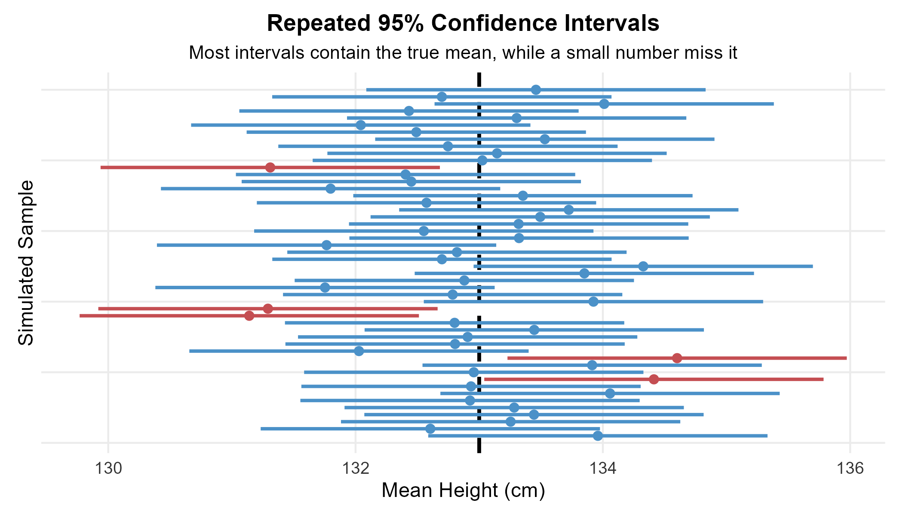
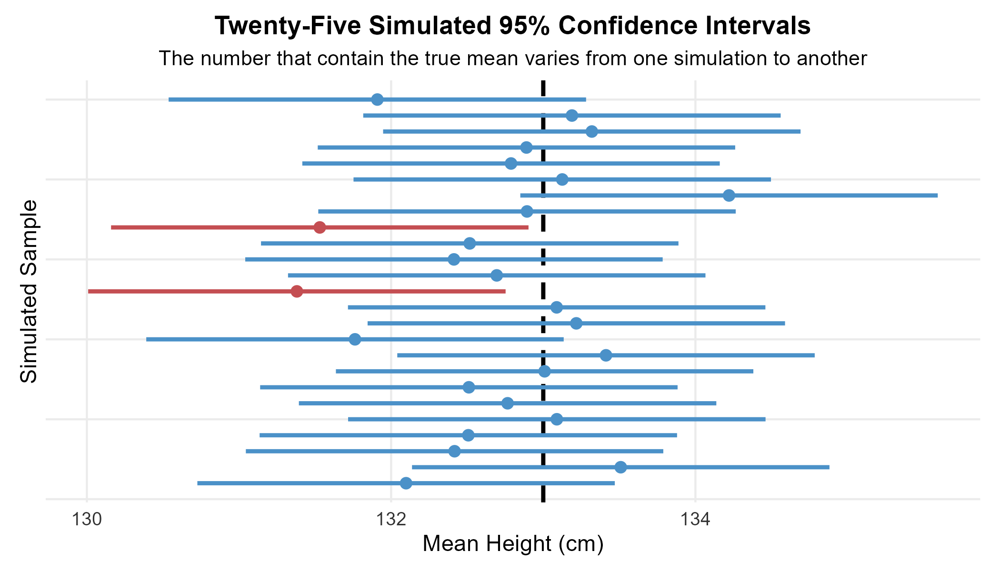
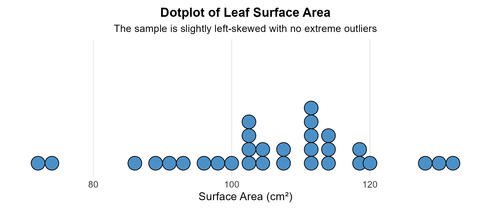

<style>
/* ============================================================
   CHAPTER 14 — PAGE + COLLAPSIBLE TABLE OF CONTENTS
   ============================================================ */

:root {
  --toc-width: 300px;
  --toc-collapsed-gutter: 72px;
  --chapter-width: 1100px;

  --ink: #23364a;
  --accent: #2c3e50;
  --line: #d8dee4;
  --soft: #f6f8fa;
  --toc-background: #f7f9fb;
}


/* ============================================================
   GENERAL PAGE
   ============================================================ */

html {
  scroll-behavior: smooth;
}

body {
  font-size: 17px;
  line-height: 1.65;
  color: var(--ink);
}

.main-container {
  max-width: var(--chapter-width) !important;
}


/* ============================================================
   HIDE DUMMY CHAPTER CONTENT
   ============================================================ */

/*
   Chapter 14 is the visible chapter heading. Pandoc applies a section-number offset of 13 so that its subsections begin at 14.1.

   Hide the visible "Chapter 14" H1 because the document title
   already says Chapter 14, but KEEP the section itself so that
   H2 headings are numbered 14.1, 14.2, 14.3, ...
*/
.section.chapter-root > h1 {
  display: none !important;
}


/* ============================================================
   HIDE EARLIER DUMMY CHAPTERS FROM THE TABLE OF CONTENTS
   ============================================================ */

/*
   R Markdown/tocify does not reliably expose the chapter names
   through data-unique, so select them through their generated
   href values instead.
*/

#TOC li:has(a[href="#chapter-1-dummy"]),
#TOC li:has(a[href="#chapter-2-dummy"]),
#TOC li:has(a[href="#chapter-3-dummy"]),
#TOC li:has(a[href="#chapter-4-dummy"]),
#TOC li:has(a[href="#chapter-5-dummy"]),
#TOC li:has(a[href="#chapter-6-dummy"]),
#TOC li:has(a[href="#chapter-7-dummy"]),
#TOC li:has(a[href="#chapter-8-dummy"]),
#TOC li:has(a[href="#chapter-9-dummy"]),
#TOC li:has(a[href="#chapter-10-dummy"]),
#TOC li:has(a[href="#chapter-11-dummy"]),
#TOC li:has(a[href="#chapter-12-dummy"]),
#TOC li:has(a[href="#chapter-13-dummy"]) {
  display: none !important;
}


/*
   The Chapter 14 parent entry is hidden so that only its numbered subsections appear in the floating table of contents.

   Its children — 14.1, 14.2, 14.3, ... — remain visible.
*/
#TOC li:has(> a[href="#chapter-14"]) > a[href="#chapter-14"] {
  display: none !important;
}


/*
   tocify may place the Chapter 14 subsections inside the same
   list item. Remove spacing belonging to the hidden parent.
*/
#TOC li:has(> a[href="#chapter-14"]) {
  margin-top: 0 !important;
}


/* ============================================================
   ACCESSIBILITY
   ============================================================ */

.sr-only {
  position: absolute;
  width: 1px;
  height: 1px;
  padding: 0;
  margin: -1px;
  overflow: hidden;
  clip: rect(0, 0, 0, 0);
  white-space: nowrap;
  border: 0;
}


/* ============================================================
   SIDEBAR TOGGLE BUTTON
   ============================================================ */

#toc-toggle {
  position: fixed;

  top: 16px;
  left: calc(var(--toc-width) + 14px);

  width: 42px;
  height: 42px;

  display: flex;
  align-items: center;
  justify-content: center;

  padding: 0;

  border: 1px solid #c7d0d9;
  border-radius: 8px;

  background: #ffffff;
  color: var(--ink);

  box-shadow: 0 2px 8px rgba(24, 39, 55, 0.13);

  cursor: pointer;

  font-size: 24px;
  line-height: 1;

  z-index: 1200;

  transition:
    left 0.25s ease,
    background-color 0.2s ease,
    box-shadow 0.2s ease,
    transform 0.2s ease;
}

#toc-toggle:hover {
  background: #eef3f7;
  box-shadow: 0 3px 10px rgba(24, 39, 55, 0.18);
}

#toc-toggle:focus-visible {
  outline: 3px solid rgba(44, 62, 80, 0.28);
  outline-offset: 2px;
}


/* Open/close icons */

#toc-toggle .menu-icon {
  display: none;
}

#toc-toggle .close-icon {
  display: inline;
}


/* Button position when sidebar is collapsed */

body.toc-collapsed #toc-toggle {
  left: 14px;
}

body.toc-collapsed #toc-toggle .menu-icon {
  display: inline;
}

body.toc-collapsed #toc-toggle .close-icon {
  display: none;
}


/* ============================================================
   DESKTOP LAYOUT
   ============================================================ */

@media screen and (min-width: 992px) {

  /*
     Make room for fixed sidebar.
  */
  .main-container {
    width: 100% !important;
    max-width: none !important;

    padding-left: calc(var(--toc-width) + 30px) !important;
    padding-right: 35px !important;

    box-sizing: border-box !important;

    transition: padding-left 0.25s ease;
  }


  /*
     When sidebar is collapsed, reclaim almost all of the space.
  */
  body.toc-collapsed .main-container {
    padding-left: var(--toc-collapsed-gutter) !important;
  }


  /*
     Bootstrap normally reserves a column for the TOC.
     The TOC is fixed now, so remove that reserved column.
  */
  .main-container > .row-fluid > .col-xs-12.col-sm-4.col-md-3,
  .main-container > .row > .col-xs-12.col-sm-4.col-md-3 {
    width: 0 !important;
    min-height: 0 !important;
    padding: 0 !important;
    margin: 0 !important;
  }


  /* ----------------------------------------------------------
     FLOATING TOC
     ---------------------------------------------------------- */

  #TOC,
  #TOC.tocify {
    position: fixed !important;

    top: 0 !important;
    bottom: 0 !important;
    left: 0 !important;

    width: var(--toc-width) !important;
    max-height: 100vh !important;

    box-sizing: border-box !important;

    overflow-y: auto !important;
    overflow-x: hidden !important;

    margin: 0 !important;
    padding: 72px 16px 28px 18px !important;

    background: var(--toc-background) !important;

    border: 0 !important;
    border-right: 1px solid var(--line) !important;
    border-radius: 0 !important;

    box-shadow: none !important;

    z-index: 1100 !important;

    transform: translateX(0);

    transition: transform 0.25s ease;
  }


  /*
     Completely slide sidebar off screen when collapsed.
  */
  body.toc-collapsed #TOC,
  body.toc-collapsed #TOC.tocify {
    transform: translateX(calc(-1 * var(--toc-width)));
  }


  /*
     Allow long section headings to wrap rather than getting
     clipped.
  */
  #TOC a {
    white-space: normal !important;
    overflow-wrap: break-word !important;
    word-break: normal !important;
  }


  /* ----------------------------------------------------------
     TOC TYPOGRAPHY
     ---------------------------------------------------------- */

  #TOC .tocify-item {
    border-radius: 4px;
  }

  #TOC .tocify-item a {
    color: var(--ink);
    text-decoration: none;
  }

  #TOC .tocify-item:hover {
    background: #e9eef3;
  }

  #TOC .tocify-item.active {
    background: var(--accent) !important;
  }

  #TOC .tocify-item.active a {
    color: #ffffff !important;
  }


  /* ----------------------------------------------------------
     MAIN CHAPTER CONTENT
     ---------------------------------------------------------- */

  .toc-content,
  .toc-content.col-xs-12.col-sm-8.col-md-9 {
    width: 100% !important;
    max-width: var(--chapter-width) !important;

    float: none !important;

    margin-left: auto !important;
    margin-right: auto !important;

    padding-left: 15px !important;
    padding-right: 15px !important;

    box-sizing: border-box !important;
  }


  /*
     Fallback for Pandoc output that does not use Bootstrap's
     normal R Markdown container structure.
  */
  body.standalone-pandoc {
    width: calc(100% - var(--toc-width)) !important;
    max-width: none !important;

    box-sizing: border-box !important;

    margin: 0 0 0 var(--toc-width) !important;
    padding: 50px 45px !important;

    transition:
      width 0.25s ease,
      margin-left 0.25s ease,
      padding-left 0.25s ease;
  }

  body.standalone-pandoc.toc-collapsed {
    width: 100% !important;

    margin-left: 0 !important;
    padding-left: var(--toc-collapsed-gutter) !important;
  }

  body.standalone-pandoc > header,
  body.standalone-pandoc > section {
    max-width: var(--chapter-width);

    margin-left: auto;
    margin-right: auto;
  }
}


/* ============================================================
   MOBILE / TABLET
   ============================================================ */

@media screen and (max-width: 991px) {

  .main-container {
    width: auto !important;
    max-width: var(--chapter-width) !important;

    margin-left: auto !important;
    margin-right: auto !important;

    padding: 70px 18px 24px !important;

    box-sizing: border-box !important;
  }


  /*
     Toggle remains at upper-left on mobile.
  */
  #toc-toggle,
  body.toc-collapsed #toc-toggle {
    left: 12px;
  }


  /*
     Mobile starts with menu icon.
  */
  #toc-toggle .menu-icon,
  body.toc-collapsed #toc-toggle .menu-icon {
    display: inline;
  }

  #toc-toggle .close-icon,
  body.toc-collapsed #toc-toggle .close-icon {
    display: none;
  }


  /*
     Show X while the mobile TOC is open.
  */
  body.toc-mobile-open #toc-toggle .menu-icon {
    display: none;
  }

  body.toc-mobile-open #toc-toggle .close-icon {
    display: inline;
  }


  /* ----------------------------------------------------------
     MOBILE TOC DRAWER
     ---------------------------------------------------------- */

  #TOC,
  #TOC.tocify {
    position: fixed !important;

    top: 0 !important;
    bottom: 0 !important;
    left: 0 !important;

    width: min(84vw, 320px) !important;
    max-height: 100vh !important;

    box-sizing: border-box !important;

    overflow-y: auto !important;
    overflow-x: hidden !important;

    margin: 0 !important;
    padding: 72px 18px 28px !important;

    background: var(--toc-background) !important;

    border: 0 !important;
    border-right: 1px solid var(--line) !important;
    border-radius: 0 !important;

    z-index: 1100 !important;

    transform: translateX(-105%);

    transition: transform 0.25s ease;
  }

  body.toc-mobile-open #TOC,
  body.toc-mobile-open #TOC.tocify {
    transform: translateX(0);

    box-shadow: 6px 0 18px rgba(24, 39, 55, 0.16);
  }


  /*
     Prevent long headings from being clipped.
  */
  #TOC a {
    white-space: normal !important;
    overflow-wrap: break-word !important;
    word-break: normal !important;
  }


  body.standalone-pandoc {
    width: auto !important;
    max-width: var(--chapter-width) !important;

    margin: 0 auto !important;
    padding: 70px 18px 24px !important;

    box-sizing: border-box !important;
  }
}


/* ============================================================
   SECTION HEADINGS
   ============================================================ */

h1,
h2,
h3,
h4,
h5 {
  margin-top: 1.6em;
}

h2 {
  border-bottom: 3px solid var(--accent);
  padding-bottom: 0.25em;
}

h3 {
  border-bottom: 1px solid var(--line);
  padding-bottom: 0.2em;
}


/* ============================================================
   BLOCKQUOTES / DEFINITION BOXES
   ============================================================ */

blockquote {
  border-left: 4px solid var(--accent);

  background: #f7f9fa;

  padding: 0.7em 1em;
  margin-top: 1.2em;
  margin-bottom: 1.2em;
}


/* ============================================================
   TABLES
   ============================================================ */

table {
  width: 100%;

  margin: 1.35em auto;

  border-collapse: separate !important;
  border-spacing: 0;

  background: #ffffff;

  border: 1px solid #d6dde5;
  border-radius: 8px;

  overflow: hidden;

  box-shadow: 0 2px 8px rgba(24, 39, 55, 0.06);
}

table thead th {
  padding: 0.72em 0.9em !important;

  background: var(--accent);
  color: #ffffff;

  border: 0 !important;
  border-bottom: 1px solid #1e2d3b !important;

  font-weight: 700;

  vertical-align: middle !important;
}

table tbody td {
  padding: 0.65em 0.9em !important;

  border: 0 !important;
  border-bottom: 1px solid #e5e9ee !important;

  vertical-align: middle !important;
}

table tbody tr:nth-child(even) td {
  background: #f7f9fb;
}

table tbody tr:hover td {
  background: #eef4f8;
}

table tbody tr:last-child td {
  border-bottom: 0 !important;
}


/* ============================================================
   IMAGES
   ============================================================ */

img {
  display: block;

  max-width: 100%;
  height: auto;

  margin: 1.4em auto;

  border: 1px solid #e1e4e8;
  border-radius: 7px;
}


/* ============================================================
   MATHEMATICS
   ============================================================ */

.math.display {
  overflow-x: auto;
}


/* ============================================================
   HIDE R MARKDOWN CODE-FOLDING UI
   ============================================================ */

.btn-code,
.code-folding-btn,
div.btn-group.pull-right {
  display: none !important;
}
</style>

<button id="toc-toggle"
        type="button"
        aria-label="Toggle table of contents"
        aria-expanded="true">
  <span class="menu-icon" aria-hidden="true">&#9776;</span>
  <span class="close-icon" aria-hidden="true">&times;</span>
  <span class="sr-only">Toggle table of contents</span>
</button>

<script>
document.addEventListener("DOMContentLoaded", function () {
  const button = document.getElementById("toc-toggle");

  if (!button) return;

  button.addEventListener("click", function () {
    if (window.innerWidth <= 991) {
      document.body.classList.toggle("toc-mobile-open");

      const isOpen =
        document.body.classList.contains("toc-mobile-open");

      button.setAttribute("aria-expanded", isOpen);
    } else {
      document.body.classList.toggle("toc-collapsed");

      const isOpen =
        !document.body.classList.contains("toc-collapsed");

      button.setAttribute("aria-expanded", isOpen);
    }
  });
});
</script>

```{r setup, include=FALSE, echo=FALSE, warning=FALSE, message=FALSE}
knitr::opts_chunk$set(
  echo = TRUE,
  warning = FALSE,
  message = FALSE,
  error = FALSE,
  fig.align = "center",
  fig.width = 6,
  fig.height = 4
)

# ggplot2 is used only to create the lecture figures that are saved as PNG files.
# The visible R examples later in the chapter use introductory R functions.
if (!requireNamespace("ggplot2", quietly = TRUE)) {
  stop("The ggplot2 package must be installed before this chapter is knitted.")
}

suppressPackageStartupMessages({
  library(ggplot2)
})

# A fixed seed makes all simulation figures reproducible.
set.seed(42)

# This theme keeps the lecture figures visually consistent.
lecture_chart_theme <- theme_minimal(base_size = 11) +
  theme(
    plot.title = element_text(size = 13, face = "bold", hjust = 0.5),
    plot.subtitle = element_text(size = 10.5, hjust = 0.5),
    axis.title = element_text(size = 11.5),
    axis.text = element_text(size = 9.5, colour = "#333333"),
    panel.grid.minor = element_blank(),
    plot.background = element_rect(fill = "white", colour = NA),
    panel.background = element_rect(fill = "white", colour = NA),
    plot.margin = margin(8, 10, 8, 10)
  )

# This helper saves every lecture figure with the same resolution and background.
save_plot <- function(filename, plot, width, height) {
  ggsave(
    filename = filename,
    plot = plot,
    width = width,
    height = height,
    units = "in",
    dpi = 300,
    bg = "white"
  )
}

# =============================================================
# Figure 1: Repeated 95% confidence intervals
# =============================================================

# The simulation uses a population mean of 133 cm.
mu_true <- 133

# The standard deviation of the sampling distribution is 0.7 cm.
sigma_xbar <- 0.7

# The exact 95% Normal critical value determines the interval half-width.
z_star_95 <- qnorm(0.975)
margin_95 <- z_star_95 * sigma_xbar

# Fifty independent sample means are generated from the sampling distribution.
n_intervals <- 50
sample_means <- rnorm(
  n_intervals,
  mean = mu_true,
  sd = sigma_xbar
)

# Each row contains one simulated confidence interval.
ci_data <- data.frame(
  sample_id = seq_len(n_intervals),
  xbar = sample_means,
  lower = sample_means - margin_95,
  upper = sample_means + margin_95
)

# The logical variable records whether each interval contains the true mean.
ci_data$captured <- (
  ci_data$lower <= mu_true &
  ci_data$upper >= mu_true
)

p_ci_simulation <- ggplot(
  ci_data,
  aes(y = sample_id, x = xbar, colour = captured)
) +
  geom_vline(
    xintercept = mu_true,
    linetype = "dashed",
    colour = "black",
    linewidth = 1
  ) +
  geom_segment(
    aes(
      x = lower,
      xend = upper,
      y = sample_id,
      yend = sample_id
    ),
    linewidth = 0.9
  ) +
  geom_point(size = 2) +
  scale_colour_manual(
    values = c(
      "FALSE" = "#C44E52",
      "TRUE" = "#4B91C8"
    )
  ) +
  labs(
    title = "Repeated 95% Confidence Intervals",
    subtitle = "Most intervals contain the true mean, while a small number miss it",
    x = "Mean Height (cm)",
    y = "Simulated Sample"
  ) +
  lecture_chart_theme +
  theme(
    legend.position = "none",
    axis.text.y = element_blank(),
    axis.ticks.y = element_blank()
  )

save_plot(
  "fig_ch14_sampling_dist.png",
  p_ci_simulation,
  width = 7,
  height = 4
)

# =============================================================
# Figure 2: A smaller repeated-confidence-interval simulation
# =============================================================

# A second seed creates a different set of samples for this separate figure.
set.seed(314)

n_intervals_small <- 25
sample_means_small <- rnorm(
  n_intervals_small,
  mean = mu_true,
  sd = sigma_xbar
)

ci_small <- data.frame(
  sample_id = seq_len(n_intervals_small),
  xbar = sample_means_small,
  lower = sample_means_small - margin_95,
  upper = sample_means_small + margin_95
)

ci_small$captured <- (
  ci_small$lower <= mu_true &
  ci_small$upper >= mu_true
)

p_ci_small <- ggplot(
  ci_small,
  aes(y = sample_id, x = xbar, colour = captured)
) +
  geom_vline(
    xintercept = mu_true,
    linetype = "dashed",
    colour = "black",
    linewidth = 1
  ) +
  geom_segment(
    aes(
      x = lower,
      xend = upper,
      y = sample_id,
      yend = sample_id
    ),
    linewidth = 1
  ) +
  geom_point(size = 2.3) +
  scale_colour_manual(
    values = c(
      "FALSE" = "#C44E52",
      "TRUE" = "#4B91C8"
    )
  ) +
  labs(
    title = "Twenty-Five Simulated 95% Confidence Intervals",
    subtitle = "The number that contain the true mean varies from one simulation to another",
    x = "Mean Height (cm)",
    y = "Simulated Sample"
  ) +
  lecture_chart_theme +
  theme(
    legend.position = "none",
    axis.text.y = element_blank(),
    axis.ticks.y = element_blank()
  )

save_plot(
  "fig_ch14_25_intervals.png",
  p_ci_small,
  width = 7,
  height = 4
)

# =============================================================
# Figure 3: Leaf surface area example
# =============================================================

# These are the 31 leaf surface area measurements used in the worked example.
leaf_data <- c(
  114, 100, 104, 89, 102, 91, 114, 114,
  103, 105, 108, 130, 120, 132, 111, 128,
  118, 119, 86, 72, 111, 103, 74, 112,
  107, 103, 98, 96, 112, 112, 93
)

leaf_df <- data.frame(Area = leaf_data)

p_leaf_dotplot <- ggplot(leaf_df, aes(x = Area)) +
  geom_dotplot(
    binwidth = 2,
    fill = "#4B91C8",
    colour = "black",
    dotsize = 1
  ) +
  scale_y_continuous(NULL, breaks = NULL) +
  labs(
    title = "Dotplot of Leaf Surface Area",
    subtitle = "The sample is slightly left-skewed with no extreme outliers",
    x = "Surface Area (cm²)"
  ) +
  lecture_chart_theme

save_plot(
  "fig_ch14_leaf_dotplot.png",
  p_leaf_dotplot,
  width = 7,
  height = 3
)
```

# Chapter 14 {.chapter-root .unlisted}

## Introduction to Inference

The earlier chapters focused on collecting data, describing distributions and understanding sampling distributions. Those ideas now come together in **statistical inference**.

A sample tells us what happened among the individuals who were observed. Statistical inference goes further by using the sample to learn about a larger population.

> **Statistical inference**
>
> Statistical inference consists of methods for drawing conclusions about a population from sample data while accounting for uncertainty caused by random sampling.

Random samples do not produce identical results. A new random sample would usually produce a different sample mean, a different sample proportion or a different fitted model. Probability provides a way to describe this natural sampling variation.

Two major forms of inference are introduced in this chapter.

- **Confidence intervals** estimate an unknown population parameter and describe the precision of that estimate.
- **Hypothesis tests** assess how compatible the observed data are with a specific claim about a population parameter.

Both methods depend on sampling distributions. The same repeated-sampling ideas developed in Chapter 13 will therefore appear throughout this chapter.

### Simple Conditions for Introductory Inference

The first inference procedures in this course use a simplified setting. The purpose is to make the statistical reasoning clear before more realistic procedures are introduced.

The introductory one-sample procedures for a population mean will assume the following conditions.

1. **The data come from an appropriate random sampling process.** The observations should be independent or approximately independent for the population being studied.
2. **The sampling distribution of the sample mean can be modelled by a Normal distribution.** This condition is satisfied exactly when the population is Normal. It is often approximately satisfied for sufficiently large samples through the Central Limit Theorem.
3. **The population standard deviation $\sigma$ is treated as known.** This assumption is unrealistic in many applications, but it allows the main ideas of confidence intervals and hypothesis tests to be introduced using the Normal distribution.

These conditions describe a teaching model. Later procedures will replace the known population standard deviation with an estimate from the sample and will use Student's $t$ distribution.

The study design remains important. A mathematically correct interval or test cannot repair serious bias caused by an inappropriate sample.

---

## Statistical Estimation

A sample statistic can be used as an estimate of a population parameter. For a population mean $\mu$, the natural point estimate is the sample mean $\bar{x}$.

A point estimate gives one number. It does not describe how much that number might change from one random sample to another. A confidence interval adds a margin of error to describe this sampling uncertainty.

### Estimating the Mean Height of Eight-Year-Old Boys

**Examples 14.1 and 14.2**

**Question**

The National Health and Nutrition Examination Survey provides a sample of $n=217$ eight-year-old boys from the population of interest. The sample mean height is $\bar{x}=132.5$ cm. For this introductory example, the population standard deviation is assumed to be known at $\sigma=10$ cm.

How can the sample mean be used to estimate the unknown population mean height $\mu$ for the wider population while accounting for random sampling variation?

**Explanation**

The first step is to describe the sampling distribution of $\bar{x}$. Its centre is the unknown population mean $\mu$. Its standard deviation is

$$
\sigma_{\bar{x}}
=
\frac{\sigma}{\sqrt{n}}
$$

For this example,

$$
\sigma_{\bar{x}}
=
\frac{10}{\sqrt{217}}
\approx
0.679\text{ cm}
$$

The 68–95–99.7 rule says that approximately 95% of observations from a Normal distribution lie within two standard deviations of the mean. Applying that idea to the sampling distribution gives an approximate distance of

$$
2(0.679)
\approx
1.36\text{ cm}
$$

The original textbook-style calculation rounds the standard error to 0.7 cm first, which gives an approximate margin of error of 1.4 cm.

A sample mean is therefore expected to fall within about 1.4 cm of $\mu$ in roughly 95% of repeated samples under this approximate calculation.

**Solution**

Using the rounded margin of error gives

$$
132.5-1.4
=
131.1
$$

and

$$
132.5+1.4
=
133.9
$$

The approximate 95% confidence interval is

$$
(131.1,\ 133.9)\text{ cm}
$$

A suitable interpretation is:

**We are approximately 95% confident that the population mean height is between 131.1 cm and 133.9 cm because the method used to construct the interval captures the true population mean in about 95% of repeated samples under the stated model.**

The value 1.4 cm is not an absolute maximum possible error. It is the approximate half-width associated with a method that has about 95% long-run coverage.

### Turning the Sampling Distribution Around

The logic of a confidence interval becomes clearer when the same method is imagined over many random samples.



Each horizontal line represents an interval calculated from a different random sample. The sample means vary because the samples contain different individuals.

The true population mean remains fixed. Some intervals contain that fixed value while others do not.

A 95% confidence procedure has a **long-run coverage rate of 95%** under the model. This means that if the same procedure were repeated many times, approximately 95% of the intervals would contain the true parameter.

A small simulation does not have to show exactly 95% coverage. Fifty intervals might contain the parameter 46 times, 47 times, 49 times or some other nearby number. The theoretical 95% statement describes the long-run procedure rather than one small simulation.

---

## Margin of Error and Confidence Level

Most confidence intervals have the same general structure.

> **Anatomy of a confidence interval**
>
> A confidence interval usually has the form
>
> **estimate $\pm$ margin of error**

Three ideas appear in this structure.

### The Estimate

The estimate is the sample statistic used as the centre of the interval. When estimating a population mean, the estimate is usually $\bar{x}$.

For the height example,

$$
\bar{x}
=
132.5\text{ cm}
$$

The sample mean is an unbiased estimator of $\mu$ under the usual random-sampling model. This repeated-sampling property does not guarantee that one particular sample mean is close to the population mean.

### The Margin of Error

The **margin of error** is the distance from the centre of the interval to either endpoint.

For a confidence interval based on a Normal critical value,

$$
m
=
z^*
\frac{\sigma}{\sqrt{n}}
$$

The margin of error reflects random sampling variability under the statistical model. It does not include every possible source of error in a study. Poor measurement, nonresponse or selection bias can remain even when the margin of error is small.

A larger sample size reduces the standard error because the denominator contains $\sqrt{n}$. A smaller standard error usually produces a narrower interval when the confidence level is unchanged.

### The Confidence Level

The **confidence level**, denoted by $C$, describes the long-run success rate of the interval-building procedure.

Common confidence levels include 90%, 95% and 99%.

A higher confidence level requires a larger critical value. The resulting interval is wider because the method must cover a larger central portion of the sampling distribution.

A 100% confidence procedure with a finite useful width is not available for an unbounded Normal model. An interval covering every possible value would provide no useful precision. If every member of a finite population were measured without error, there would be no sampling uncertainty to estimate with a confidence interval.

---

## Interpreting a Confidence Interval

Correct interpretation is one of the most important parts of statistical inference.

> **A useful interpretation**
>
> We are 95% confident that the population parameter lies between the reported endpoints because the procedure used to construct the interval captures the true parameter in 95% of repeated samples under the stated conditions.

The confidence level describes the procedure. It should not be interpreted as the probability that a fixed parameter moves in or out of one already calculated interval.

After the sample has been observed and the interval has been calculated, the population parameter is fixed. The interval either contains that parameter or it does not. The difficulty is that the parameter is unknown.

The repeated-sampling interpretation explains why the word **confidence** is used rather than assigning a 95% probability to the fixed parameter after the interval has been calculated.

### Visualizing Repeated Confidence Intervals

The following figure shows the same principle with 25 simulated samples.



The number of intervals that contain the parameter will vary from one simulation to another. The long-run proportion approaches the stated confidence level when the assumptions of the procedure are satisfied.

Two factors have an especially direct effect on interval width.

1. **A larger sample size usually produces a narrower interval.** More information reduces the standard error.
2. **A higher confidence level produces a wider interval.** Greater long-run coverage requires a larger critical value.

This creates a trade-off between precision and confidence. A narrow interval is more precise, but a higher confidence level requires a wider range unless more data are collected.

---

## Confidence Intervals for the Mean $\mu$

The earlier height example used the approximate value 2 from the 68–95–99.7 rule. A more precise method uses a **critical value** from the Standard Normal distribution.

The critical value is denoted by $z^*$. It is chosen so that the central area under the Standard Normal curve equals the desired confidence level.

### Common Critical Values

| Confidence level $C$ | Critical value $z^*$ |
|:--|--:|
| 90% | 1.645 |
| 95% | 1.960 |
| 99% | 2.576 |

For a 95% interval, the critical value is 1.960 rather than exactly 2.

> **Confidence interval for a population mean with known $\sigma$**
>
> Under the introductory conditions, a level $C$ confidence interval for $\mu$ is
>
> $$
> \bar{x}
> \pm
> z^*
> \frac{\sigma}{\sqrt{n}}
> $$

The formula has the general form

$$
\text{estimate}
\pm
\text{critical value}\times\text{standard error}
$$

The standard error describes the natural sampling variability of the estimator. The critical value determines how much of that variability is included in the interval.

### The Four-Step Process for Confidence Intervals

A consistent process helps keep the statistical reasoning connected to the scientific question.

1. **STATE:** The practical question should identify the population quantity that needs to be estimated.
2. **PLAN:** The parameter, confidence level and appropriate inference procedure should be identified.
3. **SOLVE:** The required conditions should be assessed before the interval is calculated.
4. **CONCLUDE:** The interval should be interpreted in the context of the population and variable being studied.

The calculation is only one part of the solution. The study design, conditions and interpretation are equally important.

### Leaf Surface Area

**Example 14.3**

**Question**

A botanist wants to estimate the mean leaf surface area of mature *Monstera deliciosa* leaves grown in a particular greenhouse environment. A random sample contains 31 mature leaves with surface areas measured in cm².

114, 100, 104, 89, 102, 91, 114, 114, 103, 105, 108, 130, 120, 132, 111, 128, 118, 119, 86, 72, 111, 103, 74, 112, 107, 103, 98, 96, 112, 112, 93

For this introductory example, prior studies provide a known population standard deviation of $\sigma=15$ cm².

What is a 95% confidence interval for the population mean leaf surface area?

**Explanation**

The parameter is the population mean leaf surface area $\mu$ for mature leaves of this species under the stated greenhouse conditions.

The sample was described as randomly selected, which supports the sampling condition. The dotplot provides information about the shape of the observed data.



The sample is somewhat left-skewed, but it does not show extreme outliers. With $n=31$, the Central Limit Theorem also provides some support for an approximately Normal sampling distribution of the sample mean when the population has finite variance.

The 95% critical value is

$$
z^*
=
1.960
$$

The sample mean is

$$
\bar{x}
\approx
105.84
$$

The standard error is

$$
\frac{\sigma}{\sqrt{n}}
=
\frac{15}{\sqrt{31}}
\approx
2.69
$$

The margin of error is

$$
m
=
1.960
\left(
\frac{15}{\sqrt{31}}
\right)
\approx
5.28
$$

**Solution**

The interval is

$$
105.84
\pm
5.28
$$

which gives

$$
(100.56,\ 111.12)
$$

A suitable conclusion is:

**We are 95% confident that the population mean surface area of mature leaves in the greenhouse population is between approximately 100.6 cm² and 111.1 cm².**

The same calculation can be performed in R.

```{r leaf_confidence_interval}
# The vector contains the 31 observed leaf surface areas in cm².
leaf_data <- c(
  114, 100, 104, 89, 102, 91, 114, 114,
  103, 105, 108, 130, 120, 132, 111, 128,
  118, 119, 86, 72, 111, 103, 74, 112,
  107, 103, 98, 96, 112, 112, 93
)

# The population standard deviation is treated as known for this example.
sigma_leaf <- 15

# The sample mean and sample size are calculated from the observed data.
xbar_leaf <- mean(leaf_data)
n_leaf <- length(leaf_data)

# qnorm(0.975) gives the critical value for a central 95% Normal interval.
z_star_leaf <- qnorm(0.975)

# The standard error describes the sampling variability of the sample mean.
se_leaf <- sigma_leaf / sqrt(n_leaf)

# The margin of error equals the critical value multiplied by the standard error.
margin_leaf <- z_star_leaf * se_leaf

# The interval endpoints are centred at the sample mean.
lower_leaf <- xbar_leaf - margin_leaf
upper_leaf <- xbar_leaf + margin_leaf

# The main numerical results are displayed with sensible rounding.
round(
  c(
    Sample_Mean = xbar_leaf,
    Standard_Error = se_leaf,
    Margin_of_Error = margin_leaf,
    Lower_Bound = lower_leaf,
    Upper_Bound = upper_leaf
  ),
  2
)
```

### Looking Ahead Beyond the Simple Conditions

The assumption of a known population standard deviation is mainly a teaching device. In most real studies, $\sigma$ is unknown.

Later chapters will replace $\sigma$ with the sample standard deviation $s$. The resulting procedures use Student's $t$ distribution rather than the Standard Normal distribution. Chapter 17 will develop these procedures for the common situation in which the population standard deviation is unknown.

The logic of estimation remains the same. A sample provides an estimate, the standard error describes sampling variability and the confidence interval reports a range of plausible values using a method with a stated long-run coverage rate.

The known-$\sigma$ assumption can feel unusual because researchers who do not know a population mean will often also be uncertain about the population standard deviation. Its purpose here is to separate the logic of inference from the additional mathematics needed when $\sigma$ must be estimated.

---

## Hypothesis Testing

Confidence intervals estimate an unknown parameter. A different type of question begins with a specific claim about a population.

A **hypothesis test** uses sample data to assess the evidence against a stated null hypothesis.

The logic is based on a conditional question:

**If the null hypothesis were true, how unusual would the observed sample result be?**

A result that would be very unusual under the null model provides evidence against that model.

### Inorganic Phosphorus Levels

**Examples 14.4 and 14.5**

**Question**

Inorganic phosphorus is an important mineral in bone metabolism. In the general adult population, blood phosphorus levels are modelled as Normal with mean 1.2 mmol/L and standard deviation 0.1 mmol/L.

Researchers suspect that mean phosphorus levels may be lower among older adults. A retrospective chart review provides measurements from 12 patients between the ages of 75 and 79.

| | | | | | |
|--:|--:|--:|--:|--:|--:|
| 1.26 | 1.39 | 1.00 | 1.00 | 1.00 | 1.10 |
| 0.87 | 1.23 | 1.19 | 1.29 | 1.03 | 1.18 |

The sample mean is approximately

$$
\bar{x}
=
1.1283\text{ mmol/L}
$$

Does the difference between 1.1283 and 1.2 provide evidence that the population mean for the older group is lower than 1.2 mmol/L?

**Explanation**

The sample mean is lower than 1.2, but a sample mean can differ from the population mean simply because of sampling variation. A hypothesis test compares the observed difference with the amount of variation expected under a specific null model.

The retrospective chart review is not a simple random sample. For this introductory calculation, the observations are treated as if the simplified sampling model were appropriate. A real population-level conclusion would also require careful consideration of how the patients entered the study.

The test therefore requires two competing hypotheses.

**Solution**

The null hypothesis is

$$
H_0:\mu=1.2
$$

The alternative hypothesis is

$$
H_a:\mu<1.2
$$

The alternative is one-sided because the research question concerns a decrease.

The calculation of the evidence against $H_0$ will be developed after the meaning of hypotheses and P-values is established.

### The Null and Alternative Hypotheses

Every formal hypothesis test begins with two statements about a population parameter.

> **Null hypothesis $H_0$**
>
> The null hypothesis gives the specific population value or model that is evaluated by the test. It commonly represents no difference, no change or a reference value.

> **Alternative hypothesis $H_a$**
>
> The alternative hypothesis gives the competing claim supported when the data provide sufficient evidence against the null hypothesis.

Hypotheses refer to **population parameters**. They do not state facts about already observed sample statistics.

For example,

$$
H_0:\mu=1.2
$$

is a statement about the unknown population mean. The observed value $\bar{x}=1.1283$ is sample evidence used to evaluate that statement.

### One-Sided and Two-Sided Alternatives

A one-sided alternative specifies a direction.

A lower-tail alternative has the form

$$
H_a:\mu<\mu_0
$$

An upper-tail alternative has the form

$$
H_a:\mu>\mu_0
$$

A two-sided alternative allows departures in either direction.

$$
H_a:\mu\ne\mu_0
$$

The direction should be determined by the scientific question and analysis plan rather than chosen after seeing the observed result. Changing from a two-sided question to a one-sided question only because the sample moved in one direction changes the statistical procedure and can exaggerate evidence.

### Aspirin Tablet Manufacturing

**Example 14.6**

**Question**

A pharmaceutical manufacturing process is designed to produce aspirin tablets with a population mean active-ingredient amount of 325 mg.

Both underfilling and overfilling would be undesirable. Too little active ingredient can reduce the intended dose while too much can create a dosage concern. What hypotheses should be used to evaluate whether the population mean differs from the target?

**Explanation**

The reference value is 325 mg. The scientific concern includes deviations above or below this target, so a one-sided alternative would ignore one relevant direction.

**Solution**

The null hypothesis is

$$
H_0:\mu=325
$$

The appropriate alternative is

$$
H_a:\mu\ne325
$$

This is a two-sided test because departures in either direction matter.

---

## P-Values and Statistical Significance

A hypothesis test asks how compatible the observed data are with the null hypothesis.

The reasoning begins by temporarily assuming that $H_0$ is true. The sampling distribution under that assumption tells us which sample results are common and which are unusual.

A criminal-trial analogy is sometimes used to introduce this logic. The null hypothesis is treated as the claim that remains in place unless the evidence is sufficiently strong against it. The analogy is limited because a statistical test does not determine guilt or innocence and a P-value is not the probability that the null hypothesis is true.

### The Logic of a P-Value

A test statistic measures how far the observed statistic lies from the null value relative to the amount of sampling variability.

For a one-sample $z$ test of a population mean,

$$
z
=
\frac{\bar{x}-\mu_0}{\sigma/\sqrt{n}}
$$

The resulting value tells us how many standard errors the observed sample mean is from the null mean.

> **P-value**
>
> The P-value is the probability, calculated under the assumption that the null hypothesis and model conditions are true, of obtaining a test statistic at least as extreme as the observed statistic in the direction or directions specified by the alternative hypothesis.

A P-value is **not** the probability that $H_0$ is true. It is also not the probability that the observed result happened only because of chance.

A small P-value means the observed data are difficult to reconcile with the null model. A large P-value means the data are not unusual enough under the null model to provide strong evidence against it.

### Interpreting P-Values

The interpretation should focus on evidence rather than proof.

- **A small P-value provides stronger evidence against $H_0$.** The observed result would be relatively unusual under the null model.
- **A large P-value does not provide strong evidence against $H_0$.** The result remains reasonably compatible with the null model.
- **Failure to reject $H_0$ does not prove that $H_0$ is true.** The data may simply be too limited to distinguish the null value from nearby alternatives.

Statistical significance is a decision based on a preselected significance level. It does not measure the practical importance or biological importance of an effect.

### One-Sided P-Value for Phosphorus

**Example 14.7**

**Question**

For the phosphorus study,

$$
H_0:\mu=1.2
$$

and

$$
H_a:\mu<1.2
$$

The sample contains $n=12$ observations with mean $\bar{x}\approx1.1283$ mmol/L. The population standard deviation is treated as known at $\sigma=0.1$ mmol/L.

What is the one-sided P-value?

**Explanation**

Under $H_0$, the sampling distribution of $\bar{x}$ has centre 1.2 and standard error

$$
SE
=
\frac{0.1}{\sqrt{12}}
\approx
0.0289
$$

The test statistic is

$$
z
=
\frac{1.1283-1.2}{0.0289}
\approx
-2.48
$$

Because the alternative is $\mu<1.2$, evidence against $H_0$ lies in the lower tail.

**Solution**

The lower-tail probability is approximately

$$
P(Z\le-2.48)
\approx
0.0065
$$

The P-value is about 0.0065.

Under the null model, a sample mean of approximately 1.1283 mmol/L or lower would occur in about 0.65% of repeated samples of size 12.

This result provides strong evidence against $H_0$ under the stated assumptions. The data support the conclusion that the population mean phosphorus level for the older group is lower than 1.2 mmol/L.

The same calculation can be performed in R.

```{r phosphorus_test}
# The 12 observed phosphorus measurements are entered in mmol/L.
phosphorus <- c(
  1.26, 1.39, 1.00, 1.00, 1.00, 1.10,
  0.87, 1.23, 1.19, 1.29, 1.03, 1.18
)

# The null model specifies a mean of 1.2 mmol/L.
mu_null_phos <- 1.2

# The population standard deviation is treated as known in this example.
sigma_phos <- 0.1

# The sample mean and sample size are calculated from the observed data.
xbar_phos <- mean(phosphorus)
n_phos <- length(phosphorus)

# The standard error describes the sampling variability under the null model.
se_phos <- sigma_phos / sqrt(n_phos)

# The z statistic measures the difference from the null value in standard errors.
z_phos <- (xbar_phos - mu_null_phos) / se_phos

# The alternative is lower-tailed, so pnorm() gives the required left-tail area.
p_phos <- pnorm(z_phos)

round(
  c(
    Sample_Mean = xbar_phos,
    Standard_Error = se_phos,
    Z_Statistic = z_phos,
    P_Value = p_phos
  ),
  4
)
```

### Two-Sided P-Value for Aspirin

**Example 14.8**

**Question**

A manufacturing process targets a population mean of 325 mg with known population standard deviation $\sigma=5$ mg. A random sample of $n=10$ tablets has sample mean $\bar{x}=326.9$ mg.

The hypotheses are

$$
H_0:\mu=325
$$

and

$$
H_a:\mu\ne325
$$

What is the two-sided P-value?

**Explanation**

The standard error is

$$
SE
=
\frac{5}{\sqrt{10}}
\approx
1.581
$$

The test statistic is

$$
z
=
\frac{326.9-325}{1.581}
\approx
1.202
$$

The two-sided alternative counts results at least this far from the null mean in either direction.

**Solution**

For a symmetric Standard Normal distribution, the two-sided P-value can be calculated as

$$
2P(Z\ge1.202)
\approx
0.2295
$$

A P-value of about 0.2295 is not small. The data therefore do not provide strong evidence against the null hypothesis.

The conclusion should be stated carefully: **the data do not provide statistically significant evidence that the population mean differs from 325 mg**. This is not the same as proving that the process mean is exactly 325 mg.

```{r aspirin_test}
# The null value is the target amount of active ingredient.
mu_null_aspirin <- 325

# The population standard deviation is treated as known.
sigma_aspirin <- 5

# The sample information comes from 10 tablets.
n_aspirin <- 10
xbar_aspirin <- 326.9

# The standard error is calculated under the null model.
se_aspirin <- sigma_aspirin / sqrt(n_aspirin)

# The z statistic measures the standardized distance from the target mean.
z_aspirin <- (
  xbar_aspirin - mu_null_aspirin
) / se_aspirin

# The two-sided P-value includes equally extreme results in both tails.
p_aspirin <- 2 * pnorm(
  -abs(z_aspirin)
)

round(
  c(
    Standard_Error = se_aspirin,
    Z_Statistic = z_aspirin,
    P_Value = p_aspirin
  ),
  4
)
```

---

## Significance Levels $\alpha$

A hypothesis test often compares its P-value with a significance level denoted by $\alpha$.

> **Significance level**
>
> The significance level is a decision threshold chosen before the analysis. When the testing procedure rejects $H_0$ whenever $P\le\alpha$, the value $\alpha$ is the long-run probability of a Type I error under the null model for a correctly calibrated test.

Common choices include

$$
\alpha=0.05
$$

and

$$
\alpha=0.01
$$

The decision rule is

- **When $P\le\alpha$, the result is statistically significant and $H_0$ is rejected.**
- **When $P>\alpha$, the result is not statistically significant and $H_0$ is not rejected.**

The value $\alpha=0.05$ does not mean there is a 5% probability that the null hypothesis is true. It controls a long-run error rate for the testing procedure when the null hypothesis is true.

The term **statistically significant** also does not mean that an effect is large, important or biologically meaningful. Statistical significance and practical importance answer different questions.

---

## Tests for a Population Mean

Under the introductory conditions of a Normal sampling distribution with known $\sigma$, a one-sample $z$ test can be used for a population mean.

> **One-sample $z$ test for a mean**
>
> To test
>
> $$
> H_0:\mu=\mu_0
> $$
>
> the test statistic is
>
> $$
> z
> =
> \frac{\bar{x}-\mu_0}{\sigma/\sqrt{n}}
> $$

The numerator measures the difference between the observed sample mean and the null value.

The denominator is the standard error of the sample mean.

The test statistic therefore expresses the observed difference in units of standard errors.

### Calculating the P-Value from $z$

The alternative hypothesis determines which part of the Standard Normal distribution contributes to the P-value.

- **For $H_a:\mu>\mu_0$, the P-value is the area to the right of the observed $z$ value.**
- **For $H_a:\mu<\mu_0$, the P-value is the area to the left of the observed $z$ value.**
- **For $H_a:\mu\ne\mu_0$, the P-value includes equally extreme outcomes in both tails.**

For a symmetric $z$ distribution, a two-sided P-value can be calculated in R with

```{r two_sided_pvalue_template, eval=FALSE}
# abs(z_stat) makes the calculation work for positive or negative z statistics.
p_value <- 2 * pnorm(-abs(z_stat))
```

---

## Body Temperature and the Four-Step Testing Process

**Example 14.9**

**Question**

An historical reference value for mean human body temperature is 98.6°F. A later study reports oral temperatures from $n=130$ healthy adult volunteers associated with vaccine trials. The sample mean is $\bar{x}=98.25$°F.

The volunteer sample is not a simple random sample of all adults. For this introductory exercise, assume the observations can be treated as independent and representative of the population being studied. Also assume a known population standard deviation of $\sigma=0.6$°F.

Do the data provide evidence that the population mean differs from 98.6°F?

**Explanation**

The question concerns a difference in either direction, so a two-sided test is appropriate.

The hypotheses are

$$
H_0:\mu=98.6
$$

and

$$
H_a:\mu\ne98.6
$$

The standard error is

$$
SE
=
\frac{0.6}{\sqrt{130}}
\approx
0.0526
$$

The test statistic is

$$
z
=
\frac{98.25-98.6}{0.0526}
\approx
-6.65
$$

The magnitude of the test statistic is very large. Under the null model, a sample mean at least this far from 98.6 in either direction would be extremely unusual.

**Solution**

The two-sided P-value is approximately

$$
2.9\times10^{-11}
$$

The P-value is extremely small. Under the stated model assumptions, the data provide extremely strong evidence against $H_0$.

The appropriate conclusion is that the population mean represented by this study is not consistent with 98.6°F under the assumed model.

The result is not literally impossible under $H_0$. Its probability is simply extremely small. The strength of the population conclusion also depends on whether the study sample appropriately represents the population of interest.

```{r body_temperature_test}
# The null model specifies a population mean of 98.6 degrees Fahrenheit.
mu_null_temp <- 98.6

# The observed sample mean and sample size come from the study summary.
xbar_temp <- 98.25
n_temp <- 130

# The population standard deviation is treated as known for this exercise.
sigma_temp <- 0.6

# The standard error describes the sampling variability of the sample mean.
se_temp <- sigma_temp / sqrt(n_temp)

# The z statistic measures the standardized distance from the null mean.
z_temp <- (
  xbar_temp - mu_null_temp
) / se_temp

# The alternative is two-sided, so both tails are included.
p_temp <- 2 * pnorm(
  -abs(z_temp)
)

c(
  Standard_Error = se_temp,
  Z_Statistic = z_temp,
  P_Value = p_temp
)
```

The four-step process can be summarized as follows.

1. **STATE:** The study asks whether the population mean body temperature differs from 98.6°F.
2. **PLAN:** A two-sided one-sample $z$ test is used under the stated introductory assumptions.
3. **SOLVE:** The standard error, test statistic and two-sided P-value are calculated.
4. **CONCLUDE:** The very small P-value provides extremely strong evidence against the null value for the population represented by the study.

---

## Tests from Confidence Intervals

Two-sided hypothesis tests and confidence intervals are closely connected when they are based on the same statistical model.

For a two-sided $z$ test at significance level $\alpha$, the corresponding two-sided confidence interval has confidence level

$$
C
=
1-\alpha
$$

For example,

$$
\alpha=0.05
$$

corresponds to

$$
C=0.95
$$

Under the same assumptions,

- **A null value outside the corresponding confidence interval leads to rejection of $H_0$.**
- **A null value inside the corresponding confidence interval leads to failure to reject $H_0$.**

This equivalence applies when the test and interval use the same two-sided model, standard error and significance level.

### Body Temperature Confidence Interval

**Example 14.10**

**Question**

Using the body-temperature sample with $\bar{x}=98.25$°F, $n=130$ and known $\sigma=0.6$°F, what is the 95% confidence interval for the population mean?

How does the interval lead to the same conclusion as the two-sided test of

$$
H_0:\mu=98.6
$$

at $\alpha=0.05$?

**Explanation**

The 95% critical value is

$$
z^*
=
1.960
$$

The standard error is

$$
SE
=
\frac{0.6}{\sqrt{130}}
\approx
0.0526
$$

The margin of error is

$$
m
=
1.960(0.0526)
\approx
0.1031
$$

**Solution**

The confidence interval is

$$
98.25
\pm
0.1031
$$

which gives

$$
(98.15,\ 98.35)
$$

The null value 98.6°F lies outside the 95% confidence interval. The corresponding two-sided test therefore rejects

$$
H_0:\mu=98.6
$$

at the 5% significance level.

The confidence interval provides more information than a reject-or-fail-to-reject decision alone because it also shows the range of population means that are compatible with the sample under the model.

```{r body_temperature_confidence_interval}
# The exact 95% Normal critical value is obtained from qnorm().
z_star_temp <- qnorm(0.975)

# The margin of error uses the same standard error as the hypothesis test.
margin_temp <- z_star_temp * se_temp

# The confidence interval is centred at the observed sample mean.
lower_temp <- xbar_temp - margin_temp
upper_temp <- xbar_temp + margin_temp

round(
  c(
    Lower_Bound = lower_temp,
    Upper_Bound = upper_temp
  ),
  2
)
```

---

## Chapter Summary

Statistical inference uses sample data to learn about population parameters while accounting for random sampling variation.

A **confidence interval** estimates an unknown parameter using an interval produced by a procedure with a stated long-run coverage rate.

For a population mean with known $\sigma$, the confidence interval is

$$
\bar{x}
\pm
z^*
\frac{\sigma}{\sqrt{n}}
$$

The **margin of error** is

$$
m
=
z^*
\frac{\sigma}{\sqrt{n}}
$$

Larger samples reduce the standard error and usually produce narrower intervals. Higher confidence levels require larger critical values and therefore produce wider intervals.

A **hypothesis test** evaluates evidence against a null hypothesis by asking how unusual the observed data would be if the null model were true.

For a one-sample $z$ test,

$$
z
=
\frac{\bar{x}-\mu_0}{\sigma/\sqrt{n}}
$$

The alternative hypothesis determines whether the P-value comes from the left tail, right tail or both tails.

A small P-value provides stronger evidence against $H_0$. A large P-value does not prove $H_0$.

The significance level $\alpha$ is chosen before the analysis and provides a decision threshold for the test.

Two-sided confidence intervals and two-sided hypothesis tests are directly connected when they use the same model and significance level.

### A Consistent Inference Workflow

A first-year inference problem becomes easier when the same reasoning is used each time.

1. **The population parameter and scientific question should be identified first.**
2. **The study design and assumptions should be assessed before calculations begin.**
3. **The appropriate sampling distribution and standard error should be identified.**
4. **A confidence interval or hypothesis test should be calculated using the correct critical value or tail probability.**
5. **The numerical result should be interpreted in the context of the population.**
6. **The conclusion should distinguish statistical evidence from practical importance and should respect the limitations of the study design.**

The main goal of inference is not simply to produce a number. The goal is to connect sample evidence to a population claim while describing the uncertainty that comes from random sampling.
