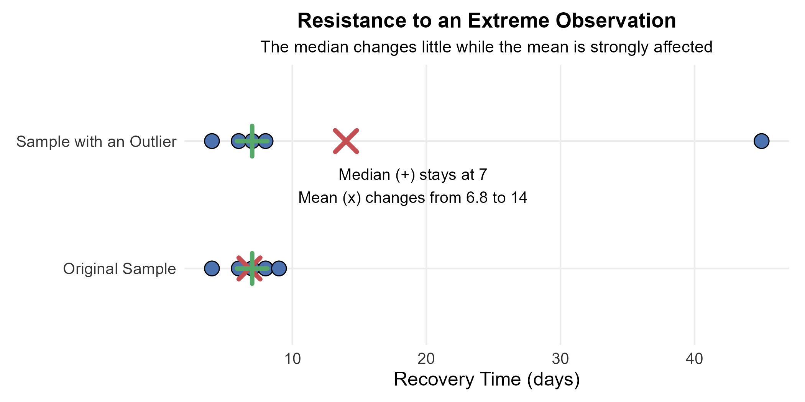
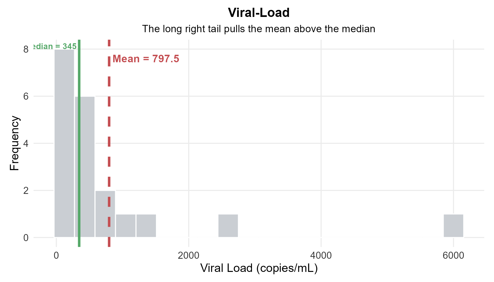
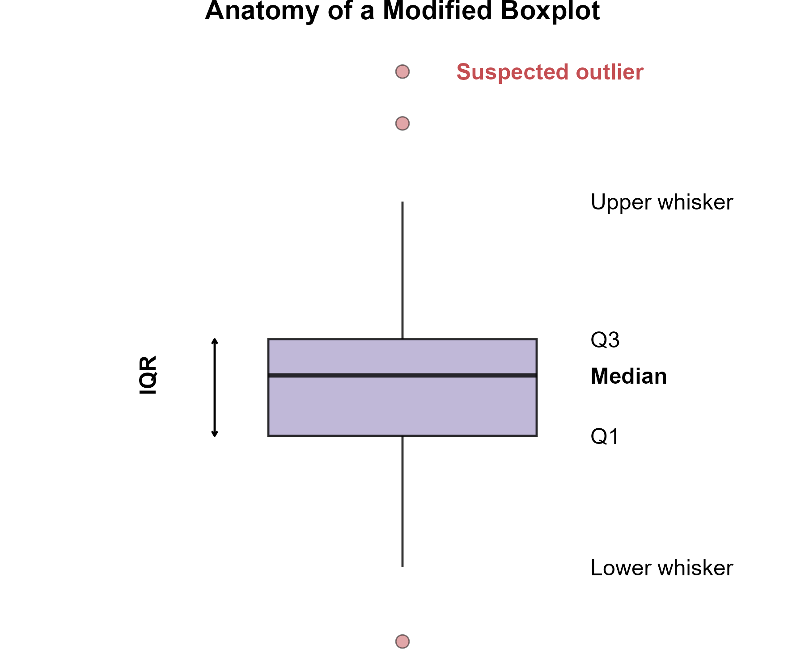
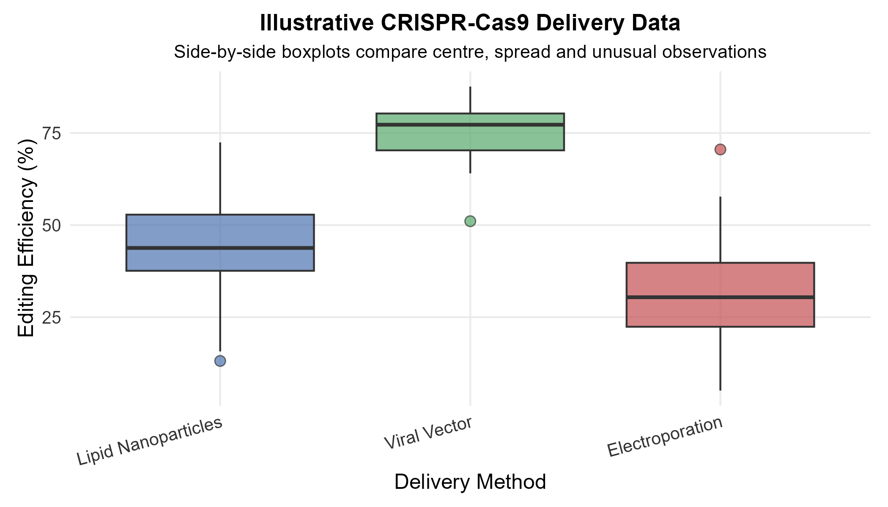
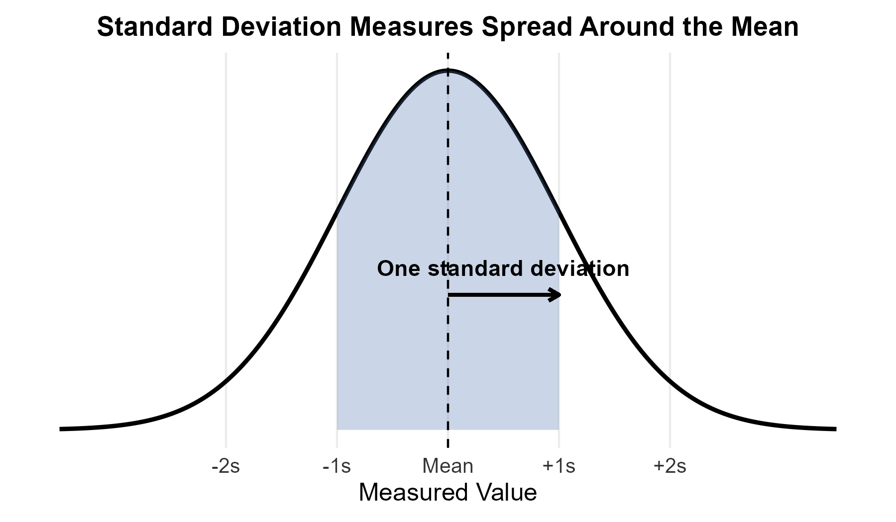

<style>
/* ============================================================
   CHAPTER 2 — PAGE + COLLAPSIBLE TABLE OF CONTENTS
   ============================================================ */

:root {
  --toc-width: 300px;
  --toc-collapsed-gutter: 72px;
  --chapter-width: 1100px;

  --ink: #23364a;
  --accent: #2c3e50;
  --line: #d8dee4;
  --soft: #f6f8fa;
  --toc-background: #f7f9fb;
}


/* ============================================================
   GENERAL PAGE
   ============================================================ */

html {
  scroll-behavior: smooth;
}

body {
  font-size: 17px;
  line-height: 1.65;
  color: var(--ink);
}

.main-container {
  max-width: var(--chapter-width) !important;
}


/* ============================================================
   HIDE THE CHAPTER TITLE FROM THE MAIN CONTENT
   ============================================================ */

/*
   Chapter 2 is the visible chapter heading. Pandoc applies a section-number offset of 1 so that its subsections begin at 2.1.

   Hide the visible "Chapter 2" H1 because the document title
   already says Chapter 2, but KEEP the section itself so that
   H2 headings are numbered 2.1, 2.2, 2.3, ...
*/
.section.chapter-root > h1 {
  display: none !important;
}


/* ============================================================
   HIDE THE CHAPTER 2 PARENT FROM THE TABLE OF CONTENTS
   ============================================================ */


/*
   Hide the Chapter 2 parent entry itself so that only the numbered subsections appear in the floating table of contents.

   Its children — 2.1, 2.2, 2.3, ... — remain visible.
*/
#TOC li:has(> a[href="#chapter-2-describing-distributions-with-numbers"]) >
  a[href="#chapter-2-describing-distributions-with-numbers"] {
  display: none !important;
}


/*
   tocify may place the Chapter 2 subsections inside the same
   list item. Remove spacing belonging to the hidden parent.
*/
#TOC li:has(> a[href="#chapter-2-describing-distributions-with-numbers"]) {
  margin-top: 0 !important;
}


/* ============================================================
   ACCESSIBILITY
   ============================================================ */

.sr-only {
  position: absolute;
  width: 1px;
  height: 1px;
  padding: 0;
  margin: -1px;
  overflow: hidden;
  clip: rect(0, 0, 0, 0);
  white-space: nowrap;
  border: 0;
}


/* ============================================================
   SIDEBAR TOGGLE BUTTON
   ============================================================ */

#toc-toggle {
  position: fixed;

  top: 16px;
  left: calc(var(--toc-width) + 14px);

  width: 42px;
  height: 42px;

  display: flex;
  align-items: center;
  justify-content: center;

  padding: 0;

  border: 1px solid #c7d0d9;
  border-radius: 8px;

  background: #ffffff;
  color: var(--ink);

  box-shadow: 0 2px 8px rgba(24, 39, 55, 0.13);

  cursor: pointer;

  font-size: 24px;
  line-height: 1;

  z-index: 1200;

  transition:
    left 0.25s ease,
    background-color 0.2s ease,
    box-shadow 0.2s ease,
    transform 0.2s ease;
}

#toc-toggle:hover {
  background: #eef3f7;
  box-shadow: 0 3px 10px rgba(24, 39, 55, 0.18);
}

#toc-toggle:focus-visible {
  outline: 3px solid rgba(44, 62, 80, 0.28);
  outline-offset: 2px;
}


/* Open/close icons */

#toc-toggle .menu-icon {
  display: none;
}

#toc-toggle .close-icon {
  display: inline;
}


/* Button position when sidebar is collapsed */

body.toc-collapsed #toc-toggle {
  left: 14px;
}

body.toc-collapsed #toc-toggle .menu-icon {
  display: inline;
}

body.toc-collapsed #toc-toggle .close-icon {
  display: none;
}


/* ============================================================
   DESKTOP LAYOUT
   ============================================================ */

@media screen and (min-width: 992px) {

  /*
     Make room for fixed sidebar.
  */
  .main-container {
    width: 100% !important;
    max-width: none !important;

    padding-left: calc(var(--toc-width) + 30px) !important;
    padding-right: 35px !important;

    box-sizing: border-box !important;

    transition: padding-left 0.25s ease;
  }


  /*
     When sidebar is collapsed, reclaim almost all of the space.
  */
  body.toc-collapsed .main-container {
    padding-left: var(--toc-collapsed-gutter) !important;
  }


  /*
     Bootstrap normally reserves a column for the TOC.
     The TOC is fixed now, so remove that reserved column.
  */
  .main-container > .row-fluid > .col-xs-12.col-sm-4.col-md-3,
  .main-container > .row > .col-xs-12.col-sm-4.col-md-3 {
    width: 0 !important;
    min-height: 0 !important;
    padding: 0 !important;
    margin: 0 !important;
  }


  /* ----------------------------------------------------------
     FLOATING TOC
     ---------------------------------------------------------- */

  #TOC,
  #TOC.tocify {
    position: fixed !important;

    top: 0 !important;
    bottom: 0 !important;
    left: 0 !important;

    width: var(--toc-width) !important;
    max-height: 100vh !important;

    box-sizing: border-box !important;

    overflow-y: auto !important;
    overflow-x: hidden !important;

    margin: 0 !important;
    padding: 72px 16px 28px 18px !important;

    background: var(--toc-background) !important;

    border: 0 !important;
    border-right: 1px solid var(--line) !important;
    border-radius: 0 !important;

    box-shadow: none !important;

    z-index: 1100 !important;

    transform: translateX(0);

    transition: transform 0.25s ease;
  }


  /*
     Completely slide sidebar off screen when collapsed.
  */
  body.toc-collapsed #TOC,
  body.toc-collapsed #TOC.tocify {
    transform: translateX(calc(-1 * var(--toc-width)));
  }


  /*
     Allow long section headings to wrap rather than getting
     clipped.
  */
  #TOC a {
    white-space: normal !important;
    overflow-wrap: break-word !important;
    word-break: normal !important;
  }


  /* ----------------------------------------------------------
     TOC TYPOGRAPHY
     ---------------------------------------------------------- */

  #TOC .tocify-item {
    border-radius: 4px;
  }

  #TOC .tocify-item a {
    color: var(--ink);
    text-decoration: none;
  }

  #TOC .tocify-item:hover {
    background: #e9eef3;
  }

  #TOC .tocify-item.active {
    background: var(--accent) !important;
  }

  #TOC .tocify-item.active a {
    color: #ffffff !important;
  }


  /* ----------------------------------------------------------
     MAIN CHAPTER CONTENT
     ---------------------------------------------------------- */

  .toc-content,
  .toc-content.col-xs-12.col-sm-8.col-md-9 {
    width: 100% !important;
    max-width: var(--chapter-width) !important;

    float: none !important;

    margin-left: auto !important;
    margin-right: auto !important;

    padding-left: 15px !important;
    padding-right: 15px !important;

    box-sizing: border-box !important;
  }


  /*
     Fallback for Pandoc output that does not use Bootstrap's
     normal R Markdown container structure.
  */
  body.standalone-pandoc {
    width: calc(100% - var(--toc-width)) !important;
    max-width: none !important;

    box-sizing: border-box !important;

    margin: 0 0 0 var(--toc-width) !important;
    padding: 50px 45px !important;

    transition:
      width 0.25s ease,
      margin-left 0.25s ease,
      padding-left 0.25s ease;
  }

  body.standalone-pandoc.toc-collapsed {
    width: 100% !important;

    margin-left: 0 !important;
    padding-left: var(--toc-collapsed-gutter) !important;
  }

  body.standalone-pandoc > header,
  body.standalone-pandoc > section {
    max-width: var(--chapter-width);

    margin-left: auto;
    margin-right: auto;
  }
}


/* ============================================================
   MOBILE / TABLET
   ============================================================ */

@media screen and (max-width: 991px) {

  .main-container {
    width: auto !important;
    max-width: var(--chapter-width) !important;

    margin-left: auto !important;
    margin-right: auto !important;

    padding: 70px 18px 24px !important;

    box-sizing: border-box !important;
  }


  /*
     Toggle remains at upper-left on mobile.
  */
  #toc-toggle,
  body.toc-collapsed #toc-toggle {
    left: 12px;
  }


  /*
     Mobile starts with menu icon.
  */
  #toc-toggle .menu-icon,
  body.toc-collapsed #toc-toggle .menu-icon {
    display: inline;
  }

  #toc-toggle .close-icon,
  body.toc-collapsed #toc-toggle .close-icon {
    display: none;
  }


  /*
     Show X while the mobile TOC is open.
  */
  body.toc-mobile-open #toc-toggle .menu-icon {
    display: none;
  }

  body.toc-mobile-open #toc-toggle .close-icon {
    display: inline;
  }


  /* ----------------------------------------------------------
     MOBILE TOC DRAWER
     ---------------------------------------------------------- */

  #TOC,
  #TOC.tocify {
    position: fixed !important;

    top: 0 !important;
    bottom: 0 !important;
    left: 0 !important;

    width: min(84vw, 320px) !important;
    max-height: 100vh !important;

    box-sizing: border-box !important;

    overflow-y: auto !important;
    overflow-x: hidden !important;

    margin: 0 !important;
    padding: 72px 18px 28px !important;

    background: var(--toc-background) !important;

    border: 0 !important;
    border-right: 1px solid var(--line) !important;
    border-radius: 0 !important;

    z-index: 1100 !important;

    transform: translateX(-105%);

    transition: transform 0.25s ease;
  }

  body.toc-mobile-open #TOC,
  body.toc-mobile-open #TOC.tocify {
    transform: translateX(0);

    box-shadow: 6px 0 18px rgba(24, 39, 55, 0.16);
  }


  /*
     Prevent long headings from being clipped.
  */
  #TOC a {
    white-space: normal !important;
    overflow-wrap: break-word !important;
    word-break: normal !important;
  }


  body.standalone-pandoc {
    width: auto !important;
    max-width: var(--chapter-width) !important;

    margin: 0 auto !important;
    padding: 70px 18px 24px !important;

    box-sizing: border-box !important;
  }
}


/* ============================================================
   SECTION HEADINGS
   ============================================================ */

h1,
h2,
h3,
h4,
h5 {
  margin-top: 1.6em;
}

h2 {
  border-bottom: 3px solid var(--accent);
  padding-bottom: 0.25em;
}

h3 {
  border-bottom: 1px solid var(--line);
  padding-bottom: 0.2em;
}


/* ============================================================
   BLOCKQUOTES / DEFINITION BOXES
   ============================================================ */

blockquote {
  border-left: 4px solid var(--accent);

  background: #f7f9fa;

  padding: 0.7em 1em;
  margin-top: 1.2em;
  margin-bottom: 1.2em;
}


/* ============================================================
   TABLES
   ============================================================ */

table {
  width: 100%;

  margin: 1.35em auto;

  border-collapse: separate !important;
  border-spacing: 0;

  background: #ffffff;

  border: 1px solid #d6dde5;
  border-radius: 8px;

  overflow: hidden;

  box-shadow: 0 2px 8px rgba(24, 39, 55, 0.06);
}

table thead th {
  padding: 0.72em 0.9em !important;

  background: var(--accent);
  color: #ffffff;

  border: 0 !important;
  border-bottom: 1px solid #1e2d3b !important;

  font-weight: 700;

  vertical-align: middle !important;
}

table tbody td {
  padding: 0.65em 0.9em !important;

  border: 0 !important;
  border-bottom: 1px solid #e5e9ee !important;

  vertical-align: middle !important;
}

table tbody tr:nth-child(even) td {
  background: #f7f9fb;
}

table tbody tr:hover td {
  background: #eef4f8;
}

table tbody tr:last-child td {
  border-bottom: 0 !important;
}


/* ============================================================
   IMAGES
   ============================================================ */

img {
  display: block;

  max-width: 100%;
  height: auto;

  margin: 1.4em auto;

  border: 1px solid #e1e4e8;
  border-radius: 7px;
}


/* ============================================================
   MATHEMATICS
   ============================================================ */

.math.display {
  overflow-x: auto;
}


/* ============================================================
   HIDE R MARKDOWN CODE-FOLDING UI
   ============================================================ */

.btn-code,
.code-folding-btn,
div.btn-group.pull-right {
  display: none !important;
}
</style>

<button id="toc-toggle"
        type="button"
        aria-label="Toggle table of contents"
        aria-expanded="true">
  <span class="menu-icon" aria-hidden="true">&#9776;</span>
  <span class="close-icon" aria-hidden="true">&times;</span>
  <span class="sr-only">Toggle table of contents</span>
</button>

<script>
document.addEventListener("DOMContentLoaded", function () {
  const button = document.getElementById("toc-toggle");

  if (!button) return;

  button.addEventListener("click", function () {
    if (window.innerWidth <= 991) {
      document.body.classList.toggle("toc-mobile-open");

      const isOpen =
        document.body.classList.contains("toc-mobile-open");

      button.setAttribute("aria-expanded", isOpen);
    } else {
      document.body.classList.toggle("toc-collapsed");

      const isOpen =
        !document.body.classList.contains("toc-collapsed");

      button.setAttribute("aria-expanded", isOpen);
    }
  });
});
</script>


```{r generate_all_lecture_figures, include=FALSE, echo=FALSE, warning=FALSE, message=FALSE}
knitr::opts_chunk$set(
  echo = FALSE,
  warning = FALSE,
  message = FALSE,
  error = FALSE
)

# ggplot2 is used only to create the lecture figures that are saved as PNG files.
# Students do not need ggplot2 to complete the visible R examples in this chapter.
if (!requireNamespace("ggplot2", quietly = TRUE)) {
  stop("Install the ggplot2 package before knitting this chapter.")
}

suppressPackageStartupMessages({
  library(ggplot2)
})

set.seed(123)

# A shared theme keeps all lecture figures visually consistent.
lecture_theme <- theme_minimal(base_size = 11) +
  theme(
    plot.title = element_text(size = 13, face = "bold", hjust = 0.5),
    plot.subtitle = element_text(size = 10.5, hjust = 0.5),
    axis.title = element_text(size = 12),
    axis.text = element_text(size = 10, colour = "#333333"),
    panel.grid.minor = element_blank(),
    plot.background = element_rect(fill = "white", colour = NA),
    panel.background = element_rect(fill = "white", colour = NA),
    plot.margin = margin(8, 10, 8, 10)
  )

palette_main <- c("#4C72B0", "#55A868", "#C44E52", "#8172B2", "#CCB974")

# This helper saves each figure at a consistent resolution.
save_plot <- function(filename, plot, width, height) {
  ggsave(
    filename = filename,
    plot = plot,
    width = width,
    height = height,
    units = "in",
    dpi = 300,
    bg = "white"
  )
}

# =============================================================
# Figure 1: Mean and median in a right-skewed viral-load dataset
# =============================================================

# These are illustrative viral-load measurements in copies per mL.
# The same values are shown to students in the worked example below.
viral_load <- c(
  120, 140, 160, 180, 200,
  220, 250, 270, 300, 330,
  360, 400, 450, 520, 600,
  750, 900, 1300, 2500, 6000
)

viral_df <- data.frame(load = viral_load)

viral_mean <- mean(viral_load)
viral_median <- median(viral_load)

p_skewed <- ggplot(viral_df, aes(x = load)) +
  geom_histogram(
    bins = 20,
    fill = "#caced3",
    colour = "white"
  ) +
  geom_vline(
    xintercept = viral_median,
    colour = palette_main[2],
    linewidth = 1.2
  ) +
  geom_vline(
    xintercept = viral_mean,
    colour = palette_main[3],
    linewidth = 1.2,
    linetype = "dashed"
  ) +
  annotate(
    "text",
    x = viral_median,
    y = Inf,
    label = paste0("Median = ", viral_median),
    colour = palette_main[2],
    size = 3,
    vjust = 1.6,
    hjust = 1.05,
    fontface = "bold"
  ) +
  annotate(
    "text",
    x = viral_mean,
    y = Inf,
    label = paste0("Mean = ", round(viral_mean, 1)),
    colour = palette_main[3],
    vjust = 3.0,
    hjust = -0.05,
    fontface = "bold"
  ) +
  labs(
    title = "Viral-Load",
    subtitle = "The long right tail pulls the mean above the median",
    x = "Viral Load (copies/mL)",
    y = "Frequency"
  ) +
  lecture_theme

save_plot(
  "fig_ch2_skewed_mean_median.png",
  p_skewed,
  width = 7,
  height = 4
)

# =============================================================
# Figure 2: Resistance to an outlier
# =============================================================

base_data <- c(4, 6, 7, 8, 9)
outlier_data <- c(4, 6, 7, 8, 45)

df_resist <- data.frame(
  Value = c(base_data, outlier_data),
  Group = factor(
    rep(c("Original Sample", "Sample with an Outlier"), each = 5),
    levels = c("Original Sample", "Sample with an Outlier")
  )
)

summary_points <- data.frame(
  Group = factor(
    rep(c("Original Sample", "Sample with an Outlier"), times = 2),
    levels = levels(df_resist$Group)
  ),
  Statistic = rep(c("Mean", "Median"), each = 2),
  Value = c(
    mean(base_data),
    mean(outlier_data),
    median(base_data),
    median(outlier_data)
  )
)

p_resist <- ggplot(df_resist, aes(x = Value, y = Group)) +
  geom_point(
    size = 4,
    fill = palette_main[1],
    colour = "black",
    shape = 21
  ) +
  geom_point(
    data = subset(summary_points, Statistic == "Mean"),
    aes(x = Value, y = Group),
    shape = 4,
    size = 5,
    colour = palette_main[3],
    stroke = 2
  ) +
  geom_point(
    data = subset(summary_points, Statistic == "Median"),
    aes(x = Value, y = Group),
    shape = 3,
    size = 5,
    colour = palette_main[2],
    stroke = 2
  ) +
  annotate(
    "text",
    x = 19,
    y = 1.65,
    label = "Median (+) stays at 7\nMean (x) changes from 6.8 to 14",
    size = 3.5
  ) +
  labs(
    title = "Resistance to an Extreme Observation",
    subtitle = "The median changes little while the mean is strongly affected",
    x = "Recovery Time (days)",
    y = NULL
  ) +
  lecture_theme

save_plot(
  "fig_ch2_resistance.png",
  p_resist,
  width = 7,
  height = 3.5
)

# =============================================================
# Figure 3: Anatomy of a modified boxplot
# =============================================================

set.seed(321)
box_data <- c(rnorm(100, mean = 50, sd = 10), 15, 85, 92)
box_stats <- boxplot.stats(box_data)

box_df <- data.frame(
  value = box_data,
  group = factor("Sample")
)

p_box_anatomy <- ggplot(box_df, aes(x = group, y = value)) +
  geom_boxplot(
    width = 0.4,
    fill = palette_main[4],
    alpha = 0.5,
    outlier.shape = 21,
    outlier.size = 3,
    outlier.fill = palette_main[3]
  ) +
  annotate(
    "text",
    x = 1.28,
    y = median(box_data),
    label = "Median",
    fontface = "bold",
    hjust = 0
  ) +
  annotate(
    "text",
    x = 1.28,
    y = unname(quantile(box_data, 0.75)),
    label = "Q3",
    hjust = 0
  ) +
  annotate(
    "text",
    x = 1.28,
    y = unname(quantile(box_data, 0.25)),
    label = "Q1",
    hjust = 0
  ) +
  annotate(
    "text",
    x = 1.28,
    y = box_stats[["stats"]][5],
    label = "Upper whisker",
    hjust = 0
  ) +
  annotate(
    "text",
    x = 1.28,
    y = box_stats[["stats"]][1],
    label = "Lower whisker",
    hjust = 0
  ) +
  annotate(
    "text",
    x = 1.08,
    y = max(box_stats[["out"]]),
    label = "Suspected outlier",
    colour = palette_main[3],
    fontface = "bold",
    hjust = 0
  ) +
  annotate(
    "segment",
    x = 0.72,
    xend = 0.72,
    y = unname(quantile(box_data, 0.25)),
    yend = unname(quantile(box_data, 0.75)),
    arrow = arrow(
      ends = "both",
      length = grid::unit(0.1, "cm")
    )
  ) +
  annotate(
    "text",
    x = 0.62,
    y = median(box_data),
    label = "IQR",
    angle = 90,
    fontface = "bold"
  ) +
  theme_void(base_size = 12) +
  labs(title = "Anatomy of a Modified Boxplot") +
  theme(
    plot.title = element_text(
      face = "bold",
      hjust = 0.5,
      margin = margin(b = 10)
    )
  )

save_plot(
  "fig_ch2_boxplot_anatomy.png",
  p_box_anatomy,
  width = 6,
  height = 5
)

# =============================================================
# Figure 4: Side-by-side boxplots for illustrative CRISPR data
# =============================================================

set.seed(42)

crispr_df <- data.frame(
  Method = factor(
    rep(
      c(
        "Lipid Nanoparticles",
        "Viral Vector",
        "Electroporation"
      ),
      each = 40
    ),
    levels = c(
      "Lipid Nanoparticles",
      "Viral Vector",
      "Electroporation"
    )
  ),
  Efficiency = c(
    rnorm(40, 45, 12),
    rnorm(40, 75, 8),
    rnorm(40, 30, 15)
  )
)

# Editing efficiency is a percentage, so simulated values are restricted to 0-100.
crispr_df$Efficiency <- pmax(
  0,
  pmin(100, crispr_df$Efficiency)
)

p_side_box <- ggplot(
  crispr_df,
  aes(x = Method, y = Efficiency, fill = Method)
) +
  geom_boxplot(
    alpha = 0.7,
    outlier.shape = 21,
    outlier.size = 2.5
  ) +
  scale_fill_manual(values = palette_main[1:3]) +
  labs(
    title = "Illustrative CRISPR-Cas9 Delivery Data",
    subtitle = "Side-by-side boxplots compare centre, spread and unusual observations",
    x = "Delivery Method",
    y = "Editing Efficiency (%)"
  ) +
  lecture_theme +
  theme(
    legend.position = "none",
    axis.text.x = element_text(angle = 15, hjust = 1)
  )

save_plot(
  "fig_ch2_side_by_side_boxplots.png",
  p_side_box,
  width = 7,
  height = 4
)

# =============================================================
# Figure 5: Understanding one standard deviation
# =============================================================

x_val <- seq(-3.5, 3.5, length.out = 1000)
sd_df <- data.frame(
  x = x_val,
  y = dnorm(x_val)
)

p_sd <- ggplot(sd_df, aes(x = x, y = y)) +
  geom_line(linewidth = 1) +
  geom_area(
    data = subset(sd_df, x >= -1 & x <= 1),
    fill = palette_main[1],
    alpha = 0.3
  ) +
  geom_vline(
    xintercept = 0,
    linetype = "dashed"
  ) +
  geom_segment(
    aes(
      x = 0,
      y = 0.15,
      xend = 1,
      yend = 0.15
    ),
    arrow = arrow(length = grid::unit(0.2, "cm")),
    linewidth = 0.8,
    colour = "black"
  ) +
  annotate(
    "text",
    x = 0.5,
    y = 0.18,
    label = "One standard deviation",
    fontface = "bold"
  ) +
  scale_x_continuous(
    breaks = c(-2, -1, 0, 1, 2),
    labels = c("-2s", "-1s", "Mean", "+1s", "+2s")
  ) +
  scale_y_continuous(breaks = NULL) +
  labs(
    title = "Standard Deviation Measures Spread Around the Mean",
    x = "Measured Value",
    y = NULL
  ) +
  lecture_theme

save_plot(
  "fig_ch2_standard_deviation.png",
  p_sd,
  width = 6,
  height = 3.5
)
```

# Chapter 2: Describing Distributions with Numbers {.chapter-root .unlisted}

## Describing Distributions with Numbers

Chapter 1 introduced graphs for describing the distribution of a variable. Histograms, dotplots and other displays help reveal shape, unusual observations, centre and spread. A graph should usually be the first step because a numerical summary alone can hide important features of the data.

Numerical summaries provide a second description of the same distribution. They allow researchers to communicate the centre and variability of a dataset using values that can be reproduced exactly.

This chapter develops two pairs of summaries. The **mean and standard deviation** are commonly used for reasonably symmetric distributions without strong outliers. The **median and interquartile range** are more resistant and are often preferred for skewed distributions or distributions with extreme observations.

> **A useful workflow**
>
> The graph comes first. The numerical summaries should then be chosen to match the shape and unusual features visible in the graph.

### From a Graph to Numerical Summaries

A visual description often follows the ideas of **shape, outliers, centre and spread**. Numerical summaries turn the last two ideas into quantities that can be calculated.

A measure of **centre** describes where the distribution is located. A measure of **spread** describes how much the observations vary around that centre.

The choice of numerical summary should not be made before the distribution is examined. The mean can be strongly influenced by an extreme observation, while the median is much more resistant. The same distinction will later appear between standard deviation and the interquartile range.

---

## Measuring Centre: Mean and Median

A researcher who asks for a typical pine needle length, a typical metabolic rate or a typical viral load is asking about the centre of a distribution. Two common measures of centre are the mean and the median.

### The Mean ($\bar{x}$)

The **sample mean** is the ordinary arithmetic average. Every observation contributes its numerical value to the calculation.

If the observations are $x_1,x_2,\ldots,x_n$, then

$$
\bar{x}
=
\frac{x_1+x_2+\cdots+x_n}{n}
$$

Summation notation provides a shorter form.

$$
\bar{x}
=
\frac{1}{n}\sum_{i=1}^{n}x_i
$$

The symbol $\bar{x}$ is pronounced **x-bar**. It represents the mean of a sample. Later in the course, the Greek letter $\mu$ will be used for a population mean.

#### Example 2.3: Mean of Pine Needle Lengths

**Question**

A sample contains 15 Aleppo pine needles with the following lengths in centimetres. What is the sample mean length?

| Observation | Length (cm) | Observation | Length (cm) | Observation | Length (cm) |
|:--:|--:|:--:|--:|:--:|--:|
| 1 | 7.2 | 6 | 9.0 | 11 | 10.2 |
| 2 | 7.6 | 7 | 9.0 | 12 | 10.9 |
| 3 | 8.5 | 8 | 9.3 | 13 | 11.3 |
| 4 | 8.5 | 9 | 9.4 | 14 | 12.1 |
| 5 | 8.7 | 10 | 9.4 | 15 | 12.8 |

**Explanation**

The mean uses all 15 measurements. The observations are added, then the total is divided by the sample size.

The total length is

$$
\sum_{i=1}^{15}x_i
=
143.9\text{ cm}
$$

**Solution**

$$
\bar{x}
=
\frac{143.9}{15}
\approx
9.59\text{ cm}
$$

The mean needle length is approximately 9.59 cm.

The calculation can also be performed in R.

```{r mean_aleppo, include=TRUE, echo=TRUE}
# The vector contains the 15 observed pine needle lengths in centimetres.
aleppo_needles <- c(
  7.2, 7.6, 8.5, 8.5, 8.7,
  9.0, 9.0, 9.3, 9.4, 9.4,
  10.2, 10.9, 11.3, 12.1, 12.8
)

# mean() calculates the arithmetic average.
mean(aleppo_needles)
```

The formula and the R calculation emphasize an important property: the mean uses the numerical value of every observation.

### The Median ($M$)

The **median** is the middle of the ordered data. It separates the observations into a lower part and an upper part.

For an odd number of observations, the median is the single middle observation after the data are sorted. Its position is

$$
\frac{n+1}{2}
$$

For an even number of observations, there are two middle observations. The median is the average of the values in positions $n/2$ and $n/2+1$.

The median is also the 50th percentile. With repeated values, it is more precise to say that at least half of the observations are no larger than the median and at least half are no smaller than the median.

#### Example 2.1: Aleppo Pine Needles with Odd $n$

**Question**

What is the median of the 15 Aleppo pine needle lengths?

**Explanation**

The data are already sorted. Because $n=15$ is odd, the median occurs at position

$$
\frac{15+1}{2}
=
8
$$

The eighth observation is 9.3 cm.

**Solution**

$$
M
=
9.3\text{ cm}
$$

The same result can be obtained in R.

```{r median_aleppo, include=TRUE, echo=TRUE}
# median() returns the middle value of the ordered data.
median(aleppo_needles)
```

#### Example 2.2: Torrey Pine Needles with Even $n$

**Question**

A sample contains 18 Torrey pine needle lengths.

21.2, 21.6, 21.7, 23.1, 23.7, 24.2, 24.2, 25.5, 26.6, 26.8, 28.9, 29.0, 29.7, 29.7, 30.2, 32.5, 33.7, 33.7

What is the median length?

**Explanation**

Because $n=18$ is even, the middle observations are the ninth and tenth values.

$$
x_{(9)}
=
26.6
$$

$$
x_{(10)}
=
26.8
$$

The median is their average.

**Solution**

$$
M
=
\frac{26.6+26.8}{2}
=
26.7\text{ cm}
$$

```{r median_torrey, include=TRUE, echo=TRUE}
# The vector contains the 18 Torrey pine needle lengths.
torrey_needles <- c(
  21.2, 21.6, 21.7, 23.1, 23.7, 24.2,
  24.2, 25.5, 26.6, 26.8, 28.9, 29.0,
  29.7, 29.7, 30.2, 32.5, 33.7, 33.7
)

# median() automatically handles an even sample size.
median(torrey_needles)
```

The mean and median can be close when a distribution is roughly symmetric. Their behaviour can be very different when the data contain an extreme observation.

---

## Comparing the Mean and Median: Resistance

A numerical summary is called **resistant** when a small number of extreme observations do not change it very much.

The median is resistant because it depends mainly on the order of the observations. The mean is non-resistant because every observed value enters directly into its calculation.

### An Extreme Recovery Time

**Question**

Consider the following two samples of recovery times.

Original sample:

4, 6, 7, 8, 9

Sample with one extreme recovery time:

4, 6, 7, 8, 45

How do the mean and median change?

**Explanation**

The central four values remain almost unchanged. Only the largest value changes substantially.

For the original sample,

$$
\bar{x}
=
6.8
$$

$$
M
=
7
$$

For the sample containing 45,

$$
\bar{x}
=
14
$$

$$
M
=
7
$$

**Solution**



The median remains at 7 days, while the mean changes from 6.8 days to 14 days. The median is therefore much more resistant to this extreme value.

| Statistic | Original sample | Sample with 45 days |
|:--|--:|--:|
| Median | 7 days | 7 days |
| Mean | 6.8 days | 14 days |

### Shape and the Choice of Centre

The resistance of the median explains why the shape of a distribution matters when choosing a measure of centre.

A long right tail contains unusually large observations. These values tend to pull the mean upward. A long left tail contains unusually small observations, which tend to pull the mean downward.

The relationship is a useful pattern rather than a universal mathematical rule for every possible distribution.

#### Illustrative Example: Viral Load and Skewness

**Question**

A laboratory records the following illustrative viral-load measurements in copies per mL for 20 patients.

| 120 | 140 | 160 | 180 | 200 |
|--:|--:|--:|--:|--:|
| 220 | 250 | 270 | 300 | 330 |
| 360 | 400 | 450 | 520 | 600 |
| 750 | 900 | 1300 | 2500 | 6000 |

What are the mean and median? Which measure better represents a typical value for this strongly right-skewed dataset?

**Explanation**

Most observations are below 1000 copies/mL, while a small number of observations are much larger. The values 2500 and 6000 create a long right tail.

The median depends on the middle observations.

$$
M
=
345
$$

The mean uses every value.

$$
\bar{x}
=
797.5
$$

The large observations in the right tail increase the mean substantially.

**Solution**



The median of 345 copies/mL provides a more resistant description of the centre of this dataset. The mean of 797.5 copies/mL is much larger because it is pulled toward the long right tail.

The calculation can be checked in R.

```{r viral_load_summary, include=TRUE, echo=TRUE}
# These values are the same illustrative viral-load data shown above.
viral_load <- c(
  120, 140, 160, 180, 200,
  220, 250, 270, 300, 330,
  360, 400, 450, 520, 600,
  750, 900, 1300, 2500, 6000
)

# Compare the two measures of centre.
mean(viral_load)
median(viral_load)
```

A useful summary is shown below.

| Distribution shape | Typical relationship | Preferred centre when the pattern is strong |
|:--|:--|:--|
| Roughly symmetric | Mean and median are often similar | Mean or median may both be informative |
| Strongly right-skewed | Mean is often above the median | Median |
| Strongly left-skewed | Mean is often below the median | Median |

The graph should still be examined before the summary is chosen.

---

## Measuring Spread: Quartiles and the IQR

A measure of centre does not describe how widely the observations vary. Two datasets can have the same median but very different amounts of spread.

Quartiles describe the positions that divide ordered data into lower and upper portions.

### Quartiles

The first quartile $Q_1$ is the 25th percentile and the third quartile $Q_3$ is the 75th percentile.

Different statistical software packages use slightly different interpolation rules for quartiles. For hand calculations in this course, the **median-of-halves convention** will be used unless another method is specified.

Under this convention:

1. The observations are sorted from smallest to largest.
2. The overall median is located.
3. For odd $n$, the overall median is excluded from the lower and upper halves.
4. The median of the lower half is $Q_1$.
5. The median of the upper half is $Q_3$.

#### Example 2.5: Quartiles with Odd $n$

**Question**

What are $Q_1$ and $Q_3$ for the 15 Aleppo pine needle lengths?

**Explanation**

The overall median is 9.3 cm. Because the sample size is odd, that value is excluded when the lower and upper halves are formed.

The lower half is

7.2, 7.6, 8.5, 8.5, 8.7, 9.0, 9.0

The upper half is

9.4, 9.4, 10.2, 10.9, 11.3, 12.1, 12.8

**Solution**

The middle value of the lower half is

$$
Q_1
=
8.5\text{ cm}
$$

The middle value of the upper half is

$$
Q_3
=
10.9\text{ cm}
$$

R can also summarize the data.

```{r summary_aleppo, include=TRUE, echo=TRUE}
# summary() reports the minimum, Q1, median, mean, Q3 and maximum.
summary(aleppo_needles)
```

R uses an interpolation rule for quartiles that can differ slightly from the hand-calculation convention used above. A small difference is therefore not necessarily an error.

#### Example 2.6: Quartiles with Even $n$

**Question**

What are $Q_1$ and $Q_3$ for the 18 Torrey pine needle lengths?

**Explanation**

The median lies between 26.6 and 26.8. The lower half contains the first nine observations and the upper half contains the final nine observations.

The middle observation of the lower half is 23.7 cm. The middle observation of the upper half is 29.7 cm.

**Solution**

$$
Q_1
=
23.7\text{ cm}
$$

$$
Q_3
=
29.7\text{ cm}
$$

```{r summary_torrey, include=TRUE, echo=TRUE}
# summary() gives R's numerical summary for the Torrey pine sample.
summary(torrey_needles)
```

### The Interquartile Range

The **interquartile range**, abbreviated IQR, measures the width of the middle 50% of the ordered data.

$$
IQR
=
Q_3-Q_1
$$

The IQR is resistant because the most extreme observations in the tails do not directly determine its value.

```{r iqr_examples, include=TRUE, echo=TRUE}
# IQR() calculates the interquartile range using R's quartile convention.
IQR(aleppo_needles)
IQR(torrey_needles)
```

### The Five-Number Summary

The five-number summary consists of

$$
\text{Minimum}
\quad
Q_1
\quad
\text{Median}
\quad
Q_3
\quad
\text{Maximum}
$$

These values describe the overall location and spread of the ordered data. A modified boxplot uses the quartiles together with the $1.5\times IQR$ rule to display suspected outliers separately.

---

## Boxplots

A **boxplot** provides a compact visual summary of a quantitative distribution. It is especially useful for comparing several groups.



### Reading a Modified Boxplot

The box extends from $Q_1$ to $Q_3$, so its height or width represents the IQR. The line inside the box marks the median.

The whiskers extend to the most extreme observations that remain within the outlier fences. Observations beyond the fences are shown separately as suspected outliers.

A point marked as a suspected outlier should be investigated rather than automatically deleted.

### Comparing Groups with Side-by-Side Boxplots

Side-by-side boxplots allow the centres, spreads and unusual observations of several groups to be compared on the same scale.

The figure below uses simulated editing-efficiency values only to illustrate how such a comparison can be read.



The comparison should focus on several features.

- The medians show differences in centre between the groups.
- The IQRs show differences in the spread of the middle 50%.
- The whiskers and separately plotted points show the behaviour of the tails.
- The amount of overlap helps describe how distinct or similar the group distributions appear.

The graph is descriptive. A difference between boxplots alone does not establish that one delivery method causes a better biological outcome.

---

## Identifying Suspected Outliers: The $1.5\times IQR$ Rule

A modified boxplot uses the IQR to define objective boundaries called **fences**.

The lower fence is

$$
Q_1-1.5(IQR)
$$

The upper fence is

$$
Q_3+1.5(IQR)
$$

An observation below the lower fence or above the upper fence is flagged as a suspected outlier.

The word **suspected** is important. The rule identifies an unusual numerical value. It does not determine whether the observation is a data-entry error, a measurement problem or a valid biological observation.

#### Example: Applying the Outlier Rule

**Question**

The following needle-length dataset contains an unusually large observation.

7.2, 7.6, 8.5, 8.5, 8.7, 9.0, 9.0, 9.3, 9.4, 9.4, 10.2, 10.9, 11.3, 12.1, 15.8

How can R identify observations outside the $1.5\times IQR$ fences?

**Explanation**

The first quartile, third quartile and IQR are calculated first. The two fences are then constructed. The final logical condition selects values that fall outside those boundaries.

**Solution**

```{r outlier_rule, include=TRUE, echo=TRUE}
# The vector contains the observed needle lengths.
needle_data <- c(
  7.2, 7.6, 8.5, 8.5, 8.7,
  9.0, 9.0, 9.3, 9.4, 9.4,
  10.2, 10.9, 11.3, 12.1, 15.8
)

# R's default quartile convention is used for this software calculation.
q1 <- quantile(needle_data, 0.25)
q3 <- quantile(needle_data, 0.75)
iqr_value <- IQR(needle_data)

# The lower and upper fences define the usual suspected-outlier region.
lower_fence <- q1 - 1.5 * iqr_value
upper_fence <- q3 + 1.5 * iqr_value

# Display both fences.
c(
  Lower_Fence = lower_fence,
  Upper_Fence = upper_fence
)

# Select observations outside either fence.
suspected_outliers <- needle_data[
  needle_data < lower_fence |
  needle_data > upper_fence
]

suspected_outliers
```

A flagged observation should be investigated scientifically before any decision is made about excluding it.

---

## Measuring Spread: Standard Deviation

The median is naturally paired with the IQR because both are resistant. The mean is commonly paired with the **standard deviation**, denoted by $s$ for a sample.

The standard deviation describes how much the observations vary around the sample mean. It is based on squared deviations from the mean, so large deviations receive substantial weight.



### Deviations, Variance and Standard Deviation

For observation $x_i$, the deviation from the sample mean is

$$
x_i-\bar{x}
$$

Positive deviations correspond to observations above the mean. Negative deviations correspond to observations below the mean.

The deviations always sum to zero.

$$
\sum_{i=1}^{n}(x_i-\bar{x})
=
0
$$

The deviations are squared so that positive and negative differences do not cancel.

The sample variance is

$$
s^2
=
\frac{1}{n-1}
\sum_{i=1}^{n}
(x_i-\bar{x})^2
$$

The sample standard deviation is the square root of the sample variance.

$$
s
=
\sqrt{
\frac{1}{n-1}
\sum_{i=1}^{n}
(x_i-\bar{x})^2
}
$$

The denominator $n-1$ reflects one degree of freedom used when the sample mean is estimated from the same data. Under the usual independent random-sampling model, dividing by $n-1$ makes the sample variance $s^2$ an unbiased estimator of the population variance $\sigma^2$.

The sample standard deviation itself is not exactly unbiased for $\sigma$, so it is better to interpret $n-1$ through the variance calculation.

### Example 2.7: Metabolic Rates

**Question**

The metabolic rates of seven men in a dieting study are measured in Calories per 24 hours.

1792, 1666, 1362, 1614, 1460, 1867, 1439

What are the sample variance and sample standard deviation?

**Explanation**

The first step is the sample mean.

$$
\bar{x}
=
\frac{11200}{7}
=
1600\text{ Cal}
$$

Each observation is compared with 1600. The deviations and squared deviations are shown below.

| Observation $x_i$ | Deviation $x_i-\bar{x}$ | Squared deviation $(x_i-\bar{x})^2$ |
|--:|--:|--:|
| 1792 | 192 | 36,864 |
| 1666 | 66 | 4,356 |
| 1362 | -238 | 56,644 |
| 1614 | 14 | 196 |
| 1460 | -140 | 19,600 |
| 1867 | 267 | 71,289 |
| 1439 | -161 | 25,921 |
| **Total** | **0** | **214,870** |

The sum of the deviations is zero, which is why the squared deviations are used to measure spread.

**Solution**

The sample variance is

$$
s^2
=
\frac{214870}{7-1}
=
35811.67\text{ Cal}^2
$$

The sample standard deviation is

$$
s
=
\sqrt{35811.67}
\approx
189.24\text{ Cal}
$$

The metabolic rates have a mean of 1600 Cal per day and a standard deviation of about 189.24 Cal.

R performs both calculations directly.

```{r metabolic_rate_sd, include=TRUE, echo=TRUE}
# The vector contains the seven observed metabolic rates.
metabolic_rates <- c(
  1792, 1666, 1362, 1614,
  1460, 1867, 1439
)

# var() calculates the sample variance using n - 1.
var(metabolic_rates)

# sd() calculates the sample standard deviation.
sd(metabolic_rates)
```

### Properties of Standard Deviation

Several properties help with interpretation.

- The value of $s$ measures spread around the sample mean.
- The value of $s$ is zero only when all observations are identical.
- The standard deviation has the same measurement units as the original data.
- The variance has squared units.
- The standard deviation is non-resistant because extreme observations create large squared deviations.

The phrase **average distance from the mean** can be useful as an informal intuition, but the standard deviation is not the ordinary arithmetic average of the absolute distances. Its formula is based on squared deviations.

---

## Choosing the Appropriate Numerical Summary

The graph should guide the choice of numerical summaries.

| Distribution | Centre | Spread | Reason |
|:--|:--|:--|:--|
| Roughly symmetric without strong outliers | Mean | Standard deviation | Both summaries use all observed values |
| Strongly skewed or containing extreme observations | Median | IQR | Both summaries are resistant |

This guideline does not replace scientific judgment. The context of the variable matters. Both sets of summaries can sometimes be reported when a fuller description is useful.

The important principle is that centre and spread should be reported as a pair. A centre without a measure of variability gives an incomplete description of a distribution.

---

## Chapter Summary

A clear numerical description of a quantitative distribution usually follows a consistent workflow.

1. **The distribution is plotted first.** Its shape and unusual observations should be examined before numerical summaries are selected.
2. **A measure of centre is chosen.** The mean is sensitive to extreme values, while the median is resistant.
3. **A matching measure of spread is chosen.** The standard deviation is commonly paired with the mean, while the IQR is commonly paired with the median.
4. **Quartiles and the five-number summary describe ordered positions.** They provide the foundation for boxplots.
5. **The $1.5\times IQR$ rule flags suspected outliers.** A flagged observation should be investigated rather than automatically removed.
6. **Side-by-side boxplots compare distributions across groups.** The comparison should consider centre, spread, tails and unusual observations.

A useful final question is: **Do the numerical summaries tell the same story as the graph?** When the graph and the chosen summaries disagree, the graph often reveals the reason.

### Looking Ahead to Chapter 3

Chapters 1 and 2 focus mainly on describing one variable at a time. Many scientific questions instead involve two quantitative variables measured on the same individuals.

Examples include whether blood pressure tends to change with drug dosage or whether body size is associated with another biological measurement.

Chapter 3 introduces scatterplots and correlation as tools for describing relationships between two quantitative variables.
