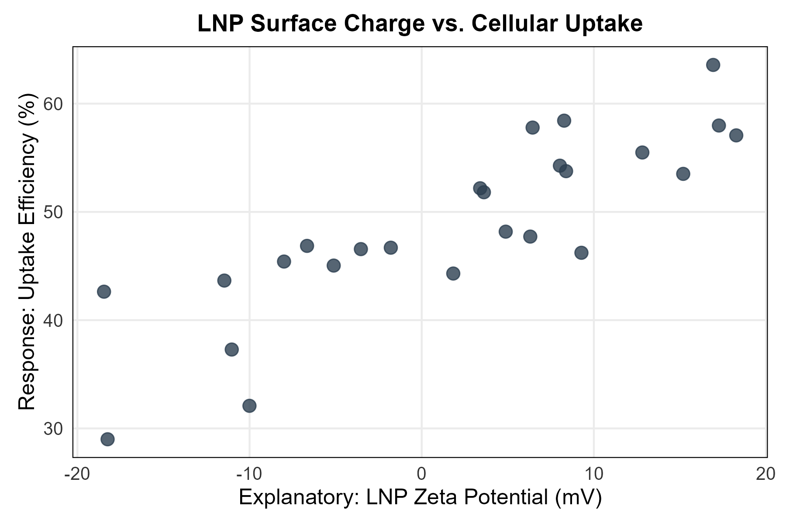
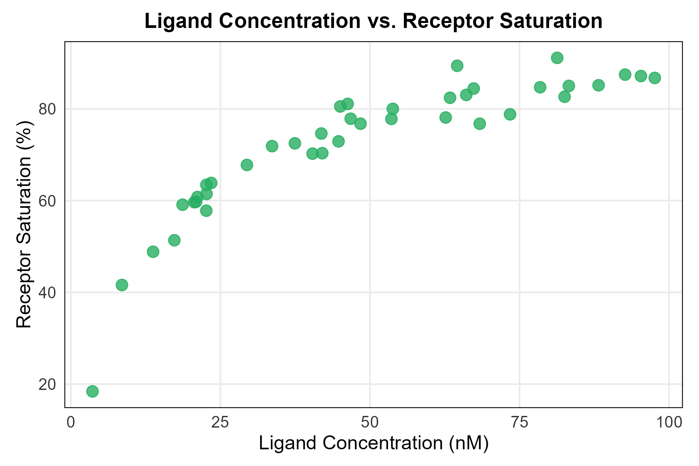
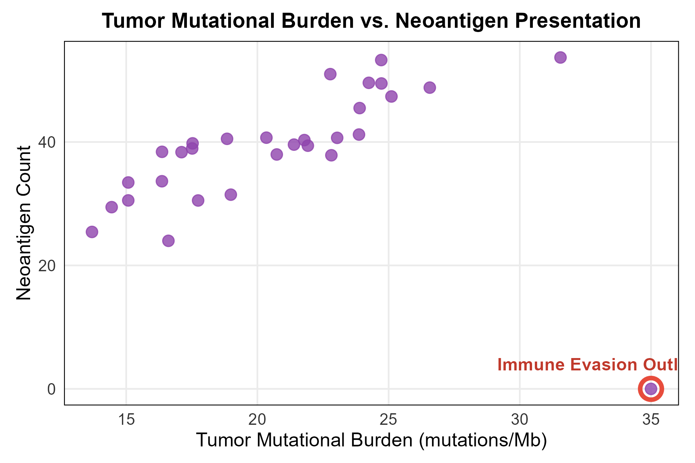
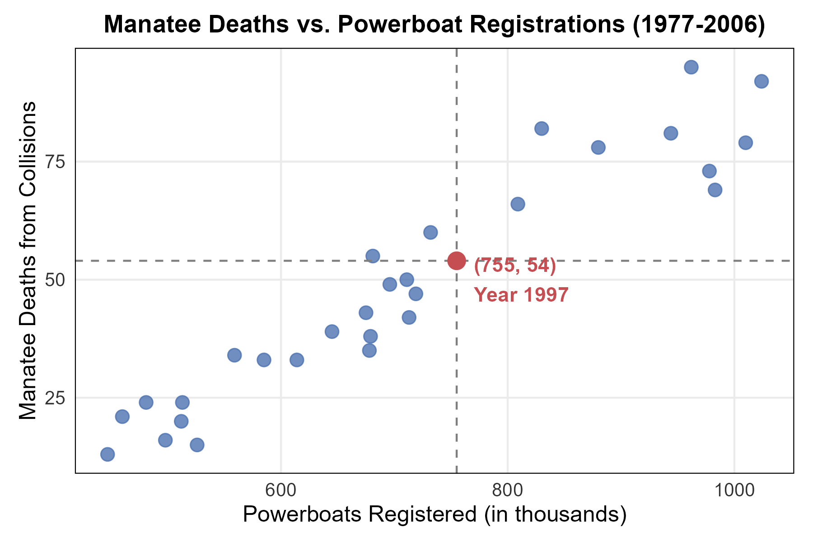
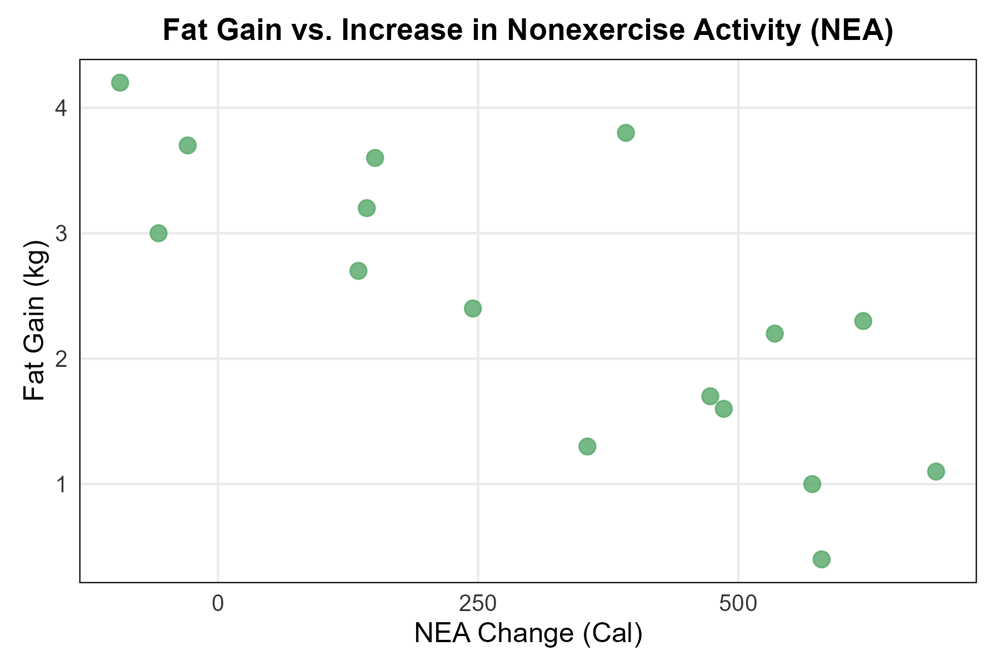
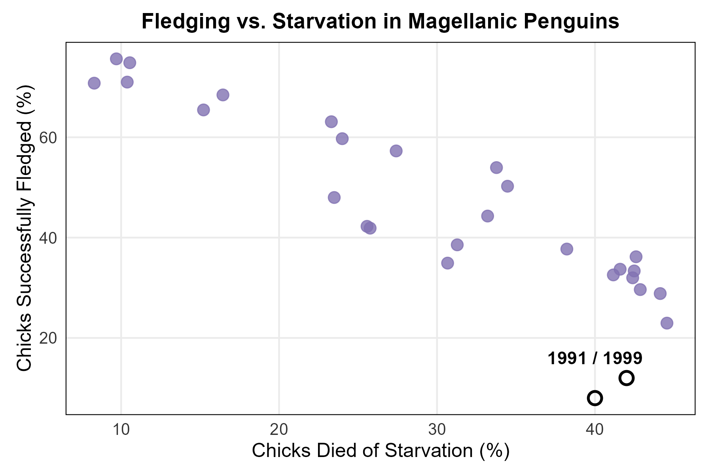
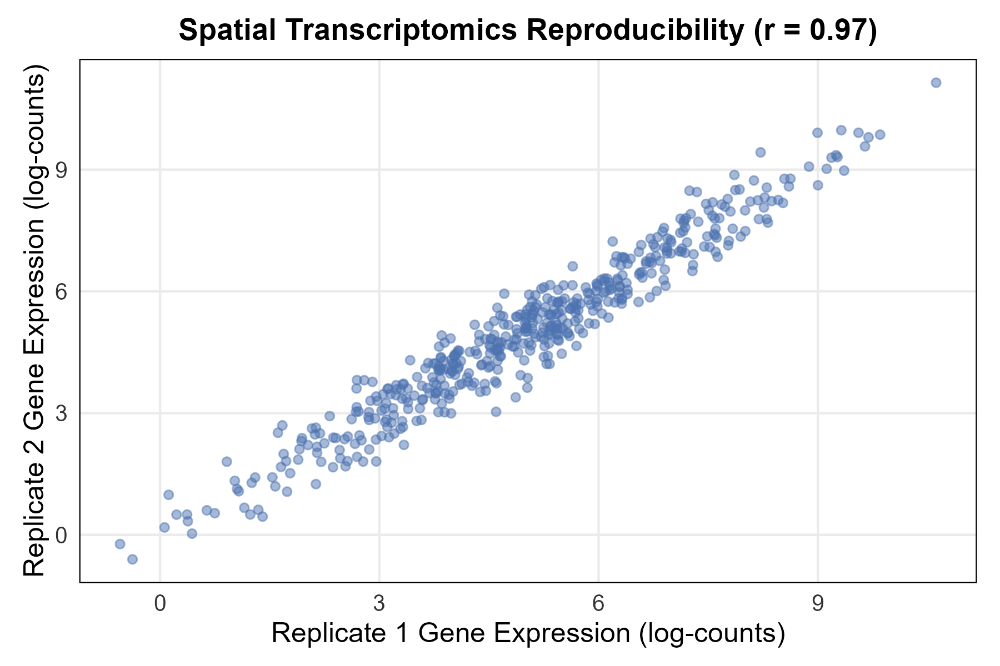
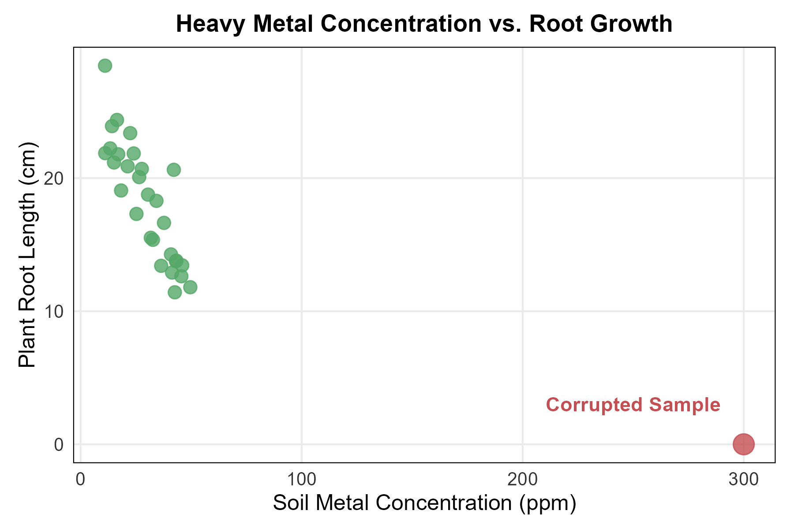

<style>
/* ============================================================
   CHAPTER 9 — PAGE + COLLAPSIBLE TABLE OF CONTENTS
   ============================================================ */

:root {
  --toc-width: 300px;
  --toc-collapsed-gutter: 72px;
  --chapter-width: 1100px;

  --ink: #23364a;
  --accent: #2c3e50;
  --line: #d8dee4;
  --soft: #f6f8fa;
  --toc-background: #f7f9fb;
}


/* ============================================================
   GENERAL PAGE
   ============================================================ */

html {
  scroll-behavior: smooth;
}

body {
  font-size: 17px;
  line-height: 1.65;
  color: var(--ink);
}

.main-container {
  max-width: var(--chapter-width) !important;
}


/* ============================================================
   HIDE DUMMY CHAPTER CONTENT
   ============================================================ */

/*
   Chapter 9 is used as the numbering root.

   Hide the visible "Chapter 9" H1 because the document title
   already says Chapter 9, but KEEP the section itself so that
   H2 headings are numbered 9.1, 9.2, 9.3, ...
*/
.section.chapter-root > h1 {
  display: none !important;
}


/* ============================================================
   HIDE CHAPTERS 1–8 FROM THE TABLE OF CONTENTS
   ============================================================ */

/*
   R Markdown/tocify does not reliably expose the chapter names
   through data-unique, so select them through their generated
   href values instead.
*/

#TOC li:has(a[href="#chapter-1-dummy"]),
#TOC li:has(a[href="#chapter-2-dummy"]),
#TOC li:has(a[href="#chapter-3-dummy"]),
#TOC li:has(a[href="#chapter-4-dummy"]),
#TOC li:has(a[href="#chapter-5-dummy"]),
#TOC li:has(a[href="#chapter-6-dummy"]),
#TOC li:has(a[href="#chapter-7-dummy"]),
#TOC li:has(a[href="#chapter-8-dummy"]) {
  display: none !important;
}


/*
   Also hide the Chapter 9 parent entry itself.

   Its children — 9.1, 9.2, 9.3, ... — remain visible.
*/
#TOC li:has(> a[href="#chapter-9"]) > a[href="#chapter-9"] {
  display: none !important;
}


/*
   tocify may place the Chapter 9 subsections inside the same
   list item. Remove spacing belonging to the hidden parent.
*/
#TOC li:has(> a[href="#chapter-9"]) {
  margin-top: 0 !important;
}


/* ============================================================
   ACCESSIBILITY
   ============================================================ */

.sr-only {
  position: absolute;
  width: 1px;
  height: 1px;
  padding: 0;
  margin: -1px;
  overflow: hidden;
  clip: rect(0, 0, 0, 0);
  white-space: nowrap;
  border: 0;
}


/* ============================================================
   SIDEBAR TOGGLE BUTTON
   ============================================================ */

#toc-toggle {
  position: fixed;

  top: 16px;
  left: calc(var(--toc-width) + 14px);

  width: 42px;
  height: 42px;

  display: flex;
  align-items: center;
  justify-content: center;

  padding: 0;

  border: 1px solid #c7d0d9;
  border-radius: 8px;

  background: #ffffff;
  color: var(--ink);

  box-shadow: 0 2px 8px rgba(24, 39, 55, 0.13);

  cursor: pointer;

  font-size: 24px;
  line-height: 1;

  z-index: 1200;

  transition:
    left 0.25s ease,
    background-color 0.2s ease,
    box-shadow 0.2s ease,
    transform 0.2s ease;
}

#toc-toggle:hover {
  background: #eef3f7;
  box-shadow: 0 3px 10px rgba(24, 39, 55, 0.18);
}

#toc-toggle:focus-visible {
  outline: 3px solid rgba(44, 62, 80, 0.28);
  outline-offset: 2px;
}


/* Open/close icons */

#toc-toggle .menu-icon {
  display: none;
}

#toc-toggle .close-icon {
  display: inline;
}


/* Button position when sidebar is collapsed */

body.toc-collapsed #toc-toggle {
  left: 14px;
}

body.toc-collapsed #toc-toggle .menu-icon {
  display: inline;
}

body.toc-collapsed #toc-toggle .close-icon {
  display: none;
}


/* ============================================================
   DESKTOP LAYOUT
   ============================================================ */

@media screen and (min-width: 992px) {

  /*
     Make room for fixed sidebar.
  */
  .main-container {
    width: 100% !important;
    max-width: none !important;

    padding-left: calc(var(--toc-width) + 30px) !important;
    padding-right: 35px !important;

    box-sizing: border-box !important;

    transition: padding-left 0.25s ease;
  }


  /*
     When sidebar is collapsed, reclaim almost all of the space.
  */
  body.toc-collapsed .main-container {
    padding-left: var(--toc-collapsed-gutter) !important;
  }


  /*
     Bootstrap normally reserves a column for the TOC.
     The TOC is fixed now, so remove that reserved column.
  */
  .main-container > .row-fluid > .col-xs-12.col-sm-4.col-md-3,
  .main-container > .row > .col-xs-12.col-sm-4.col-md-3 {
    width: 0 !important;
    min-height: 0 !important;
    padding: 0 !important;
    margin: 0 !important;
  }


  /* ----------------------------------------------------------
     FLOATING TOC
     ---------------------------------------------------------- */

  #TOC,
  #TOC.tocify {
    position: fixed !important;

    top: 0 !important;
    bottom: 0 !important;
    left: 0 !important;

    width: var(--toc-width) !important;
    max-height: 100vh !important;

    box-sizing: border-box !important;

    overflow-y: auto !important;
    overflow-x: hidden !important;

    margin: 0 !important;
    padding: 72px 16px 28px 18px !important;

    background: var(--toc-background) !important;

    border: 0 !important;
    border-right: 1px solid var(--line) !important;
    border-radius: 0 !important;

    box-shadow: none !important;

    z-index: 1100 !important;

    transform: translateX(0);

    transition: transform 0.25s ease;
  }


  /*
     Completely slide sidebar off screen when collapsed.
  */
  body.toc-collapsed #TOC,
  body.toc-collapsed #TOC.tocify {
    transform: translateX(calc(-1 * var(--toc-width)));
  }


  /*
     Allow long section headings to wrap rather than getting
     clipped.
  */
  #TOC a {
    white-space: normal !important;
    overflow-wrap: break-word !important;
    word-break: normal !important;
  }


  /* ----------------------------------------------------------
     TOC TYPOGRAPHY
     ---------------------------------------------------------- */

  #TOC .tocify-item {
    border-radius: 4px;
  }

  #TOC .tocify-item a {
    color: var(--ink);
    text-decoration: none;
  }

  #TOC .tocify-item:hover {
    background: #e9eef3;
  }

  #TOC .tocify-item.active {
    background: var(--accent) !important;
  }

  #TOC .tocify-item.active a {
    color: #ffffff !important;
  }


  /* ----------------------------------------------------------
     MAIN CHAPTER CONTENT
     ---------------------------------------------------------- */

  .toc-content,
  .toc-content.col-xs-12.col-sm-8.col-md-9 {
    width: 100% !important;
    max-width: var(--chapter-width) !important;

    float: none !important;

    margin-left: auto !important;
    margin-right: auto !important;

    padding-left: 15px !important;
    padding-right: 15px !important;

    box-sizing: border-box !important;
  }


  /*
     Fallback for Pandoc output that does not use Bootstrap's
     normal R Markdown container structure.
  */
  body.standalone-pandoc {
    width: calc(100% - var(--toc-width)) !important;
    max-width: none !important;

    box-sizing: border-box !important;

    margin: 0 0 0 var(--toc-width) !important;
    padding: 50px 45px !important;

    transition:
      width 0.25s ease,
      margin-left 0.25s ease,
      padding-left 0.25s ease;
  }

  body.standalone-pandoc.toc-collapsed {
    width: 100% !important;

    margin-left: 0 !important;
    padding-left: var(--toc-collapsed-gutter) !important;
  }

  body.standalone-pandoc > header,
  body.standalone-pandoc > section {
    max-width: var(--chapter-width);

    margin-left: auto;
    margin-right: auto;
  }
}


/* ============================================================
   MOBILE / TABLET
   ============================================================ */

@media screen and (max-width: 991px) {

  .main-container {
    width: auto !important;
    max-width: var(--chapter-width) !important;

    margin-left: auto !important;
    margin-right: auto !important;

    padding: 70px 18px 24px !important;

    box-sizing: border-box !important;
  }


  /*
     Toggle remains at upper-left on mobile.
  */
  #toc-toggle,
  body.toc-collapsed #toc-toggle {
    left: 12px;
  }


  /*
     Mobile starts with menu icon.
  */
  #toc-toggle .menu-icon,
  body.toc-collapsed #toc-toggle .menu-icon {
    display: inline;
  }

  #toc-toggle .close-icon,
  body.toc-collapsed #toc-toggle .close-icon {
    display: none;
  }


  /*
     Show X while the mobile TOC is open.
  */
  body.toc-mobile-open #toc-toggle .menu-icon {
    display: none;
  }

  body.toc-mobile-open #toc-toggle .close-icon {
    display: inline;
  }


  /* ----------------------------------------------------------
     MOBILE TOC DRAWER
     ---------------------------------------------------------- */

  #TOC,
  #TOC.tocify {
    position: fixed !important;

    top: 0 !important;
    bottom: 0 !important;
    left: 0 !important;

    width: min(84vw, 320px) !important;
    max-height: 100vh !important;

    box-sizing: border-box !important;

    overflow-y: auto !important;
    overflow-x: hidden !important;

    margin: 0 !important;
    padding: 72px 18px 28px !important;

    background: var(--toc-background) !important;

    border: 0 !important;
    border-right: 1px solid var(--line) !important;
    border-radius: 0 !important;

    z-index: 1100 !important;

    transform: translateX(-105%);

    transition: transform 0.25s ease;
  }

  body.toc-mobile-open #TOC,
  body.toc-mobile-open #TOC.tocify {
    transform: translateX(0);

    box-shadow: 6px 0 18px rgba(24, 39, 55, 0.16);
  }


  /*
     Prevent long headings from being clipped.
  */
  #TOC a {
    white-space: normal !important;
    overflow-wrap: break-word !important;
    word-break: normal !important;
  }


  body.standalone-pandoc {
    width: auto !important;
    max-width: var(--chapter-width) !important;

    margin: 0 auto !important;
    padding: 70px 18px 24px !important;

    box-sizing: border-box !important;
  }
}


/* ============================================================
   SECTION HEADINGS
   ============================================================ */

h1,
h2,
h3,
h4,
h5 {
  margin-top: 1.6em;
}

h2 {
  border-bottom: 3px solid var(--accent);
  padding-bottom: 0.25em;
}

h3 {
  border-bottom: 1px solid var(--line);
  padding-bottom: 0.2em;
}


/* ============================================================
   BLOCKQUOTES / DEFINITION BOXES
   ============================================================ */

blockquote {
  border-left: 4px solid var(--accent);

  background: #f7f9fa;

  padding: 0.7em 1em;
  margin-top: 1.2em;
  margin-bottom: 1.2em;
}


/* ============================================================
   TABLES
   ============================================================ */

table {
  width: 100%;

  margin: 1.35em auto;

  border-collapse: separate !important;
  border-spacing: 0;

  background: #ffffff;

  border: 1px solid #d6dde5;
  border-radius: 8px;

  overflow: hidden;

  box-shadow: 0 2px 8px rgba(24, 39, 55, 0.06);
}

table thead th {
  padding: 0.72em 0.9em !important;

  background: var(--accent);
  color: #ffffff;

  border: 0 !important;
  border-bottom: 1px solid #1e2d3b !important;

  font-weight: 700;

  vertical-align: middle !important;
}

table tbody td {
  padding: 0.65em 0.9em !important;

  border: 0 !important;
  border-bottom: 1px solid #e5e9ee !important;

  vertical-align: middle !important;
}

table tbody tr:nth-child(even) td {
  background: #f7f9fb;
}

table tbody tr:hover td {
  background: #eef4f8;
}

table tbody tr:last-child td {
  border-bottom: 0 !important;
}


/* ============================================================
   IMAGES
   ============================================================ */

img {
  display: block;

  max-width: 100%;
  height: auto;

  margin: 1.4em auto;

  border: 1px solid #e1e4e8;
  border-radius: 7px;
}


/* ============================================================
   MATHEMATICS
   ============================================================ */

.math.display {
  overflow-x: auto;
}


/* ============================================================
   HIDE R MARKDOWN CODE-FOLDING UI
   ============================================================ */

.btn-code,
.code-folding-btn,
div.btn-group.pull-right {
  display: none !important;
}
</style>

<button id="toc-toggle"
        type="button"
        aria-label="Toggle table of contents"
        aria-expanded="true">
  <span class="menu-icon" aria-hidden="true">&#9776;</span>
  <span class="close-icon" aria-hidden="true">&times;</span>
  <span class="sr-only">Toggle table of contents</span>
</button>

<script>
document.addEventListener("DOMContentLoaded", function () {
  const button = document.getElementById("toc-toggle");

  if (!button) return;

  button.addEventListener("click", function () {
    if (window.innerWidth <= 991) {
      document.body.classList.toggle("toc-mobile-open");

      const isOpen =
        document.body.classList.contains("toc-mobile-open");

      button.setAttribute("aria-expanded", isOpen);
    } else {
      document.body.classList.toggle("toc-collapsed");

      const isOpen =
        !document.body.classList.contains("toc-collapsed");

      button.setAttribute("aria-expanded", isOpen);
    }
  });
});
</script>

```{r generate_all_lecture_figures, include=FALSE, echo=FALSE, warning=FALSE, message=FALSE}
knitr::opts_chunk$set(
  echo = FALSE,
  warning = FALSE,
  message = FALSE,
  error = FALSE
)

required_packages <- c("ggplot2", "gridExtra", "dplyr", "tidyr")
missing_packages <- required_packages[
  !vapply(required_packages, requireNamespace, logical(1), quietly = TRUE)
]

if (length(missing_packages) > 0) {
  stop(
    "Install the following R packages before knitting: ",
    paste(missing_packages, collapse = ", ")
  )
}

suppressPackageStartupMessages({
  library(ggplot2)
  library(gridExtra)
  library(dplyr)
  library(tidyr)
})

set.seed(123) # Set seed for reproducible figures

# Shared publication-style theme and colour palette.
lecture_theme <- theme_minimal(base_size = 11) +
  theme(
    plot.title = element_text(size = 13, face = "bold", hjust = 0.5),
    axis.title = element_text(size = 12),
    axis.text = element_text(size = 10, colour = "#333333"),
    panel.grid.minor = element_blank(),
    plot.background = element_rect(fill = "white", colour = NA),
    panel.background = element_rect(fill = "white", colour = NA),
    plot.margin = margin(8, 10, 8, 10),
    panel.border = element_rect(colour = "black", fill = NA, size = 0.5)
  )

palette_main <- c("#4C72B0", "#55A868", "#C44E52", "#8172B2", "#CCB974")

save_plot <- function(filename, plot, width, height) {
  ggsave(
    filename = filename,
    plot = plot,
    width = width,
    height = height,
    units = "in",
    dpi = 300,
    bg = "white"
  )
}

# =============================================================
# 1. Scatterplot Example (LNP Surface Charge vs Cellular Uptake)
# =============================================================
set.seed(101)
zeta_potential <- runif(25, -20, 20)
uptake_eff <- 0.8 * zeta_potential + 45 + rnorm(25, 0, 5) 
lnp_data <- data.frame(Zeta = zeta_potential, Uptake = uptake_eff)

p_scatter <- ggplot(lnp_data, aes(x = Zeta, y = Uptake)) +
  geom_point(color = "#2c3e50", size = 3, alpha = 0.8) +
  labs(title = "LNP Surface Charge vs. Cellular Uptake",
       x = "Explanatory: LNP Zeta Potential (mV)",
       y = "Response: Uptake Efficiency (%)") +
  lecture_theme

save_plot("fig_ch3_scatterplot.png", p_scatter, width = 6, height = 4)

# =============================================================
# 2. Non-Linear Biological Forms (Receptor Kinetics)
# =============================================================
set.seed(202)
concentration <- runif(40, 1, 100)
saturation <- (100 * concentration) / (15 + concentration) + rnorm(40, 0, 3)
receptor_data <- data.frame(Ligand = concentration, Saturation = saturation)

p_nonlinear <- ggplot(receptor_data, aes(x = Ligand, y = Saturation)) +
  geom_point(color = "#27ae60", size = 3, alpha = 0.8) +
  labs(title = "Ligand Concentration vs. Receptor Saturation",
       x = "Ligand Concentration (nM)", 
       y = "Receptor Saturation (%)") +
  lecture_theme

save_plot("fig_ch3_nonlinear.png", p_nonlinear, width = 6, height = 4)

# =============================================================
# 3. Severe Bivariate Outliers (Immune Evasion)
# =============================================================
set.seed(303)
tmb <- rnorm(29, 20, 5)
neoantigens <- 1.5 * tmb + 10 + rnorm(29, 0, 4)
tmb <- c(tmb, 35)
neoantigens <- c(neoantigens, 0) 
immuno_data <- data.frame(TMB = tmb, Neoantigens = neoantigens)

p_outlier <- ggplot(immuno_data, aes(x = TMB, y = Neoantigens)) +
  geom_point(color = "#8e44ad", size = 3, alpha = 0.8) +
  annotate("point", x = 35, y = 0, color = "#e74c3c", size = 5, shape = 21, stroke = 2) +
  annotate("text", x = 33, y = 4, label = "Immune Evasion Outlier", color = "#c0392b", fontface = "bold") +
  labs(title = "Tumor Mutational Burden vs. Neoantigen Presentation",
       x = "Tumor Mutational Burden (mutations/Mb)", 
       y = "Neoantigen Count") +
  lecture_theme

save_plot("fig_ch3_outliers.png", p_outlier, width = 6, height = 4)

# =============================================================
# 4. Manatees and Powerboats (Positive Association)
# =============================================================
manatee_data <- data.frame(
  Powerboats = c(447, 460, 481, 498, 513, 512, 526, 559, 585, 614, 645, 675, 711, 719, 681, 679, 678, 696, 713, 732, 755, 809, 830, 880, 944, 962, 978, 983, 1010, 1024),
  Deaths = c(13, 21, 24, 16, 24, 20, 15, 34, 33, 33, 39, 43, 50, 47, 55, 38, 35, 49, 42, 60, 54, 66, 82, 78, 81, 95, 73, 69, 79, 92)
)

p_manatees <- ggplot(manatee_data, aes(x = Powerboats, y = Deaths)) +
  geom_point(color = "#4C72B0", size = 3, alpha = 0.8) +
  geom_vline(xintercept = 755, linetype = "dashed", color = "gray50") +
  geom_hline(yintercept = 54, linetype = "dashed", color = "gray50") +
  annotate("point", x = 755, y = 54, color = "#C44E52", size = 4) +
  annotate("text", x = 770, y = 50, label = "(755, 54)\nYear 1997", color = "#C44E52", fontface = "bold", hjust = 0) +
  labs(title = "Manatee Deaths vs. Powerboat Registrations (1977-2006)",
       x = "Powerboats Registered (in thousands)",
       y = "Manatee Deaths from Collisions") +
  lecture_theme

save_plot("fig_ch3_manatees.png", p_manatees, width = 6, height = 4)

# =============================================================
# 5. Fidgeting and Fat Gain (Negative Association)
# =============================================================
nea_data <- data.frame(
  NEA = c(-94, -57, -29, 135, 143, 151, 245, 355, 392, 473, 486, 535, 571, 580, 620, 690),
  Fat = c(4.2, 3.0, 3.7, 2.7, 3.2, 3.6, 2.4, 1.3, 3.8, 1.7, 1.6, 2.2, 1.0, 0.4, 2.3, 1.1)
)

p_nea <- ggplot(nea_data, aes(x = NEA, y = Fat)) +
  geom_point(color = "#55A868", size = 3, alpha = 0.8) +
  labs(title = "Fat Gain vs. Increase in Nonexercise Activity (NEA)",
       x = "NEA Change (Cal)",
       y = "Fat Gain (kg)") +
  lecture_theme

save_plot("fig_ch3_nea_fat.png", p_nea, width = 6, height = 4)

# =============================================================
# 6. Magellanic Penguins (Outliers in a Trend)
# =============================================================
set.seed(42)
penguins_clean <- data.frame(Starvation = runif(26, 5, 45))
penguins_clean$Fledging <- 85 - 1.2 * penguins_clean$Starvation + rnorm(26, 0, 5)
penguins_outliers <- data.frame(Starvation = c(42, 40), Fledging = c(12, 8), Year = c("1991", "1999"))

p_penguins <- ggplot() +
  geom_point(data = penguins_clean, aes(x = Starvation, y = Fledging), color = "#8172B2", size = 3, alpha = 0.8) +
  geom_point(data = penguins_outliers, aes(x = Starvation, y = Fledging), color = "black", size = 3, shape = 1, stroke = 1.2) +
  annotate("text", x = 40, y = 16, label = "1991 / 1999", color = "black", fontface="bold") +
  labs(title = "Fledging vs. Starvation in Magellanic Penguins",
       x = "Chicks Died of Starvation (%)",
       y = "Chicks Successfully Fledged (%)") +
  lecture_theme

save_plot("fig_ch3_penguins.png", p_penguins, width = 6, height = 4)

# =============================================================
# 7. Spatial Array Reproducibility (Strong Correlation)
# =============================================================
set.seed(404)
rep1_expr <- rnorm(500, mean = 5, sd = 2)
rep2_expr <- rep1_expr + rnorm(500, mean = 0, sd = 0.5)
repro_data <- data.frame(Rep1 = rep1_expr, Rep2 = rep2_expr)

p_repro <- ggplot(repro_data, aes(x = Rep1, y = Rep2)) +
  geom_point(color = "#4C72B0", alpha = 0.5) +
  labs(title = "Spatial Transcriptomics Reproducibility (r = 0.97)",
       x = "Replicate 1 Gene Expression (log-counts)",
       y = "Replicate 2 Gene Expression (log-counts)") +
  lecture_theme

save_plot("fig_ch3_reproducibility.png", p_repro, width = 6, height = 4)

# =============================================================
# 8. Non-Resistance of Correlation (Outlier Impact)
# =============================================================
set.seed(606)
metal_ppm <- runif(29, 10, 50)
root_cm <- -0.4 * metal_ppm + 30 + rnorm(29, 0, 2)
# The Outlier
metal_ppm_corrupted <- c(metal_ppm, 300)
root_cm_corrupted <- c(root_cm, 0)
toxic_data <- data.frame(Metal = metal_ppm_corrupted, Root = root_cm_corrupted, 
                         Type = c(rep("Normal", 29), "Outlier"))

p_toxic <- ggplot(toxic_data, aes(x = Metal, y = Root, color = Type, size = Type)) +
  geom_point(alpha = 0.8) +
  scale_color_manual(values = c("Normal" = "#55A868", "Outlier" = "#C44E52")) +
  scale_size_manual(values = c("Normal" = 3, "Outlier" = 5)) +
  annotate("text", x = 250, y = 3, label = "Corrupted Sample", color = "#C44E52", fontface = "bold") +
  labs(title = "Heavy Metal Concentration vs. Root Growth",
       x = "Soil Metal Concentration (ppm)",
       y = "Plant Root Length (cm)") +
  lecture_theme + theme(legend.position = "none")

save_plot("fig_ch3_toxic_outlier.png", p_toxic, width = 6, height = 4)
```


# Chapter 3: Scatterplots and Correlation {.chapter-root .unlisted}

## Scatterplots and Correlation

### Bivariate Data: Two Variables per Individual

In Chapters 1 and 2, we examined biological data one variable at a time (e.g., *only* looking at a histogram of viral loads, or *only* looking at a boxplot of blood pressure). We call this **univariate** data analysis.

However, modern biological research rarely isolates a single measurement. A physiologist doesn't just care about a patient's blood pressure; they want to know if a patient's *blood pressure* changes in a predictable way based on their *sodium intake*. When we measure two different quantitative variables on the exact same individual, we are analyzing **bivariate** data.

### Explanatory vs. Response Variables

Before we can mathematically map the relationship between two variables, we must determine their scientific roles. In study design, we categorize our two variables:

*   **Response Variable ($y$):** The outcome variable that measures the biological result of the study. It is the variable we are trying to predict or explain. 
*   **Explanatory Variable ($x$):** The variable that we suspect *explains* or *causes* changes in the response variable.

> **Note on Terminology:** You will often hear researchers call $x$ the *independent variable* or *features*, and $y$ the *dependent variable* or *target variable*.

**Example 3.1: Enzyme Activity and Temperature**

**Study Design:** In a first-year biology lab, students investigate how environmental temperature affects the function of catalase, an enzyme that breaks down hydrogen peroxide. They run the enzyme reaction at 10 different water bath temperatures and measure how much oxygen gas is produced in one minute.

| Variable Type | Measurement | Biological Role |
| :--- | :--- | :--- |
| **Explanatory Variable ($x$)** | Water Bath Temperature (°C) | The students manipulate the temperature because they suspect it *drives* or *explains* the speed of the chemical reaction. |
| **Response Variable ($y$)** | Oxygen Gas Produced (mL) | This is the biological outcome being predicted or measured. |

**Example 3.2: Forest Ecology and Plant Growth**

**Study Design:** An ecologist is studying understory ferns in a dense forest. They hypothesize that the amount of sunlight reaching the forest floor determines how tall the ferns can grow. For 50 different small plots of land, they measure the percentage of open sky (canopy cover) and the height of the tallest fern.

| Variable Type | Measurement | Biological Role |
| :--- | :--- | :--- |
| **Explanatory Variable ($x$)** | Canopy Open Sky (%) | The physical environment (sunlight) is the underlying cause. |
| **Response Variable ($y$)** | Fern Height (cm) | The biological growth response triggered by the environment. |

**Example 3.3: Beer and Blood Alcohol**

**Study Design:** How does drinking beer affect the level of alcohol in a person’s blood? The legal blood alcohol content limit for driving is now 0.08% in all states. Student volunteers at Ohio State University drank different numbers of cans of beer. Thirty minutes later, a police officer measured their blood alcohol content. 

| Variable Type | Measurement | Biological Role |
| :--- | :--- | :--- |
| **Explanatory Variable ($x$)** | Number of Beers Consumed | The suspected cause or driver of the subsequent change in blood alcohol levels. |
| **Response Variable ($y$)** | Percent Alcohol in Blood | The physiological outcome measured in the student volunteers. |

When we don’t set the values of either variable but simply observe both variables, there may or may not be explanatory and response variables, depending on how we plan to use the data.

**Example 3.4: Height**

**Study Design:** The National Center for Health Statistics (NCHS) surveys the American population and collects information about body height, age, sex, and a long list of other attributes for each individual in the survey. To document the characteristics of the population, there is no explanatory or response variable. However, a pediatrician can look at this same data with an eye toward using age and sex to discuss a child’s growth trajectory. 

| Variable Type | Measurement | Biological Role |
| :--- | :--- | :--- |
| **Explanatory Variables ($x$)** | Age and Sex | Demographic factors used by the pediatrician to predict or explain the child's growth. |
| **Response Variable ($y$)** | Body Height | The physical outcome being tracked and assessed over time. |

---

## Scatterplots

Once we have identified our explanatory ($x$) and response ($y$) variables, the most effective way to display the relationship between two quantitative variables is a **scatterplot**.

**Rules for Building a Scatterplot:**

1. Always plot the **Explanatory Variable on the horizontal ($x$) axis**.
2. Always plot the **Response Variable on the vertical ($y$) axis**.
3. Each individual in the dataset appears as exactly **one dot** on the graph, located at the intersection of their $x$ and $y$ values.

To interpret a scatterplot, apply the strategies of data analysis learned in Chapters 1 and 2. 

> **EXAMINING A SCATTERPLOT**  
> In any graph of data, look for the overall pattern and for striking deviations from that pattern.  
> You can describe the overall pattern of a scatterplot by the **direction**, **form**, and **strength** of the relationship.  
> An important kind of deviation is an **outlier**, an individual value that falls outside the overall pattern of the relationship.

**Example 3.5: Constructing a Scatterplot (Pharmacokinetics)**

**Study Context:** Pharmacologists are developing a new Lipid Nanoparticle (LNP) to deliver mRNA therapeutics into cells. A key physical property of LNPs is their surface charge, measured as *Zeta Potential (mV)*. They formulate 25 different LNPs. For each, they measure the Zeta Potential and the resulting *Cellular Uptake Efficiency (%)* to see if surface charge drives drug delivery.

| Variable Type | Measurement | Biological Role |
| :--- | :--- | :--- |
| **Explanatory Variable ($x$)** | LNP Zeta Potential (mV) | The physical property manipulated by researchers to test drug delivery capabilities. |
| **Response Variable ($y$)** | Uptake Efficiency (%) | The biological outcome measured in the cells. |



**Interpretation:**

* **Form:** Linear.
* **Direction:** Positive (as surface charge increases/becomes less negative, uptake increases).
* **Strength:** Moderate-to-Strong (the points cluster tightly around an invisible line).
* **Outliers:** None readily apparent.

**Example 3.6: Identifying Non-Linear Biological Forms (Receptor Kinetics)**

**Study Context:** A biochemist is studying how a new neurotransmitter drug binds to cellular receptors. They test 40 different concentrations of the drug (*Ligand Concentration, nM*) and measure the percentage of cell receptors that successfully capture the drug (*Receptor Saturation, %*).



**Interpretation:**
This scatterplot reveals a **strong, non-linear (asymptotic/hyperbolic) relationship**. Initially, increasing the drug causes a rapid positive spike in saturation. However, the curve eventually flattens out near 100% (because all physical receptors are full). *Warning:* Standard linear statistical models cannot accurately summarize this data!

**Example 3.7: Spotting Severe Bivariate Outliers (Immune Evasion)**

**Study Context:** In cancer immunotherapy, a tumor with high mutational burden (TMB) should logically present a high number of mutated proteins (neoantigens) on its surface, triggering immune attack. Researchers sequence 30 tumors, measuring TMB and Neoantigen Count.



**Interpretation:**
The overall pattern is **linear, positive, and moderately strong**. However, there is a severe **bivariate outlier** at roughly (35 mut/Mb, 0 Neoantigens). 

*Why is this an outlier?* A TMB of 35 is not uniquely abnormal on its own. A neoantigen count of 0 is not abnormal on its own. It is the *combination* that breaks the pattern! Biologically, this tumor has mutated to delete its surface presentation machinery (HLA-loss), hiding its mutations from the immune system.

---

## Exploring Associations

> **POSITIVE ASSOCIATION, NEGATIVE ASSOCIATION**  
> Two variables are **positively associated** when above-average values of one variable tend to accompany above-average values of the other, and below-average values also tend to occur together.  
> Two variables are **negatively associated** when above-average values of one variable tend to accompany below-average values of the other, and vice versa.

**Example 3.8: An Endangered Species: The Manatee**

Manatees are large, herbivorous, aquatic mammals found primarily in the rivers and estuaries of Florida. This endangered species suffers from cohabitation with human populations, and many manatees die each year from collisions with powerboats. We examine the relationship between the number of manatee deaths from powerboat collisions and the number of powerboats registered in any given year between 1977 and 2016, based on the data reported in Table 3.1.

**Table 3.1: Powerboat registrations (in thousands) and manatee deaths in Florida**

| Year | Powerboats | Deaths | &nbsp; | Year | Powerboats | Deaths | &nbsp; | Year | Powerboats | Deaths |
| :--- | :--- | :--- | :--- | :--- | :--- | :--- | :--- | :--- | :--- | :--- |
| **1977** | 447 | 13 | | **1987** | 645 | 39 | | **1997** | 755 | 54 |
| **1978** | 460 | 21 | | **1988** | 675 | 43 | | **1998** | 809 | 66 |
| **1979** | 481 | 24 | | **1989** | 711 | 50 | | **1999** | 830 | 82 |
| **1980** | 498 | 16 | | **1990** | 719 | 47 | | **2000** | 880 | 78 |
| **1981** | 513 | 24 | | **1991** | 681 | 55 | | **2001** | 944 | 81 |
| **1982** | 512 | 20 | | **1992** | 679 | 38 | | **2002** | 962 | 95 |
| **1983** | 526 | 15 | | **1993** | 678 | 35 | | **2003** | 978 | 73 |
| **1984** | 559 | 34 | | **1994** | 696 | 49 | | **2004** | 983 | 69 |
| **1985** | 585 | 33 | | **1995** | 713 | 42 | | **2005** | 1010 | 79 |
| **1986** | 614 | 33 | | **1996** | 732 | 60 | | **2006** | 1024 | 92 |

Following our four-step process, let’s look at the influence of the number of powerboats registered on manatee deaths from collisions with powerboats. 

*   **STATE:** The number of powerboats registered in Florida varies from year to year. Does this variable help explain the differences from year to year in the number of manatee deaths from collisions with powerboats?
*   **PLAN:** Examine the relationship between powerboats registered and manatee deaths from collision. Choose the explanatory and response variables (if any). Make a scatterplot to display the relationship between the variables. Interpret the plot to understand the relationship.
*   **SOLVE (FIRST STEPS):** We suspect that “powerboats registered” will help explain “manatee deaths from collisions.” So “powerboats registered” is the explanatory variable, and “manatee deaths from collisions” is the response variable. Time (the year in which the data were gathered) is not a variable of interest here. Instead, we want to see how the variable manatee deaths changes when the variable powerboat registrations changes, so we put powerboat registrations (expressed in thousands) on the horizontal axis.

| Variable Type | Measurement | Biological Role |
| :--- | :--- | :--- |
| **Explanatory Variable ($x$)** | Powerboats Registered (thousands) | The human factor hypothesized to drive the accident rate. |
| **Response Variable ($y$)** | Manatee Deaths from Collisions | The resulting ecological outcome being observed. |

Each point represents a single year. In 1997, for example, there were 755,000 powerboats registered and 54 manatee deaths due to powerboat collisions. 



*   **SOLVE (INTERPRET THE PLOT):** The figure shows a clear direction: The overall pattern moves up, from lower left to upper right. That is, years in which powerboat registrations were higher tend to have higher counts of manatee deaths from collisions. We call this sort of pattern a **positive association** between the two variables. The form of the relationship is **linear**. The strength of a relationship in a scatterplot is determined by how closely the points follow a clear form. The overall relationship is **strong** because the points are fairly close to forming a straight line.
*   **CONCLUDE:** The number of powerboat registrations explains much of the variation in the number of manatee deaths from collisions. Years that had fewer powerboats registered also tended to have fewer accidental manatee deaths. To preserve this endangered species, restricting the number of powerboats registered might be helpful. However, the scatterplot does not take into consideration other factors, such as speed limits, fines, or driver education, that might also influence the number of manatee deaths.

*Note: A scatterplot is meant to examine a bivariate relationship. To achieve that purpose, the graph should zoom in on the pattern of the relationship, avoiding extra blank space on the edges, and give equal emphasis to both axes, resizing the plot to be roughly square rather than rectangular in shape.*

**Example 3.9: Does Fidgeting Keep You Slim?**

Obesity is a growing problem around the world. Surprisingly, some people don’t gain weight even when they overeat. Perhaps fidgeting and other “nonexercise activity” (NEA) explains why—some people may spontaneously increase their nonexercise activity when fed more. 

Researchers deliberately overfed 16 healthy young adult volunteers for 8 weeks. They measured fat gain (in kilograms) and, as an explanatory variable, change in energy use (in kilocalories, Cal) from activity other than deliberate exercise—fidgeting, daily living, and the like. 

| Variable Type | Measurement | Biological Role |
| :--- | :--- | :--- |
| **Explanatory Variable ($x$)** | NEA Change (Cal) | The unconscious physical activity suspected of burning off excess calories. |
| **Response Variable ($y$)** | Fat Gain (kg) | The resulting physiological change in body mass. |

Do people with larger increases in NEA tend to gain less fat? To see the pattern in the data, we make a scatterplot with NEA on the horizontal axis.



The plot shows a **negative association**: People with larger increases in NEA tend to gain less fat. The form of the association between NEA and fat gain is **linear**. The association is **moderately strong** because the points make up a linear pattern but deviate quite a lot from the line.

**Example 3.10: Magellanic Penguins**

When examining the relationship between two quantitative variables, we need to consider outliers in the context of this relationship. That is, we need to look for points on the scatterplot that do not fit the overall pattern, regardless of whether they would be identified as outliers in a dotplot or histogram of each distribution separately.

Punta Tombo, Argentina, is home to the world’s largest breeding colony of Magellanic penguins (*Spheniscus magellanicus*). Researchers have studied this colony since 1983, recording each year how many eggs were laid, how many chicks hatched, how many died of various causes, and how many successfully left the nest (fledged). 

| Variable Type | Measurement | Biological Role |
| :--- | :--- | :--- |
| **Explanatory Variable ($x$)** | Chicks Died of Starvation (%) | Environmental nutritional stress placed on the breeding colony. |
| **Response Variable ($y$)** | Chicks Successfully Fledged (%) | The biological survival outcome of the colony. |



The scatterplot shows a clear **negative, linear pattern**: Not surprisingly, years in which a higher percent of chicks died of starvation had a lower percent of chicks successfully fledging. 

However, two points (displayed with open symbols) stand noticeably apart from the overall pattern. These **outliers** of the relationship correspond to the years 1991 and 1999, when torrential rain killed more than 40% of the chicks each year. The climate in Punta Tombo is arid, with low annual precipitation, so the years 1991 and 1999 were very unusual in this respect. For this reason, the researchers decided not to include these two data points when computing numerical summaries of the relationship between starvation and fledging.

---

## Correlation ($r$)

Scatterplots rely on subjective visual judgment. To make reproducible scientific claims about *linear* relationships, we need a mathematical summary. 

**Pearson’s Correlation Coefficient ($r$)** measures the direction and exact strength of the *linear* relationship between two quantitative variables.

The mathematical formula standardizes both variables (converting them into $z$-scores), multiplies them together, and averages them:

$$r = \frac{1}{n-1} \sum \left( \frac{x_i - \bar{x}}{s_x} \right) \left( \frac{y_i - \bar{y}}{s_y} \right)$$

**Crucial Properties of $r$:**

* $r$ is always a number strictly between -1 and +1.
* $r > 0$ indicates a positive linear association; $r < 0$ indicates a negative linear association.
* Values near 0 indicate a very weak linear relationship. Values near -1 or +1 indicate points that lie nearly exactly on a straight line.
* **$r$ only measures linear strength.** It is completely blind to curved/non-linear relationships.

---

**Example 3.11: The Mechanics of Correlation in R (Frog Locomotion)**

To understand how the math of correlation actually works, let's look at a very small dataset. A biologist measures the snout-vent length (cm) and the maximum leap distance (cm) of 5 juvenile bullfrogs. 

| Frog ID | Length ($x$) | Leap Distance ($y$) |
| :---: | :---: | :---: |
| **1** | 4.0 | 32.0 |
| **2** | 5.0 | 42.0 |
| **3** | 6.0 | 48.0 |
| **4** | 7.0 | 55.0 |
| **5** | 8.0 | 65.0 |

Because we are learning R, we can calculate Pearson's $r$ in three ways: first by explicitly writing out the mathematical formula step-by-step, second by packaging those steps into our own reusable custom function, and finally by using R's built-in shortcut.

```{r ex11_correlation_calc, echo=TRUE}
# Step 0: Load the data into R
length_x <- c(4, 5, 6, 7, 8)
leap_y <- c(32, 42, 48, 55, 65)

# ---------------------------------------------------------
# METHOD 1: Calculating step-by-step using the formula
# ---------------------------------------------------------
n <- length(length_x)

# 1. Standardize x (calculate z-scores for Length)
z_x <- (length_x - mean(length_x)) / sd(length_x)

# 2. Standardize y (calculate z-scores for Leap Distance)
z_y <- (leap_y - mean(leap_y)) / sd(leap_y)

# 3. Multiply the z-scores together, sum them up and divide by (n-1)
r_manual <- sum(z_x * z_y) / (n - 1)

r_manual


# ---------------------------------------------------------
# METHOD 2: Wrapping the math into a custom function
# ---------------------------------------------------------
# We can package Method 1 into a reusable tool for future datasets
calculate_r <- function(x, y) {
  n <- length(x)
  top <- (x - mean(x)) / sd(x)
  bottom <- (y - mean(y)) / sd(y)
  
  return(sum(top * bottom) / (n - 1))
}

# Let's test our custom function!
calculate_r(length_x, leap_y)


# ---------------------------------------------------------
# METHOD 3: The fast way using R's built-in function
# ---------------------------------------------------------
# In practice, you will simply use the cor() function:
cor(length_x, leap_y)
```

---

**Example 3.12: Calculating $r$ (Spatial Array Reproducibility)**

**Study Context:** A bioinformatics lab runs a spatial transcriptomics chip twice on adjacent slices of brain tissue. To prove their assay is reproducible, they calculate the correlation of gene expression levels (log-counts) between Replicate 1 ($x$) and Replicate 2 ($y$) across 500 genes.



**Interpretation:** An $r$ of `0.9696` confirms a remarkably strong, positive linear relationship, proving that the transcriptomics assay performs almost identically between independent runs.

---

**Example 3.13: The Unit-Independence of $r$**

A brilliant mathematical property of Pearson's $r$ is that because the formula divides by the standard deviations ($s_x$ and $s_y$), it entirely strips away the physical units of measurement. **Correlation has no units, and changing the units of measurement does not change $r$.**

Suppose an ecologist tracking apex predators calculates the correlation between average swimming speed (measured in **km/h**) and daily energy expenditure (measured in **Kilocalories**). A European colleague translates the dataset into meters per second (**m/s**) and Joules (**J**).

**Interpretation:** The correlation remains exactly identically `0.9424`. You can plot inches vs. pounds, or centimeters vs. kilograms; the fundamental linear strength ($r$) will never change!

---

**Example 3.14: The Non-Resistance of Correlation**

Remember from Chapter 2 that the mean ($\bar{x}$) and standard deviation ($s$) are non-resistant to outliers. Because the formula for $r$ relies entirely on $\bar{x}$ and $s$, **correlation is strongly non-resistant to outliers.** A single extreme point can completely destroy a strong correlation or artificially create one out of thin air.

Let's look at an eco-toxicology study evaluating heavy metal concentration in soil (ppm) vs. plant root length (cm). 29 samples are gathered from a consistent zone. 1 sample accidentally included an entirely different, highly toxic industrial soil matrix.



**Interpretation:** By including just **one** anomalous data point out of 30, the math is completely overwhelmed. The correlation coefficient incorrectly jumps from `-0.7719` to `-0.9575`, making the relationship appear artificially near-perfect. 

> **The Golden Rule of Bivariate Data:** Never calculate a correlation coefficient without looking at the scatterplot first! $r$ cannot detect curves, and $r$ is easily fooled by outliers.