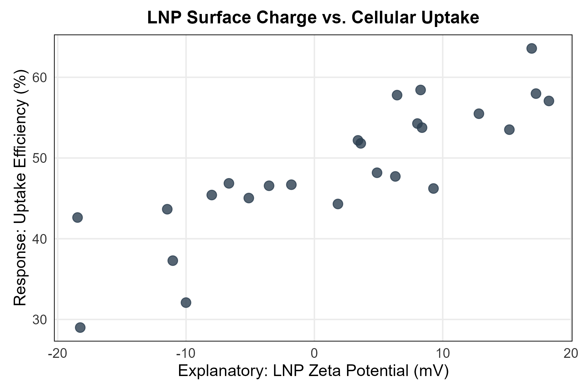
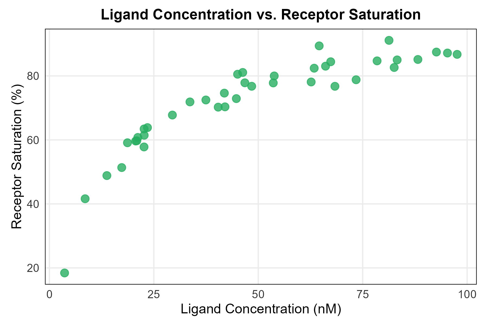
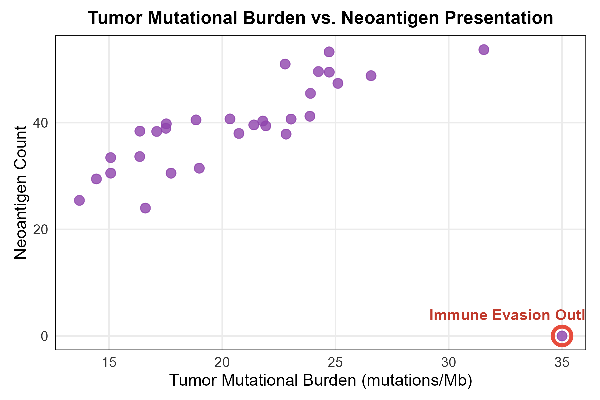
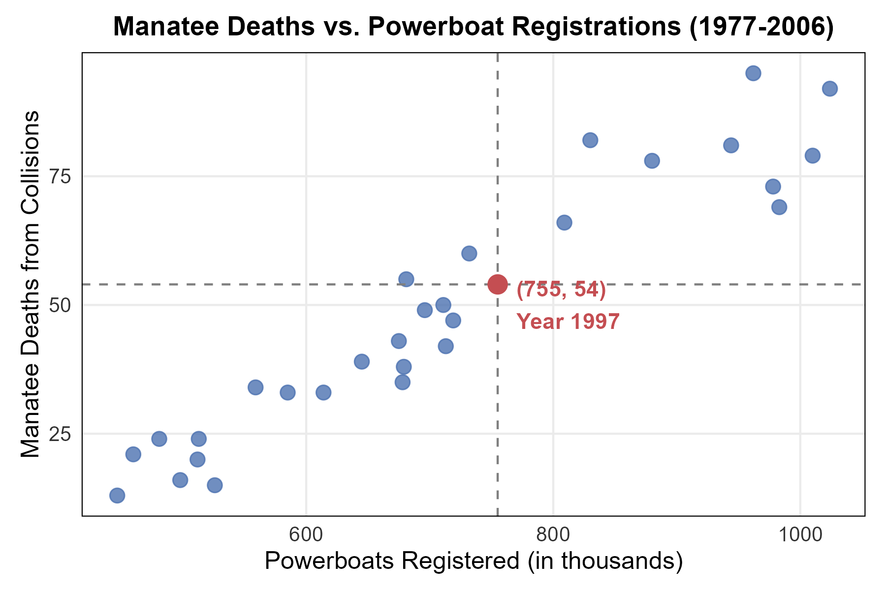
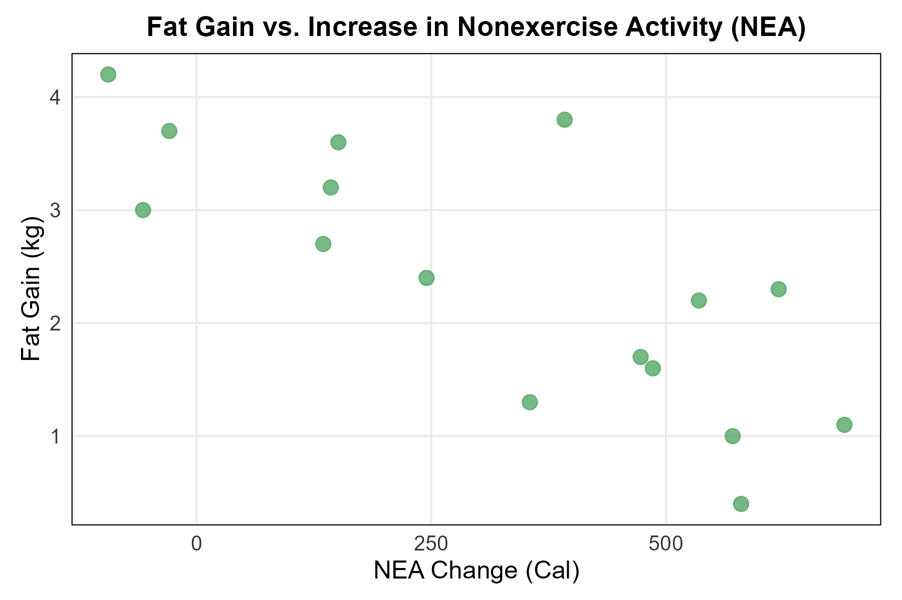
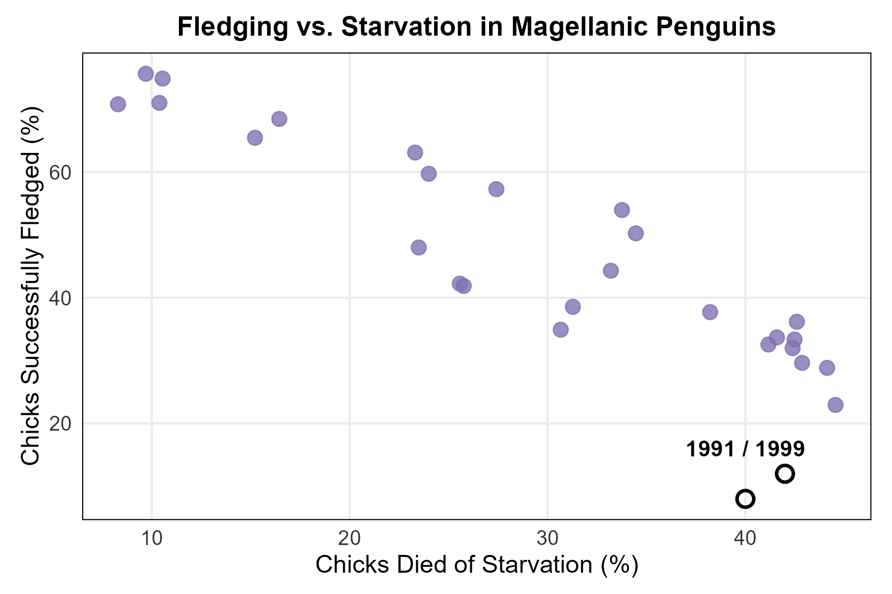
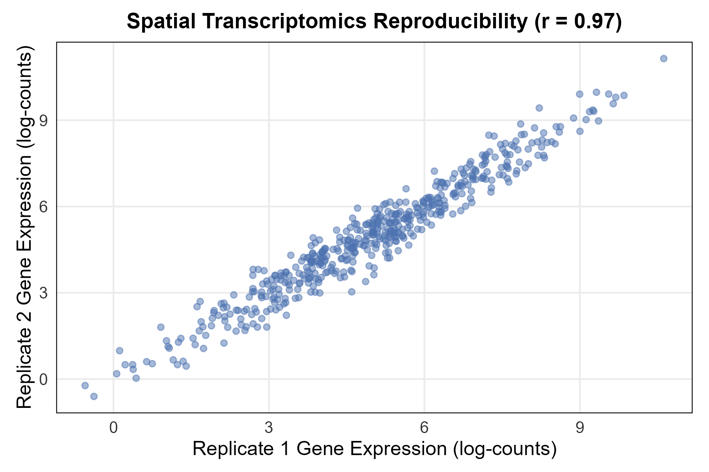
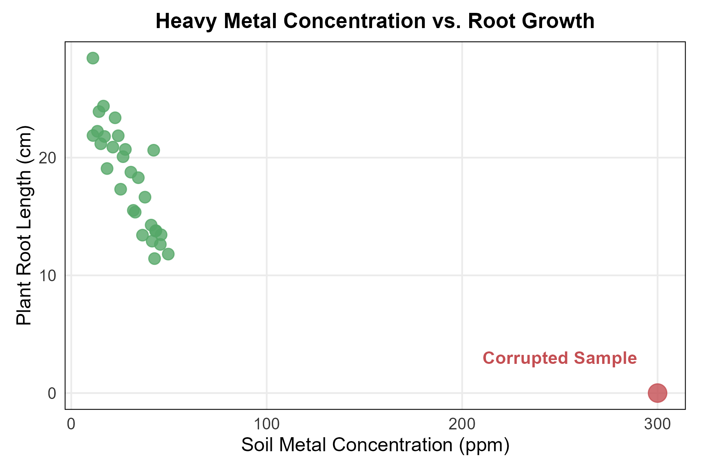

<style>
/* ============================================================
   CHAPTER 9 — PAGE + COLLAPSIBLE TABLE OF CONTENTS
   ============================================================ */

:root {
  --toc-width: 300px;
  --toc-collapsed-gutter: 72px;
  --chapter-width: 1100px;

  --ink: #23364a;
  --accent: #2c3e50;
  --line: #d8dee4;
  --soft: #f6f8fa;
  --toc-background: #f7f9fb;
}


/* ============================================================
   GENERAL PAGE
   ============================================================ */

html {
  scroll-behavior: smooth;
}

body {
  font-size: 17px;
  line-height: 1.65;
  color: var(--ink);
}

.main-container {
  max-width: var(--chapter-width) !important;
}


/* ============================================================
   HIDE THE CHAPTER 3 TITLE FROM THE MAIN CONTENT
   ============================================================ */

/*
   Pandoc applies a section-number offset of 2 so that the
   subsections begin at 3.1, 3.2, 3.3, ...

   Hide the visible Chapter 3 H1 because the document title
   already identifies the chapter, while keeping the section
   itself for numbering.
*/
.section.chapter-root > h1 {
  display: none !important;
}


/* ============================================================
   HIDE THE CHAPTER 3 PARENT FROM THE TABLE OF CONTENTS
   ============================================================ */

#TOC li:has(> a[href="#chapter-3-scatterplots-and-correlation"]) >
  a[href="#chapter-3-scatterplots-and-correlation"] {
  display: none !important;
}

#TOC li:has(> a[href="#chapter-3-scatterplots-and-correlation"]) {
  margin-top: 0 !important;
}


/* ============================================================
   ACCESSIBILITY
   ============================================================ */

.sr-only {
  position: absolute;
  width: 1px;
  height: 1px;
  padding: 0;
  margin: -1px;
  overflow: hidden;
  clip: rect(0, 0, 0, 0);
  white-space: nowrap;
  border: 0;
}


/* ============================================================
   SIDEBAR TOGGLE BUTTON
   ============================================================ */

#toc-toggle {
  position: fixed;

  top: 16px;
  left: calc(var(--toc-width) + 14px);

  width: 42px;
  height: 42px;

  display: flex;
  align-items: center;
  justify-content: center;

  padding: 0;

  border: 1px solid #c7d0d9;
  border-radius: 8px;

  background: #ffffff;
  color: var(--ink);

  box-shadow: 0 2px 8px rgba(24, 39, 55, 0.13);

  cursor: pointer;

  font-size: 24px;
  line-height: 1;

  z-index: 1200;

  transition:
    left 0.25s ease,
    background-color 0.2s ease,
    box-shadow 0.2s ease,
    transform 0.2s ease;
}

#toc-toggle:hover {
  background: #eef3f7;
  box-shadow: 0 3px 10px rgba(24, 39, 55, 0.18);
}

#toc-toggle:focus-visible {
  outline: 3px solid rgba(44, 62, 80, 0.28);
  outline-offset: 2px;
}


/* Open/close icons */

#toc-toggle .menu-icon {
  display: none;
}

#toc-toggle .close-icon {
  display: inline;
}


/* Button position when sidebar is collapsed */

body.toc-collapsed #toc-toggle {
  left: 14px;
}

body.toc-collapsed #toc-toggle .menu-icon {
  display: inline;
}

body.toc-collapsed #toc-toggle .close-icon {
  display: none;
}


/* ============================================================
   DESKTOP LAYOUT
   ============================================================ */

@media screen and (min-width: 992px) {

  /*
     Make room for fixed sidebar.
  */
  .main-container {
    width: 100% !important;
    max-width: none !important;

    padding-left: calc(var(--toc-width) + 30px) !important;
    padding-right: 35px !important;

    box-sizing: border-box !important;

    transition: padding-left 0.25s ease;
  }


  /*
     When sidebar is collapsed, reclaim almost all of the space.
  */
  body.toc-collapsed .main-container {
    padding-left: var(--toc-collapsed-gutter) !important;
  }


  /*
     Bootstrap normally reserves a column for the TOC.
     The TOC is fixed now, so remove that reserved column.
  */
  .main-container > .row-fluid > .col-xs-12.col-sm-4.col-md-3,
  .main-container > .row > .col-xs-12.col-sm-4.col-md-3 {
    width: 0 !important;
    min-height: 0 !important;
    padding: 0 !important;
    margin: 0 !important;
  }


  /* ----------------------------------------------------------
     FLOATING TOC
     ---------------------------------------------------------- */

  #TOC,
  #TOC.tocify {
    position: fixed !important;

    top: 0 !important;
    bottom: 0 !important;
    left: 0 !important;

    width: var(--toc-width) !important;
    max-height: 100vh !important;

    box-sizing: border-box !important;

    overflow-y: auto !important;
    overflow-x: hidden !important;

    margin: 0 !important;
    padding: 72px 16px 28px 18px !important;

    background: var(--toc-background) !important;

    border: 0 !important;
    border-right: 1px solid var(--line) !important;
    border-radius: 0 !important;

    box-shadow: none !important;

    z-index: 1100 !important;

    transform: translateX(0);

    transition: transform 0.25s ease;
  }


  /*
     Completely slide sidebar off screen when collapsed.
  */
  body.toc-collapsed #TOC,
  body.toc-collapsed #TOC.tocify {
    transform: translateX(calc(-1 * var(--toc-width)));
  }


  /*
     Allow long section headings to wrap rather than getting
     clipped.
  */
  #TOC a {
    white-space: normal !important;
    overflow-wrap: break-word !important;
    word-break: normal !important;
  }


  /* ----------------------------------------------------------
     TOC TYPOGRAPHY
     ---------------------------------------------------------- */

  #TOC .tocify-item {
    border-radius: 4px;
  }

  #TOC .tocify-item a {
    color: var(--ink);
    text-decoration: none;
  }

  #TOC .tocify-item:hover {
    background: #e9eef3;
  }

  #TOC .tocify-item.active {
    background: var(--accent) !important;
  }

  #TOC .tocify-item.active a {
    color: #ffffff !important;
  }


  /* ----------------------------------------------------------
     MAIN CHAPTER CONTENT
     ---------------------------------------------------------- */

  .toc-content,
  .toc-content.col-xs-12.col-sm-8.col-md-9 {
    width: 100% !important;
    max-width: var(--chapter-width) !important;

    float: none !important;

    margin-left: auto !important;
    margin-right: auto !important;

    padding-left: 15px !important;
    padding-right: 15px !important;

    box-sizing: border-box !important;
  }


  /*
     Fallback for Pandoc output that does not use Bootstrap's
     normal R Markdown container structure.
  */
  body.standalone-pandoc {
    width: calc(100% - var(--toc-width)) !important;
    max-width: none !important;

    box-sizing: border-box !important;

    margin: 0 0 0 var(--toc-width) !important;
    padding: 50px 45px !important;

    transition:
      width 0.25s ease,
      margin-left 0.25s ease,
      padding-left 0.25s ease;
  }

  body.standalone-pandoc.toc-collapsed {
    width: 100% !important;

    margin-left: 0 !important;
    padding-left: var(--toc-collapsed-gutter) !important;
  }

  body.standalone-pandoc > header,
  body.standalone-pandoc > section {
    max-width: var(--chapter-width);

    margin-left: auto;
    margin-right: auto;
  }
}


/* ============================================================
   MOBILE / TABLET
   ============================================================ */

@media screen and (max-width: 991px) {

  .main-container {
    width: auto !important;
    max-width: var(--chapter-width) !important;

    margin-left: auto !important;
    margin-right: auto !important;

    padding: 70px 18px 24px !important;

    box-sizing: border-box !important;
  }


  /*
     Toggle remains at upper-left on mobile.
  */
  #toc-toggle,
  body.toc-collapsed #toc-toggle {
    left: 12px;
  }


  /*
     Mobile starts with menu icon.
  */
  #toc-toggle .menu-icon,
  body.toc-collapsed #toc-toggle .menu-icon {
    display: inline;
  }

  #toc-toggle .close-icon,
  body.toc-collapsed #toc-toggle .close-icon {
    display: none;
  }


  /*
     Show X while the mobile TOC is open.
  */
  body.toc-mobile-open #toc-toggle .menu-icon {
    display: none;
  }

  body.toc-mobile-open #toc-toggle .close-icon {
    display: inline;
  }


  /* ----------------------------------------------------------
     MOBILE TOC DRAWER
     ---------------------------------------------------------- */

  #TOC,
  #TOC.tocify {
    position: fixed !important;

    top: 0 !important;
    bottom: 0 !important;
    left: 0 !important;

    width: min(84vw, 320px) !important;
    max-height: 100vh !important;

    box-sizing: border-box !important;

    overflow-y: auto !important;
    overflow-x: hidden !important;

    margin: 0 !important;
    padding: 72px 18px 28px !important;

    background: var(--toc-background) !important;

    border: 0 !important;
    border-right: 1px solid var(--line) !important;
    border-radius: 0 !important;

    z-index: 1100 !important;

    transform: translateX(-105%);

    transition: transform 0.25s ease;
  }

  body.toc-mobile-open #TOC,
  body.toc-mobile-open #TOC.tocify {
    transform: translateX(0);

    box-shadow: 6px 0 18px rgba(24, 39, 55, 0.16);
  }


  /*
     Prevent long headings from being clipped.
  */
  #TOC a {
    white-space: normal !important;
    overflow-wrap: break-word !important;
    word-break: normal !important;
  }


  body.standalone-pandoc {
    width: auto !important;
    max-width: var(--chapter-width) !important;

    margin: 0 auto !important;
    padding: 70px 18px 24px !important;

    box-sizing: border-box !important;
  }
}


/* ============================================================
   SECTION HEADINGS
   ============================================================ */

h1,
h2,
h3,
h4,
h5 {
  margin-top: 1.6em;
}

h2 {
  border-bottom: 3px solid var(--accent);
  padding-bottom: 0.25em;
}

h3 {
  border-bottom: 1px solid var(--line);
  padding-bottom: 0.2em;
}


/* ============================================================
   BLOCKQUOTES / DEFINITION BOXES
   ============================================================ */

blockquote {
  border-left: 4px solid var(--accent);

  background: #f7f9fa;

  padding: 0.7em 1em;
  margin-top: 1.2em;
  margin-bottom: 1.2em;
}


/* ============================================================
   TABLES
   ============================================================ */

table {
  width: 100%;

  margin: 1.35em auto;

  border-collapse: separate !important;
  border-spacing: 0;

  background: #ffffff;

  border: 1px solid #d6dde5;
  border-radius: 8px;

  overflow: hidden;

  box-shadow: 0 2px 8px rgba(24, 39, 55, 0.06);
}

table thead th {
  padding: 0.72em 0.9em !important;

  background: var(--accent);
  color: #ffffff;

  border: 0 !important;
  border-bottom: 1px solid #1e2d3b !important;

  font-weight: 700;

  vertical-align: middle !important;
}

table tbody td {
  padding: 0.65em 0.9em !important;

  border: 0 !important;
  border-bottom: 1px solid #e5e9ee !important;

  vertical-align: middle !important;
}

table tbody tr:nth-child(even) td {
  background: #f7f9fb;
}

table tbody tr:hover td {
  background: #eef4f8;
}

table tbody tr:last-child td {
  border-bottom: 0 !important;
}


/* ============================================================
   IMAGES
   ============================================================ */

img {
  display: block;

  max-width: 100%;
  height: auto;

  margin: 1.4em auto;

  border: 1px solid #e1e4e8;
  border-radius: 7px;
}


/* ============================================================
   MATHEMATICS
   ============================================================ */

.math.display {
  overflow-x: auto;
}


/* ============================================================
   HIDE R MARKDOWN CODE-FOLDING UI
   ============================================================ */

.btn-code,
.code-folding-btn,
div.btn-group.pull-right {
  display: none !important;
}
</style>

<button id="toc-toggle"
        type="button"
        aria-label="Toggle table of contents"
        aria-expanded="true">
  <span class="menu-icon" aria-hidden="true">&#9776;</span>
  <span class="close-icon" aria-hidden="true">&times;</span>
  <span class="sr-only">Toggle table of contents</span>
</button>

<script>
document.addEventListener("DOMContentLoaded", function () {
  const button = document.getElementById("toc-toggle");

  if (!button) return;

  button.addEventListener("click", function () {
    if (window.innerWidth <= 991) {
      document.body.classList.toggle("toc-mobile-open");

      const isOpen =
        document.body.classList.contains("toc-mobile-open");

      button.setAttribute("aria-expanded", isOpen);
    } else {
      document.body.classList.toggle("toc-collapsed");

      const isOpen =
        !document.body.classList.contains("toc-collapsed");

      button.setAttribute("aria-expanded", isOpen);
    }
  });
});
</script>

```{r generate_all_lecture_figures, include=FALSE, echo=FALSE, warning=FALSE, message=FALSE}
knitr::opts_chunk$set(
  echo = FALSE,
  warning = FALSE,
  message = FALSE,
  error = FALSE
)

required_packages <- c("ggplot2")
missing_packages <- required_packages[
  !vapply(required_packages, requireNamespace, logical(1), quietly = TRUE)
]

if (length(missing_packages) > 0) {
  stop(
    "Install the following R packages before knitting: ",
    paste(missing_packages, collapse = ", ")
  )
}

suppressPackageStartupMessages({
  library(ggplot2)
})

set.seed(123) # Set seed for reproducible figures

# Shared publication-style theme and colour palette.
lecture_theme <- theme_minimal(base_size = 11) +
  theme(
    plot.title = element_text(size = 13, face = "bold", hjust = 0.5),
    axis.title = element_text(size = 12),
    axis.text = element_text(size = 10, colour = "#333333"),
    panel.grid.minor = element_blank(),
    plot.background = element_rect(fill = "white", colour = NA),
    panel.background = element_rect(fill = "white", colour = NA),
    plot.margin = margin(8, 10, 8, 10),
    panel.border = element_rect(colour = "black", fill = NA, linewidth = 0.5)
  )

palette_main <- c("#4C72B0", "#55A868", "#C44E52", "#8172B2", "#CCB974")

save_plot <- function(filename, plot, width, height) {
  ggsave(
    filename = filename,
    plot = plot,
    width = width,
    height = height,
    units = "in",
    dpi = 300,
    bg = "white"
  )
}

# =============================================================
# 1. Scatterplot Example (LNP Surface Charge vs Cellular Uptake)
# =============================================================
set.seed(101)
zeta_potential <- runif(25, -20, 20)
uptake_eff <- 0.8 * zeta_potential + 45 + rnorm(25, 0, 5) 
lnp_data <- data.frame(Zeta = zeta_potential, Uptake = uptake_eff)

p_scatter <- ggplot(lnp_data, aes(x = Zeta, y = Uptake)) +
  geom_point(color = "#2c3e50", size = 3, alpha = 0.8) +
  labs(title = "LNP Surface Charge vs. Cellular Uptake",
       x = "Explanatory: LNP Zeta Potential (mV)",
       y = "Response: Uptake Efficiency (%)") +
  lecture_theme

save_plot("fig_ch3_scatterplot.png", p_scatter, width = 6, height = 4)

# =============================================================
# 2. Non-Linear Biological Forms (Receptor Kinetics)
# =============================================================
set.seed(202)
concentration <- runif(40, 1, 100)
saturation <- (100 * concentration) / (15 + concentration) + rnorm(40, 0, 3)
receptor_data <- data.frame(Ligand = concentration, Saturation = saturation)

p_nonlinear <- ggplot(receptor_data, aes(x = Ligand, y = Saturation)) +
  geom_point(color = "#27ae60", size = 3, alpha = 0.8) +
  labs(title = "Ligand Concentration vs. Receptor Saturation",
       x = "Ligand Concentration (nM)", 
       y = "Receptor Saturation (%)") +
  lecture_theme

save_plot("fig_ch3_nonlinear.png", p_nonlinear, width = 6, height = 4)

# =============================================================
# 3. Severe Bivariate Outliers (Immune Evasion)
# =============================================================
set.seed(303)
tmb <- rnorm(29, 20, 5)
neoantigens <- 1.5 * tmb + 10 + rnorm(29, 0, 4)
tmb <- c(tmb, 35)
neoantigens <- c(neoantigens, 0) 
immuno_data <- data.frame(TMB = tmb, Neoantigens = neoantigens)

p_outlier <- ggplot(immuno_data, aes(x = TMB, y = Neoantigens)) +
  geom_point(color = "#8e44ad", size = 3, alpha = 0.8) +
  annotate("point", x = 35, y = 0, color = "#e74c3c", size = 5, shape = 21, stroke = 2) +
  annotate("text", x = 33, y = 4, label = "Immune Evasion Outlier", color = "#c0392b", fontface = "bold") +
  labs(title = "Tumor Mutational Burden vs. Neoantigen Presentation",
       x = "Tumor Mutational Burden (mutations/Mb)", 
       y = "Neoantigen Count") +
  lecture_theme

save_plot("fig_ch3_outliers.png", p_outlier, width = 6, height = 4)

# =============================================================
# 4. Manatees and Powerboats (Positive Association)
# =============================================================
manatee_data <- data.frame(
  Powerboats = c(447, 460, 481, 498, 513, 512, 526, 559, 585, 614, 645, 675, 711, 719, 681, 679, 678, 696, 713, 732, 755, 809, 830, 880, 944, 962, 978, 983, 1010, 1024),
  Deaths = c(13, 21, 24, 16, 24, 20, 15, 34, 33, 33, 39, 43, 50, 47, 55, 38, 35, 49, 42, 60, 54, 66, 82, 78, 81, 95, 73, 69, 79, 92)
)

p_manatees <- ggplot(manatee_data, aes(x = Powerboats, y = Deaths)) +
  geom_point(color = "#4C72B0", size = 3, alpha = 0.8) +
  geom_vline(xintercept = 755, linetype = "dashed", color = "gray50") +
  geom_hline(yintercept = 54, linetype = "dashed", color = "gray50") +
  annotate("point", x = 755, y = 54, color = "#C44E52", size = 4) +
  annotate("text", x = 770, y = 50, label = "(755, 54)\nYear 1997", color = "#C44E52", fontface = "bold", hjust = 0) +
  labs(title = "Manatee Deaths vs. Powerboat Registrations (1977-2006)",
       x = "Powerboats Registered (in thousands)",
       y = "Manatee Deaths from Collisions") +
  lecture_theme

save_plot("fig_ch3_manatees.png", p_manatees, width = 6, height = 4)

# =============================================================
# 5. Fidgeting and Fat Gain (Negative Association)
# =============================================================
nea_data <- data.frame(
  NEA = c(-94, -57, -29, 135, 143, 151, 245, 355, 392, 473, 486, 535, 571, 580, 620, 690),
  Fat = c(4.2, 3.0, 3.7, 2.7, 3.2, 3.6, 2.4, 1.3, 3.8, 1.7, 1.6, 2.2, 1.0, 0.4, 2.3, 1.1)
)

p_nea <- ggplot(nea_data, aes(x = NEA, y = Fat)) +
  geom_point(color = "#55A868", size = 3, alpha = 0.8) +
  labs(title = "Fat Gain vs. Increase in Nonexercise Activity (NEA)",
       x = "NEA Change (Cal)",
       y = "Fat Gain (kg)") +
  lecture_theme

save_plot("fig_ch3_nea_fat.png", p_nea, width = 6, height = 4)

# =============================================================
# 6. Magellanic Penguins (Outliers in a Trend)
# =============================================================
set.seed(42)
penguins_clean <- data.frame(Starvation = runif(26, 5, 45))
penguins_clean$Fledging <- 85 - 1.2 * penguins_clean$Starvation + rnorm(26, 0, 5)
penguins_outliers <- data.frame(Starvation = c(42, 40), Fledging = c(12, 8), Year = c("1991", "1999"))

p_penguins <- ggplot() +
  geom_point(data = penguins_clean, aes(x = Starvation, y = Fledging), color = "#8172B2", size = 3, alpha = 0.8) +
  geom_point(data = penguins_outliers, aes(x = Starvation, y = Fledging), color = "black", size = 3, shape = 1, stroke = 1.2) +
  annotate("text", x = 40, y = 16, label = "1991 / 1999", color = "black", fontface="bold") +
  labs(title = "Fledging vs. Starvation in Magellanic Penguins",
       x = "Chicks Died of Starvation (%)",
       y = "Chicks Successfully Fledged (%)") +
  lecture_theme

save_plot("fig_ch3_penguins.png", p_penguins, width = 6, height = 4)

# =============================================================
# 7. Spatial Array Reproducibility (Strong Correlation)
# =============================================================
set.seed(404)
rep1_expr <- rnorm(500, mean = 5, sd = 2)
rep2_expr <- rep1_expr + rnorm(500, mean = 0, sd = 0.5)
repro_data <- data.frame(Rep1 = rep1_expr, Rep2 = rep2_expr)

p_repro <- ggplot(repro_data, aes(x = Rep1, y = Rep2)) +
  geom_point(color = "#4C72B0", alpha = 0.5) +
  labs(title = "Spatial Transcriptomics Reproducibility (r = 0.97)",
       x = "Replicate 1 Gene Expression (log-counts)",
       y = "Replicate 2 Gene Expression (log-counts)") +
  lecture_theme

save_plot("fig_ch3_reproducibility.png", p_repro, width = 6, height = 4)

# =============================================================
# 8. Non-Resistance of Correlation (Outlier Impact)
# =============================================================
set.seed(606)
metal_ppm <- runif(29, 10, 50)
root_cm <- -0.4 * metal_ppm + 30 + rnorm(29, 0, 2)
# The Outlier
metal_ppm_corrupted <- c(metal_ppm, 300)
root_cm_corrupted <- c(root_cm, 0)
toxic_data <- data.frame(Metal = metal_ppm_corrupted, Root = root_cm_corrupted, 
                         Type = c(rep("Normal", 29), "Outlier"))

p_toxic <- ggplot(toxic_data, aes(x = Metal, y = Root, color = Type, size = Type)) +
  geom_point(alpha = 0.8) +
  scale_color_manual(values = c("Normal" = "#55A868", "Outlier" = "#C44E52")) +
  scale_size_manual(values = c("Normal" = 3, "Outlier" = 5)) +
  annotate("text", x = 250, y = 3, label = "Corrupted Sample", color = "#C44E52", fontface = "bold") +
  labs(title = "Heavy Metal Concentration vs. Root Growth",
       x = "Soil Metal Concentration (ppm)",
       y = "Plant Root Length (cm)") +
  lecture_theme + theme(legend.position = "none")

save_plot("fig_ch3_toxic_outlier.png", p_toxic, width = 6, height = 4)
```

# Chapter 3: Scatterplots and Correlation {.chapter-root .unlisted}

## Scatterplots and Correlation

Chapters 1 and 2 focused mainly on **one variable at a time**. We learned how to display a distribution and how to summarize its center and spread. Chapter 3 changes the question:

> Instead of asking, “What does one variable look like?”, we now ask, **“How are two quantitative variables related?”**

This is the beginning of **bivariate data analysis**.

### Bivariate Data: Two Variables per Individual

Suppose we record two measurements on each observational unit. Examples include:

- study time and exam score for each student;
- temperature and electricity use for each day;
- body length and leap distance for each frog;
- heavy-metal concentration and root length for each soil sample.

When **two quantitative variables are measured on the same individual or observational unit**, the observations naturally occur in pairs,

$$
(x_1,y_1),\ (x_2,y_2),\ldots,(x_n,y_n)
$$

The pairing matters. The value $x_i$ must remain connected to the corresponding value $y_i$ from the **same** individual.

### Explanatory and Response Variables

When the scientific question gives the two variables different roles, we often identify:

- **Explanatory variable ($x$):** a variable that may help explain or predict changes in another variable.
- **Response variable ($y$):** the outcome that we want to explain or predict.

Other common terminology includes **predictor** or **independent variable** for $x$, and **dependent variable** or **target variable** for $y$.

> **Important:** Calling a variable “explanatory” does **not** automatically mean that it causes the response. A causal interpretation depends on the study design and other scientific evidence. In a controlled experiment, causal reasoning may be justified. In an observational study, an association alone does not establish causation.

### Example 3.1: Enzyme Activity and Temperature

Students run an enzyme reaction at several water-bath temperatures and measure the amount of oxygen gas produced.

| Variable | Measurement | Role |
|:---|:---|:---|
| **Explanatory ($x$)** | Temperature ($^\circ$C) | The temperature is deliberately varied by the students. |
| **Response ($y$)** | Oxygen gas produced (mL) | The reaction outcome being measured. |

Because temperature is deliberately manipulated, this setting is closer to an **experiment** than a purely observational study.

### Example 3.2: Forest Ecology and Plant Growth

An ecologist measures the percentage of open sky above a forest plot and the height of the tallest fern in that plot.

| Variable | Measurement | Role |
|:---|:---|:---|
| **Explanatory ($x$)** | Canopy open sky (%) | The environmental variable used to help explain fern growth. |
| **Response ($y$)** | Fern height (cm) | The biological outcome of interest. |

The ecologist did not necessarily assign canopy conditions at random. Therefore, a relationship between canopy openness and fern height would be an **association** unless the study design provides stronger causal evidence.

### Example 3.3: Beer and Blood Alcohol Concentration

In the study described in the lecture, volunteers consumed different numbers of beers and their blood alcohol concentration (BAC) was measured later.

- **Explanatory variable ($x$):** number of beers consumed.
- **Response variable ($y$):** percent alcohol in the blood.

The scientific question determines which variable is explanatory and which is the response.

### Example 3.4: Height — Context Determines the Roles

Statistics Canada's Canadian Health Measures Survey records variables such as height, age and sex.

If the goal is simply to **describe** these measurements, there may be no need to label one variable explanatory and another response.

If the research question becomes

> How does height change with age?

then a natural assignment is:

- **Explanatory variable ($x$):** age;
- **Response variable ($y$):** height.

This illustrates a general rule:

> **The roles of $x$ and $y$ come from the research question, not merely from the names of the variables.**

---

## Scatterplots

A **scatterplot** is the standard graph for displaying the relationship between two quantitative variables measured on the same observational units.

### Rules for Building a Scatterplot

When explanatory and response roles are meaningful:

1. place the **explanatory variable** on the horizontal ($x$) axis;
2. place the **response variable** on the vertical ($y$) axis;
3. plot each observational unit as **one point** at its paired coordinates $(x_i,y_i)$.

For example, if a frog has length $6$ cm and leap distance $48$ cm, that frog appears at the point

$$
(6,48)
$$

### Examining a Scatterplot

As in Chapters 1 and 2, first look for the **overall pattern**, then look for important departures from that pattern.

For a scatterplot, describe four features:

- **Form:** Is the pattern roughly linear, curved, U-shaped, or something else?
- **Direction:** Is the association positive or negative?
- **Strength:** How tightly do the points follow the underlying form?
- **Outliers:** Are there observations that fall far from the overall bivariate pattern?

A useful description should include the **variables and context**, not only labels such as “positive” or “strong.”

### Example 3.5: Linear Relationship — LNP Surface Charge and Cellular Uptake

Researchers study whether the surface charge of a lipid nanoparticle (LNP) is related to how efficiently it enters cells. Each point represents one LNP formulation.

- **Explanatory variable ($x$):** LNP surface charge (zeta potential).
- **Response variable ($y$):** cellular uptake efficiency.
- **Form:** approximately linear.
- **Direction:** positive.
- **Strength:** moderate to strong.
- **Outliers:** none apparent.



A complete interpretation is:

> LNP formulations with higher surface charge tend to have higher cellular uptake efficiency. The relationship is approximately linear and moderately strong, with no obvious outliers.

This is an **association** in the displayed data. Whether surface charge itself causes the change in uptake depends on the experimental design.

### Example 3.6: Non-Linear Relationship — Receptor Saturation

Researchers expose cells to different ligand concentrations and measure receptor saturation.

- **Explanatory variable ($x$):** ligand concentration.
- **Response variable ($y$):** receptor saturation.
- **Form:** strong and non-linear.



At low concentrations, increasing the ligand concentration produces a large increase in receptor saturation. As more receptors become occupied, fewer remain available, so the response begins to level off.

This example is especially important because a relationship can be **very strong without being linear**.

> Pearson's correlation coefficient, introduced later in this chapter, summarizes **linear association**. It should not be used as a complete description of this curved pattern.

### Example 3.7: Bivariate Outlier — Tumour Mutational Burden

Researchers study whether tumours with more genetic mutations also produce more neoantigens. Each point represents one tumour sample.

- **Explanatory variable ($x$):** tumour mutational burden (TMB).
- **Response variable ($y$):** number of neoantigens.
- **Overall pattern:** positive, approximately linear and moderately strong.
- **Possible outlier:** one tumour near $(35,0)$ has high TMB but almost no observed neoantigen presentation.



The important idea is that an observation can be unusual because of its **combination of $x$ and $y$ values**, even if neither coordinate is extraordinarily unusual when considered alone.

One biological possibility is that a tumour with many mutations may still present relatively few neoantigens if antigen-presentation mechanisms are disrupted. This is a possible scientific explanation, not something the scatterplot alone can establish.

---

## Exploring Associations

### Positive and Negative Association

Two quantitative variables are **positively associated** when larger-than-average values of one variable tend to occur with larger-than-average values of the other, and smaller values tend to occur together.

Two variables are **negatively associated** when larger values of one variable tend to occur with smaller values of the other.

These definitions describe a **tendency**, not a rule that every observation must follow.

### Example 3.8: Manatees and Powerboats

Researchers examine yearly powerboat registrations in Florida and yearly manatee deaths caused by watercraft collisions. Each point represents one year.

- **Explanatory variable ($x$):** number of registered powerboats.
- **Response variable ($y$):** number of manatee deaths caused by watercraft collisions.
- **Direction:** positive.
- **Form:** approximately linear.
- **Strength:** strong.



For example, the point $(755,54)$ represents 1997: approximately $755{,}000$ registered powerboats and $54$ manatee deaths from collisions.

A suitable interpretation is:

> Years with more registered powerboats tended to have more recorded manatee deaths from watercraft collisions.

The graph shows an **association**, not by itself a causal effect. Both variables also change across calendar time, and other factors could influence the relationship. Therefore, the scatterplot alone cannot tell us how much the number of boats directly causes the number of deaths.

### Example 3.9: Does Fidgeting Keep You Slim?

Researchers deliberately increased food intake for volunteers and measured both fat gain and the change in **nonexercise activity (NEA)**, which includes ordinary movement such as walking, standing and fidgeting.

- **Explanatory variable ($x$):** change in NEA.
- **Response variable ($y$):** fat gain (kg).
- **Direction:** negative.
- **Form:** approximately linear.
- **Strength:** moderately strong.



Volunteers with larger increases in NEA tended to gain less fat. The relationship is not perfect: individuals still vary around the overall decreasing pattern.

### Example 3.10: Magellanic Penguins

Researchers followed a colony of Magellanic penguins over multiple breeding seasons. For each year they recorded the percentage of chicks that died from starvation and the percentage that successfully fledged.

- **Explanatory variable ($x$):** percentage of chicks that died from starvation.
- **Response variable ($y$):** percentage of chicks that successfully fledged.
- **Direction:** negative.
- **Form:** approximately linear.
- **Outliers:** the years 1991 and 1999 fall well below the main pattern.



The key lesson is that **outliers in a relationship are identified from the scatterplot**. A point can fail to follow the bivariate pattern even if its individual $x$- or $y$-value is not an outlier in a one-variable graph.

Before excluding an unusual year from a numerical analysis, researchers should investigate the scientific reason for its unusual behavior and document any exclusion decision.

---

## Correlation ($r$)

Visual descriptions such as “moderately strong positive linear association” are useful, but they involve judgment. **Pearson's correlation coefficient**, denoted by $r$, provides a numerical summary of the direction and strength of a **linear** relationship between two quantitative variables.

For paired observations $(x_i,y_i)$,

$$
r
=
\frac{1}{n-1}
\sum_{i=1}^{n}
\left(\frac{x_i-\bar{x}}{s_x}\right)
\left(\frac{y_i-\bar{y}}{s_y}\right)
$$

The quantities

$$
z_{x_i}=\frac{x_i-\bar{x}}{s_x}
\qquad\text{and}\qquad
z_{y_i}=\frac{y_i-\bar{y}}{s_y}
$$

are the $z$-scores of the paired observations.

The formula therefore:

1. standardizes both variables;
2. multiplies the paired standardized values;
3. adds those products;
4. divides by $n-1$.

### How the Sign of $r$ Arises

If an observation has:

- both $z_x>0$ and $z_y>0$, their product is positive;
- both $z_x<0$ and $z_y<0$, their product is also positive;
- one positive and one negative $z$-score, their product is negative.

Therefore:

- pairs that move together contribute **positive** products;
- pairs that move in opposite directions contribute **negative** products.

This is why positive association produces positive $r$, while negative association produces negative $r$.

### Crucial Properties of $r$

1. The correlation coefficient always satisfies

$$
-1\le r\le 1
$$

The endpoint values $r=-1$ and $r=1$ are possible when all observations lie exactly on a straight line with negative or positive slope, respectively.

2. If $r>0$, the linear association is positive. If $r<0$, the linear association is negative.

3. Values of $|r|$ closer to $1$ indicate a stronger **linear** association. Values of $r$ near $0$ indicate little **linear** association.

4. A value near $0$ does **not** prove that the variables are unrelated. A strong curved relationship can have a small correlation.

5. Correlation has no physical units.

6. Correlation is symmetric:

$$
r_{xy}=r_{yx}
$$

Swapping $x$ and $y$ does not change the correlation.

7. Correlation is **not resistant** to outliers.

8. A large value of $|r|$ does not establish causation.

> **Always inspect the scatterplot before interpreting $r$.**

---

## Example 3.11: The Mechanics of Correlation — Frog Locomotion

A biologist measures snout-vent length and maximum leap distance for five juvenile bullfrogs

| Frog ID | Length $x$ (cm) | Leap distance $y$ (cm) |
|:---:|---:|---:|
| 1 | 4.0 | 32.0 |
| 2 | 5.0 | 42.0 |
| 3 | 6.0 | 48.0 |
| 4 | 7.0 | 55.0 |
| 5 | 8.0 | 65.0 |

We will calculate Pearson's correlation completely by hand before using R

### Step 1: Calculate the Mean of $x$

There are $n=5$ paired observations

First add the frog-length values

$$
\sum x_i
=
4+5+6+7+8
=
30
$$

Then divide by $n=5$

$$
\bar{x}
=
\frac{\sum x_i}{n}
=
\frac{30}{5}
=
6.0
$$

### Step 2: Calculate the Mean of $y$

First add the leap-distance values

$$
\sum y_i
=
32+42+48+55+65
=
242
$$

Then divide by $n=5$

$$
\bar{y}
=
\frac{\sum y_i}{n}
=
\frac{242}{5}
=
48.4
$$

### Step 3: Calculate the Deviations from the Means

For each frog, subtract the appropriate sample mean

For the $x$-values

$$
x_1-\bar{x}=4-6=-2
$$

$$
x_2-\bar{x}=5-6=-1
$$

$$
x_3-\bar{x}=6-6=0
$$

$$
x_4-\bar{x}=7-6=1
$$

$$
x_5-\bar{x}=8-6=2
$$

The $x$-deviations add to zero

$$
-2+(-1)+0+1+2=0
$$

For the $y$-values

$$
y_1-\bar{y}=32-48.4=-16.4
$$

$$
y_2-\bar{y}=42-48.4=-6.4
$$

$$
y_3-\bar{y}=48-48.4=-0.4
$$

$$
y_4-\bar{y}=55-48.4=6.6
$$

$$
y_5-\bar{y}=65-48.4=16.6
$$

The $y$-deviations also add to zero

$$
-16.4+(-6.4)+(-0.4)+6.6+16.6=0
$$

### Step 4: Square the Deviations

For $x$

$$
(-2)^2=4
$$

$$
(-1)^2=1
$$

$$
0^2=0
$$

$$
1^2=1
$$

$$
2^2=4
$$

Therefore

$$
\sum (x_i-\bar{x})^2
=
4+1+0+1+4
=
10
$$

For $y$

$$
(-16.4)^2=268.96
$$

$$
(-6.4)^2=40.96
$$

$$
(-0.4)^2=0.16
$$

$$
(6.6)^2=43.56
$$

$$
(16.6)^2=275.56
$$

Therefore

$$
\sum (y_i-\bar{y})^2
=
268.96+40.96+0.16+43.56+275.56
=
629.20
$$

The calculations so far can be summarized as follows

| $x_i$ | $x_i-\bar{x}$ | $(x_i-\bar{x})^2$ | $y_i$ | $y_i-\bar{y}$ | $(y_i-\bar{y})^2$ |
|---:|---:|---:|---:|---:|---:|
| 4 | -2 | 4 | 32 | -16.4 | 268.96 |
| 5 | -1 | 1 | 42 | -6.4 | 40.96 |
| 6 | 0 | 0 | 48 | -0.4 | 0.16 |
| 7 | 1 | 1 | 55 | 6.6 | 43.56 |
| 8 | 2 | 4 | 65 | 16.6 | 275.56 |
| **Sum** | **0** | **10** |  | **0** | **629.20** |

### Step 5: Calculate the Sample Standard Deviation of $x$

The sample standard deviation is

$$
s_x
=
\sqrt{\frac{\sum (x_i-\bar{x})^2}{n-1}}
$$

Substitute the values from the table

$$
s_x
=
\sqrt{\frac{10}{5-1}}
$$

$$
s_x
=
\sqrt{\frac{10}{4}}
$$

$$
s_x
=
\sqrt{2.5}
$$

$$
s_x
\approx
1.581139
$$

### Step 6: Calculate the Sample Standard Deviation of $y$

The sample standard deviation is

$$
s_y
=
\sqrt{\frac{\sum (y_i-\bar{y})^2}{n-1}}
$$

Substitute the values from the table

$$
s_y
=
\sqrt{\frac{629.20}{5-1}}
$$

$$
s_y
=
\sqrt{\frac{629.20}{4}}
$$

$$
s_y
=
\sqrt{157.30}
$$

$$
s_y
\approx
12.541930
$$

### Step 7: Standardize Every $x$-Value

For each observation

$$
z_{x_i}
=
\frac{x_i-\bar{x}}{s_x}
$$

Using $\bar{x}=6$ and $s_x\approx1.581139$

$$
z_{x_1}
=
\frac{4-6}{1.581139}
=
\frac{-2}{1.581139}
\approx
-1.264911
$$

$$
z_{x_2}
=
\frac{5-6}{1.581139}
=
\frac{-1}{1.581139}
\approx
-0.632456
$$

$$
z_{x_3}
=
\frac{6-6}{1.581139}
=
0
$$

$$
z_{x_4}
=
\frac{7-6}{1.581139}
=
\frac{1}{1.581139}
\approx
0.632456
$$

$$
z_{x_5}
=
\frac{8-6}{1.581139}
=
\frac{2}{1.581139}
\approx
1.264911
$$

### Step 8: Standardize Every $y$-Value

For each observation

$$
z_{y_i}
=
\frac{y_i-\bar{y}}{s_y}
$$

Using $\bar{y}=48.4$ and $s_y\approx12.541930$

$$
z_{y_1}
=
\frac{32-48.4}{12.541930}
=
\frac{-16.4}{12.541930}
\approx
-1.307614
$$

$$
z_{y_2}
=
\frac{42-48.4}{12.541930}
=
\frac{-6.4}{12.541930}
\approx
-0.510288
$$

$$
z_{y_3}
=
\frac{48-48.4}{12.541930}
=
\frac{-0.4}{12.541930}
\approx
-0.031893
$$

$$
z_{y_4}
=
\frac{55-48.4}{12.541930}
=
\frac{6.6}{12.541930}
\approx
0.526235
$$

$$
z_{y_5}
=
\frac{65-48.4}{12.541930}
=
\frac{16.6}{12.541930}
\approx
1.323560
$$

### Step 9: Multiply Each Pair of $z$-Scores

Use the unrounded $z$-scores in the products

$$
z_{x_1}z_{y_1}
=
(-1.264911)(-1.307614)
\approx
1.654015
$$

$$
z_{x_2}z_{y_2}
=
(-0.632456)(-0.510288)
\approx
0.322735
$$

$$
z_{x_3}z_{y_3}
=
(0)(-0.031893)
=
0
$$

$$
z_{x_4}z_{y_4}
=
(0.632456)(0.526235)
\approx
0.332820
$$

$$
z_{x_5}z_{y_5}
=
(1.264911)(1.323560)
\approx
1.674186
$$

### Step 10: Add the Products

$$
\sum z_xz_y
=
1.654015+0.322735+0+0.332820+1.674186
$$

$$
\sum z_xz_y
\approx
3.983756
$$

The complete standardized table is

| $x$ | $y$ | $z_x$ | $z_y$ | $z_xz_y$ |
|---:|---:|---:|---:|---:|
| 4 | 32 | -1.264911 | -1.307614 | 1.654015 |
| 5 | 42 | -0.632456 | -0.510288 | 0.322735 |
| 6 | 48 | 0.000000 | -0.031893 | 0.000000 |
| 7 | 55 | 0.632456 | 0.526235 | 0.332820 |
| 8 | 65 | 1.264911 | 1.323560 | 1.674186 |
|  |  |  | **Sum** | **3.983756** |

### Step 11: Calculate Pearson's Correlation Coefficient

The formula is

$$
r
=
\frac{1}{n-1}\sum z_xz_y
$$

Substitute $n=5$ and the sum of the products

$$
r
=
\frac{1}{5-1}(3.983756)
$$

$$
r
=
\frac{3.983756}{4}
$$

$$
r
\approx
0.995939
$$

Rounded to three decimal places

$$
r
\approx
0.996
$$

The data show a **very strong positive linear association**: in this sample, longer juvenile frogs tend to have greater leap distances

### Equivalent Calculation Using Deviations from the Means

The same correlation can be calculated directly from deviations from the two means

$$
r
=
\frac{
\sum (x_i-\bar{x})(y_i-\bar{y})
}{
\sqrt{\sum (x_i-\bar{x})^2}
\sqrt{\sum (y_i-\bar{y})^2}
}
$$

First calculate each cross-product

$$
(x_1-\bar{x})(y_1-\bar{y})
=
(-2)(-16.4)
=
32.8
$$

$$
(x_2-\bar{x})(y_2-\bar{y})
=
(-1)(-6.4)
=
6.4
$$

$$
(x_3-\bar{x})(y_3-\bar{y})
=
(0)(-0.4)
=
0
$$

$$
(x_4-\bar{x})(y_4-\bar{y})
=
(1)(6.6)
=
6.6
$$

$$
(x_5-\bar{x})(y_5-\bar{y})
=
(2)(16.6)
=
33.2
$$

Add the cross-products

$$
\sum (x_i-\bar{x})(y_i-\bar{y})
=
32.8+6.4+0+6.6+33.2
=
79.0
$$

From the earlier calculations

$$
\sum (x_i-\bar{x})^2=10
$$

$$
\sum (y_i-\bar{y})^2=629.20
$$

Substitute all three quantities

$$
r
=
\frac{79.0}{\sqrt{10}\sqrt{629.20}}
$$

$$
r
=
\frac{79.0}{\sqrt{6292}}
$$

$$
r
\approx
\frac{79.0}{79.322128}
$$

$$
r
\approx
0.995939
$$

The two formulas are mathematically equivalent

---

## Example 3.11: Correlation in R

The lecture shows four useful ways to reproduce the frog calculation in R.

### Method 1: Use the $z$-Score Formula

```{r ex11_method1, echo=TRUE}
length_x <- c(4, 5, 6, 7, 8)
leap_y <- c(32, 42, 48, 55, 65)

# Store the number of paired observations
n <- length(length_x)

# Standardize x and y
z_x <- (length_x - mean(length_x)) / sd(length_x)
z_y <- (leap_y - mean(leap_y)) / sd(leap_y)

# Calculate Pearson's correlation coefficient
r_manual <- sum(z_x * z_y) / (n - 1)
r_manual
```

The code follows exactly the same steps as the hand calculation

First, R finds the sample size

$$
n=5
$$

Then it calculates the two standardized vectors

$$
z_x
\approx
(-1.264911,-0.632456,0,0.632456,1.264911)
$$

$$
z_y
\approx
(-1.307614,-0.510288,-0.031893,0.526235,1.323560)
$$

Next, R multiplies corresponding entries and adds the products

$$
\sum z_xz_y
\approx
3.983756
$$

Finally

$$
r
=
\frac{3.983756}{5-1}
\approx
0.995939
$$

### Method 2: Use the Sum-of-Deviations Formula

```{r ex11_method2, echo=TRUE}
length_x <- c(4, 5, 6, 7, 8)
leap_y <- c(32, 42, 48, 55, 65)

# Deviations from the means
x_deviation <- length_x - mean(length_x)
y_deviation <- leap_y - mean(leap_y)

# Numerator
numerator <- sum(x_deviation * y_deviation)

# Two sums in the denominator
sum_x_squared <- sum(x_deviation^2)
sum_y_squared <- sum(y_deviation^2)

# Correlation
denominator <- sqrt(sum_x_squared * sum_y_squared)
r_sums <- numerator / denominator
r_sums
```

The quantities created by this code correspond to the hand calculation

$$
\text{numerator} = \sum (x_i-\bar{x})(y_i-\bar{y}) = 79.0
$$

$$
\text{sum squared x} = \sum (x_i-\bar{x})^2 = 10
$$

$$
\text{sum squared y} = \sum (y_i-\bar{y})^2 = 629.20
$$

Therefore

$$
\text{denominator} = \sqrt{(10)(629.20)} \approx 79.322128
$$

and

$$
r = \frac{79.0}{79.322128} \approx 0.995939
$$

### Method 3: Create a Reusable Function

```{r ex11_method3, echo=TRUE}
calculate_r <- function(x, y) {
  n <- length(x)

  z_x <- (x - mean(x)) / sd(x)
  z_y <- (y - mean(y)) / sd(y)

  return(sum(z_x * z_y) / (n - 1))
}

calculate_r(length_x, leap_y)
```

The function repeats the same sequence for any paired vectors $x$ and $y$

1. It calculates $n$
2. It converts every $x$-value to a $z$-score
3. It converts every $y$-value to a $z$-score
4. It multiplies each paired set of $z$-scores
5. It adds the products
6. It divides the sum by $n-1$

For the frog data, the function returns

$$
r \approx 0.995939
$$

A custom function is useful for understanding how the calculation is assembled, but in ordinary data analysis there is already a built-in R function for correlation

### Method 4: Use `cor()`

```{r ex11_method4, echo=TRUE}
cor(length_x, leap_y)
```

By default, `cor(x, y)` computes Pearson's correlation coefficient using the same paired observations

For these data

$$
\operatorname{cor}(x,y) \approx 0.995939
$$

The built-in function is the preferred method for routine analysis, while the earlier methods show how the statistic is constructed

> **Interpretation:** $r\approx0.996$ indicates a nearly perfect positive **linear association** between frog length and leap distance in this sample

---

## Example 3.12: Spatial Transcriptomics Reproducibility

A research lab performs a spatial transcriptomics assay twice under similar conditions. For each of $500$ genes, expression measured in Replicate 1 is compared with expression measured in Replicate 2.



For plotting convenience, we can place:

- Replicate 1 on the $x$-axis;
- Replicate 2 on the $y$-axis.

The dataset contains $n=500$ paired gene-expression measurements, so writing all $500$ hand calculations would not be useful. R can carry out the same steps used in Example 3.11

```{r ex12_correlation_steps, echo=TRUE}
# Step 1: store the number of paired observations
n_repro <- nrow(repro_data)

# Step 2: standardize Replicate 1
z_rep1 <- (repro_data$Rep1 - mean(repro_data$Rep1)) / sd(repro_data$Rep1)

# Step 3: standardize Replicate 2
z_rep2 <- (repro_data$Rep2 - mean(repro_data$Rep2)) / sd(repro_data$Rep2)

# Step 4: multiply paired z-scores
z_products_repro <- z_rep1 * z_rep2

# Step 5: add the products
sum_z_products_repro <- sum(z_products_repro)

# Step 6: divide by n - 1
r_repro_manual <- sum_z_products_repro / (n_repro - 1)
r_repro_manual

# Check with R's built-in function
cor(repro_data$Rep1, repro_data$Rep2)
```

The calculation has the same structure as the frog example

$$
r = \frac{1}{500-1}\sum_{i=1}^{500}z_{x_i}z_{y_i}
$$

The correlation is approximately

$$
r=0.9696
$$

This indicates a **very strong positive linear association** between the two replicate measurements. Genes with higher expression in Replicate 1 also tend to have higher expression in Replicate 2.

Because correlation is symmetric, switching the two replicates between the axes would not change $r$.

> A high correlation supports strong reproducibility of the **relative expression pattern**, but correlation alone does not establish that the two replicates agree perfectly in their absolute values. Two measurements can be highly correlated while still differing systematically in scale or level.

---

## Example 3.13: Correlation Does Not Depend on Measurement Units

Because correlation is calculated from standardized values, $r$ has **no units**.

For example, suppose the correlation between swimming speed measured in km/h and energy expenditure measured in kilocalories is

$$
r=0.9424
$$

A positive linear unit conversion has the form

$$
x_i^*=a+bx_i \qquad b>0
$$

The converted mean and standard deviation are

$$
\bar{x}^*=a+b\bar{x}
$$

$$
s_x^*=bs_x
$$

Therefore the standardized converted value is

$$
z_{x_i^*}
=
\frac{x_i^*-\bar{x}^*}{s_x^*}
$$

Substitute the converted quantities

$$
z_{x_i^*} = \frac{(a+bx_i)-(a+b\bar{x})}{bs_x}
$$

Simplify

$$
z_{x_i^*} = \frac{b(x_i-\bar{x})}{bs_x}
$$

$$
z_{x_i^*}
=
\frac{x_i-\bar{x}}{s_x}
=
z_{x_i}
$$

The same argument applies to $y$. Because the paired $z$-scores do not change, neither their products nor their average change

If the same values are converted to m/s and joules using ordinary positive linear unit conversions, the correlation therefore remains

$$
r=0.9424
$$

Changing measurement units changes the numerical values and their standard deviations, but the corresponding standardized positions remain the same

---

## Example 3.14: Correlation Is Not Resistant

The mean and standard deviation are not resistant to extreme observations. Correlation is also **not resistant**.

A single influential point can:

- make an existing linear association appear much stronger;
- make it appear weaker;
- reverse the apparent direction in some datasets;
- create a large correlation where the main cloud of points shows little linear association.

### Heavy Metal Concentration and Root Length

Researchers examine heavy-metal concentration in soil and plant root length.

- **Explanatory variable ($x$):** heavy-metal concentration.
- **Response variable ($y$):** plant root length.
- **Original pattern:** the $29$ regular observations show a moderately strong negative linear association, approximately $r=-0.77$.

One extremely unusual industrial-soil sample is then included.



We can calculate the correlation first for the $29$ regular observations and then repeat the same calculation after adding the unusual observation

```{r ex14_correlation_steps, echo=TRUE}
# ---------- Original 29 observations ----------

# Step 1: number of paired observations
n_original <- length(metal_ppm)

# Step 2: standardize metal concentration
z_metal_original <- (metal_ppm - mean(metal_ppm)) / sd(metal_ppm)

# Step 3: standardize root length
z_root_original <- (root_cm - mean(root_cm)) / sd(root_cm)

# Step 4: multiply paired z-scores
products_original <- z_metal_original * z_root_original

# Step 5: add the products
sum_products_original <- sum(products_original)

# Step 6: divide by n - 1
r_original <- sum_products_original / (n_original - 1)
r_original

# ---------- Add the extreme observation ----------

# Step 1: number of paired observations
n_with_outlier <- length(metal_ppm_corrupted)

# Step 2: standardize metal concentration
z_metal_outlier <- (metal_ppm_corrupted - mean(metal_ppm_corrupted)) /
  sd(metal_ppm_corrupted)

# Step 3: standardize root length
z_root_outlier <- (root_cm_corrupted - mean(root_cm_corrupted)) /
  sd(root_cm_corrupted)

# Step 4: multiply paired z-scores
products_outlier <- z_metal_outlier * z_root_outlier

# Step 5: add the products
sum_products_outlier <- sum(products_outlier)

# Step 6: divide by n - 1
r_with_outlier <- sum_products_outlier / (n_with_outlier - 1)
r_with_outlier
```

For the original observations, the calculation has the form

$$
r_{\text{original}}
=
\frac{1}{29-1}\sum_{i=1}^{29}z_{x_i}z_{y_i}
$$

and gives approximately

$$
r_{\text{original}}\approx-0.77
$$

After the unusual observation is added, the calculation becomes

$$
r_{\text{with outlier}}
=
\frac{1}{30-1}\sum_{i=1}^{30}z_{x_i}z_{y_i}
$$

and gives approximately

$$
r_{\text{with outlier}}\approx-0.95
$$

The numerical value is now closer to $-1$, making the relationship appear much more strongly linear than the main cluster alone suggests

This does **not** mean that the formula is wrong. The unusual observation is genuinely part of the calculation. The lesson is that a numerical summary can be dominated by an influential point.

> **Golden rule:** Never interpret a correlation coefficient without first examining the scatterplot.

---

## Summary of R Commands

The main R commands introduced in this chapter are:

| R command | Purpose |
|:---|:---|
| `length(x)` | Returns the number of observations in a vector. |
| `mean(x)` | Calculates the mean of a vector. |
| `sd(x)` | Calculates the sample standard deviation. |
| `sum(x * y)` | Multiplies paired vector entries element-by-element and adds the products. |
| `function(x, y) { ... }` | Defines a reusable function. |
| `cor(x, y)` | Calculates Pearson's correlation coefficient by default. |

### Chapter 3 Checklist

When examining two quantitative variables:

1. Identify the observational units and make sure the $x$- and $y$-values are correctly paired.
2. Decide whether explanatory and response roles are meaningful in the context.
3. Make a scatterplot before calculating a correlation.
4. Describe **form, direction, strength and outliers**.
5. Use Pearson's $r$ only as a summary of **linear** association.
6. Remember that $-1\le r\le 1$.
7. Remember that correlation has no units and is unchanged by swapping $x$ and $y$.
8. Investigate influential observations rather than automatically deleting them.
9. Do not interpret correlation as proof of causation.
