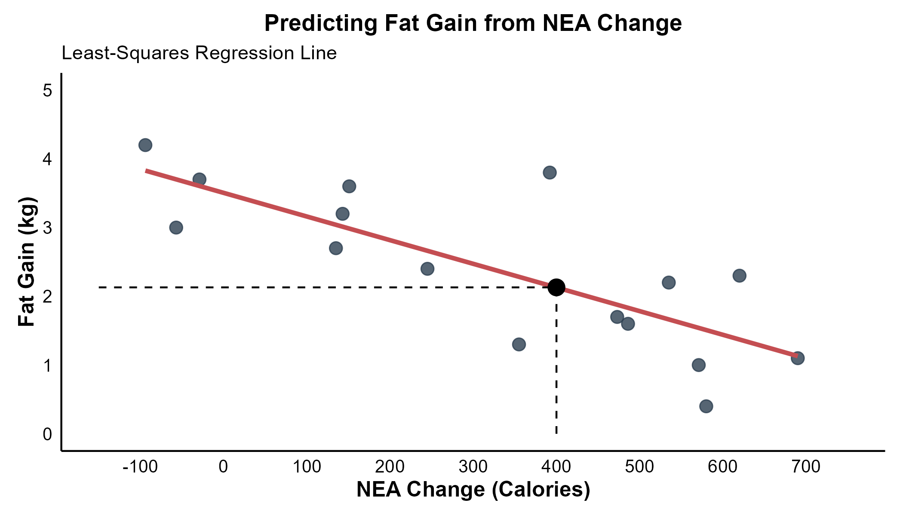
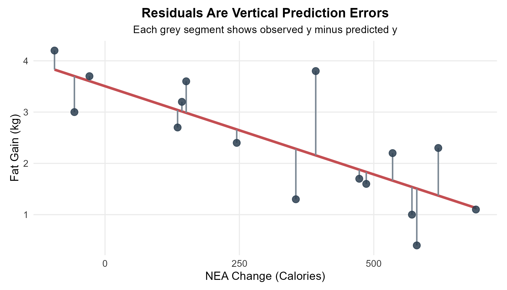
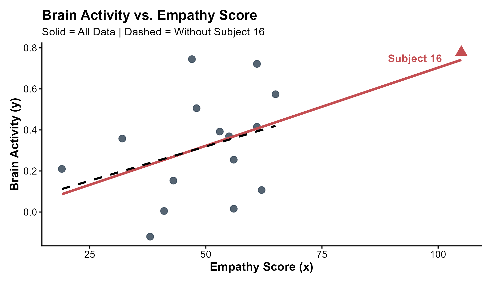
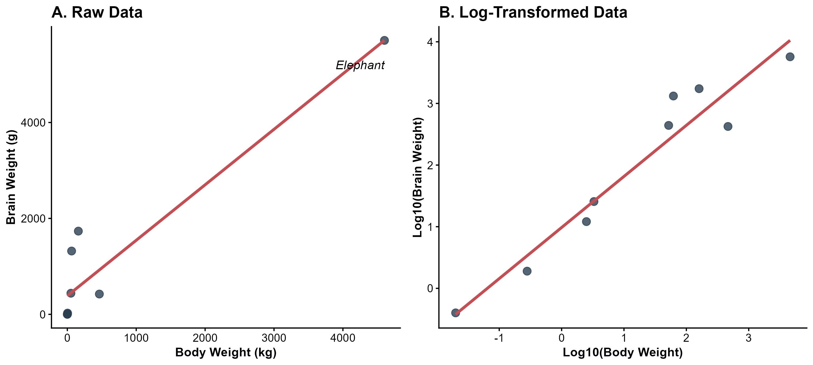

<style>
/* ============================================================
   CHAPTER 4 — PAGE + COLLAPSIBLE TABLE OF CONTENTS
   ============================================================ */

:root {
  --toc-width: 300px;
  --toc-collapsed-gutter: 72px;
  --chapter-width: 1100px;

  --ink: #23364a;
  --accent: #2c3e50;
  --line: #d8dee4;
  --soft: #f6f8fa;
  --toc-background: #f7f9fb;
}


/* ============================================================
   GENERAL PAGE
   ============================================================ */

html {
  scroll-behavior: smooth;
}

body {
  font-size: 17px;
  line-height: 1.65;
  color: var(--ink);
}

.main-container {
  max-width: var(--chapter-width) !important;
}


/* ============================================================
   HIDE DUMMY CHAPTER CONTENT
   ============================================================ */

/*
   Chapter 4 is the visible chapter heading; Pandoc applies a section-number offset of 3 so that its subsections begin at 4.1.

   Hide the visible "Chapter 4" H1 because the document title
   already says Chapter 4, but KEEP the section itself so that
   H2 headings are numbered 4.1, 4.2, 4.3, ...
*/
.section.chapter-root > h1 {
  display: none !important;
}


/* ============================================================
   HIDE EARLIER DUMMY CHAPTERS FROM THE TABLE OF CONTENTS
   ============================================================ */

/*
   R Markdown/tocify does not reliably expose the chapter names
   through data-unique, so select them through their generated
   href values instead.
*/

#TOC li:has(a[href="#chapter-1-dummy"]),
#TOC li:has(a[href="#chapter-2-dummy"]),
#TOC li:has(a[href="#chapter-3-dummy"]) {
  display: none !important;
}


/*
   Also hide the Chapter 4 parent entry itself.

   Its children — 4.1, 4.2, 4.3, ... — remain visible.
*/
#TOC li:has(> a[href="#chapter-4"]) > a[href="#chapter-4"] {
  display: none !important;
}


/*
   tocify may place the Chapter 4 subsections inside the same
   list item. Remove spacing belonging to the hidden parent.
*/
#TOC li:has(> a[href="#chapter-4"]) {
  margin-top: 0 !important;
}


/* ============================================================
   ACCESSIBILITY
   ============================================================ */

.sr-only {
  position: absolute;
  width: 1px;
  height: 1px;
  padding: 0;
  margin: -1px;
  overflow: hidden;
  clip: rect(0, 0, 0, 0);
  white-space: nowrap;
  border: 0;
}


/* ============================================================
   SIDEBAR TOGGLE BUTTON
   ============================================================ */

#toc-toggle {
  position: fixed;

  top: 16px;
  left: calc(var(--toc-width) + 14px);

  width: 42px;
  height: 42px;

  display: flex;
  align-items: center;
  justify-content: center;

  padding: 0;

  border: 1px solid #c7d0d9;
  border-radius: 8px;

  background: #ffffff;
  color: var(--ink);

  box-shadow: 0 2px 8px rgba(24, 39, 55, 0.13);

  cursor: pointer;

  font-size: 24px;
  line-height: 1;

  z-index: 1200;

  transition:
    left 0.25s ease,
    background-color 0.2s ease,
    box-shadow 0.2s ease,
    transform 0.2s ease;
}

#toc-toggle:hover {
  background: #eef3f7;
  box-shadow: 0 3px 10px rgba(24, 39, 55, 0.18);
}

#toc-toggle:focus-visible {
  outline: 3px solid rgba(44, 62, 80, 0.28);
  outline-offset: 2px;
}


/* Open/close icons */

#toc-toggle .menu-icon {
  display: none;
}

#toc-toggle .close-icon {
  display: inline;
}


/* Button position when sidebar is collapsed */

body.toc-collapsed #toc-toggle {
  left: 14px;
}

body.toc-collapsed #toc-toggle .menu-icon {
  display: inline;
}

body.toc-collapsed #toc-toggle .close-icon {
  display: none;
}


/* ============================================================
   DESKTOP LAYOUT
   ============================================================ */

@media screen and (min-width: 992px) {

  /*
     Make room for fixed sidebar.
  */
  .main-container {
    width: 100% !important;
    max-width: none !important;

    padding-left: calc(var(--toc-width) + 30px) !important;
    padding-right: 35px !important;

    box-sizing: border-box !important;

    transition: padding-left 0.25s ease;
  }


  /*
     When sidebar is collapsed, reclaim almost all of the space.
  */
  body.toc-collapsed .main-container {
    padding-left: var(--toc-collapsed-gutter) !important;
  }


  /*
     Bootstrap normally reserves a column for the TOC.
     The TOC is fixed now, so remove that reserved column.
  */
  .main-container > .row-fluid > .col-xs-12.col-sm-4.col-md-3,
  .main-container > .row > .col-xs-12.col-sm-4.col-md-3 {
    width: 0 !important;
    min-height: 0 !important;
    padding: 0 !important;
    margin: 0 !important;
  }


  /* ----------------------------------------------------------
     FLOATING TOC
     ---------------------------------------------------------- */

  #TOC,
  #TOC.tocify {
    position: fixed !important;

    top: 0 !important;
    bottom: 0 !important;
    left: 0 !important;

    width: var(--toc-width) !important;
    max-height: 100vh !important;

    box-sizing: border-box !important;

    overflow-y: auto !important;
    overflow-x: hidden !important;

    margin: 0 !important;
    padding: 72px 16px 28px 18px !important;

    background: var(--toc-background) !important;

    border: 0 !important;
    border-right: 1px solid var(--line) !important;
    border-radius: 0 !important;

    box-shadow: none !important;

    z-index: 1100 !important;

    transform: translateX(0);

    transition: transform 0.25s ease;
  }


  /*
     Completely slide sidebar off screen when collapsed.
  */
  body.toc-collapsed #TOC,
  body.toc-collapsed #TOC.tocify {
    transform: translateX(calc(-1 * var(--toc-width)));
  }


  /*
     Allow long section headings to wrap rather than getting
     clipped.
  */
  #TOC a {
    white-space: normal !important;
    overflow-wrap: break-word !important;
    word-break: normal !important;
  }


  /* ----------------------------------------------------------
     TOC TYPOGRAPHY
     ---------------------------------------------------------- */

  #TOC .tocify-item {
    border-radius: 4px;
  }

  #TOC .tocify-item a {
    color: var(--ink);
    text-decoration: none;
  }

  #TOC .tocify-item:hover {
    background: #e9eef3;
  }

  #TOC .tocify-item.active {
    background: var(--accent) !important;
  }

  #TOC .tocify-item.active a {
    color: #ffffff !important;
  }


  /* ----------------------------------------------------------
     MAIN CHAPTER CONTENT
     ---------------------------------------------------------- */

  .toc-content,
  .toc-content.col-xs-12.col-sm-8.col-md-9 {
    width: 100% !important;
    max-width: var(--chapter-width) !important;

    float: none !important;

    margin-left: auto !important;
    margin-right: auto !important;

    padding-left: 15px !important;
    padding-right: 15px !important;

    box-sizing: border-box !important;
  }


  /*
     Fallback for Pandoc output that does not use Bootstrap's
     normal R Markdown container structure.
  */
  body.standalone-pandoc {
    width: calc(100% - var(--toc-width)) !important;
    max-width: none !important;

    box-sizing: border-box !important;

    margin: 0 0 0 var(--toc-width) !important;
    padding: 50px 45px !important;

    transition:
      width 0.25s ease,
      margin-left 0.25s ease,
      padding-left 0.25s ease;
  }

  body.standalone-pandoc.toc-collapsed {
    width: 100% !important;

    margin-left: 0 !important;
    padding-left: var(--toc-collapsed-gutter) !important;
  }

  body.standalone-pandoc > header,
  body.standalone-pandoc > section {
    max-width: var(--chapter-width);

    margin-left: auto;
    margin-right: auto;
  }
}


/* ============================================================
   MOBILE / TABLET
   ============================================================ */

@media screen and (max-width: 991px) {

  .main-container {
    width: auto !important;
    max-width: var(--chapter-width) !important;

    margin-left: auto !important;
    margin-right: auto !important;

    padding: 70px 18px 24px !important;

    box-sizing: border-box !important;
  }


  /*
     Toggle remains at upper-left on mobile.
  */
  #toc-toggle,
  body.toc-collapsed #toc-toggle {
    left: 12px;
  }


  /*
     Mobile starts with menu icon.
  */
  #toc-toggle .menu-icon,
  body.toc-collapsed #toc-toggle .menu-icon {
    display: inline;
  }

  #toc-toggle .close-icon,
  body.toc-collapsed #toc-toggle .close-icon {
    display: none;
  }


  /*
     Show X while the mobile TOC is open.
  */
  body.toc-mobile-open #toc-toggle .menu-icon {
    display: none;
  }

  body.toc-mobile-open #toc-toggle .close-icon {
    display: inline;
  }


  /* ----------------------------------------------------------
     MOBILE TOC DRAWER
     ---------------------------------------------------------- */

  #TOC,
  #TOC.tocify {
    position: fixed !important;

    top: 0 !important;
    bottom: 0 !important;
    left: 0 !important;

    width: min(84vw, 320px) !important;
    max-height: 100vh !important;

    box-sizing: border-box !important;

    overflow-y: auto !important;
    overflow-x: hidden !important;

    margin: 0 !important;
    padding: 72px 18px 28px !important;

    background: var(--toc-background) !important;

    border: 0 !important;
    border-right: 1px solid var(--line) !important;
    border-radius: 0 !important;

    z-index: 1100 !important;

    transform: translateX(-105%);

    transition: transform 0.25s ease;
  }

  body.toc-mobile-open #TOC,
  body.toc-mobile-open #TOC.tocify {
    transform: translateX(0);

    box-shadow: 6px 0 18px rgba(24, 39, 55, 0.16);
  }


  /*
     Prevent long headings from being clipped.
  */
  #TOC a {
    white-space: normal !important;
    overflow-wrap: break-word !important;
    word-break: normal !important;
  }


  body.standalone-pandoc {
    width: auto !important;
    max-width: var(--chapter-width) !important;

    margin: 0 auto !important;
    padding: 70px 18px 24px !important;

    box-sizing: border-box !important;
  }
}


/* ============================================================
   SECTION HEADINGS
   ============================================================ */

h1,
h2,
h3,
h4,
h5 {
  margin-top: 1.6em;
}

h2 {
  border-bottom: 3px solid var(--accent);
  padding-bottom: 0.25em;
}

h3 {
  border-bottom: 1px solid var(--line);
  padding-bottom: 0.2em;
}


/* ============================================================
   BLOCKQUOTES / DEFINITION BOXES
   ============================================================ */

blockquote {
  border-left: 4px solid var(--accent);

  background: #f7f9fa;

  padding: 0.7em 1em;
  margin-top: 1.2em;
  margin-bottom: 1.2em;
}


/* ============================================================
   TABLES
   ============================================================ */

table {
  width: 100%;

  margin: 1.35em auto;

  border-collapse: separate !important;
  border-spacing: 0;

  background: #ffffff;

  border: 1px solid #d6dde5;
  border-radius: 8px;

  overflow: hidden;

  box-shadow: 0 2px 8px rgba(24, 39, 55, 0.06);
}

table thead th {
  padding: 0.72em 0.9em !important;

  background: var(--accent);
  color: #ffffff;

  border: 0 !important;
  border-bottom: 1px solid #1e2d3b !important;

  font-weight: 700;

  vertical-align: middle !important;
}

table tbody td {
  padding: 0.65em 0.9em !important;

  border: 0 !important;
  border-bottom: 1px solid #e5e9ee !important;

  vertical-align: middle !important;
}

table tbody tr:nth-child(even) td {
  background: #f7f9fb;
}

table tbody tr:hover td {
  background: #eef4f8;
}

table tbody tr:last-child td {
  border-bottom: 0 !important;
}


/* ============================================================
   IMAGES
   ============================================================ */

img {
  display: block;

  max-width: 100%;
  height: auto;

  margin: 1.4em auto;

  border: 1px solid #e1e4e8;
  border-radius: 7px;
}


/* ============================================================
   MATHEMATICS
   ============================================================ */

.math.display {
  overflow-x: auto;
}


/* ============================================================
   HIDE R MARKDOWN CODE-FOLDING UI
   ============================================================ */

.btn-code,
.code-folding-btn,
div.btn-group.pull-right {
  display: none !important;
}
</style>

<button id="toc-toggle"
        type="button"
        aria-label="Toggle table of contents"
        aria-expanded="true">
  <span class="menu-icon" aria-hidden="true">&#9776;</span>
  <span class="close-icon" aria-hidden="true">&times;</span>
  <span class="sr-only">Toggle table of contents</span>
</button>

<script>
document.addEventListener("DOMContentLoaded", function () {
  const button = document.getElementById("toc-toggle");

  if (!button) return;

  button.addEventListener("click", function () {
    if (window.innerWidth <= 991) {
      document.body.classList.toggle("toc-mobile-open");

      const isOpen =
        document.body.classList.contains("toc-mobile-open");

      button.setAttribute("aria-expanded", isOpen);
    } else {
      document.body.classList.toggle("toc-collapsed");

      const isOpen =
        !document.body.classList.contains("toc-collapsed");

      button.setAttribute("aria-expanded", isOpen);
    }
  });
});
</script>

```{r setup, include=FALSE, echo=FALSE, warning=FALSE, message=FALSE}
knitr::opts_chunk$set(
  echo = TRUE,
  warning = FALSE,
  message = FALSE,
  error = FALSE,
  fig.align = "center", 
  fig.width = 6, 
  fig.height = 4
)

library(ggplot2)
library(dplyr)
library(tidyr)
library(gridExtra)

set.seed(123)

lecture_theme <- theme_minimal(base_size = 11) +
  theme(
    plot.title = element_text(size = 13, face = "bold", hjust = 0.5),
    axis.title = element_blank(),
    axis.text = element_blank(),
    panel.grid = element_blank(),
    plot.background = element_rect(fill = "white", colour = NA),
    panel.background = element_rect(fill = "white", colour = NA),
    plot.margin = margin(8, 10, 8, 10)
  )

# A second theme for ordinary statistical charts. Unlike the diagram theme
# above, this keeps axis labels, tick marks and a light major grid visible.
lecture_chart_theme <- theme_minimal(base_size = 11) +
  theme(
    plot.title = element_text(size = 13, face = "bold", hjust = 0.5),
    plot.subtitle = element_text(size = 10.5, hjust = 0.5),
    axis.title = element_text(size = 11.5),
    axis.text = element_text(size = 9.5, colour = "#333333"),
    panel.grid.minor = element_blank(),
    plot.background = element_rect(fill = "white", colour = NA),
    panel.background = element_rect(fill = "white", colour = NA),
    plot.margin = margin(8, 10, 8, 10)
  )

save_plot <- function(filename, plot, width, height) {
  ggsave(filename = filename, plot = plot, width = width, height = height, units = "in", dpi = 300, bg = "white")
}

# =============================================================
# Chapter 4: Least-Squares Regression Line
# =============================================================

# Data from Example 3.5 / 4.1 (Nonexercise Activity and Fat Gain)
nea_change <- c(-94, -57, -29, 135, 143, 151, 245, 355, 392, 473, 486, 535, 571, 580, 620, 690)
fat_gain <- c(4.2, 3.0, 3.7, 2.7, 3.2, 3.6, 2.4, 1.3, 3.8, 1.7, 1.6, 2.2, 1.0, 0.4, 2.3, 1.1)
df_nea <- data.frame(NEA = nea_change, FatGain = fat_gain)

p_regression <- ggplot(df_nea, aes(x = NEA, y = FatGain)) +
  geom_point(colour = "#2c3e50", size = 3, alpha = 0.8) +
  geom_smooth(method = "lm", se = FALSE, colour = "#C44E52", linewidth = 1.2) +
  # The dashed guides mark the prediction at x = 400
  annotate(
    "segment",
    x = 400, y = 0, xend = 400, yend = 2.13,
    linetype = "dashed", colour = "black"
  ) +
  annotate(
    "segment",
    x = -150, y = 2.13, xend = 400, yend = 2.13,
    linetype = "dashed", colour = "black"
  ) +
  annotate("point", x = 400, y = 2.13, colour = "black", size = 4) +
  scale_y_continuous(limits = c(0, 5)) +
  scale_x_continuous(limits = c(-150, 750), breaks = seq(-100, 700, by = 100)) +
  labs(
    title = "Predicting Fat Gain from NEA Change",
    subtitle = "Least-Squares Regression Line",
    x = "NEA Change (Calories)",
    y = "Fat Gain (kg)"
  ) +
  lecture_theme +
  # This layer restores axes because lecture_theme hides them for diagrams
  theme(
    axis.title = element_text(size = 12, face = "bold"),
    axis.text = element_text(size = 10, colour = "black"),
    axis.line = element_line(colour = "black")
  )

save_plot("fig_ch4_regression.png", p_regression, width = 7, height = 4)


# =============================================================
# Chapter 4: Residuals
# =============================================================
df_nea$Predicted <- predict(lm(FatGain ~ NEA, data = df_nea))
df_nea$Residual <- df_nea$FatGain - df_nea$Predicted

p_residuals <- ggplot(df_nea, aes(x = NEA, y = FatGain)) +
  geom_smooth(method = "lm", se = FALSE, colour = "#C44E52", linewidth = 1.2) +
  geom_segment(
    aes(xend = NEA, y = Predicted, yend = FatGain),
    colour = "#7A8793",
    linewidth = 0.7
  ) +
  geom_point(colour = "#2c3e50", size = 3, alpha = 0.85) +
  labs(
    title = "Residuals Are Vertical Prediction Errors",
    subtitle = "Each grey segment shows observed y minus predicted y",
    x = "NEA Change (Calories)",
    y = "Fat Gain (kg)"
  ) +
  lecture_chart_theme

save_plot("fig_ch4_residuals.png", p_residuals, width = 7, height = 4)

# =============================================================
# Chapter 4: Outliers and Influential Observations
# =============================================================
# Raw data for the empathy example
subject <- 1:16
empathy <- c(38, 53, 41, 55, 56, 61, 62, 48, 43, 47, 56, 65, 19, 61, 32, 105)
brain_act <- c(-0.120, 0.392, 0.005, 0.369, 0.016, 0.415, 0.107, 0.506, 0.153, 0.745, 0.255, 0.574, 0.210, 0.722, 0.358, 0.779)
df_empathy <- data.frame(Subject = subject, Empathy = empathy, Brain = brain_act)

# The comparison line is fitted after excluding Subject 16
df_no_16 <- subset(df_empathy, Subject != 16)

# The plot compares the fitted lines with and without Subject 16
p_outliers <- ggplot(df_empathy, aes(x = Empathy, y = Brain)) +
  # The remaining subjects are shown with the standard point style
  geom_point(data = df_no_16, colour = "#2c3e50", size = 3, alpha = 0.8) +
  # Subject 16 is highlighted because of its high leverage
  geom_point(data = subset(df_empathy, Subject == 16), colour = "#C44E52", size = 4, shape = 17) +
  annotate("text", x = 95, y = 0.75, label = "Subject 16", colour = "#C44E52", fontface = "bold") +
  
  # Solid line: regression fitted to all observations
  geom_smooth(method = "lm", se = FALSE, colour = "#C44E52", linewidth = 1.2) +
  
  # Dashed line: regression fitted without Subject 16
  geom_smooth(data = df_no_16, method = "lm", se = FALSE, colour = "black", linetype = "dashed", linewidth = 1) +
  
  labs(
    title = "Brain Activity vs. Empathy Score",
    subtitle = "Solid = All Data | Dashed = Without Subject 16",
    x = "Empathy Score (x)",
    y = "Brain Activity (y)"
  ) +
  theme_classic() +
  theme(
    plot.title = element_text(face = "bold", size = 14),
    axis.title = element_text(face = "bold", size = 12),
    axis.text = element_text(colour = "black", size = 10),
    plot.margin = margin(10, 15, 10, 10)
  )

save_plot("fig_ch4_outliers.png", p_outliers, width = 7, height = 4)

# =============================================================
# Chapter 4: Visualizing the Logarithm Transformation
# =============================================================
# gridExtra is already loaded above and is used to combine plots

# Illustrative mammal subset used only for the transformation figure
species <- c("Mouse", "Rat", "Rabbit", "Cat", "Chimpanzee", "Human", "Dolphin", "Cow", "Elephant")
body_kg <- c(0.02, 0.28, 2.5, 3.3, 52, 62, 160, 465, 4603)
brain_g <- c(0.4, 1.9, 12.1, 25.6, 440, 1320, 1735, 423, 5712)

df_mammals <- data.frame(Species = species, Body_kg = body_kg, Brain_g = brain_g)

# Base-10 logarithms are used on both variables
df_mammals$log_Body <- log10(df_mammals$Body_kg)
df_mammals$log_Brain <- log10(df_mammals$Brain_g)

# -------------------------------------------------------------
# Plot A: raw measurements
# -------------------------------------------------------------
p_raw <- ggplot(df_mammals, aes(x = Body_kg, y = Brain_g)) +
  geom_point(colour = "#2c3e50", size = 3, alpha = 0.8) +
  geom_smooth(method = "lm", se = FALSE, colour = "#C44E52", linewidth = 1.2) +
  # The elephant is labelled to show the scale of the largest observation
  annotate("text", x = 4603, y = 5200, label = "Elephant", fontface = "italic", hjust = 1) +
  labs(
    title = "A. Raw Data",
    x = "Body Weight (kg)",
    y = "Brain Weight (g)"
  ) +
  theme_classic() +
  theme(
    plot.title = element_text(face = "bold", size = 14),
    axis.title = element_text(face = "bold", size = 11),
    axis.text = element_text(colour = "black", size = 10)
  )

# -------------------------------------------------------------
# Plot B: log-transformed measurements
# -------------------------------------------------------------
p_log <- ggplot(df_mammals, aes(x = log_Body, y = log_Brain)) +
  geom_point(colour = "#2c3e50", size = 3, alpha = 0.8) +
  geom_smooth(method = "lm", se = FALSE, colour = "#C44E52", linewidth = 1.2) +
  labs(
    title = "B. Log-Transformed Data",
    x = "Log10(Body Weight)",
    y = "Log10(Brain Weight)"
  ) +
  theme_classic() +
  theme(
    plot.title = element_text(face = "bold", size = 14),
    axis.title = element_text(face = "bold", size = 11),
    axis.text = element_text(colour = "black", size = 10)
  )

# -------------------------------------------------------------
# Combine and Save
# -------------------------------------------------------------
# The two plots are arranged side by side for direct comparison
combined_plot <- gridExtra::arrangeGrob(p_raw, p_log, ncol = 2)

# The wider output keeps both panels readable
ggsave("fig_ch4_log_comparison.png", combined_plot, width = 10, height = 4.5)

```

# Chapter 4 {.chapter-root .unlisted}

## Regression

Chapter 3 introduced scatterplots and correlation as tools for describing the direction and strength of a linear association between two quantitative variables. Correlation is useful for description, but it does not provide an equation for predicting one variable from another. Regression extends the analysis by fitting a line that summarizes the relationship between an explanatory variable and a response variable.

In this chapter, the explanatory variable is denoted by $x$ and is plotted on the horizontal axis. The response variable is denoted by $y$ and is plotted on the vertical axis. The regression line is used when a linear model is a reasonable summary of how the response tends to change as the explanatory variable changes.

The chapter begins with the structure of a straight line, then develops the least-squares regression line and its interpretation. Residuals, the coefficient of determination, influential observations and logarithm transformations are introduced next. The chapter ends with cautions about extrapolation, lurking variables and causal conclusions.

> **Regression is a model**
>
> A fitted regression line summarizes a linear pattern in the observed data. It does not guarantee that every observation lies on the line. It also does not establish that changes in the explanatory variable cause changes in the response variable.

### From Correlation to Regression

Correlation and regression are closely related, but they answer different questions. Correlation asks how strongly two quantitative variables follow a linear pattern. Regression goes one step further by giving an equation that can be used to describe how the response changes with the explanatory variable and to make predictions.

The distinction is easiest to see through the questions each method answers. A correlation question might ask whether higher NEA change tends to be associated with lower fat gain. A regression question might ask how much fat gain the fitted model predicts when NEA change is 400 Calories.

| Idea | Correlation | Regression |
|:--|:--|:--|
| Main purpose | Describes the direction and strength of a linear association | Describes the fitted relationship and predicts the response |
| Roles of variables | The two variables are treated symmetrically | One variable is explanatory and one is the response |
| Units | Unitless | The slope has response units per explanatory-variable unit |
| Typical question | How strong is the linear association? | What response does the fitted line predict for a given value of $x$? |

A regression analysis therefore begins by identifying the roles of the variables. The explanatory variable $x$ is the variable used to explain or predict. The response variable $y$ is the outcome being described or predicted. These roles come from the scientific question rather than from whichever column happens to appear first in a dataset.

The fitted line should also be understood as describing an average pattern. If two individuals have the same value of $x$, their observed responses can still differ. The regression line provides the response predicted by the linear pattern rather than a guaranteed value for every individual.

### The Anatomy of a Straight Line

A straight line relating an explanatory variable $x$ to a response variable $y$ has the general form

$$
y=a+bx
$$

The slope $b$ describes the change in the line's predicted response for a one-unit increase in $x$. The intercept $a$ is the value of the line when $x=0$.

The units of the slope are the units of the response variable divided by the units of the explanatory variable. The units of the intercept are the units of the response variable. These units are important because the numerical size of a slope depends on the measurement scales being used.

A regression line uses the same algebraic form, but the response on the line is written as $\hat{y}$ to emphasize that it is a prediction rather than an observed value.

$$
\hat{y}=a+bx
$$

The distinction between $y$ and $\hat{y}$ will become especially important when residuals are introduced.

A useful way to read a regression equation is to separate the two jobs performed by the intercept and the slope. The intercept locates the line vertically. The slope determines how quickly the fitted response rises or falls as $x$ changes.

**Additional Example: Reading a Regression Equation**

**Question**

A greenhouse study uses the fitted equation below to predict final plant height in centimetres from daily light exposure in hours.

$$
\widehat{\text{height}}=4.5+1.8(\text{hours of light})
$$

What does the slope mean? What height does the model predict for a plant receiving 6 hours of light per day?

**Explanation**

The slope is 1.8 centimetres per hour of light. According to the fitted linear model, a one-hour increase in daily light exposure is associated with an increase of 1.8 centimetres in predicted final height. The word "predicted" is important because individual plants can grow above or below the fitted line.

The intercept is 4.5 centimetres. It is the predicted height when the explanatory variable equals zero. Whether that interpretation is scientifically useful depends on whether zero hours of light is realistic and whether it is close to the range of light exposures used to fit the model.

**Solution**

For 6 hours of light, the predicted height is

$$
\widehat{\text{height}}=4.5+1.8(6)
$$

$$
\widehat{\text{height}}=15.3\text{ cm}
$$

The fitted model predicts a final height of 15.3 cm for a plant receiving 6 hours of light per day. This result is a model-based prediction rather than a statement that every such plant will be exactly 15.3 cm tall.

---

**Example 4.1: Predicting Fat Gain**

**Question**

A study followed 16 young adults who overate for eight weeks. The explanatory variable was the change in nonexercise activity, abbreviated NEA and measured in Calories. The response variable was fat gain measured in kilograms. How can the fitted regression line be used to predict fat gain for a person whose NEA increases by 400 Calories?

The observed data are shown below.

| Volunteer | NEA Change (Calories) | Fat Gain (kg) |
| :---: | :---: | :---: |
| 1 | -94 | 4.2 |
| 2 | -57 | 3.0 |
| 3 | -29 | 3.7 |
| 4 | 135 | 2.7 |
| 5 | 143 | 3.2 |
| 6 | 151 | 3.6 |
| 7 | 245 | 2.4 |
| 8 | 355 | 1.3 |
| 9 | 392 | 3.8 |
| 10 | 473 | 1.7 |
| 11 | 486 | 1.6 |
| 12 | 535 | 2.2 |
| 13 | 571 | 1.0 |
| 14 | 580 | 0.4 |
| 15 | 620 | 2.3 |
| 16 | 690 | 1.1 |

**Explanation**

The fitted least-squares regression line for these data is

$$
\widehat{\text{fat gain}}=3.505-0.00344(\text{NEA change})
$$

A prediction at an NEA change of 400 Calories is obtained by substituting $x=400$ into the fitted equation. The value 400 lies within the observed range of NEA changes, so this prediction is an interpolation rather than an extrapolation.

**Solution**

The predicted fat gain is

$$
\widehat{\text{fat gain}}=3.505-0.00344(400)
$$

$$
\widehat{\text{fat gain}}\approx2.13\text{ kg}
$$



The value 2.13 kg is the response predicted by the fitted line for $x=400$. An individual observation can fall above or below this value because the data show substantial scatter around the line.

#### Reading the Biological Context

The slope is $-0.00344$ kg per Calorie. Within the range of NEA values represented by the data, the fitted model predicts that fat gain decreases by about 0.00344 kg for each additional Calorie of NEA change. A 100-Calorie increase in NEA corresponds to a predicted decrease of about 0.344 kg in fat gain according to the fitted line.

The negative slope describes an association in these data. The slope alone does not establish that increasing NEA causes a particular reduction in fat gain.

The intercept is 3.505 kg. It represents the predicted fat gain when NEA change is zero.

$$
\widehat{\text{fat gain}}=3.505\text{ kg when NEA change}=0
$$

The value $x=0$ falls inside the observed range in this study, so the intercept has a meaningful interpretation here. In other applications, an intercept can be mathematically necessary while having little practical meaning if $x=0$ is impossible or far outside the observed range.

> **The numerical size of a slope depends on the units**
>
> The slope $-0.00344$ does not imply that the association is unimportant simply because the number is close to zero. If fat gain were measured in grams instead of kilograms, the slope would be $-3.44$ grams per Calorie. The underlying fitted relationship would be unchanged.

The fitted line provides predictions. The next question is how the line is chosen from all of the possible straight lines that could be drawn through a scatterplot.

### Least-Squares Regression

A line drawn by eye is subjective. Different people could draw slightly different lines through the same scatterplot. Least-squares regression provides a precise mathematical rule for choosing one line.

For an observation $(x_i,y_i)$, the fitted line gives a predicted response $\hat{y}_i$. The **residual** is the signed vertical difference between the observed response and the predicted response.

$$
e_i=y_i-\hat{y}_i
$$

A positive residual means the observed response lies above the fitted line. A negative residual means the observed response lies below the fitted line.



A residual measures the prediction error for one observation. The observed value $y_i$ is the value that was actually recorded. The fitted value $\hat{y}_i$ is the value on the regression line at the same $x_i$. The residual compares those two quantities.

A residual close to zero means the fitted line predicted that observation closely. A large positive residual means the observation is well above the fitted line. A large negative residual means the observation is well below the fitted line. Residuals are measured in the same units as the response variable.

**Additional Example: Calculating a Residual**

**Question**

Volunteer 9 in the NEA study had an NEA change of 392 Calories and an observed fat gain of 3.8 kg. What value does the regression line predict for this volunteer and what is the residual?

**Explanation**

The fitted equation predicts fat gain from NEA change. The predicted value is found by substituting $x=392$. The residual is then the observed value minus the predicted value. A positive result will indicate that the observed fat gain was greater than the value predicted by the line.

**Solution**

The predicted fat gain is

$$
\hat{y}=3.505-0.00344(392)
$$

$$
\hat{y}\approx2.16\text{ kg}
$$

The residual is

$$
e=3.8-2.16
$$

$$
e\approx1.64\text{ kg}
$$

The residual is positive because the observed point lies above the fitted line. The model underpredicts this volunteer's fat gain by about 1.64 kg.

The least-squares regression line is the line that makes the sum of the squared residuals as small as possible.

$$
\sum_{i=1}^{n}e_i^2
$$

The squaring step prevents positive and negative residuals from cancelling. For example, residuals of 2 and $-2$ would add to zero even though both predictions miss the observed responses by two units. Their squared residuals instead contribute 4 and 4 to the total.

Squaring also gives greater weight to larger residuals. A residual with magnitude 4 contributes 16 to the squared total, while a residual with magnitude 2 contributes only 4. The least-squares criterion therefore penalizes large vertical prediction errors more strongly.

The method focuses on vertical distances because the regression problem is defined as predicting $y$ from $x$. If the scientific question were reversed so that $x$ were predicted from $y$, the roles of the variables would change and a different least-squares line would generally result.

> **Least-squares regression line**
>
> The least-squares regression line is the line that minimizes the sum of the squared vertical residuals between the observed responses and the responses predicted by the line.

For simple linear regression, the fitted line has the form

$$
\hat{y}=a+bx
$$

The slope can be calculated from the correlation and sample standard deviations.

$$
b=r\frac{s_y}{s_x}
$$

The intercept is then calculated from the sample means.

$$
a=\bar{y}-b\bar{x}
$$

These formulas show that the fitted line depends on the centre, spread and linear association of the two variables.

#### Notation and Formulas Reference

The sample means describe the centres of the two variables.

$$
\bar{x}=\frac{\sum x_i}{n}
$$

$$
\bar{y}=\frac{\sum y_i}{n}
$$

The sample standard deviations describe the spread of the two variables.

$$
s_x=\sqrt{\frac{\sum(x_i-\bar{x})^2}{n-1}}
$$

$$
s_y=\sqrt{\frac{\sum(y_i-\bar{y})^2}{n-1}}
$$

The sample correlation measures the direction and strength of the linear association.

$$
r=\frac{1}{n-1}\sum\left(\frac{x_i-\bar{x}}{s_x}\right)\left(\frac{y_i-\bar{y}}{s_y}\right)
$$

---

**Example 4.2: Calculating the Line from Summary Statistics**

**Question**

For the NEA and fat-gain data, the summary statistics are $\bar{x}=324.75$, $s_x=257.66$, $\bar{y}=2.388$, $s_y=1.139$ and $r=-0.779$. What are the slope and intercept of the least-squares regression line?

**Explanation**

The slope formula combines the correlation with the ratio of the response standard deviation to the explanatory-variable standard deviation. Once the slope is known, the intercept is found from the sample means.

The calculations should retain several decimal places until the final answer. Early rounding can noticeably change later predictions.

**Solution**

The slope is

$$
b=-0.779\left(\frac{1.139}{257.66}\right)
$$

$$
b\approx-0.00344
$$

The intercept is

$$
a=2.388-(-0.00344)(324.75)
$$

$$
a\approx3.505
$$

The fitted equation is therefore

$$
\hat{y}=3.505-0.00344x
$$

The small differences between these rounded calculations and software output arise from rounding the summary statistics.

### Calculating the Least-Squares Line in R

R can reproduce the hand calculations and can also fit the model directly. The same data are used in each method so that the connection between the formulas and the software remains clear.

The raw data are first stored in two vectors.

```{r regression_data}
# NEA change in Calories
x <- c(
  -94, -57, -29, 135, 143, 151, 245, 355,
  392, 473, 486, 535, 571, 580, 620, 690
)

# Fat gain in kilograms
y <- c(
  4.2, 3.0, 3.7, 2.7, 3.2, 3.6, 2.4, 1.3,
  3.8, 1.7, 1.6, 2.2, 1.0, 0.4, 2.3, 1.1
)
```

**Method 1: Step-by-Step Calculation**

The first method uses R as a calculator for the formulas developed above.

```{r regression_manual}
# Summary statistics
x_bar <- mean(x)
y_bar <- mean(y)
s_x <- sd(x)
s_y <- sd(y)
r <- cor(x, y)

# Least-squares coefficients
b <- r * (s_y / s_x)
a <- y_bar - b * x_bar

# Results
cat("Mean of x:", x_bar, "\n")
cat("Mean of y:", y_bar, "\n")
cat("Correlation:", r, "\n")
cat("Slope:", b, "\n")
cat("Intercept:", a, "\n")
```

The calculations produced by R match the hand calculations apart from rounding.

**Method 2: Creating a Custom Function**

A custom function can organize the same calculations into a reusable form. This method is useful for understanding how the individual summary statistics enter the regression coefficients.

```{r regression_function}
calc_regression <- function(x_var, y_var) {
  b_slope <- cor(x_var, y_var) * (sd(y_var) / sd(x_var))
  a_intercept <- mean(y_var) - b_slope * mean(x_var)

  data.frame(
    Mean_X = mean(x_var),
    Mean_Y = mean(y_var),
    Correlation = cor(x_var, y_var),
    Slope = b_slope,
    Intercept = a_intercept
  )
}

calc_regression(x_var = x, y_var = y)
```

**Method 3: Fitting the Model with `lm()`**

The standard R function for fitting a linear model is `lm()`. The formula `y ~ x` means that the response variable $y$ is being modelled as a function of the explanatory variable $x$.

```{r regression_lm}
model <- lm(y ~ x)

# Display the fitted coefficients
coef(model)
```

The fitted coefficients correspond to the intercept and slope of the least-squares line. A model object can also be used to generate predictions.

```{r regression_prediction}
# Predicted fat gain for an NEA change of 400 Calories
predict(model, newdata = data.frame(x = 400))
```

The prediction returned by R agrees with the earlier calculation of approximately 2.13 kg.

The model object contains more than the two fitted coefficients. R can also return fitted values and residuals for every observation. These quantities connect the software output directly to the least-squares ideas developed earlier.

```{r regression_fitted_residuals}
# Fitted responses and residuals from the linear model
fitted_values <- fitted(model)
residual_values <- residuals(model)

# The first six observations are displayed together
head(
  data.frame(
    NEA = x,
    Observed_Fat_Gain = y,
    Predicted_Fat_Gain = fitted_values,
    Residual = residual_values
  )
)
```

The function `summary(model)` provides a larger collection of regression output. Some of that output belongs to later chapters on statistical inference. At this stage, the fitted coefficients and $R^2$ are the most relevant pieces for describing the regression relationship.

```{r regression_summary}
# A standard summary of the fitted linear model
summary(model)
```

The formulas explain how the line is constructed. Several mathematical properties of least-squares regression help explain how the fitted line behaves.

---

## Facts About Least-Squares Regression

Least-squares regression has several properties that are useful for interpreting a fitted line. These properties follow directly from the least-squares formulas and should not be confused with general properties of every possible line that might be drawn through a scatterplot.

### The Roles of $x$ and $y$

Correlation is symmetric. Interchanging the roles of $x$ and $y$ does not change the value of $r$.

Regression is not symmetric. The least-squares line for predicting $y$ from $x$ minimizes vertical residuals in the $y$ direction. Reversing the explanatory and response variables creates a different prediction problem and generally produces a different fitted line.

The explanatory and response variables should therefore be chosen from the scientific question before the regression model is fitted.

### Slope and Correlation

The slope and correlation are closely connected through

$$
b=r\frac{s_y}{s_x}
$$

Standard deviations are positive whenever the variables have nonzero variation. The slope and correlation therefore have the same sign.

A positive correlation gives a positive slope. A negative correlation gives a negative slope. A zero correlation gives a zero slope in simple linear regression with an intercept.

The two statistics still have different meanings. Correlation is unitless and describes the direction and strength of a linear association. The slope has units and describes the fitted change in the response for a one-unit increase in the explanatory variable.

The slope formula also gives a useful standard-deviation interpretation. If $x$ increases by one standard deviation $s_x$, the fitted response changes by $r$ standard deviations of $y$. This follows from multiplying the slope by $s_x$.

$$
bs_x=r\frac{s_y}{s_x}s_x
$$

$$
bs_x=rs_y
$$

For the NEA example, an increase of one standard deviation in NEA change is about 257.66 Calories. The fitted line predicts a decrease of about 0.89 kg in fat gain over that change in $x$. This interpretation connects the unitless correlation to the slope measured in the original units.

### The Point of Averages

The least-squares regression line always passes through the point formed by the sample means.

$$
(\bar{x},\bar{y})
$$

This property follows immediately from the intercept formula.

$$
a=\bar{y}-b\bar{x}
$$

The substitution $x=\bar{x}$ in the regression equation gives

$$
\hat{y}=\bar{y}
$$

The point $(\bar{x},\bar{y})$ is sometimes described informally as the centre of the scatterplot.

### The Coefficient of Determination

For simple linear regression with an intercept, the square of the correlation is the **coefficient of determination**.

$$
R^2=r^2
$$

The value $R^2$ is the proportion of the observed variation in the response variable that is accounted for by the fitted linear relationship with the explanatory variable.

A value of $R^2=0.60$ means that 60% of the total sample variation in $y$ is accounted for by the fitted line. The remaining 40% is variation not accounted for by that linear model.

The unexplained variation should not automatically be assigned to specific causes. It can reflect additional variables, natural variation, measurement error, model limitations or other sources that were not represented by the fitted line.

A useful mathematical expression is

$$
R^2=\frac{\text{variation in }y\text{ accounted for by the fitted line}}{\text{total observed variation in }y}
$$

Another way to understand $R^2$ is to compare the regression model with a simple baseline prediction that uses $\bar{y}$ for every observation. The total variation around the mean is

$$
\text{SST}=\sum(y_i-\bar{y})^2
$$

The unexplained variation remaining after the regression line is fitted is

$$
\text{SSE}=\sum(y_i-\hat{y}_i)^2
$$

For a least-squares model with an intercept, the coefficient of determination can be written as

$$
R^2=1-\frac{\text{SSE}}{\text{SST}}
$$

This form makes the interpretation concrete. A regression model with a small residual sum of squares relative to the original variation in $y$ has a large $R^2$.

**Additional Example: Understanding $R^2$ from Variation**

**Question**

A dataset has total response variation $\text{SST}=200$. After fitting a regression line, the residual variation is $\text{SSE}=50$. What is $R^2$ and how should it be interpreted?

**Explanation**

The total variation measures how spread out the responses are around their mean. The residual variation is the part that remains after the fitted line is used. The ratio $\text{SSE}/\text{SST}$ is therefore the fraction of variation that remains unexplained by the fitted linear model.

**Solution**

The coefficient of determination is

$$
R^2=1-\frac{50}{200}
$$

$$
R^2=0.75
$$

The fitted line accounts for 75% of the observed variation in the response. The remaining 25% is not accounted for by this linear model. The result does not imply that 75% of the response is caused by the explanatory variable.

---

**Example 4.3: Interpreting $R^2$**

**Question**

How should the coefficient of determination be interpreted for the NEA study where $r=-0.779$ and for the manatee example from Chapter 3 where $r=0.945$?

**Explanation**

In simple linear regression with an intercept, $R^2=r^2$. Squaring removes the sign because $R^2$ measures the proportion of variation accounted for by the fitted linear model rather than the direction of the association.

**Solution**

For the NEA study,

$$
R^2=(-0.779)^2
$$

$$
R^2\approx0.607
$$

Approximately 60.7% of the observed variation in fat gain is accounted for by the fitted linear relationship with NEA change. Approximately 39.3% remains unexplained by this one-predictor linear model.

For the manatee example,

$$
R^2=(0.945)^2
$$

$$
R^2\approx0.893
$$

Approximately 89.3% of the observed year-to-year variation in manatee deaths is accounted for by the fitted linear relationship with the number of registered powerboats in that dataset.

This interpretation is descriptive. A large $R^2$ does not establish that one variable causes the other.

> **Correlation and the coefficient of determination answer different questions**
>
> Correlation $r$ describes the direction and strength of a linear association. The coefficient of determination $R^2$ describes the proportion of observed response variation accounted for by the fitted linear model.
>
> If $r=1$ or $r=-1$, then $R^2=1$. Every observation lies exactly on a straight line in that case.

A strong fitted relationship can still be sensitive to unusual observations. The next section examines the difference between an outlier, a high-leverage point and an influential observation.

---

## Outliers and Influential Observations

A regression line summarizes the overall linear pattern, but individual observations can depart from that pattern. A point with a large residual is unusual in the response direction because its observed $y$ value is far from the value predicted by the line.

A point can also be unusual because its $x$ value lies far from the rest of the explanatory-variable values. Such a point has **high leverage** because its horizontal position gives it the potential to affect the fitted line strongly.

> **Influential observation**
>
> An observation is influential for a statistical calculation when removing it produces a substantial change in that calculation.

Influence is not identical to being an outlier. A high-leverage point that follows the existing linear pattern may have less effect on the fitted line than a high-leverage point with a large residual. Influence should therefore be assessed by comparing results with and without the observation rather than by relying on location alone.

The same observation can affect correlation, slope, intercept and predictions by different amounts.

The three ideas can be separated as follows.

| Term | Main idea | What to look for |
|:--|:--|:--|
| Large residual | The observed response is far from the fitted response | A large vertical distance from the regression line |
| High leverage | The explanatory value is far from most other $x$ values | A point far to the left or right of the main cloud |
| Influential observation | The fitted result changes noticeably when the point is removed | A substantial change in slope, intercept, correlation or predictions |

A point can have more than one of these properties. A high-leverage point with a small residual can follow the existing trend, while a high-leverage point with a large residual can pull the line strongly.

---

**Examples 4.4 and 4.5: The Empathy Study**

**Question**

A study of 16 couples measured an empathy score for each woman and a brain-activity response while she observed her partner receiving a painful stimulus. Subject 16 had an empathy score of 105, which was much larger than the scores of the other participants. How does Subject 16 affect the correlation and the least-squares regression line?

The observed data are shown below.

| Subject | Empathy Score ($x$) | Brain Activity ($y$) |
| :---: | :---: | :---: |
| 1 | 38 | -0.120 |
| 2 | 53 | 0.392 |
| 3 | 41 | 0.005 |
| 4 | 55 | 0.369 |
| 5 | 56 | 0.016 |
| 6 | 61 | 0.415 |
| 7 | 62 | 0.107 |
| 8 | 48 | 0.506 |
| 9 | 43 | 0.153 |
| 10 | 47 | 0.745 |
| 11 | 56 | 0.255 |
| 12 | 65 | 0.574 |
| 13 | 19 | 0.210 |
| 14 | 61 | 0.722 |
| 15 | 32 | 0.358 |
| **16** | **105** | **0.779** |

**Explanation**

Subject 16 is far to the right of the remaining observations, so the point has high leverage. The point also lies reasonably close to the positive trend formed by the other observations. High leverage means that the point has the potential to affect the fitted line, but the size of the actual effect must be checked numerically.

With all 16 subjects, the fitted line is

$$
\hat{y}=-0.0578+0.00761x
$$

The correlation is approximately

$$
r=0.515
$$

Without Subject 16, the fitted line is approximately

$$
\hat{y}=-0.0152+0.00670x
$$

The correlation becomes approximately

$$
r=0.331
$$



**Solution**

Subject 16 has a clear effect on the correlation because the correlation changes from about 0.515 to 0.331 when the point is removed.

The fitted regression line also changes. The slope decreases from about 0.00761 to about 0.00670, while the intercept changes from about $-0.0578$ to about $-0.0152$. The change is less dramatic than it would be if Subject 16 were far from the existing trend, but it is not correct to say that the regression line is completely unaffected.

The point is therefore a high-leverage observation with noticeable influence on the correlation and some influence on the fitted line.

#### A Hypothetical High-Leverage Point

The role of leverage becomes clearer if the same empathy score of 105 is paired hypothetically with brain activity equal to zero. The horizontal position would be unchanged, but the residual would become large.

For that hypothetical dataset, the high-leverage point would pull the fitted line much more strongly because it would no longer agree with the pattern formed by the other observations. This comparison shows why leverage and residual size must be considered together when influence is assessed.

The empathy example leads naturally to a broader problem. Some datasets are difficult to model linearly not because of one unusual observation, but because the variables span very different scales. A transformation can sometimes reveal a simpler relationship.

---

## Working with Logarithm Transformations

Biological measurements can span several orders of magnitude. Body mass provides a clear example because mammals range from a few grams to several thousand kilograms. On the original measurement scale, a few very large values can compress the smaller values into a small part of a scatterplot and can make a curved or multiplicative relationship difficult to see.

A logarithm transformation changes the scale rather than changing the underlying observations. Large values are compressed more strongly than small values. When both variables are positive, a log transformation can sometimes make a nonlinear relationship approximately linear and can reduce the visual dominance of extreme values.

The transformation should be chosen for a reason. A log transformation is not a general repair for every poorly fitting regression model. The transformed scatterplot should still be examined to determine whether a linear model is appropriate.

A base-10 logarithm is especially easy to interpret for powers of 10. The values 10, 100 and 1000 become 1, 2 and 3 after transformation. The original values differ by hundreds or thousands of units, while their logarithms differ by only one unit at each tenfold increase. This compression is why logarithms are useful when measurements span several orders of magnitude.

| Original value | Base-10 logarithm |
|:--:|:--:|
| 10 | 1 |
| 100 | 2 |
| 1000 | 3 |
| 10000 | 4 |

The transformation does not discard the ordering of the positive values. Larger original values still have larger transformed values. The scale is changed so that multiplicative differences are easier to compare.

**Example 4.6: Mammal Brains and Body Weight**

**Question**

A larger mammal dataset discussed in the original notes contains 96 species. On the raw scale, body weight and brain weight span very large ranges. The original analysis reports a raw-scale correlation of about 0.86 with the elephant included, about 0.50 after removing the elephant and a log-log correlation of about 0.96. How can a base-10 logarithm transformation be used to model brain weight from body weight and how can the model predict brain weight for a 100 kg mammal?

**Explanation**

The original example uses base-10 logarithms of both body weight and brain weight. The fitted model is

$$
\log_{10}(\text{brain weight})=1.01+0.72\log_{10}(\text{body weight})
$$

Because both variables are transformed, the prediction process has three parts. The body weight must first be transformed. The regression equation then predicts the logarithm of brain weight. The final predicted logarithm must be back-transformed to grams.

The figure generated by these notes uses a smaller illustrative set of mammal species so that the effect of the transformation can be seen directly. Its purpose is visual. The regression coefficients quoted above belong to the larger example described in the text.

**Solution**

For a body weight of 100 kg, the transformed explanatory value is

$$
\log_{10}(100)=2
$$

The fitted model predicts

$$
\log_{10}(\text{brain weight})=1.01+0.72(2)
$$

$$
\log_{10}(\text{brain weight})=2.45
$$

The prediction is still on the logarithmic scale. The back-transformation is

$$
\text{brain weight}=10^{2.45}
$$

$$
\text{brain weight}\approx281.8\text{ g}
$$

According to the fitted log-log model, the predicted brain weight for a 100 kg mammal is approximately 282 g.



On the raw scale, the largest animals dominate the axes and the smaller mammals are compressed near the origin. On the log-log scale, the observations are spread more evenly across the graph. The transformed plot makes the approximately linear pattern easier to assess.

The log-log slope also has a useful multiplicative interpretation. Because the model is

$$
\log_{10}(y)=1.01+0.72\log_{10}(x)
$$

it can be rewritten as a power relationship.

$$
y=10^{1.01}x^{0.72}
$$

This form shows that a multiplicative relationship on the original scale becomes linear after taking logarithms.

Regression can summarize useful patterns, but a fitted line must still be interpreted with care. The final sections collect the most important cautions.

---

## Cautions About Correlation and Regression

Correlation and regression are useful only when the model matches the structure of the data and the scientific question. Several cautions should be considered before a fitted line is interpreted.

### Linear Relationships

Correlation and simple linear regression describe linear patterns. Statistical software will still return a correlation coefficient and a fitted line when the true pattern is curved. The numerical output can therefore be misleading when the scatterplot is not approximately linear.

A scatterplot should be examined before a simple linear model is interpreted. Curvature, separate clusters or changing spread can all indicate that a straight line is an inadequate summary.

### Sensitivity to Unusual Observations

Correlation and least-squares regression are not resistant statistics. A single unusual observation can change the correlation, slope, intercept or predictions substantially.

The influence of a point depends on both its horizontal position and its residual. A high-leverage observation deserves particular attention because it has the potential to affect the fitted line strongly.

### Interpolation and Extrapolation

A regression prediction is generally most defensible when the new explanatory value lies within the range of values used to fit the model. This type of prediction is called **interpolation**. The model is still an approximation, but the prediction is based on a part of the $x$ range that is represented in the data.

A prediction beyond the observed range is called **extrapolation**. Algebra allows the fitted line to be extended indefinitely, but the data do not show whether the same linear relationship continues outside the observed range.

**Additional Example: Interpolation versus Extrapolation**

**Question**

A fertilizer study observes daily doses from 0 to 5 millilitres. A linear regression model is fitted over that range. Which prediction is better supported by the observed data: a prediction at 3 millilitres or a prediction at 100 millilitres?

**Explanation**

The value 3 millilitres lies inside the observed range, so the prediction is an interpolation. The value 100 millilitres is far beyond the largest observed dose, so the prediction is an extrapolation. The fitted line contains no information about whether the biological relationship remains linear from 5 to 100 millilitres.

**Solution**

The prediction at 3 millilitres is better supported by the observed data. The prediction at 100 millilitres would depend on a strong unverified assumption that the fitted linear trend continues far beyond the range that was studied.

A regression equation can be evaluated algebraically at any value of $x$, but the resulting number is not automatically a trustworthy prediction.

A fertilizer study might observe doses only from 0 to 5 millilitres per day and find an approximately linear increase in tomato yield over that range. A prediction at 100 millilitres per day would be far outside the observed data. The biological response could change substantially beyond the studied range.

> **Extrapolation**
>
> Extrapolation is the use of a regression line to predict a response for an explanatory-variable value outside the range of values used to fit the model.

Extrapolated predictions can be unreliable because the relationship beyond the observed range is unknown. The farther a prediction moves beyond the available data, the more strongly the conclusion depends on an unverified assumption that the same pattern continues.

### Lurking Variables

An observed relationship between two variables can be partly or entirely explained by another variable that was not included in the analysis.

> **Lurking variable**
>
> A lurking variable is a variable that is not included as an explanatory or response variable in the analysis but may help explain the observed association.

A hypothetical observational study might find that coffee consumption is positively associated with heart-attack risk. Smoking could be a lurking variable if smoking is related to coffee consumption and also related to heart-attack risk. The observed coffee association would then not be sufficient evidence that coffee itself caused the difference in risk.

This caution leads directly to one of the most important distinctions in statistical reasoning.

---

## Association Does Not Imply Causation

Regression and correlation describe associations. They do not by themselves establish cause and effect.

> **Association does not imply causation**
>
> An association between an explanatory variable and a response variable is not sufficient evidence that changing the explanatory variable will cause the response variable to change.

A causal conclusion requires more than a strong correlation, a steep regression line or a large $R^2$. The study design matters.

Three ideas should be kept separate. A regression model can describe an association. The same model can also be useful for prediction. Neither of those uses automatically establishes a causal effect. Causation asks a stronger question about what would happen to the response if the explanatory variable were deliberately changed while other relevant factors were controlled.

For example, an observational relationship between exercise time and resting heart rate may be useful for prediction even if other factors such as age, medication use or general health contribute to the association. A randomized experiment that assigns an intervention can support a stronger causal interpretation because the design addresses alternative explanations more directly.

### Evidence for Causation

A well-designed randomized experiment can provide strong evidence for a causal effect because random assignment helps balance lurking variables across treatment groups. When the groups differ systematically in the treatment they receive and the design is otherwise appropriate, differences in the response can be attributed more credibly to the treatment.

Observational studies generally require more caution. Statistical adjustment can account for measured variables, but unmeasured confounding can remain. An observational association can be scientifically important without establishing a causal effect.

The distinction between association and causation applies to quantitative variables, categorical variables and statistical models throughout the course.

---

## Chapter Summary

### Core Ideas

Regression extends scatterplots and correlation by providing an equation for predicting a response variable from an explanatory variable when a linear model is reasonable.

The least-squares regression line has the form

$$
\hat{y}=a+bx
$$

The slope is

$$
b=r\frac{s_y}{s_x}
$$

The intercept is

$$
a=\bar{y}-b\bar{x}
$$

A residual is the observed response minus the predicted response.

$$
e_i=y_i-\hat{y}_i
$$

The least-squares line minimizes the sum of squared residuals. It always passes through $(\bar{x},\bar{y})$.

For simple linear regression with an intercept, the coefficient of determination satisfies

$$
R^2=r^2
$$

The value $R^2$ describes the proportion of observed response variation accounted for by the fitted linear relationship.

Unusual observations can affect correlation and regression in different ways. High leverage, residual size and actual influence should be distinguished.

Logarithm transformations can be useful when positive variables span several orders of magnitude or when a multiplicative relationship becomes more nearly linear on a logarithmic scale.

Regression should be used cautiously when the relationship is nonlinear, when influential observations dominate the fit or when prediction requires extrapolation. Association should not be interpreted as causation without an appropriate study design.

### A Consistent Regression Workflow

A regression analysis begins with the scientific question and a scatterplot. The explanatory and response variables should be identified before the model is fitted. The scatterplot should be checked for linearity, unusual observations and the range of the explanatory variable.

The least-squares line can then be fitted and its slope, intercept and $R^2$ interpreted in context. Predictions should be kept within a reasonable range of the observed explanatory values unless there is a strong scientific reason to extrapolate.

Residuals and influential observations should be examined before the model is treated as an adequate summary. A transformation can be considered when the original scale obscures the relationship.

The final interpretation should describe association separately from causation. The strength of a fitted line cannot replace careful attention to study design.

A useful first-year habit is to explain a regression result in the same order every time. The context comes first, followed by the slope, the intercept when it is meaningful, the strength of fit through $R^2$, the quality of individual predictions through residuals and the limitations of the model. This order keeps the interpretation connected to the scientific question rather than turning regression into a collection of isolated formulas.
