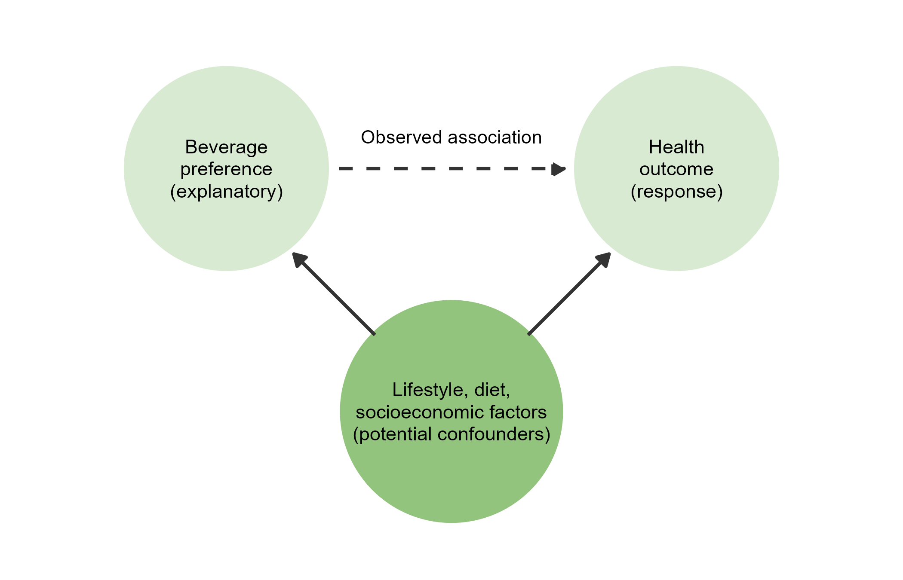
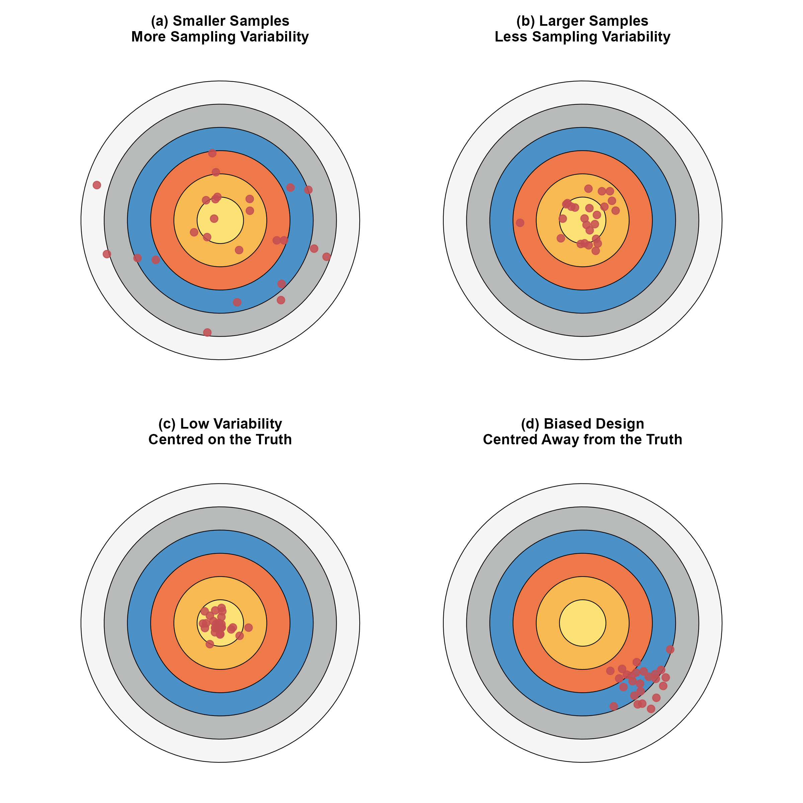

<style>
/* ============================================================
   CHAPTER 6 — PAGE + COLLAPSIBLE TABLE OF CONTENTS
   ============================================================ */

:root {
  --toc-width: 300px;
  --toc-collapsed-gutter: 72px;
  --chapter-width: 1100px;

  --ink: #23364a;
  --accent: #2c3e50;
  --line: #d8dee4;
  --soft: #f6f8fa;
  --toc-background: #f7f9fb;
}


/* ============================================================
   GENERAL PAGE
   ============================================================ */

html {
  scroll-behavior: smooth;
}

body {
  font-size: 17px;
  line-height: 1.65;
  color: var(--ink);
}

.main-container {
  max-width: var(--chapter-width) !important;
}


/* ============================================================
   HIDE DUMMY CHAPTER CONTENT
   ============================================================ */

/*
   Chapter 6 is the visible chapter heading; Pandoc applies a section-number offset of 5 so that its subsections begin at 6.1.

   Hide the visible "Chapter 6" H1 because the document title
   already says Chapter 6, but KEEP the section itself so that
   H2 headings are numbered 6.1, 6.2, 6.3, ...
*/
.section.chapter-root > h1 {
  display: none !important;
}


/* ============================================================
   HIDE EARLIER DUMMY CHAPTERS FROM THE TABLE OF CONTENTS
   ============================================================ */

/*
   R Markdown/tocify does not reliably expose the chapter names
   through data-unique, so select them through their generated
   href values instead.
*/

#TOC li:has(a[href="#chapter-1-dummy"]),
#TOC li:has(a[href="#chapter-2-dummy"]),
#TOC li:has(a[href="#chapter-3-dummy"]),
#TOC li:has(a[href="#chapter-4-dummy"]),
#TOC li:has(a[href="#chapter-5-dummy"]) {
  display: none !important;
}


/*
   Also hide the Chapter 6 parent entry itself.

   Its children — 6.1, 6.2, 6.3, ... — remain visible.
*/
#TOC li:has(> a[href="#chapter-6"]) > a[href="#chapter-6"] {
  display: none !important;
}


/*
   tocify may place the Chapter 6 subsections inside the same
   list item. Remove spacing belonging to the hidden parent.
*/
#TOC li:has(> a[href="#chapter-6"]) {
  margin-top: 0 !important;
}


/* ============================================================
   ACCESSIBILITY
   ============================================================ */

.sr-only {
  position: absolute;
  width: 1px;
  height: 1px;
  padding: 0;
  margin: -1px;
  overflow: hidden;
  clip: rect(0, 0, 0, 0);
  white-space: nowrap;
  border: 0;
}


/* ============================================================
   SIDEBAR TOGGLE BUTTON
   ============================================================ */

#toc-toggle {
  position: fixed;

  top: 16px;
  left: calc(var(--toc-width) + 14px);

  width: 42px;
  height: 42px;

  display: flex;
  align-items: center;
  justify-content: center;

  padding: 0;

  border: 1px solid #c7d0d9;
  border-radius: 8px;

  background: #ffffff;
  color: var(--ink);

  box-shadow: 0 2px 8px rgba(24, 39, 55, 0.13);

  cursor: pointer;

  font-size: 24px;
  line-height: 1;

  z-index: 1200;

  transition:
    left 0.25s ease,
    background-color 0.2s ease,
    box-shadow 0.2s ease,
    transform 0.2s ease;
}

#toc-toggle:hover {
  background: #eef3f7;
  box-shadow: 0 3px 10px rgba(24, 39, 55, 0.18);
}

#toc-toggle:focus-visible {
  outline: 3px solid rgba(44, 62, 80, 0.28);
  outline-offset: 2px;
}


/* Open/close icons */

#toc-toggle .menu-icon {
  display: none;
}

#toc-toggle .close-icon {
  display: inline;
}


/* Button position when sidebar is collapsed */

body.toc-collapsed #toc-toggle {
  left: 14px;
}

body.toc-collapsed #toc-toggle .menu-icon {
  display: inline;
}

body.toc-collapsed #toc-toggle .close-icon {
  display: none;
}


/* ============================================================
   DESKTOP LAYOUT
   ============================================================ */

@media screen and (min-width: 992px) {

  /*
     Make room for fixed sidebar.
  */
  .main-container {
    width: 100% !important;
    max-width: none !important;

    padding-left: calc(var(--toc-width) + 30px) !important;
    padding-right: 35px !important;

    box-sizing: border-box !important;

    transition: padding-left 0.25s ease;
  }


  /*
     When sidebar is collapsed, reclaim almost all of the space.
  */
  body.toc-collapsed .main-container {
    padding-left: var(--toc-collapsed-gutter) !important;
  }


  /*
     Bootstrap normally reserves a column for the TOC.
     The TOC is fixed now, so remove that reserved column.
  */
  .main-container > .row-fluid > .col-xs-12.col-sm-4.col-md-3,
  .main-container > .row > .col-xs-12.col-sm-4.col-md-3 {
    width: 0 !important;
    min-height: 0 !important;
    padding: 0 !important;
    margin: 0 !important;
  }


  /* ----------------------------------------------------------
     FLOATING TOC
     ---------------------------------------------------------- */

  #TOC,
  #TOC.tocify {
    position: fixed !important;

    top: 0 !important;
    bottom: 0 !important;
    left: 0 !important;

    width: var(--toc-width) !important;
    max-height: 100vh !important;

    box-sizing: border-box !important;

    overflow-y: auto !important;
    overflow-x: hidden !important;

    margin: 0 !important;
    padding: 72px 16px 28px 18px !important;

    background: var(--toc-background) !important;

    border: 0 !important;
    border-right: 1px solid var(--line) !important;
    border-radius: 0 !important;

    box-shadow: none !important;

    z-index: 1100 !important;

    transform: translateX(0);

    transition: transform 0.25s ease;
  }


  /*
     Completely slide sidebar off screen when collapsed.
  */
  body.toc-collapsed #TOC,
  body.toc-collapsed #TOC.tocify {
    transform: translateX(calc(-1 * var(--toc-width)));
  }


  /*
     Allow long section headings to wrap rather than getting
     clipped.
  */
  #TOC a {
    white-space: normal !important;
    overflow-wrap: break-word !important;
    word-break: normal !important;
  }


  /* ----------------------------------------------------------
     TOC TYPOGRAPHY
     ---------------------------------------------------------- */

  #TOC .tocify-item {
    border-radius: 4px;
  }

  #TOC .tocify-item a {
    color: var(--ink);
    text-decoration: none;
  }

  #TOC .tocify-item:hover {
    background: #e9eef3;
  }

  #TOC .tocify-item.active {
    background: var(--accent) !important;
  }

  #TOC .tocify-item.active a {
    color: #ffffff !important;
  }


  /* ----------------------------------------------------------
     MAIN CHAPTER CONTENT
     ---------------------------------------------------------- */

  .toc-content,
  .toc-content.col-xs-12.col-sm-8.col-md-9 {
    width: 100% !important;
    max-width: var(--chapter-width) !important;

    float: none !important;

    margin-left: auto !important;
    margin-right: auto !important;

    padding-left: 15px !important;
    padding-right: 15px !important;

    box-sizing: border-box !important;
  }


  /*
     Fallback for Pandoc output that does not use Bootstrap's
     normal R Markdown container structure.
  */
  body.standalone-pandoc {
    width: calc(100% - var(--toc-width)) !important;
    max-width: none !important;

    box-sizing: border-box !important;

    margin: 0 0 0 var(--toc-width) !important;
    padding: 50px 45px !important;

    transition:
      width 0.25s ease,
      margin-left 0.25s ease,
      padding-left 0.25s ease;
  }

  body.standalone-pandoc.toc-collapsed {
    width: 100% !important;

    margin-left: 0 !important;
    padding-left: var(--toc-collapsed-gutter) !important;
  }

  body.standalone-pandoc > header,
  body.standalone-pandoc > section {
    max-width: var(--chapter-width);

    margin-left: auto;
    margin-right: auto;
  }
}


/* ============================================================
   MOBILE / TABLET
   ============================================================ */

@media screen and (max-width: 991px) {

  .main-container {
    width: auto !important;
    max-width: var(--chapter-width) !important;

    margin-left: auto !important;
    margin-right: auto !important;

    padding: 70px 18px 24px !important;

    box-sizing: border-box !important;
  }


  /*
     Toggle remains at upper-left on mobile.
  */
  #toc-toggle,
  body.toc-collapsed #toc-toggle {
    left: 12px;
  }


  /*
     Mobile starts with menu icon.
  */
  #toc-toggle .menu-icon,
  body.toc-collapsed #toc-toggle .menu-icon {
    display: inline;
  }

  #toc-toggle .close-icon,
  body.toc-collapsed #toc-toggle .close-icon {
    display: none;
  }


  /*
     Show X while the mobile TOC is open.
  */
  body.toc-mobile-open #toc-toggle .menu-icon {
    display: none;
  }

  body.toc-mobile-open #toc-toggle .close-icon {
    display: inline;
  }


  /* ----------------------------------------------------------
     MOBILE TOC DRAWER
     ---------------------------------------------------------- */

  #TOC,
  #TOC.tocify {
    position: fixed !important;

    top: 0 !important;
    bottom: 0 !important;
    left: 0 !important;

    width: min(84vw, 320px) !important;
    max-height: 100vh !important;

    box-sizing: border-box !important;

    overflow-y: auto !important;
    overflow-x: hidden !important;

    margin: 0 !important;
    padding: 72px 18px 28px !important;

    background: var(--toc-background) !important;

    border: 0 !important;
    border-right: 1px solid var(--line) !important;
    border-radius: 0 !important;

    z-index: 1100 !important;

    transform: translateX(-105%);

    transition: transform 0.25s ease;
  }

  body.toc-mobile-open #TOC,
  body.toc-mobile-open #TOC.tocify {
    transform: translateX(0);

    box-shadow: 6px 0 18px rgba(24, 39, 55, 0.16);
  }


  /*
     Prevent long headings from being clipped.
  */
  #TOC a {
    white-space: normal !important;
    overflow-wrap: break-word !important;
    word-break: normal !important;
  }


  body.standalone-pandoc {
    width: auto !important;
    max-width: var(--chapter-width) !important;

    margin: 0 auto !important;
    padding: 70px 18px 24px !important;

    box-sizing: border-box !important;
  }
}


/* ============================================================
   SECTION HEADINGS
   ============================================================ */

h1,
h2,
h3,
h4,
h5 {
  margin-top: 1.6em;
}

h2 {
  border-bottom: 3px solid var(--accent);
  padding-bottom: 0.25em;
}

h3 {
  border-bottom: 1px solid var(--line);
  padding-bottom: 0.2em;
}


/* ============================================================
   BLOCKQUOTES / DEFINITION BOXES
   ============================================================ */

blockquote {
  border-left: 4px solid var(--accent);

  background: #f7f9fa;

  padding: 0.7em 1em;
  margin-top: 1.2em;
  margin-bottom: 1.2em;
}


/* ============================================================
   TABLES
   ============================================================ */

table {
  width: 100%;

  margin: 1.35em auto;

  border-collapse: separate !important;
  border-spacing: 0;

  background: #ffffff;

  border: 1px solid #d6dde5;
  border-radius: 8px;

  overflow: hidden;

  box-shadow: 0 2px 8px rgba(24, 39, 55, 0.06);
}

table thead th {
  padding: 0.72em 0.9em !important;

  background: var(--accent);
  color: #ffffff;

  border: 0 !important;
  border-bottom: 1px solid #1e2d3b !important;

  font-weight: 700;

  vertical-align: middle !important;
}

table tbody td {
  padding: 0.65em 0.9em !important;

  border: 0 !important;
  border-bottom: 1px solid #e5e9ee !important;

  vertical-align: middle !important;
}

table tbody tr:nth-child(even) td {
  background: #f7f9fb;
}

table tbody tr:hover td {
  background: #eef4f8;
}

table tbody tr:last-child td {
  border-bottom: 0 !important;
}


/* ============================================================
   IMAGES
   ============================================================ */

img {
  display: block;

  max-width: 100%;
  height: auto;

  margin: 1.4em auto;

  border: 1px solid #e1e4e8;
  border-radius: 7px;
}


/* ============================================================
   MATHEMATICS
   ============================================================ */

.math.display {
  overflow-x: auto;
}


/* ============================================================
   HIDE R MARKDOWN CODE-FOLDING UI
   ============================================================ */

.btn-code,
.code-folding-btn,
div.btn-group.pull-right {
  display: none !important;
}
</style>

<button id="toc-toggle"
        type="button"
        aria-label="Toggle table of contents"
        aria-expanded="true">
  <span class="menu-icon" aria-hidden="true">&#9776;</span>
  <span class="close-icon" aria-hidden="true">&times;</span>
  <span class="sr-only">Toggle table of contents</span>
</button>

<script>
document.addEventListener("DOMContentLoaded", function () {
  const button = document.getElementById("toc-toggle");

  if (!button) return;

  button.addEventListener("click", function () {
    if (window.innerWidth <= 991) {
      document.body.classList.toggle("toc-mobile-open");

      const isOpen =
        document.body.classList.contains("toc-mobile-open");

      button.setAttribute("aria-expanded", isOpen);
    } else {
      document.body.classList.toggle("toc-collapsed");

      const isOpen =
        !document.body.classList.contains("toc-collapsed");

      button.setAttribute("aria-expanded", isOpen);
    }
  });
});
</script>


```{r setup, include=FALSE, echo=FALSE, warning=FALSE, message=FALSE}
knitr::opts_chunk$set(
  echo = TRUE,
  warning = FALSE,
  message = FALSE,
  error = FALSE,
  fig.align = "center",
  fig.width = 6,
  fig.height = 4
)

library(ggplot2)
library(dplyr)
library(tidyr)
library(gridExtra)

set.seed(123)

lecture_theme <- theme_minimal(base_size = 11) +
  theme(
    plot.title = element_text(size = 13, face = "bold", hjust = 0.5),
    axis.title = element_blank(),
    axis.text = element_blank(),
    panel.grid = element_blank(),
    plot.background = element_rect(fill = "white", colour = NA),
    panel.background = element_rect(fill = "white", colour = NA),
    plot.margin = margin(8, 10, 8, 10)
  )

lecture_chart_theme <- theme_minimal(base_size = 11) +
  theme(
    plot.title = element_text(size = 13, face = "bold", hjust = 0.5),
    plot.subtitle = element_text(size = 10.5, hjust = 0.5),
    axis.title = element_text(size = 11.5),
    axis.text = element_text(size = 9.5, colour = "#333333"),
    panel.grid.minor = element_blank(),
    plot.background = element_rect(fill = "white", colour = NA),
    panel.background = element_rect(fill = "white", colour = NA),
    plot.margin = margin(8, 10, 8, 10)
  )

save_plot <- function(filename, plot, width, height) {
  ggsave(
    filename = filename,
    plot = plot,
    width = width,
    height = height,
    units = "in",
    dpi = 300,
    bg = "white"
  )
}

# =============================================================
# Chapter 6: Confounding Diagram
# =============================================================

create_circle <- function(x0, y0, r, node_name, fill_colour) {
  theta <- seq(0, 2 * pi, length.out = 120)
  data.frame(
    x = x0 + r * cos(theta),
    y = y0 + r * sin(theta),
    node = node_name,
    fill = fill_colour
  )
}

confounding_circles <- rbind(
  create_circle(0, 2.7, 1.15, "Explanatory", "#D9EAD3"),
  create_circle(5, 2.7, 1.15, "Response", "#D9EAD3"),
  create_circle(2.5, 0, 1.25, "Lurking", "#93C47D")
)

confounding_labels <- data.frame(
  x = c(0, 5, 2.5),
  y = c(2.7, 2.7, 0),
  label = c(
    "Beverage\npreference\n(explanatory)",
    "Health\noutcome\n(response)",
    "Lifestyle, diet,\nsocioeconomic factors\n(potential confounders)"
  )
)

p_confound <- ggplot() +
  geom_polygon(
    data = confounding_circles,
    aes(x = x, y = y, group = node, fill = fill),
    colour = "white",
    linewidth = 0.5
  ) +
  scale_fill_identity() +
  # The dashed arrow represents the observed explanatory-response association.
  geom_segment(
    aes(x = 1.25, y = 2.7, xend = 3.75, yend = 2.7),
    arrow = arrow(length = unit(0.25, "cm"), type = "closed"),
    linewidth = 0.9,
    linetype = "dashed",
    colour = "#333333"
  ) +
  annotate("text", x = 2.5, y = 3.05, label = "Observed association", size = 3.7) +
  # A confounder is related to the explanatory variable and the response.
  geom_segment(
    aes(x = 1.65, y = 0.85, xend = 0.75, yend = 1.75),
    arrow = arrow(length = unit(0.25, "cm"), type = "closed"),
    linewidth = 0.9,
    colour = "#333333"
  ) +
  geom_segment(
    aes(x = 3.35, y = 0.85, xend = 4.25, yend = 1.75),
    arrow = arrow(length = unit(0.25, "cm"), type = "closed"),
    linewidth = 0.9,
    colour = "#333333"
  ) +
  geom_text(
    data = confounding_labels,
    aes(x = x, y = y, label = label),
    size = 3.8,
    lineheight = 0.95
  ) +
  coord_fixed(xlim = c(-1.4, 6.4), ylim = c(-1.4, 4.1)) +
  theme_void() +
  theme(plot.margin = margin(10, 10, 10, 10))

save_plot("fig_ch6_confounding.png", p_confound, width = 7, height = 4.5)

# =============================================================
# Chapter 6: Sampling Variability and Bias Analogy
# =============================================================

make_circle <- function(r, fill_colour) {
  theta <- seq(0, 2 * pi, length.out = 120)
  data.frame(
    x = r * cos(theta),
    y = r * sin(theta),
    fill = fill_colour
  )
}

rings <- rbind(
  data.frame(make_circle(6, "#F5F5F5"), ring = 1),
  data.frame(make_circle(5, "#B8B9B9"), ring = 2),
  data.frame(make_circle(4, "#4B91C8"), ring = 3),
  data.frame(make_circle(3, "#EE784A"), ring = 4),
  data.frame(make_circle(2, "#F8B953"), ring = 5),
  data.frame(make_circle(1, "#FCE174"), ring = 6)
)

sampling_scenarios <- c(
  "(a) Smaller Samples\nMore Sampling Variability",
  "(b) Larger Samples\nLess Sampling Variability",
  "(c) Low Variability\nCentred on the Truth",
  "(d) Biased Design\nCentred Away from the Truth"
)

rings_all <- do.call(
  rbind,
  lapply(sampling_scenarios, function(s) data.frame(rings, scenario = s))
)
rings_all$scenario <- factor(rings_all$scenario, levels = sampling_scenarios)

# Each point represents an estimate produced by one repeated sample.
# The larger-sample panel is more tightly concentrated around the true parameter.
set.seed(42)
pts_small <- data.frame(
  x = rnorm(25, 0, 2.0),
  y = rnorm(25, 0, 2.0),
  scenario = sampling_scenarios[1]
)
pts_large <- data.frame(
  x = rnorm(25, 0, 0.9),
  y = rnorm(25, 0, 0.9),
  scenario = sampling_scenarios[2]
)
pts_precise <- data.frame(
  x = rnorm(25, 0, 0.45),
  y = rnorm(25, 0, 0.45),
  scenario = sampling_scenarios[3]
)
pts_biased <- data.frame(
  x = rnorm(25, 2.5, 0.75),
  y = rnorm(25, -2.5, 0.75),
  scenario = sampling_scenarios[4]
)

pts_all <- rbind(pts_small, pts_large, pts_precise, pts_biased)
pts_all$scenario <- factor(pts_all$scenario, levels = sampling_scenarios)

p_targets <- ggplot() +
  geom_polygon(
    data = rings_all,
    aes(x = x, y = y, group = interaction(scenario, ring), fill = fill),
    colour = "black",
    linewidth = 0.25
  ) +
  scale_fill_identity() +
  geom_point(data = pts_all, aes(x = x, y = y), colour = "#C44E52", size = 2.2, alpha = 0.85) +
  facet_wrap(~scenario, ncol = 2) +
  coord_fixed(xlim = c(-6.5, 6.5), ylim = c(-6.5, 6.5)) +
  theme_void() +
  theme(
    plot.background = element_rect(fill = "white", colour = NA),
    strip.text = element_text(face = "bold", size = 10.5, margin = margin(b = 8), colour = "black"),
    panel.spacing = unit(1.5, "lines"),
    plot.margin = margin(10, 10, 10, 10)
  )

save_plot("fig_ch6_archery.png", p_targets, width = 8, height = 8)
```

# Chapter 6 {.chapter-root .unlisted}

## Gathering Data

Statistical methods are useful only when the data have been collected in a way that addresses the scientific question. Before any calculation is performed, the study design should make clear who or what is being studied, what is being measured and how the observations are obtained.

Many scientific questions concern populations that are too large to study completely. A health researcher may want to estimate a proportion for adults in a country. A wildlife biologist may want to learn about a fish population in a river system. A laboratory may want to understand a biological process from a manageable set of specimens. In each situation, the quality of the conclusion depends on the quality of the data-generation process.

This chapter begins by separating observational studies from experiments. It then develops the ideas of populations, samples, probability sampling and common sources of survey bias. The final sections compare case-control and cohort studies, which are two important observational designs used in health and life-science research.

> **Study design comes before statistical analysis**
>
> A numerical method cannot repair a study design that systematically excludes important groups, measures the wrong variable or mixes the effect of an explanatory variable with other factors. Statistical reasoning therefore begins with a careful description of how the data were generated.

### Observation versus Experiment

Two broad approaches are used to gather data in the life sciences. An **observational study** records information without deliberately assigning the explanatory conditions of interest. An **experiment** deliberately assigns a treatment or condition to experimental units, then observes the response.

> **Observational study**
>
> An observational study observes individuals and measures variables of interest without deliberately assigning the main explanatory condition being studied. Observational studies are useful for describing populations, comparing naturally occurring groups and studying exposures that cannot ethically or practically be assigned.

> **Experiment**
>
> An experiment deliberately imposes one or more treatments on experimental units in order to compare their responses. A well-designed randomized experiment can provide strong evidence about cause and effect because random assignment helps separate the treatment effect from other variables.

The distinction is important because an observational association can have several explanations. Individuals who differ in the explanatory variable may also differ in age, environment, behaviour, socioeconomic conditions or other characteristics. A randomized experiment is designed to make treatment groups comparable before the treatment is applied.

Observational studies remain essential when experiments would be unethical, impossible or scientifically inappropriate. For example, a researcher should not randomly assign people to smoke cigarettes in order to study long-term health effects. In such settings, causal reasoning must rely on observational evidence together with careful design, subject-matter knowledge and assumptions about possible confounding.

A useful first-year distinction is therefore that **random sampling** helps support generalization from a sample to a population, while **random assignment** helps support causal comparisons between treatments. These two uses of randomness solve different problems.

### Confounding and Lurking Variables

The main difficulty in an observational study is that the explanatory variable can be associated with other variables that also affect the response. This issue is described through the related ideas of lurking variables and confounding.

> **Lurking variable**
>
> A lurking variable is a variable that is not included as an explanatory or response variable in the analysis but may help explain the observed relationship between the variables that are measured.

> **Confounding**
>
> Confounding occurs when the effects of two or more explanatory variables on a response cannot be separated clearly from the available data.

A lurking variable is therefore a possible source of an alternative explanation. Confounding describes the resulting difficulty in separating effects. The terms are related, but they are not identical.

Confounding is a major concern in observational research because naturally occurring groups can differ in many ways. Careful design can reduce this problem through methods such as restriction, matching or stratification. Statistical adjustment can also account for measured variables. These approaches can reduce confounding, but unmeasured differences may still remain.

### Confounding in an Observational Study

**Example 6.2: Wine, Beer, or Spirits?**

**Question**

Some observational studies have reported that health outcomes differ among moderate drinkers who prefer wine, beer or spirits. Does an observed difference in health establish that the type of beverage itself causes the difference?

**Explanation**

Beverage preference can be related to many other characteristics. Groups that prefer different beverages may also differ in diet, smoking behaviour, exercise, income, education, access to health care or other factors. If those characteristics also relate to the health outcome, the effect of beverage preference cannot be separated cleanly from the effects of the other variables.

The diagram below represents this structure. The dashed arrow represents the observed association between beverage preference and health. The lower node represents potential confounding variables that can be related to both the explanatory variable and the response.



**Solution**

The observational association does not by itself establish a causal effect of beverage type. Potential confounders provide alternative explanations for the observed difference. A scientifically appropriate conclusion is that beverage preference and health are associated in the observed data after considering the study design. A causal claim would require stronger evidence and careful control of competing explanations.

The confounding example shows why the way individuals enter a study matters. The next step is to consider how a sample can be chosen so that it gives useful information about a larger population.

---

## Sampling

A **sample** is a subset of a larger population. Sampling is necessary because a complete census of every individual is often too expensive, too slow or impossible. The goal is not simply to obtain many observations. The goal is to obtain observations through a design that supports the intended generalization.

A wildlife agency may want to estimate the number of salmon migrating through a river system. A public-health agency may want to describe a characteristic of adults in a country. A virology laboratory may want to characterize circulating viral strains. In each case, the sample should be connected clearly to the population about which the conclusion will be made.

### Core Terminology

Several terms should be distinguished before a sample is selected.

> **Population, sample, sampling frame and sampling design**
>
> **Population:** The full group of individuals or units about which information is desired
>
> **Sample:** The subset of individuals or units from which data are actually collected
>
> **Sampling frame:** The practical list or mechanism used to identify units that can be selected for the sample
>
> **Sampling design:** The planned method used to choose the sample from the sampling frame or population

Two additional terms connect sampling to later statistical inference.

> **Parameter and statistic**
>
> A **parameter** is a numerical characteristic of a population. A **statistic** is a numerical characteristic calculated from a sample. Statistical inference uses sample statistics to learn about unknown population parameters.

For example, the true proportion of adults in a population with a particular characteristic is a parameter. The proportion observed in a random sample is a statistic. Different random samples will usually produce slightly different statistics, which leads to the idea of sampling variability.

### Why a Representative Sample Matters

A familiar analogy is a well-mixed pot of soup. A spoonful taken after thorough mixing can provide useful information about the flavour of the pot because the ingredients are distributed throughout the mixture. The analogy should not be interpreted as meaning that one spoonful represents the pot perfectly. Small samples can still vary by chance.

A blood specimen provides a similar idea. A small specimen can be informative about a larger biological system when the measured component is sufficiently well mixed and the collection process is appropriate. Measurement error, biological variation and handling procedures can still affect the result.

Human populations, wildlife populations and ecological systems are usually much more heterogeneous than a pot of soup. Individuals differ across many characteristics. A sampling design is therefore needed to give relevant groups an appropriate chance of being represented.

### Planning a Sample

A useful sampling plan begins by answering several questions before data collection starts.

1. **The target population must be defined clearly.** The definition should state exactly which individuals or units the scientific conclusion is intended to describe.
2. **The variables must be defined operationally.** The study should state what is being measured, how it is measured and how categories or thresholds are determined.
3. **The sampling frame must be identified.** The frame should be examined for groups that may be missing or duplicated.
4. **The sampling method must be specified.** The design should explain how chance, stratification or other selection rules will be used.

These steps improve reproducibility because another researcher can determine who was eligible, how measurements were classified and how individuals entered the sample.

### Defining a Population and a Variable

**Real-World Example: The Microplastic Study**

**Question**

A toxicology team wants to estimate the percentage of adults with detectable microplastic particles in a blood specimen. What definitions are needed before sampling begins?

**Explanation**

The phrase "adults" is too broad for a reproducible study. The researchers need a target population with geographic, age and eligibility criteria. The phrase "detectable microplastics" also requires an operational definition because the measured result depends on the laboratory method and its detection limits.

The original notes use an illustrative definition in which the population consists of healthy adults aged 18 to 65 living in North America with specified exclusions. The variable is classified as positive when the laboratory method detects synthetic polymer particles above a stated size threshold. These definitions are examples of how eligibility and measurement rules can be made explicit rather than claims about one required scientific standard.

**Solution**

The study should define both the target population and the laboratory outcome before data are collected. A clear population definition determines to whom the result is intended to apply. A clear measurement definition determines what a positive result means. The sampling frame and selection method must then be chosen to connect the actual sample to that target population.

### Generalizing from a Sample

A sample supports statistical generalization only to the extent that the sampling design connects the observed units to the target population. A convenience sample from a few accessible locations may provide valuable biological information, but probability calculations alone do not make it representative of an entire continent or species.

**White-Nose Syndrome in Bats**

**Question**

Suppose ecologists study 200 little brown bats from three accessible caves in upstate New York in order to learn about white-nose syndrome across North America. How far can the results be generalized from the sampling design alone?

**Explanation**

The sampled bats provide direct information about the locations and conditions that were actually represented. Bats in other regions may experience different temperatures, elevations, habitats or disease dynamics. Because the three caves were chosen for accessibility rather than by a probability sample of North American bat habitats, the sampling design does not provide a statistical guarantee that the sample represents all North American little brown bats.

Subject-matter evidence can still support a broader scientific argument. For example, researchers may compare biological mechanisms across environments or combine results from multiple regions. This type of broader generalization concerns **external validity** and requires scientific justification beyond the original sampling mechanism.

**Solution**

The strongest design-based conclusions apply to populations represented by the sampled caves and similar conditions. Generalization to all North American little brown bats requires additional biological evidence, broader sampling or both. The limitation does not make the original study useless. It defines the scope of the conclusion that the data can support directly.

The next section develops sampling designs that use chance to reduce systematic selection bias and support population inference more directly.

---

## Sampling Designs

Statistical inference uses information from a sample to learn about a population. Reliable inference depends on two different ideas that should not be confused: **sampling variability** and **bias**.

Sampling variability is the natural sample-to-sample variation produced by random selection. Bias is a systematic tendency for a method to miss the target in a particular direction. A larger random sample usually reduces sampling variability. A larger sample does not automatically remove bias.

### Sampling Variability and Bias

The archery analogy below is useful when each plotted point is interpreted as an **estimate from one repeated sample**. The centre of the target represents the true population parameter. A collection of estimates that is centred on the target is unbiased in the long run. A collection that is tightly concentrated has low variability.



The panels illustrate several ideas. Smaller samples tend to produce more variable estimates. Larger samples tend to produce less variable estimates when the sampling design is otherwise comparable. A precise unbiased method produces estimates tightly concentrated around the true parameter. A biased design can produce estimates that are tightly clustered around the wrong value.

> **Bias**
>
> A sampling or measurement method is biased when it systematically tends to produce results that are shifted away from the true population value in a particular direction.

The distinction between variability and bias is fundamental. Random variation can often be reduced by increasing sample size. Systematic bias requires a change in the design or measurement process.

### Poor Sampling Designs

Two common sampling methods allow human choice to determine who enters the sample. These methods can be useful for exploratory work, but they do not provide the same basis for population inference as probability sampling.

#### Convenience Samples

A **convenience sample** selects individuals who are easy to reach. A survey conducted only among people passing through one shopping centre is an example. The main concern is that people who are convenient to contact may differ systematically from the target population in age, work schedule, income, health status or other relevant characteristics.

The problem is not that every convenience sample must be badly distorted. The problem is that the design gives no known probability mechanism connecting the sample to the full population, so the direction and size of selection bias are difficult to assess.

#### Voluntary Response Samples

A **voluntary response sample** is created when an open invitation allows individuals to choose whether to participate. Online opt-in polls, call-in polls and open website surveys are examples.

People with strong opinions, unusual experiences or a special interest in the topic may be more likely to respond. This self-selection can produce substantial bias because participation depends directly on individual choice rather than on random selection from the population.

### Probability Samples

A **probability sample** uses a random mechanism so that selection probabilities are known or can be determined from the design. Probability sampling does not guarantee that one particular sample will perfectly match the population. Its advantage is that chance rather than personal judgement controls selection, which provides a mathematical basis for measuring sampling variability.

> **Simple random sample**
>
> A simple random sample, abbreviated SRS, of size $n$ is selected so that every possible sample of size $n$ from the population has the same chance of being chosen.

As a consequence, each individual has the same probability of selection in an SRS. Modern studies usually implement random selection with software rather than by physically drawing names from a container.

A simple random sample is an important reference design, but large studies often use more efficient or practical probability designs.

#### Other Probability Designs

A **stratified random sample** divides the population into non-overlapping groups called strata, then takes a probability sample within each stratum. Strata may be based on age group, geographic region or another characteristic that is important to the study. Stratification can ensure that each specified subgroup contributes observations and can improve precision when the strata are internally similar.

A **multistage sample** selects units in several stages. A national education study might first select geographic areas, then schools within selected areas, then classrooms or students within selected schools. Each stage follows a probability selection rule. Multistage sampling is common when a complete list of all individuals in a large population is unavailable or impractical to use directly.

A **cluster sample** selects naturally occurring groups such as schools, clinics or geographic areas, then studies all or a sample of individuals within the selected clusters. Cluster sampling can reduce travel or administrative cost, although observations within a cluster may be more similar to one another than observations selected independently across the population.

### Random Sampling and Random Assignment

Random sampling and random assignment both use chance, but they answer different questions.

| Method | Main purpose | Main conclusion supported |
|:--|:--|:--|
| Random sampling | Selects units from a population | Supports generalization to the population represented by the sampling design |
| Random assignment | Assigns experimental units to treatments | Supports causal comparison of treatments when the experiment is otherwise well designed |

A study can use one form of randomness without using the other. For example, a clinical experiment may use volunteers rather than a random sample of all patients, but it may randomly assign those volunteers to treatments. The experiment can support a causal comparison within the study population while broader generalization requires additional care.

---

## Sample Surveys

A **sample survey** collects information from a sample of individuals in order to describe a population. Many sample surveys are cross-sectional, meaning that they describe the population during a particular time period. Repeated cross-sectional surveys can also be conducted at regular intervals to track population changes over time.

A sample survey should not be confused with a **census**. A census attempts to collect information from every unit in the target population, while a sample survey intentionally studies only a subset. The American Community Survey and many public-health surveys are sample surveys. The decennial United States Census is designed as a census rather than as a sample survey.

Even a well-designed probability sample can produce biased survey results if the sampling frame is incomplete, selected people do not respond or the questions are measured poorly. Four important sources of survey error are undercoverage, nonresponse, response bias and question wording or order.

### Undercoverage

A **sampling frame** is the practical list or mechanism from which the sample is selected. **Undercoverage** occurs when some members of the target population are missing from the frame or have a lower chance of inclusion than the intended design requires.

A household-mailing frame, for example, can miss people without stable household addresses or people living in institutional or group settings. If the omitted groups differ from the included groups on the survey variable, the resulting estimates can be biased.

**Example 6.8: The Cell Phone Problem**

**Question**

Why did landline-only telephone surveys become increasingly vulnerable to undercoverage as more households relied only on mobile phones?

**Explanation**

A landline-only sampling frame excludes households that do not have a landline. By the mid-2010s, roughly half of United States households were wireless-only. Wireless-only households also differed from landline households on age and several social or health characteristics. A survey that omitted them could therefore misrepresent the target population.

Telephone surveys responded by incorporating mobile-phone numbers into dual-frame or related sampling designs. The change illustrates how a sampling frame must evolve when the population's communication patterns change.

**Solution**

The problem is undercoverage because an important part of the target population has little or no chance of selection from a landline-only frame. A broader frame that includes both landline and mobile-phone users reduces this source of bias.

### Nonresponse Bias

**Nonresponse** occurs when a person selected for the sample cannot be contacted or chooses not to participate. Nonresponse does not automatically create bias. Bias arises when the people who respond differ systematically from the selected people who do not respond on variables related to the survey outcome.

Survey response rates vary by survey, year and mode of contact. The original notes contrast government surveys that use intensive follow-up with scientific surveys that experience moderate nonresponse and commercial polls that can have very low response rates. The numerical rates should therefore be interpreted as examples rather than universal constants.

Weighting adjustments can reduce nonresponse bias when useful information about response patterns is available. Weighting cannot guarantee that all bias has been removed because respondents and nonrespondents may differ in ways that were not measured.

A crucial distinction separates nonresponse from voluntary response. In a probability sample, nonresponse occurs **after** individuals have been selected by the design. In a voluntary response sample, the people who participate select themselves into the sample from the beginning.

### Response Bias

**Response bias** occurs when recorded answers differ systematically from the values or opinions the survey intends to measure. The bias can arise from the respondent, interviewer, measurement method or social setting.

Several mechanisms are common. Respondents may underreport behaviours they believe will be judged negatively or overreport behaviours viewed favourably. Memory can shift the reported timing of past events, a phenomenon sometimes called **telescoping**. Interviewer wording, tone or other characteristics can also influence answers.

For example, a respondent may report an inaccurate amount of alcohol use because of social desirability. A person who visited a dentist eight months ago may incorrectly remember the visit as occurring within the last six months. These errors are different from sampling error because increasing the sample size does not automatically correct them.

### Wording and Order of Questions

The wording and order of survey questions can influence the responses. A question that uses emotionally charged language, provides unbalanced alternatives or contains ambiguous terms can change what respondents think they are being asked.

The original notes give a wording example in which responses differed when government spending was described as "assistance to the poor" rather than "welfare". The numerical percentages in that example illustrate a general lesson: two phrases that appear to refer to similar policy areas can carry different meanings or emotional associations for respondents.

**Example 6.10: Question Order and Reported Happiness**

**Question**

A study asks university students about overall life satisfaction and the number of dates they had in the previous month. Why might the correlation between the two answers change when the order of the questions is reversed?

**Explanation**

Question order can change what information is most available in a respondent's mind. When the dating question is asked first, it can make recent dating experiences more salient before the respondent evaluates overall life satisfaction. The original example reports a correlation near zero when general happiness is asked first and a much stronger positive correlation when the dating question is asked first.

**Solution**

The change does not imply that the underlying relationship between dating and happiness changed within a few minutes. It shows that the measurement process changed. The order of the questions influenced the way respondents interpreted or answered the later question.

A survey result should therefore be evaluated together with the exact wording, question order, sampling frame, response process and nonresponse information. The numerical estimate is only one part of the evidence.

### A Survey Quality Checklist

A useful survey evaluation can be organized around a short sequence of questions. The target population and sampling frame should be clear. The method of selection should be identified. Undercoverage and nonresponse should be considered separately. The wording and order of questions should be reviewed for possible response effects. The final conclusion should then be limited to the population and variables that the design actually supports.

The survey sections focus on describing populations at a point or period in time. Some scientific questions instead concern how an exposure is related to a later outcome. Case-control and cohort studies are designed for that purpose.

---

## Cohorts and Case-Control Studies

Case-control and cohort studies are observational designs used to study relationships between exposures and outcomes. They are especially important when an experiment would be unethical, impractical or too slow.

A rare disease provides a useful motivation. If a disease occurs in about 1 person out of 10,000, a random sample of 100,000 people would contain about 10 cases on average. A case-control study can investigate such an outcome more efficiently by deliberately including people who already have the disease.

### Case-Control Studies

A **case-control study** selects individuals according to their outcome status. The cases have the outcome of interest. The controls do not have the outcome and should ideally come from the same source population that produced the cases.

> **Case-control study**
>
> A case-control study compares previous exposures or characteristics of cases with those of controls. The design is especially useful for rare outcomes because researchers do not need to follow a very large population while waiting for enough cases to occur.

Case-control studies are often retrospective because exposure information is collected from past records or recalled histories after the outcome has occurred. Some case-control studies can instead use exposure information that was recorded earlier in an existing cohort or database.

**Real-World Case Study: Reye's Syndrome and Aspirin Exposure**

**Question**

The original notes describe a study that compared children who developed Reye's syndrome after a viral illness with similar children who did not. Researchers then examined earlier aspirin exposure. Why is a case-control design efficient for a rare outcome? What population quantity cannot be estimated directly from the researcher-chosen case-control ratio?

**Explanation**

The design begins by locating cases, so it does not require a huge random sample of children in order to wait for a rare outcome to appear. Controls provide a comparison group for examining whether previous exposures were more common among cases.

The proportion of cases in the study is selected by the researchers. If 50 cases and 150 controls are enrolled, the study contains 25% cases because of the design. That percentage is not an estimate of the disease prevalence in the population.

**Solution**

The design is efficient because it concentrates data collection on individuals who are informative about a rare outcome. It cannot directly estimate population prevalence or incidence from the case-control sampling ratio. It can, however, estimate measures of association between exposure and outcome when the cases and controls are selected appropriately.

The Reye's syndrome example also illustrates the need for careful causal language. A strong exposure difference in a case-control study is important evidence of association, but observational data remain vulnerable to confounding, selection bias and measurement error.

### Cohort Studies

A **cohort study** identifies a group of individuals who are initially classified according to exposures or characteristics, then compares the occurrence of outcomes across those groups. A prospective cohort collects exposure information before the outcomes occur and follows participants forward through time.

> **Cohort study**
>
> A cohort study follows a defined group over time or reconstructs follow-up from existing records in order to compare outcome occurrence across exposure groups.

A cohort does not need to be homogeneous in every characteristic. The important feature is that participants belong to a defined study population whose exposures and outcomes can be compared over time. Cohort studies can be prospective or retrospective depending on when the data are assembled relative to the events being studied.

**Real-World Case Study: The British Doctors Study**

**Question**

The original notes describe a long-term study of tens of thousands of British male physicians that compared smoking habits with later health outcomes. What information can a cohort design provide? What limitations remain?

**Explanation**

A prospective cohort records exposure information before many outcomes occur, which establishes the time order between exposure and outcome more clearly than asking participants to reconstruct distant exposures after disease has developed. Because the cohort is followed over time, researchers can estimate rates of new outcomes within the study population and compare those rates across exposure groups.

The design is still observational. Smokers and nonsmokers can differ in other characteristics, so confounding remains possible. Long follow-up can also produce attrition when participants stop responding, move away or otherwise leave observation. If loss to follow-up is related to both exposure and outcome, selection bias can result.

**Solution**

A cohort study can estimate incidence within the observed cohort, compare outcome rates across exposure groups and study several outcomes from the same exposures. Its main practical disadvantages include time, cost and loss to follow-up. Its main statistical limitation is that exposure groups are not created by random assignment, so confounding can remain.

It is therefore not generally correct to say that a cohort study is automatically "stronger" than a case-control study. Each design has different strengths. Case-control studies are efficient for rare outcomes. Cohort studies make incidence and temporal ordering easier to study. The appropriate design depends on the scientific question, available data, time and ethical constraints.

### Comparing the Observational Designs

| Feature | Sample survey | Case-control study | Cohort study |
|:--|:--|:--|:--|
| Typical starting point | A sample from a population | Outcome status | A defined cohort and exposure information |
| Main direction | Usually a population snapshot | Often looks backward for exposure | Often follows outcomes forward |
| Useful for rare outcomes | Usually inefficient | Especially useful | Can require a very large cohort |
| Can estimate prevalence directly | Yes, with an appropriate probability sample and measurement process | Not from the researcher-chosen case-control ratio | Sometimes, depending on the cohort and timing |
| Can estimate incidence directly | Usually not from a single cross-sectional survey | No | Yes, within a properly followed cohort |
| Main concerns | Coverage, nonresponse and response bias | Selection, recall and confounding | Confounding, attrition and cost |

The table summarizes common patterns rather than absolute rules. Real studies can combine features or use more advanced designs.

### From Observational Studies to Experiments

Observational studies can provide strong and scientifically important evidence, especially when experiments are impossible or unethical. Their interpretation must still consider alternative explanations such as confounding and selection bias.

A well-designed randomized experiment addresses a different problem by assigning treatments through chance. Random assignment helps create treatment groups that are comparable before treatment, which strengthens causal interpretation. The next chapter develops experimental design in more detail.

---

## Chapter Summary

### Core Ideas

Data collection determines what a statistical analysis can support. An observational study measures naturally occurring variables without deliberately assigning the main explanatory condition. An experiment deliberately assigns treatments, with randomized experiments providing especially strong evidence for causal comparisons when the design is appropriate.

A population is the full group about which information is desired. A sample is the subset actually observed. A sampling frame is the practical mechanism used to identify selectable units. A sampling design determines how units enter the sample.

Probability sampling uses chance to connect the sample to the population. A simple random sample gives every possible sample of the specified size the same chance of selection. Stratified, cluster and multistage designs adapt probability sampling to large or structured populations.

Sampling variability is random sample-to-sample variation. Bias is a systematic tendency to miss the population value in a particular direction. Increasing sample size can reduce sampling variability, but it does not automatically remove bias.

Sample surveys can be affected by undercoverage, nonresponse, response bias and question wording or order. A large sample does not protect a survey from these systematic errors.

Case-control studies select participants according to outcome status and are efficient for rare outcomes. Cohort studies follow or reconstruct a defined group over time and can estimate incidence within the observed cohort. Both designs are observational, so confounding and selection issues remain important.

### A Consistent Study-Design Workflow

A first-year analysis of study design becomes easier when the same questions are asked in a consistent order. The scientific question comes first. The target population, explanatory variables and response variables should then be identified. The data-generation process should be classified as observational or experimental. If sampling is involved, the sampling frame and selection method should be evaluated for coverage and bias. If groups are compared, potential confounding should be considered. The final conclusion should match what the design can support about generalization, association or causation.

A useful final question is: **What feature of the study design justifies the conclusion being made?** A population conclusion should be connected to the sampling design. A causal conclusion should be connected to treatment assignment and experimental control. This habit keeps interpretation grounded in how the data were actually generated.
