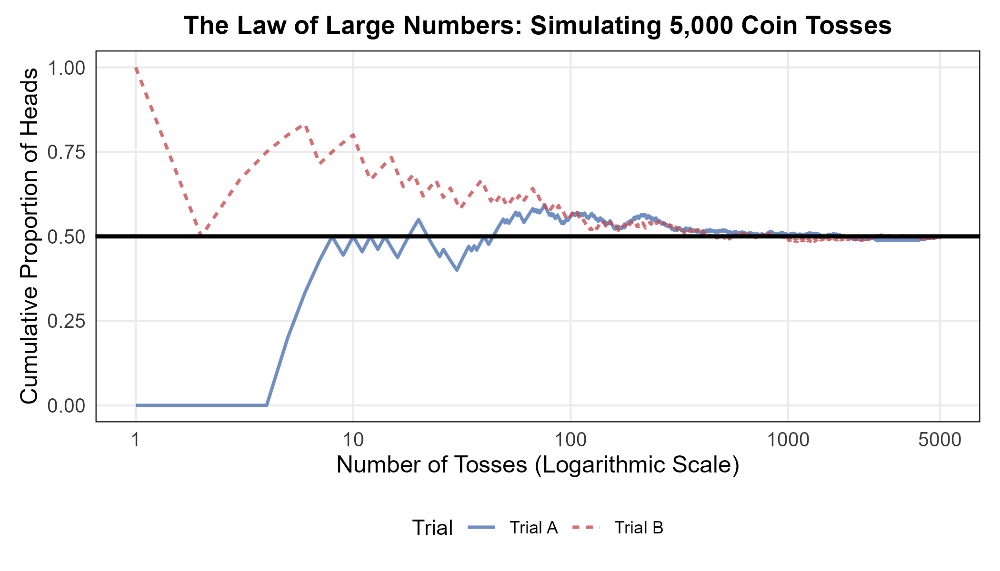
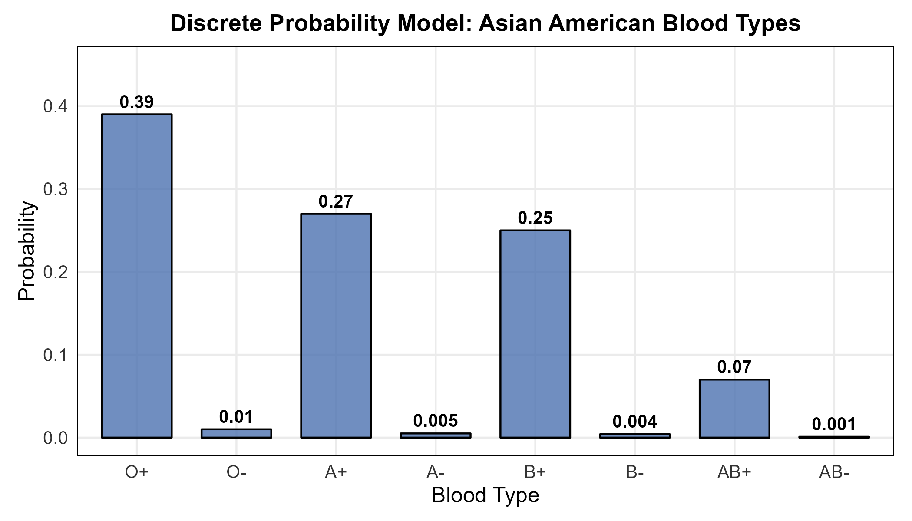
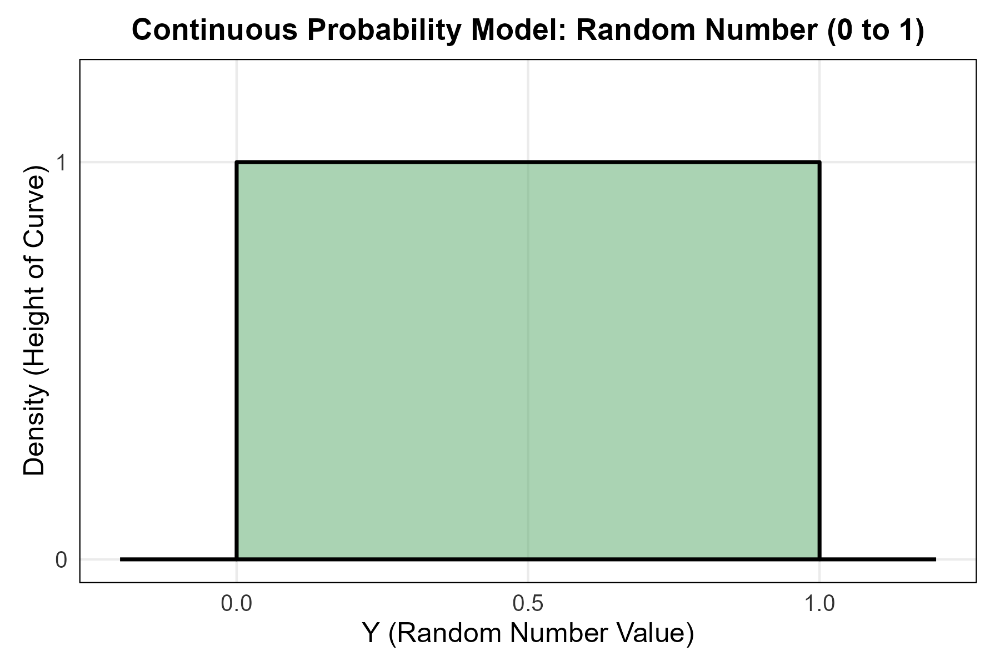
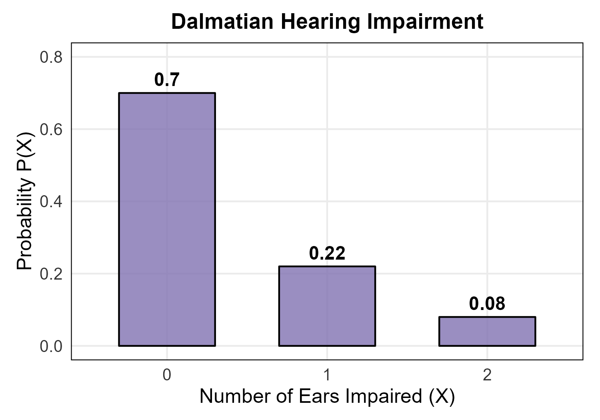
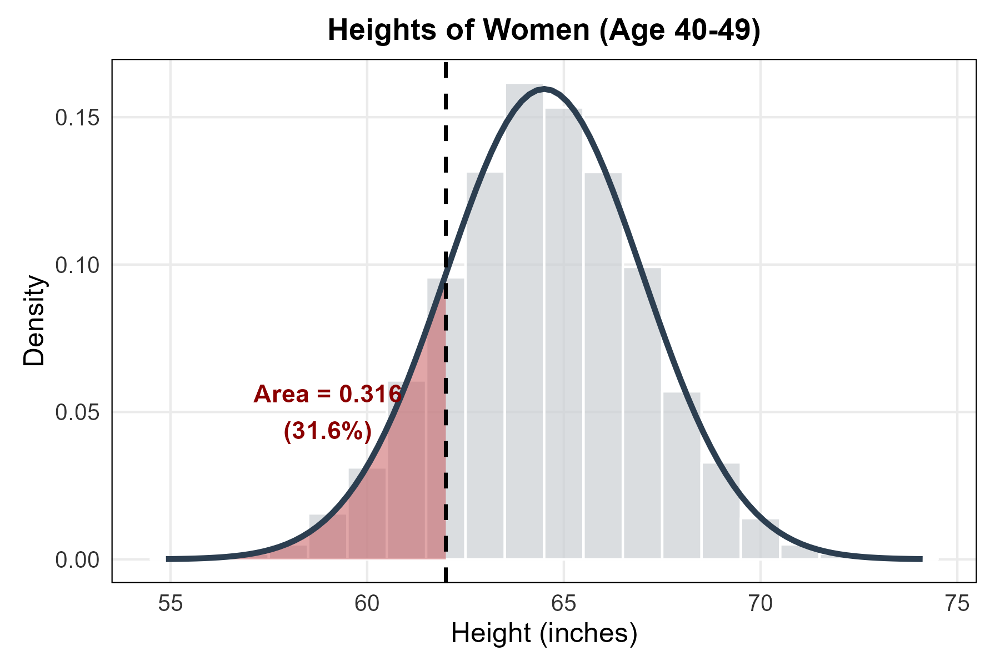
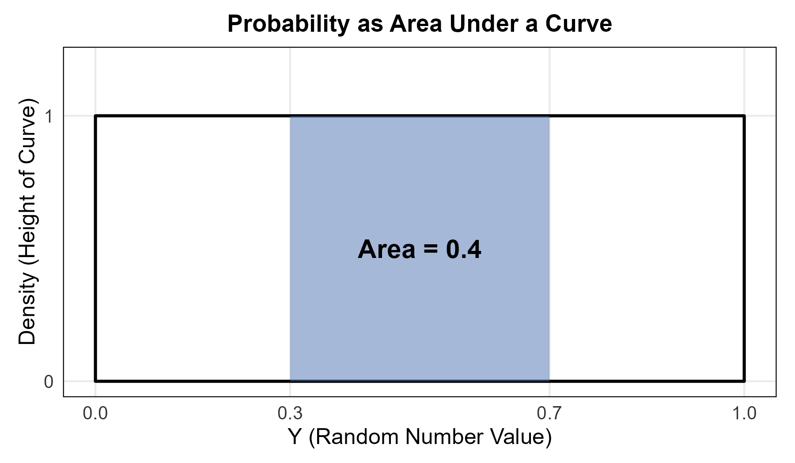

<style>
/* ============================================================
   CHAPTER 9 — PAGE + COLLAPSIBLE TABLE OF CONTENTS
   ============================================================ */

:root {
  --toc-width: 300px;
  --toc-collapsed-gutter: 72px;
  --chapter-width: 1100px;

  --ink: #23364a;
  --accent: #2c3e50;
  --line: #d8dee4;
  --soft: #f6f8fa;
  --toc-background: #f7f9fb;
}


/* ============================================================
   GENERAL PAGE
   ============================================================ */

html {
  scroll-behavior: smooth;
}

body {
  font-size: 17px;
  line-height: 1.65;
  color: var(--ink);
}

.main-container {
  max-width: var(--chapter-width) !important;
}


/* ============================================================
   HIDE DUMMY CHAPTER CONTENT
   ============================================================ */

/*
   Chapter 9 is used as the numbering root.

   Hide the visible "Chapter 9" H1 because the document title
   already says Chapter 9, but KEEP the section itself so that
   H2 headings are numbered 9.1, 9.2, 9.3, ...
*/
.section.chapter-root > h1 {
  display: none !important;
}


/* ============================================================
   HIDE CHAPTERS 1–8 FROM THE TABLE OF CONTENTS
   ============================================================ */

/*
   R Markdown/tocify does not reliably expose the chapter names
   through data-unique, so select them through their generated
   href values instead.
*/

#TOC li:has(a[href="#chapter-1-dummy"]),
#TOC li:has(a[href="#chapter-2-dummy"]),
#TOC li:has(a[href="#chapter-3-dummy"]),
#TOC li:has(a[href="#chapter-4-dummy"]),
#TOC li:has(a[href="#chapter-5-dummy"]),
#TOC li:has(a[href="#chapter-6-dummy"]),
#TOC li:has(a[href="#chapter-7-dummy"]),
#TOC li:has(a[href="#chapter-8-dummy"]) {
  display: none !important;
}


/*
   Also hide the Chapter 9 parent entry itself.

   Its children — 9.1, 9.2, 9.3, ... — remain visible.
*/
#TOC li:has(> a[href="#chapter-9"]) > a[href="#chapter-9"] {
  display: none !important;
}


/*
   tocify may place the Chapter 9 subsections inside the same
   list item. Remove spacing belonging to the hidden parent.
*/
#TOC li:has(> a[href="#chapter-9"]) {
  margin-top: 0 !important;
}


/* ============================================================
   ACCESSIBILITY
   ============================================================ */

.sr-only {
  position: absolute;
  width: 1px;
  height: 1px;
  padding: 0;
  margin: -1px;
  overflow: hidden;
  clip: rect(0, 0, 0, 0);
  white-space: nowrap;
  border: 0;
}


/* ============================================================
   SIDEBAR TOGGLE BUTTON
   ============================================================ */

#toc-toggle {
  position: fixed;

  top: 16px;
  left: calc(var(--toc-width) + 14px);

  width: 42px;
  height: 42px;

  display: flex;
  align-items: center;
  justify-content: center;

  padding: 0;

  border: 1px solid #c7d0d9;
  border-radius: 8px;

  background: #ffffff;
  color: var(--ink);

  box-shadow: 0 2px 8px rgba(24, 39, 55, 0.13);

  cursor: pointer;

  font-size: 24px;
  line-height: 1;

  z-index: 1200;

  transition:
    left 0.25s ease,
    background-color 0.2s ease,
    box-shadow 0.2s ease,
    transform 0.2s ease;
}

#toc-toggle:hover {
  background: #eef3f7;
  box-shadow: 0 3px 10px rgba(24, 39, 55, 0.18);
}

#toc-toggle:focus-visible {
  outline: 3px solid rgba(44, 62, 80, 0.28);
  outline-offset: 2px;
}


/* Open/close icons */

#toc-toggle .menu-icon {
  display: none;
}

#toc-toggle .close-icon {
  display: inline;
}


/* Button position when sidebar is collapsed */

body.toc-collapsed #toc-toggle {
  left: 14px;
}

body.toc-collapsed #toc-toggle .menu-icon {
  display: inline;
}

body.toc-collapsed #toc-toggle .close-icon {
  display: none;
}


/* ============================================================
   DESKTOP LAYOUT
   ============================================================ */

@media screen and (min-width: 992px) {

  /*
     Make room for fixed sidebar.
  */
  .main-container {
    width: 100% !important;
    max-width: none !important;

    padding-left: calc(var(--toc-width) + 30px) !important;
    padding-right: 35px !important;

    box-sizing: border-box !important;

    transition: padding-left 0.25s ease;
  }


  /*
     When sidebar is collapsed, reclaim almost all of the space.
  */
  body.toc-collapsed .main-container {
    padding-left: var(--toc-collapsed-gutter) !important;
  }


  /*
     Bootstrap normally reserves a column for the TOC.
     The TOC is fixed now, so remove that reserved column.
  */
  .main-container > .row-fluid > .col-xs-12.col-sm-4.col-md-3,
  .main-container > .row > .col-xs-12.col-sm-4.col-md-3 {
    width: 0 !important;
    min-height: 0 !important;
    padding: 0 !important;
    margin: 0 !important;
  }


  /* ----------------------------------------------------------
     FLOATING TOC
     ---------------------------------------------------------- */

  #TOC,
  #TOC.tocify {
    position: fixed !important;

    top: 0 !important;
    bottom: 0 !important;
    left: 0 !important;

    width: var(--toc-width) !important;
    max-height: 100vh !important;

    box-sizing: border-box !important;

    overflow-y: auto !important;
    overflow-x: hidden !important;

    margin: 0 !important;
    padding: 72px 16px 28px 18px !important;

    background: var(--toc-background) !important;

    border: 0 !important;
    border-right: 1px solid var(--line) !important;
    border-radius: 0 !important;

    box-shadow: none !important;

    z-index: 1100 !important;

    transform: translateX(0);

    transition: transform 0.25s ease;
  }


  /*
     Completely slide sidebar off screen when collapsed.
  */
  body.toc-collapsed #TOC,
  body.toc-collapsed #TOC.tocify {
    transform: translateX(calc(-1 * var(--toc-width)));
  }


  /*
     Allow long section headings to wrap rather than getting
     clipped.
  */
  #TOC a {
    white-space: normal !important;
    overflow-wrap: break-word !important;
    word-break: normal !important;
  }


  /* ----------------------------------------------------------
     TOC TYPOGRAPHY
     ---------------------------------------------------------- */

  #TOC .tocify-item {
    border-radius: 4px;
  }

  #TOC .tocify-item a {
    color: var(--ink);
    text-decoration: none;
  }

  #TOC .tocify-item:hover {
    background: #e9eef3;
  }

  #TOC .tocify-item.active {
    background: var(--accent) !important;
  }

  #TOC .tocify-item.active a {
    color: #ffffff !important;
  }


  /* ----------------------------------------------------------
     MAIN CHAPTER CONTENT
     ---------------------------------------------------------- */

  .toc-content,
  .toc-content.col-xs-12.col-sm-8.col-md-9 {
    width: 100% !important;
    max-width: var(--chapter-width) !important;

    float: none !important;

    margin-left: auto !important;
    margin-right: auto !important;

    padding-left: 15px !important;
    padding-right: 15px !important;

    box-sizing: border-box !important;
  }


  /*
     Fallback for Pandoc output that does not use Bootstrap's
     normal R Markdown container structure.
  */
  body.standalone-pandoc {
    width: calc(100% - var(--toc-width)) !important;
    max-width: none !important;

    box-sizing: border-box !important;

    margin: 0 0 0 var(--toc-width) !important;
    padding: 50px 45px !important;

    transition:
      width 0.25s ease,
      margin-left 0.25s ease,
      padding-left 0.25s ease;
  }

  body.standalone-pandoc.toc-collapsed {
    width: 100% !important;

    margin-left: 0 !important;
    padding-left: var(--toc-collapsed-gutter) !important;
  }

  body.standalone-pandoc > header,
  body.standalone-pandoc > section {
    max-width: var(--chapter-width);

    margin-left: auto;
    margin-right: auto;
  }
}


/* ============================================================
   MOBILE / TABLET
   ============================================================ */

@media screen and (max-width: 991px) {

  .main-container {
    width: auto !important;
    max-width: var(--chapter-width) !important;

    margin-left: auto !important;
    margin-right: auto !important;

    padding: 70px 18px 24px !important;

    box-sizing: border-box !important;
  }


  /*
     Toggle remains at upper-left on mobile.
  */
  #toc-toggle,
  body.toc-collapsed #toc-toggle {
    left: 12px;
  }


  /*
     Mobile starts with menu icon.
  */
  #toc-toggle .menu-icon,
  body.toc-collapsed #toc-toggle .menu-icon {
    display: inline;
  }

  #toc-toggle .close-icon,
  body.toc-collapsed #toc-toggle .close-icon {
    display: none;
  }


  /*
     Show X while the mobile TOC is open.
  */
  body.toc-mobile-open #toc-toggle .menu-icon {
    display: none;
  }

  body.toc-mobile-open #toc-toggle .close-icon {
    display: inline;
  }


  /* ----------------------------------------------------------
     MOBILE TOC DRAWER
     ---------------------------------------------------------- */

  #TOC,
  #TOC.tocify {
    position: fixed !important;

    top: 0 !important;
    bottom: 0 !important;
    left: 0 !important;

    width: min(84vw, 320px) !important;
    max-height: 100vh !important;

    box-sizing: border-box !important;

    overflow-y: auto !important;
    overflow-x: hidden !important;

    margin: 0 !important;
    padding: 72px 18px 28px !important;

    background: var(--toc-background) !important;

    border: 0 !important;
    border-right: 1px solid var(--line) !important;
    border-radius: 0 !important;

    z-index: 1100 !important;

    transform: translateX(-105%);

    transition: transform 0.25s ease;
  }

  body.toc-mobile-open #TOC,
  body.toc-mobile-open #TOC.tocify {
    transform: translateX(0);

    box-shadow: 6px 0 18px rgba(24, 39, 55, 0.16);
  }


  /*
     Prevent long headings from being clipped.
  */
  #TOC a {
    white-space: normal !important;
    overflow-wrap: break-word !important;
    word-break: normal !important;
  }


  body.standalone-pandoc {
    width: auto !important;
    max-width: var(--chapter-width) !important;

    margin: 0 auto !important;
    padding: 70px 18px 24px !important;

    box-sizing: border-box !important;
  }
}


/* ============================================================
   SECTION HEADINGS
   ============================================================ */

h1,
h2,
h3,
h4,
h5 {
  margin-top: 1.6em;
}

h2 {
  border-bottom: 3px solid var(--accent);
  padding-bottom: 0.25em;
}

h3 {
  border-bottom: 1px solid var(--line);
  padding-bottom: 0.2em;
}


/* ============================================================
   BLOCKQUOTES / DEFINITION BOXES
   ============================================================ */

blockquote {
  border-left: 4px solid var(--accent);

  background: #f7f9fa;

  padding: 0.7em 1em;
  margin-top: 1.2em;
  margin-bottom: 1.2em;
}


/* ============================================================
   TABLES
   ============================================================ */

table {
  width: 100%;

  margin: 1.35em auto;

  border-collapse: separate !important;
  border-spacing: 0;

  background: #ffffff;

  border: 1px solid #d6dde5;
  border-radius: 8px;

  overflow: hidden;

  box-shadow: 0 2px 8px rgba(24, 39, 55, 0.06);
}

table thead th {
  padding: 0.72em 0.9em !important;

  background: var(--accent);
  color: #ffffff;

  border: 0 !important;
  border-bottom: 1px solid #1e2d3b !important;

  font-weight: 700;

  vertical-align: middle !important;
}

table tbody td {
  padding: 0.65em 0.9em !important;

  border: 0 !important;
  border-bottom: 1px solid #e5e9ee !important;

  vertical-align: middle !important;
}

table tbody tr:nth-child(even) td {
  background: #f7f9fb;
}

table tbody tr:hover td {
  background: #eef4f8;
}

table tbody tr:last-child td {
  border-bottom: 0 !important;
}


/* ============================================================
   IMAGES
   ============================================================ */

img {
  display: block;

  max-width: 100%;
  height: auto;

  margin: 1.4em auto;

  border: 1px solid #e1e4e8;
  border-radius: 7px;
}


/* ============================================================
   MATHEMATICS
   ============================================================ */

.math.display {
  overflow-x: auto;
}


/* ============================================================
   HIDE R MARKDOWN CODE-FOLDING UI
   ============================================================ */

.btn-code,
.code-folding-btn,
div.btn-group.pull-right {
  display: none !important;
}
</style>

<button id="toc-toggle"
        type="button"
        aria-label="Toggle table of contents"
        aria-expanded="true">
  <span class="menu-icon" aria-hidden="true">&#9776;</span>
  <span class="close-icon" aria-hidden="true">&times;</span>
  <span class="sr-only">Toggle table of contents</span>
</button>

<script>
document.addEventListener("DOMContentLoaded", function () {
  const button = document.getElementById("toc-toggle");

  if (!button) return;

  button.addEventListener("click", function () {
    if (window.innerWidth <= 991) {
      document.body.classList.toggle("toc-mobile-open");

      const isOpen =
        document.body.classList.contains("toc-mobile-open");

      button.setAttribute("aria-expanded", isOpen);
    } else {
      document.body.classList.toggle("toc-collapsed");

      const isOpen =
        !document.body.classList.contains("toc-collapsed");

      button.setAttribute("aria-expanded", isOpen);
    }
  });
});
</script>

```{r setup, include=FALSE, echo=FALSE, warning=FALSE, message=FALSE}
knitr::opts_chunk$set(
  echo = FALSE,
  warning = FALSE,
  message = FALSE,
  error = FALSE
)

required_packages <- c("ggplot2", "gridExtra", "dplyr", "tidyr")
missing_packages <- required_packages[
  !vapply(required_packages, requireNamespace, logical(1), quietly = TRUE)
]

if (length(missing_packages) > 0) {
  stop(
    "Install the following R packages before knitting: ",
    paste(missing_packages, collapse = ", ")
  )
}

suppressPackageStartupMessages({
  library(ggplot2)
  library(gridExtra)
  library(dplyr)
  library(tidyr)
})

set.seed(123) # Set seed for reproducible figures

# Shared publication-style theme and colour palette.
lecture_theme <- theme_minimal(base_size = 11) +
  theme(
    plot.title = element_text(size = 13, face = "bold", hjust = 0.5),
    axis.title = element_text(size = 12),
    axis.text = element_text(size = 10, colour = "#333333"),
    panel.grid.minor = element_blank(),
    plot.background = element_rect(fill = "white", colour = NA),
    panel.background = element_rect(fill = "white", colour = NA),
    plot.margin = margin(8, 10, 8, 10),
    panel.border = element_rect(colour = "black", fill = NA, size = 0.5)
  )

palette_main <- c("#4C72B0", "#55A868", "#C44E52", "#8172B2", "#CCB974")

save_plot <- function(filename, plot, width, height) {
  ggsave(
    filename = filename,
    plot = plot,
    width = width,
    height = height,
    units = "in",
    dpi = 300,
    bg = "white"
  )
}

# =============================================================
# 1. Law of Large Numbers: Coin Toss Simulation (Fig 9.1)
# =============================================================
set.seed(42) # For reproducible random tosses
n_tosses <- 5000

# Simulate Trial A and calculate cumulative proportion of heads
tosses_A <- sample(c(0, 1), n_tosses, replace = TRUE)
prop_A <- cumsum(tosses_A) / (1:n_tosses)

# Simulate Trial B and calculate cumulative proportion of heads
tosses_B <- sample(c(0, 1), n_tosses, replace = TRUE)
prop_B <- cumsum(tosses_B) / (1:n_tosses)

# Combine into a dataframe
coin_data <- data.frame(
  Toss = rep(1:n_tosses, 2),
  Proportion = c(prop_A, prop_B),
  Trial = factor(rep(c("Trial A", "Trial B"), each = n_tosses))
)

p_cointoss <- ggplot(coin_data, aes(x = Toss, y = Proportion, color = Trial, linetype = Trial)) +
  geom_line(alpha = 0.8, size = 0.8) +
  geom_hline(yintercept = 0.5, linetype = "solid", color = "black", size = 1) +
  # Use a log scale for the x-axis to stretch out the highly variable early tosses
  scale_x_log10(breaks = c(1, 10, 100, 1000, 5000), labels = c("1", "10", "100", "1000", "5000")) +
  coord_cartesian(ylim = c(0, 1)) +
  scale_color_manual(values = c("Trial A" = "#4C72B0", "Trial B" = "#C44E52")) +
  labs(
    title = "The Law of Large Numbers: Simulating 5,000 Coin Tosses",
    x = "Number of Tosses (Logarithmic Scale)",
    y = "Cumulative Proportion of Heads"
  ) +
  lecture_theme +
  theme(legend.position = "bottom")

save_plot("fig_ch9_cointoss.png", p_cointoss, width = 7, height = 4)

# =============================================================
# 2. Discrete Probability Model: Blood Types
# =============================================================
blood_data <- data.frame(
  Type = factor(c("O+", "O-", "A+", "A-", "B+", "B-", "AB+", "AB-"), 
                levels = c("O+", "O-", "A+", "A-", "B+", "B-", "AB+", "AB-")),
  Probability = c(0.39, 0.01, 0.27, 0.005, 0.25, 0.004, 0.07, 0.001)
)

p_blood <- ggplot(blood_data, aes(x = Type, y = Probability)) +
  geom_bar(stat = "identity", fill = "#4C72B0", alpha = 0.8, color = "black", width = 0.7) +
  geom_text(aes(label = Probability), vjust = -0.5, size = 3.5, fontface = "bold") +
  scale_y_continuous(limits = c(0, 0.45)) +
  labs(title = "Discrete Probability Model: Asian American Blood Types",
       x = "Blood Type",
       y = "Probability") +
  lecture_theme

save_plot("fig_ch9_blood_types.png", p_blood, width = 7, height = 4)

# =============================================================
# 3. Continuous Probability Model: Random Number [0,1]
# =============================================================
p_uniform <- ggplot() +
  # Draw the uniform density block
  geom_rect(aes(xmin = 0, xmax = 1, ymin = 0, ymax = 1), fill = "#55A868", alpha = 0.5, color = "black", size = 0.8) +
  # Draw the zero-probability lines outside the [0,1] interval
  geom_segment(aes(x = -0.2, xend = 0, y = 0, yend = 0), size = 0.8) +
  geom_segment(aes(x = 1, xend = 1.2, y = 0, yend = 0), size = 0.8) +
  scale_x_continuous(breaks = c(0, 0.5, 1)) +
  scale_y_continuous(breaks = c(0, 1), limits = c(0, 1.2)) +
  labs(title = "Continuous Probability Model: Random Number (0 to 1)",
       x = "Y (Random Number Value)",
       y = "Density (Height of Curve)") +
  lecture_theme

save_plot("fig_ch9_continuous_uniform.png", p_uniform, width = 6, height = 4)

# =============================================================
# 4. Dalmatian Hearing Impairment (Discrete Bar Chart)
# =============================================================
dalmatian_data <- data.frame(
  Impaired_Ears = factor(c("0", "1", "2")),
  Probability = c(0.70, 0.22, 0.08)
)

p_dalmatian <- ggplot(dalmatian_data, aes(x = Impaired_Ears, y = Probability)) +
  geom_bar(stat = "identity", fill = "#8172B2", alpha = 0.8, color = "black", width = 0.6) +
  geom_text(aes(label = Probability), vjust = -0.5, size = 4, fontface = "bold") +
  scale_y_continuous(limits = c(0, 0.8)) +
  labs(title = "Dalmatian Hearing Impairment",
       x = "Number of Ears Impaired (X)",
       y = "Probability P(X)") +
  lecture_theme

save_plot("fig_ch9_dalmatian.png", p_dalmatian, width = 5, height = 3.5)


# =============================================================
# 5. Women's Heights: Histogram to Density Curve
# =============================================================
# Simulate a large sample of heights (mean = 64.5, sd = 2.5)
set.seed(123)
heights <- data.frame(Height = rnorm(10000, mean = 64.5, sd = 2.5))

p_heights <- ggplot(heights, aes(x = Height)) +
  # Draw histogram (scaled to density)
  geom_histogram(aes(y = ..density..), binwidth = 1, fill = "#caced3", color = "white", alpha = 0.7) +
  # Shade area <= 62
  stat_function(fun = dnorm, args = list(mean = 64.5, sd = 2.5),
                xlim = c(55, 62), geom = "area", fill = "#C44E52", alpha = 0.5) +
  # Draw full density curve
  stat_function(fun = dnorm, args = list(mean = 64.5, sd = 2.5), 
                color = "#2c3e50", size = 1.2) +
  geom_vline(xintercept = 62, linetype = "dashed", color = "black", size = 0.8) +
  annotate("text", x = 59, y = 0.05, label = "Area = 0.316\n(31.6%)", color = "#8b0000", fontface = "bold") +
  labs(title = "Heights of Women (Age 40-49)",
       x = "Height (inches)",
       y = "Density") +
  lecture_theme

save_plot("fig_ch9_heights.png", p_heights, width = 6, height = 4)


# =============================================================
# 6. Uniform Density (Random Numbers) - Shaded Areas
# =============================================================
p_uniform_shaded <- ggplot() +
  # Full uniform block outline
  geom_rect(aes(xmin = 0, xmax = 1, ymin = 0, ymax = 1), fill = NA, color = "black", size = 0.8) +
  # Shade 0.3 to 0.7
  geom_rect(aes(xmin = 0.3, xmax = 0.7, ymin = 0, ymax = 1), fill = "#4C72B0", alpha = 0.5) +
  annotate("text", x = 0.5, y = 0.5, label = "Area = 0.4", fontface = "bold", size = 5) +
  
  # Shade <= 0.5 or > 0.8 (we'll do this as a second plot or combine them. Let's do just the 0.3-0.7 for simplicity here)
  scale_x_continuous(breaks = c(0, 0.3, 0.7, 1)) +
  scale_y_continuous(breaks = c(0, 1), limits = c(0, 1.2)) +
  labs(title = "Probability as Area Under a Curve",
       x = "Y (Random Number Value)",
       y = "Density (Height of Curve)") +
  lecture_theme

save_plot("fig_ch9_uniform_shaded.png", p_uniform_shaded, width = 6, height = 3.5)


```

# Chapter 9 {.chapter-root .unlisted}

## The Idea of Probability

When people hear the word "random," they usually think of something that is completely haphazard, chaotic, or patternless. In statistics, **randomness** has a very specific, mathematical meaning. 

Consider the birth of a baby: we cannot know for sure whether the next baby born in the U.S. will be a boy or a girl. The individual outcome is uncertain. However, if we look at millions of births over a decade, a remarkably stable pattern emerges. 

> **RANDOMNESS AND PROBABILITY**  
> We call a phenomenon **random** if individual outcomes are uncertain, but there is nonetheless a regular, predictable distribution of outcomes in a large number of repetitions.  
> 
> The **probability** of any outcome is the proportion of times the outcome would occur in a very long series of repetitions.

### Two Ways to Determine Probability

How do we actually figure out what the probability of an event is? Biologists and statisticians generally rely on two methods:

**1. Theoretical Probability (The Math)**
Based on underlying physical or biological laws.
*   *Example:* Mendel’s theory of genetic inheritance states that sex chromosomes (XX for girls, XY for boys) should be roughly equally represented. Therefore, the theoretical probability of a newborn being a boy is exactly **0.50 (or 50%)**.

**2. Empirical Probability (The Data)**
Based on observing the long-term pattern of actual events.
*   *Example:* In practice, biological factors affect gamete success and embryo survival. If we look at U.S. birth records from 1990 to 2014, the proportion of male babies is consistently around **0.512**. Therefore, the empirical probability of a newborn being a boy is **0.512 (or 51.2%)**.

Whether we use theory or data, we use these long-term patterns to create a **probability model**—a mathematical representation of uncertainty.

---

### The Frequentist Interpretation of Probability

In the life sciences, we usually rely on the **frequentist approach** to probability. This means we define probability based on what happens in the long run: the relative frequency of an outcome over many, many repetitions.

**Example: The Common Cold**
Suppose Gallup surveys 14,169 random adults and finds that 11.2% had a cold yesterday. If they ran the survey again with 14,169 *different* adults, they wouldn't get exactly 11.2%. Random samples vary. However, if they took thousands of these samples, the results would eventually average out to the true population parameter. 

**Example: The Coin Toss (Long-Run Regularity)**
If you toss a coin 10 times, you might get 2 heads (20%) or 8 heads (80%). In the short run, the proportion of heads is highly variable. But if you toss that same coin 5,000 times, the proportion of heads will inevitably settle down to exactly 0.50. 



*   *Notice the horizontal axis is on a logarithmic scale to highlight the wild swings during the first 100 tosses.*
*   *Probability 0.5 does not mean "exactly half of the next 10 tosses." It means "occurs half the time in a very large number of trials."*

> **The Law of Large Numbers**
> This phenomenon—where the results of random events stabilize as the number of trials increases—is known as the Law of Large Numbers. It is the reason why casinos always make money and why large sample sizes in biology yield more trustworthy results!

---

### The Illusion of Randomness

Human brains are terrible at recognizing true randomness because we are hardwired to look for patterns. 

Consider tossing a coin six times. Which of these outcomes is more probable?
1.  **H T H T T H**
2.  **T T T H H H**

Almost everyone intuitively says the first one is more probable because it "looks" more random. The second one looks like a weird pattern. 

**The reality:** Both sequences are exactly equally probable. A coin has no memory. It does not know what happened on the previous toss, and it does not try to "balance out" the sequence in the short run. True randomness often produces streaks and clusters that look like patterns to the human eye. 

---

### Personal Probability

Sometimes, we need to assign a probability to an event that cannot be repeated thousands of times. 

*   *Question:* "What is the probability that humans find extraterrestrial life in this century?"

We cannot simulate this century 5,000 times to see how often we find aliens. Therefore, we cannot use the frequentist definition of probability. Instead, scientists rely on **personal probability**.

> **PERSONAL PROBABILITY**  
> A personal probability is a number between 0 and 1 that expresses an individual’s scientific judgment of how likely an outcome is.

While the word "personal" makes it sound like a guess, in science, these probabilities are often highly rigorous. When climatologists state, "There is a 90% probability that sea levels will rise by $X$ meters," they are stating a personal probability grounded in extensive data, physics, and computer modeling.

Regardless of whether a probability is frequentist or personal, it must obey the strict mathematical rules of probability that we will cover in the next section.

## Probability Models

In the previous section, we discussed the *idea* of probability. To move from just "understanding" probability to actually *using* it in biology and medicine, we need a formal mathematical structure. 

Consider the sex of the next baby to be born. We don't know the outcome in advance, but we know two things:
1.  **A list of all possible outcomes:** Male or Female.
2.  **A probability for each outcome:** Roughly 1/2 for each (based on Mendelian genetics).

These two pieces of information form the foundation of all probability models. 

> **PROBABILITY MODELS VOCABULARY**  
> *   The **sample space ($S$)** of a random phenomenon is the set of *all* possible outcomes.  
> *   An **event** is an outcome (or a set of outcomes) of a random phenomenon. Mathematically, an event is a subset of the sample space.  
> *   A **probability model** is a mathematical description of a random phenomenon consisting of two parts: a sample space $S$ and a way of assigning probabilities to events.

A sample space $S$ can be a simple, finite list, or it can be a massive, continuous interval. For example, if a baby is born, the sample space is small: $S = \{\text{Male}, \text{Female}\}$. But if a national health survey records the body weight of adults, the sample space contains every possible numerical weight over a realistic interval (e.g., $S = \{\text{all weights between 60 lbs and 600 lbs}\}$).

**Example 9.5: Blood Types**  
Your blood type greatly impacts the kind of blood transfusion or organ transplant you can safely receive. Eight different blood types occur as a result of the presence or absence of certain molecules on the surface of red blood cells. A person’s blood type is given as a combination of a group (O, A, B, or AB) and a Rhesus factor (+ or −). 

These eight types make up our sample space:
$$S = \{O+, O-, A+, A-, B+, B-, AB+, AB-\}$$

How do we assign probabilities to this sample space? The frequencies of these blood types differ among ethnic groups. Within a given group, we can use the empirical frequencies to assign probabilities. For instance, the American Red Cross reports the following frequencies among Asian Americans:

| Blood Type | $O+$ | $O-$ | $A+$ | $A-$ | $B+$ | $B-$ | $AB+$ | $AB-$ |
| :--- | :--- | :--- | :--- | :--- | :--- | :--- | :--- | :--- |
| **Probability** | 0.39 | 0.01 | 0.27 | 0.005 | 0.25 | 0.004 | 0.07 | 0.001 |



**Changing the Scope:** What if a doctor only cares about the patient's Rhesus (Rh) factor?
We can redefine our random phenomenon. For any randomly selected Asian American, the Rh factor can only be positive or negative. We now have a new, smaller sample space:
$$S = \{Rh+, Rh-\}$$

Based on the known proportions (by adding up all the positive probabilities and all the negative probabilities from the table above), our new probability model is:

| Rh Factor | $Rh+$ | $Rh-$ |
| :--- | :--- | :--- |
| **Probability** | 0.98 | 0.02 |

**Example 9.6: Random Numbers**  
Suppose we want to use statistical software to choose a number at random between 0 and 1. We might get 0.289351, or we might get 0.5816462947. 

What is the sample space? It is an entire continuous interval of numbers:
$$S = \{\text{all numbers between 0 and 1}\}$$

Let’s call the outcome of the random number generator $Y$. How can we assign a probability to the exact event $\{Y = 1/3\}$? Or the range $\{0.3 \le Y \le 0.7\}$? 

We face a mathematical problem: we cannot simply list out probabilities for every single value of $Y$ and add them up in a table, because there are infinitely many possible decimal numbers between 0 and 1! Instead, we have to use mathematical functions to assign probabilities over the entire continuous space.



---

### Key Concept: Discrete vs. Continuous Sample Spaces

Examples 9.5 and 9.6 highlight a fundamental division in statistics that dictates which mathematical tools we must use.

1.  **Discrete Sample Space:** An itemized, finite list of outcomes, where each specific outcome has an associated probability. 
    *   *Example:* Blood types ($S = \{O+, O-, \dots\}$). We use tables and basic addition to find probabilities.
2.  **Continuous Sample Space:** An unbroken interval of infinite outcomes. 
    *   *Example:* Exact heights, weights, or random numbers between 0 and 1. We must use mathematical functions (density curves) to assign probabilities over an interval.

> **Looking Ahead:**
> Pay close attention to whether your data is discrete or continuous! For discrete models, finding the probability of an event is as simple as looking at a table and adding numbers together. For continuous models, we have to calculate the *area under a curve* (which we will learn how to do very soon!).

## Probability Rules

Whether a sample space is discrete (like blood types) or continuous (like random numbers), the mathematical rules of probability remain exactly the same. These rules stem directly from the idea of probability as "the long-run proportion of repetitions on which an event occurs." 

Here are the four fundamental facts that must be true for *any* valid assignment of probabilities:

1.  **Probabilities are proportions:** Any proportion is a number between 0 and 1, so any probability must also be a number between 0 and 1. An event with probability 0 *never* occurs. An event with probability 1 occurs on *every* trial.
2.  **The whole equals 1:** Because *some* outcome must occur on every trial, the sum of the probabilities for all possible outcomes in a sample space must equal exactly 1 (or 100%).
3.  **Adding non-overlapping events:** When two events have no outcomes in common, they can never happen together (their joint probability is zero). Therefore, the probability that one *or* the other occurs is simply the sum of their individual probabilities.
4.  **The Complement Rule:** The probability that an event *does not* occur is exactly 1 minus the probability that the event *does* occur. 

We can use standard mathematical notation to state these four facts concisely. We use capital letters near the beginning of the alphabet (like $A$, $B$, $C$) to denote events, and we write the probability of an event as $P(A)$.

> **THE FOUR FUNDAMENTAL PROBABILITY RULES**  
> 
> **Rule 1.** The probability $P(A)$ of any event $A$ satisfies:  
> $$0 \le P(A) \le 1$$  
> 
> **Rule 2.** If $S$ is the complete sample space in a probability model, then:  
> $$P(S) = 1$$  
> 
> **Rule 3. The Addition Rule for Disjoint Events.** Two events $A$ and $B$ are **disjoint** (mutually exclusive) if they have no outcomes in common and can never occur together, meaning $P(A \text{ and } B) = 0$. If $A$ and $B$ are disjoint, then:  
> $$P(A \text{ or } B) = P(A) + P(B)$$  
> *(Note: This rule extends to multiple disjoint events: $P(A \text{ or } B \text{ or } C) = P(A) + P(B) + P(C)$).*
> 
> **Rule 4. The Complement Rule.** For any event $A$, the probability that $A$ does not occur is called the **complement** of $A$. It is calculated as:  
> $$P(A \text{ does not occur}) = 1 - P(A)$$

---

### The Strict Definition of "AND" and "OR"

In normal English (and even in law!), the words "and" and "or" can be vague. The Federal Trade Commission once had to start a legal deposition by formally defining these terms so lawyers wouldn't argue over them in court. 

In probability, we have strict, unwavering definitions for these words:

*   **OR ($A \text{ or } B$):** This is **inclusive**. It means *at least one* event must be true (either $A$ alone occurs, $B$ alone occurs, or *both* occur together).
*   **AND ($A \text{ and } B$):** This is the **intersection**. It means *both* events must be completely satisfied at the exact same time.

*(If events are NOT disjoint and can happen at the same time, we have to use a slightly more complex General Addition Rule to avoid double-counting them. We will cover this in Chapter 10!)*

---

**Example 9.7: Using the Probability Rules (Blood Types)**  
Let's apply these rules to the Asian American blood type data from Example 9.5. 

Recall our sample space probabilities:
$P(O+) = 0.39$
$P(A+) = 0.27$
$P(B+) = 0.25$
$P(AB+) = 0.07$

**Applying Rule 3 (Addition for Disjoint Events):**
What is the probability that a randomly selected person has a positive Rhesus factor (Rh+)? Because a person cannot have O+ and A+ blood at the same time, these are *disjoint* outcomes. Therefore, we can simply add them up:

$$P(\text{Rh+}) = P(O+) + P(A+) + P(B+) + P(AB+)$$
$$P(\text{Rh+}) = 0.39 + 0.27 + 0.25 + 0.07 = 0.98$$

*(Checking Rules 1 and 2: Notice that all individual probabilities are between 0 and 1, and if we added the probabilities for the negative blood types as well, the entire sample space would sum to exactly 1).*

**Applying Rule 4 (The Complement Rule):**
What is the probability that an Asian American’s blood type would **not** have a positive Rhesus factor? We could add up all the negative blood types, or we can use the much faster Complement Rule:

$$P(\text{Rh is not positive}) = 1 - P(\text{Rh is positive})$$
$$P(\text{Rh is not positive}) = 1 - 0.98 = 0.02$$

## Discrete vs. Continuous Probability Models

In our previous examples, we saw that assigning probabilities depends entirely on the nature of the sample space.

### Discrete Probability Models

> **DISCRETE PROBABILITY MODEL**  
> A probability model with a sample space made up of a finite list of individual outcomes is called **discrete**.  
> To assign probabilities in a discrete model, list the probabilities of all individual outcomes. The probability of any event is the sum of the probabilities of the outcomes making up the event.

**Example 9.8: Hearing Impairment in Dalmatians**  
Pure dog breeds are often highly inbred, leading to congenital defects. A study examined hearing impairment in 5,333 Dalmatians. Call the number of ears impaired (deaf) in a randomly chosen Dalmatian $X$. The researchers found the following probability model for $X$:

| Number of Impaired Ears ($X$) | 0 | 1 | 2 |
| :--- | :---: | :---: | :---: |
| **Probability** | 0.70 | 0.22 | 0.08 |

*(Notice that the probabilities sum exactly to 1.0, satisfying Rule 2).*



What is the probability that a randomly chosen Dalmatian has *some* hearing impairment? This means the dog has either 1 or 2 impaired ears. Because these outcomes are disjoint (a dog cannot have exactly 1 deaf ear and exactly 2 deaf ears simultaneously), we use the Addition Rule:

$$P(X \ge 1) = P(X = 1) + P(X = 2)$$
$$P(X \ge 1) = 0.22 + 0.08 = 0.30$$

> **Inequality Signs Matter!**  
> In discrete models, you must be extremely careful with inequality signs. The probability that $X$ is greater than or equal to 1 ("at least 1") is NOT the same as the probability that $X$ is strictly greater than 1.  
> $P(X \ge 1) = 0.30$  
> $P(X > 1) = P(X = 2) = 0.08$

---

### Continuous Probability Models & Density Curves

In contrast, Example 9.6 introduced a random number generator with a continuous sample space: $S = \{\text{all numbers between 0 and 1}\}$. This interval contains an *infinite* number of possible outcomes. 

We cannot list infinite probabilities in a table. Instead, we use a mathematical function to assign probabilities to *ranges* of values. These mathematical functions are called **density curves**.

> **DENSITY CURVE**  
> A density curve is a curve that:  
> 1. Is always on or above the horizontal axis.  
> 2. Has an **area of exactly 1** underneath it.  
> 
> The area under the curve and above any range of values on the horizontal axis is the proportion of all observations that fall within that range.

**Example 9.9 & 9.10: From Histogram to Density Curve (Women's Heights)**  
In Chapter 1, we described continuous distributions using histograms. Sometimes the overall pattern of a large number of observations is so regular that we can model it with a smooth curve. 

Look at the distribution of heights of American women (age 40 to 49). The histogram is symmetric, and both tails fall off smoothly from a central peak. We can draw a smooth density curve over the histogram to model the data. 



If we want to know the probability that a randomly chosen woman is 62 inches or shorter, we do not add up individual bars. Instead, we calculate the **area under the density curve** to the left of 62. 

Because the total area under the entire curve is exactly 1 (100% of the population), the shaded area represents the exact probability: **0.316**.

> **CONTINUOUS PROBABILITY MODEL**  
> A continuous probability model assigns probabilities as **areas under a density curve**. The area under the curve and above any range of values is the probability of an outcome occurring in that range.

**Example 9.11: Random Numbers (The Uniform Density Curve)**  
Density curves come in many shapes. The random number generator (Example 9.6) spreads its output uniformly (evenly) across the entire interval from 0 to 1. This is modeled by a **uniform density curve**.



Because the height of this curve is exactly 1, the area of any block is simply its width. 
What is the probability that the random number $Y$ falls between 0.3 and 0.7?
$$P(0.3 \le Y \le 0.7) = \text{Width} = (0.7 - 0.3) = 0.4$$

What is the probability of getting a number less than or equal to 0.5, OR greater than 0.8? Because these are disjoint intervals, we add their areas:
$$P(Y \le 0.5 \text{ or } Y > 0.8) = P(Y \le 0.5) + P(Y > 0.8) = 0.5 + 0.2 = 0.7$$

> **The Probability of an Exact Number is Zero!**  
> Continuous models assign probabilities to *intervals*, not individual points. In a continuous model, the probability of hitting one exact, infinitely precise number is always 0.  
> For example, what is $P(Y = 0.8)$? Since a single point has no width, the area of the line is $0 \times 1 = 0$. In continuous math, $P(Y \le 0.8)$ is exactly the same as $P(Y < 0.8)$!

## Random Variables

In Examples 9.8 and 9.11, we used mathematical notation that is highly convenient: we let $X$ stand for the number of impaired ears in a Dalmatian, and $Y$ stand for the outcome of a random number generator. 

Because the value changes from one random choice to another, we call these variables **random variables**.

> **RANDOM VARIABLE**  
> A **random variable** is a variable whose value is a numerical outcome of a random phenomenon. We typically use uppercase letters like $X$ or $Y$ to represent them.  
> 
> The **probability distribution** of a random variable $X$ tells us exactly what values $X$ can take and how to assign probabilities to those values.

**Example 9.12: Two Types of Random Variables**  
There are two main types of random variables, corresponding directly to the two types of probability models we just learned:

1.  **Discrete Random Variables:** Have a countable (typically finite) list of possible outcomes. 
    *   *Example:* The hearing impairment $X$ is discrete because its possible values are exactly the whole numbers $\{0, 1, 2\}$.
2.  **Continuous Random Variables:** Can take on *any* value in an unbroken interval, with probabilities given as areas under a density curve.
    *   *Example:* The random number $Y$ is continuous because it fills the entire interval between 0 and 1. 

> **Be careful with the "true nature" of a variable!**  
> While most people report their height in whole numbers of inches (e.g., 65 inches), humans do not grow magically one inch at a time. All possible values within a realistic interval can actually exist (e.g., 65.1259 inches). Therefore, the random variable for *height* is truly continuous, even if we round it to discrete buckets when speaking.

---

### Parameters vs. Statistics

In Chapter 2, we learned how to calculate the mean ($\bar{x}$) and standard deviation ($s$) of a set of actual observed data (a sample). 

Random variables also have means and standard deviations! However, because a random variable represents the mathematical model for *all* possible outcomes in the entire sample space $S$, their measures are **parameters** rather than statistics.

We use Greek letters to distinguish theoretical parameters from observed sample statistics:
*   **Mean of a random variable:** $\mu$ (mu)
*   **Standard Deviation of a random variable:** $\sigma$ (sigma)

---

### Computing $\mu$ and $\sigma$ for a Discrete Random Variable

Computing the mean and standard deviation of a *continuous* random variable requires calculus (integration) and is beyond the scope of this course. However, calculating them for a *discrete* random variable involves basic arithmetic.

> **MATHEMATICS OF DISCRETE RANDOM VARIABLES**  
> Let $X$ be a discrete random variable with $k$ possible outcomes: $x_1, x_2, \dots, x_k$.  
> 
> **1. The Mean (Expected Value):**  
> $$\mu = E(X) = \sum x_i \cdot P(X = x_i)$$  
> *(You multiply each possible outcome by its probability, and add them all up).*
> 
> **2. The Variance:**  
> $$\sigma^2 = \sum (x_i - \mu)^2 \cdot P(X = x_i)$$  
> 
> **3. The Standard Deviation:**  
> $$\sigma = \sqrt{\sigma^2}$$

The mean $\mu$ is also called the **expected value** of $X$ (written as $E(X)$), because it is the value we expect to get, on average, over many, many repetitions of the random event. The standard deviation $\sigma$ is roughly the expected deviation from that mean in the long run.

**Example 9.13: Expected Hearing Impairment in Dalmatians**  
Let's calculate the theoretical mean and standard deviation for the Dalmatian probability model.

| $X$ (impaired ears) | 0 | 1 | 2 |
| :--- | :---: | :---: | :---: |
| **Probability $P(X)$** | 0.70 | 0.22 | 0.08 |

**1. Calculate the Mean (Expected Value):**
$$\mu = (0 \times 0.70) + (1 \times 0.22) + (2 \times 0.08)$$
$$\mu = 0 + 0.22 + 0.16 = \mathbf{0.38 \text{ impaired ears}}$$

**2. Calculate the Variance:**
$$\sigma^2 = (0 - 0.38)^2 \times 0.70 + (1 - 0.38)^2 \times 0.22 + (2 - 0.38)^2 \times 0.08$$
$$\sigma^2 = (0.1444 \times 0.70) + (0.3844 \times 0.22) + (2.6244 \times 0.08)$$
$$\sigma^2 = 0.10108 + 0.084568 + 0.209952 = \mathbf{0.3956}$$

**3. Calculate the Standard Deviation:**
$$\sigma = \sqrt{0.3956} = \mathbf{0.62897}$$

**Conclusion:**
In the long run, across thousands of randomly selected Dalmatian dogs, we expect to find an average of **0.38 impaired ears** per dog. The expected deviation from this value is roughly **0.63 impaired ears**. 

*(Note that the expected value, 0.38, is not one of the values the random variable $X$ can actually take. A single dog cannot have 0.38 deaf ears! It is a theoretical long-run average).*

Since we are learning introductory R, we can use vectorized operations to do this exact calculation instantly without doing the algebra by hand!

```{r expected_value_r, echo=TRUE}
# Define the outcomes (x) and their probabilities (p_x)
x <- c(0, 1, 2)
p_x <- c(0.70, 0.22, 0.08)

# 1. Calculate the Expected Value (mu)
mu <- sum(x * p_x)
print(mu)

# 2. Calculate the Variance
variance <- sum((x - mu)^2 * p_x)

# 3. Calculate the Standard Deviation
sigma <- sqrt(variance)
print(sigma)
```

## Risk and Odds

Random events can be described in a variety of ways. In the life sciences, the most common descriptors are **probability**, **risk**, and **odds**. While they are mathematically related, they represent different ways of communicating uncertainty. 

*   **Risk** means different things in different fields, but in statistics and the health sciences, it simply corresponds to the *probability of an undesirable event* (e.g., death, disease, side effects). 
*   **Odds** are a somewhat less intuitive concept with a foundation in gambling. An "odds" is a ratio of two probabilities: the probability of an event occurring divided by the probability of it *not* occurring. Because it is a ratio, odds can take any positive value, including numbers infinitely greater than 1!

> **MATHEMATICS OF RISK AND ODDS**  
> If an outcome $A$ has a probability $p$ of occurring:
> 
> *   **Risk:** The risk of an undesirable outcome is simply its probability.
>     $$\text{Risk}(A) = p$$
> *   **Odds:** The odds of an outcome is the ratio of it occurring over it not occurring.
>     $$\text{Odds}(A) = \frac{p}{1 - p}$$

Odds can be expressed as a single decimal numerical value, or as a ratio of two integers (e.g., "1:3" or "1 to 3").

---

**Example 9.14: Blood Clots in Immobilized Patients (Rare Events)**

**Study Context:** Patients immobilized for a substantial amount of time can develop deep vein thrombosis (DVT), a blood clot in a leg or pelvis vein. The drug manufacturer Pfizer tested the effectiveness of the drug Fragmin in preventing DVT. Of 1,518 randomly chosen immobilized patients given Fragmin, 42 experienced a DVT complication (meaning the remaining 1,476 patients did not).

The proportion (probability) of patients experiencing DVT is $42 / 1518 = 0.0277$, or $2.77\%$. We can compute the risk and odds:

*   **Risk:** $p = 0.0277$
*   **Odds:** $\frac{p}{1 - p} = \frac{0.0277}{1 - 0.0277} = \frac{42}{1476} = 0.0285$

> **Instructor's Note: How to read an odds ratio**  
> The odds of a DVT complication are $42:1476$, which simplifies to about **$1:35$**. This means that for every 1 patient who experiences a DVT complication, approximately 35 patients do not.

Notice that the numerical values for risk ($0.0277$) and odds ($0.0285$) are extremely close! **Rule of thumb:** When an undesirable event is rare, risk and odds give very similar numerical values because the denominator for odds ($1 - p$) is very close to $1$. 

---

**Example 9.15: Sickle-Cell Anemia (Common Events)**

What happens when an event is not rare? 

**Study Context:** Sickle-cell anemia is an inherited blood disease. Individuals carrying only one copy of the defective gene ("sickle-cell trait") are healthy but can pass it on. If a couple learns that they *both* carry the trait, genetic laws state there is a 25% chance they will conceive a child suffering from the disease.

*   **Risk:** The risk of conceiving a child with sickle-cell anemia is simply $p = \mathbf{0.25}$ (or 25%).
*   **Odds:** The odds of this outcome are:
    $$\text{Odds} = \frac{0.25}{1 - 0.25} = \frac{0.25}{0.75} = \mathbf{0.333}$$

The odds can also be written as the ratio **$1:3$**. 

In this case, the risk ($0.25$) and the odds ($0.33$) have very different numerical values! Always make sure you understand whether a medical report is quoting a *risk* or an *odds ratio*, as mixing them up for common events will drastically alter your clinical interpretation.

---

### Converting Odds Back to Risk (Probability)

Sometimes medical literature only provides the odds, but you want to know the actual probability ($p$). You can compute the risk $p$ from the odds using this simple algebraic rearrangement:

$$p = \frac{\text{odds}}{1 + \text{odds}}$$

**Checking our Sickle-Cell Example:**
We know the odds of the child inheriting the disease were $1/3$ (or $0.333$). Let's convert that back to probability:

$$p = \frac{1/3}{1 + 1/3}$$
$$p = \frac{1/3}{4/3}$$
$$p = \frac{1}{4} = \mathbf{0.25}$$

We successfully recovered our original $25\%$ probability!
